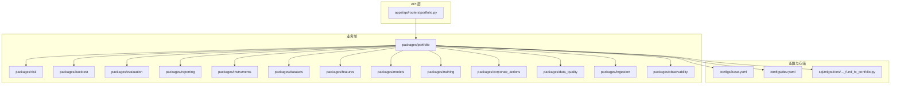
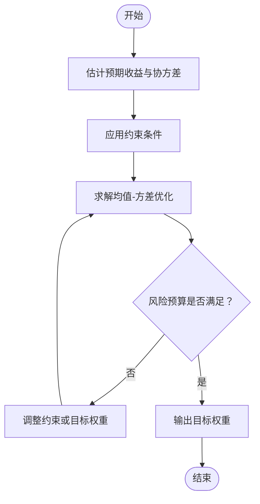
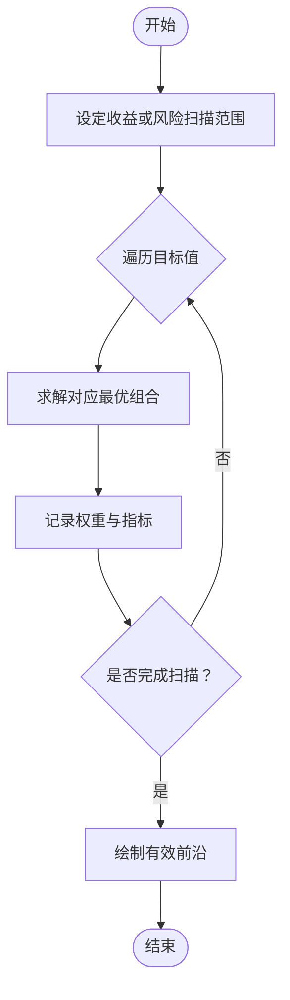
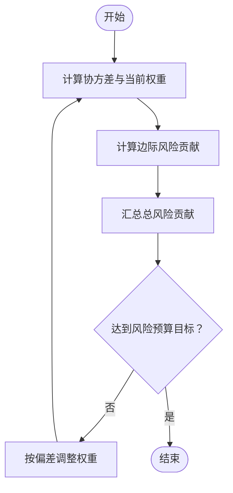
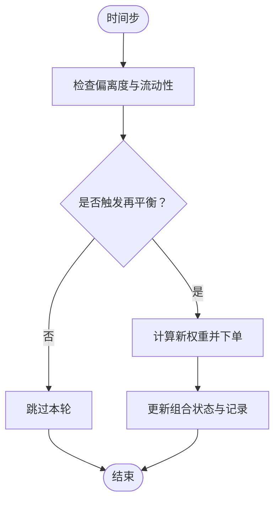
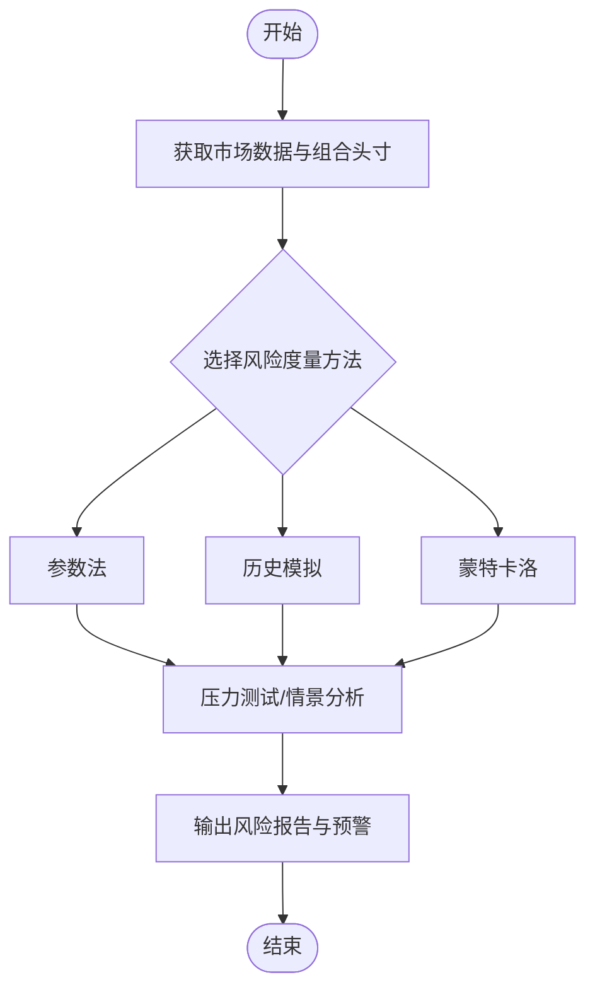
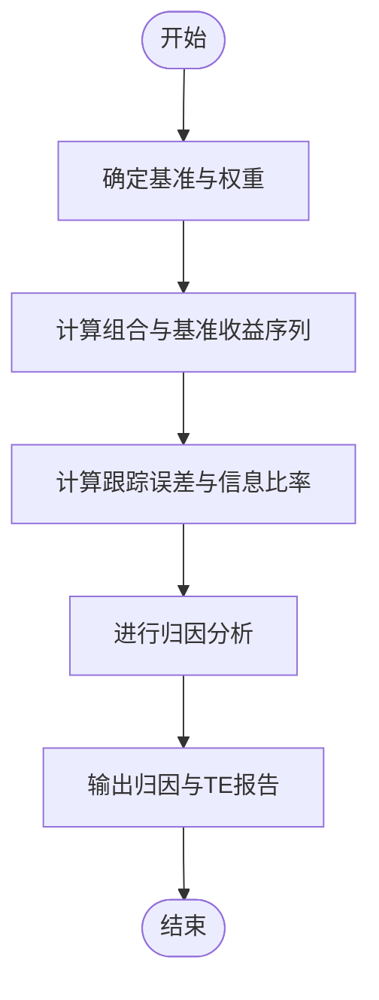
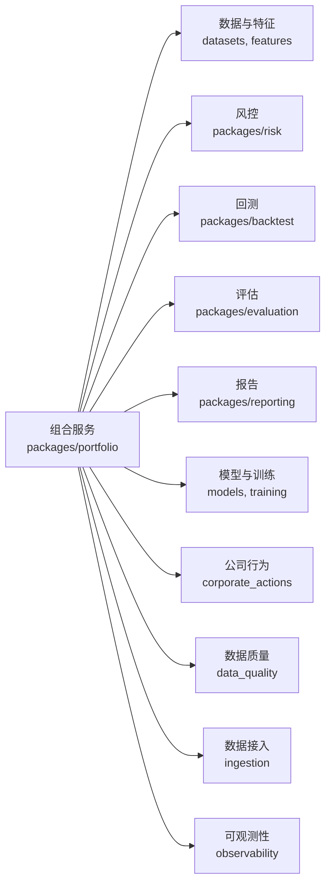

# 组合优化方法

<cite>
**本文引用的文件**   
- [apps/api/routers/portfolio.py](file://apps/api/routers/portfolio.py)
- [packages/portfolio](file://packages/portfolio)
- [packages/risk](file://packages/risk)
- [packages/backtest](file://packages/backtest)
- [packages/evaluation](file://packages/evaluation)
- [packages/reporting](file://packages/reporting)
- [packages/instruments](file://packages/instruments)
- [packages/datasets](file://packages/datasets)
- [packages/features](file://packages/features)
- [packages/models](file://packages/models)
- [packages/training](file://packages/training)
- [packages/corporate_actions](file://packages/corporate_actions)
- [packages/data_quality](file://packages/data_quality)
- [packages/ingestion](file://packages/ingestion)
- [packages/observability](file://packages/observability)
- [configs/base.yaml](file://configs/base.yaml)
- [configs/dev.yaml](file://configs/dev.yaml)
- [sql/migrations/20260715_0006_fund_fx_portfolio.py](file://sql/migrations/20260715_0006_fund_fx_portfolio.py)
</cite>

## 目录
1. [简介](#简介)
2. [项目结构](#项目结构)
3. [核心组件](#核心组件)
4. [架构总览](#架构总览)
5. [详细组件分析](#详细组件分析)
6. [依赖关系分析](#依赖关系分析)
7. [性能考虑](#性能考虑)
8. [故障排查指南](#故障排查指南)
9. [结论](#结论)
10. [附录](#附录)

## 简介
本指南面向量化投资与资产配置实践者，围绕现代投资组合理论（MPT）在工程系统中的落地，系统阐述均值-方差优化、有效前沿构建、风险预算分配、约束条件设置、再平衡策略、风险控制机制（VaR、压力测试、情景分析）、多资产配置方法，以及组合绩效归因与跟踪误差控制。文档结合仓库中“portfolio”“risk”“backtest”“evaluation”“reporting”等模块的职责边界，给出端到端的数据流、处理逻辑与集成点说明，帮助读者将理论转化为可维护、可扩展的工程实现。

## 项目结构
本项目采用分层与按领域划分相结合的组织方式：
- API 层：提供组合相关接口，如组合查询、计算任务触发等
- 业务域包：portfolio（组合管理）、risk（风险管理）、backtest（回测）、evaluation（评估）、reporting（报告）、instruments（标的）、datasets（数据集）、features（特征）、models（模型）、training（训练）、corporate_actions（公司行为）、data_quality（数据质量）、ingestion（数据接入）、observability（可观测性）
- 配置：base.yaml、dev.yaml
- 数据库迁移：包含基金/外汇/组合相关表结构演进



图表来源
- [apps/api/routers/portfolio.py](file://apps/api/routers/portfolio.py)
- [packages/portfolio](file://packages/portfolio)
- [packages/risk](file://packages/risk)
- [packages/backtest](file://packages/backtest)
- [packages/evaluation](file://packages/evaluation)
- [packages/reporting](file://packages/reporting)
- [packages/instruments](file://packages/instruments)
- [packages/datasets](file://packages/datasets)
- [packages/features](file://packages/features)
- [packages/models](file://packages/models)
- [packages/training](file://packages/training)
- [packages/corporate_actions](file://packages/corporate_actions)
- [packages/data_quality](file://packages/data_quality)
- [packages/ingestion](file://packages/ingestion)
- [packages/observability](file://packages/observability)
- [configs/base.yaml](file://configs/base.yaml)
- [configs/dev.yaml](file://configs/dev.yaml)
- [sql/migrations/20260715_0006_fund_fx_portfolio.py](file://sql/migrations/20260715_0006_fund_fx_portfolio.py)

章节来源
- [apps/api/routers/portfolio.py](file://apps/api/routers/portfolio.py)
- [configs/base.yaml](file://configs/base.yaml)
- [configs/dev.yaml](file://configs/dev.yaml)
- [sql/migrations/20260715_0006_fund_fx_portfolio.py](file://sql/migrations/20260715_0006_fund_fx_portfolio.py)

## 核心组件
- 组合服务（portfolio）：负责组合生命周期管理、权重生成与更新、再平衡调度、组合快照与历史追踪
- 风险管理（risk）：提供风险度量（波动率、协方差、VaR、CVaR）、风险预算分解、风险贡献度、压力测试与情景分析
- 回测引擎（backtest）：基于历史数据执行交易模拟、滑点与冲击成本建模、净值曲线与指标统计
- 评估与报告（evaluation/reporting）：绩效归因（Brinson、因子归因）、跟踪误差、信息比率、最大回撤、夏普比率等指标输出
- 标的与数据（instruments/datasets/features）：统一标的标识、行情与基本面数据、特征工程与清洗
- 模型与训练（models/training）：预期收益与协方差估计、机器学习预测、稳健估计与正则化
- 公司行为与数据质量（corporate_actions/data_quality/ingestion）：除权除息、拆合股等事件处理；数据完整性校验与异常检测
- 可观测性（observability）：指标采集、日志与链路追踪，支撑生产稳定性

章节来源
- [packages/portfolio](file://packages/portfolio)
- [packages/risk](file://packages/risk)
- [packages/backtest](file://packages/backtest)
- [packages/evaluation](file://packages/evaluation)
- [packages/reporting](file://packages/reporting)
- [packages/instruments](file://packages/instruments)
- [packages/datasets](file://packages/datasets)
- [packages/features](file://packages/features)
- [packages/models](file://packages/models)
- [packages/training](file://packages/training)
- [packages/corporate_actions](file://packages/corporate_actions)
- [packages/data_quality](file://packages/data_quality)
- [packages/ingestion](file://packages/ingestion)
- [packages/observability](file://packages/observability)

## 架构总览
下图展示从数据接入到组合优化、风控、回测与报告的端到端流程。

```mermaid
sequenceDiagram
participant U as "用户/外部系统"
participant API as "组合API<br/>apps/api/routers/portfolio.py"
participant PORT as "组合服务<br/>packages/portfolio"
participant DATA as "数据与特征<br/>packages/datasets, features"
participant OPT as "优化器<br/>packages/portfolio/optimize"
participant RISK as "风控模块<br/>packages/risk"
participant BT as "回测引擎<br/>packages/backtest"
participant EVAL as "评估与报告<br/>packages/evaluation, reporting"
U->>API : "请求组合优化/再平衡"
API->>PORT : "调用组合服务"
PORT->>DATA : "拉取行情/基本面/公司行为"
PORT->>OPT : "输入约束与目标函数"
OPT-->>PORT : "返回目标权重"
PORT->>RISK : "风险预算/约束校验"
RISK-->>PORT : "通过或调整建议"
PORT->>BT : "可选：回测验证"
BT-->>PORT : "回测结果"
PORT->>EVAL : "生成绩效与风险报告"
EVAL-->>U : "输出优化方案与报告"
```

图表来源
- [apps/api/routers/portfolio.py](file://apps/api/routers/portfolio.py)
- [packages/portfolio](file://packages/portfolio)
- [packages/datasets](file://packages/datasets)
- [packages/features](file://packages/features)
- [packages/risk](file://packages/risk)
- [packages/backtest](file://packages/backtest)
- [packages/evaluation](file://packages/evaluation)
- [packages/reporting](file://packages/reporting)

## 详细组件分析

### 现代投资组合理论与均值-方差优化
- 目标函数：最大化期望效用（如 Sharpe 比率）或最小化组合方差，给定预期收益与协方差矩阵
- 协方差估计：可采用历史窗口、指数加权、结构化降秩或收缩估计以提升稳健性
- 预期收益估计：历史均值、因子模型、机器学习预测或贝叶斯收缩
- 数值求解：二次规划（QP）或凸优化库，需保证协方差半正定与数值稳定



图表来源
- [packages/portfolio](file://packages/portfolio)
- [packages/models](file://packages/models)
- [packages/features](file://packages/features)
- [packages/risk](file://packages/risk)

章节来源
- [packages/portfolio](file://packages/portfolio)
- [packages/models](file://packages/models)
- [packages/features](file://packages/features)
- [packages/risk](file://packages/risk)

### 有效前沿构建
- 方法：固定目标收益求最小方差，或固定风险水平求最大收益，扫描得到前沿曲线
- 实现要点：对每个目标值求解一次优化问题，记录权重与组合指标
- 可视化：横轴为波动率，纵轴为预期收益，标注无风险利率与切线组合



图表来源
- [packages/portfolio](file://packages/portfolio)

章节来源
- [packages/portfolio](file://packages/portfolio)

### 风险预算分配
- 风险贡献：各资产对组合波动率的边际贡献与总贡献分解
- 风险平价：使各资产风险贡献相等或按目标比例分配
- 实施路径：先计算协方差与权重，再迭代调整权重以满足风险预算约束



图表来源
- [packages/risk](file://packages/risk)
- [packages/portfolio](file://packages/portfolio)

章节来源
- [packages/risk](file://packages/risk)
- [packages/portfolio](file://packages/portfolio)

### 约束条件设置
- 权重限制：单券上下限、行业/风格暴露上限、现金比例、做空限制
- 流动性要求：日均成交量阈值、换手率上限、冲击成本惩罚项
- 合规与风控：行业集中度、久期/信用暴露、VaR/CVaR 上限
- 实现建议：将约束表达为线性/二次不等式，必要时引入惩罚项以软约束形式纳入目标函数

章节来源
- [packages/portfolio](file://packages/portfolio)
- [packages/risk](file://packages/risk)

### 再平衡策略
- 定期再平衡：按日/周/月周期执行，适合趋势与均值回归策略的纪律性
- 阈值触发再平衡：当偏离目标权重超过阈值时触发，降低交易成本
- 动态调整：根据市场波动、流动性与交易成本自适应调整再平衡频率与幅度



图表来源
- [packages/portfolio](file://packages/portfolio)

章节来源
- [packages/portfolio](file://packages/portfolio)

### 风险控制机制
- VaR 与 CVaR：参数法、历史模拟与蒙特卡洛三种路径，注意尾部风险与相关性突变
- 压力测试与情景分析：宏观冲击、流动性枯竭、信用利差走阔等场景下的组合表现
- 实时风控：盘中监控风险敞口与限额，超限自动减仓或暂停交易



图表来源
- [packages/risk](file://packages/risk)

章节来源
- [packages/risk](file://packages/risk)

### 多资产组合优化
- 资产类别：股票、债券、商品、外汇、另类资产
- 配置方法：跨资产协方差建模、滚动窗口与分位数回归、因子驱动配置
- 数据治理：不同市场日历、汇率换算、分红派息与合约展期处理

章节来源
- [packages/instruments](file://packages/instruments)
- [packages/datasets](file://packages/datasets)
- [packages/corporate_actions](file://packages/corporate_actions)
- [sql/migrations/20260715_0006_fund_fx_portfolio.py](file://sql/migrations/20260715_0006_fund_fx_portfolio.py)

### 组合绩效归因与跟踪误差控制
- 归因框架：Brinson 归因（配置/择券/交互效应）、因子归因（风格/行业/动量等）
- 跟踪误差：组合与基准的日收益率标准差，目标 TE 下优化权重
- 信息比率：超额收益与跟踪误差之比，作为相对收益效率指标



图表来源
- [packages/evaluation](file://packages/evaluation)
- [packages/reporting](file://packages/reporting)

章节来源
- [packages/evaluation](file://packages/evaluation)
- [packages/reporting](file://packages/reporting)

## 依赖关系分析
- 组合服务依赖数据与特征模块提供清洗后的收益序列与协方差估计
- 风控模块依赖组合权重与协方差矩阵，输出风险预算与限额校验
- 回测与评估模块依赖组合交易信号与成交数据，产出绩效与风险指标
- 模型与训练模块提供预期收益与协方差的稳健估计
- 公司行为与数据质量模块保障数据一致性与准确性
- 可观测性模块贯穿全链路，便于定位问题与性能调优



图表来源
- [packages/portfolio](file://packages/portfolio)
- [packages/datasets](file://packages/datasets)
- [packages/features](file://packages/features)
- [packages/risk](file://packages/risk)
- [packages/backtest](file://packages/backtest)
- [packages/evaluation](file://packages/evaluation)
- [packages/reporting](file://packages/reporting)
- [packages/models](file://packages/models)
- [packages/training](file://packages/training)
- [packages/corporate_actions](file://packages/corporate_actions)
- [packages/data_quality](file://packages/data_quality)
- [packages/ingestion](file://packages/ingestion)
- [packages/observability](file://packages/observability)

章节来源
- [packages/portfolio](file://packages/portfolio)
- [packages/risk](file://packages/risk)
- [packages/backtest](file://packages/backtest)
- [packages/evaluation](file://packages/evaluation)
- [packages/reporting](file://packages/reporting)
- [packages/instruments](file://packages/instruments)
- [packages/datasets](file://packages/datasets)
- [packages/features](file://packages/features)
- [packages/models](file://packages/models)
- [packages/training](file://packages/training)
- [packages/corporate_actions](file://packages/corporate_actions)
- [packages/data_quality](file://packages/data_quality)
- [packages/ingestion](file://packages/ingestion)
- [packages/observability](file://packages/observability)

## 性能考虑
- 协方差估计：使用指数加权与收缩技术降低噪声，提升样本外稳定性
- 优化求解：采用稀疏约束与热启动，减少重复求解开销
- 批量计算：向量化与并行化协方差与风险贡献计算
- 内存与I/O：增量更新与缓存高频中间结果，避免重复读取
- 监控与告警：关键指标（耗时、失败率、数据缺失率）纳入可观测性体系

[本节为通用指导，不直接分析具体文件]

## 故障排查指南
- 数据问题：检查数据接入与质量模块的缺失值、异常值与一致性校验
- 优化失败：确认协方差矩阵半正定性、约束可行性与求解器收敛状态
- 风险超限：复核风险预算与限额配置，检查压力测试情景定义
- 回测不一致：核对公司行为处理、复权与汇率换算逻辑
- 性能瓶颈：利用可观测性模块定位热点函数与I/O等待

章节来源
- [packages/data_quality](file://packages/data_quality)
- [packages/ingestion](file://packages/ingestion)
- [packages/portfolio](file://packages/portfolio)
- [packages/risk](file://packages/risk)
- [packages/backtest](file://packages/backtest)
- [packages/observability](file://packages/observability)

## 结论
通过将 MPT 的核心思想（均值-方差、有效前沿、风险预算）与工程化的数据、模型、风控、回测与报告模块有机结合，可在多资产环境下实现稳健的组合优化与持续改进。关键在于：高质量数据与稳健估计、合理的约束与风险预算、严格的回测与评估闭环，以及完善的可观测性与故障排查机制。

[本节为总结性内容，不直接分析具体文件]

## 附录
- 配置建议：在 base.yaml 与 dev.yaml 中区分默认与开发环境的风险限额、再平衡阈值与回测参数
- 数据库演进：关注 fund/fx/portfolio 相关迁移脚本，确保资产与组合字段对齐
- 最佳实践：滚动窗口与分位数估计、因子模型辅助收益预测、交易成本与冲击成本内生化

章节来源
- [configs/base.yaml](file://configs/base.yaml)
- [configs/dev.yaml](file://configs/dev.yaml)
- [sql/migrations/20260715_0006_fund_fx_portfolio.py](file://sql/migrations/20260715_0006_fund_fx_portfolio.py)