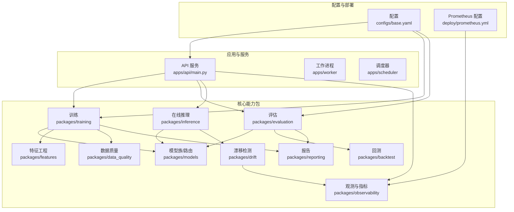
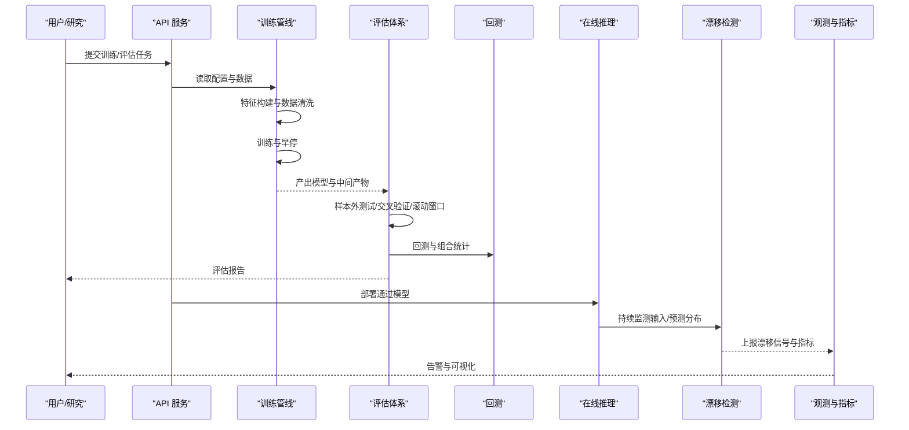
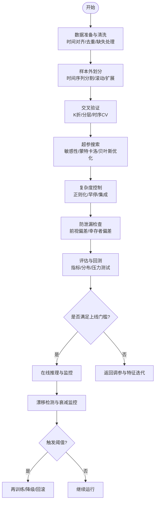
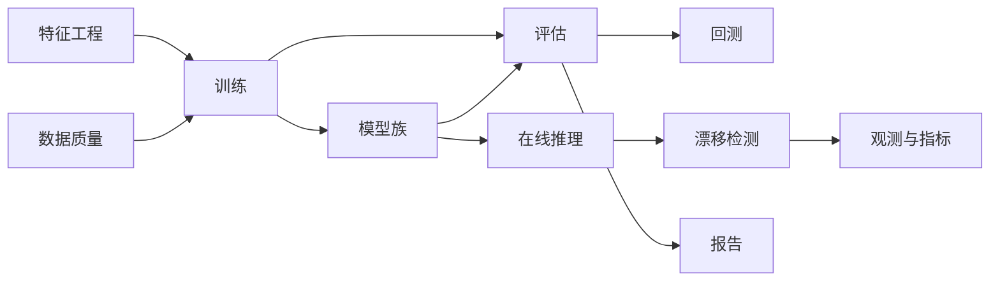

# 过拟合防范策略

<cite>
**本文引用的文件**   
- [apps/api/main.py](file://apps/api/main.py)
- [packages/training/__init__.py](file://packages/training/__init__.py)
- [packages/models/__init__.py](file://packages/models/__init__.py)
- [packages/evaluation/__init__.py](file://packages/evaluation/__init__.py)
- [packages/drift/__init__.py](file://packages/drift/__init__.py)
- [packages/features/__init__.py](file://packages/features/__init__.py)
- [packages/data_quality/__init__.py](file://packages/data_quality/__init__.py)
- [packages/backtest/__init__.py](file://packages/backtest/__init__.py)
- [packages/inference/__init__.py](file://packages/inference/__init__.py)
- [packages/reporting/__init__.py](file://packages/reporting/__init__.py)
- [packages/observability/__init__.py](file://packages/observability/__init__.py)
- [configs/base.yaml](file://configs/base.yaml)
- [deploy/prometheus.yml](file://deploy/prometheus.yml)
</cite>

## 目录
1. [引言](#引言)
2. [项目结构](#项目结构)
3. [核心组件](#核心组件)
4. [架构总览](#架构总览)
5. [详细组件分析](#详细组件分析)
6. [依赖分析](#依赖分析)
7. [性能考虑](#性能考虑)
8. [故障排查指南](#故障排查指南)
9. [结论](#结论)
10. [附录](#附录)

## 引言
本指南聚焦于量化系统中的“过拟合防范”，围绕样本外测试、交叉验证、参数稳定性检验、模型复杂度控制、数据泄露防范以及模型验证与性能衰减监控，提供可落地的策略与实践建议。文档结合仓库中的训练、评估、漂移检测、特征工程、回测、推理与观测等模块，给出端到端的流程设计与落地要点，帮助在真实市场环境下稳健地推进模型研发与上线。

## 项目结构
本项目采用模块化分层组织：应用层（API）、工作进程与调度、配置与部署，以及多个业务包（训练、模型、评估、漂移、特征、数据质量、回测、推理、报告、观测等）。与过拟合防范直接相关的核心路径包括：
- 训练与评估：packages/training、packages/evaluation
- 模型族与路由：packages/models
- 特征工程与数据质量：packages/features、packages/data_quality
- 漂移检测与监控：packages/drift、packages/observability
- 回测与推理：packages/backtest、packages/inference
- 报告与可视化：packages/reporting
- 配置与指标采集：configs、deploy

图表来源
- [apps/api/main.py](file://apps/api/main.py)
- [packages/training/__init__.py](file://packages/training/__init__.py)
- [packages/evaluation/__init__.py](file://packages/evaluation/__init__.py)
- [packages/models/__init__.py](file://packages/models/__init__.py)
- [packages/features/__init__.py](file://packages/features/__init__.py)
- [packages/data_quality/__init__.py](file://packages/data_quality/__init__.py)
- [packages/drift/__init__.py](file://packages/drift/__init__.py)
- [packages/backtest/__init__.py](file://packages/backtest/__init__.py)
- [packages/inference/__init__.py](file://packages/inference/__init__.py)
- [packages/reporting/__init__.py](file://packages/reporting/__init__.py)
- [packages/observability/__init__.py](file://packages/observability/__init__.py)
- [configs/base.yaml](file://configs/base.yaml)
- [deploy/prometheus.yml](file://deploy/prometheus.yml)

章节来源
- [apps/api/main.py](file://apps/api/main.py)
- [configs/base.yaml](file://configs/base.yaml)
- [deploy/prometheus.yml](file://deploy/prometheus.yml)

## 核心组件
- 训练管线（Training）：负责数据准备、特征构建、模型训练、超参搜索、早停与日志记录。
- 评估体系（Evaluation）：负责样本外测试、交叉验证、滚动/扩展窗口评估、指标汇总与报告生成。
- 模型族（Models）：封装不同算法族与路由选择，支持正则化、集成与多目标优化接口。
- 特征工程（Features）：实现前视偏差控制、缺失值处理、标准化/归一化、时间对齐与去重。
- 数据质量（Data Quality）：校验数据完整性、异常值检测、重复与冲突处理。
- 漂移检测（Drift）：监测输入分布与预测分布变化，触发告警与再训练。
- 回测（Backtest）：模拟交易执行、滑点与手续费、组合风险与收益统计。
- 在线推理（Inference）：加载已验证模型，进行低延迟预测并输出置信区间。
- 报告（Reporting）：将评估结果、漂移信号与性能衰减趋势沉淀为可审计的报告。
- 观测（Observability）：暴露系统指标、错误率、延迟与资源使用，对接监控系统。

章节来源
- [packages/training/__init__.py](file://packages/training/__init__.py)
- [packages/evaluation/__init__.py](file://packages/evaluation/__init__.py)
- [packages/models/__init__.py](file://packages/models/__init__.py)
- [packages/features/__init__.py](file://packages/features/__init__.py)
- [packages/data_quality/__init__.py](file://packages/data_quality/__init__.py)
- [packages/drift/__init__.py](file://packages/drift/__init__.py)
- [packages/backtest/__init__.py](file://packages/backtest/__init__.py)
- [packages/inference/__init__.py](file://packages/inference/__init__.py)
- [packages/reporting/__init__.py](file://packages/reporting/__init__.py)
- [packages/observability/__init__.py](file://packages/observability/__init__.py)

## 架构总览
下图展示从数据到训练、评估、回测、推理与监控的闭环流程，强调样本外测试与防泄漏的关键节点。

图表来源
- [apps/api/main.py](file://apps/api/main.py)
- [packages/training/__init__.py](file://packages/training/__init__.py)
- [packages/evaluation/__init__.py](file://packages/evaluation/__init__.py)
- [packages/backtest/__init__.py](file://packages/backtest/__init__.py)
- [packages/inference/__init__.py](file://packages/inference/__init__.py)
- [packages/drift/__init__.py](file://packages/drift/__init__.py)
- [packages/observability/__init__.py](file://packages/observability/__init__.py)

## 详细组件分析

### 样本外测试方法
- 时间序列分割
  - 原则：严格保持时间顺序，训练集必须早于验证/测试集，避免未来信息泄露。
  - 实践：按交易日划分，确保事件（如财报发布、除权除息）前后一致；对停牌、涨跌停做特殊处理。
- 滚动窗口验证（Walk-Forward）
  - 原则：固定长度训练窗口向前滚动，逐步扩大或滑动测试窗口，贴近真实增量学习场景。
  - 实践：设置最小训练期与步长，记录每段性能分布，关注尾部表现与极端行情。
- 扩展样本测试（Expanding Window）
  - 原则：训练窗口不断累积，测试窗口向后移动，适合长期容量与稳定性评估。
  - 实践：对比滚动与扩展窗口的差异，识别短期过拟合与长期退化。

章节来源
- [packages/evaluation/__init__.py](file://packages/evaluation/__init__.py)
- [packages/backtest/__init__.py](file://packages/backtest/__init__.py)

### 交叉验证技术
- K折交叉验证
  - 适用：横截面或独立同分布假设较强的场景；需打乱时注意时间相关性。
  - 要点：分层抽样保证类别比例稳定；对强自相关数据谨慎使用。
- 分层抽样
  - 适用：标签不均衡（如涨跌分类）；按行业/市值/流动性分层提升代表性。
- 时间序列交叉验证
  - 适用：金融时序；基于时间切片的嵌套循环，外层为时间段，内层为调参。
  - 要点：防止跨期信息泄露，统一特征计算口径与对齐规则。

章节来源
- [packages/evaluation/__init__.py](file://packages/evaluation/__init__.py)

### 参数稳定性检验
- 参数敏感性分析
  - 做法：对关键超参进行网格/随机扫描，绘制响应曲面，识别平坦区与敏感区。
  - 决策：优先选择鲁棒区域，避免尖峰解。
- 蒙特卡洛模拟
  - 做法：对噪声、缺失、异常注入扰动，评估指标方差与分位数，衡量稳定性。
  - 决策：以中位数与下四分位作为上线门槛。
- 贝叶斯优化
  - 做法：以期望改进为 Acquisition Function，高效探索高维空间，收敛至稳定最优。
  - 决策：结合早停与早退策略，减少无效迭代。

章节来源
- [packages/training/__init__.py](file://packages/training/__init__.py)
- [packages/evaluation/__init__.py](file://packages/evaluation/__init__.py)

### 模型复杂度控制
- 正则化技术
  - L1/L2、Dropout、早停、权重衰减、约束条件（单调性、凸性）等。
  - 目标：降低方差，提高泛化，抑制记忆噪声。
- 早停机制
  - 依据：验证集损失/指标不再改善；耐心阈值与最小轮次保护。
  - 恢复：保存最佳权重，避免局部最优陷阱。
- 集成学习方法
  - Bagging/Boosting/Stacking：分散单模型风险，平滑波动，增强稳健性。
  - 多样性：不同模型族、特征子集、训练切片，提升互补性。

章节来源
- [packages/models/__init__.py](file://packages/models/__init__.py)
- [packages/training/__init__.py](file://packages/training/__init__.py)

### 数据泄露防范措施
- 信息泄漏检测
  - 检查：是否使用了未来信息（如收盘价参与当日特征）、全局统计量泄露（用全样本均值/方差）。
  - 工具：特征重要性突变、零误差、异常高的样本外一致性。
- 前视偏差控制
  - 规则：所有特征必须在t时刻可用；事件驱动型数据需精确对齐发布时间戳。
  - 处理：填充策略仅使用历史窗口；滚动统计窗口严格限定。
- 幸存者偏差处理
  - 问题：退市、停牌、复权导致样本选择性偏差。
  - 对策：纳入退市样本、使用存活者与非存活者联合估计、加权修正。

章节来源
- [packages/features/__init__.py](file://packages/features/__init__.py)
- [packages/data_quality/__init__.py](file://packages/data_quality/__init__.py)

### 模型验证流程与性能衰减监控
- 验证流程
  - 离线：K折/时间序列CV → 滚动/扩展窗口 → 回测 → 报告归档。
  - 在线：灰度发布 → A/B 或影子流量 → 指标对比 → 放量或回滚。
- 性能衰减监控
  - 指标：IC/IR、夏普、最大回撤、换手率、滑点成本、命中率。
  - 信号：漂移检测、指标分位数跌破阈值、回测-实盘偏离过大。
  - 动作：触发再训练、降权/停用、参数回滚、人工复核。

图表来源
- [packages/training/__init__.py](file://packages/training/__init__.py)
- [packages/evaluation/__init__.py](file://packages/evaluation/__init__.py)
- [packages/features/__init__.py](file://packages/features/__init__.py)
- [packages/data_quality/__init__.py](file://packages/data_quality/__init__.py)
- [packages/drift/__init__.py](file://packages/drift/__init__.py)
- [packages/inference/__init__.py](file://packages/inference/__init__.py)
- [packages/reporting/__init__.py](file://packages/reporting/__init__.py)

## 依赖分析
- 训练依赖特征与数据质量模块，确保输入一致性与无泄漏。
- 评估依赖模型族与回测，形成从预测到组合层面的闭环。
- 推理依赖模型与漂移检测，保障在线稳定性。
- 观测与报告贯穿全流程，提供可审计证据与告警。

图表来源
- [packages/features/__init__.py](file://packages/features/__init__.py)
- [packages/data_quality/__init__.py](file://packages/data_quality/__init__.py)
- [packages/training/__init__.py](file://packages/training/__init__.py)
- [packages/models/__init__.py](file://packages/models/__init__.py)
- [packages/evaluation/__init__.py](file://packages/evaluation/__init__.py)
- [packages/backtest/__init__.py](file://packages/backtest/__init__.py)
- [packages/inference/__init__.py](file://packages/inference/__init__.py)
- [packages/drift/__init__.py](file://packages/drift/__init__.py)
- [packages/reporting/__init__.py](file://packages/reporting/__init__.py)
- [packages/observability/__init__.py](file://packages/observability/__init__.py)

## 性能考虑
- 计算效率：批处理与并行训练、缓存中间特征、增量更新。
- 内存管理：流式读取大表、分块计算、及时释放临时对象。
- I/O 优化：列式存储、索引设计、冷热数据分层。
- 监控开销：采样与聚合、异步上报、指标降采样。

[本节为通用指导，无需特定文件引用]

## 故障排查指南
- 常见症状
  - 样本外大幅退化、回测与实盘显著偏离、指标剧烈波动。
- 定位步骤
  - 检查特征时间对齐与填充策略，确认无未来信息。
  - 核查数据质量与事件处理（停牌、涨跌停、复权）。
  - 审查交叉验证与滚动窗口划分逻辑，避免跨期泄漏。
  - 查看漂移信号与指标分位数，判断是否触发再训练。
- 处置建议
  - 回归保守正则化与集成方案，缩短训练窗口，增加噪声扰动。
  - 下线高风险因子/模型，灰度放量并加强监控。

章节来源
- [packages/drift/__init__.py](file://packages/drift/__init__.py)
- [packages/observability/__init__.py](file://packages/observability/__init__.py)
- [packages/reporting/__init__.py](file://packages/reporting/__init__.py)

## 结论
过拟合防范需要贯穿数据、特征、训练、评估、回测、推理与监控的全链路治理。通过严格的样本外测试与交叉验证、稳健的参数稳定性检验、合理的复杂度控制与完善的防泄漏措施，配合持续的漂移检测与性能衰减监控，可在复杂多变的市场环境中显著提升模型的稳健性与可部署性。

[本节为总结性内容，无需特定文件引用]

## 附录
- 配置要点
  - 训练与评估参数、早停与正则化强度、滚动/扩展窗口长度、漂移阈值与告警级别。
- 指标定义
  - IC/IR、夏普比率、最大回撤、换手率、滑点成本、命中率、漂移指数等。
- 参考规范
  - 内部技能与模板：用于报告与风险评估的统一格式与审计要求。

章节来源
- [configs/base.yaml](file://configs/base.yaml)
- [deploy/prometheus.yml](file://deploy/prometheus.yml)