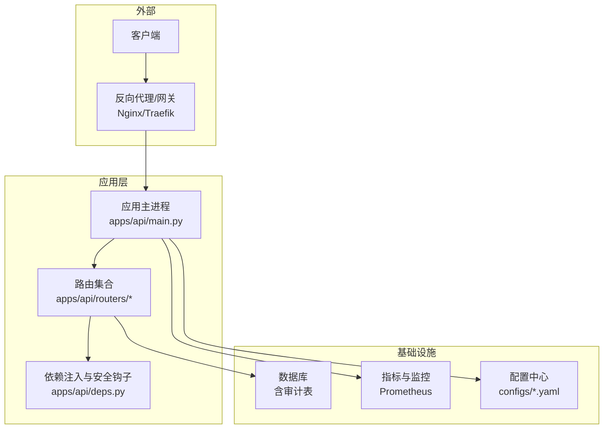
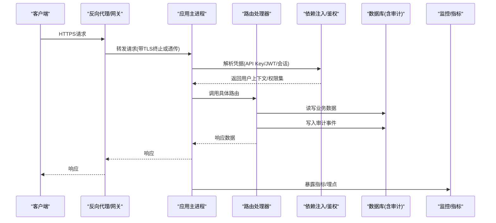
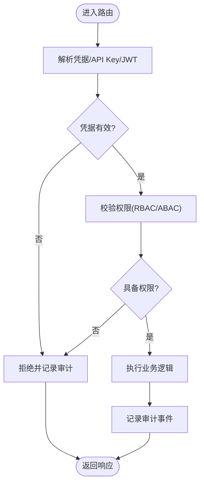
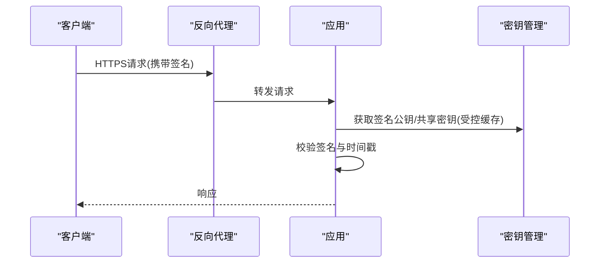
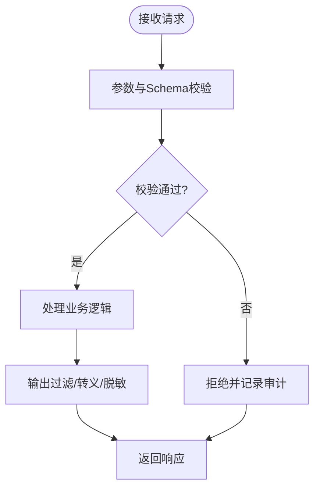
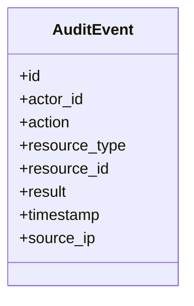
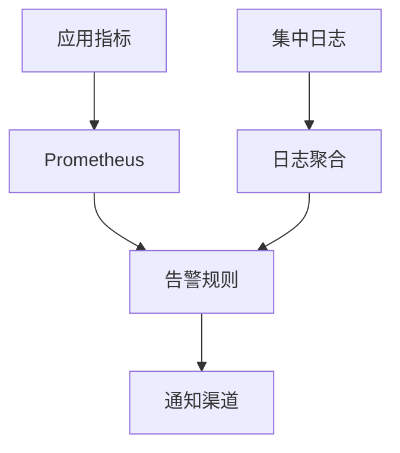
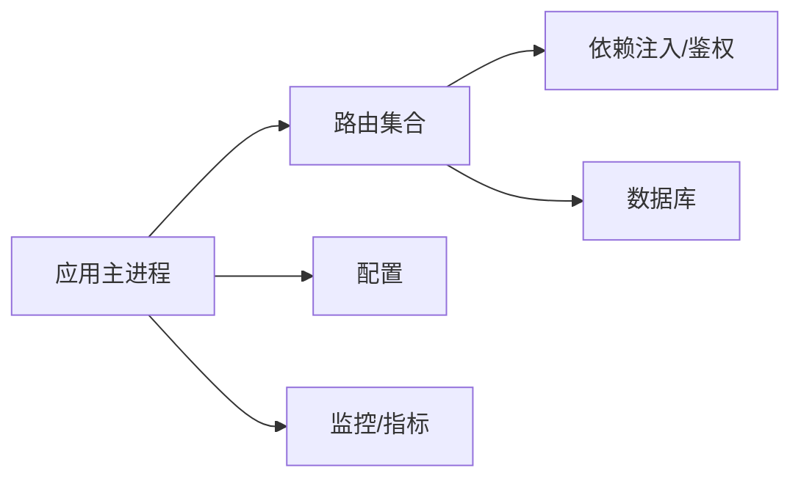

# 安全架构

<cite>
**本文引用的文件**   
- [apps/api/main.py](file://apps/api/main.py)
- [apps/api/deps.py](file://apps/api/deps.py)
- [apps/api/routers/__init__.py](file://apps/api/routers/__init__.py)
- [apps/api/routers/admin_ingestion.py](file://apps/api/routers/admin_ingestion.py)
- [apps/api/routers/data_status.py](file://apps/api/routers/data_status.py)
- [apps/api/routers/forecast.py](file://apps/api/routers/forecast.py)
- [apps/api/routers/fundamentals.py](file://apps/api/routers/fundamentals.py)
- [apps/api/routers/instruments.py](file://apps/api/routers/instruments.py)
- [apps/api/routers/markets.py](file://apps/api/routers/markets.py)
- [apps/api/routers/portfolio.py](file://apps/api/routers/portfolio.py)
- [apps/api/routers/scheduler.py](file://apps/api/routers/scheduler.py)
- [configs/base.yaml](file://configs/base.yaml)
- [configs/dev.yaml](file://configs/dev.yaml)
- [deploy/docker-compose.yml](file://deploy/docker-compose.yml)
- [deploy/prometheus.yml](file://deploy/prometheus.yml)
- [sql/migrations/20260715_0002_audit_events.py](file://sql/migrations/20260715_0002_audit_events.py)
- [packages/observability](file://packages/observability)
- [tests/unit/test_api_health.py](file://tests/unit/test_api_health.py)
</cite>

## 目录
1. [引言](#引言)
2. [项目结构](#项目结构)
3. [核心组件](#核心组件)
4. [架构总览](#架构总览)
5. [详细组件分析](#详细组件分析)
6. [依赖分析](#依赖分析)
7. [性能考虑](#性能考虑)
8. [故障排查指南](#故障排查指南)
9. [结论](#结论)
10. [附录](#附录)

## 引言
本文件面向量化数据与交易系统的“安全架构设计”，围绕身份认证与授权、API密钥管理、权限控制模型、数据传输安全（HTTPS、加密、签名）、输入验证与输出过滤、敏感信息保护（配置加密、密钥管理、日志脱敏）、安全审计与合规检查、威胁分析与防护策略（SQL注入、XSS、DDoS等）、以及安全监控与告警机制进行系统化说明。文档在给出通用最佳实践的同时，结合仓库中现有代码与部署配置，指出当前实现位置与可落地的增强点。

## 项目结构
从安全视角看，系统由以下关键层次组成：
- API网关与应用层：FastAPI应用入口、路由注册、依赖注入与安全中间件挂载点。
- 业务路由层：各功能域的路由模块，承载鉴权与访问控制的接入点。
- 配置与部署层：YAML配置与Docker Compose编排，提供环境变量、证书与反向代理集成。
- 可观测性与审计层：指标采集、日志与审计事件存储（迁移脚本定义审计表）。
- 测试层：健康检查与基础安全用例。

图表来源
- [apps/api/main.py](file://apps/api/main.py)
- [apps/api/routers/__init__.py](file://apps/api/routers/__init__.py)
- [deploy/docker-compose.yml](file://deploy/docker-compose.yml)
- [deploy/prometheus.yml](file://deploy/prometheus.yml)
- [configs/base.yaml](file://configs/base.yaml)
- [configs/dev.yaml](file://configs/dev.yaml)
- [sql/migrations/20260715_0002_audit_events.py](file://sql/migrations/20260715_0002_audit_events.py)

章节来源
- [apps/api/main.py](file://apps/api/main.py)
- [apps/api/routers/__init__.py](file://apps/api/routers/__init__.py)
- [deploy/docker-compose.yml](file://deploy/docker-compose.yml)
- [deploy/prometheus.yml](file://deploy/prometheus.yml)
- [configs/base.yaml](file://configs/base.yaml)
- [configs/dev.yaml](file://configs/dev.yaml)
- [sql/migrations/20260715_0002_audit_events.py](file://sql/migrations/20260715_0002_audit_events.py)

## 核心组件
- 应用入口与全局安全配置
  - 应用启动、中间件注册、CORS、请求体大小限制、健康检查端点等通常在应用主文件中完成。建议在此集中挂载统一的安全中间件（如速率限制、请求签名校验、审计拦截器）。
- 路由与依赖注入
  - 路由按领域划分，依赖注入用于解析用户上下文、API密钥、权限令牌等。建议在依赖层实现统一的鉴权与授权钩子。
- 配置与部署
  - YAML配置用于区分环境；Docker Compose负责服务编排与证书挂载；Prometheus用于指标采集。
- 审计与可观测性
  - 通过数据库迁移创建审计事件表；配合指标与日志收集形成闭环。

章节来源
- [apps/api/main.py](file://apps/api/main.py)
- [apps/api/deps.py](file://apps/api/deps.py)
- [apps/api/routers/__init__.py](file://apps/api/routers/__init__.py)
- [configs/base.yaml](file://configs/base.yaml)
- [configs/dev.yaml](file://configs/dev.yaml)
- [deploy/docker-compose.yml](file://deploy/docker-compose.yml)
- [deploy/prometheus.yml](file://deploy/prometheus.yml)
- [sql/migrations/20260715_0002_audit_events.py](file://sql/migrations/20260715_0002_audit_events.py)

## 架构总览
下图展示端到端的安全边界与控制点：外部流量经反向代理进入应用，应用层对请求进行认证、授权、输入校验与审计记录，再访问后端资源。

图表来源
- [apps/api/main.py](file://apps/api/main.py)
- [apps/api/deps.py](file://apps/api/deps.py)
- [apps/api/routers/__init__.py](file://apps/api/routers/__init__.py)
- [sql/migrations/20260715_0002_audit_events.py](file://sql/migrations/20260715_0002_audit_events.py)
- [deploy/prometheus.yml](file://deploy/prometheus.yml)

## 详细组件分析

### 身份认证与授权机制
- 用户身份验证
  - 建议支持多因子认证（MFA）与短期令牌（JWT），并在依赖注入层统一解析与校验。
  - 会话状态应无状态化，避免服务端会话存储成为单点风险。
- API密钥管理
  - 为每个调用方分配唯一API Key，采用HMAC-SHA256签名+时间戳防重放；密钥轮换与最小权限原则。
  - 将密钥存储在受控的密钥管理服务（KMS）或环境变量中，禁止硬编码。
- 权限控制模型
  - 基于角色的访问控制（RBAC）或属性基访问控制（ABAC），在路由层声明式校验所需角色/资源/操作。
  - 对管理员接口（如数据导入）实施强鉴权与额外审批流。

图表来源
- [apps/api/deps.py](file://apps/api/deps.py)
- [apps/api/routers/admin_ingestion.py](file://apps/api/routers/admin_ingestion.py)
- [sql/migrations/20260715_0002_audit_events.py](file://sql/migrations/20260715_0002_audit_events.py)

章节来源
- [apps/api/deps.py](file://apps/api/deps.py)
- [apps/api/routers/admin_ingestion.py](file://apps/api/routers/admin_ingestion.py)
- [sql/migrations/20260715_0002_audit_events.py](file://sql/migrations/20260715_0002_audit_events.py)

### 数据传输安全（HTTPS、加密、签名）
- HTTPS配置
  - 在生产环境中强制HTTPS，关闭弱密码套件与旧版协议；使用反向代理终止TLS并启用HSTS。
  - 容器编排中将证书以只读卷挂载，避免镜像内嵌私钥。
- 数据加密
  - 传输层TLS已覆盖；对静态敏感数据（如PII、密钥材料）使用AES-GCM等算法加密存储。
- 签名验证
  - 对外API采用请求签名（HMAC）+时间戳+随机数，服务端校验签名与时间窗口，防止篡改与重放。

图表来源
- [deploy/docker-compose.yml](file://deploy/docker-compose.yml)
- [deploy/prometheus.yml](file://deploy/prometheus.yml)

章节来源
- [deploy/docker-compose.yml](file://deploy/docker-compose.yml)
- [deploy/prometheus.yml](file://deploy/prometheus.yml)

### 输入验证与输出过滤
- 输入验证
  - 对所有入参进行白名单校验、类型与范围约束、长度限制与格式校验；优先使用结构化Schema校验。
  - 针对批量导入与复杂JSON，增加深度限制与递归保护。
- 输出过滤
  - 对返回字段进行最小化披露；对富文本输出进行HTML转义与内容安全策略（CSP）约束。
  - 错误响应不包含堆栈与内部路径，仅返回必要提示与追踪ID。

章节来源
- [apps/api/routers/admin_ingestion.py](file://apps/api/routers/admin_ingestion.py)
- [apps/api/routers/data_status.py](file://apps/api/routers/data_status.py)
- [apps/api/routers/forecast.py](file://apps/api/routers/forecast.py)
- [apps/api/routers/fundamentals.py](file://apps/api/routers/fundamentals.py)
- [apps/api/routers/instruments.py](file://apps/api/routers/instruments.py)
- [apps/api/routers/markets.py](file://apps/api/routers/markets.py)
- [apps/api/routers/portfolio.py](file://apps/api/routers/portfolio.py)
- [apps/api/routers/scheduler.py](file://apps/api/routers/scheduler.py)

### 敏感信息保护（配置加密、密钥管理、日志脱敏）
- 配置加密
  - 敏感配置（数据库口令、第三方密钥）通过KMS解密后注入环境变量；配置文件不直接包含明文。
- 密钥管理
  - 使用独立密钥管理服务，定期轮换；应用侧缓存最小生命周期。
- 日志脱敏
  - 对日志中的敏感字段（口令、Token、卡号、手机号）进行掩码或丢弃；确保审计日志保留必要上下文但不泄露敏感值。

章节来源
- [configs/base.yaml](file://configs/base.yaml)
- [configs/dev.yaml](file://configs/dev.yaml)
- [deploy/docker-compose.yml](file://deploy/docker-compose.yml)

### 安全审计与合规性检查
- 审计事件
  - 通过数据库迁移定义审计事件表，记录主体、动作、资源、结果、时间戳与来源IP等。
- 合规检查
  - 在关键路径插入合规断言（如数据访问最小化、导出审批、变更留痕），并生成可审计报表。
- 不可抵赖性
  - 审计事件追加写且防篡改，必要时引入数字签名或WORM存储。

图表来源
- [sql/migrations/20260715_0002_audit_events.py](file://sql/migrations/20260715_0002_audit_events.py)

章节来源
- [sql/migrations/20260715_0002_audit_events.py](file://sql/migrations/20260715_0002_audit_events.py)

### 安全威胁分析与防护策略
- SQL注入
  - 使用参数化查询与ORM；禁止拼接SQL；对动态排序/过滤进行白名单映射。
- XSS攻击
  - 前端输出转义；设置CSP；禁用危险HTML标签；对富文本输入进行严格清洗。
- DDoS防护
  - 在反向代理层限流与连接数限制；应用层对热点接口做速率限制与熔断；异常流量自动隔离。
- 越权访问
  - 强制服务端二次校验资源归属；细粒度授权；对批量操作增加审批与阈值。
- 供应链与依赖漏洞
  - 锁定依赖版本；定期扫描CVE；最小化镜像与运行时依赖。

[本节为通用安全指导，不直接分析具体文件]

### 安全监控与告警机制
- 指标与日志
  - 暴露健康检查与自定义指标（认证失败率、授权拒绝、审计事件计数、错误率、延迟分位）。
  - 集中日志采集，关联追踪ID，便于溯源。
- 告警规则
  - 认证失败突增、异常高延迟、大量4xx/5xx、审计事件异常模式触发告警。
- 可视化与演练
  - 仪表盘展示关键安全指标；定期进行红蓝对抗与演练。

图表来源
- [deploy/prometheus.yml](file://deploy/prometheus.yml)
- [tests/unit/test_api_health.py](file://tests/unit/test_api_health.py)

章节来源
- [deploy/prometheus.yml](file://deploy/prometheus.yml)
- [tests/unit/test_api_health.py](file://tests/unit/test_api_health.py)

## 依赖分析
- 组件耦合
  - 应用主进程依赖路由与依赖注入层；路由依赖业务仓储与服务；所有组件共同依赖配置与可观测性。
- 外部依赖
  - 反向代理/网关、数据库、指标采集系统、密钥管理服务。
- 潜在循环依赖
  - 路由不应反向依赖应用主进程；依赖注入层应保持无副作用的纯解析逻辑。

图表来源
- [apps/api/main.py](file://apps/api/main.py)
- [apps/api/routers/__init__.py](file://apps/api/routers/__init__.py)
- [apps/api/deps.py](file://apps/api/deps.py)
- [configs/base.yaml](file://configs/base.yaml)
- [deploy/prometheus.yml](file://deploy/prometheus.yml)

章节来源
- [apps/api/main.py](file://apps/api/main.py)
- [apps/api/routers/__init__.py](file://apps/api/routers/__init__.py)
- [apps/api/deps.py](file://apps/api/deps.py)
- [configs/base.yaml](file://configs/base.yaml)
- [deploy/prometheus.yml](file://deploy/prometheus.yml)

## 性能考虑
- 鉴权与签名校验应在边缘层或轻量中间件中执行，避免阻塞主流程。
- 指标上报异步化，避免同步IO影响响应时延。
- 审计事件批量写入与异步落库，降低热点写入压力。
- 合理设置请求体大小与超时，防止大Payload与慢客户端拖垮服务。

[本节为通用性能指导，不直接分析具体文件]

## 故障排查指南
- 健康检查
  - 确认健康检查端点可达，指标正常暴露。
- 认证失败
  - 检查API Key/JWT有效性、时间戳与签名；核对密钥轮换与缓存一致性。
- 权限拒绝
  - 核查RBAC/ABAC策略与资源绑定；查看审计事件定位原因。
- 日志与指标
  - 通过追踪ID关联请求链路；关注错误率与延迟分位变化。

章节来源
- [tests/unit/test_api_health.py](file://tests/unit/test_api_health.py)
- [sql/migrations/20260715_0002_audit_events.py](file://sql/migrations/20260715_0002_audit_events.py)
- [deploy/prometheus.yml](file://deploy/prometheus.yml)

## 结论
本安全架构以“零信任”为核心思想，在边缘与应用层建立多重防线：强制HTTPS、统一鉴权与细粒度授权、严格的输入验证与输出过滤、完善的审计与可观测性、以及全面的威胁防护与监控告警。结合仓库现有代码与部署配置，可在依赖注入层与路由层快速落地上述能力，并通过配置与编排实现生产级安全基线。

## 附录
- 术语
  - RBAC：基于角色的访问控制
  - ABAC：基于属性的访问控制
  - HMAC：消息认证码
  - CSP：内容安全策略
  - WORM：一次写入多次读取