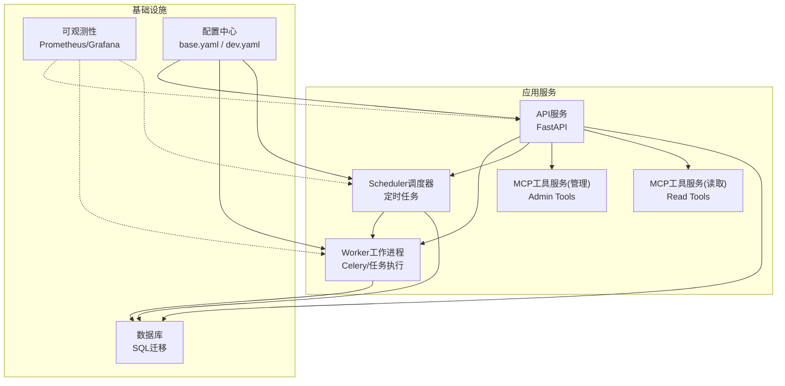
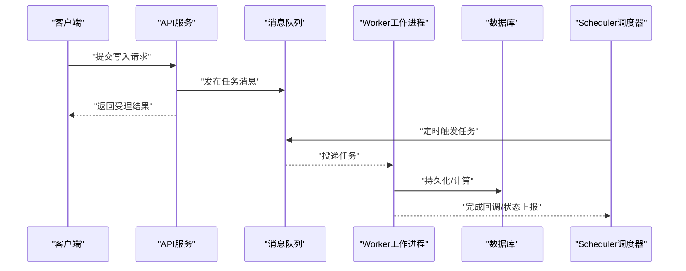
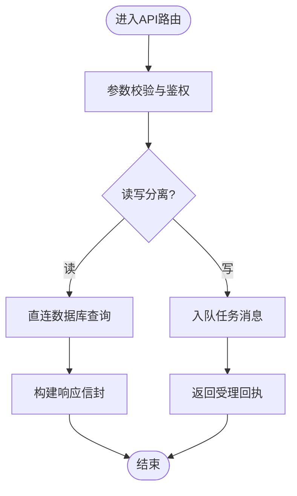
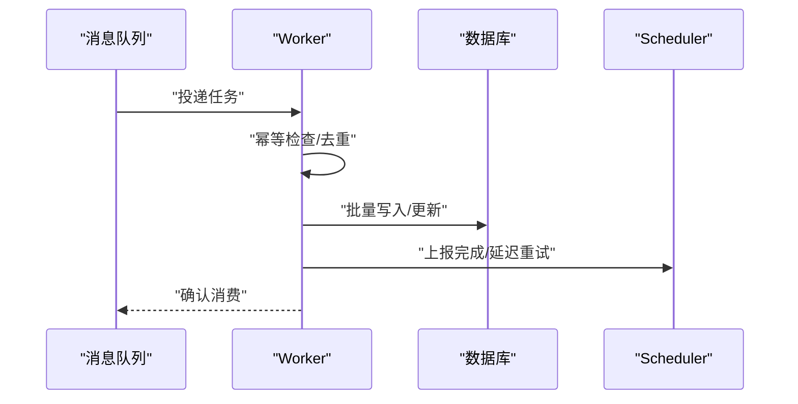
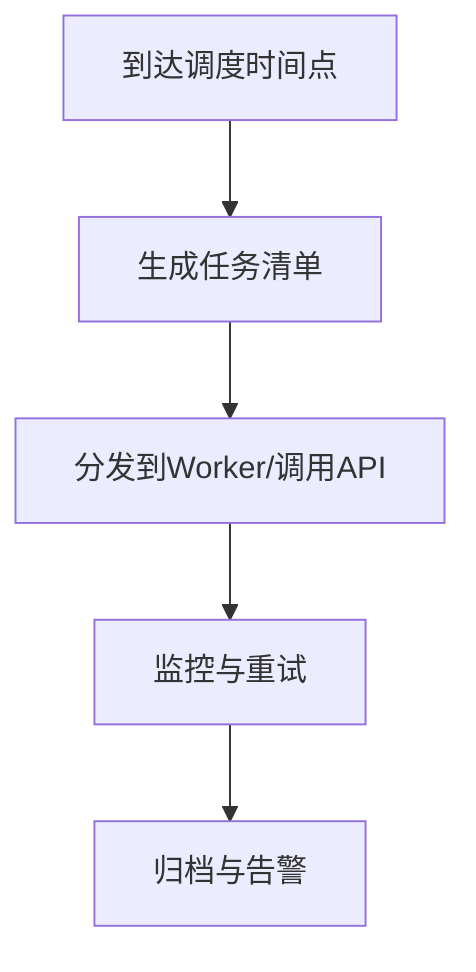
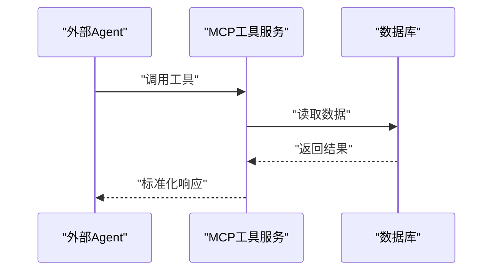
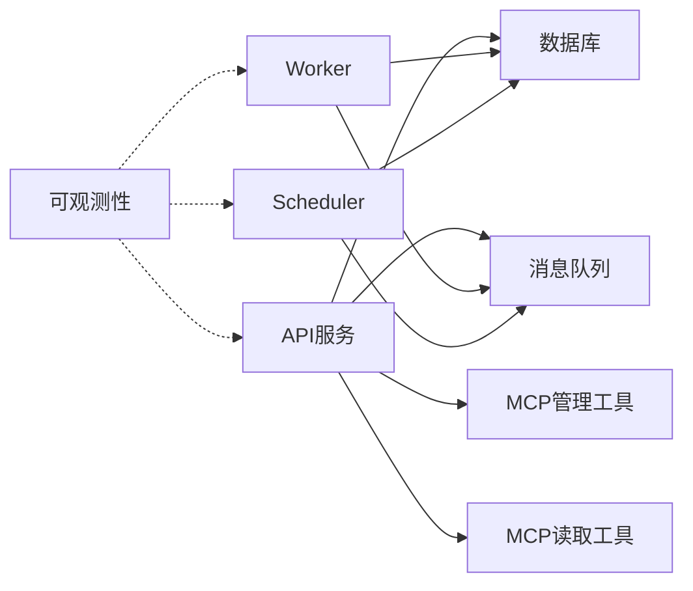

# 微服务架构

<cite>
**本文引用的文件**   
- [apps/api/main.py](file://apps/api/main.py)
- [apps/api/deps.py](file://apps/api/deps.py)
- [apps/api/routers/__init__.py](file://apps/api/routers/__init__.py)
- [apps/api/routers/admin_ingestion.py](file://apps/api/routers/admin_ingestion.py)
- [apps/api/routers/data_status.py](file://apps/api/routers/data_status.py)
- [apps/api/routers/forecast.py](file://apps/api/routers/forecast.py)
- [apps/api/routers/fundamentals.py](file://apps/api/routers/fundamentals.py)
- [apps/api/routers/instruments.py](file://apps/api/routers/instruments.py)
- [apps/api/routers/markets.py](file://apps/api/routers/markets.py)
- [apps/api/routers/portfolio.py](file://apps/api/routers/portfolio.py)
- [apps/api/routers/scheduler.py](file://apps/api/routers/scheduler.py)
- [apps/worker/main.py](file://apps/worker/main.py)
- [apps/worker/tasks.py](file://apps/worker/tasks.py)
- [apps/scheduler/schedule.py](file://apps/scheduler/schedule.py)
- [apps/quant-admin-mcp/tools.py](file://apps/quant-admin-mcp/tools.py)
- [apps/quant-read-mcp/tools.py](file://apps/quant-read-mcp/tools.py)
- [configs/base.yaml](file://configs/base.yaml)
- [configs/dev.yaml](file://configs/dev.yaml)
- [deploy/docker-compose.yml](file://deploy/docker-compose.yml)
- [deploy/prometheus.yml](file://deploy/prometheus.yml)
- [packages/observability](file://packages/observability)
- [sql/migrations/env.py](file://sql/migrations/env.py)
</cite>

## 目录
1. [简介](#简介)
2. [项目结构](#项目结构)
3. [核心组件](#核心组件)
4. [架构总览](#架构总览)
5. [详细组件分析](#详细组件分析)
6. [依赖关系分析](#依赖关系分析)
7. [性能考虑](#性能考虑)
8. [故障排查指南](#故障排查指南)
9. [结论](#结论)
10. [附录](#附录)

## 简介
本设计文档面向量化交易系统的微服务架构，覆盖API服务、Worker工作进程、Scheduler调度器与MCP工具服务等核心服务的职责边界、通信机制、依赖关系与数据流向。文档同时给出同步HTTP调用与异步消息传递模式的设计说明，并补充服务发现、负载均衡与服务治理、容错（熔断降级与重试）、配置管理（环境变量注入与动态更新）、服务间通信协议（REST API规范、消息格式与错误处理约定），以及监控、日志收集与链路追踪的实现方案。

## 项目结构
仓库采用“应用层按服务拆分 + 领域包复用”的组织方式：
- apps：可独立部署的微服务入口与路由、任务、调度等实现
- packages：跨服务复用的领域能力（如观测性、数据源、特征、模型等）
- configs：分层YAML配置（基础与开发环境）
- deploy：容器编排与监控采集配置
- sql/migrations：数据库迁移脚本与环境初始化

图表来源
- [apps/api/main.py](file://apps/api/main.py)
- [apps/worker/main.py](file://apps/worker/main.py)
- [apps/scheduler/schedule.py](file://apps/scheduler/schedule.py)
- [deploy/docker-compose.yml](file://deploy/docker-compose.yml)
- [deploy/prometheus.yml](file://deploy/prometheus.yml)
- [configs/base.yaml](file://configs/base.yaml)
- [configs/dev.yaml](file://configs/dev.yaml)

章节来源
- [apps/api/main.py](file://apps/api/main.py)
- [apps/worker/main.py](file://apps/worker/main.py)
- [apps/scheduler/schedule.py](file://apps/scheduler/schedule.py)
- [deploy/docker-compose.yml](file://deploy/docker-compose.yml)
- [deploy/prometheus.yml](file://deploy/prometheus.yml)
- [configs/base.yaml](file://configs/base.yaml)
- [configs/dev.yaml](file://configs/dev.yaml)

## 核心组件
- API服务：对外暴露REST接口，聚合业务路由，协调下游服务与数据库访问，承载鉴权、限流、请求校验与响应封装。
- Worker工作进程：异步执行耗时任务（数据入库、特征计算、回测、训练等），通过消息队列与API/Scheduler解耦。
- Scheduler调度器：基于时间规则触发批量或周期性任务，驱动数据拉取、指标刷新、报表生成等。
- MCP工具服务：为上层Agent/工具生态提供标准化工具能力（管理与读取两类），供API或其他服务调用。
- 可观测性：统一指标、日志与链路追踪，支撑运行期诊断与容量规划。
- 配置管理：分层YAML配置与环境变量注入，支持热更新与多环境隔离。

章节来源
- [apps/api/main.py](file://apps/api/main.py)
- [apps/api/deps.py](file://apps/api/deps.py)
- [apps/worker/main.py](file://apps/worker/main.py)
- [apps/worker/tasks.py](file://apps/worker/tasks.py)
- [apps/scheduler/schedule.py](file://apps/scheduler/schedule.py)
- [apps/quant-admin-mcp/tools.py](file://apps/quant-admin-mcp/tools.py)
- [apps/quant-read-mcp/tools.py](file://apps/quant-read-mcp/tools.py)
- [packages/observability](file://packages/observability)
- [configs/base.yaml](file://configs/base.yaml)
- [configs/dev.yaml](file://configs/dev.yaml)

## 架构总览
系统以API服务为统一入口，将读路径直接落库，写路径通过消息队列交由Worker异步处理；Scheduler负责周期性任务编排。MCP工具服务作为能力扩展点，被API或外部Agent按需调用。可观测性与配置中心贯穿各服务。

图表来源
- [apps/api/main.py](file://apps/api/main.py)
- [apps/worker/main.py](file://apps/worker/main.py)
- [apps/worker/tasks.py](file://apps/worker/tasks.py)
- [apps/scheduler/schedule.py](file://apps/scheduler/schedule.py)

## 详细组件分析

### API服务
- 职责边界
  - 统一REST入口，路由到具体业务模块（行情、标的、基本面、预测、组合、数据状态、调度管理等）。
  - 请求校验、鉴权、限流、审计与响应信封封装。
  - 同步查询走直连数据库；写入类操作入队至消息队列，由Worker异步处理。
- 关键实现要点
  - 使用依赖注入获取数据库连接、缓存、消息队列客户端等共享资源。
  - 路由模块化组织，便于横向扩展与权限控制。
- 典型流程（以数据状态查询为例）
  - 客户端发起GET请求 -> API路由解析 -> 依赖注入获取仓储/服务 -> 查询数据库 -> 返回标准响应信封。

图表来源
- [apps/api/main.py](file://apps/api/main.py)
- [apps/api/deps.py](file://apps/api/deps.py)
- [apps/api/routers/data_status.py](file://apps/api/routers/data_status.py)

章节来源
- [apps/api/main.py](file://apps/api/main.py)
- [apps/api/deps.py](file://apps/api/deps.py)
- [apps/api/routers/__init__.py](file://apps/api/routers/__init__.py)
- [apps/api/routers/data_status.py](file://apps/api/routers/data_status.py)
- [apps/api/routers/instruments.py](file://apps/api/routers/instruments.py)
- [apps/api/routers/markets.py](file://apps/api/routers/markets.py)
- [apps/api/routers/fundamentals.py](file://apps/api/routers/fundamentals.py)
- [apps/api/routers/forecast.py](file://apps/api/routers/forecast.py)
- [apps/api/routers/portfolio.py](file://apps/api/routers/portfolio.py)
- [apps/api/routers/admin_ingestion.py](file://apps/api/routers/admin_ingestion.py)
- [apps/api/routers/scheduler.py](file://apps/api/routers/scheduler.py)

### Worker工作进程
- 职责边界
  - 消费消息队列中的任务，执行耗时逻辑（数据清洗、入库、特征工程、回测、训练、报表生成等）。
  - 维护任务幂等、重试与失败告警，向调度器或API反馈执行状态。
- 关键实现要点
  - 任务注册与路由、并发控制、超时与重试策略、事务边界与补偿。
  - 与数据库交互的批处理与索引优化，避免长事务与锁竞争。
- 典型流程（以数据入库任务为例）
  - 接收任务 -> 解析参数 -> 拉取原始数据 -> 转换与校验 -> 批量写入 -> 记录审计与指标 -> 完成回调。

图表来源
- [apps/worker/main.py](file://apps/worker/main.py)
- [apps/worker/tasks.py](file://apps/worker/tasks.py)

章节来源
- [apps/worker/main.py](file://apps/worker/main.py)
- [apps/worker/tasks.py](file://apps/worker/tasks.py)

### Scheduler调度器
- 职责边界
  - 定义周期/事件驱动的调度规则，触发数据拉取、指标刷新、报表生成等任务。
  - 与Worker协作，通过消息队列或API回调驱动任务执行。
- 关键实现要点
  - 调度表达式与时区处理、任务去重与防抖、失败重试与告警。
  - 与数据库时钟表或外部调度元数据协同，保证一致性。
- 典型流程（以每日收盘后指标刷新为例）
  - 到达触发时间 -> 生成任务 -> 入队/调用API -> 等待完成 -> 记录审计与指标。

图表来源
- [apps/scheduler/schedule.py](file://apps/scheduler/schedule.py)

章节来源
- [apps/scheduler/schedule.py](file://apps/scheduler/schedule.py)

### MCP工具服务
- 职责边界
  - 提供标准化的工具能力，分为管理类与读取类，供API或外部Agent调用。
  - 管理类侧重变更型操作（如配置下发、任务触发、数据修复）；读取类侧重查询与导出。
- 关键实现要点
  - 工具注册与版本兼容、输入输出契约稳定、权限与审计。
  - 与API服务解耦，可通过HTTP或内部RPC暴露。
- 典型流程（以读取工具为例）
  - 外部Agent调用 -> MCP工具服务校验 -> 查询数据库/缓存 -> 返回结构化结果。

图表来源
- [apps/quant-admin-mcp/tools.py](file://apps/quant-admin-mcp/tools.py)
- [apps/quant-read-mcp/tools.py](file://apps/quant-read-mcp/tools.py)

章节来源
- [apps/quant-admin-mcp/tools.py](file://apps/quant-admin-mcp/tools.py)
- [apps/quant-read-mcp/tools.py](file://apps/quant-read-mcp/tools.py)

## 依赖关系分析
- 服务耦合
  - API对数据库直读，对消息队列与MCP服务间接依赖；Worker仅依赖消息队列与数据库；Scheduler依赖消息队列与数据库。
- 外部依赖
  - 数据库迁移与环境初始化由Alembic管理；可观测性通过Prometheus抓取指标；配置由YAML与环境变量共同决定。
- 潜在环路与解耦
  - 通过消息队列与工具服务抽象降低紧耦合；避免API与Worker双向依赖。

图表来源
- [apps/api/main.py](file://apps/api/main.py)
- [apps/worker/main.py](file://apps/worker/main.py)
- [apps/scheduler/schedule.py](file://apps/scheduler/schedule.py)
- [deploy/prometheus.yml](file://deploy/prometheus.yml)

章节来源
- [apps/api/main.py](file://apps/api/main.py)
- [apps/worker/main.py](file://apps/worker/main.py)
- [apps/scheduler/schedule.py](file://apps/scheduler/schedule.py)
- [deploy/prometheus.yml](file://deploy/prometheus.yml)

## 性能考虑
- 读写分离与批处理
  - 读路径直连数据库，结合索引与分页；写路径批量写入，减少事务粒度。
- 异步与削峰填谷
  - 通过消息队列缓冲峰值流量，Worker水平扩展提升吞吐。
- 连接池与超时
  - 数据库连接池、HTTP/消息客户端超时与重试上限需合理设置，避免雪崩。
- 缓存与热点
  - 对高频只读数据引入缓存层，注意失效策略与一致性。
- 资源隔离
  - 不同任务类型在Worker中按队列隔离，防止相互影响。

[本节为通用指导，不直接分析具体文件]

## 故障排查指南
- 常见问题定位
  - 任务堆积：检查消息队列积压与Worker健康度。
  - 数据库慢查询：关注长事务与大表扫描，结合索引与分批策略。
  - 配置不一致：核对基础配置与环境变量覆盖顺序。
  - 可观测性缺失：确认指标采集端点与日志输出是否可达。
- 建议手段
  - 利用Prometheus抓取关键指标（QPS、延迟、错误率、队列长度、CPU/内存）。
  - 集中式日志收集与Trace ID透传，快速定位跨服务问题。
  - 针对关键路径增加熔断与降级开关，保障核心功能可用。

章节来源
- [deploy/prometheus.yml](file://deploy/prometheus.yml)
- [packages/observability](file://packages/observability)

## 结论
本架构以API为统一入口，结合消息队列与调度器实现读写分离与异步化，配合MCP工具服务扩展能力面，并通过可观测性与配置管理保障稳定性与可运维性。后续可在服务发现、负载均衡与服务治理方面进一步增强，以满足更大规模与更高可用性的需求。

[本节为总结性内容，不直接分析具体文件]

## 附录

### 服务间通信协议定义
- REST API规范
  - 统一响应信封：包含状态码、消息、数据体与追踪ID。
  - 错误码体系：业务错误与系统错误分层，附带可诊断信息。
  - 幂等键：对写入接口提供幂等键，避免重复提交。
- 消息格式
  - 任务消息包含：任务类型、参数、优先级、重试次数、过期时间与追踪上下文。
  - 成功/失败回调：统一回调接口或状态查询接口。
- 错误处理约定
  - 网络异常：指数退避重试，带抖动。
  - 业务异常：快速失败并返回明确错误码。
  - 超时：区分网关超时与后端处理超时，分别处理。

[本节为协议约定说明，不直接分析具体文件]

### 服务发现、负载均衡与服务治理
- 服务发现
  - 容器编排环境下通过Docker Compose/DNS进行服务名解析；生产环境可引入Kubernetes Service或Consul/Etcd。
- 负载均衡
  - 网关层或反向代理（Nginx/Traefik）实现请求级负载均衡；Worker侧按队列分片。
- 服务治理
  - 熔断：对下游不可用快速失败，保护上游。
  - 降级：非核心功能降级，保障主流程。
  - 限流：基于令牌桶或漏桶限制突发流量。
  - 灰度与蓝绿：结合网关与容器编排逐步放量。

[本节为概念性说明，不直接分析具体文件]

### 容错机制、熔断降级与重试策略
- 重试策略
  - 幂等接口支持有限次重试，非幂等接口禁止自动重试。
  - 指数退避+随机抖动，避免惊群效应。
- 熔断与降级
  - 基于错误率与延迟阈值触发熔断，半开探测恢复。
  - 降级策略包括返回缓存、默认值或友好提示。
- 超时与兜底
  - 全链路超时控制，确保资源及时释放。
  - 兜底逻辑保证最小可用体验。

[本节为通用设计建议，不直接分析具体文件]

### 配置管理、环境变量注入与动态更新
- 分层配置
  - base.yaml提供默认值，dev.yaml覆盖开发环境差异。
- 环境变量注入
  - 敏感信息与运行时参数通过环境变量注入，优先于YAML配置。
- 动态更新
  - 支持热重载配置（如日志级别、开关位），重启不影响核心流程。

章节来源
- [configs/base.yaml](file://configs/base.yaml)
- [configs/dev.yaml](file://configs/dev.yaml)

### 监控、日志收集与链路追踪
- 指标采集
  - Prometheus抓取服务暴露的指标端点，Grafana可视化。
- 日志收集
  - 结构化JSON日志，集中存储与检索。
- 链路追踪
  - 跨服务透传Trace ID，关联请求全链路。

章节来源
- [deploy/prometheus.yml](file://deploy/prometheus.yml)
- [packages/observability](file://packages/observability)

### 数据库迁移与环境初始化
- 迁移管理
  - Alembic统一管理DDL变更，按版本演进。
- 环境初始化
  - 启动时执行必要的数据字典与索引初始化。

章节来源
- [sql/migrations/env.py](file://sql/migrations/env.py)