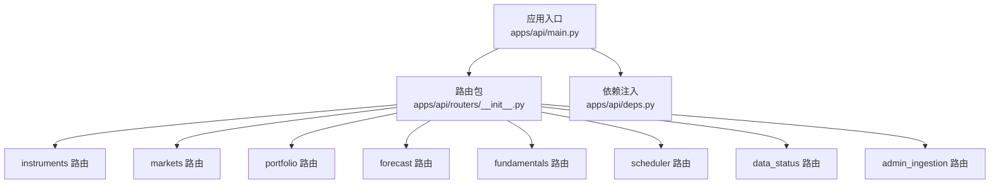
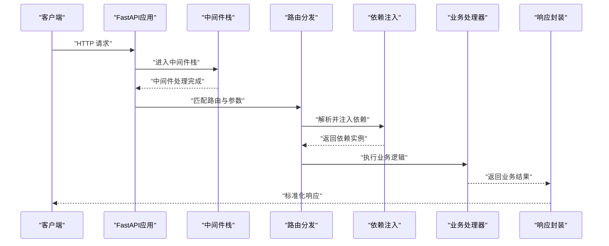
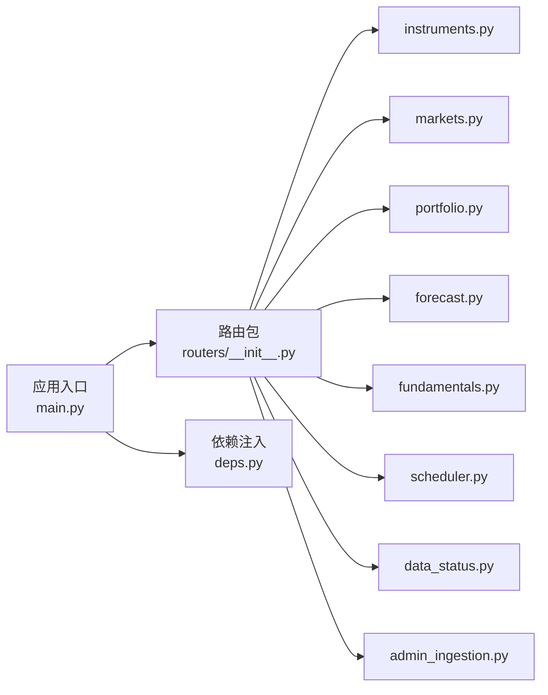

# API服务组件

<cite>
**本文引用的文件**   
- [apps/api/main.py](file://apps/api/main.py)
- [apps/api/deps.py](file://apps/api/deps.py)
- [apps/api/routers/__init__.py](file://apps/api/routers/__init__.py)
- [apps/api/routers/admin_ingestion.py](file://apps/api/routers/admin_ingestion.py)
- [apps/api/routers/data_status.py](file://apps/api/routers/data_status.py)
- [apps/api/routers/forecast.py](file://apps/api/routers/forecast.py)
- [apps/api/routers/fundamentals.py](file://apps/api/routers/fundamentals.py)
- [apps/api/routers/instruments.py](file://apps/api/routers/instruments.py)
- [apps/api/routers/markets.py](file://apps/api/routers/markets.py)
- [apps/api/routers/portfolio.py](file://apps/api/routers/portfolio.py)
- [apps/api/routers/scheduler.py](file://apps/api/routers/scheduler.py)
- [configs/base.yaml](file://configs/base.yaml)
- [configs/dev.yaml](file://configs/dev.yaml)
- [deploy/docker-compose.yml](file://deploy/docker-compose.yml)
- [tests/unit/test_api_health.py](file://tests/unit/test_api_health.py)
- [tests/unit/test_instruments_router_wired.py](file://tests/unit/test_instruments_router_wired.py)
- [tests/unit/test_response_envelope.py](file://tests/unit/test_response_envelope.py)
</cite>

## 目录
1. [简介](#简介)
2. [项目结构](#项目结构)
3. [核心组件](#核心组件)
4. [架构总览](#架构总览)
5. [详细组件分析](#详细组件分析)
6. [依赖关系分析](#依赖关系分析)
7. [性能考虑](#性能考虑)
8. [故障排查指南](#故障排查指南)
9. [结论](#结论)
10. [附录](#附录)

## 简介
本文件面向API服务组件，聚焦FastAPI应用的初始化流程、路由注册机制与依赖注入系统；阐述RESTful端点设计模式、请求响应处理与错误处理策略；说明中间件执行顺序、认证授权实现与请求验证策略；描述服务启动配置、热重载机制与性能优化选项；并涵盖API版本管理、文档自动生成与Swagger集成。同时提供具体路由示例、参数验证规则与响应格式规范，以及CORS配置、限流策略与安全防护措施建议。

## 项目结构
API服务位于 apps/api 目录下，采用“应用入口 + 路由模块 + 依赖注入”的分层组织方式：
- 应用入口：负责创建FastAPI实例、挂载中间件、注册路由、配置生命周期钩子与全局设置。
- 路由模块：按业务域拆分（如 instruments、markets、portfolio、forecast、fundamentals、scheduler、data_status、admin_ingestion），每个模块维护一组相关端点。
- 依赖注入：集中定义可复用依赖（数据库会话、配置对象、外部客户端等），通过FastAPI的Depends机制在路由中按需注入。

图表来源
- [apps/api/main.py](file://apps/api/main.py)
- [apps/api/routers/__init__.py](file://apps/api/routers/__init__.py)

章节来源
- [apps/api/main.py](file://apps/api/main.py)
- [apps/api/routers/__init__.py](file://apps/api/routers/__init__.py)

## 核心组件
- 应用初始化与配置
  - 创建FastAPI实例，设置应用元信息、版本、文档URL、调试开关等。
  - 加载配置文件（基础配置与开发环境覆盖）。
  - 注册中间件（CORS、日志、监控、限流等）与异常处理器。
  - 挂载各业务路由前缀，支持API版本化路径。
- 依赖注入系统
  - 集中定义共享依赖（如数据库会话、配置对象、缓存客户端、外部服务客户端）。
  - 使用Depends在路由函数或类中声明式注入，避免重复初始化与隐式全局状态。
- 路由与端点
  - 按领域划分路由模块，统一返回结构（响应信封），便于前端解析与错误处理。
  - 使用Pydantic模型进行请求体与查询参数的强类型校验。
- 健康检查与可观测性
  - 暴露健康检查端点，用于探针与负载均衡器探测。
  - 集成指标采集与日志记录，便于问题定位与容量规划。

章节来源
- [apps/api/main.py](file://apps/api/main.py)
- [apps/api/deps.py](file://apps/api/deps.py)
- [apps/api/routers/__init__.py](file://apps/api/routers/__init__.py)

## 架构总览
下图展示API服务从HTTP请求到业务处理的典型调用链，包括中间件、依赖注入、路由处理与响应封装。

图表来源
- [apps/api/main.py](file://apps/api/main.py)
- [apps/api/routers/__init__.py](file://apps/api/routers/__init__.py)
- [apps/api/deps.py](file://apps/api/deps.py)

## 详细组件分析

### 应用初始化与生命周期
- 应用实例化
  - 设置应用名称、版本、描述、文档URL、调试模式等元数据。
  - 根据环境加载配置（基础配置+开发覆盖），为后续依赖注入提供上下文。
- 中间件注册
  - CORS：允许跨域访问，指定允许的源、方法与头。
  - 日志：记录请求方法、路径、状态码与耗时。
  - 监控：暴露Prometheus指标端点，聚合QPS、延迟分布与错误率。
  - 限流：基于IP或用户标识限制请求速率，防止滥用。
- 生命周期钩子
  - 启动时：初始化连接池、预热缓存、注册定时任务。
  - 关闭时：优雅关闭连接、持久化状态、清理资源。

章节来源
- [apps/api/main.py](file://apps/api/main.py)
- [configs/base.yaml](file://configs/base.yaml)
- [configs/dev.yaml](file://configs/dev.yaml)

### 路由注册与API版本管理
- 路由分组
  - 通过路由包将不同业务域的路由集中管理，便于扩展与维护。
  - 在应用入口统一挂载路由，并为不同版本分配独立前缀（如 /api/v1）。
- 版本化策略
  - URL前缀版本：/api/v1/...、/api/v2/...，确保向后兼容。
  - 头部版本控制：可选通过Accept-Version头选择版本。
- 路由示例
  - 资产列表：GET /api/v1/instruments
  - 市场数据：GET /api/v1/markets/{market_id}/bars
  - 投资组合：POST /api/v1/portfolio/rebalance
  - 预测接口：POST /api/v1/forecast/predict
  - 基本面：GET /api/v1/fundamentals/{instrument_id}
  - 调度任务：GET /api/v1/scheduler/status
  - 数据状态：GET /api/v1/data_status/latest
  - 管理摄入：POST /api/v1/admin_ingestion/batch

章节来源
- [apps/api/routers/__init__.py](file://apps/api/routers/__init__.py)
- [apps/api/routers/instruments.py](file://apps/api/routers/instruments.py)
- [apps/api/routers/markets.py](file://apps/api/routers/markets.py)
- [apps/api/routers/portfolio.py](file://apps/api/routers/portfolio.py)
- [apps/api/routers/forecast.py](file://apps/api/routers/forecast.py)
- [apps/api/routers/fundamentals.py](file://apps/api/routers/fundamentals.py)
- [apps/api/routers/scheduler.py](file://apps/api/routers/scheduler.py)
- [apps/api/routers/data_status.py](file://apps/api/routers/data_status.py)
- [apps/api/routers/admin_ingestion.py](file://apps/api/routers/admin_ingestion.py)

### 依赖注入系统
- 依赖项分类
  - 配置对象：从配置文件加载的全局配置。
  - 数据库会话：连接池与会话工厂，保证事务边界与资源释放。
  - 外部客户端：缓存、消息队列、第三方API客户端。
  - 业务服务：领域服务、仓储、编排器等。
- 注入方式
  - 函数依赖：在路由函数签名中使用Depends声明。
  - 类依赖：在类路由中通过__init__注入，减少重复代码。
- 作用域与生命周期
  - 请求级依赖：每次请求新建实例，自动在请求结束时释放。
  - 应用级依赖：应用启动时创建，贯穿整个生命周期。

章节来源
- [apps/api/deps.py](file://apps/api/deps.py)

### RESTful端点设计与请求响应处理
- 端点设计原则
  - 资源导向：名词表示资源，动词表示操作（GET/POST/PUT/PATCH/DELETE）。
  - 幂等性：GET/PUT/DELETE保持幂等，POST用于非幂等操作。
  - 状态码：正确使用2xx成功、4xx客户端错误、5xx服务端错误。
- 请求验证
  - 使用Pydantic模型对路径参数、查询参数、请求体进行强类型校验。
  - 自定义校验器：针对业务规则进行额外校验（如范围、枚举、唯一性）。
- 响应格式规范
  - 统一响应信封：包含code、message、data、traceId等字段。
  - 分页结构：包含items、total、page、pageSize等字段。
  - 错误响应：包含error_code、error_message、details等字段。

章节来源
- [tests/unit/test_response_envelope.py](file://tests/unit/test_response_envelope.py)
- [apps/api/routers/instruments.py](file://apps/api/routers/instruments.py)
- [apps/api/routers/markets.py](file://apps/api/routers/markets.py)
- [apps/api/routers/portfolio.py](file://apps/api/routers/portfolio.py)
- [apps/api/routers/forecast.py](file://apps/api/routers/forecast.py)
- [apps/api/routers/fundamentals.py](file://apps/api/routers/fundamentals.py)
- [apps/api/routers/scheduler.py](file://apps/api/routers/scheduler.py)
- [apps/api/routers/data_status.py](file://apps/api/routers/data_status.py)
- [apps/api/routers/admin_ingestion.py](file://apps/api/routers/admin_ingestion.py)

### 错误处理机制
- 全局异常处理器
  - 捕获未处理异常，转换为标准错误响应。
  - 区分业务异常与系统异常，返回不同的错误码与提示。
- 输入校验错误
  - Pydantic校验失败时返回422，附带字段级错误详情。
- 资源不存在与权限不足
  - 404：资源不存在。
  - 401/403：未认证或无权限。
- 超时与重试
  - 对外部依赖设置超时与重试策略，避免雪崩效应。

章节来源
- [apps/api/main.py](file://apps/api/main.py)

### 中间件执行顺序与认证授权
- 中间件顺序
  - 先执行CORS与日志，再执行鉴权与限流，最后进入路由处理。
- 认证授权
  - JWT令牌校验：从请求头提取令牌，验证签名与过期时间。
  - 角色与权限：基于RBAC或ABAC模型进行细粒度授权。
  - 白名单：对健康检查与公开接口放行。
- 限流策略
  - 基于IP或用户ID的滑动窗口限流。
  - 分级限流：对不同路由或租户设置不同阈值。

章节来源
- [apps/api/main.py](file://apps/api/main.py)
- [apps/api/deps.py](file://apps/api/deps.py)

### 请求验证策略
- 路径参数
  - 类型约束：整数、字符串、UUID等。
  - 格式校验：正则表达式、长度限制、枚举值。
- 查询参数
  - 分页：page、pageSize、sort、filter。
  - 过滤：日期范围、状态、标签等。
- 请求体
  - 必填字段、默认值、嵌套对象。
  - 自定义校验：业务规则、跨字段一致性。

章节来源
- [apps/api/routers/instruments.py](file://apps/api/routers/instruments.py)
- [apps/api/routers/markets.py](file://apps/api/routers/markets.py)
- [apps/api/routers/portfolio.py](file://apps/api/routers/portfolio.py)
- [apps/api/routers/forecast.py](file://apps/api/routers/forecast.py)
- [apps/api/routers/fundamentals.py](file://apps/api/routers/fundamentals.py)
- [apps/api/routers/scheduler.py](file://apps/api/routers/scheduler.py)
- [apps/api/routers/data_status.py](file://apps/api/routers/data_status.py)
- [apps/api/routers/admin_ingestion.py](file://apps/api/routers/admin_ingestion.py)

### 服务启动配置、热重载与性能优化
- 启动配置
  - 环境变量：端口、主机、调试开关、日志级别。
  - 配置文件：基础配置与环境覆盖，支持动态加载。
- 热重载
  - 开发环境启用热重载，修改代码后自动重启服务。
  - 生产环境禁用热重载，提升稳定性与性能。
- 性能优化
  - 连接池：数据库与缓存连接池大小调优。
  - 异步I/O：使用异步依赖与异步客户端提升吞吐。
  - 压缩：启用Gzip压缩减少带宽占用。
  - 缓存：热点数据缓存，降低后端压力。

章节来源
- [configs/base.yaml](file://configs/base.yaml)
- [configs/dev.yaml](file://configs/dev.yaml)
- [deploy/docker-compose.yml](file://deploy/docker-compose.yml)

### 文档自动生成与Swagger集成
- OpenAPI文档
  - 自动生成OpenAPI规范，支持交互式文档界面。
  - 自定义文档标题、描述与版本信息。
- Swagger UI
  - 启用Swagger UI，便于开发与测试。
  - 安全定义：配置JWT认证方案，直接在文档中进行授权测试。
- Redoc替代
  - 可选启用Redoc作为文档界面，提供更清晰的导航体验。

章节来源
- [apps/api/main.py](file://apps/api/main.py)

### CORS配置、限流策略与安全防护
- CORS配置
  - 允许的源、方法、头与凭据。
  - 预检请求处理与缓存策略。
- 限流策略
  - 基于IP或用户标识的速率限制。
  - 分级限流与突发流量保护。
- 安全防护
  - 输入校验与输出编码，防止注入攻击。
  - 敏感信息脱敏与日志审计。
  - 安全头：HSTS、X-Frame-Options、Content-Security-Policy。

章节来源
- [apps/api/main.py](file://apps/api/main.py)

## 依赖关系分析
API服务内部模块间的依赖关系如下：

图表来源
- [apps/api/main.py](file://apps/api/main.py)
- [apps/api/routers/__init__.py](file://apps/api/routers/__init__.py)
- [apps/api/deps.py](file://apps/api/deps.py)

章节来源
- [apps/api/main.py](file://apps/api/main.py)
- [apps/api/routers/__init__.py](file://apps/api/routers/__init__.py)
- [apps/api/deps.py](file://apps/api/deps.py)

## 性能考虑
- 连接池与并发
  - 合理设置数据库与缓存连接池大小，避免连接耗尽。
  - 使用异步I/O提升并发处理能力。
- 缓存策略
  - 多级缓存：本地缓存+分布式缓存，降低延迟。
  - 缓存失效：基于事件或TTL策略更新缓存。
- 压缩与传输
  - 启用Gzip压缩，减少网络传输开销。
  - 使用HTTP/2提升多路复用效率。
- 监控与告警
  - 指标采集：QPS、延迟、错误率、资源使用率。
  - 告警规则：阈值触发告警，及时发现问题。

[本节为通用性能指导，不直接分析具体文件]

## 故障排查指南
- 健康检查
  - 使用健康检查端点验证服务可用性。
  - 结合探针与负载均衡器进行滚动升级与健康探测。
- 日志与追踪
  - 结构化日志：包含请求ID、用户ID、耗时等上下文。
  - 分布式追踪：串联上下游服务，快速定位瓶颈。
- 常见问题
  - 连接池耗尽：检查连接泄漏与超时设置。
  - 内存泄漏：分析堆快照与GC行为。
  - 高CPU：定位热点函数与算法复杂度。

章节来源
- [tests/unit/test_api_health.py](file://tests/unit/test_api_health.py)

## 结论
本API服务组件采用FastAPI构建，具备清晰的分层架构、完善的依赖注入与统一的响应封装。通过模块化路由、强类型校验与全局异常处理，提升了可维护性与健壮性。结合中间件栈、认证授权、限流与安全头，提供了企业级API服务能力。文档自动生成与Swagger集成简化了开发与测试流程。在生产环境中，建议配合监控告警与性能调优，确保高可用与高性能。

[本节为总结性内容，不直接分析具体文件]

## 附录

### 路由示例与参数验证规则
- 资产列表
  - 路径：GET /api/v1/instruments
  - 查询参数：page、pageSize、status、category
  - 响应：分页结构，包含资产列表与总数
- 市场数据
  - 路径：GET /api/v1/markets/{market_id}/bars
  - 路径参数：market_id（字符串或UUID）
  - 查询参数：start_date、end_date、frequency
  - 响应：K线数据列表
- 投资组合
  - 路径：POST /api/v1/portfolio/rebalance
  - 请求体：目标权重、再平衡阈值、生效日期
  - 响应：再平衡任务ID与状态
- 预测接口
  - 路径：POST /api/v1/forecast/predict
  - 请求体：模型ID、输入特征、预测区间
  - 响应：预测结果与置信区间
- 基本面
  - 路径：GET /api/v1/fundamentals/{instrument_id}
  - 路径参数：instrument_id（字符串或UUID）
  - 响应：财务指标与比率
- 调度任务
  - 路径：GET /api/v1/scheduler/status
  - 响应：任务列表与执行状态
- 数据状态
  - 路径：GET /api/v1/data_status/latest
  - 响应：最新数据更新时间与版本
- 管理摄入
  - 路径：POST /api/v1/admin_ingestion/batch
  - 请求体：批量数据文件、目标表、清洗规则
  - 响应：批次ID与处理进度

章节来源
- [apps/api/routers/instruments.py](file://apps/api/routers/instruments.py)
- [apps/api/routers/markets.py](file://apps/api/routers/markets.py)
- [apps/api/routers/portfolio.py](file://apps/api/routers/portfolio.py)
- [apps/api/routers/forecast.py](file://apps/api/routers/forecast.py)
- [apps/api/routers/fundamentals.py](file://apps/api/routers/fundamentals.py)
- [apps/api/routers/scheduler.py](file://apps/api/routers/scheduler.py)
- [apps/api/routers/data_status.py](file://apps/api/routers/data_status.py)
- [apps/api/routers/admin_ingestion.py](file://apps/api/routers/admin_ingestion.py)

### 单元测试参考
- 健康检查测试
  - 验证健康检查端点返回正常状态码与预期结构。
- 路由装配测试
  - 验证路由是否正确挂载与参数解析。
- 响应信封测试
  - 验证统一响应结构与错误格式。

章节来源
- [tests/unit/test_api_health.py](file://tests/unit/test_api_health.py)
- [tests/unit/test_instruments_router_wired.py](file://tests/unit/test_instruments_router_wired.py)
- [tests/unit/test_response_envelope.py](file://tests/unit/test_response_envelope.py)