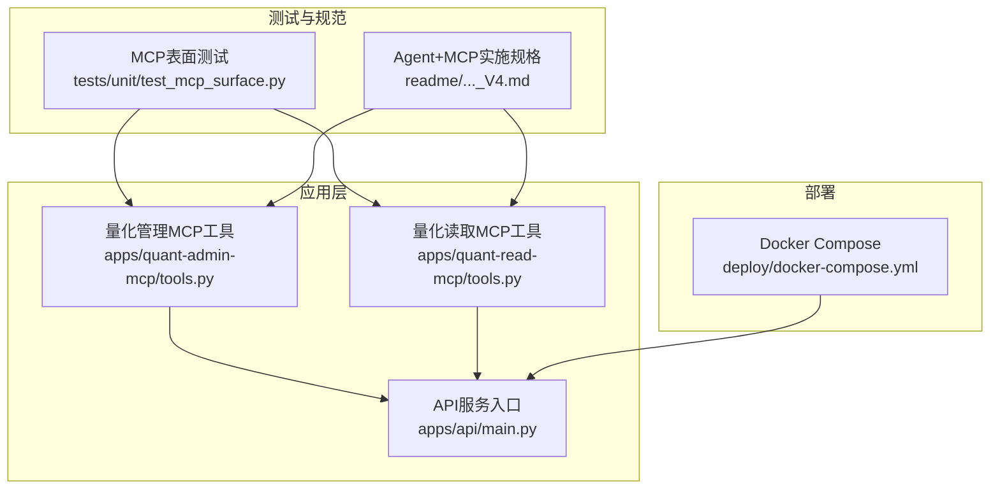
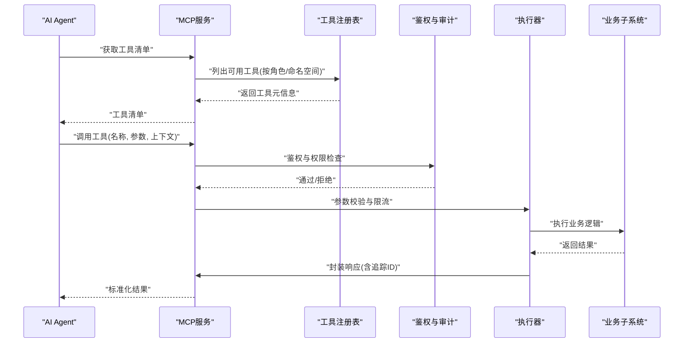
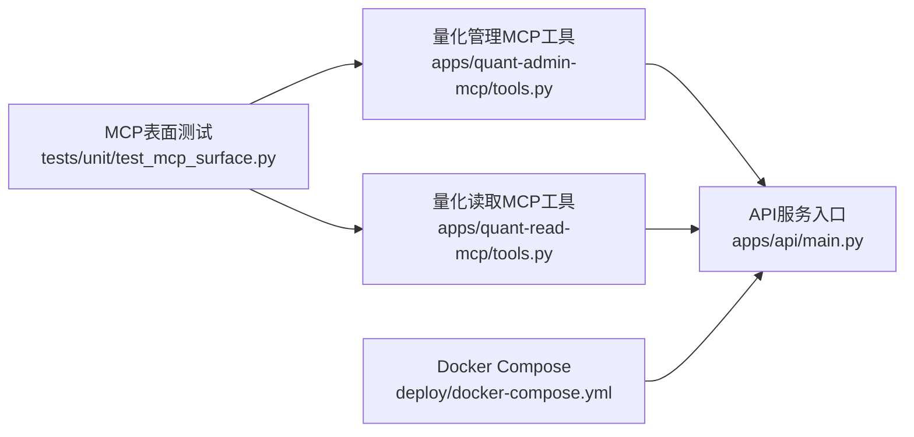

# MCP工具服务

<cite>
**本文引用的文件**   
- [apps/quant-admin-mcp/tools.py](file://apps/quant-admin-mcp/tools.py)
- [apps/quant-read-mcp/tools.py](file://apps/quant-read-mcp/tools.py)
- [tests/unit/test_mcp_surface.py](file://tests/unit/test_mcp_surface.py)
- [readme/A股美股基金量化Agent_Skill+MCP模块实施规格_V4.md](file://readme/A股美股基金量化Agent_Skill+MCP模块实施规格_V4.md)
- [apps/api/main.py](file://apps/api/main.py)
- [deploy/docker-compose.yml](file://deploy/docker-compose.yml)
</cite>

## 目录
1. [简介](#简介)
2. [项目结构](#项目结构)
3. [核心组件](#核心组件)
4. [架构总览](#架构总览)
5. [详细组件分析](#详细组件分析)
6. [依赖关系分析](#依赖关系分析)
7. [性能考虑](#性能考虑)
8. [故障排查指南](#故障排查指南)
9. [结论](#结论)
10. [附录](#附录)

## 简介
本设计文档围绕Model Context Protocol（MCP）在量化系统中的工具服务实现，聚焦以下目标：
- 深入解析MCP工具注册与发现机制、权限控制与访问审计。
- 明确“量化管理工具”和“量化读取工具”的功能边界与接口契约。
- 描述工具调用链路建立、参数校验、结果封装、版本管理与兼容性检查、动态更新。
- 提供具体调用示例、错误处理与超时控制策略。
- 覆盖安全隔离、资源限制与性能监控。
- 解释与AI Agent的集成方式及自然语言处理能力。

## 项目结构
仓库采用多应用分层组织，MCP工具以独立子应用形式提供：
- apps/quant-admin-mcp：面向管理侧的MCP工具集（写操作、配置、编排等）。
- apps/quant-read-mcp：面向读取侧的MCP工具集（查询、报表、指标等只读能力）。
- tests/unit/test_mcp_surface.py：对MCP表面能力的单元测试，用于验证工具注册、发现与基本调用路径。
- readme/A股美股基金量化Agent_Skill+MCP模块实施规格_V4.md：Agent与MCP集成的实施规格说明。
- apps/api/main.py：API服务入口，可能承载MCP服务端点或网关。
- deploy/docker-compose.yml：容器编排，便于本地与部署环境运行MCP服务。

图表来源
- [apps/quant-admin-mcp/tools.py](file://apps/quant-admin-mcp/tools.py)
- [apps/quant-read-mcp/tools.py](file://apps/quant-read-mcp/tools.py)
- [apps/api/main.py](file://apps/api/main.py)
- [tests/unit/test_mcp_surface.py](file://tests/unit/test_mcp_surface.py)
- [readme/A股美股基金量化Agent_Skill+MCP模块实施规格_V4.md](file://readme/A股美股基金量化Agent_Skill+MCP模块实施规格_V4.md)
- [deploy/docker-compose.yml](file://deploy/docker-compose.yml)

章节来源
- [apps/quant-admin-mcp/tools.py](file://apps/quant-admin-mcp/tools.py)
- [apps/quant-read-mcp/tools.py](file://apps/quant-read-mcp/tools.py)
- [tests/unit/test_mcp_surface.py](file://tests/unit/test_mcp_surface.py)
- [readme/A股美股基金量化Agent_Skill+MCP模块实施规格_V4.md](file://readme/A股美股基金量化Agent_Skill+MCP模块实施规格_V4.md)
- [apps/api/main.py](file://apps/api/main.py)
- [deploy/docker-compose.yml](file://deploy/docker-compose.yml)

## 核心组件
- 量化管理MCP工具（admin）：负责数据写入、模型训练、回测任务编排、组合与风险计算等“管理型”能力。
- 量化读取MCP工具（read）：负责市场数据、基本面、因子、组合快照、报告与指标的“只读”能力。
- MCP工具注册表：集中维护工具元信息（名称、版本、权限、参数Schema、路由映射），支持按角色/命名空间过滤。
- 工具发现与清单：对外暴露工具列表与能力描述，供AI Agent检索与选择。
- 调用链路与执行器：统一接收请求、鉴权、参数校验、限流、追踪、执行工具并封装响应。
- 审计与可观测性：记录工具调用上下文、耗时、状态码与关键指标，对接日志与指标系统。

章节来源
- [apps/quant-admin-mcp/tools.py](file://apps/quant-admin-mcp/tools.py)
- [apps/quant-read-mcp/tools.py](file://apps/quant-read-mcp/tools.py)
- [tests/unit/test_mcp_surface.py](file://tests/unit/test_mcp_surface.py)
- [readme/A股美股基金量化Agent_Skill+MCP模块实施规格_V4.md](file://readme/A股美股基金量化Agent_Skill+MCP模块实施规格_V4.md)

## 架构总览
MCP工具服务作为AI Agent的工具总线，向上暴露统一的工具清单与调用接口，向下对接业务子系统与数据源。

图表来源
- [apps/quant-admin-mcp/tools.py](file://apps/quant-admin-mcp/tools.py)
- [apps/quant-read-mcp/tools.py](file://apps/quant-read-mcp/tools.py)
- [tests/unit/test_mcp_surface.py](file://tests/unit/test_mcp_surface.py)

## 详细组件分析

### 量化管理MCP工具（Admin）
- 功能边界
  - 数据写入与清洗：批量导入、校正、合并、去重。
  - 模型与回测：训练任务提交、超参配置、回测启动与结果拉取。
  - 组合与风险：组合创建、调仓指令、风险指标计算。
  - 配置与调度：规则配置、定时任务启停、告警阈值设置。
- 接口设计要点
  - 每个工具包含：唯一名称、版本、权限标签、参数Schema、描述、示例。
  - 参数校验：类型、范围、必填项、跨字段约束。
  - 结果封装：统一响应体（状态、数据、追踪ID、时间戳）。
- 安全与审计
  - 基于角色的访问控制（RBAC）：仅允许具备“管理”权限的角色调用。
  - 审计事件：记录调用者、工具名、参数摘要、结果状态、耗时。
- 版本与兼容
  - 语义化版本；向后兼容变更需保留旧版接口；弃用策略与迁移提示。
- 典型调用流程
  - 提交回测任务：参数校验→权限检查→任务入队→返回任务ID→异步轮询结果。

章节来源
- [apps/quant-admin-mcp/tools.py](file://apps/quant-admin-mcp/tools.py)
- [tests/unit/test_mcp_surface.py](file://tests/unit/test_mcp_surface.py)

### 量化读取MCP工具（Read）
- 功能边界
  - 市场数据：行情、成交量、涨跌停、复权因子。
  - 基本面：财报、公告、分红送转。
  - 因子与标签：因子值、标签生成、样本集导出。
  - 组合与绩效：持仓快照、净值曲线、归因分析。
- 接口设计要点
  - 只读语义：无副作用；幂等；分页与过滤；时间窗口与粒度。
  - 缓存策略：热点数据缓存、TTL、失效策略。
- 安全与审计
  - 最小权限原则：仅授予“读取”权限。
  - 审计事件：记录查询条件摘要、返回行数、耗时。
- 版本与兼容
  - 字段演进：新增字段默认可选；删除字段需废弃期。
- 典型调用流程
  - 查询某股票日线：参数校验→权限检查→缓存命中→数据库查询→结果封装。

章节来源
- [apps/quant-read-mcp/tools.py](file://apps/quant-read-mcp/tools.py)
- [tests/unit/test_mcp_surface.py](file://tests/unit/test_mcp_surface.py)

### 工具注册与发现机制
- 注册表结构
  - 工具元信息：名称、版本、描述、权限标签、参数Schema、路由映射。
  - 命名空间：按领域划分（如market、fundamental、portfolio）。
  - 可见性：按角色/租户过滤。
- 发现流程
  - 客户端请求工具清单→注册表聚合→返回结构化清单→Agent据此选择工具。
- 动态更新
  - 热加载：新增/下线工具无需重启；版本切换灰度发布。
  - 健康检查：注册表心跳与健康探针。

章节来源
- [apps/quant-admin-mcp/tools.py](file://apps/quant-admin-mcp/tools.py)
- [apps/quant-read-mcp/tools.py](file://apps/quant-read-mcp/tools.py)
- [tests/unit/test_mcp_surface.py](file://tests/unit/test_mcp_surface.py)

### 权限控制与访问审计
- 权限模型
  - RBAC：角色-工具映射；支持细粒度到参数级白名单。
  - 上下文鉴权：结合租户、IP、设备指纹进行二次校验。
- 审计事件
  - 事件内容：调用者、工具名、参数摘要、结果状态、耗时、追踪ID。
  - 存储与查询：集中式日志与审计库，支持合规导出。
- 合规与脱敏
  - 敏感字段脱敏；审计数据加密存储；保留周期策略。

章节来源
- [tests/unit/test_mcp_surface.py](file://tests/unit/test_mcp_surface.py)
- [readme/A股美股基金量化Agent_Skill+MCP模块实施规格_V4.md](file://readme/A股美股基金量化Agent_Skill+MCP模块实施规格_V4.md)

### 工具调用链路、参数验证与结果封装
- 调用链路
  - 入口路由→鉴权→参数校验→限流→执行→结果封装→审计→返回。
- 参数验证
  - Schema驱动：类型、范围、枚举、正则、跨字段约束。
  - 失败快速返回：明确的错误码与修复建议。
- 结果封装
  - 统一响应体：状态码、数据、追踪ID、时间戳、分页信息。
  - 错误体：错误码、消息、上下文、重试建议。

章节来源
- [apps/quant-admin-mcp/tools.py](file://apps/quant-admin-mcp/tools.py)
- [apps/quant-read-mcp/tools.py](file://apps/quant-read-mcp/tools.py)
- [tests/unit/test_mcp_surface.py](file://tests/unit/test_mcp_surface.py)

### 版本管理、兼容性检查与动态更新
- 版本策略
  - 语义化版本；主版本破坏性变更；次版本新增兼容特性；补丁版本修复。
- 兼容性检查
  - 客户端声明期望版本范围；服务端匹配并返回可用版本。
- 动态更新
  - 热插拔：新增/下线工具即时生效；灰度发布与回滚。
  - 健康探针：注册表与服务端健康检查。

章节来源
- [apps/quant-admin-mcp/tools.py](file://apps/quant-admin-mcp/tools.py)
- [apps/quant-read-mcp/tools.py](file://apps/quant-read-mcp/tools.py)

### 工具调用示例、错误处理与超时控制
- 调用示例
  - 获取工具清单：GET /mcp/tools
  - 调用工具：POST /mcp/call {tool, params, context}
  - 查询任务状态：GET /mcp/tasks/{id}
- 错误处理
  - 分类：参数错误、权限不足、资源不可用、内部错误。
  - 统一错误码与消息；附带追踪ID以便排障。
- 超时控制
  - 全局超时与工具级超时；重试与退避策略；熔断降级。

章节来源
- [tests/unit/test_mcp_surface.py](file://tests/unit/test_mcp_surface.py)

### 安全隔离、资源限制与性能监控
- 安全隔离
  - 进程/容器隔离；最小权限；输入输出白名单。
- 资源限制
  - CPU/内存配额；并发上限；队列长度限制。
- 性能监控
  - 指标：QPS、P95/P99延迟、错误率、缓存命中率。
  - 追踪：端到端Trace ID；分布式链路追踪。
  - 告警：SLI/SLO阈值告警。

章节来源
- [apps/api/main.py](file://apps/api/main.py)
- [deploy/docker-compose.yml](file://deploy/docker-compose.yml)

### 与AI Agent集成与自然语言处理
- 集成方式
  - Agent通过工具清单自动发现可用工具；根据意图选择合适工具。
  - 使用自然语言描述工具用途与参数，由Agent进行意图识别与参数填充。
- 自然语言处理
  - 工具描述与示例驱动的参数抽取；模糊匹配与纠错。
  - 对话式交互：多轮澄清、确认与回退。

章节来源
- [readme/A股美股基金量化Agent_Skill+MCP模块实施规格_V4.md](file://readme/A股美股基金量化Agent_Skill+MCP模块实施规格_V4.md)
- [tests/unit/test_mcp_surface.py](file://tests/unit/test_mcp_surface.py)

## 依赖关系分析
MCP工具服务与API服务、测试与部署的关系如下：

图表来源
- [apps/quant-admin-mcp/tools.py](file://apps/quant-admin-mcp/tools.py)
- [apps/quant-read-mcp/tools.py](file://apps/quant-read-mcp/tools.py)
- [apps/api/main.py](file://apps/api/main.py)
- [tests/unit/test_mcp_surface.py](file://tests/unit/test_mcp_surface.py)
- [deploy/docker-compose.yml](file://deploy/docker-compose.yml)

章节来源
- [apps/quant-admin-mcp/tools.py](file://apps/quant-admin-mcp/tools.py)
- [apps/quant-read-mcp/tools.py](file://apps/quant-read-mcp/tools.py)
- [apps/api/main.py](file://apps/api/main.py)
- [tests/unit/test_mcp_surface.py](file://tests/unit/test_mcp_surface.py)
- [deploy/docker-compose.yml](file://deploy/docker-compose.yml)

## 性能考虑
- 缓存与索引：热点数据缓存、合理TTL、数据库索引优化。
- 批处理与分页：大批量读写分批处理，避免长事务与大结果集。
- 异步与队列：耗时任务入队，异步执行与结果回调。
- 连接池与限流：数据库/外部服务连接池、令牌桶限流。
- 监控与压测：全链路追踪、压测基线、容量规划。

[本节为通用指导，不直接分析具体文件]

## 故障排查指南
- 常见问题
  - 工具未注册：检查注册表与命名空间可见性。
  - 权限不足：核对角色-工具映射与上下文鉴权。
  - 参数校验失败：对照Schema逐项检查必填与范围。
  - 超时与熔断：查看超时配置与下游依赖健康状态。
- 定位方法
  - 使用追踪ID关联日志与指标。
  - 查看审计事件与错误码。
  - 启用调试模式与更详细的日志级别。

章节来源
- [tests/unit/test_mcp_surface.py](file://tests/unit/test_mcp_surface.py)

## 结论
MCP工具服务通过统一的注册与发现机制、严格的权限与审计、完善的参数校验与结果封装，为AI Agent提供了稳定、可控、可观测的工具总线。量化管理工具与量化读取工具在功能边界上清晰分离，配合版本管理与动态更新，满足生产环境的演进需求。通过安全隔离、资源限制与性能监控，确保在高并发与复杂场景下的可靠性与可维护性。

[本节为总结性内容，不直接分析具体文件]

## 附录
- 术语
  - MCP：Model Context Protocol，模型上下文协议。
  - RBAC：基于角色的访问控制。
  - SLI/SLO：服务等级指标/目标。
- 参考
  - Agent与MCP集成规格见实施规格文档。
  - 容器编排与部署参考docker-compose配置。

章节来源
- [readme/A股美股基金量化Agent_Skill+MCP模块实施规格_V4.md](file://readme/A股美股基金量化Agent_Skill+MCP模块实施规格_V4.md)
- [deploy/docker-compose.yml](file://deploy/docker-compose.yml)