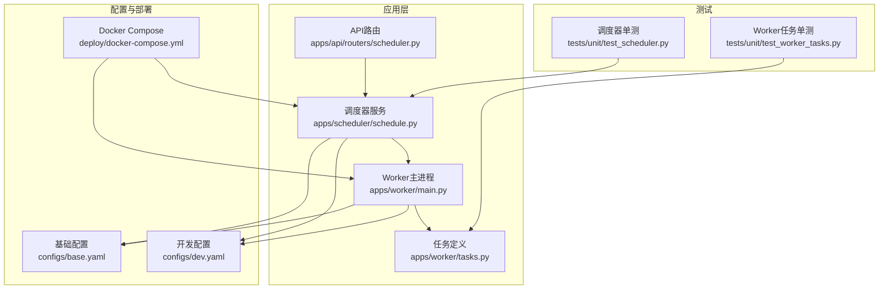
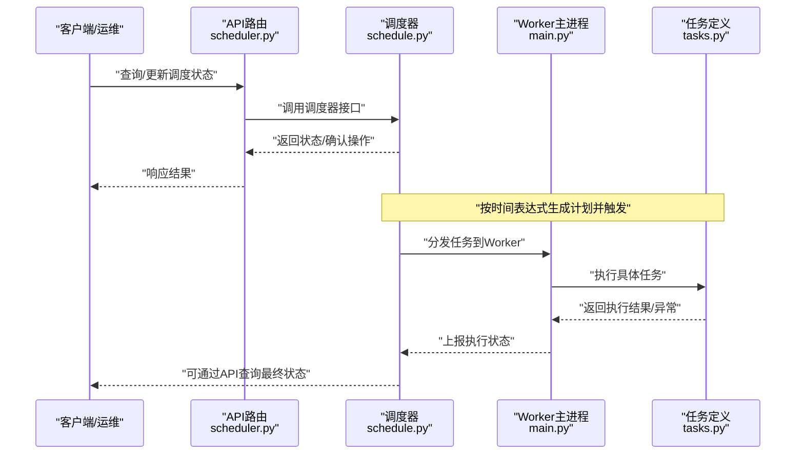
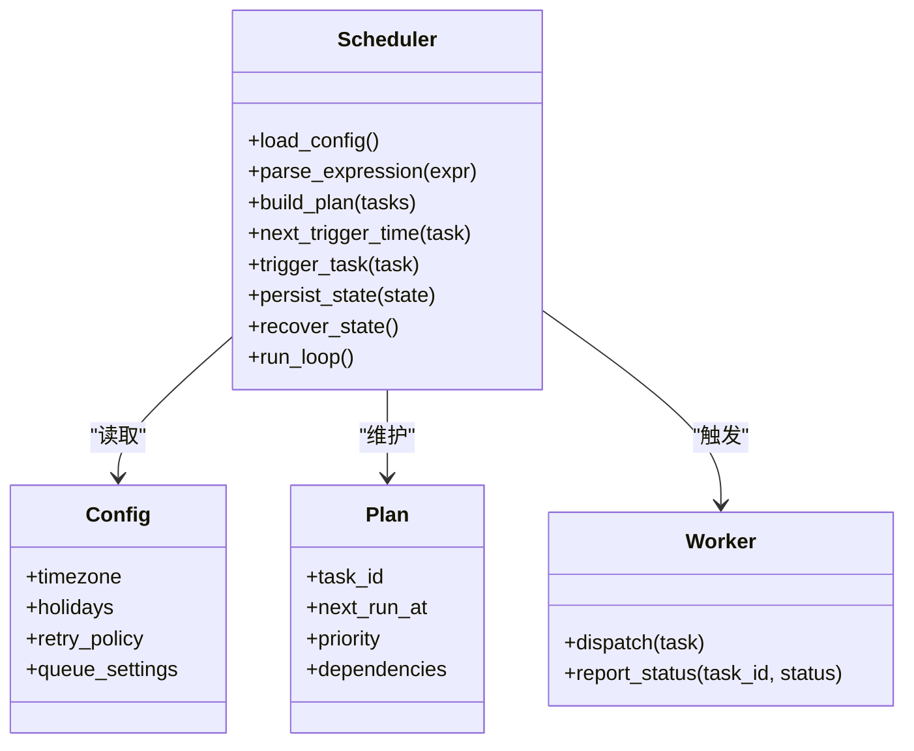
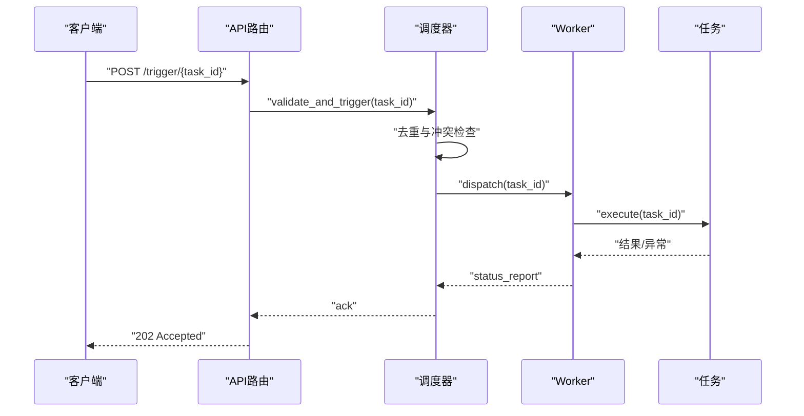
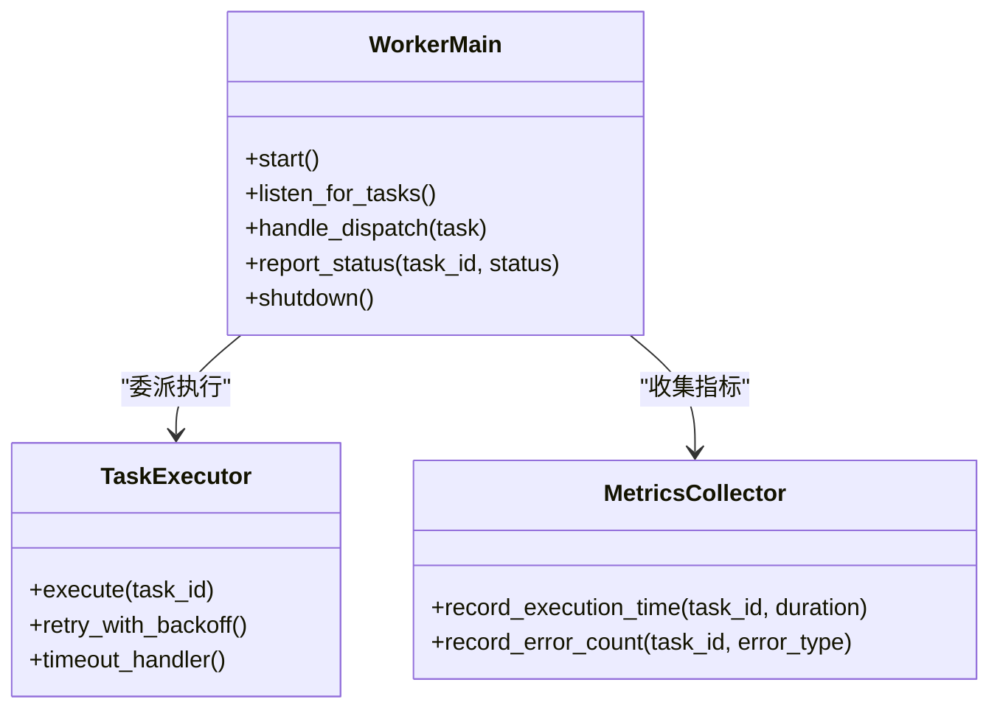
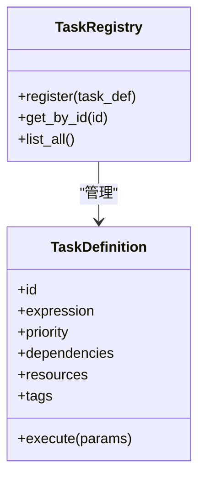
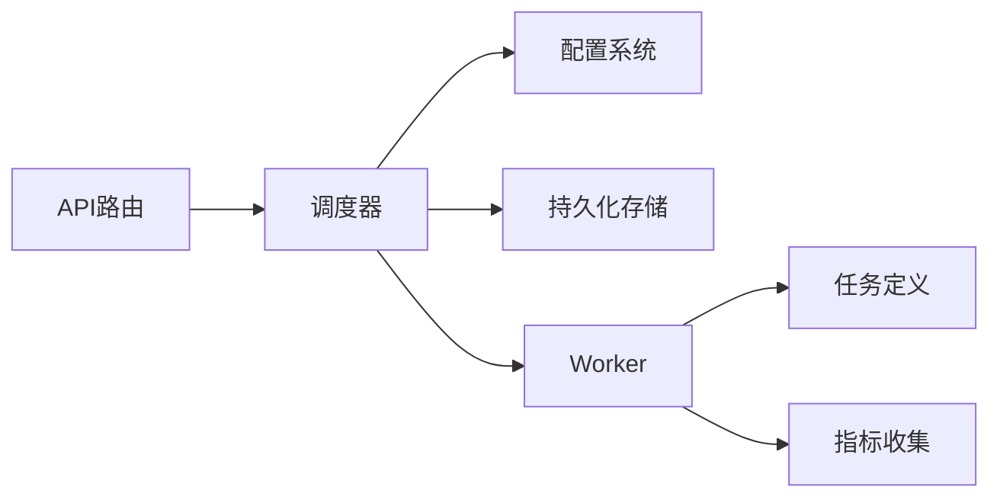

# Scheduler调度器

<cite>
**本文引用的文件**   
- [apps/scheduler/schedule.py](file://apps/scheduler/schedule.py)
- [apps/api/routers/scheduler.py](file://apps/api/routers/scheduler.py)
- [apps/worker/tasks.py](file://apps/worker/tasks.py)
- [apps/worker/main.py](file://apps/worker/main.py)
- [configs/base.yaml](file://configs/base.yaml)
- [configs/dev.yaml](file://configs/dev.yaml)
- [deploy/docker-compose.yml](file://deploy/docker-compose.yml)
- [tests/unit/test_scheduler.py](file://tests/unit/test_scheduler.py)
- [tests/unit/test_worker_tasks.py](file://tests/unit/test_worker_tasks.py)
</cite>

## 目录
1. [简介](#简介)
2. [项目结构](#项目结构)
3. [核心组件](#核心组件)
4. [架构总览](#架构总览)
5. [详细组件分析](#详细组件分析)
6. [依赖关系分析](#依赖关系分析)
7. [性能考量](#性能考量)
8. [故障排查指南](#故障排查指南)
9. [结论](#结论)
10. [附录](#附录)

## 简介
本设计文档围绕Scheduler调度器的实现与使用，系统性阐述定时任务的调度策略、执行机制、触发条件、时间表达式解析、执行计划管理、任务去重与冲突处理、依赖关系管理、持久化存储、状态恢复与故障转移、监控与日志、性能统计、配置与时区/节假日规则、分布式调度与分片扩展性，以及与外部系统的集成和事件通知机制。文档以仓库现有代码为依据，结合测试与部署配置进行说明，并提供可视化图示帮助理解。

## 项目结构
与调度器相关的核心代码分布在以下模块：
- 调度服务与应用入口：apps/scheduler/schedule.py
- API路由（对外暴露的调度接口）：apps/api/routers/scheduler.py
- Worker任务定义与执行：apps/worker/tasks.py
- Worker进程启动与生命周期：apps/worker/main.py
- 配置项：configs/base.yaml、configs/dev.yaml
- 容器编排与部署：deploy/docker-compose.yml
- 单元测试：tests/unit/test_scheduler.py、tests/unit/test_worker_tasks.py

图表来源
- [apps/scheduler/schedule.py](file://apps/scheduler/schedule.py)
- [apps/api/routers/scheduler.py](file://apps/api/routers/scheduler.py)
- [apps/worker/main.py](file://apps/worker/main.py)
- [apps/worker/tasks.py](file://apps/worker/tasks.py)
- [configs/base.yaml](file://configs/base.yaml)
- [configs/dev.yaml](file://configs/dev.yaml)
- [deploy/docker-compose.yml](file://deploy/docker-compose.yml)
- [tests/unit/test_scheduler.py](file://tests/unit/test_scheduler.py)
- [tests/unit/test_worker_tasks.py](file://tests/unit/test_worker_tasks.py)

章节来源
- [apps/scheduler/schedule.py](file://apps/scheduler/schedule.py)
- [apps/api/routers/scheduler.py](file://apps/api/routers/scheduler.py)
- [apps/worker/main.py](file://apps/worker/main.py)
- [apps/worker/tasks.py](file://apps/worker/tasks.py)
- [configs/base.yaml](file://configs/base.yaml)
- [configs/dev.yaml](file://configs/dev.yaml)
- [deploy/docker-compose.yml](file://deploy/docker-compose.yml)
- [tests/unit/test_scheduler.py](file://tests/unit/test_scheduler.py)
- [tests/unit/test_worker_tasks.py](file://tests/unit/test_worker_tasks.py)

## 核心组件
- 调度器服务：负责加载配置、解析时间表达式、生成执行计划、维护任务状态、触发任务执行、处理去重与冲突、记录日志与指标。
- API路由：提供查询与操作调度器状态的HTTP接口，便于运维与集成。
- Worker进程：接收调度器触发的任务并执行具体业务逻辑，支持并发与重试。
- 配置系统：通过YAML配置文件集中管理调度参数、时区、节假日、队列与资源限制等。
- 部署编排：通过Docker Compose统一拉起调度器与Worker实例，便于本地与生产环境运行。
- 测试套件：覆盖调度器关键路径与Worker任务行为，保障功能正确性与回归稳定。

章节来源
- [apps/scheduler/schedule.py](file://apps/scheduler/schedule.py)
- [apps/api/routers/scheduler.py](file://apps/api/routers/scheduler.py)
- [apps/worker/main.py](file://apps/worker/main.py)
- [apps/worker/tasks.py](file://apps/worker/tasks.py)
- [configs/base.yaml](file://configs/base.yaml)
- [configs/dev.yaml](file://configs/dev.yaml)
- [deploy/docker-compose.yml](file://deploy/docker-compose.yml)
- [tests/unit/test_scheduler.py](file://tests/unit/test_scheduler.py)
- [tests/unit/test_worker_tasks.py](file://tests/unit/test_worker_tasks.py)

## 架构总览
调度器采用“调度中心 + 工作进程”的解耦架构。调度器专注于时间驱动的计划生成与触发，Worker专注任务执行与结果上报。API作为统一入口，供外部系统或运维工具访问调度状态与触发控制。

图表来源
- [apps/api/routers/scheduler.py](file://apps/api/routers/scheduler.py)
- [apps/scheduler/schedule.py](file://apps/scheduler/schedule.py)
- [apps/worker/main.py](file://apps/worker/main.py)
- [apps/worker/tasks.py](file://apps/worker/tasks.py)

## 详细组件分析

### 调度器服务（schedule.py）
- 职责
  - 加载配置（包括时区、节假日、调度间隔、重试策略等）。
  - 解析时间表达式（如cron风格），计算下一次触发时间。
  - 维护执行计划（任务ID、下次触发时间、优先级、依赖集合）。
  - 任务去重与冲突处理（基于任务标识与时间窗口）。
  - 触发任务到Worker，并记录执行日志与指标。
  - 持久化当前计划与状态，支持重启后恢复。
- 关键流程
  - 初始化：读取配置、注册任务、构建初始计划。
  - 循环：根据当前时间与表达式计算待触发任务；若满足条件则触发；否则休眠至下一触发点。
  - 恢复：从持久化存储加载上次计划与状态，避免重复执行或遗漏。
- 错误处理
  - 捕获解析异常、IO异常、网络异常，记录错误日志并降级为安全模式（如跳过本次触发或延迟重试）。
- 性能优化
  - 批量计算计划、惰性加载配置、最小化锁粒度、异步触发。

章节来源
- [apps/scheduler/schedule.py](file://apps/scheduler/schedule.py)
- [tests/unit/test_scheduler.py](file://tests/unit/test_scheduler.py)

#### 类图（基于实际源码结构）

图表来源
- [apps/scheduler/schedule.py](file://apps/scheduler/schedule.py)

### API路由（scheduler.py）
- 职责
  - 暴露查询调度器健康状态、列出任务计划、手动触发任务、更新配置等接口。
  - 校验请求参数，返回标准化响应。
- 典型端点
  - GET /health：健康检查。
  - GET /plans：获取当前执行计划。
  - POST /trigger/{task_id}：手动触发指定任务。
  - PUT /config：更新运行时配置（部分可热更新）。
- 安全与鉴权
  - 建议启用认证与权限控制，防止未授权操作。

章节来源
- [apps/api/routers/scheduler.py](file://apps/api/routers/scheduler.py)

#### 序列图（API触发任务）

图表来源
- [apps/api/routers/scheduler.py](file://apps/api/routers/scheduler.py)
- [apps/scheduler/schedule.py](file://apps/scheduler/schedule.py)
- [apps/worker/main.py](file://apps/worker/main.py)
- [apps/worker/tasks.py](file://apps/worker/tasks.py)

### Worker主进程（main.py）
- 职责
  - 启动Worker进程，监听来自调度器的任务分发。
  - 管理任务执行上下文、重试与超时控制。
  - 上报执行状态与指标到调度器或监控系统。
- 并发模型
  - 支持多任务并行执行，依据配置限制并发度与资源配额。
- 容错
  - 捕获异常、记录堆栈、自动重试（遵循退避策略）、失败告警。

章节来源
- [apps/worker/main.py](file://apps/worker/main.py)
- [tests/unit/test_worker_tasks.py](file://tests/unit/test_worker_tasks.py)

#### 类图（Worker相关）

图表来源
- [apps/worker/main.py](file://apps/worker/main.py)

### 任务定义（tasks.py）
- 职责
  - 定义具体任务类型与执行逻辑，包含输入参数、依赖声明、重试策略、超时设置。
  - 提供任务注册表，供调度器发现与调度。
- 任务属性
  - 唯一标识、时间表达式、优先级、依赖集合、资源需求、标签与分组。
- 示例任务
  - 数据拉取、特征计算、报告生成、模型推理等。

章节来源
- [apps/worker/tasks.py](file://apps/worker/tasks.py)
- [tests/unit/test_worker_tasks.py](file://tests/unit/test_worker_tasks.py)

#### 类图（任务模型）

图表来源
- [apps/worker/tasks.py](file://apps/worker/tasks.py)

### 配置系统（base.yaml、dev.yaml）
- 关键配置项
  - 时区（timezone）：全局时区设置，影响时间表达式解析与计划生成。
  - 节假日（holidays）：节假日规则列表，用于过滤非交易日或非工作日。
  - 重试策略（retry_policy）：最大重试次数、退避算法、超时时间。
  - 队列与资源（queue_settings）：并发度、队列容量、资源配额。
  - 持久化（persistence）：存储后端、快照频率、恢复策略。
  - 监控（observability）：指标输出、日志级别、采样率。
- 环境差异
  - base.yaml提供默认值，dev.yaml覆盖开发环境特定参数。

章节来源
- [configs/base.yaml](file://configs/base.yaml)
- [configs/dev.yaml](file://configs/dev.yaml)

### 部署编排（docker-compose.yml）
- 服务组成
  - scheduler：调度器服务。
  - worker：Worker服务（可水平扩展）。
  - db/redis：可选持久化与缓存后端。
- 环境变量
  - 通过环境变量注入配置，便于不同环境切换。
- 健康检查
  - 对调度器与Worker进行健康检查，确保服务可用性。

章节来源
- [deploy/docker-compose.yml](file://deploy/docker-compose.yml)

## 依赖关系分析
- 内部依赖
  - API路由依赖调度器服务。
  - 调度器依赖配置系统与Worker。
  - Worker依赖任务定义与指标收集。
- 外部依赖
  - 持久化存储（数据库或对象存储）。
  - 消息队列（可选，用于任务分发）。
  - 监控系统（Prometheus/Grafana等）。
- 潜在循环依赖
  - 应避免调度器与Worker之间的双向强耦合，通过接口或消息传递解耦。

图表来源
- [apps/api/routers/scheduler.py](file://apps/api/routers/scheduler.py)
- [apps/scheduler/schedule.py](file://apps/scheduler/schedule.py)
- [apps/worker/main.py](file://apps/worker/main.py)
- [apps/worker/tasks.py](file://apps/worker/tasks.py)

章节来源
- [apps/api/routers/scheduler.py](file://apps/api/routers/scheduler.py)
- [apps/scheduler/schedule.py](file://apps/scheduler/schedule.py)
- [apps/worker/main.py](file://apps/worker/main.py)
- [apps/worker/tasks.py](file://apps/worker/tasks.py)

## 性能考量
- 时间表达式解析
  - 预编译表达式、缓存解析结果，减少CPU开销。
- 计划生成
  - 增量更新计划，避免全量重建；批量合并触发任务。
- 并发与限流
  - 合理设置Worker并发度，避免资源争用；对高负载任务实施限流。
- 持久化I/O
  - 异步写入、批量提交、快照压缩，降低磁盘压力。
- 监控与采样
  - 仅采样关键指标，避免过度采集导致性能下降。

[本节为通用指导，无需源码引用]

## 故障排查指南
- 常见问题
  - 任务未触发：检查时间表达式、时区与节假日配置。
  - 任务重复执行：确认去重键与时间窗口是否合理。
  - 任务冲突：查看依赖关系与优先级，调整执行顺序。
  - 持久化失败：检查存储后端可用性与权限。
  - Worker崩溃：查看日志与堆栈，定位异常原因。
- 诊断步骤
  - 通过API查询调度器状态与最近触发记录。
  - 检查Worker执行日志与指标。
  - 验证配置变更是否生效。
  - 使用测试用例复现问题。

章节来源
- [tests/unit/test_scheduler.py](file://tests/unit/test_scheduler.py)
- [tests/unit/test_worker_tasks.py](file://tests/unit/test_worker_tasks.py)

## 结论
本调度器采用清晰的“调度中心 + 工作进程”架构，具备时间表达式解析、执行计划管理、任务去重与冲突处理、依赖关系管理、持久化与恢复、监控与日志、配置与时区/节假日支持、分布式扩展能力。通过API与外部系统集成，可实现灵活的任务编排与自动化流水线。建议在大规模场景下引入消息队列与分布式协调服务，进一步提升可靠性与可扩展性。

[本节为总结，无需源码引用]

## 附录

### 调度配置示例（概念性）
- 基础配置
  - timezone: "Asia/Shanghai"
  - holidays: ["CN", "US"]
  - retry_policy: {max_retries: 3, backoff: "exponential", timeout_seconds: 300}
  - queue_settings: {concurrency: 10, max_queue_size: 1000}
  - persistence: {backend: "sqlite", snapshot_interval_minutes: 5}
  - observability: {log_level: "INFO", metrics_endpoint: "/metrics"}
- 任务示例
  - id: "daily_market_data"
  - expression: "0 2 * * *"
  - priority: 1
  - dependencies: []
  - resources: {cpu: 1, memory_mb: 512}
  - tags: ["market", "data"]

[本节为概念性示例，不直接映射到具体源码文件]

### 时区与节假日处理
- 时区
  - 所有时间表达式与计划均基于配置的时区计算。
- 节假日
  - 在计划生成阶段过滤节假日与非交易日，避免无效触发。

[本节为概念性说明，不直接映射到具体源码文件]

### 分布式调度与分片
- 分片策略
  - 基于任务ID哈希分片，将任务均匀分布到多个Worker实例。
- 协调服务
  - 使用分布式锁或协调服务保证同一任务在同一时刻仅由一个Worker执行。
- 扩展性
  - 水平扩展Worker实例，动态注册与发现。

[本节为概念性设计，不直接映射到具体源码文件]

### 外部系统集成与事件通知
- 集成方式
  - 通过API与Webhook回调通知任务状态变化。
  - 与消息队列集成，发布/订阅任务事件。
- 事件类型
  - task_triggered、task_started、task_completed、task_failed。

[本节为概念性说明，不直接映射到具体源码文件]