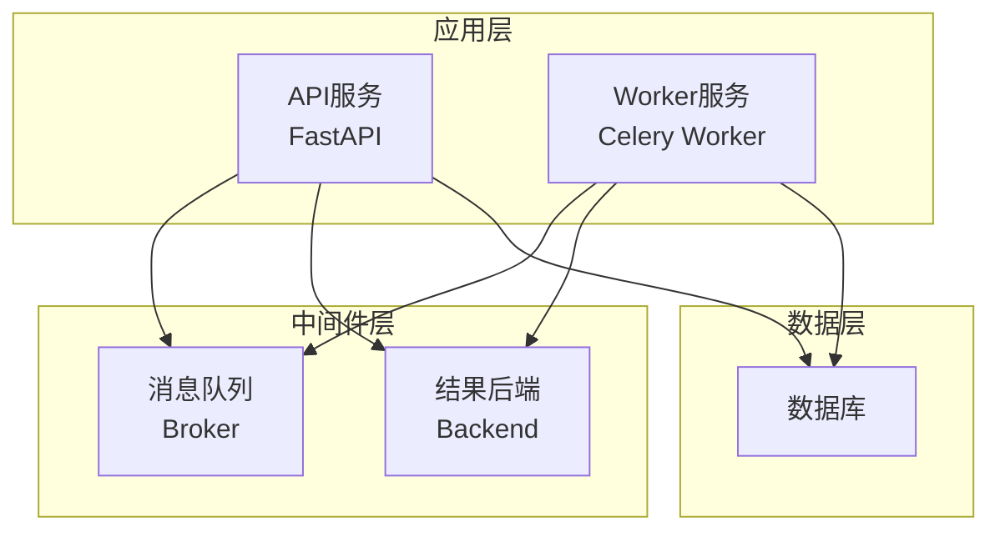
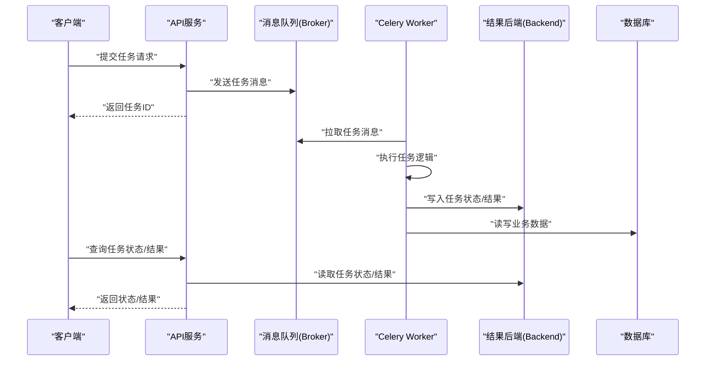
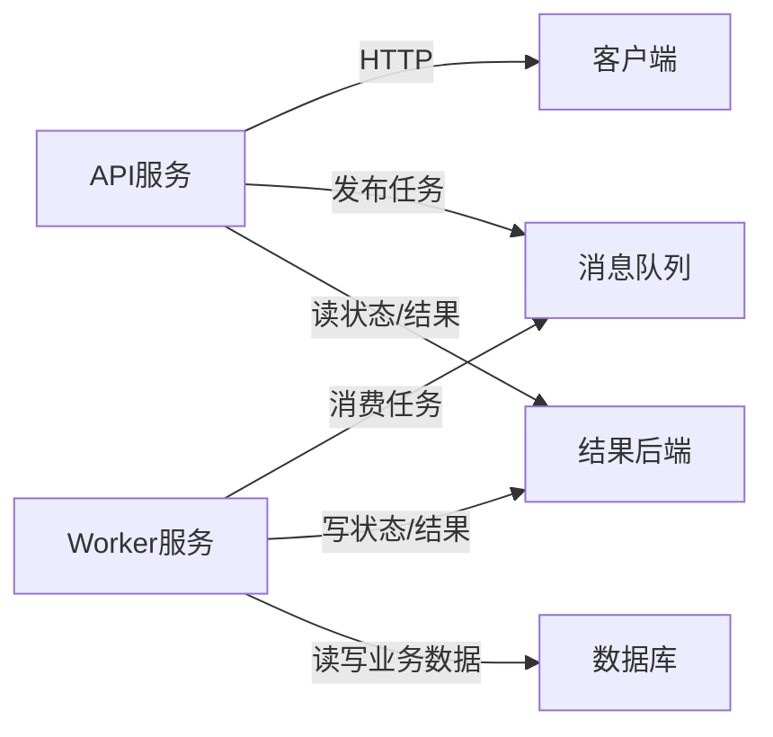

# Worker工作进程

<cite>
**本文引用的文件**   
- [apps/worker/main.py](file://apps/worker/main.py)
- [apps/worker/tasks.py](file://apps/worker/tasks.py)
- [apps/api/main.py](file://apps/api/main.py)
- [configs/base.yaml](file://configs/base.yaml)
- [configs/dev.yaml](file://configs/dev.yaml)
- [deploy/docker-compose.yml](file://deploy/docker-compose.yml)
- [tests/unit/test_worker_tasks.py](file://tests/unit/test_worker_tasks.py)
</cite>

## 目录
1. [简介](#简介)
2. [项目结构](#项目结构)
3. [核心组件](#核心组件)
4. [架构总览](#架构总览)
5. [详细组件分析](#详细组件分析)
6. [依赖关系分析](#依赖关系分析)
7. [性能与并发控制](#性能与并发控制)
8. [故障排查指南](#故障排查指南)
9. [结论](#结论)
10. [附录](#附录)

## 简介
本文件围绕Worker工作进程进行系统化设计说明，聚焦Celery任务队列的配置与管理、异步任务的定义与执行流程、优先级与重试策略、失败处理、状态监控与结果存储、并发与资源限制、负载均衡与集群部署、以及与主服务（API）的通信协议和数据交换格式。文档以仓库中实际代码为依据，提供可追溯的来源定位和可视化图示，帮助读者快速理解并落地生产实践。

## 项目结构
本项目采用分层与按功能域组织的方式：
- API服务：负责对外暴露接口，触发任务、查询状态与结果。
- Worker服务：基于Celery的工作进程，消费消息队列中的任务并执行。
- 配置中心：集中管理不同环境的配置项。
- 部署编排：通过Docker Compose编排API与Worker等容器。
- 测试：包含针对Worker任务的单元测试。

图表来源
- [apps/api/main.py](file://apps/api/main.py)
- [apps/worker/main.py](file://apps/worker/main.py)
- [deploy/docker-compose.yml](file://deploy/docker-compose.yml)

章节来源
- [apps/api/main.py](file://apps/api/main.py)
- [apps/worker/main.py](file://apps/worker/main.py)
- [deploy/docker-compose.yml](file://deploy/docker-compose.yml)

## 核心组件
- Celery应用实例：在Worker入口中创建并加载配置，注册任务模块。
- 任务定义：在任务模块中声明具体业务任务，包括参数校验、幂等性、重试与错误处理。
- 配置管理：通过YAML配置文件注入Broker、Backend、并发、路由与日志等设置。
- 调度与触发：API侧调用Celery任务接口，将任务投递到消息队列；Worker拉取并执行。
- 结果与状态：通过结果后端持久化任务状态与返回结果，供API查询。
- 监控与可观测性：结合指标与日志输出，便于问题定位与容量规划。

章节来源
- [apps/worker/main.py](file://apps/worker/main.py)
- [apps/worker/tasks.py](file://apps/worker/tasks.py)
- [configs/base.yaml](file://configs/base.yaml)
- [configs/dev.yaml](file://configs/dev.yaml)

## 架构总览
下图展示了API与Worker之间的交互以及消息流：

图表来源
- [apps/api/main.py](file://apps/api/main.py)
- [apps/worker/main.py](file://apps/worker/main.py)
- [apps/worker/tasks.py](file://apps/worker/tasks.py)

## 详细组件分析

### Worker进程启动与配置加载
- 启动流程：初始化Celery应用实例，加载配置，注册任务模块，启动消费者。
- 配置来源：优先从环境变量覆盖，其次读取YAML配置，最后使用默认值。
- 关键配置项：
  - Broker连接信息（如Redis或RabbitMQ）。
  - Backend连接信息（用于持久化任务状态与结果）。
  - 并发与资源限制（并发数、预取、内存/CPU限制）。
  - 路由与队列（按任务类型分流到不同队列）。
  - 日志级别与输出目标。
- 健康检查：暴露健康端点，便于编排系统探测。

章节来源
- [apps/worker/main.py](file://apps/worker/main.py)
- [configs/base.yaml](file://configs/base.yaml)
- [configs/dev.yaml](file://configs/dev.yaml)

### 任务定义与生命周期
- 任务声明：在任务模块中定义任务函数，指定队列、超时、重试策略等。
- 生命周期阶段：
  - 入队：API调用生成任务并投递到Broker。
  - 拉取：Worker从队列拉取任务。
  - 执行：执行任务逻辑，更新进度与中间结果。
  - 完成：写入最终结果与状态。
  - 失败：记录异常、触发重试或进入死信队列。
- 幂等性与去重：对重复消息进行识别与过滤，避免重复计算。
- 进度跟踪：在长耗时任务中周期性上报进度，便于前端展示。

章节来源
- [apps/worker/tasks.py](file://apps/worker/tasks.py)
- [tests/unit/test_worker_tasks.py](file://tests/unit/test_worker_tasks.py)

### 任务优先级、重试与失败处理
- 优先级：
  - 通过队列分离实现硬优先级（高优队列、普通队列）。
  - 或通过消息属性设置软优先级（取决于Broker支持）。
- 重试机制：
  - 指数退避与最大重试次数。
  - 区分可重试与不可重试异常。
- 失败处理：
  - 记录结构化日志与上下文。
  - 告警与人工介入通道。
  - 死信队列与补偿任务。

章节来源
- [apps/worker/tasks.py](file://apps/worker/tasks.py)
- [configs/base.yaml](file://configs/base.yaml)

### 状态监控、进度跟踪与结果存储
- 状态模型：PENDING、STARTED、SUCCESS、FAILURE、RETRY等。
- 进度上报：在任务内定期更新进度字段，供API查询。
- 结果存储：
  - 短期缓存：适合热数据与短生命周期任务。
  - 持久化存储：适合审计与回溯需求。
- 查询接口：
  - 根据任务ID获取状态与结果。
  - 批量查询与分页。

章节来源
- [apps/worker/tasks.py](file://apps/worker/tasks.py)
- [apps/api/main.py](file://apps/api/main.py)

### 并发控制、资源限制与负载均衡
- 并发模型：
  - 进程池与线程池选择。
  - 预取数量与限流策略。
- 资源限制：
  - CPU/内存上限。
  - I/O密集型与CPU密集型的差异化配置。
- 负载均衡：
  - 多Worker实例水平扩展。
  - 队列路由与任务亲和性。

章节来源
- [configs/base.yaml](file://configs/base.yaml)
- [deploy/docker-compose.yml](file://deploy/docker-compose.yml)

### 与主服务的通信协议与数据交换格式
- 触发方式：
  - HTTP接口接收任务提交请求，返回任务ID。
  - 内部事件驱动（可选）。
- 数据格式：
  - 请求体包含任务类型、参数、优先级、路由键等。
  - 响应体包含任务ID与预期状态。
- 查询方式：
  - 通过任务ID查询状态与结果。
  - 支持轮询与回调（可选）。

章节来源
- [apps/api/main.py](file://apps/api/main.py)
- [apps/worker/tasks.py](file://apps/worker/tasks.py)

### 任务示例与最佳实践
- 示例场景：
  - 数据处理流水线任务。
  - 定时批处理任务。
  - 外部系统同步任务。
- 最佳实践：
  - 明确输入输出契约与校验。
  - 合理拆分任务粒度。
  - 统一错误码与日志规范。
  - 使用事务与幂等键保障一致性。

章节来源
- [apps/worker/tasks.py](file://apps/worker/tasks.py)
- [tests/unit/test_worker_tasks.py](file://tests/unit/test_worker_tasks.py)

### 持久化、消息队列与集群部署
- 持久化：
  - 任务状态与结果持久化到Backend。
  - 业务数据落库，保证可恢复。
- 消息队列：
  - 选择高可用Broker（如Redis/RabbitMQ）。
  - 开启持久化与镜像复制。
- 集群部署：
  - 多Worker节点横向扩展。
  - 共享Broker与Backend。
  - 健康检查与自动重启。

章节来源
- [deploy/docker-compose.yml](file://deploy/docker-compose.yml)
- [configs/base.yaml](file://configs/base.yaml)

## 依赖关系分析
- 组件耦合：
  - API与Worker通过消息队列解耦。
  - Worker与结果后端强依赖，用于状态与结果存取。
  - 配置集中管理，降低环境差异带来的风险。
- 外部依赖：
  - 消息队列与结果后端的版本兼容性。
  - 数据库驱动与连接池配置。
- 潜在循环依赖：
  - 确保任务模块不反向依赖API层。

图表来源
- [apps/api/main.py](file://apps/api/main.py)
- [apps/worker/main.py](file://apps/worker/main.py)
- [deploy/docker-compose.yml](file://deploy/docker-compose.yml)

章节来源
- [apps/api/main.py](file://apps/api/main.py)
- [apps/worker/main.py](file://apps/worker/main.py)
- [deploy/docker-compose.yml](file://deploy/docker-compose.yml)

## 性能与并发控制
- 吞吐优化：
  - 调整预取数量与并发度。
  - 批处理与合并任务。
- 延迟控制：
  - 高优队列隔离。
  - 任务分片与并行化。
- 资源管控：
  - 单任务资源上限。
  - 全局配额与抢占策略。
- 监控指标：
  - 队列长度、消费速率、失败率、平均耗时。
  - 资源使用率与GC行为。

[本节为通用指导，无需特定文件来源]

## 故障排查指南
- 常见问题：
  - 任务堆积：检查Worker实例数与预取配置。
  - 任务失败：查看日志与异常堆栈，确认重试策略。
  - 结果丢失：验证Backend连通性与持久化开关。
  - 死锁与阻塞：分析I/O与锁竞争。
- 诊断步骤：
  - 查看任务状态与中间结果。
  - 核对配置与环境变量。
  - 复现最小用例并采集日志。
- 恢复策略：
  - 清理死信队列并重放。
  - 扩容Worker与限流降级。
  - 回滚至稳定版本。

章节来源
- [apps/worker/tasks.py](file://apps/worker/tasks.py)
- [tests/unit/test_worker_tasks.py](file://tests/unit/test_worker_tasks.py)

## 结论
通过将任务生产与消费解耦，并结合合理的并发与资源控制、完善的状态与结果管理、以及健壮的失败处理与监控体系，Worker能够稳定支撑大规模异步任务处理。建议在生产环境中严格遵循配置基线、实施灰度发布与容量规划，持续优化任务粒度与路由策略，以提升整体吞吐与可靠性。

[本节为总结性内容，无需特定文件来源]

## 附录
- 术语表：
  - Broker：消息队列中间件。
  - Backend：任务状态与结果存储后端。
  - 预取：Worker预先拉取的消息数量。
  - 幂等：多次执行产生相同效果。
- 参考链接：
  - Celery官方文档（概念与配置项）。
  - 消息队列与结果后端选型指南。

[本节为补充信息，无需特定文件来源]