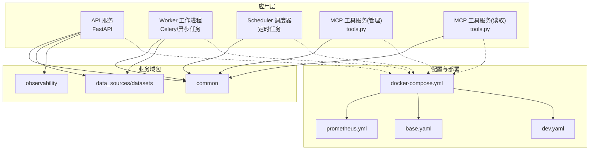
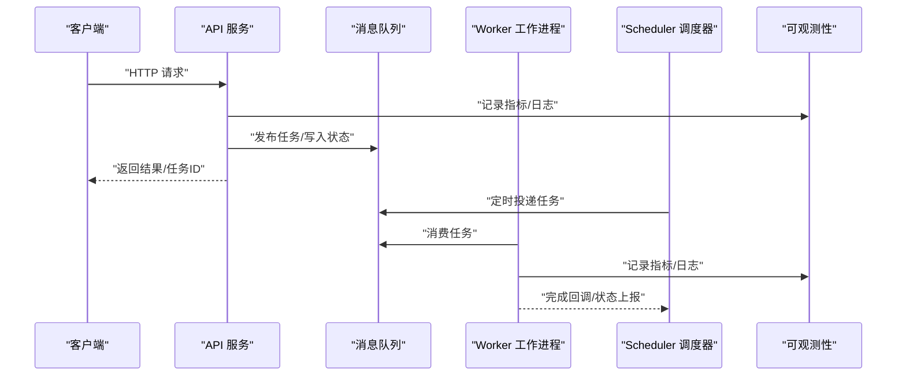
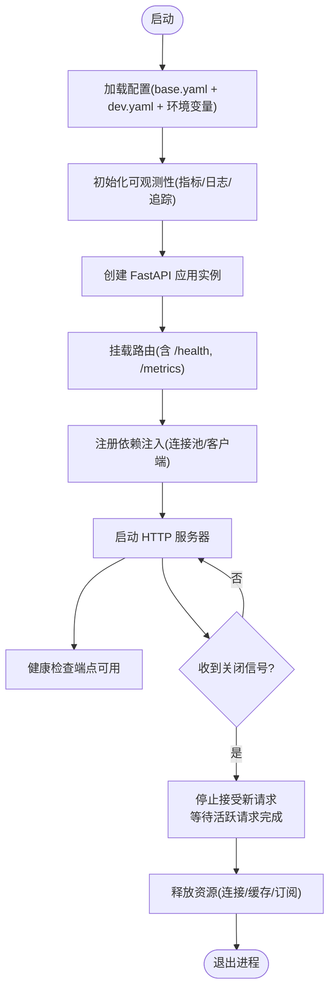
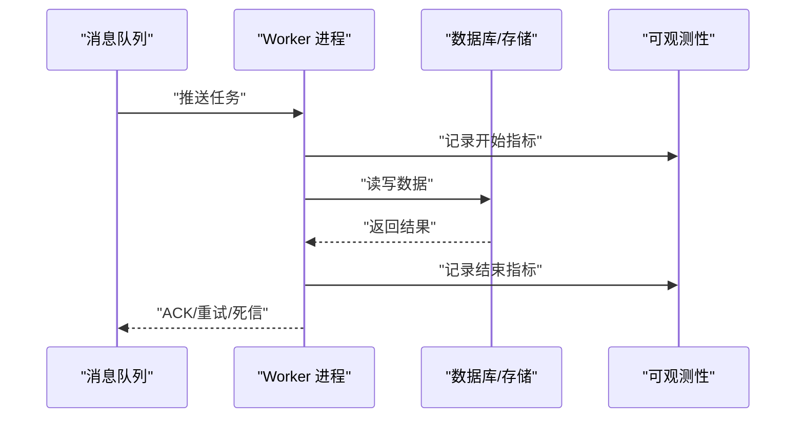
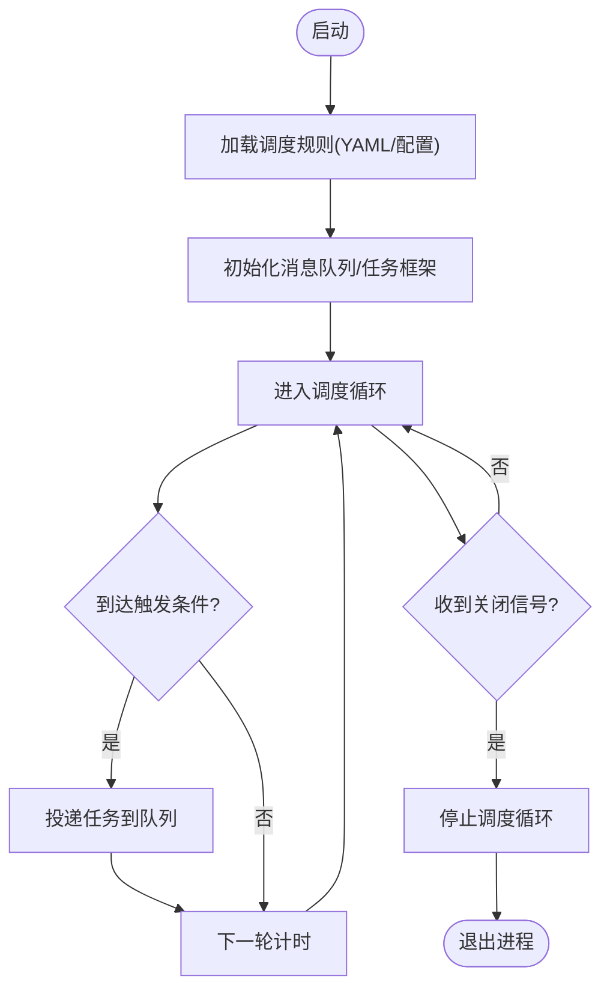
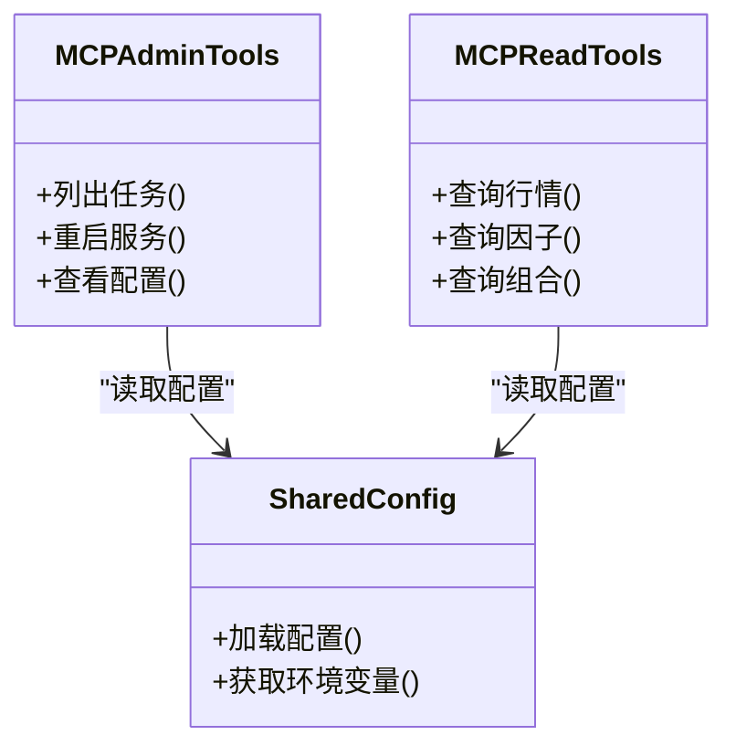
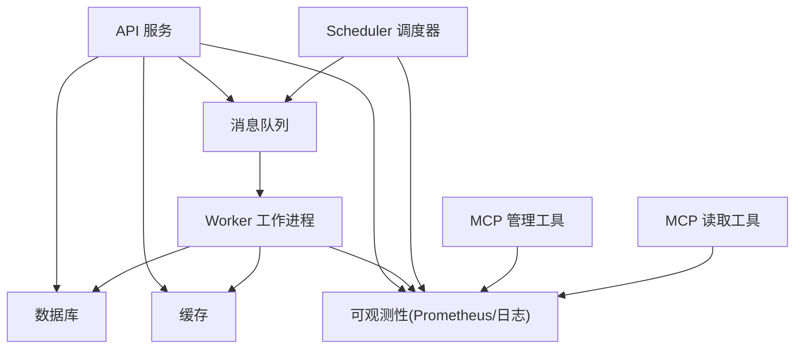

# 服务组件详解

<cite>
**本文引用的文件**   
- [apps/api/main.py](file://apps/api/main.py)
- [apps/api/deps.py](file://apps/api/deps.py)
- [apps/api/routers/scheduler.py](file://apps/api/routers/scheduler.py)
- [apps/worker/main.py](file://apps/worker/main.py)
- [apps/worker/tasks.py](file://apps/worker/tasks.py)
- [apps/scheduler/schedule.py](file://apps/scheduler/schedule.py)
- [apps/quant-admin-mcp/tools.py](file://apps/quant-admin-mcp/tools.py)
- [apps/quant-read-mcp/tools.py](file://apps/quant-read-mcp/tools.py)
- [configs/base.yaml](file://configs/base.yaml)
- [configs/dev.yaml](file://configs/dev.yaml)
- [deploy/docker-compose.yml](file://deploy/docker-compose.yml)
- [deploy/prometheus.yml](file://deploy/prometheus.yml)
- [pyproject.toml](file://pyproject.toml)
</cite>

## 目录
1. [简介](#简介)
2. [项目结构](#项目结构)
3. [核心组件](#核心组件)
4. [架构总览](#架构总览)
5. [详细组件分析](#详细组件分析)
6. [依赖关系分析](#依赖关系分析)
7. [性能考虑](#性能考虑)
8. [故障排查指南](#故障排查指南)
9. [结论](#结论)
10. [附录](#附录)

## 简介
本设计文档面向微服务化后的量化平台，聚焦以下核心服务的职责边界与实现细节：API 服务、Worker 工作进程、Scheduler 调度器、MCP 工具服务。文档覆盖启动流程、依赖注入机制、生命周期管理、资源管理、配置加载与环境变量处理、动态配置更新、健康检查、优雅关闭与资源清理、服务间依赖与注册发现、监控指标与日志规范、错误处理模式，以及部署参数与配置示例。

## 项目结构
仓库采用应用分层与多应用组织方式：
- apps：包含 API 服务、Worker、Scheduler、MCP 工具等可独立运行的应用入口与路由/任务定义
- configs：YAML 配置文件（基础与开发环境）
- deploy：容器编排与监控采集配置
- packages：业务域包（数据源、特征、回测、评估、报告等）
- tests：单元测试与集成测试
- sql/migrations：数据库迁移脚本

图表来源
- [apps/api/main.py](file://apps/api/main.py)
- [apps/worker/main.py](file://apps/worker/main.py)
- [apps/scheduler/schedule.py](file://apps/scheduler/schedule.py)
- [apps/quant-admin-mcp/tools.py](file://apps/quant-admin-mcp/tools.py)
- [apps/quant-read-mcp/tools.py](file://apps/quant-read-mcp/tools.py)
- [configs/base.yaml](file://configs/base.yaml)
- [configs/dev.yaml](file://configs/dev.yaml)
- [deploy/docker-compose.yml](file://deploy/docker-compose.yml)
- [deploy/prometheus.yml](file://deploy/prometheus.yml)

章节来源
- [apps/api/main.py](file://apps/api/main.py)
- [apps/worker/main.py](file://apps/worker/main.py)
- [apps/scheduler/schedule.py](file://apps/scheduler/schedule.py)
- [apps/quant-admin-mcp/tools.py](file://apps/quant-admin-mcp/tools.py)
- [apps/quant-read-mcp/tools.py](file://apps/quant-read-mcp/tools.py)
- [configs/base.yaml](file://configs/base.yaml)
- [configs/dev.yaml](file://configs/dev.yaml)
- [deploy/docker-compose.yml](file://deploy/docker-compose.yml)
- [deploy/prometheus.yml](file://deploy/prometheus.yml)

## 核心组件
- API 服务：提供 HTTP REST 接口，承载查询、控制面操作与部分管理功能；负责请求路由、鉴权、校验、响应封装与可观测性埋点。
- Worker 工作进程：执行耗时或异步任务（如数据入库、特征计算、报表生成），通过消息队列与调度器协作。
- Scheduler 调度器：按周期或事件触发任务，将作业投递至 Worker 或直接驱动内部逻辑。
- MCP 工具服务：对外暴露模型上下文协议（MCP）工具能力，分为“管理”和“读取”两类工具集，供上层 Agent 调用。

章节来源
- [apps/api/main.py](file://apps/api/main.py)
- [apps/worker/main.py](file://apps/worker/main.py)
- [apps/scheduler/schedule.py](file://apps/scheduler/schedule.py)
- [apps/quant-admin-mcp/tools.py](file://apps/quant-admin-mcp/tools.py)
- [apps/quant-read-mcp/tools.py](file://apps/quant-read-mcp/tools.py)

## 架构总览
整体采用“HTTP 控制面 + 异步任务 + 定时调度 + MCP 工具扩展”的解耦架构。API 作为统一入口，将写路径与重计算路径下沉到 Worker；Scheduler 负责周期性任务编排；MCP 工具为外部智能体提供标准化能力。

图表来源
- [apps/api/main.py](file://apps/api/main.py)
- [apps/worker/main.py](file://apps/worker/main.py)
- [apps/scheduler/schedule.py](file://apps/scheduler/schedule.py)
- [deploy/prometheus.yml](file://deploy/prometheus.yml)

## 详细组件分析

### API 服务
- 职责边界
  - 接收并验证 HTTP 请求，进行权限与参数校验
  - 协调业务域包完成读路径与轻量写路径
  - 对耗时任务进行异步化，返回任务标识或最终结果
  - 暴露健康检查端点与必要管理接口
- 启动流程
  - 加载配置（环境变量优先，YAML 合并）
  - 初始化可观测性（指标、日志、追踪）
  - 创建应用实例并挂载路由
  - 启动 HTTP 服务器（支持热重载用于开发）
- 依赖注入机制
  - 使用 FastAPI 依赖注入系统，集中声明共享资源（数据库连接池、缓存、外部客户端）
  - 在 deps 模块中定义工厂函数，按需创建并复用资源
- 生命周期管理
  - 应用启动时建立连接池、预热缓存、注册信号处理器
  - 应用关闭时释放连接、刷新缓冲、停止后台协程
- 资源管理
  - 连接池大小、超时、重试策略由配置驱动
  - 限流与熔断通过中间件或网关侧实现
- 配置加载与环境变量
  - 基础配置来自 base.yaml，运行时通过 dev.yaml 或环境变量覆盖
  - 关键开关（调试、日志级别、端口、数据库 URL）支持环境变量注入
- 健康检查
  - /health 返回服务就绪与依赖可用性（DB、缓存、队列）
- 优雅关闭
  - 捕获 SIGTERM/SIGINT，拒绝新请求，等待活跃请求完成，再退出进程
- 监控与日志
  - 暴露 /metrics 端点，Prometheus 抓取
  - 结构化 JSON 日志，包含请求 ID、用户、耗时、状态码

图表来源
- [apps/api/main.py](file://apps/api/main.py)
- [apps/api/deps.py](file://apps/api/deps.py)
- [apps/api/routers/scheduler.py](file://apps/api/routers/scheduler.py)
- [configs/base.yaml](file://configs/base.yaml)
- [configs/dev.yaml](file://configs/dev.yaml)
- [deploy/prometheus.yml](file://deploy/prometheus.yml)

章节来源
- [apps/api/main.py](file://apps/api/main.py)
- [apps/api/deps.py](file://apps/api/deps.py)
- [apps/api/routers/scheduler.py](file://apps/api/routers/scheduler.py)
- [configs/base.yaml](file://configs/base.yaml)
- [configs/dev.yaml](file://configs/dev.yaml)
- [deploy/prometheus.yml](file://deploy/prometheus.yml)

### Worker 工作进程
- 职责边界
  - 消费任务队列中的作业，执行业务逻辑（数据处理、特征工程、报表生成等）
  - 向调度器或 API 反馈任务状态与结果
- 启动流程
  - 加载配置，初始化连接池与外部客户端
  - 启动消费者，绑定任务处理器
  - 注册信号处理器，支持优雅关闭
- 依赖注入机制
  - 通过全局或进程内单例持有共享资源（数据库、缓存、消息客户端）
  - 任务函数以装饰器形式注册，自动获取依赖
- 生命周期管理
  - 启动阶段建立连接、预热资源
  - 运行阶段持续消费任务，异常时重试/死信
  - 关闭阶段停止消费、刷新缓冲、断开连接
- 资源管理
  - 并发度、重试次数、超时时间由配置控制
  - 任务幂等性与去重策略需保证
- 监控与日志
  - 记录任务开始/结束、耗时、失败原因
  - 暴露进程级指标（队列长度、吞吐、错误率）

图表来源
- [apps/worker/main.py](file://apps/worker/main.py)
- [apps/worker/tasks.py](file://apps/worker/tasks.py)
- [deploy/prometheus.yml](file://deploy/prometheus.yml)

章节来源
- [apps/worker/main.py](file://apps/worker/main.py)
- [apps/worker/tasks.py](file://apps/worker/tasks.py)
- [deploy/prometheus.yml](file://deploy/prometheus.yml)

### Scheduler 调度器
- 职责边界
  - 维护任务计划表，按 Cron/间隔/事件触发任务
  - 将作业投递至 Worker 或触发内部逻辑
- 启动流程
  - 加载配置，解析调度规则
  - 启动调度循环，注册信号处理器
- 依赖注入机制
  - 通过配置中心或本地 YAML 加载调度规则
  - 与消息队列/任务框架集成
- 生命周期管理
  - 启动后加载规则，运行期间监听变更（可选）
  - 关闭时停止调度循环，确保未完成任务安全落盘
- 监控与日志
  - 记录调度延迟、丢弃任务、失败重试
  - 暴露调度相关指标

图表来源
- [apps/scheduler/schedule.py](file://apps/scheduler/schedule.py)
- [configs/base.yaml](file://configs/base.yaml)
- [configs/dev.yaml](file://configs/dev.yaml)

章节来源
- [apps/scheduler/schedule.py](file://apps/scheduler/schedule.py)
- [configs/base.yaml](file://configs/base.yaml)
- [configs/dev.yaml](file://configs/dev.yaml)

### MCP 工具服务（管理与读取）
- 职责边界
  - 管理工具：提供系统管理、配置查看、任务控制等能力
  - 读取工具：提供只读的数据查询、元数据访问等能力
- 启动流程
  - 加载配置，初始化工具集
  - 暴露 MCP 协议端点（或作为库被宿主进程加载）
- 依赖注入机制
  - 工具函数通过依赖注入获取共享资源（只读连接、缓存）
- 生命周期管理
  - 启动时注册工具，关闭时注销并释放资源
- 监控与日志
  - 记录工具调用次数、耗时、错误分类
  - 暴露 MCP 调用指标

图表来源
- [apps/quant-admin-mcp/tools.py](file://apps/quant-admin-mcp/tools.py)
- [apps/quant-read-mcp/tools.py](file://apps/quant-read-mcp/tools.py)
- [configs/base.yaml](file://configs/base.yaml)
- [configs/dev.yaml](file://configs/dev.yaml)

章节来源
- [apps/quant-admin-mcp/tools.py](file://apps/quant-admin-mcp/tools.py)
- [apps/quant-read-mcp/tools.py](file://apps/quant-read-mcp/tools.py)
- [configs/base.yaml](file://configs/base.yaml)
- [configs/dev.yaml](file://configs/dev.yaml)

## 依赖关系分析
- 服务耦合
  - API 与 Worker 通过消息队列解耦
  - Scheduler 与 Worker 通过消息队列解耦
  - MCP 工具服务作为库或独立进程，依赖共享配置与只读资源
- 外部依赖
  - 数据库、缓存、消息队列、对象存储
  - 可观测性后端（Prometheus、日志收集）
- 配置与环境
  - 基础配置 base.yaml，开发配置 dev.yaml，环境变量覆盖
  - 容器编排 docker-compose 管理服务启动顺序与健康检查
  - Prometheus 抓取各服务指标

图表来源
- [deploy/docker-compose.yml](file://deploy/docker-compose.yml)
- [deploy/prometheus.yml](file://deploy/prometheus.yml)
- [apps/api/main.py](file://apps/api/main.py)
- [apps/worker/main.py](file://apps/worker/main.py)
- [apps/scheduler/schedule.py](file://apps/scheduler/schedule.py)
- [apps/quant-admin-mcp/tools.py](file://apps/quant-admin-mcp/tools.py)
- [apps/quant-read-mcp/tools.py](file://apps/quant-read-mcp/tools.py)

章节来源
- [deploy/docker-compose.yml](file://deploy/docker-compose.yml)
- [deploy/prometheus.yml](file://deploy/prometheus.yml)
- [apps/api/main.py](file://apps/api/main.py)
- [apps/worker/main.py](file://apps/worker/main.py)
- [apps/scheduler/schedule.py](file://apps/scheduler/schedule.py)
- [apps/quant-admin-mcp/tools.py](file://apps/quant-admin-mcp/tools.py)
- [apps/quant-read-mcp/tools.py](file://apps/quant-read-mcp/tools.py)

## 性能考虑
- 连接池与超时
  - 数据库/缓存连接池大小根据 QPS 与延迟目标调优
  - 合理设置读写超时与重试退避策略
- 并发与背压
  - Worker 并发度受限于 CPU/IO 与下游容量
  - 队列长度与丢弃策略避免雪崩
- 缓存与索引
  - 热点数据缓存，减少重复计算
  - 数据库索引优化查询路径
- 监控与告警
  - 基于 Prometheus 指标与日志关键字告警
  - 关注 P99 延迟、错误率、队列积压

[本节为通用指导，不直接分析具体文件]

## 故障排查指南
- 常见问题定位
  - 健康检查失败：检查依赖可用性（DB、缓存、队列）
  - 任务堆积：检查 Worker 并发度与下游处理能力
  - 调度延迟：检查调度器时钟与任务投递链路
- 日志与指标
  - 结构化日志包含请求 ID、用户、耗时、状态码
  - 指标包括请求量、延迟分位、错误率、队列长度
- 错误处理模式
  - 输入校验失败返回明确错误码与提示
  - 外部依赖失败采用重试与降级策略
  - 不可恢复错误记录审计日志并告警

章节来源
- [deploy/prometheus.yml](file://deploy/prometheus.yml)
- [apps/api/main.py](file://apps/api/main.py)
- [apps/worker/main.py](file://apps/worker/main.py)
- [apps/scheduler/schedule.py](file://apps/scheduler/schedule.py)

## 结论
本设计通过清晰的职责划分与解耦机制，实现了高可用、可扩展的量化平台微服务架构。API 作为统一入口，Worker 承担重负载，Scheduler 负责时序编排，MCP 工具提供标准化能力。配合完善的配置管理、健康检查、优雅关闭与可观测性体系，保障生产环境的稳定运行与快速排障。

[本节为总结性内容，不直接分析具体文件]

## 附录

### 配置示例与部署参数
- 配置层次
  - base.yaml：基础默认配置
  - dev.yaml：开发环境覆盖配置
  - 环境变量：运行时覆盖（如数据库 URL、端口、日志级别）
- 部署参数
  - docker-compose 管理服务启动顺序、端口映射、健康检查
  - Prometheus 抓取各服务 /metrics 端点

章节来源
- [configs/base.yaml](file://configs/base.yaml)
- [configs/dev.yaml](file://configs/dev.yaml)
- [deploy/docker-compose.yml](file://deploy/docker-compose.yml)
- [deploy/prometheus.yml](file://deploy/prometheus.yml)

### 监控指标与日志规范
- 指标
  - 请求量、延迟分位、错误率、队列长度、任务成功率
  - 自定义业务指标（因子计算耗时、数据入库吞吐）
- 日志
  - 结构化 JSON，包含时间戳、服务名、请求 ID、用户、耗时、状态码、错误信息
  - 敏感信息脱敏，统一日志格式便于检索与分析

章节来源
- [deploy/prometheus.yml](file://deploy/prometheus.yml)
- [apps/api/main.py](file://apps/api/main.py)
- [apps/worker/main.py](file://apps/worker/main.py)
- [apps/scheduler/schedule.py](file://apps/scheduler/schedule.py)

### 服务注册与发现
- 当前采用容器编排与服务发现（可通过环境变量或配置中心注入）
- 建议引入轻量注册中心或 K8s Service 进行服务发现与负载均衡

章节来源
- [deploy/docker-compose.yml](file://deploy/docker-compose.yml)
- [pyproject.toml](file://pyproject.toml)