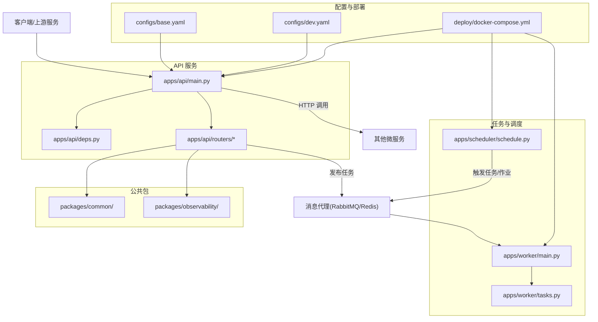
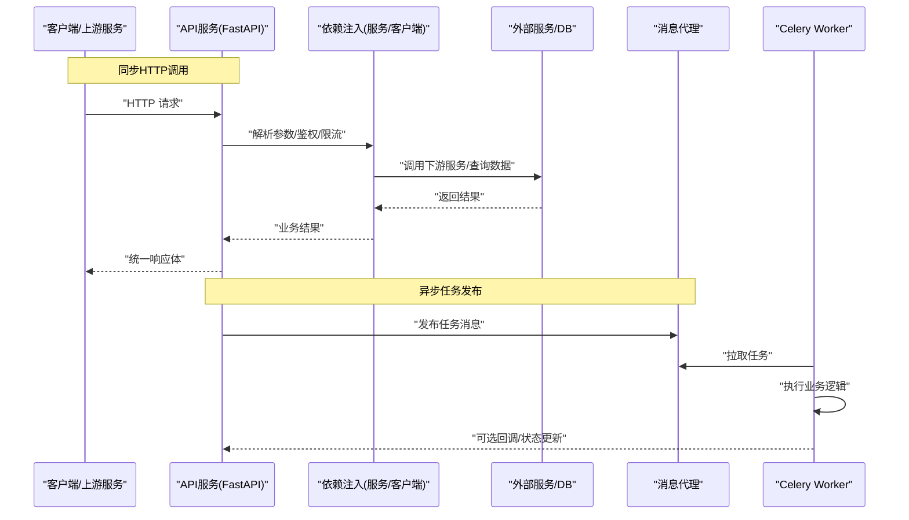
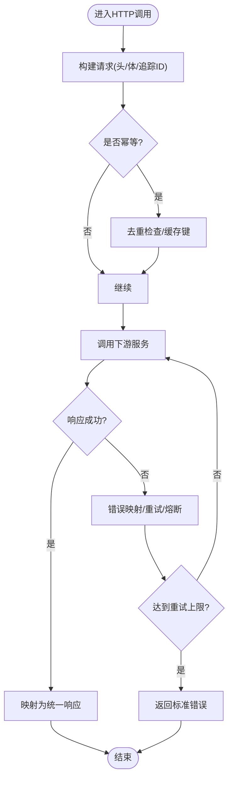
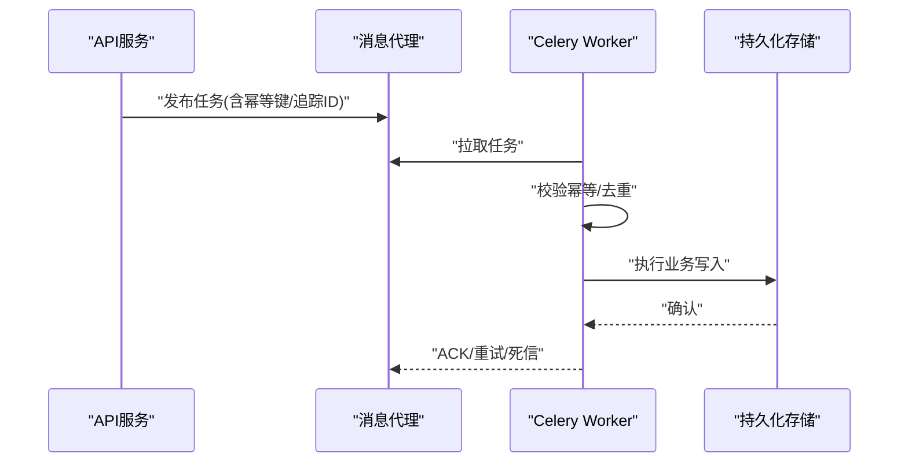
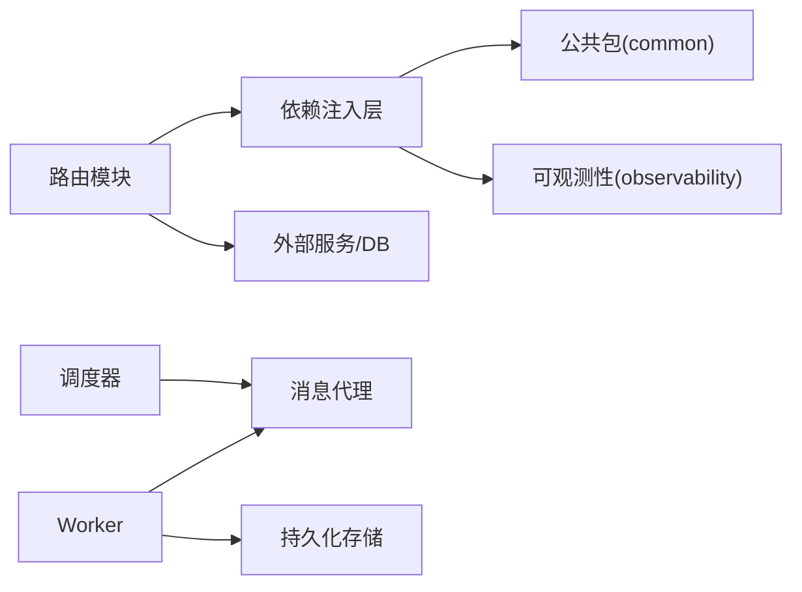

# 服务通信机制

<cite>
**本文引用的文件**   
- [apps/api/main.py](file://apps/api/main.py)
- [apps/api/deps.py](file://apps/api/deps.py)
- [apps/api/routers/__init__.py](file://apps/api/routers/__init__.py)
- [apps/api/routers/instruments.py](file://apps/api/routers/instruments.py)
- [apps/api/routers/markets.py](file://apps/api/routers/markets.py)
- [apps/api/routers/fundamentals.py](file://apps/api/routers/fundamentals.py)
- [apps/api/routers/forecast.py](file://apps/api/routers/forecast.py)
- [apps/api/routers/portfolio.py](file://apps/api/routers/portfolio.py)
- [apps/api/routers/data_status.py](file://apps/api/routers/data_status.py)
- [apps/api/routers/admin_ingestion.py](file://apps/api/routers/admin_ingestion.py)
- [apps/api/routers/scheduler.py](file://apps/api/routers/scheduler.py)
- [apps/worker/main.py](file://apps/worker/main.py)
- [apps/worker/tasks.py](file://apps/worker/tasks.py)
- [apps/scheduler/schedule.py](file://apps/scheduler/schedule.py)
- [packages/common/](file://packages/common/)
- [packages/observability/](file://packages/observability/)
- [deploy/docker-compose.yml](file://deploy/docker-compose.yml)
- [configs/base.yaml](file://configs/base.yaml)
- [configs/dev.yaml](file://configs/dev.yaml)
</cite>

## 目录
1. [引言](#引言)
2. [项目结构](#项目结构)
3. [核心组件](#核心组件)
4. [架构总览](#架构总览)
5. [详细组件分析](#详细组件分析)
6. [依赖分析](#依赖分析)
7. [性能考虑](#性能考虑)
8. [故障排查指南](#故障排查指南)
9. [结论](#结论)
10. [附录](#附录)

## 引言
本设计文档围绕“服务间通信机制”展开，聚焦于同步HTTP调用与异步消息传递两种模式在系统中的实现方案。文档涵盖REST API设计规范、请求响应格式与错误处理约定；Celery任务队列的消息格式、路由规则与重试机制；服务间的依赖注入与共享依赖管理；分布式事务与数据一致性策略（含最终一致性）；认证授权与访问限流；协议版本管理与向后兼容迁移；以及网络故障处理、超时控制与熔断降级等关键议题。

## 项目结构
系统采用多应用分层组织：API网关层（FastAPI）、后台任务层（Celery Worker）、定时调度层（Scheduler），并通过配置与部署编排进行集成。

图表来源
- [apps/api/main.py](file://apps/api/main.py)
- [apps/api/deps.py](file://apps/api/deps.py)
- [apps/api/routers/__init__.py](file://apps/api/routers/__init__.py)
- [apps/api/routers/instruments.py](file://apps/api/routers/instruments.py)
- [apps/api/routers/markets.py](file://apps/api/routers/markets.py)
- [apps/api/routers/fundamentals.py](file://apps/api/routers/fundamentals.py)
- [apps/api/routers/forecast.py](file://apps/api/routers/forecast.py)
- [apps/api/routers/portfolio.py](file://apps/api/routers/portfolio.py)
- [apps/api/routers/data_status.py](file://apps/api/routers/data_status.py)
- [apps/api/routers/admin_ingestion.py](file://apps/api/routers/admin_ingestion.py)
- [apps/api/routers/scheduler.py](file://apps/api/routers/scheduler.py)
- [apps/worker/main.py](file://apps/worker/main.py)
- [apps/worker/tasks.py](file://apps/worker/tasks.py)
- [apps/scheduler/schedule.py](file://apps/scheduler/schedule.py)
- [packages/common/](file://packages/common/)
- [packages/observability/](file://packages/observability/)
- [deploy/docker-compose.yml](file://deploy/docker-compose.yml)
- [configs/base.yaml](file://configs/base.yaml)
- [configs/dev.yaml](file://configs/dev.yaml)

章节来源
- [apps/api/main.py](file://apps/api/main.py)
- [apps/api/deps.py](file://apps/api/deps.py)
- [apps/api/routers/__init__.py](file://apps/api/routers/__init__.py)
- [apps/worker/main.py](file://apps/worker/main.py)
- [apps/worker/tasks.py](file://apps/worker/tasks.py)
- [apps/scheduler/schedule.py](file://apps/scheduler/schedule.py)
- [deploy/docker-compose.yml](file://deploy/docker-compose.yml)
- [configs/base.yaml](file://configs/base.yaml)
- [configs/dev.yaml](file://configs/dev.yaml)

## 核心组件
- API 服务（FastAPI）
  - 入口与中间件注册、全局异常处理、统一响应封装、鉴权与限流中间件挂载点。
  - 路由模块按领域划分，提供REST接口，内部通过依赖注入获取业务服务与外部客户端。
- 任务服务（Celery Worker）
  - 启动Celery应用、加载配置、注册任务、定义重试与死信策略。
- 调度服务（Scheduler）
  - 基于周期或事件触发任务执行，向消息代理投递任务消息。
- 公共包
  - common：通用工具、配置读取、序列化/校验、HTTP客户端封装、重试与熔断基础能力。
  - observability：指标、日志、链路追踪埋点，支撑可观测性与问题定位。
- 配置与部署
  - YAML配置区分环境与默认值；Docker Compose编排各服务进程与依赖（如消息代理）。

章节来源
- [apps/api/main.py](file://apps/api/main.py)
- [apps/api/deps.py](file://apps/api/deps.py)
- [apps/worker/main.py](file://apps/worker/main.py)
- [apps/worker/tasks.py](file://apps/worker/tasks.py)
- [apps/scheduler/schedule.py](file://apps/scheduler/schedule.py)
- [packages/common/](file://packages/common/)
- [packages/observability/](file://packages/observability/)
- [configs/base.yaml](file://configs/base.yaml)
- [configs/dev.yaml](file://configs/dev.yaml)
- [deploy/docker-compose.yml](file://deploy/docker-compose.yml)

## 架构总览
系统由三类运行时组成：
- 同步路径：客户端通过HTTP访问API服务，API服务直接调用下游服务或数据库。
- 异步路径：API或调度器将任务发布到消息代理，Worker消费并执行业务逻辑。
- 可观测性：贯穿请求与任务的生命周期，输出指标、日志与追踪ID。

图表来源
- [apps/api/main.py](file://apps/api/main.py)
- [apps/api/deps.py](file://apps/api/deps.py)
- [apps/worker/main.py](file://apps/worker/main.py)
- [apps/worker/tasks.py](file://apps/worker/tasks.py)
- [deploy/docker-compose.yml](file://deploy/docker-compose.yml)

## 详细组件分析

### REST API 设计规范
- 路由组织
  - 按领域划分路由模块，集中注册至API入口，便于版本化与权限控制。
- 请求/响应格式
  - 请求：标准JSON，包含必要字段与可选扩展字段；支持分页、过滤、排序参数。
  - 响应：统一信封结构，包含状态码、消息、数据体与追踪ID；对错误使用标准化错误对象。
- 版本管理
  - URL前缀或Header方式承载版本号；向后兼容策略要求新增字段非破坏性变更。
- 鉴权与限流
  - 在中间件层完成令牌校验、权限检查与速率限制；失败时返回标准错误响应。
- 可观测性
  - 每个请求携带唯一追踪ID，记录入参出参与耗时，聚合到指标与日志系统。

章节来源
- [apps/api/main.py](file://apps/api/main.py)
- [apps/api/routers/__init__.py](file://apps/api/routers/__init__.py)
- [apps/api/routers/instruments.py](file://apps/api/routers/instruments.py)
- [apps/api/routers/markets.py](file://apps/api/routers/markets.py)
- [apps/api/routers/fundamentals.py](file://apps/api/routers/fundamentals.py)
- [apps/api/routers/forecast.py](file://apps/api/routers/forecast.py)
- [apps/api/routers/portfolio.py](file://apps/api/routers/portfolio.py)
- [apps/api/routers/data_status.py](file://apps/api/routers/data_status.py)
- [apps/api/routers/admin_ingestion.py](file://apps/api/routers/admin_ingestion.py)
- [apps/api/routers/scheduler.py](file://apps/api/routers/scheduler.py)
- [packages/observability/](file://packages/observability/)

### 同步HTTP调用
- 客户端封装
  - 统一的HTTP客户端封装，内置重试、超时、熔断与指标上报。
- 错误处理
  - 将下游异常映射为统一错误对象，包含错误码、提示与上下文信息。
- 幂等与去重
  - 对写操作引入幂等键，避免重复提交导致副作用。
- 超时与熔断
  - 设置合理的连接/读超时；当错误率超过阈值时快速失败，降低雪崩风险。

图表来源
- [apps/api/deps.py](file://apps/api/deps.py)
- [packages/common/](file://packages/common/)
- [packages/observability/](file://packages/observability/)

章节来源
- [apps/api/deps.py](file://apps/api/deps.py)
- [packages/common/](file://packages/common/)
- [packages/observability/](file://packages/observability/)

### 异步消息传递（Celery）
- 任务模型
  - 任务消息包含：任务类型、业务标识、参数、优先级、重试策略、超时时间、追踪ID。
- 路由规则
  - 基于任务名或自定义路由键选择队列；热点任务走独立队列以隔离资源。
- 重试与死信
  - 指数退避重试；超过最大次数转入死信队列，供人工介入或补偿。
- 幂等与去重
  - 任务级幂等键；消费者侧基于业务主键去重。
- 监控与告警
  - 指标：入队/出队/成功/失败/重试次数；告警：积压、失败率、延迟。

图表来源
- [apps/worker/main.py](file://apps/worker/main.py)
- [apps/worker/tasks.py](file://apps/worker/tasks.py)
- [apps/scheduler/schedule.py](file://apps/scheduler/schedule.py)
- [deploy/docker-compose.yml](file://deploy/docker-compose.yml)

章节来源
- [apps/worker/main.py](file://apps/worker/main.py)
- [apps/worker/tasks.py](file://apps/worker/tasks.py)
- [apps/scheduler/schedule.py](file://apps/scheduler/schedule.py)

### 依赖注入与共享依赖管理
- 依赖注入
  - 通过依赖注入容器统一管理服务实例、外部客户端、配置与存储仓库；路由层仅声明依赖，不关心构造细节。
- 共享依赖
  - 公共包提供可复用的HTTP客户端、数据库会话、缓存客户端、指标与日志门面。
- 生命周期
  - 应用启动时初始化共享依赖，关闭时优雅释放资源；支持热重载与灰度切换。

章节来源
- [apps/api/deps.py](file://apps/api/deps.py)
- [packages/common/](file://packages/common/)
- [packages/observability/](file://packages/observability/)

### 分布式事务与一致性
- 强一致场景
  - 优先使用本地事务+可靠落库；跨服务强一致需结合两阶段提交或Saga协调器（若引入）。
- 最终一致
  - 基于事件驱动：生产者发送消息后落库，消费者消费后更新状态；引入幂等与补偿。
- 对账与修复
  - 定期对账任务比对源与目标状态，发现不一致自动修复或告警。

章节来源
- [apps/worker/tasks.py](file://apps/worker/tasks.py)
- [packages/common/](file://packages/common/)

### 认证授权与访问限流
- 认证
  - 基于令牌（如JWT）的无状态认证；支持多租户与角色属性。
- 授权
  - 基于资源的细粒度权限控制；在依赖注入层完成权限校验。
- 限流
  - 基于IP/用户/接口的滑动窗口或令牌桶算法；超限返回标准错误。

章节来源
- [apps/api/main.py](file://apps/api/main.py)
- [apps/api/deps.py](file://apps/api/deps.py)

### 协议版本管理与兼容性
- 版本策略
  - URL前缀或Header承载版本；新增字段保持向后兼容，废弃字段保留过渡期。
- 迁移
  - 双写/灰度发布；旧版与新版并行运行，逐步切流。
- 测试
  - 契约测试与兼容性矩阵验证，确保升级不影响现有调用方。

章节来源
- [apps/api/routers/__init__.py](file://apps/api/routers/__init__.py)
- [apps/api/routers/instruments.py](file://apps/api/routers/instruments.py)

### 网络故障、超时与熔断降级
- 超时
  - 连接超时、读超时、写超时分级配置；根据下游SLA设定合理阈值。
- 熔断
  - 错误率/慢调用比例超阈值时熔断，快速失败；半开探测恢复。
- 降级
  - 非核心功能降级返回缓存或默认值；保障主流程可用。

章节来源
- [packages/common/](file://packages/common/)
- [packages/observability/](file://packages/observability/)

## 依赖分析
- 组件耦合
  - API路由依赖注入层，注入层依赖公共包；Worker与Scheduler通过消息代理解耦。
- 外部依赖
  - 消息代理（RabbitMQ/Redis）、数据库、缓存、指标与日志系统。
- 循环依赖
  - 通过依赖注入与接口抽象避免循环引用。

图表来源
- [apps/api/routers/__init__.py](file://apps/api/routers/__init__.py)
- [apps/api/deps.py](file://apps/api/deps.py)
- [packages/common/](file://packages/common/)
- [packages/observability/](file://packages/observability/)
- [apps/scheduler/schedule.py](file://apps/scheduler/schedule.py)
- [apps/worker/main.py](file://apps/worker/main.py)
- [deploy/docker-compose.yml](file://deploy/docker-compose.yml)

章节来源
- [apps/api/deps.py](file://apps/api/deps.py)
- [apps/worker/main.py](file://apps/worker/main.py)
- [apps/scheduler/schedule.py](file://apps/scheduler/schedule.py)
- [deploy/docker-compose.yml](file://deploy/docker-compose.yml)

## 性能考虑
- 连接池与复用
  - HTTP客户端与数据库连接池复用，减少握手开销。
- 批处理与合并
  - 批量写入与合并查询，降低I/O压力。
- 背压与限流
  - 消费者端按处理能力限速；生产端根据队列深度动态调整发布速率。
- 缓存
  - 热点数据多级缓存（内存/分布式），注意失效策略与一致性。

[本节为通用指导，无需特定文件来源]

## 故障排查指南
- 常见问题
  - 超时：检查下游健康与网络质量，调整超时与重试策略。
  - 熔断：查看错误率与慢调用比例，评估是否需要扩容或优化。
  - 任务堆积：观察队列深度与消费者并发，必要时水平扩展Worker。
- 定位手段
  - 利用追踪ID串联请求与任务；结合指标与日志快速定位瓶颈。
- 恢复策略
  - 重启消费者、清理死信、回滚变更；必要时启用降级开关。

章节来源
- [packages/observability/](file://packages/observability/)
- [apps/worker/tasks.py](file://apps/worker/tasks.py)

## 结论
本设计通过同步HTTP与异步消息两条通道满足多样化通信需求：同步用于低延迟与强交互场景，异步用于高吞吐与解耦场景。配合统一的依赖注入、可观测性、鉴权限流、版本管理与容错机制，系统在可扩展性、稳定性与可维护性方面具备良好基础。后续可根据业务演进引入更完善的分布式事务协调与更强的治理工具链。

[本节为总结性内容，无需特定文件来源]

## 附录
- 配置项建议
  - 超时、重试、熔断阈值、队列大小、消费者并发、指标采样率等。
- 部署要点
  - 环境变量隔离、健康检查探针、滚动升级与回滚策略。

章节来源
- [configs/base.yaml](file://configs/base.yaml)
- [configs/dev.yaml](file://configs/dev.yaml)
- [deploy/docker-compose.yml](file://deploy/docker-compose.yml)