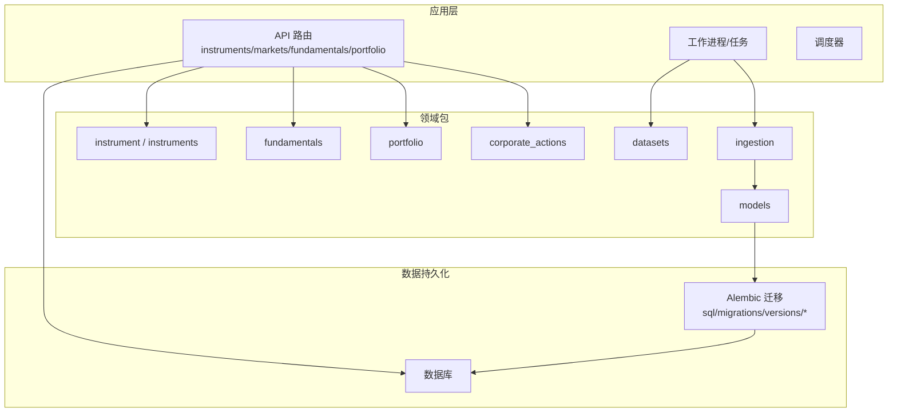
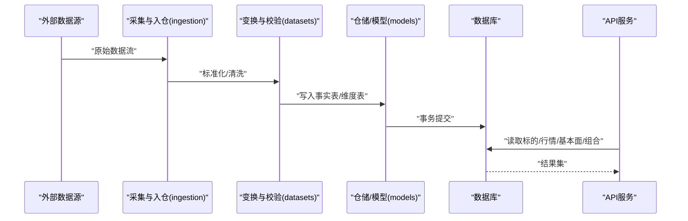
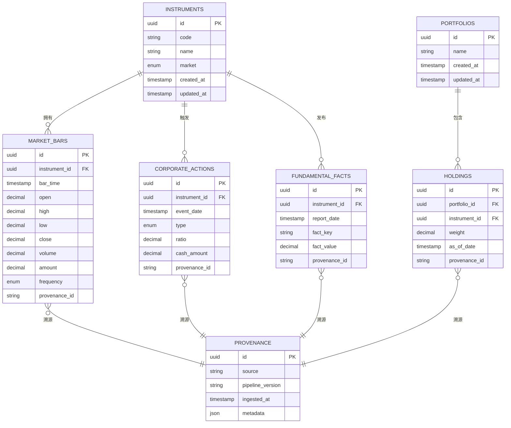
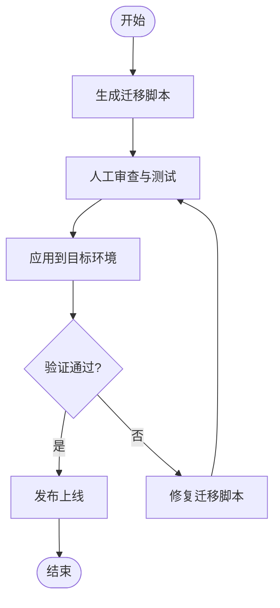
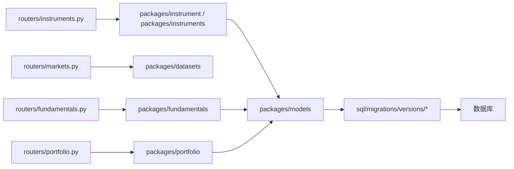

# 数据存储设计

<cite>
**本文引用的文件**   
- [alembic.ini](file://alembic.ini)
- [sql/migrations/env.py](file://sql/migrations/env.py)
- [sql/migrations/script.py.mako](file://sql/migrations/script.py.mako)
- [sql/migrations/versions/20260715_0001_instruments.py](file://sql/migrations/versions/20260715_0001_instruments.py)
- [sql/migrations/versions/20260715_0002_audit_events.py](file://sql/migrations/versions/20260715_0002_audit_events.py)
- [sql/migrations/versions/20260715_0003_market_bar.py](file://sql/migrations/versions/20260715_0003_market_bar.py)
- [sql/migrations/versions/20260715_0004_corporate_action.py](file://sql/migrations/versions/20260715_0004_corporate_action.py)
- [sql/migrations/versions/20260715_0005_fundamental_fact.py](file://sql/migrations/versions/20260715_0005_fundamental_fact.py)
- [sql/migrations/versions/20260715_0006_fund_fx_portfolio.py](file://sql/migrations/versions/20260715_0006_fund_fx_portfolio.py)
- [sql/migrations/versions/20260715_0007_market_bar_provenance.py](file://sql/migrations/versions/20260715_0007_market_bar_provenance.py)
- [sql/migrations/versions/20260715_0008_ca_nav_provenance.py](file://sql/migrations/versions/20260715_0008_ca_nav_provenance.py)
- [apps/api/routers/instruments.py](file://apps/api/routers/instruments.py)
- [apps/api/routers/markets.py](file://apps/api/routers/markets.py)
- [apps/api/routers/fundamentals.py](file://apps/api/routers/fundamentals.py)
- [apps/api/routers/portfolio.py](file://apps/api/routers/portfolio.py)
- [packages/models](file://packages/models)
- [packages/datasets](file://packages/datasets)
- [packages/ingestion](file://packages/ingestion)
- [packages/instrument](file://packages/instrument)
- [packages/instruments](file://packages/instruments)
- [packages/fundamentals](file://packages/fundamentals)
- [packages/portfolio](file://packages/portfolio)
- [packages/corporate_actions](file://packages/corporate_actions)
</cite>

## 目录
1. [简介](#简介)
2. [项目结构](#项目结构)
3. [核心组件](#核心组件)
4. [架构总览](#架构总览)
5. [详细组件分析](#详细组件分析)
6. [依赖关系分析](#依赖关系分析)
7. [性能考虑](#性能考虑)
8. [故障排查指南](#故障排查指南)
9. [结论](#结论)
10. [附录](#附录)

## 简介
本文件面向量化系统的数据存储设计，围绕投资标的、行情数据、基本面数据与组合持仓等核心实体，给出表结构设计原则、ER关系图、索引优化策略、查询调优方案、Alembic迁移管理机制（版本控制与回滚）、数据分区与归档策略、备份恢复与灾难恢复计划，以及多环境数据同步与一致性保证机制。文档同时提供数据访问模式的最佳实践与常见查询优化技巧，帮助读者在大规模历史数据场景下构建高性能、可演进、可运维的数据平台。

## 项目结构
仓库采用“应用层 + 包域 + 数据库迁移”的分层组织方式：
- 应用层：API路由、调度器、工作进程等
- 包域：按业务领域划分（如 instruments、fundamentals、portfolio、corporate_actions、datasets、ingestion、models 等）
- 数据库迁移：基于 Alembic 的 SQL 迁移脚本，位于 sql/migrations/versions

图表来源
- [apps/api/routers/instruments.py](file://apps/api/routers/instruments.py)
- [apps/api/routers/markets.py](file://apps/api/routers/markets.py)
- [apps/api/routers/fundamentals.py](file://apps/api/routers/fundamentals.py)
- [apps/api/routers/portfolio.py](file://apps/api/routers/portfolio.py)
- [packages/instrument](file://packages/instrument)
- [packages/instruments](file://packages/instruments)
- [packages/fundamentals](file://packages/fundamentals)
- [packages/portfolio](file://packages/portfolio)
- [packages/corporate_actions](file://packages/corporate_actions)
- [packages/datasets](file://packages/datasets)
- [packages/ingestion](file://packages/ingestion)
- [packages/models](file://packages/models)
- [sql/migrations/versions/20260715_0001_instruments.py](file://sql/migrations/versions/20260715_0001_instruments.py)
- [sql/migrations/versions/20260715_0003_market_bar.py](file://sql/migrations/versions/20260715_0003_market_bar.py)
- [sql/migrations/versions/20260715_0005_fundamental_fact.py](file://sql/migrations/versions/20260715_0005_fundamental_fact.py)
- [sql/migrations/versions/20260715_0006_fund_fx_portfolio.py](file://sql/migrations/versions/20260715_0006_fund_fx_portfolio.py)
- [sql/migrations/versions/20260715_0004_corporate_action.py](file://sql/migrations/versions/20260715_0004_corporate_action.py)

章节来源
- [alembic.ini](file://alembic.ini)
- [sql/migrations/env.py](file://sql/migrations/env.py)
- [sql/migrations/script.py.mako](file://sql/migrations/script.py.mako)
- [sql/migrations/versions/20260715_0001_instruments.py](file://sql/migrations/versions/20260715_0001_instruments.py)
- [sql/migrations/versions/20260715_0002_audit_events.py](file://sql/migrations/versions/20260715_0002_audit_events.py)
- [sql/migrations/versions/20260715_0003_market_bar.py](file://sql/migrations/versions/20260715_0003_market_bar.py)
- [sql/migrations/versions/20260715_0004_corporate_action.py](file://sql/migrations/versions/20260715_0004_corporate_action.py)
- [sql/migrations/versions/20260715_0005_fundamental_fact.py](file://sql/migrations/versions/20260715_0005_fundamental_fact.py)
- [sql/migrations/versions/20260715_0006_fund_fx_portfolio.py](file://sql/migrations/versions/20260715_0006_fund_fx_portfolio.py)
- [sql/migrations/versions/20260715_0007_market_bar_provenance.py](file://sql/migrations/versions/20260715_0007_market_bar_provenance.py)
- [sql/migrations/versions/20260715_0008_ca_nav_provenance.py](file://sql/migrations/versions/20260715_0008_ca_nav_provenance.py)

## 核心组件
- 投资标的（Instruments）：描述股票、基金、外汇等金融工具的基础信息，作为所有时序与事件数据的锚点。
- 行情数据（Market Bars）：包含日K/分钟K等多粒度价格序列，通常以时间戳+标的为键进行写入与查询。
- 公司行为（Corporate Actions）：分红、拆合股、配股等事件，用于对价格序列进行复权处理与收益计算。
- 基本面数据（Fundamentals）：财报指标、估值因子等低频高维数据，常以事实表形式记录。
- 组合与持仓（Portfolio & Holdings）：投资组合定义、资产权重、交易流水与净值曲线。
- 数据来源与血缘（Provenance）：记录数据从采集到落库的来源与转换链路，便于审计与回溯。

章节来源
- [sql/migrations/versions/20260715_0001_instruments.py](file://sql/migrations/versions/20260715_0001_instruments.py)
- [sql/migrations/versions/20260715_0003_market_bar.py](file://sql/migrations/versions/20260715_0003_market_bar.py)
- [sql/migrations/versions/20260715_0004_corporate_action.py](file://sql/migrations/versions/20260715_0004_corporate_action.py)
- [sql/migrations/versions/20260715_0005_fundamental_fact.py](file://sql/migrations/versions/20260715_0005_fundamental_fact.py)
- [sql/migrations/versions/20260715_0006_fund_fx_portfolio.py](file://sql/migrations/versions/20260715_0006_fund_fx_portfolio.py)
- [sql/migrations/versions/20260715_0007_market_bar_provenance.py](file://sql/migrations/versions/20260715_0007_market_bar_provenance.py)
- [sql/migrations/versions/20260715_0008_ca_nav_provenance.py](file://sql/migrations/versions/20260715_0008_ca_nav_provenance.py)

## 架构总览
下图展示从数据采集到持久化的整体流程，以及各模块与数据库的关系。

图表来源
- [packages/ingestion](file://packages/ingestion)
- [packages/datasets](file://packages/datasets)
- [packages/models](file://packages/models)
- [apps/api/routers/instruments.py](file://apps/api/routers/instruments.py)
- [apps/api/routers/markets.py](file://apps/api/routers/markets.py)
- [apps/api/routers/fundamentals.py](file://apps/api/routers/fundamentals.py)
- [apps/api/routers/portfolio.py](file://apps/api/routers/portfolio.py)

## 详细组件分析

### 实体关系与ER图
以下ER图覆盖投资标的、行情、公司行为、基本面、组合与血缘等核心实体及其关系。

图表来源
- [sql/migrations/versions/20260715_0001_instruments.py](file://sql/migrations/versions/20260715_0001_instruments.py)
- [sql/migrations/versions/20260715_0003_market_bar.py](file://sql/migrations/versions/20260715_0003_market_bar.py)
- [sql/migrations/versions/20260715_0004_corporate_action.py](file://sql/migrations/versions/20260715_0004_corporate_action.py)
- [sql/migrations/versions/20260715_0005_fundamental_fact.py](file://sql/migrations/versions/20260715_0005_fundamental_fact.py)
- [sql/migrations/versions/20260715_0006_fund_fx_portfolio.py](file://sql/migrations/versions/20260715_0006_fund_fx_portfolio.py)
- [sql/migrations/versions/20260715_0007_market_bar_provenance.py](file://sql/migrations/versions/20260715_0007_market_bar_provenance.py)
- [sql/migrations/versions/20260715_0008_ca_nav_provenance.py](file://sql/migrations/versions/20260715_0008_ca_nav_provenance.py)

### 表结构设计原则
- 主键与唯一性
  - 使用自增或UUID作为主键，避免业务键冲突。
  - 高频查询路径建立复合唯一约束（如标的+时间戳），防止重复写入。
- 外键与参照完整性
  - 通过外键关联标的、组合等维度，确保数据一致性。
- 时态与频率
  - 行情表明确频率字段，支持日频/分钟频等多粒度；时间戳统一为UTC并建立索引。
- 可扩展性
  - 基本面采用键值扩展（fact_key/fact_value），便于新增指标而不改表结构。
- 可追溯性
  - 引入血缘表，将每条事实与来源、管道版本、元数据绑定，支撑审计与问题定位。

章节来源
- [sql/migrations/versions/20260715_0001_instruments.py](file://sql/migrations/versions/20260715_0001_instruments.py)
- [sql/migrations/versions/20260715_0003_market_bar.py](file://sql/migrations/versions/20260715_0003_market_bar.py)
- [sql/migrations/versions/20260715_0005_fundamental_fact.py](file://sql/migrations/versions/20260715_0005_fundamental_fact.py)
- [sql/migrations/versions/20260715_0006_fund_fx_portfolio.py](file://sql/migrations/versions/20260715_0006_fund_fx_portfolio.py)
- [sql/migrations/versions/20260715_0007_market_bar_provenance.py](file://sql/migrations/versions/20260715_0007_market_bar_provenance.py)

### 索引优化策略
- 单列索引
  - 标的编码、市场、状态等维度字段建立B-Tree索引，加速过滤与分组。
- 复合索引
  - 行情表：(instrument_id, bar_time) 优先，满足按标的+时间范围扫描。
  - 基本面表：(instrument_id, report_date, fact_key) 支持多维筛选。
  - 组合持仓：(portfolio_id, as_of_date) 加速组合快照查询。
- 部分索引
  - 针对活跃标的或最近N天数据建立部分索引，减少索引体积。
- 覆盖索引
  - 对热点查询所需列建立覆盖索引，避免回表。
- 去重与幂等
  - 唯一约束配合UPSERT逻辑，避免重复写入导致索引膨胀。

章节来源
- [sql/migrations/versions/20260715_0003_market_bar.py](file://sql/migrations/versions/20260715_0003_market_bar.py)
- [sql/migrations/versions/20260715_0005_fundamental_fact.py](file://sql/migrations/versions/20260715_0005_fundamental_fact.py)
- [sql/migrations/versions/20260715_0006_fund_fx_portfolio.py](file://sql/migrations/versions/20260715_0006_fund_fx_portfolio.py)

### 查询性能调优方案
- 时间窗口裁剪
  - 所有时序查询强制带上时间范围，利用时间索引快速定位。
- 预聚合与物化视图
  - 对常用统计（如日度收益率、滚动波动率）建立物化视图或汇总表，降低在线计算压力。
- 分页与游标
  - 大数据量返回使用分页或基于时间戳的游标，避免一次性加载。
- 批量写入
  - 使用批量插入与事务合并，减少锁竞争与I/O开销。
- 读写分离
  - 分析型查询走只读副本，写入走主库，提升吞吐。

章节来源
- [apps/api/routers/markets.py](file://apps/api/routers/markets.py)
- [apps/api/routers/fundamentals.py](file://apps/api/routers/fundamentals.py)
- [apps/api/routers/portfolio.py](file://apps/api/routers/portfolio.py)

### Alembic迁移管理机制
- 配置与入口
  - alembic.ini 指定迁移目录与数据库连接；env.py 负责运行时环境与上下文初始化；script.py.mako 提供迁移模板。
- 版本控制
  - 每个变更对应一个迁移脚本，命名含时间戳与主题，保证顺序执行与可读性。
- 生成与审查
  - 通过命令自动生成迁移脚本，人工审查后提交；禁止直接修改已发布迁移。
- 回滚策略
  - 支持向下迁移至任意版本；生产环境回滚需评估数据兼容性与副作用。
- 幂等与兼容性
  - 迁移应幂等，避免重复执行失败；DDL变更需考虑向后兼容。

图表来源
- [alembic.ini](file://alembic.ini)
- [sql/migrations/env.py](file://sql/migrations/env.py)
- [sql/migrations/script.py.mako](file://sql/migrations/script.py.mako)
- [sql/migrations/versions/20260715_0001_instruments.py](file://sql/migrations/versions/20260715_0001_instruments.py)
- [sql/migrations/versions/20260715_0003_market_bar.py](file://sql/migrations/versions/20260715_0003_market_bar.py)
- [sql/migrations/versions/20260715_0005_fundamental_fact.py](file://sql/migrations/versions/20260715_0005_fundamental_fact.py)
- [sql/migrations/versions/20260715_0006_fund_fx_portfolio.py](file://sql/migrations/versions/20260715_0006_fund_fx_portfolio.py)

章节来源
- [alembic.ini](file://alembic.ini)
- [sql/migrations/env.py](file://sql/migrations/env.py)
- [sql/migrations/script.py.mako](file://sql/migrations/script.py.mako)
- [sql/migrations/versions/20260715_0001_instruments.py](file://sql/migrations/versions/20260715_0001_instruments.py)
- [sql/migrations/versions/20260715_0002_audit_events.py](file://sql/migrations/versions/20260715_0002_audit_events.py)
- [sql/migrations/versions/20260715_0003_market_bar.py](file://sql/migrations/versions/20260715_0003_market_bar.py)
- [sql/migrations/versions/20260715_0004_corporate_action.py](file://sql/migrations/versions/20260715_0004_corporate_action.py)
- [sql/migrations/versions/20260715_0005_fundamental_fact.py](file://sql/migrations/versions/20260715_0005_fundamental_fact.py)
- [sql/migrations/versions/20260715_0006_fund_fx_portfolio.py](file://sql/migrations/versions/20260715_0006_fund_fx_portfolio.py)
- [sql/migrations/versions/20260715_0007_market_bar_provenance.py](file://sql/migrations/versions/20260715_0007_market_bar_provenance.py)
- [sql/migrations/versions/20260715_0008_ca_nav_provenance.py](file://sql/migrations/versions/20260715_0008_ca_nav_provenance.py)

### 数据分区与归档策略
- 分区键选择
  - 行情表按时间（月/周）分区，结合标的ID二级分区，平衡热点与均匀分布。
- 归档策略
  - 超过保留期的历史数据迁移至冷存储（对象存储/归档库），保留热数据在高性能介质。
- 生命周期管理
  - 自动化任务定期执行分区创建、数据归档与旧分区清理。
- 查询适配
  - 查询条件必须包含分区键，避免全表扫描；必要时使用分区裁剪提示。

章节来源
- [sql/migrations/versions/20260715_0003_market_bar.py](file://sql/migrations/versions/20260715_0003_market_bar.py)

### 备份恢复与灾难恢复
- 备份策略
  - 全量备份（每日）+增量备份（每小时），异地多副本存储。
- 恢复演练
  - 定期在隔离环境执行恢复演练，验证RTO/RPO达标。
- 一致性保障
  - 备份前冻结写入或使用快照技术，确保一致时间点。
- 灾难恢复
  - 多可用区部署，自动切换；关键数据跨地域复制。

[本节为通用指导，不直接分析具体文件]

### 多环境数据同步与一致性保证
- 环境分层
  - 开发/测试/预发/生产环境独立数据库实例，迁移脚本在各环境依次执行。
- 同步机制
  - 通过ETL/CDC将生产脱敏数据同步至预发/测试，保持结构与样本一致。
- 一致性校验
  - 关键表行计数、哈希校验、抽样比对，确保迁移与同步正确性。
- 回滚预案
  - 每次迁移前导出快照，出现问题快速回滚至上一稳定版本。

章节来源
- [alembic.ini](file://alembic.ini)
- [sql/migrations/env.py](file://sql/migrations/env.py)

### 数据访问模式最佳实践
- 强约束
  - 所有查询带时间范围与标的过滤，避免全表扫描。
- 批处理
  - 批量写入与批量读取，减少网络往返与锁竞争。
- 缓存
  - 热点维度（如标的字典）使用内存缓存，缩短响应时间。
- 幂等写入
  - 使用UPSERT或唯一约束，确保重复调用不产生脏数据。
- 监控
  - 慢查询日志、索引命中率、锁等待监控，持续优化。

章节来源
- [apps/api/routers/instruments.py](file://apps/api/routers/instruments.py)
- [apps/api/routers/markets.py](file://apps/api/routers/markets.py)
- [apps/api/routers/fundamentals.py](file://apps/api/routers/fundamentals.py)
- [apps/api/routers/portfolio.py](file://apps/api/routers/portfolio.py)

## 依赖关系分析
- 模块耦合
  - API路由依赖领域包（instruments、markets、fundamentals、portfolio），领域包依赖模型与仓储，仓储依赖迁移生成的表结构。
- 外部依赖
  - 数据库驱动、Alembic、ORM/SQLAlchemy（若使用）。
- 循环依赖
  - 通过分层与接口抽象避免循环引用。

图表来源
- [apps/api/routers/instruments.py](file://apps/api/routers/instruments.py)
- [apps/api/routers/markets.py](file://apps/api/routers/markets.py)
- [apps/api/routers/fundamentals.py](file://apps/api/routers/fundamentals.py)
- [apps/api/routers/portfolio.py](file://apps/api/routers/portfolio.py)
- [packages/instrument](file://packages/instrument)
- [packages/instruments](file://packages/instruments)
- [packages/fundamentals](file://packages/fundamentals)
- [packages/portfolio](file://packages/portfolio)
- [packages/models](file://packages/models)
- [sql/migrations/versions/20260715_0001_instruments.py](file://sql/migrations/versions/20260715_0001_instruments.py)
- [sql/migrations/versions/20260715_0003_market_bar.py](file://sql/migrations/versions/20260715_0003_market_bar.py)
- [sql/migrations/versions/20260715_0005_fundamental_fact.py](file://sql/migrations/versions/20260715_0005_fundamental_fact.py)
- [sql/migrations/versions/20260715_0006_fund_fx_portfolio.py](file://sql/migrations/versions/20260715_0006_fund_fx_portfolio.py)

章节来源
- [apps/api/routers/instruments.py](file://apps/api/routers/instruments.py)
- [apps/api/routers/markets.py](file://apps/api/routers/markets.py)
- [apps/api/routers/fundamentals.py](file://apps/api/routers/fundamentals.py)
- [apps/api/routers/portfolio.py](file://apps/api/routers/portfolio.py)
- [packages/models](file://packages/models)
- [sql/migrations/versions/20260715_0001_instruments.py](file://sql/migrations/versions/20260715_0001_instruments.py)
- [sql/migrations/versions/20260715_0003_market_bar.py](file://sql/migrations/versions/20260715_0003_market_bar.py)
- [sql/migrations/versions/20260715_0005_fundamental_fact.py](file://sql/migrations/versions/20260715_0005_fundamental_fact.py)
- [sql/migrations/versions/20260715_0006_fund_fx_portfolio.py](file://sql/migrations/versions/20260715_0006_fund_fx_portfolio.py)

## 性能考虑
- 索引命中与覆盖
  - 优先使用复合索引与覆盖索引，减少回表与随机I/O。
- 分区裁剪
  - 查询条件包含分区键，充分利用分区裁剪。
- 预计算与物化
  - 对复杂聚合建立物化视图或汇总表，降低在线计算成本。
- 批量与事务
  - 大批量写入合并事务，减少锁与日志开销。
- 资源隔离
  - 读写分离与分析库隔离，避免相互影响。

[本节为通用指导，不直接分析具体文件]

## 故障排查指南
- 迁移失败
  - 检查迁移脚本幂等性与依赖顺序；查看alembic版本表与实际DDL差异。
- 慢查询
  - 启用慢查询日志，分析执行计划，补充缺失索引或改写SQL。
- 数据不一致
  - 对比源端与目标端行数与哈希；核查血缘表是否完整记录。
- 锁等待与死锁
  - 监控锁等待，优化事务粒度与写入顺序。

章节来源
- [alembic.ini](file://alembic.ini)
- [sql/migrations/env.py](file://sql/migrations/env.py)
- [sql/migrations/versions/20260715_0007_market_bar_provenance.py](file://sql/migrations/versions/20260715_0007_market_bar_provenance.py)
- [sql/migrations/versions/20260715_0008_ca_nav_provenance.py](file://sql/migrations/versions/20260715_0008_ca_nav_provenance.py)

## 结论
本设计以“标的为核心、时间为轴、血缘为链”的原则构建数据模型，结合Alembic迁移管理与分区归档策略，兼顾可扩展性与可运维性。通过索引优化、预聚合与读写分离等手段，可在大规模历史数据场景下实现高效稳定的数据服务。建议在生产环境中持续监控与演练，确保RTO/RPO目标达成。

[本节为总结性内容，不直接分析具体文件]

## 附录
- 术语
  - 标的：金融工具的标识与属性集合
  - 行情：价格与成交量的时序数据
  - 公司行为：影响价格与权益的事件
  - 基本面：财务与估值相关指标
  - 组合：投资组合及其持仓快照
  - 血缘：数据来源与转换链路记录

[本节为概念说明，不直接分析具体文件]