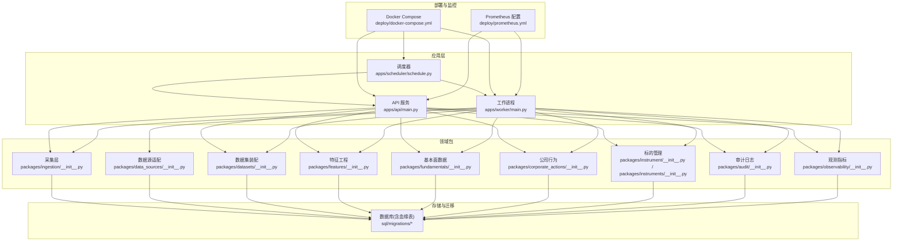
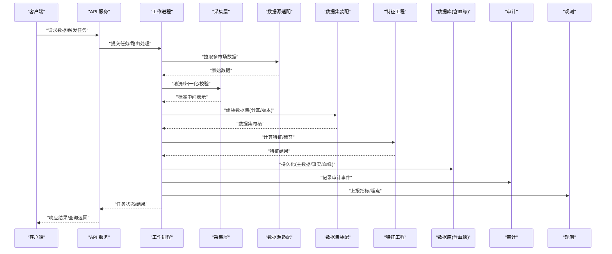
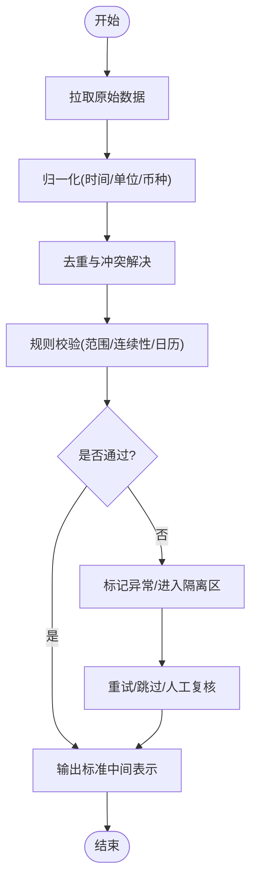
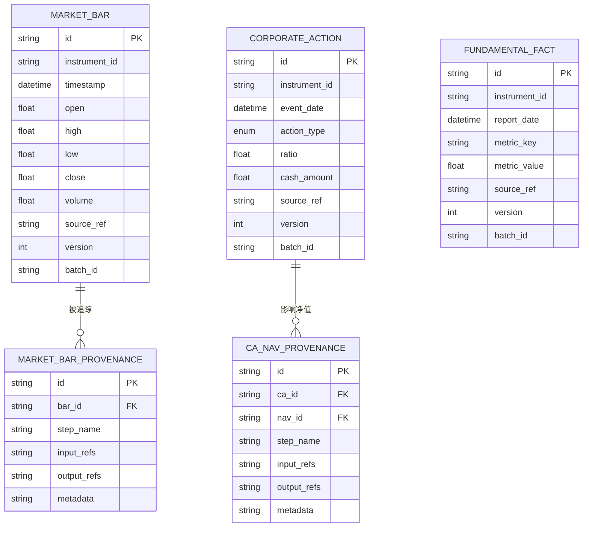
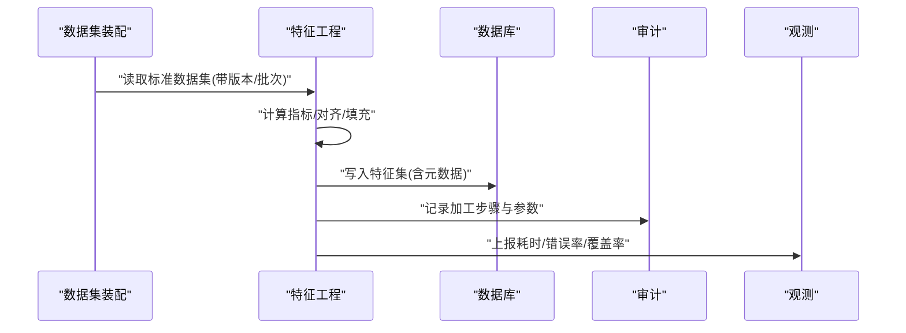
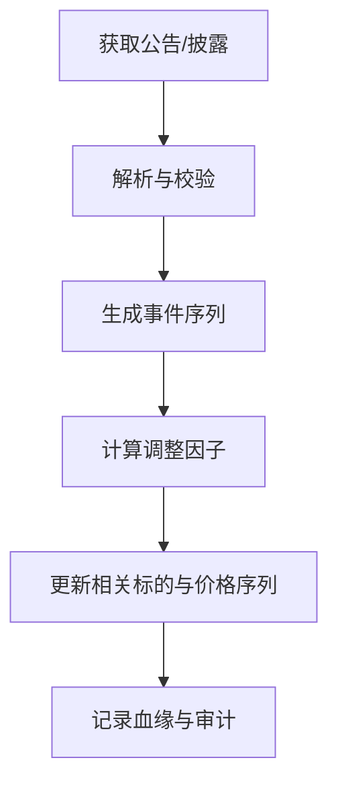
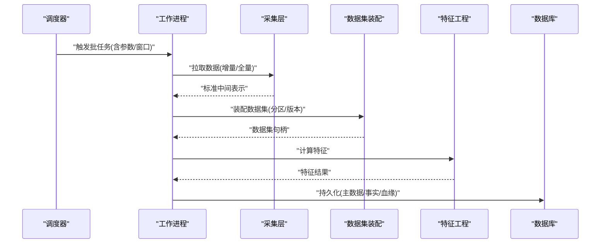
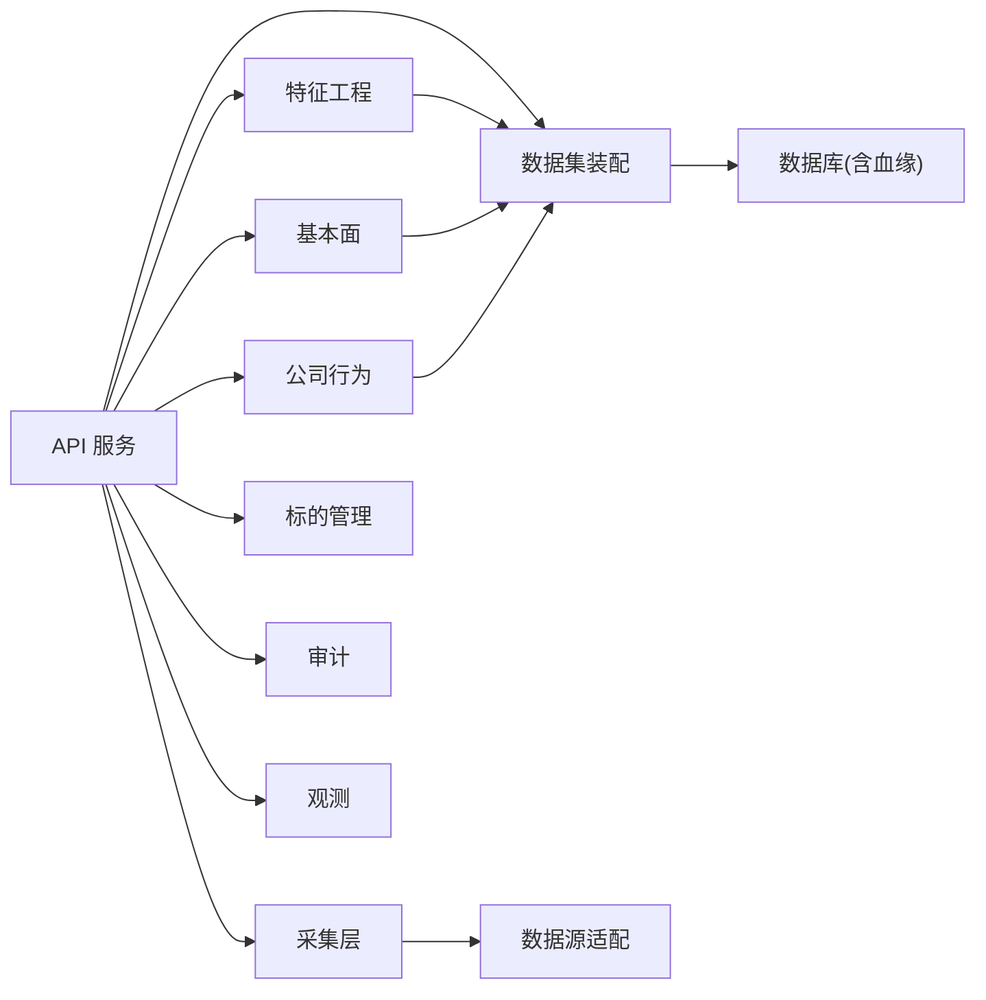

# 数据流设计

<cite>
**本文引用的文件**   
- [apps/api/main.py](file://apps/api/main.py)
- [apps/worker/main.py](file://apps/worker/main.py)
- [apps/worker/tasks.py](file://apps/worker/tasks.py)
- [apps/scheduler/schedule.py](file://apps/scheduler/schedule.py)
- [packages/ingestion/__init__.py](file://packages/ingestion/__init__.py)
- [packages/data_sources/__init__.py](file://packages/data_sources/__init__.py)
- [packages/datasets/__init__.py](file://packages/datasets/__init__.py)
- [packages/features/__init__.py](file://packages/features/__init__.py)
- [packages/fundamentals/__init__.py](file://packages/fundamentals/__init__.py)
- [packages/corporate_actions/__init__.py](file://packages/corporate_actions/__init__.py)
- [packages/instrument/__init__.py](file://packages/instrument/__init__.py)
- [packages/instruments/__init__.py](file://packages/instruments/__init__.py)
- [packages/audit/__init__.py](file://packages/audit/__init__.py)
- [packages/observability/__init__.py](file://packages/observability/__init__.py)
- [packages/data_quality/__init__.py](file://packages/data_quality/__init__.py)
- [sql/migrations/20260715_0003_market_bar.py](file://sql/migrations/20260715_0003_market_bar.py)
- [sql/migrations/20260715_0004_corporate_action.py](file://sql/migrations/20260715_0004_corporate_action.py)
- [sql/migrations/20260715_0005_fundamental_fact.py](file://sql/migrations/20260715_0005_fundamental_fact.py)
- [sql/migrations/20260715_0007_market_bar_provenance.py](file://sql/migrations/20260715_0007_market_bar_provenance.py)
- [sql/migrations/20260715_0008_ca_nav_provenance.py](file://sql/migrations/20260715_0008_ca_nav_provenance.py)
- [deploy/docker-compose.yml](file://deploy/docker-compose.yml)
- [deploy/prometheus.yml](file://deploy/prometheus.yml)
</cite>

## 目录
1. [引言](#引言)
2. [项目结构](#项目结构)
3. [核心组件](#核心组件)
4. [架构总览](#架构总览)
5. [详细组件分析](#详细组件分析)
6. [依赖关系分析](#依赖关系分析)
7. [性能与缓存策略](#性能与缓存策略)
8. [数据质量、异常检测与自动修复](#数据质量异常检测与自动修复)
9. [版本管理与一致性保证](#版本管理与一致性保证)
10. [安全、隐私与访问控制](#安全隐私与访问控制)
11. [故障排查指南](#故障排查指南)
12. [结论](#结论)

## 引言
本文件面向量化系统的数据流设计，覆盖从多市场数据采集、清洗转换、特征工程到存储归档的完整管道。重点阐述：
- 实时与批量两种处理模式的设计与实现要点
- 数据血缘追踪机制，确保来源可追溯、过程可审计
- 数据版本管理与一致性保障
- 数据质量检查、异常检测与自动修复策略
- 缓存策略与性能优化方案
- 数据安全、隐私保护与访问控制

## 项目结构
仓库采用应用层与包层分离的组织方式：
- apps：对外暴露的服务入口（API、调度器、工作进程）
- packages：按领域划分的业务包（采集、数据集、特征、基本面、公司行为、审计、观测等）
- sql/migrations：数据库迁移脚本，定义核心表结构与血缘表
- deploy：部署配置（容器编排与监控）

图表来源
- [apps/api/main.py](file://apps/api/main.py)
- [apps/worker/main.py](file://apps/worker/main.py)
- [apps/scheduler/schedule.py](file://apps/scheduler/schedule.py)
- [packages/ingestion/__init__.py](file://packages/ingestion/__init__.py)
- [packages/data_sources/__init__.py](file://packages/data_sources/__init__.py)
- [packages/datasets/__init__.py](file://packages/datasets/__init__.py)
- [packages/features/__init__.py](file://packages/features/__init__.py)
- [packages/fundamentals/__init__.py](file://packages/fundamentals/__init__.py)
- [packages/corporate_actions/__init__.py](file://packages/corporate_actions/__init__.py)
- [packages/instrument/__init__.py](file://packages/instrument/__init__.py)
- [packages/instruments/__init__.py](file://packages/instruments/__init__.py)
- [packages/audit/__init__.py](file://packages/audit/__init__.py)
- [packages/observability/__init__.py](file://packages/observability/__init__.py)
- [sql/migrations/20260715_0003_market_bar.py](file://sql/migrations/20260715_0003_market_bar.py)
- [sql/migrations/20260715_0004_corporate_action.py](file://sql/migrations/20260715_0004_corporate_action.py)
- [sql/migrations/20260715_0005_fundamental_fact.py](file://sql/migrations/20260715_0005_fundamental_fact.py)
- [sql/migrations/20260715_0007_market_bar_provenance.py](file://sql/migrations/20260715_0007_market_bar_provenance.py)
- [sql/migrations/20260715_0008_ca_nav_provenance.py](file://sql/migrations/20260715_0008_ca_nav_provenance.py)
- [deploy/docker-compose.yml](file://deploy/docker-compose.yml)
- [deploy/prometheus.yml](file://deploy/prometheus.yml)

章节来源
- [apps/api/main.py](file://apps/api/main.py)
- [apps/worker/main.py](file://apps/worker/main.py)
- [apps/scheduler/schedule.py](file://apps/scheduler/schedule.py)
- [deploy/docker-compose.yml](file://deploy/docker-compose.yml)
- [deploy/prometheus.yml](file://deploy/prometheus.yml)

## 核心组件
- 采集层（Ingestion）：负责接入多市场数据源，进行格式归一化、去重、时间对齐与基础校验，产出标准化中间表示。
- 数据源适配（Data Sources）：封装不同交易所/数据提供商的协议差异，提供统一接口。
- 数据集装配（Datasets）：将原始数据组装为下游可用的数据集（如日K、分钟K、基金净值等），并维护分区与版本。
- 特征工程（Features）：基于标准数据集计算衍生因子、技术指标与标签，输出特征集供模型训练与推理使用。
- 基本面数据（Fundamentals）：拉取财报、估值等低频数据，建立事实表并与交易日历对齐。
- 公司行为（Corporate Actions）：处理除权除息、拆合股、分红等事件，生成调整因子与事件序列。
- 标的管理（Instruments）：维护标的主数据、映射关系与生命周期状态。
- 审计（Audit）：记录关键操作与数据变更，支撑可追溯与合规审计。
- 观测（Observability）：暴露指标与日志，用于监控与告警。

章节来源
- [packages/ingestion/__init__.py](file://packages/ingestion/__init__.py)
- [packages/data_sources/__init__.py](file://packages/data_sources/__init__.py)
- [packages/datasets/__init__.py](file://packages/datasets/__init__.py)
- [packages/features/__init__.py](file://packages/features/__init__.py)
- [packages/fundamentals/__init__.py](file://packages/fundamentals/__init__.py)
- [packages/corporate_actions/__init__.py](file://packages/corporate_actions/__init__.py)
- [packages/instrument/__init__.py](file://packages/instrument/__init__.py)
- [packages/instruments/__init__.py](file://packages/instruments/__init__.py)
- [packages/audit/__init__.py](file://packages/audit/__init__.py)
- [packages/observability/__init__.py](file://packages/observability/__init__.py)

## 架构总览
整体数据流分为两条路径：
- 实时路径：API/Worker 接收增量事件，经采集层与数据集装配后写入时序库或消息总线，供低延迟查询与在线推理。
- 批量路径：调度器触发批任务，完成历史回填、全量重算与归档，确保数据一致性与完整性。

图表来源
- [apps/api/main.py](file://apps/api/main.py)
- [apps/worker/main.py](file://apps/worker/main.py)
- [packages/ingestion/__init__.py](file://packages/ingestion/__init__.py)
- [packages/data_sources/__init__.py](file://packages/data_sources/__init__.py)
- [packages/datasets/__init__.py](file://packages/datasets/__init__.py)
- [packages/features/__init__.py](file://packages/features/__init__.py)
- [packages/audit/__init__.py](file://packages/audit/__init__.py)
- [packages/observability/__init__.py](file://packages/observability/__init__.py)

## 详细组件分析

### 数据采集与清洗转换（Ingestion + Data Sources）
- 多市场接入：通过数据源适配层屏蔽不同交易所/供应商的差异，统一时间戳、时区、货币与单位。
- 清洗转换：去重、缺失值插补、异常值标记、复权预处理、交易日历对齐。
- 中间表示：以标准化的“条”为单位组织数据，便于后续分片与并行处理。
- 实时与批量：实时走轻量通道，优先保证低延迟；批量走高吞吐通道，支持断点续跑与幂等写入。

图表来源
- [packages/ingestion/__init__.py](file://packages/ingestion/__init__.py)
- [packages/data_sources/__init__.py](file://packages/data_sources/__init__.py)

章节来源
- [packages/ingestion/__init__.py](file://packages/ingestion/__init__.py)
- [packages/data_sources/__init__.py](file://packages/data_sources/__init__.py)

### 数据集装配与存储（Datasets + Migrations）
- 数据集划分：按资产、频率、日期分区，便于增量更新与回溯。
- 版本管理：每次写入附带版本号与批次ID，支持快照与回滚。
- 存储结构：参考迁移脚本定义的核心表（如行情、公司行为、基本面事实等），以及血缘表用于追踪数据来源与加工链路。

图表来源
- [sql/migrations/20260715_0003_market_bar.py](file://sql/migrations/20260715_0003_market_bar.py)
- [sql/migrations/20260715_0004_corporate_action.py](file://sql/migrations/20260715_0004_corporate_action.py)
- [sql/migrations/20260715_0005_fundamental_fact.py](file://sql/migrations/20260715_0005_fundamental_fact.py)
- [sql/migrations/20260715_0007_market_bar_provenance.py](file://sql/migrations/20260715_0007_market_bar_provenance.py)
- [sql/migrations/20260715_0008_ca_nav_provenance.py](file://sql/migrations/20260715_0008_ca_nav_provenance.py)

章节来源
- [packages/datasets/__init__.py](file://packages/datasets/__init__.py)
- [sql/migrations/20260715_0003_market_bar.py](file://sql/migrations/20260715_0003_market_bar.py)
- [sql/migrations/20260715_0004_corporate_action.py](file://sql/migrations/20260715_0004_corporate_action.py)
- [sql/migrations/20260715_0005_fundamental_fact.py](file://sql/migrations/20260715_0005_fundamental_fact.py)
- [sql/migrations/20260715_0007_market_bar_provenance.py](file://sql/migrations/20260715_0007_market_bar_provenance.py)
- [sql/migrations/20260715_0008_ca_nav_provenance.py](file://sql/migrations/20260715_0008_ca_nav_provenance.py)

### 特征工程（Features）
- 输入：标准数据集（行情、基本面、公司行为）。
- 处理：滚动窗口统计、技术指标、跨期对齐、缺失填充、异常平滑。
- 输出：特征集（带版本与批次信息），供训练与推理消费。

图表来源
- [packages/features/__init__.py](file://packages/features/__init__.py)
- [packages/audit/__init__.py](file://packages/audit/__init__.py)
- [packages/observability/__init__.py](file://packages/observability/__init__.py)

章节来源
- [packages/features/__init__.py](file://packages/features/__init__.py)

### 基本面与公司行为（Fundamentals + Corporate Actions）
- 基本面：财报披露、估值指标等低频数据，需与交易日历对齐，处理停牌与延后披露。
- 公司行为：除权除息、拆合股、分红等事件，生成调整因子与事件序列，联动净值与价格复权。

图表来源
- [packages/fundamentals/__init__.py](file://packages/fundamentals/__init__.py)
- [packages/corporate_actions/__init__.py](file://packages/corporate_actions/__init__.py)
- [sql/migrations/20260715_0004_corporate_action.py](file://sql/migrations/20260715_0004_corporate_action.py)
- [sql/migrations/20260715_0005_fundamental_fact.py](file://sql/migrations/20260715_0005_fundamental_fact.py)

章节来源
- [packages/fundamentals/__init__.py](file://packages/fundamentals/__init__.py)
- [packages/corporate_actions/__init__.py](file://packages/corporate_actions/__init__.py)

### 标的管理（Instruments）
- 维护标的主数据、跨市场映射、上市/退市状态与生效区间。
- 作为所有数据表的关联键，确保数据一致性与可检索性。

章节来源
- [packages/instrument/__init__.py](file://packages/instrument/__init__.py)
- [packages/instruments/__init__.py](file://packages/instruments/__init__.py)

### 调度与工作流（Scheduler + Worker）
- 调度器：按周期或事件触发批任务（历史回填、重算、归档）。
- 工作进程：执行具体任务，协调采集、装配、特征计算与落库，上报观测与审计。

图表来源
- [apps/scheduler/schedule.py](file://apps/scheduler/schedule.py)
- [apps/worker/main.py](file://apps/worker/main.py)
- [packages/ingestion/__init__.py](file://packages/ingestion/__init__.py)
- [packages/datasets/__init__.py](file://packages/datasets/__init__.py)
- [packages/features/__init__.py](file://packages/features/__init__.py)

章节来源
- [apps/scheduler/schedule.py](file://apps/scheduler/schedule.py)
- [apps/worker/main.py](file://apps/worker/main.py)

## 依赖关系分析
- 应用层对领域包的依赖清晰，遵循分层与单一职责原则。
- 存储层通过迁移脚本定义强约束的主数据与事实表，血缘表独立于业务表，降低耦合。
- 监控与审计作为横切关注点，贯穿各阶段。

图表来源
- [apps/api/main.py](file://apps/api/main.py)
- [packages/ingestion/__init__.py](file://packages/ingestion/__init__.py)
- [packages/data_sources/__init__.py](file://packages/data_sources/__init__.py)
- [packages/datasets/__init__.py](file://packages/datasets/__init__.py)
- [packages/features/__init__.py](file://packages/features/__init__.py)
- [packages/fundamentals/__init__.py](file://packages/fundamentals/__init__.py)
- [packages/corporate_actions/__init__.py](file://packages/corporate_actions/__init__.py)
- [packages/instrument/__init__.py](file://packages/instrument/__init__.py)
- [packages/instruments/__init__.py](file://packages/instruments/__init__.py)
- [packages/audit/__init__.py](file://packages/audit/__init__.py)
- [packages/observability/__init__.py](file://packages/observability/__init__.py)

章节来源
- [apps/api/main.py](file://apps/api/main.py)
- [packages/ingestion/__init__.py](file://packages/ingestion/__init__.py)
- [packages/data_sources/__init__.py](file://packages/data_sources/__init__.py)
- [packages/datasets/__init__.py](file://packages/datasets/__init__.py)
- [packages/features/__init__.py](file://packages/features/__init__.py)
- [packages/fundamentals/__init__.py](file://packages/fundamentals/__init__.py)
- [packages/corporate_actions/__init__.py](file://packages/corporate_actions/__init__.py)
- [packages/instrument/__init__.py](file://packages/instrument/__init__.py)
- [packages/instruments/__init__.py](file://packages/instruments/__init__.py)
- [packages/audit/__init__.py](file://packages/audit/__init__.py)
- [packages/observability/__init__.py](file://packages/observability/__init__.py)

## 性能与缓存策略
- 批处理优化：
  - 分区写入与并行度控制，避免单点瓶颈。
  - 幂等写入与断点续跑，减少重复计算。
  - 预聚合与物化视图，加速常用查询。
- 实时处理优化：
  - 增量合并与窗口聚合，降低频繁写放大。
  - 热点数据本地缓存（内存/磁盘），设置TTL与失效策略。
- 存储优化：
  - 列式存储与时序索引，提升扫描效率。
  - 冷热分层，历史数据归档至低成本存储。
- 观测与限流：
  - 通过观测包上报QPS、延迟、错误率，结合Prometheus进行阈值告警。
  - 对上游数据源实施速率限制与退避重试。

章节来源
- [packages/observability/__init__.py](file://packages/observability/__init__.py)
- [deploy/prometheus.yml](file://deploy/prometheus.yml)

## 数据质量、异常检测与自动修复
- 质量规则：
  - 完整性：必填字段、时间连续性与日历对齐。
  - 准确性：数值范围、跳变阈值、复权逻辑自洽。
  - 一致性：跨源同标的一致性与冲突消解策略。
- 异常检测：
  - 规则引擎与统计方法结合，识别离群与结构性变化。
  - 隔离异常数据至“问题集”，不影响主线生产。
- 自动修复：
  - 基于规则的回填与插补（如前值填充、均值平滑）。
  - 冲突消解：优先级策略（权威源优先）、多数投票、人工复核队列。
- 审计与溯源：
  - 所有修复动作记录审计日志，保留输入/输出引用与参数。

章节来源
- [packages/audit/__init__.py](file://packages/audit/__init__.py)
- [packages/ingestion/__init__.py](file://packages/ingestion/__init__.py)
- [packages/data_quality/__init__.py](file://packages/data_quality/__init__.py)

## 版本管理与一致性保证
- 数据版本：
  - 每个数据集/特征集包含版本号与批次ID，支持快照与回滚。
  - 血缘表记录每一步加工的输入/输出引用，形成完整链路。
- 一致性：
  - 事务边界内完成主数据与血缘写入，失败则回滚。
  - 幂等键（instrument_id + timestamp + source_ref + version）避免重复写入。
- 回溯与重算：
  - 基于版本选择目标窗口，触发增量或全量重算。
  - 重算完成后更新下游依赖的版本指针。

章节来源
- [sql/migrations/20260715_0003_market_bar.py](file://sql/migrations/20260715_0003_market_bar.py)
- [sql/migrations/20260715_0004_corporate_action.py](file://sql/migrations/20260715_0004_corporate_action.py)
- [sql/migrations/20260715_0005_fundamental_fact.py](file://sql/migrations/20260715_0005_fundamental_fact.py)
- [sql/migrations/20260715_0007_market_bar_provenance.py](file://sql/migrations/20260715_0007_market_bar_provenance.py)
- [sql/migrations/20260715_0008_ca_nav_provenance.py](file://sql/migrations/20260715_0008_ca_nav_provenance.py)

## 安全、隐私与访问控制
- 传输与存储加密：
  - 内部服务间通信启用TLS，敏感字段在存储层加密。
- 身份认证与授权：
  - API 层集成鉴权中间件，基于角色/权限控制数据访问。
  - 最小权限原则，仅授予必要的数据读写能力。
- 审计与合规：
  - 所有数据访问与变更写入审计日志，支持事后审查。
- 隐私保护：
  - 对个人敏感信息进行脱敏与匿名化处理。
  - 数据导出与共享需审批与水印追踪。

章节来源
- [apps/api/main.py](file://apps/api/main.py)
- [packages/audit/__init__.py](file://packages/audit/__init__.py)

## 故障排查指南
- 常见问题定位：
  - 数据缺失：检查采集层日志与数据源可用性，确认时间窗口与日历对齐。
  - 数据不一致：比对血缘链路与版本指针，定位冲突源与消解策略。
  - 性能退化：查看观测指标（延迟、错误率、吞吐），定位热点与瓶颈。
- 恢复策略：
  - 断点续跑：基于批次ID与幂等键恢复未完成任务。
  - 回滚版本：根据版本快照恢复到稳定基线。
  - 隔离问题：将异常数据移入隔离区，保持主线可用。
- 监控与告警：
  - 通过Prometheus配置收集关键指标，设置阈值与通知渠道。

章节来源
- [apps/worker/main.py](file://apps/worker/main.py)
- [packages/observability/__init__.py](file://packages/observability/__init__.py)
- [deploy/prometheus.yml](file://deploy/prometheus.yml)

## 结论
本数据流设计以“标准化中间表示+强版本与血缘”为核心，兼顾实时与批量场景，提供完善的质量、观测与安全机制。通过清晰的组件边界与幂等写入策略，系统在可扩展性、可维护性与可审计性方面具备良好基础。建议在生产环境中持续完善质量规则库、自动化修复策略与容量规划，以应对多市场、高频与大规模数据的挑战。