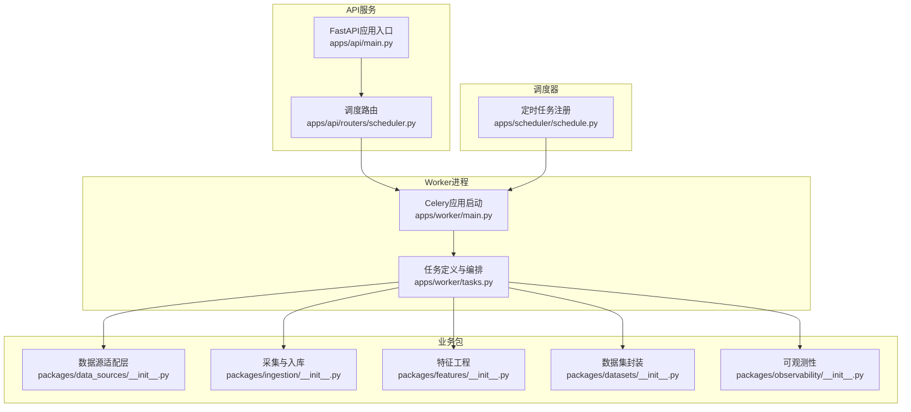
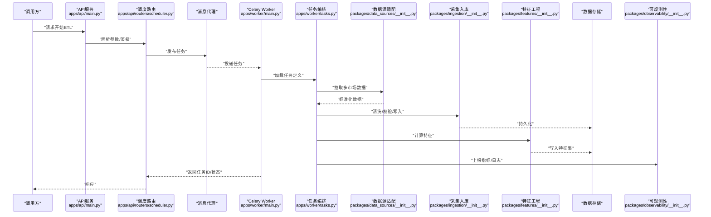
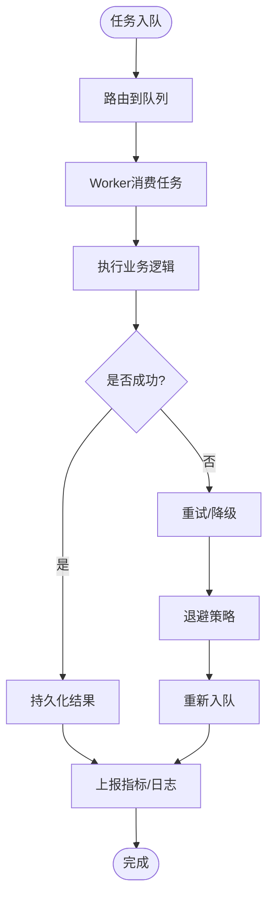
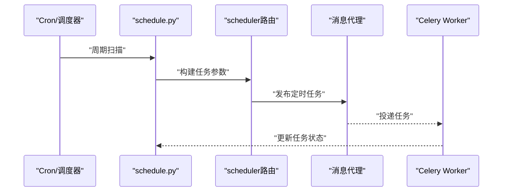
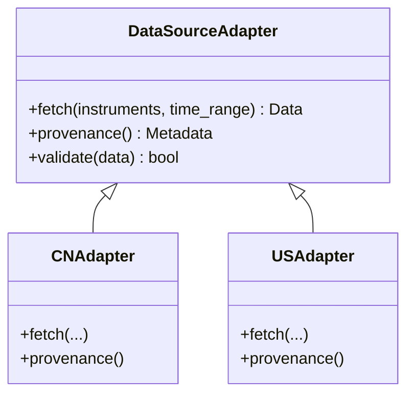
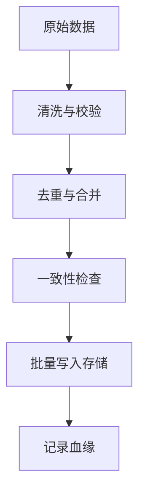
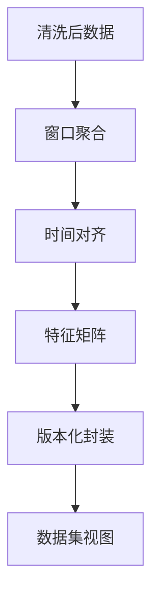
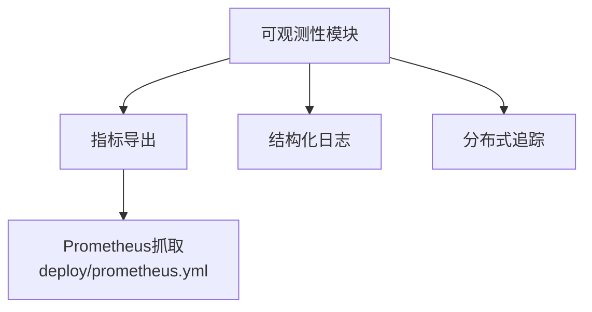
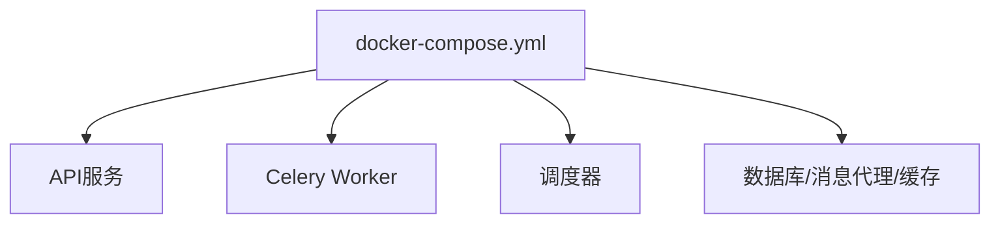
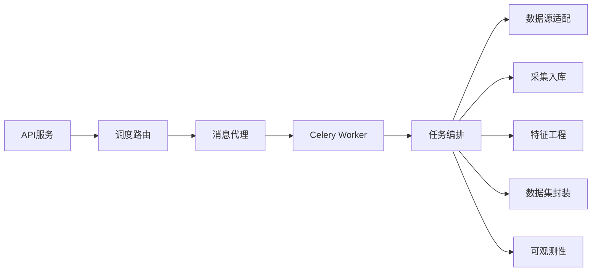

# 数据管道架构

<cite>
**本文引用的文件**   
- [apps/api/main.py](file://apps/api/main.py)
- [apps/api/routers/scheduler.py](file://apps/api/routers/scheduler.py)
- [apps/worker/main.py](file://apps/worker/main.py)
- [apps/worker/tasks.py](file://apps/worker/tasks.py)
- [apps/scheduler/schedule.py](file://apps/scheduler/schedule.py)
- [packages/data_sources/__init__.py](file://packages/data_sources/__init__.py)
- [packages/ingestion/__init__.py](file://packages/ingestion/__init__.py)
- [packages/features/__init__.py](file://packages/features/__init__.py)
- [packages/datasets/__init__.py](file://packages/datasets/__init__.py)
- [packages/observability/__init__.py](file://packages/observability/__init__.py)
- [deploy/docker-compose.yml](file://deploy/docker-compose.yml)
- [deploy/prometheus.yml](file://deploy/prometheus.yml)
</cite>

## 目录
1. [简介](#简介)
2. [项目结构](#项目结构)
3. [核心组件](#核心组件)
4. [架构总览](#架构总览)
5. [详细组件分析](#详细组件分析)
6. [依赖关系分析](#依赖关系分析)
7. [性能考虑](#性能考虑)
8. [故障排查指南](#故障排查指南)
9. [结论](#结论)
10. [附录](#附录)

## 简介
本文件面向“从数据采集到数据存储”的完整ETL数据管道，覆盖多市场数据源适配器、数据清洗与转换、特征工程处理、批量任务调度与异步执行。重点说明Celery异步任务队列的工作机制（任务定义、执行策略、错误处理）、定时任务调度器的配置与管理方式，以及管道的可扩展性设计（如何快速接入新数据源）。同时提供数据流监控、性能调优与故障恢复的实践建议，并给出扩展数据处理步骤的具体示例路径。

## 项目结构
仓库采用分层与按功能域组织相结合的结构：
- API服务层：负责对外暴露接口（如调度控制、状态查询等）
- Worker进程：基于Celery执行异步批处理任务
- Scheduler：管理定时任务与触发策略
- 业务包：数据源适配、采集入库、特征工程、数据集封装、可观测性等

**图表来源**
- [apps/api/main.py](file://apps/api/main.py)
- [apps/api/routers/scheduler.py](file://apps/api/routers/scheduler.py)
- [apps/worker/main.py](file://apps/worker/main.py)
- [apps/worker/tasks.py](file://apps/worker/tasks.py)
- [apps/scheduler/schedule.py](file://apps/scheduler/schedule.py)
- [packages/data_sources/__init__.py](file://packages/data_sources/__init__.py)
- [packages/ingestion/__init__.py](file://packages/ingestion/__init__.py)
- [packages/features/__init__.py](file://packages/features/__init__.py)
- [packages/datasets/__init__.py](file://packages/datasets/__init__.py)
- [packages/observability/__init__.py](file://packages/observability/__init__.py)

**章节来源**
- [apps/api/main.py](file://apps/api/main.py)
- [apps/api/routers/scheduler.py](file://apps/api/routers/scheduler.py)
- [apps/worker/main.py](file://apps/worker/main.py)
- [apps/worker/tasks.py](file://apps/worker/tasks.py)
- [apps/scheduler/schedule.py](file://apps/scheduler/schedule.py)
- [packages/data_sources/__init__.py](file://packages/data_sources/__init__.py)
- [packages/ingestion/__init__.py](file://packages/ingestion/__init__.py)
- [packages/features/__init__.py](file://packages/features/__init__.py)
- [packages/datasets/__init__.py](file://packages/datasets/__init__.py)
- [packages/observability/__init__.py](file://packages/observability/__init__.py)

## 核心组件
- 多市场数据源适配器：统一抽象不同市场的数据格式与协议差异，提供一致的拉取接口与元数据描述，便于后续清洗与特征计算。
- 采集与入库：将原始数据标准化后写入存储，记录数据来源与血缘信息，保证可追溯。
- 特征工程：在清洗后的数据基础上进行窗口统计、对齐、缺失值处理、异常检测等，产出模型可用的特征集。
- 数据集封装：对上层消费方提供稳定的数据集视图与版本化能力。
- 可观测性：埋点指标、日志与追踪，支撑监控告警与问题定位。
- Celery异步任务：将耗时操作解耦为可重试、可监控的任务单元，支持并发与优先级。
- 定时调度：通过Cron表达式或事件驱动触发批量任务，实现每日/每小时等周期性ETL。

**章节来源**
- [packages/data_sources/__init__.py](file://packages/data_sources/__init__.py)
- [packages/ingestion/__init__.py](file://packages/ingestion/__init__.py)
- [packages/features/__init__.py](file://packages/features/__init__.py)
- [packages/datasets/__init__.py](file://packages/datasets/__init__.py)
- [packages/observability/__init__.py](file://packages/observability/__init__.py)
- [apps/worker/tasks.py](file://apps/worker/tasks.py)
- [apps/scheduler/schedule.py](file://apps/scheduler/schedule.py)

## 架构总览
下图展示从外部数据源到最终数据集的端到端流程，包括API触发、Celery执行、数据源适配、清洗转换、特征工程与结果落库，并通过可观测性模块输出指标与日志。

**图表来源**
- [apps/api/main.py](file://apps/api/main.py)
- [apps/api/routers/scheduler.py](file://apps/api/routers/scheduler.py)
- [apps/worker/main.py](file://apps/worker/main.py)
- [apps/worker/tasks.py](file://apps/worker/tasks.py)
- [packages/data_sources/__init__.py](file://packages/data_sources/__init__.py)
- [packages/ingestion/__init__.py](file://packages/ingestion/__init__.py)
- [packages/features/__init__.py](file://packages/features/__init__.py)
- [packages/observability/__init__.py](file://packages/observability/__init__.py)

## 详细组件分析

### Celery异步任务队列
- 任务定义与注册：在任务文件中集中声明任务函数，使用装饰器绑定到Celery应用；任务参数包含时间范围、市场标识、批次大小等。
- 执行策略：支持并发执行、任务优先级、超时与重试策略；可通过路由将特定任务分发到专用队列。
- 错误处理：捕获异常并记录上下文，结合可观测性模块上报失败指标；支持幂等写入与断点续跑。
- 监控与诊断：通过任务生命周期钩子与中间件收集耗时、成功率、重试次数等指标。

**图表来源**
- [apps/worker/main.py](file://apps/worker/main.py)
- [apps/worker/tasks.py](file://apps/worker/tasks.py)
- [packages/observability/__init__.py](file://packages/observability/__init__.py)

**章节来源**
- [apps/worker/main.py](file://apps/worker/main.py)
- [apps/worker/tasks.py](file://apps/worker/tasks.py)
- [packages/observability/__init__.py](file://packages/observability/__init__.py)

### 定时任务调度器
- 配置方式：通过配置文件或环境变量定义Cron表达式、时区、任务参数模板；支持按市场/品种维度动态生成任务实例。
- 管理与触发：调度器读取配置后向消息代理发送任务；支持手动触发与补跑。
- 状态与审计：记录每次触发的时间、参数、任务ID与结果，便于回溯与审计。

**图表来源**
- [apps/scheduler/schedule.py](file://apps/scheduler/schedule.py)
- [apps/api/routers/scheduler.py](file://apps/api/routers/scheduler.py)
- [apps/worker/main.py](file://apps/worker/main.py)

**章节来源**
- [apps/scheduler/schedule.py](file://apps/scheduler/schedule.py)
- [apps/api/routers/scheduler.py](file://apps/api/routers/scheduler.py)

### 数据源适配器与多市场接入
- 统一抽象：定义标准接口（拉取、分页、增量、去重），屏蔽各市场差异。
- 注册机制：通过工厂或注册表模式动态发现与选择具体适配器。
- 快速接入：新增市场只需实现标准接口并在注册表中登记，无需改动上游流程。

**图表来源**
- [packages/data_sources/__init__.py](file://packages/data_sources/__init__.py)

**章节来源**
- [packages/data_sources/__init__.py](file://packages/data_sources/__init__.py)

### 数据清洗与入库
- 清洗规则：类型转换、空值填充、重复剔除、跨源一致性校验。
- 入库策略：批量写入、事务边界、幂等键、分区/分表策略。
- 血缘记录：记录数据来源、版本号、时间戳与校验摘要，便于溯源。

**图表来源**
- [packages/ingestion/__init__.py](file://packages/ingestion/__init__.py)

**章节来源**
- [packages/ingestion/__init__.py](file://packages/ingestion/__init__.py)

### 特征工程与数据集封装
- 特征计算：滚动窗口、对齐、滞后项、交叉特征、异常标记。
- 版本化：以时间切片与参数快照作为版本标识，确保可复现。
- 消费接口：提供稳定视图与查询API，隐藏底层存储细节。

**图表来源**
- [packages/features/__init__.py](file://packages/features/__init__.py)
- [packages/datasets/__init__.py](file://packages/datasets/__init__.py)

**章节来源**
- [packages/features/__init__.py](file://packages/features/__init__.py)
- [packages/datasets/__init__.py](file://packages/datasets/__init__.py)

### 可观测性与监控
- 指标埋点：任务耗时、吞吐、失败率、重试次数、数据量级。
- 日志规范：结构化日志，包含任务ID、时间范围、市场、批次号。
- 追踪链路：跨服务追踪，便于定位瓶颈与异常。

**图表来源**
- [packages/observability/__init__.py](file://packages/observability/__init__.py)
- [deploy/prometheus.yml](file://deploy/prometheus.yml)

**章节来源**
- [packages/observability/__init__.py](file://packages/observability/__init__.py)
- [deploy/prometheus.yml](file://deploy/prometheus.yml)

### 部署与服务编排
- 容器编排：通过docker-compose拉起API、Worker、调度器与依赖服务。
- 配置隔离：基础配置与环境配置分离，便于多环境管理。
- 健康检查：API与健康探针集成，便于负载均衡与自愈。

**图表来源**
- [deploy/docker-compose.yml](file://deploy/docker-compose.yml)

**章节来源**
- [deploy/docker-compose.yml](file://deploy/docker-compose.yml)

## 依赖关系分析
- 组件耦合：API仅依赖调度路由与消息代理；Worker依赖任务定义与各业务包；调度器独立于Worker，通过消息代理解耦。
- 外部依赖：消息代理、数据库、可观测性后端（Prometheus等）。
- 潜在循环：通过明确分层与接口约束避免循环依赖。

**图表来源**
- [apps/api/main.py](file://apps/api/main.py)
- [apps/api/routers/scheduler.py](file://apps/api/routers/scheduler.py)
- [apps/worker/main.py](file://apps/worker/main.py)
- [apps/worker/tasks.py](file://apps/worker/tasks.py)
- [packages/data_sources/__init__.py](file://packages/data_sources/__init__.py)
- [packages/ingestion/__init__.py](file://packages/ingestion/__init__.py)
- [packages/features/__init__.py](file://packages/features/__init__.py)
- [packages/datasets/__init__.py](file://packages/datasets/__init__.py)
- [packages/observability/__init__.py](file://packages/observability/__init__.py)

**章节来源**
- [apps/api/main.py](file://apps/api/main.py)
- [apps/api/routers/scheduler.py](file://apps/api/routers/scheduler.py)
- [apps/worker/main.py](file://apps/worker/main.py)
- [apps/worker/tasks.py](file://apps/worker/tasks.py)
- [packages/data_sources/__init__.py](file://packages/data_sources/__init__.py)
- [packages/ingestion/__init__.py](file://packages/ingestion/__init__.py)
- [packages/features/__init__.py](file://packages/features/__init__.py)
- [packages/datasets/__init__.py](file://packages/datasets/__init__.py)
- [packages/observability/__init__.py](file://packages/observability/__init__.py)

## 性能考虑
- 并发与批处理：合理设置Worker并发度与任务批大小，平衡吞吐与资源占用。
- 内存与I/O：流式处理与分批写入，避免一次性加载全量数据。
- 索引与分区：按时间与市场维度分区，优化查询与增量计算。
- 缓存与去重：热点数据缓存与幂等键减少重复计算与写入。
- 背压与限流：对上游数据源与下游存储施加限流，防止雪崩。

[本节为通用指导，不直接分析具体文件]

## 故障排查指南
- 任务失败：查看任务日志与重试次数，确认输入参数与数据质量；必要时触发补跑。
- 数据不一致：核对血缘信息与校验摘要，定位差异来源与时间窗口。
- 性能退化：观察指标曲线（耗时、吞吐、失败率），定位瓶颈环节（网络、CPU、I/O）。
- 调度异常：检查Cron表达式与时区配置，验证任务实例生成逻辑。

**章节来源**
- [apps/worker/tasks.py](file://apps/worker/tasks.py)
- [packages/observability/__init__.py](file://packages/observability/__init__.py)
- [apps/scheduler/schedule.py](file://apps/scheduler/schedule.py)

## 结论
本数据管道以Celery为核心，结合多市场数据源适配器、清洗入库、特征工程与可观测性模块，形成高内聚、低耦合的ETL体系。通过统一的接口与注册机制，系统具备良好的可扩展性，能够快速接入新数据源与新增处理步骤。配合定时调度与监控告警，可实现稳定、可观测、可运维的生产级数据流水线。

[本节为总结性内容，不直接分析具体文件]

## 附录

### 扩展新的数据处理步骤（示例路径）
- 在任务编排中插入新步骤：参考任务定义与编排位置，添加新阶段调用。
- 新增数据源适配器：实现标准接口并在注册表中登记。
- 新增特征计算：在特征工程模块中添加算法与版本化封装。
- 新增数据集视图：在数据集封装模块中定义新的视图与查询接口。
- 新增监控指标：在可观测性模块中埋点并导出至监控系统。

**章节来源**
- [apps/worker/tasks.py](file://apps/worker/tasks.py)
- [packages/data_sources/__init__.py](file://packages/data_sources/__init__.py)
- [packages/features/__init__.py](file://packages/features/__init__.py)
- [packages/datasets/__init__.py](file://packages/datasets/__init__.py)
- [packages/observability/__init__.py](file://packages/observability/__init__.py)