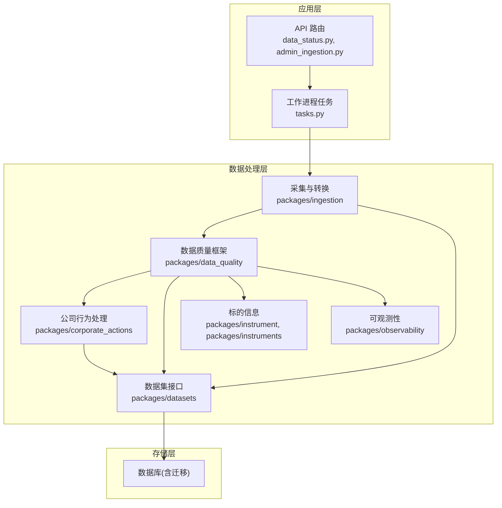
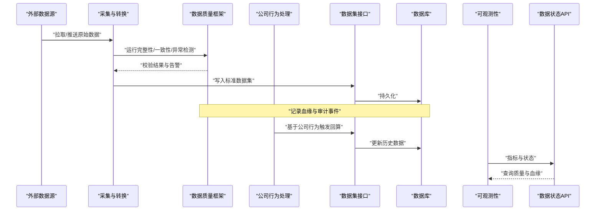
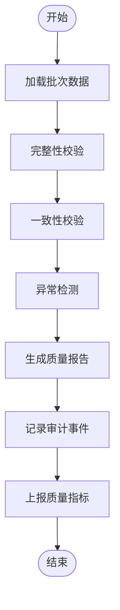
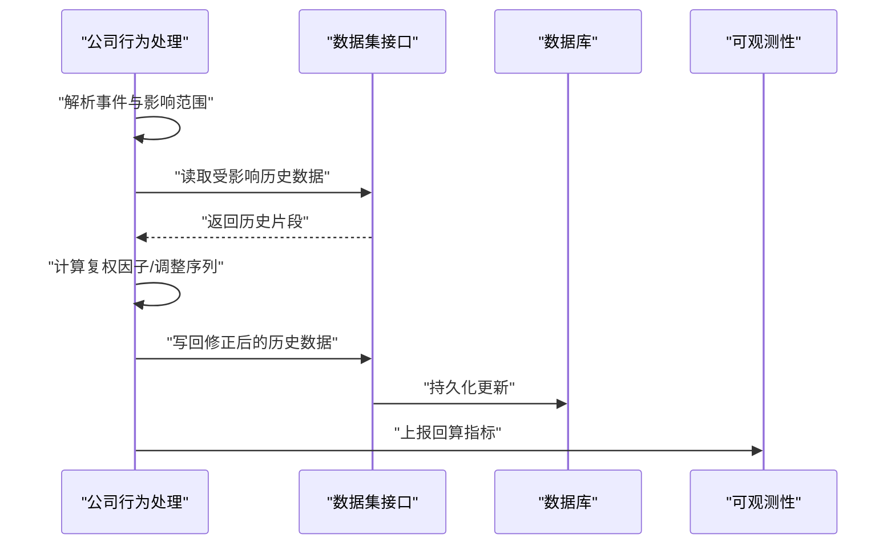
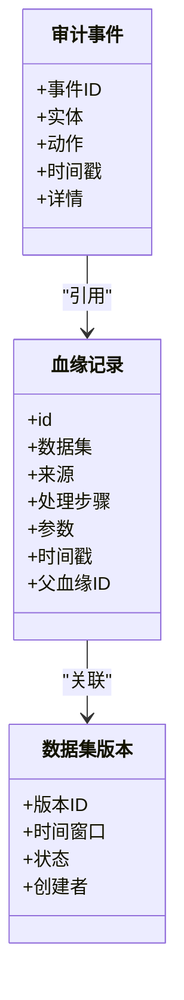
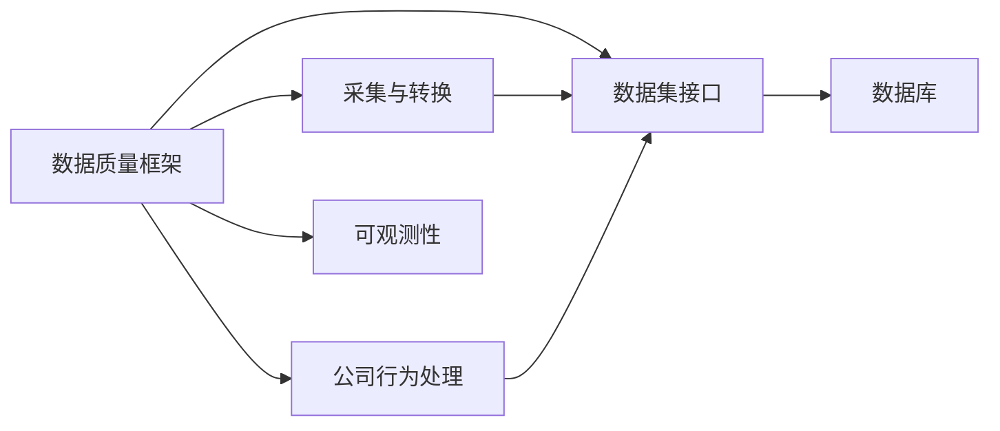

# 数据质量控制

<cite>
**本文引用的文件**   
- [packages/data_quality](file://packages/data_quality)
- [packages/corporate_actions](file://packages/corporate_actions)
- [packages/ingestion](file://packages/ingestion)
- [packages/datasets](file://packages/datasets)
- [packages/instrument](file://packages/instrument)
- [packages/instruments](file://packages/instruments)
- [packages/observability](file://packages/observability)
- [apps/api/routers/data_status.py](file://apps/api/routers/data_status.py)
- [apps/api/routers/admin_ingestion.py](file://apps/api/routers/admin_ingestion.py)
- [apps/worker/tasks.py](file://apps/worker/tasks.py)
- [sql/migrations/20260715_0004_corporate_action.py](file://sql/migrations/20260715_0004_corporate_action.py)
- [sql/migrations/20260715_0007_market_bar_provenance.py](file://sql/migrations/20260715_0007_market_bar_provenance.py)
- [sql/migrations/20260715_0008_ca_nav_provenance.py](file://sql/migrations/20260715_0008_ca_nav_provenance.py)
- [tests/unit/test_corporate_actions.py](file://tests/unit/test_corporate_actions.py)
- [tests/unit/test_corporate_actions_extended.py](file://tests/unit/test_corporate_actions_extended.py)
- [tests/unit/test_adapter_provenance.py](file://tests/unit/test_adapter_provenance.py)
- [tests/unit/test_audit.py](file://tests/unit/test_audit.py)
- [tests/unit/test_ingestion.py](file://tests/unit/test_ingestion.py)
- [tests/unit/test_ingestion_sql_sink.py](file://tests/unit/test_ingestion_sql_sink.py)
- [tests/unit/test_cross_market_scenarios.py](file://tests/unit/test_cross_market_scenarios.py)
- [tests/fixtures/golden/cn/split_and_dividend.jsonl](file://tests/fixtures/golden/cn/split_and_dividend.jsonl)
- [tests/fixtures/golden/us/dst_and_early_close.jsonl](file://tests/fixtures/golden/us/dst_and_early_close.jsonl)
</cite>

## 目录
1. [简介](#简介)
2. [项目结构](#项目结构)
3. [核心组件](#核心组件)
4. [架构总览](#架构总览)
5. [详细组件分析](#详细组件分析)
6. [依赖关系分析](#依赖关系分析)
7. [性能考虑](#性能考虑)
8. [故障排查指南](#故障排查指南)
9. [结论](#结论)
10. [附录](#附录)

## 简介
本文件面向数据质量控制的系统化设计与实现，覆盖完整性验证、一致性检查与异常检测规则；公司行为事件（分红、拆股等）对数据的影响与修正逻辑；数据血缘追踪系统；数据版本管理与变更审计；质量指标监控与告警配置；数据修复策略与自动纠错；以及跨市场数据一致性保障方案。文档以仓库现有模块与测试为依据，提供可追溯的源码定位与可视化图示，帮助读者快速理解并落地实施。

## 项目结构
围绕数据质量相关能力，代码主要分布在以下包与脚本中：
- packages/data_quality：数据质量规则、校验器与流水线编排
- packages/corporate_actions：公司行为事件模型、处理与回算逻辑
- packages/ingestion：数据采集适配层、转换与入库流程
- packages/datasets：数据集抽象与读写接口
- packages/instrument / packages/instruments：标的维度信息与ID规范
- packages/observability：指标采集与可观测性支撑
- apps/api/routers：数据状态查询与入站管理API
- apps/worker/tasks：后台任务调度与执行
- sql/migrations：数据库迁移，包含公司行为表与血缘表定义
- tests：单元测试与黄金用例，覆盖公司行为、血缘、审计、跨市场场景等

图表来源
- [apps/api/routers/data_status.py](file://apps/api/routers/data_status.py)
- [apps/api/routers/admin_ingestion.py](file://apps/api/routers/admin_ingestion.py)
- [apps/worker/tasks.py](file://apps/worker/tasks.py)
- [packages/ingestion](file://packages/ingestion)
- [packages/data_quality](file://packages/data_quality)
- [packages/corporate_actions](file://packages/corporate_actions)
- [packages/datasets](file://packages/datasets)
- [packages/instrument](file://packages/instrument)
- [packages/instruments](file://packages/instruments)
- [packages/observability](file://packages/observability)

章节来源
- [apps/api/routers/data_status.py](file://apps/api/routers/data_status.py)
- [apps/api/routers/admin_ingestion.py](file://apps/api/routers/admin_ingestion.py)
- [apps/worker/tasks.py](file://apps/worker/tasks.py)
- [packages/data_quality](file://packages/data_quality)
- [packages/corporate_actions](file://packages/corporate_actions)
- [packages/ingestion](file://packages/ingestion)
- [packages/datasets](file://packages/datasets)
- [packages/instrument](file://packages/instrument)
- [packages/instruments](file://packages/instruments)
- [packages/observability](file://packages/observability)

## 核心组件
- 数据质量框架（packages/data_quality）
  - 职责：定义质量规则、校验器与流水线编排，负责完整性、一致性与异常检测的执行与报告。
  - 关键能力：规则注册与组合、批处理与增量模式、失败隔离与重试、指标上报。
- 公司行为处理（packages/corporate_actions）
  - 职责：建模与处理分红、拆股、复权等事件，驱动历史数据回算与修正。
  - 关键能力：事件解析、影响范围计算、回算触发、结果落库与血缘记录。
- 采集与转换（packages/ingestion）
  - 职责：对接多源数据，进行标准化、去重、校验与写入。
  - 关键能力：适配器模式、转换管道、SQL Sink、错误收集与审计。
- 数据集接口（packages/datasets）
  - 职责：统一的数据集读写抽象，屏蔽底层存储差异。
  - 关键能力：分区/时间窗口、事务与幂等写入、版本标记。
- 标的信息（packages/instrument, packages/instruments）
  - 职责：维护标的主数据与ID规范，为质量规则与回算提供上下文。
- 可观测性（packages/observability）
  - 职责：采集质量指标、延迟、错误率等，支持告警与可视化。

章节来源
- [packages/data_quality](file://packages/data_quality)
- [packages/corporate_actions](file://packages/corporate_actions)
- [packages/ingestion](file://packages/ingestion)
- [packages/datasets](file://packages/datasets)
- [packages/instrument](file://packages/instrument)
- [packages/instruments](file://packages/instruments)
- [packages/observability](file://packages/observability)

## 架构总览
数据从多源进入采集层，经转换与质量校验后写入数据集；公司行为事件触发回算与修正；所有过程通过血缘与审计记录，指标由可观测性模块采集并通过API暴露。

图表来源
- [packages/ingestion](file://packages/ingestion)
- [packages/data_quality](file://packages/data_quality)
- [packages/corporate_actions](file://packages/corporate_actions)
- [packages/datasets](file://packages/datasets)
- [packages/observability](file://packages/observability)
- [apps/api/routers/data_status.py](file://apps/api/routers/data_status.py)

## 详细组件分析

### 数据质量检查框架
- 设计要点
  - 规则分层：完整性（缺失值、主键唯一、时间连续性）、一致性（跨字段约束、跨源对齐）、异常检测（离群点、分布漂移）。
  - 流水线编排：按阶段顺序执行，支持并行与失败隔离；失败项可进入“待修复”队列。
  - 指标与审计：每个规则执行产出指标与审计事件，供监控与回溯。
- 关键流程
  - 输入：标准数据集快照或增量批次
  - 处理：规则匹配→执行→聚合→上报
  - 输出：质量报告、告警、血缘与审计记录

章节来源
- [packages/data_quality](file://packages/data_quality)
- [tests/unit/test_audit.py](file://tests/unit/test_audit.py)
- [tests/unit/test_ingestion.py](file://tests/unit/test_ingestion.py)

### 公司行为事件处理机制（分红、拆股等）
- 事件模型与影响
  - 事件类型：现金分红、股票分红、拆股、合股、除权除息日等
  - 影响范围：价格序列、成交量、净值（基金）等需回算
- 处理流程
  - 解析事件→确定受影响标的与时间区间→触发回算→更新历史数据→记录血缘与审计
- 回算策略
  - 前复权/后复权选择、复权因子计算、分步回算与幂等保证

图表来源
- [packages/corporate_actions](file://packages/corporate_actions)
- [packages/datasets](file://packages/datasets)
- [sql/migrations/20260715_0004_corporate_action.py](file://sql/migrations/20260715_0004_corporate_action.py)

章节来源
- [packages/corporate_actions](file://packages/corporate_actions)
- [tests/unit/test_corporate_actions.py](file://tests/unit/test_corporate_actions.py)
- [tests/unit/test_corporate_actions_extended.py](file://tests/unit/test_corporate_actions_extended.py)
- [tests/fixtures/golden/cn/split_and_dividend.jsonl](file://tests/fixtures/golden/cn/split_and_dividend.jsonl)
- [sql/migrations/20260715_0004_corporate_action.py](file://sql/migrations/20260715_0004_corporate_action.py)

### 数据血缘追踪系统
- 目标：确保数据来源与处理过程可追溯，支持问题定位与合规审计
- 实现要点
  - 在采集、转换、回算各阶段记录血缘元数据（来源、时间、批次、规则、参数）
  - 将血缘与数据集版本关联，形成链式追溯
- 关键表与迁移
  - 市场K线血缘表、公司行为与净值血缘表等

图表来源
- [sql/migrations/20260715_0007_market_bar_provenance.py](file://sql/migrations/20260715_0007_market_bar_provenance.py)
- [sql/migrations/20260715_0008_ca_nav_provenance.py](file://sql/migrations/20260715_0008_ca_nav_provenance.py)
- [tests/unit/test_adapter_provenance.py](file://tests/unit/test_adapter_provenance.py)

章节来源
- [tests/unit/test_adapter_provenance.py](file://tests/unit/test_adapter_provenance.py)
- [sql/migrations/20260715_0007_market_bar_provenance.py](file://sql/migrations/20260715_0007_market_bar_provenance.py)
- [sql/migrations/20260715_0008_ca_nav_provenance.py](file://sql/migrations/20260715_0008_ca_nav_provenance.py)

### 数据版本管理与变更审计
- 版本管理
  - 数据集按时间窗口与批次划分版本，支持只读快照与回滚
  - 写入采用幂等与事务，避免重复与部分成功
- 变更审计
  - 记录每次写入、回算、修复操作的审计事件，包含操作主体、参数与影响范围
- 关键迁移与测试
  - 审计事件表迁移与单元测试覆盖

章节来源
- [sql/migrations/20260715_0002_audit_events.py](file://sql/migrations/20260715_0002_audit_events.py)
- [tests/unit/test_audit.py](file://tests/unit/test_audit.py)
- [tests/unit/test_ingestion_sql_sink.py](file://tests/unit/test_ingestion_sql_sink.py)

### 质量指标监控与告警配置
- 指标范围
  - 完整性：缺失率、主键冲突数、时间断点数
  - 一致性：跨源差异比例、字段约束违反数
  - 异常检测：离群点数量、分布漂移指数
  - 处理时效：端到端延迟、回算耗时
- 采集与暴露
  - 通过可观测性模块采集并暴露给监控系统
  - API提供数据质量状态查询入口

章节来源
- [packages/observability](file://packages/observability)
- [apps/api/routers/data_status.py](file://apps/api/routers/data_status.py)

### 数据修复策略与自动纠错
- 修复策略
  - 自动纠错：基于规则与业务知识的自动补全与修正（如时间对齐、单位换算）
  - 人工干预：对复杂异常进入待修复队列，提供工单与审批流
- 执行方式
  - 通过后台任务批量执行修复，结合血缘与审计记录变更
- 相关入口
  - 管理型入站API用于触发修复任务与查看进度

章节来源
- [apps/api/routers/admin_ingestion.py](file://apps/api/routers/admin_ingestion.py)
- [apps/worker/tasks.py](file://apps/worker/tasks.py)
- [packages/data_quality](file://packages/data_quality)

### 跨市场数据一致性保障
- 挑战
  - 不同市场交易日历、时区、货币、公司行为规则差异
- 保障方案
  - 统一时间轴与交易日历映射
  - 跨源对齐与冲突消解策略（优先级、仲裁规则）
  - 针对夏令时与提前收盘等场景的特殊处理
- 测试覆盖
  - 黄金用例与跨市场场景测试

章节来源
- [tests/unit/test_cross_market_scenarios.py](file://tests/unit/test_cross_market_scenarios.py)
- [tests/fixtures/golden/us/dst_and_early_close.jsonl](file://tests/fixtures/golden/us/dst_and_early_close.jsonl)

## 依赖关系分析
- 组件耦合
  - 数据质量框架依赖采集、数据集、公司行为与可观测性
  - 公司行为处理依赖数据集与数据库
  - 采集与转换依赖数据集与可观测性
- 外部依赖
  - 数据库（通过迁移定义表结构）
  - 监控系统（通过可观测性暴露指标）

图表来源
- [packages/data_quality](file://packages/data_quality)
- [packages/ingestion](file://packages/ingestion)
- [packages/corporate_actions](file://packages/corporate_actions)
- [packages/datasets](file://packages/datasets)
- [packages/observability](file://packages/observability)

章节来源
- [packages/data_quality](file://packages/data_quality)
- [packages/ingestion](file://packages/ingestion)
- [packages/corporate_actions](file://packages/corporate_actions)
- [packages/datasets](file://packages/datasets)
- [packages/observability](file://packages/observability)

## 性能考虑
- 批处理与增量：优先增量处理，减少扫描范围
- 并行与隔离：规则并行执行，失败隔离避免级联失败
- 幂等与事务：写入幂等，事务边界清晰，降低重试成本
- 索引与分区：按时间与标的分区，提升查询与回算效率
- 指标采样：高频指标采样降采样，避免监控风暴

[本节为通用指导，不直接分析具体文件]

## 故障排查指南
- 常见问题定位
  - 完整性失败：检查缺失字段与主键冲突，核对采集源与时间窗口
  - 一致性失败：对比跨源数据，确认对齐策略与优先级
  - 异常检测报警：复核阈值与样本分布，必要时放宽或细化规则
  - 公司行为回算异常：核查事件日期、复权因子与影响范围
- 工具与入口
  - 使用数据状态API查看质量与血缘
  - 使用管理型入站API触发修复任务
  - 查看审计事件与血缘链定位问题根因

章节来源
- [apps/api/routers/data_status.py](file://apps/api/routers/data_status.py)
- [apps/api/routers/admin_ingestion.py](file://apps/api/routers/admin_ingestion.py)
- [tests/unit/test_audit.py](file://tests/unit/test_audit.py)
- [tests/unit/test_adapter_provenance.py](file://tests/unit/test_adapter_provenance.py)

## 结论
本数据质量控制体系以规则驱动的校验框架为核心，结合公司行为回算、血缘追踪与审计、指标监控与告警，形成闭环的数据治理方案。通过跨市场一致性保障与自动化修复策略，系统在准确性、可追溯性与可运维性方面具备良好基础。建议在生产环境持续完善规则库与告警阈值，并结合业务反馈迭代优化。

[本节为总结性内容，不直接分析具体文件]

## 附录
- 术语
  - 完整性：数据是否齐全、连续、无缺失
  - 一致性：数据在不同来源与字段间是否相互吻合
  - 异常检测：识别偏离正常模式的观测值或趋势
  - 血缘：数据从来源到产物的完整链路记录
  - 审计：对数据变更与处理的不可抵赖记录
- 参考路径
  - 公司行为事件与回算：参见公司行为处理与相关迁移
  - 血缘与审计：参见血缘迁移与审计迁移及对应测试
  - 跨市场场景：参见跨市场测试与黄金用例

[本节为补充说明，不直接分析具体文件]