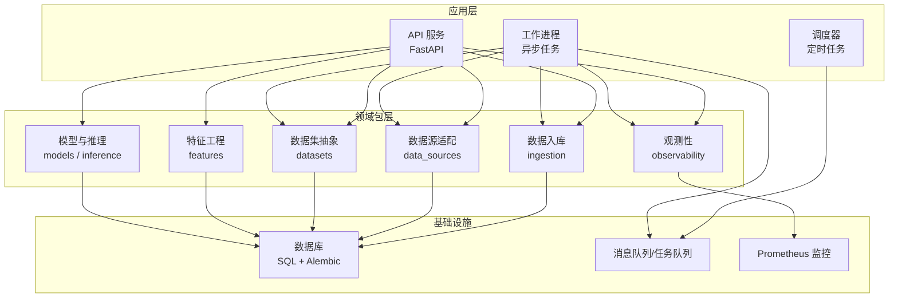
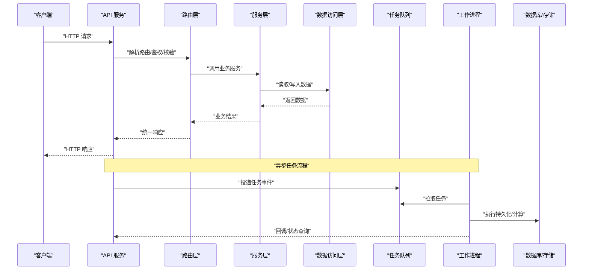
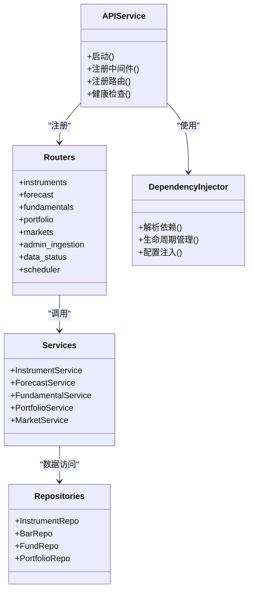
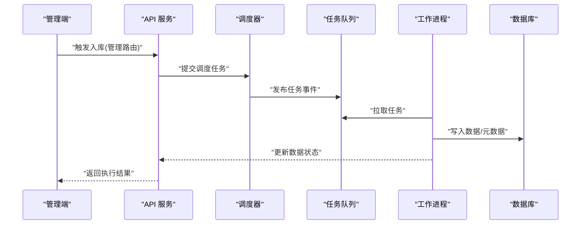
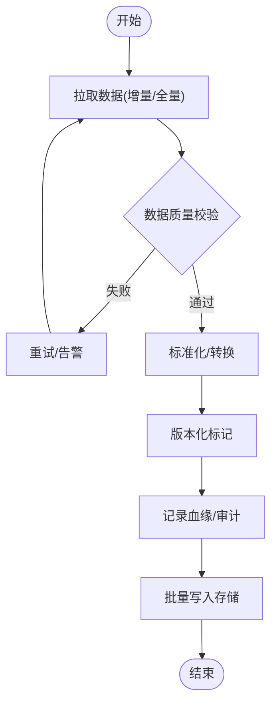
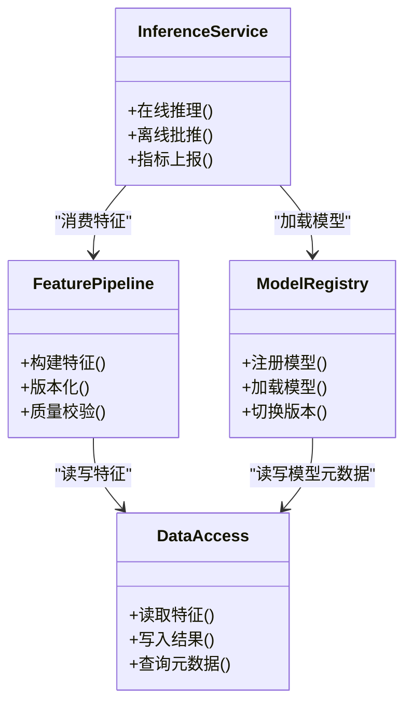
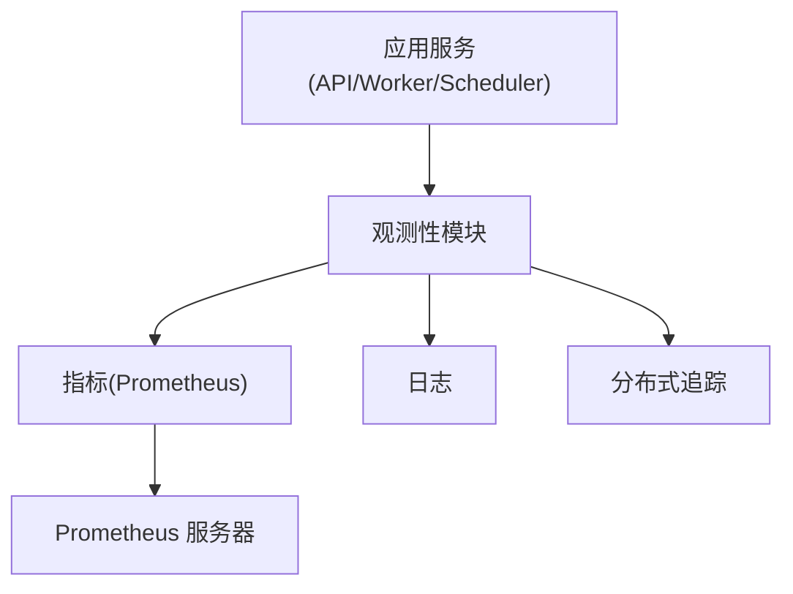
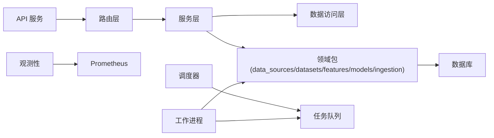

# 架构设计

<cite>
**本文引用的文件**   
- [apps/api/main.py](file://apps/api/main.py)
- [apps/api/deps.py](file://apps/api/deps.py)
- [apps/api/routers/instruments.py](file://apps/api/routers/instruments.py)
- [apps/api/routers/forecast.py](file://apps/api/routers/forecast.py)
- [apps/api/routers/fundamentals.py](file://apps/api/routers/fundamentals.py)
- [apps/api/routers/portfolio.py](file://apps/api/routers/portfolio.py)
- [apps/api/routers/markets.py](file://apps/api/routers/markets.py)
- [apps/api/routers/admin_ingestion.py](file://apps/api/routers/admin_ingestion.py)
- [apps/api/routers/data_status.py](file://apps/api/routers/data_status.py)
- [apps/api/routers/scheduler.py](file://apps/api/routers/scheduler.py)
- [apps/scheduler/schedule.py](file://apps/scheduler/schedule.py)
- [apps/worker/main.py](file://apps/worker/main.py)
- [apps/worker/tasks.py](file://apps/worker/tasks.py)
- [packages/data_sources/__init__.py](file://packages/data_sources/__init__.py)
- [packages/datasets/__init__.py](file://packages/datasets/__init__.py)
- [packages/features/__init__.py](file://packages/features/__init__.py)
- [packages/models/__init__.py](file://packages/models/__init__.py)
- [packages/ingestion/__init__.py](file://packages/ingestion/__init__.py)
- [packages/observability/__init__.py](file://packages/observability/__init__.py)
- [deploy/docker-compose.yml](file://deploy/docker-compose.yml)
- [deploy/prometheus.yml](file://deploy/prometheus.yml)
- [configs/base.yaml](file://configs/base.yaml)
- [configs/dev.yaml](file://configs/dev.yaml)
- [sql/migrations/env.py](file://sql/migrations/env.py)
- [alembic.ini](file://alembic.ini)
</cite>

## 目录
1. [引言](#引言)
2. [项目结构](#项目结构)
3. [核心组件](#核心组件)
4. [架构总览](#架构总览)
5. [详细组件分析](#详细组件分析)
6. [依赖分析](#依赖分析)
7. [性能考虑](#性能考虑)
8. [故障排查指南](#故障排查指南)
9. [结论](#结论)
10. [附录](#附录)

## 引言
本架构设计文档面向量化投资系统，目标是清晰呈现整体系统架构、微服务划分、分层职责、依赖注入机制、事件驱动与异步处理、系统边界与外部集成点、扩展点设计，以及安全性、监控、可扩展性等横切关注点的方案。文档同时提供架构图与组件关系图，帮助读者快速理解系统结构与数据流向。

## 项目结构
系统采用多应用（Multi-App）与多包（Packages）的混合组织方式：
- apps：可独立部署的微服务进程，包括 API 服务、调度器、工作进程等
- packages：领域能力与通用库，按功能域拆分（如数据源、数据集、特征工程、模型、观测性、入库等）
- configs：配置中心（YAML），支持基础与开发环境覆盖
- deploy：容器编排与监控采集配置
- sql/migrations：数据库迁移脚本（Alembic）
- tests：单元测试与集成测试
- skills：研究技能与校验脚本（辅助研究与质量保障）

图表来源
- [apps/api/main.py](file://apps/api/main.py)
- [apps/scheduler/schedule.py](file://apps/scheduler/schedule.py)
- [apps/worker/main.py](file://apps/worker/main.py)
- [packages/data_sources/__init__.py](file://packages/data_sources/__init__.py)
- [packages/datasets/__init__.py](file://packages/datasets/__init__.py)
- [packages/features/__init__.py](file://packages/features/__init__.py)
- [packages/models/__init__.py](file://packages/models/__init__.py)
- [packages/ingestion/__init__.py](file://packages/ingestion/__init__.py)
- [packages/observability/__init__.py](file://packages/observability/__init__.py)
- [deploy/prometheus.yml](file://deploy/prometheus.yml)
- [sql/migrations/env.py](file://sql/migrations/env.py)

章节来源
- [apps/api/main.py](file://apps/api/main.py)
- [apps/scheduler/schedule.py](file://apps/scheduler/schedule.py)
- [apps/worker/main.py](file://apps/worker/main.py)
- [deploy/docker-compose.yml](file://deploy/docker-compose.yml)
- [configs/base.yaml](file://configs/base.yaml)
- [configs/dev.yaml](file://configs/dev.yaml)
- [sql/migrations/env.py](file://sql/migrations/env.py)

## 核心组件
- API 服务（FastAPI）
  - 负责 HTTP 接口暴露、请求路由、鉴权与限流、参数校验、响应封装
  - 通过依赖注入获取服务实例与资源访问器
  - 路由模块按业务域划分（标的、行情、基本面、组合、预测、数据状态、管理入库、调度）
- 调度器（Scheduler）
  - 基于时间规则触发批量或周期性任务（如日终批处理、指标刷新）
  - 将任务投递到任务队列，由工作进程消费执行
- 工作进程（Worker）
  - 异步执行耗时任务（数据拉取、清洗、入库、特征计算、模型训练/推理）
  - 与数据源、数据集、入库、观测性模块交互
- 领域包（Packages）
  - data_sources：统一接入多市场/多厂商数据源，屏蔽差异
  - datasets：对上游数据进行标准化建模与版本化
  - features：因子与特征工程流水线
  - models/inference：模型生命周期管理与在线/离线推理
  - ingestion：数据入湖/入库管道，含血缘与质量检查
  - observability：指标、日志、追踪埋点与告警

章节来源
- [apps/api/routers/instruments.py](file://apps/api/routers/instruments.py)
- [apps/api/routers/forecast.py](file://apps/api/routers/forecast.py)
- [apps/api/routers/fundamentals.py](file://apps/api/routers/fundamentals.py)
- [apps/api/routers/portfolio.py](file://apps/api/routers/portfolio.py)
- [apps/api/routers/markets.py](file://apps/api/routers/markets.py)
- [apps/api/routers/admin_ingestion.py](file://apps/api/routers/admin_ingestion.py)
- [apps/api/routers/data_status.py](file://apps/api/routers/data_status.py)
- [apps/api/routers/scheduler.py](file://apps/api/routers/scheduler.py)
- [apps/worker/tasks.py](file://apps/worker/tasks.py)
- [packages/data_sources/__init__.py](file://packages/data_sources/__init__.py)
- [packages/datasets/__init__.py](file://packages/datasets/__init__.py)
- [packages/features/__init__.py](file://packages/features/__init__.py)
- [packages/models/__init__.py](file://packages/models/__init__.py)
- [packages/ingestion/__init__.py](file://packages/ingestion/__init__.py)
- [packages/observability/__init__.py](file://packages/observability/__init__.py)

## 架构总览
系统采用“分层 + 微服务 + 事件驱动”的组合架构：
- 分层架构
  - API 层：HTTP 入口、协议转换、鉴权、校验、路由分发
  - 服务层：业务编排、事务边界、策略编排、跨域协调
  - 数据访问层：仓储/DAO、缓存、查询优化、读写分离
- 微服务划分
  - API 服务：无状态，水平扩展
  - 调度器：轻量，仅负责任务编排与投递
  - 工作进程：有状态/长驻，执行重计算与 I/O 密集型任务
- 事件驱动
  - 调度器通过任务队列发布任务事件
  - 工作进程订阅并执行，完成后回写结果与指标
- 数据流向
  - 外部数据源 → 数据源适配 → 数据集标准化 → 入库/湖仓 → 特征/模型/报表消费

图表来源
- [apps/api/main.py](file://apps/api/main.py)
- [apps/api/routers/instruments.py](file://apps/api/routers/instruments.py)
- [apps/api/routers/forecast.py](file://apps/api/routers/forecast.py)
- [apps/api/routers/fundamentals.py](file://apps/api/routers/fundamentals.py)
- [apps/api/routers/portfolio.py](file://apps/api/routers/portfolio.py)
- [apps/api/routers/markets.py](file://apps/api/routers/markets.py)
- [apps/api/routers/admin_ingestion.py](file://apps/api/routers/admin_ingestion.py)
- [apps/api/routers/data_status.py](file://apps/api/routers/data_status.py)
- [apps/api/routers/scheduler.py](file://apps/api/routers/scheduler.py)
- [apps/worker/tasks.py](file://apps/worker/tasks.py)

## 详细组件分析

### API 服务与分层架构
- 职责分离
  - API 层：路由定义、请求/响应模型、错误码映射、限流与鉴权
  - 服务层：业务编排、跨域协调、事务控制、审计与观测
  - 数据访问层：仓储实现、连接池、分页/排序、缓存策略
- 依赖注入
  - 通过统一的依赖解析器在请求生命周期内创建/复用服务与资源
  - 支持配置注入、上下文传递（租户、追踪ID）、资源清理
- 路由模块化
  - 按业务域拆分为 instruments、forecast、fundamentals、portfolio、markets、admin_ingestion、data_status、scheduler 等路由

图表来源
- [apps/api/main.py](file://apps/api/main.py)
- [apps/api/deps.py](file://apps/api/deps.py)
- [apps/api/routers/instruments.py](file://apps/api/routers/instruments.py)
- [apps/api/routers/forecast.py](file://apps/api/routers/forecast.py)
- [apps/api/routers/fundamentals.py](file://apps/api/routers/fundamentals.py)
- [apps/api/routers/portfolio.py](file://apps/api/routers/portfolio.py)
- [apps/api/routers/markets.py](file://apps/api/routers/markets.py)
- [apps/api/routers/admin_ingestion.py](file://apps/api/routers/admin_ingestion.py)
- [apps/api/routers/data_status.py](file://apps/api/routers/data_status.py)
- [apps/api/routers/scheduler.py](file://apps/api/routers/scheduler.py)

章节来源
- [apps/api/main.py](file://apps/api/main.py)
- [apps/api/deps.py](file://apps/api/deps.py)
- [apps/api/routers/instruments.py](file://apps/api/routers/instruments.py)
- [apps/api/routers/forecast.py](file://apps/api/routers/forecast.py)
- [apps/api/routers/fundamentals.py](file://apps/api/routers/fundamentals.py)
- [apps/api/routers/portfolio.py](file://apps/api/routers/portfolio.py)
- [apps/api/routers/markets.py](file://apps/api/routers/markets.py)
- [apps/api/routers/admin_ingestion.py](file://apps/api/routers/admin_ingestion.py)
- [apps/api/routers/data_status.py](file://apps/api/routers/data_status.py)
- [apps/api/routers/scheduler.py](file://apps/api/routers/scheduler.py)

### 调度器与工作进程（事件驱动）
- 调度器
  - 基于时间规则与日历规则生成任务计划
  - 将任务以事件形式投递至任务队列
- 工作进程
  - 从队列拉取任务，执行数据拉取、清洗、入库、特征计算、模型训练/推理
  - 完成处理后更新数据状态与指标，供 API 查询
- 典型流程
  - 管理端触发入库 → 调度器生成批次任务 → 工作进程消费 → 写入数据库 → 数据状态更新

图表来源
- [apps/api/routers/admin_ingestion.py](file://apps/api/routers/admin_ingestion.py)
- [apps/api/routers/data_status.py](file://apps/api/routers/data_status.py)
- [apps/scheduler/schedule.py](file://apps/scheduler/schedule.py)
- [apps/worker/main.py](file://apps/worker/main.py)
- [apps/worker/tasks.py](file://apps/worker/tasks.py)

章节来源
- [apps/scheduler/schedule.py](file://apps/scheduler/schedule.py)
- [apps/worker/main.py](file://apps/worker/main.py)
- [apps/worker/tasks.py](file://apps/worker/tasks.py)
- [apps/api/routers/admin_ingestion.py](file://apps/api/routers/admin_ingestion.py)
- [apps/api/routers/data_status.py](file://apps/api/routers/data_status.py)

### 数据源与数据集（标准化与版本化）
- 数据源适配
  - 统一接口抽象不同市场/厂商的数据格式
  - 支持增量/全量拉取、断点续传、重试与幂等
- 数据集抽象
  - 对原始数据进行标准化建模（字段规范、类型约束、主键/索引）
  - 版本化管理，保证回溯与一致性
- 入库管道
  - 数据质量校验、血缘记录、审计事件
  - 批量写入与并发控制

图表来源
- [packages/data_sources/__init__.py](file://packages/data_sources/__init__.py)
- [packages/datasets/__init__.py](file://packages/datasets/__init__.py)
- [packages/ingestion/__init__.py](file://packages/ingestion/__init__.py)

章节来源
- [packages/data_sources/__init__.py](file://packages/data_sources/__init__.py)
- [packages/datasets/__init__.py](file://packages/datasets/__init__.py)
- [packages/ingestion/__init__.py](file://packages/ingestion/__init__.py)

### 特征工程与模型推理
- 特征工程
  - 基于标准化数据集构建因子与特征
  - 支持离线批处理与在线实时计算
- 模型与推理
  - 模型注册、版本管理、A/B 切换
  - 在线/离线推理服务，输出预测与置信度
- 与数据访问层协作
  - 读写特征表、模型元数据、推理结果

图表来源
- [packages/features/__init__.py](file://packages/features/__init__.py)
- [packages/models/__init__.py](file://packages/models/__init__.py)

章节来源
- [packages/features/__init__.py](file://packages/features/__init__.py)
- [packages/models/__init__.py](file://packages/models/__init__.py)

### 观测性与监控
- 指标与日志
  - 统一埋点，暴露 Prometheus 指标
  - 结构化日志，关联追踪 ID
- 告警与可视化
  - 基于阈值与趋势的告警规则
  - Grafana/Prometheus 可视化面板

图表来源
- [packages/observability/__init__.py](file://packages/observability/__init__.py)
- [deploy/prometheus.yml](file://deploy/prometheus.yml)

章节来源
- [packages/observability/__init__.py](file://packages/observability/__init__.py)
- [deploy/prometheus.yml](file://deploy/prometheus.yml)

## 依赖分析
- 组件耦合
  - API 服务依赖路由与服务层；服务层依赖数据访问层与领域包
  - 调度器与工作进程通过任务队列解耦，降低直接依赖
- 外部依赖
  - 数据库（SQL + Alembic 迁移）
  - 任务队列（用于异步任务）
  - 监控系统（Prometheus）
- 循环依赖
  - 通过接口抽象与依赖注入避免循环引用
- 扩展点
  - 数据源适配器（新增市场/厂商）
  - 数据集模型（新增实体/字段）
  - 特征与模型家族（插件式注册）
  - 路由与服务（按域扩展）

图表来源
- [apps/api/main.py](file://apps/api/main.py)
- [apps/api/deps.py](file://apps/api/deps.py)
- [apps/scheduler/schedule.py](file://apps/scheduler/schedule.py)
- [apps/worker/main.py](file://apps/worker/main.py)
- [packages/data_sources/__init__.py](file://packages/data_sources/__init__.py)
- [packages/datasets/__init__.py](file://packages/datasets/__init__.py)
- [packages/features/__init__.py](file://packages/features/__init__.py)
- [packages/models/__init__.py](file://packages/models/__init__.py)
- [packages/ingestion/__init__.py](file://packages/ingestion/__init__.py)
- [packages/observability/__init__.py](file://packages/observability/__init__.py)
- [sql/migrations/env.py](file://sql/migrations/env.py)

章节来源
- [apps/api/main.py](file://apps/api/main.py)
- [apps/api/deps.py](file://apps/api/deps.py)
- [apps/scheduler/schedule.py](file://apps/scheduler/schedule.py)
- [apps/worker/main.py](file://apps/worker/main.py)
- [packages/data_sources/__init__.py](file://packages/data_sources/__init__.py)
- [packages/datasets/__init__.py](file://packages/datasets/__init__.py)
- [packages/features/__init__.py](file://packages/features/__init__.py)
- [packages/models/__init__.py](file://packages/models/__init__.py)
- [packages/ingestion/__init__.py](file://packages/ingestion/__init__.py)
- [packages/observability/__init__.py](file://packages/observability/__init__.py)
- [sql/migrations/env.py](file://sql/migrations/env.py)

## 性能考虑
- 连接池与并发
  - 数据库连接池、HTTP 客户端连接复用、任务队列消费者并发度调优
- 缓存策略
  - 热点数据缓存（内存/Redis），失效策略与一致性保证
- 批处理与流式处理
  - 大批量写入分片、顺序写入、压缩传输
- 查询优化
  - 索引设计、分页游标、只读副本
- 弹性伸缩
  - API 服务无状态，水平扩展；工作进程按负载动态扩缩容

[本节为通用指导，不直接分析具体文件]

## 故障排查指南
- 常见问题定位
  - 数据延迟：检查调度器任务投递与工作进程消费积压
  - 数据不一致：核对数据集版本与入库血缘记录
  - 性能瓶颈：查看指标（QPS、延迟、错误率）、数据库慢查询
- 关键日志与指标
  - 结构化日志包含追踪 ID，便于链路追踪
  - Prometheus 指标覆盖 API、Worker、DB、队列
- 恢复策略
  - 任务重试与死信队列
  - 数据回填与幂等写入
  - 灰度发布与回滚

章节来源
- [apps/api/routers/data_status.py](file://apps/api/routers/data_status.py)
- [apps/worker/tasks.py](file://apps/worker/tasks.py)
- [packages/observability/__init__.py](file://packages/observability/__init__.py)
- [deploy/prometheus.yml](file://deploy/prometheus.yml)

## 结论
本架构通过分层与微服务解耦了职责，利用依赖注入提升可测试性与可维护性，借助事件驱动实现异步与弹性扩展。数据源与数据集的标准化、入库管道的质量与血缘保障、观测性的全面埋点，共同支撑了系统的稳定性与可观测性。未来可在特征与模型生态、数据源扩展、监控告警精细化方面持续演进。

[本节为总结，不直接分析具体文件]

## 附录
- 配置与环境
  - base.yaml 与 dev.yaml 提供基础与开发环境覆盖
  - docker-compose.yml 编排 API、Worker、Scheduler、数据库与监控
- 数据库迁移
  - Alembic 管理迁移脚本，env.py 配置迁移环境
- 安全与权限
  - API 鉴权、RBAC、最小权限原则
  - 敏感配置加密与密钥管理
- 扩展点设计
  - 数据源适配器接口
  - 数据集模型注册
  - 特征与模型家族插件
  - 路由与服务按域扩展

章节来源
- [configs/base.yaml](file://configs/base.yaml)
- [configs/dev.yaml](file://configs/dev.yaml)
- [deploy/docker-compose.yml](file://deploy/docker-compose.yml)
- [alembic.ini](file://alembic.ini)
- [sql/migrations/env.py](file://sql/migrations/env.py)