# 监控可观测性

<cite>
**本文引用的文件**   
- [apps/api/main.py](file://apps/api/main.py)
- [apps/worker/main.py](file://apps/worker/main.py)
- [packages/observability/__init__.py](file://packages/observability/__init__.py)
- [deploy/prometheus.yml](file://deploy/prometheus.yml)
- [deploy/docker-compose.yml](file://deploy/docker-compose.yml)
- [tests/unit/test_api_health.py](file://tests/unit/test_api_health.py)
- [tests/unit/test_observability_metrics.py](file://tests/unit/test_observability_metrics.py)
</cite>

## 目录
1. [简介](#简介)
2. [项目结构](#项目结构)
3. [核心组件](#核心组件)
4. [架构总览](#架构总览)
5. [详细组件分析](#详细组件分析)
6. [依赖分析](#依赖分析)
7. [性能考虑](#性能考虑)
8. [故障排查指南](#故障排查指南)
9. [结论](#结论)
10. [附录](#附录)

## 简介
本文件面向“监控与可观测性”体系，围绕基础设施监控、应用性能监控（APM）、业务指标监控、分布式链路追踪、日志收集与分析、健康检查与系统状态、容量规划与性能调优、以及故障诊断与根因分析进行系统化说明。文档基于仓库中现有实现与配置，给出多层次监控方案的设计思路、关键流程与可视化展示方式，帮助读者快速理解并落地实施。

## 项目结构
本项目采用多应用与多包的组织方式：API服务、工作进程、调度器与通用能力包分离；可观测性相关代码集中在 packages/observability 下；Prometheus 采集配置位于 deploy/prometheus.yml；容器编排使用 deploy/docker-compose.yml；单元测试覆盖健康检查与指标埋点验证。

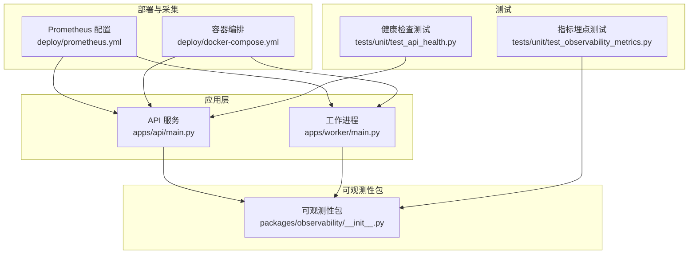

**图示来源**
- [apps/api/main.py](file://apps/api/main.py)
- [apps/worker/main.py](file://apps/worker/main.py)
- [packages/observability/__init__.py](file://packages/observability/__init__.py)
- [deploy/prometheus.yml](file://deploy/prometheus.yml)
- [deploy/docker-compose.yml](file://deploy/docker-compose.yml)
- [tests/unit/test_api_health.py](file://tests/unit/test_api_health.py)
- [tests/unit/test_observability_metrics.py](file://tests/unit/test_observability_metrics.py)

**章节来源**
- [apps/api/main.py](file://apps/api/main.py)
- [apps/worker/main.py](file://apps/worker/main.py)
- [packages/observability/__init__.py](file://packages/observability/__init__.py)
- [deploy/prometheus.yml](file://deploy/prometheus.yml)
- [deploy/docker-compose.yml](file://deploy/docker-compose.yml)
- [tests/unit/test_api_health.py](file://tests/unit/test_api_health.py)
- [tests/unit/test_observability_metrics.py](file://tests/unit/test_observability_metrics.py)

## 核心组件
- 可观测性包：提供统一的指标、日志、追踪等能力封装，供 API 与工作进程复用。
- Prometheus 采集：通过配置文件定义抓取目标与标签策略，统一汇聚指标。
- 健康检查端点：对外暴露健康探针，支撑负载均衡与健康探测。
- 测试用例：对健康检查与指标埋点进行回归验证，保障可观测性稳定性。

**章节来源**
- [packages/observability/__init__.py](file://packages/observability/__init__.py)
- [deploy/prometheus.yml](file://deploy/prometheus.yml)
- [tests/unit/test_api_health.py](file://tests/unit/test_api_health.py)
- [tests/unit/test_observability_metrics.py](file://tests/unit/test_observability_metrics.py)

## 架构总览
下图展示了从应用侧到采集与可视化的整体链路：API 与服务进程在启动时初始化可观测性能力，暴露指标与端点；Prometheus 按配置周期性抓取；Grafana 作为可视化面板（由编排管理）呈现多维视图；告警规则由 Prometheus 或外部告警管理器驱动。

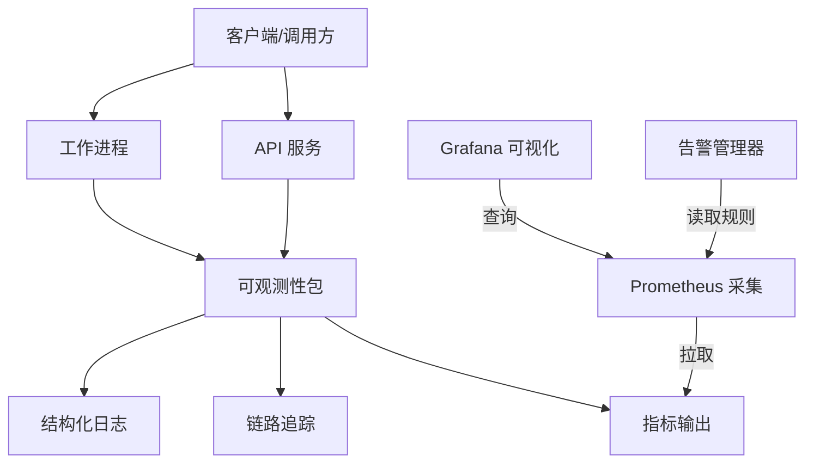

**图示来源**
- [apps/api/main.py](file://apps/api/main.py)
- [apps/worker/main.py](file://apps/worker/main.py)
- [packages/observability/__init__.py](file://packages/observability/__init__.py)
- [deploy/prometheus.yml](file://deploy/prometheus.yml)
- [deploy/docker-compose.yml](file://deploy/docker-compose.yml)

## 详细组件分析

### 可观测性包（指标、日志、追踪）
- 职责边界：集中封装指标计数器、直方图、仪表盘、日志格式化与上下文注入、追踪上下文传播等。
- 设计要点：
  - 指标命名规范与维度标签约定，避免高基数导致存储膨胀。
  - 日志结构化字段（请求ID、用户ID、资源标识等），便于聚合与检索。
  - 追踪上下文跨进程传递（HTTP 头或消息队列属性），保证端到端链路完整。
- 集成方式：API 与工作进程在启动阶段完成初始化，并在关键路径埋点。

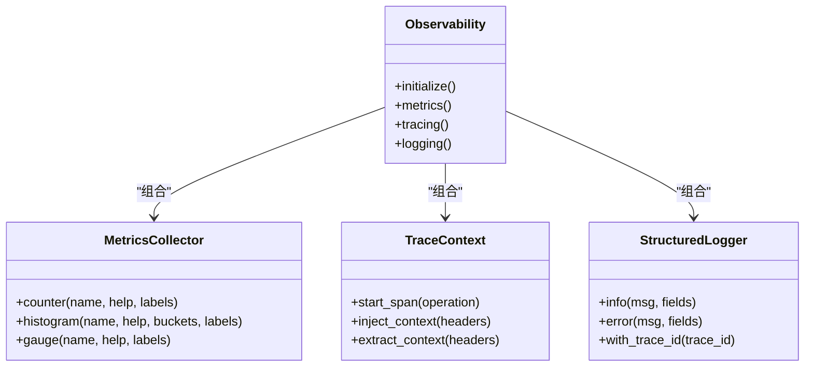

**图示来源**
- [packages/observability/__init__.py](file://packages/observability/__init__.py)

**章节来源**
- [packages/observability/__init__.py](file://packages/observability/__init__.py)

### Prometheus 指标采集与告警
- 采集目标：API 与工作进程的指标端点，按服务名与实例标签区分。
- 标签策略：为关键维度（服务、版本、环境、实例）设置稳定标签，控制基数。
- 告警规则：针对错误率、延迟分位、饱和度与资源水位设定阈值，触发通知。

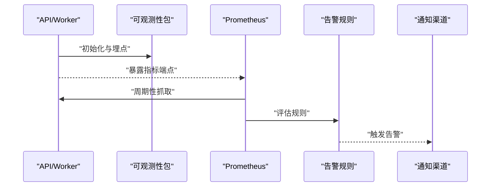

**图示来源**
- [deploy/prometheus.yml](file://deploy/prometheus.yml)
- [apps/api/main.py](file://apps/api/main.py)
- [apps/worker/main.py](file://apps/worker/main.py)
- [packages/observability/__init__.py](file://packages/observability/__init__.py)

**章节来源**
- [deploy/prometheus.yml](file://deploy/prometheus.yml)

### 健康检查与系统状态
- 健康检查端点：返回服务就绪与依赖可用性状态，用于负载均衡与健康探测。
- 状态维度：进程存活、依赖连通性（数据库、缓存、外部服务）、资源水位（CPU/内存/磁盘）。
- 测试覆盖：通过单元测试验证健康端点行为与响应语义。

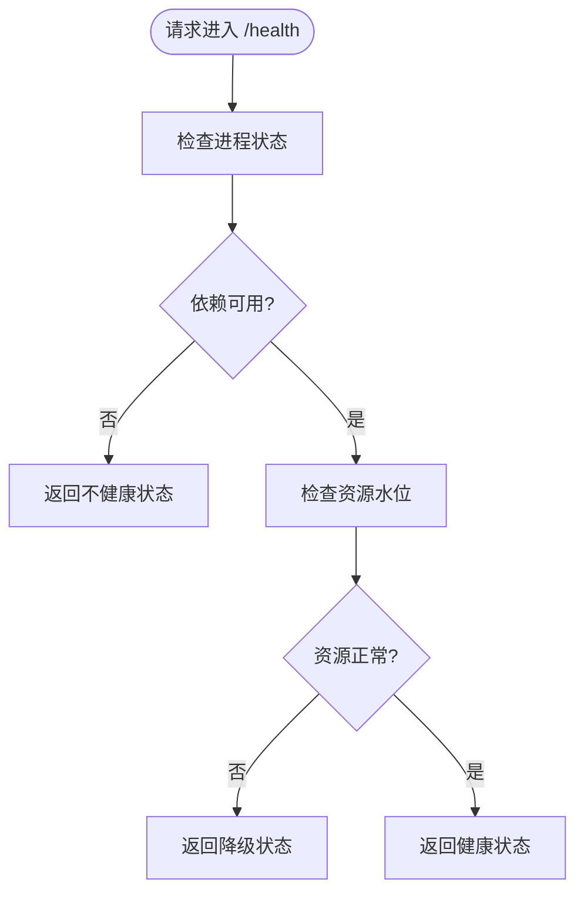

**图示来源**
- [tests/unit/test_api_health.py](file://tests/unit/test_api_health.py)
- [apps/api/main.py](file://apps/api/main.py)

**章节来源**
- [tests/unit/test_api_health.py](file://tests/unit/test_api_health.py)
- [apps/api/main.py](file://apps/api/main.py)

### 分布式链路追踪
- 上下文传播：在 HTTP 请求入口提取追踪上下文，注入下游调用头，确保跨服务链路连贯。
- 跨度记录：在关键处理步骤创建跨度，记录耗时与异常信息。
- 瓶颈定位：结合延迟分布与错误率，快速定位热点接口与慢依赖。

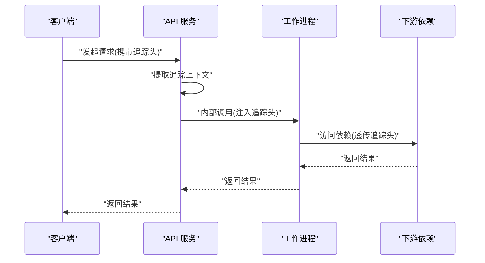

**图示来源**
- [packages/observability/__init__.py](file://packages/observability/__init__.py)
- [apps/api/main.py](file://apps/api/main.py)
- [apps/worker/main.py](file://apps/worker/main.py)

**章节来源**
- [packages/observability/__init__.py](file://packages/observability/__init__.py)
- [apps/api/main.py](file://apps/api/main.py)
- [apps/worker/main.py](file://apps/worker/main.py)

### 日志收集与分析
- 结构化日志：统一字段模型（时间戳、级别、服务、实例、追踪ID、业务键），便于聚合与检索。
- 日志聚合：将各服务日志集中输出至日志平台，支持索引与查询。
- 搜索与关联：通过追踪ID关联日志与指标，提升排障效率。

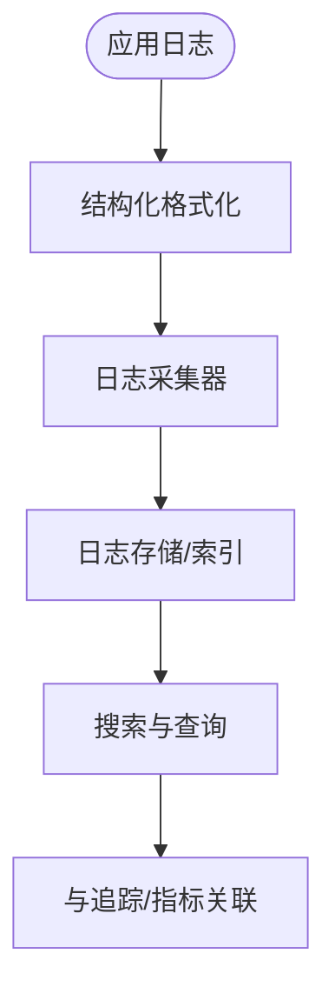

**图示来源**
- [packages/observability/__init__.py](file://packages/observability/__init__.py)

**章节来源**
- [packages/observability/__init__.py](file://packages/observability/__init__.py)

### 可视化与告警
- 可视化面板：以服务、接口、依赖、资源为维度构建看板，展示吞吐、延迟、错误率与饱和度。
- 告警策略：基于 SLO/SLI 设定阈值，结合多因子（错误率+延迟+饱和度）降低误报。
- 通知渠道：邮件、IM、电话等多通道，支持升级与抑制策略。

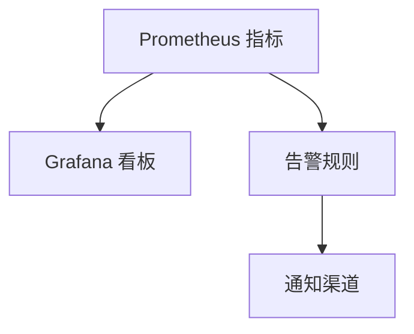

**图示来源**
- [deploy/prometheus.yml](file://deploy/prometheus.yml)
- [deploy/docker-compose.yml](file://deploy/docker-compose.yml)

**章节来源**
- [deploy/prometheus.yml](file://deploy/prometheus.yml)
- [deploy/docker-compose.yml](file://deploy/docker-compose.yml)

### 容量规划与性能调优的监控指标设计
- 容量规划：关注 CPU/内存/磁盘/网络饱和度、队列长度、连接池占用、存储增长速率。
- 性能调优：关注 P50/P95/P99 延迟、错误率、重试率、超时率、GC 停顿、锁等待。
- 业务指标：订单量、转化率、成功率、失败原因分布、数据新鲜度与质量评分。

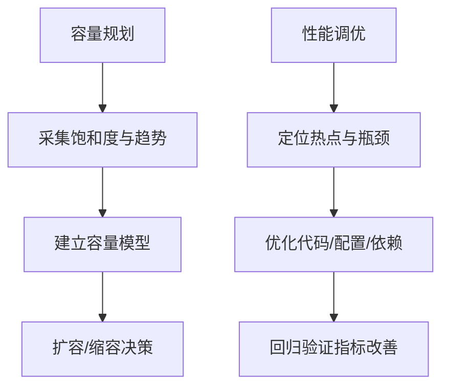

[本节为概念性内容，无需源码引用]

### 故障诊断与根因分析的工具链
- 工具链：指标（Prometheus）+ 日志（集中化）+ 追踪（分布式）三位一体。
- 诊断流程：从告警切入，查看看板确认影响面，通过追踪定位慢调用与异常分支，结合日志还原现场。
- 根因分析：利用拓扑关系与依赖健康状态，识别上游故障与级联效应。

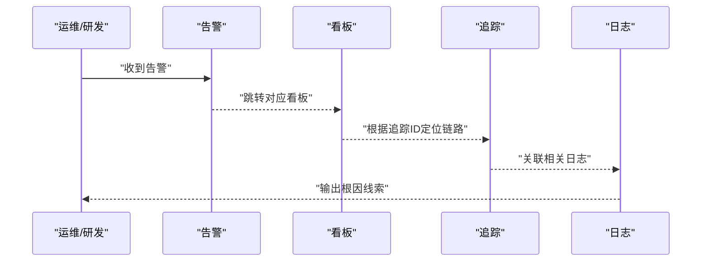

[本节为概念性内容，无需源码引用]

## 依赖分析
- 组件耦合：API 与工作进程均依赖可观测性包；Prometheus 通过配置拉取指标；编排文件管理服务生命周期。
- 外部依赖：数据库、缓存、外部服务等依赖的健康状态纳入健康检查与指标。
- 潜在风险：高基数标签、过度采样、未限流的指标端点可能带来性能与存储压力。

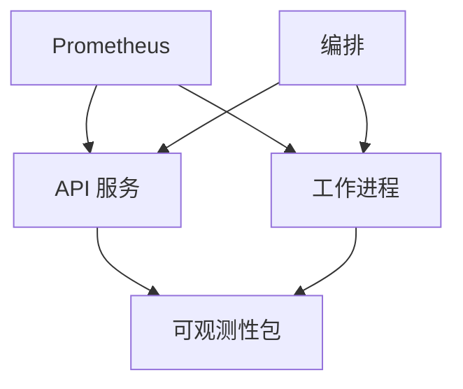

**图示来源**
- [apps/api/main.py](file://apps/api/main.py)
- [apps/worker/main.py](file://apps/worker/main.py)
- [packages/observability/__init__.py](file://packages/observability/__init__.py)
- [deploy/prometheus.yml](file://deploy/prometheus.yml)
- [deploy/docker-compose.yml](file://deploy/docker-compose.yml)

**章节来源**
- [apps/api/main.py](file://apps/api/main.py)
- [apps/worker/main.py](file://apps/worker/main.py)
- [packages/observability/__init__.py](file://packages/observability/__init__.py)
- [deploy/prometheus.yml](file://deploy/prometheus.yml)
- [deploy/docker-compose.yml](file://deploy/docker-compose.yml)

## 性能考虑
- 指标采样与降采样：在高并发场景下合理设置采样频率与桶数量，避免写入放大。
- 标签基数控制：严格限制高基数维度，必要时使用摘要或预聚合。
- 健康检查节流：避免频繁探测造成额外负载。
- 追踪采样策略：按比例采样与关键路径全采样结合，平衡开销与可观测性。

[本节为通用指导，无需源码引用]

## 故障排查指南
- 健康检查失败：优先检查依赖连通性与资源水位，确认是否处于降级模式。
- 指标缺失：核对 Prometheus 抓取配置与端点可达性，检查服务启动顺序与端口绑定。
- 告警风暴：调整阈值与抑制规则，合并相似告警，减少噪声。
- 追踪断链：确认上下文注入与透传逻辑，检查跨服务调用头是否正确传递。
- 日志丢失：校验采集器状态与存储索引健康，确认日志格式与字段完整性。

**章节来源**
- [tests/unit/test_api_health.py](file://tests/unit/test_api_health.py)
- [tests/unit/test_observability_metrics.py](file://tests/unit/test_observability_metrics.py)
- [deploy/prometheus.yml](file://deploy/prometheus.yml)

## 结论
通过统一的可观测性包、规范的指标与日志实践、完善的健康检查与追踪机制，配合 Prometheus 与 Grafana 的采集与可视化能力，本项目构建了覆盖基础设施、应用性能与业务指标的层次化监控体系。在此基础上，结合告警规则与故障诊断工具链，可有效提升系统的可观测性与稳定性，并为容量规划与性能调优提供数据支撑。

## 附录
- 建议补充项：
  - 明确指标字典与命名规范，沉淀到团队知识库。
  - 完善告警规则库与演练流程，定期复盘告警有效性。
  - 引入日志保留策略与冷热分层存储，控制成本。
  - 建立 SLO/SLI 体系，将可观测性指标与业务目标对齐。

[本节为补充建议，无需源码引用]