# 系统概览

<cite>
**本文引用的文件**   
- [README.md](file://README.md)
- [pyproject.toml](file://pyproject.toml)
- [apps/api/main.py](file://apps/api/main.py)
- [apps/api/deps.py](file://apps/api/deps.py)
- [apps/worker/main.py](file://apps/worker/main.py)
- [apps/worker/tasks.py](file://apps/worker/tasks.py)
- [apps/scheduler/schedule.py](file://apps/scheduler/schedule.py)
- [deploy/docker-compose.yml](file://deploy/docker-compose.yml)
- [deploy/prometheus.yml](file://deploy/prometheus.yml)
- [configs/base.yaml](file://configs/base.yaml)
- [configs/dev.yaml](file://configs/dev.yaml)
- [alembic.ini](file://alembic.ini)
- [sql/migrations/env.py](file://sql/migrations/env.py)
- [packages/data_sources/__init__.py](file://packages/data_sources/__init__.py)
- [packages/backtest/__init__.py](file://packages/backtest/__init__.py)
- [packages/reporting/__init__.py](file://packages/reporting/__init__.py)
- [packages/observability/__init__.py](file://packages/observability/__init__.py)
- [packages/models/__init__.py](file://packages/models/__init__.py)
</cite>

## 目录
1. [简介](#简介)
2. [项目结构](#项目结构)
3. [核心组件](#核心组件)
4. [架构总览](#架构总览)
5. [详细组件分析](#详细组件分析)
6. [依赖关系分析](#依赖关系分析)
7. [性能与扩展性](#性能与扩展性)
8. [监控与可观测性](#监控与可观测性)
9. [故障排查指南](#故障排查指南)
10. [结论](#结论)
11. [附录](#附录)

## 简介
本量化投资系统面向跨市场（A股、美股、基金等）的投研与交易闭环，提供统一的数据接入、特征与标签工程、策略回测、推理与报告输出能力。系统以微服务形态部署，API服务对外暴露REST接口，工作进程异步执行数据入库、模型训练与回测任务，调度器负责定时与事件驱动的任务编排。通过插件化设计，系统支持灵活接入新数据源、策略类型与报告渠道，并内置可观测性与运维管理能力，满足生产级稳定性与可扩展性要求。

## 项目结构
仓库采用“应用层 + 领域包”的分层组织方式：
- apps：应用入口与运行时单元，包含API服务、工作进程、调度器等独立部署单元
- packages：领域与通用能力包，如数据源、回测、报告、可观测性等
- configs：配置中心，按环境拆分基础与开发配置
- deploy：容器编排与监控采集配置
- sql：数据库迁移脚本
- tests：单元测试与集成测试
- skills：研究技能与校验脚本

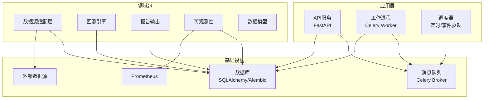

图表来源
- [apps/api/main.py:1-200](file://apps/api/main.py#L1-L200)
- [apps/worker/main.py:1-200](file://apps/worker/main.py#L1-L200)
- [apps/scheduler/schedule.py:1-200](file://apps/scheduler/schedule.py#L1-L200)
- [deploy/docker-compose.yml:1-200](file://deploy/docker-compose.yml#L1-L200)
- [deploy/prometheus.yml:1-200](file://deploy/prometheus.yml#L1-L200)

章节来源
- [README.md:1-200](file://README.md#L1-L200)
- [pyproject.toml:1-200](file://pyproject.toml#L1-L200)
- [apps/api/main.py:1-200](file://apps/api/main.py#L1-L200)
- [apps/worker/main.py:1-200](file://apps/worker/main.py#L1-L200)
- [apps/scheduler/schedule.py:1-200](file://apps/scheduler/schedule.py#L1-L200)
- [deploy/docker-compose.yml:1-200](file://deploy/docker-compose.yml#L1-L200)
- [deploy/prometheus.yml:1-200](file://deploy/prometheus.yml#L1-L200)

## 核心组件
- API服务：基于FastAPI构建，提供统一的REST接口，承载行情、基本面、组合、预测、调度管理等业务域路由；通过依赖注入管理数据库会话与外部服务。
- 工作进程：基于Celery Worker，异步处理数据入库、特征计算、模型训练、回测执行与报告生成等耗时任务。
- 调度器：负责任务编排与定时触发，协调数据拉取、批量处理与周期性回测。
- 数据源适配层：抽象多市场数据接入，统一标准化格式与元数据，支撑跨市场一致性处理。
- 回测引擎：封装策略执行、撮合与绩效评估，支持多种策略类型与风险指标。
- 报告输出：将回测结果、风控与审计信息输出至多渠道（文件、数据库、消息通道）。
- 可观测性：采集指标、日志与追踪，对接Prometheus与集中式日志系统。
- 数据模型：使用SQLAlchemy定义持久化实体，Alembic管理版本化迁移。

章节来源
- [apps/api/main.py:1-200](file://apps/api/main.py#L1-L200)
- [apps/api/deps.py:1-200](file://apps/api/deps.py#L1-L200)
- [apps/worker/main.py:1-200](file://apps/worker/main.py#L1-L200)
- [apps/worker/tasks.py:1-200](file://apps/worker/tasks.py#L1-L200)
- [apps/scheduler/schedule.py:1-200](file://apps/scheduler/schedule.py#L1-L200)
- [packages/data_sources/__init__.py:1-200](file://packages/data_sources/__init__.py#L1-L200)
- [packages/backtest/__init__.py:1-200](file://packages/backtest/__init__.py#L1-L200)
- [packages/reporting/__init__.py:1-200](file://packages/reporting/__init__.py#L1-L200)
- [packages/observability/__init__.py:1-200](file://packages/observability/__init__.py#L1-L200)
- [packages/models/__init__.py:1-200](file://packages/models/__init__.py#L1-L200)
- [alembic.ini:1-200](file://alembic.ini#L1-L200)
- [sql/migrations/env.py:1-200](file://sql/migrations/env.py#L1-L200)

## 架构总览
系统采用微服务+插件化的分层架构：
- 控制面：API服务暴露REST接口，供前端或下游系统调用；调度器按周期或事件触发任务。
- 数据面：数据源适配层从外部市场拉取原始数据，经清洗、对齐与标准化后写入数据库。
- 计算面：工作进程消费任务队列，执行特征工程、模型训练、回测与报告生成。
- 存储面：关系型数据库作为主存储，配合迁移工具进行版本化管理。
- 可观测面：指标、日志、追踪统一采集，便于监控告警与排障。

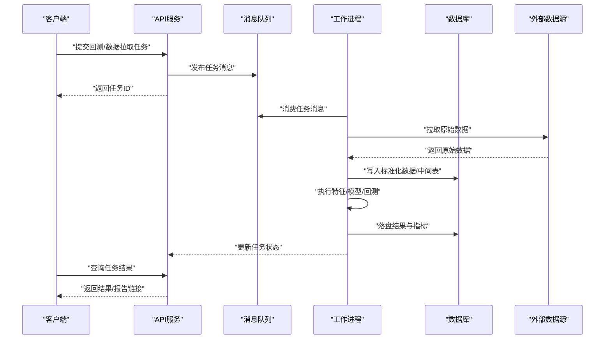

图表来源
- [apps/api/main.py:1-200](file://apps/api/main.py#L1-L200)
- [apps/worker/tasks.py:1-200](file://apps/worker/tasks.py#L1-L200)
- [deploy/docker-compose.yml:1-200](file://deploy/docker-compose.yml#L1-L200)

## 详细组件分析

### API服务（FastAPI）
- 职责：统一对外暴露REST接口，承载各业务域路由；通过依赖注入管理数据库会话、认证鉴权与外部服务访问。
- 关键特性：
  - 路由模块化：按业务域划分路由器，便于维护与权限控制
  - 依赖注入：集中管理数据库连接、配置加载与第三方服务实例
  - 响应规范：统一响应信封与错误码，提升客户端体验
- 典型流程：接收请求→参数校验→发布任务或查询→返回结构化响应

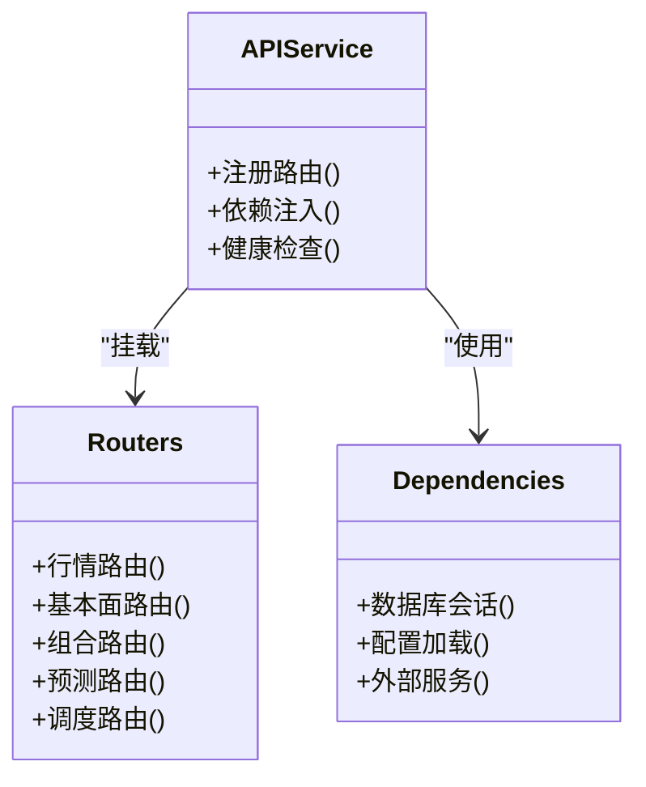

图表来源
- [apps/api/main.py:1-200](file://apps/api/main.py#L1-L200)
- [apps/api/deps.py:1-200](file://apps/api/deps.py#L1-L200)

章节来源
- [apps/api/main.py:1-200](file://apps/api/main.py#L1-L200)
- [apps/api/deps.py:1-200](file://apps/api/deps.py#L1-L200)

### 工作进程（Celery Worker）
- 职责：异步执行数据入库、特征计算、模型训练、回测与报告生成等耗时任务。
- 关键特性：
  - 任务解耦：通过消息队列实现生产者-消费者模式
  - 重试与幂等：失败自动重试，任务状态持久化
  - 资源隔离：按任务类型分配CPU/GPU资源池
- 典型流程：消费任务→读取输入→执行计算→写库→回调通知

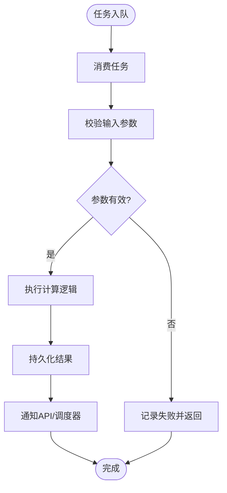

图表来源
- [apps/worker/main.py:1-200](file://apps/worker/main.py#L1-L200)
- [apps/worker/tasks.py:1-200](file://apps/worker/tasks.py#L1-L200)

章节来源
- [apps/worker/main.py:1-200](file://apps/worker/main.py#L1-L200)
- [apps/worker/tasks.py:1-200](file://apps/worker/tasks.py#L1-L200)

### 调度器（Scheduler）
- 职责：定时触发数据拉取、批量处理与周期性回测；协调跨域任务依赖。
- 关键特性：
  - 时间规则：支持日历规则与节假日处理
  - 依赖编排：任务间依赖图与重试策略
  - 可观测：任务生命周期指标与告警

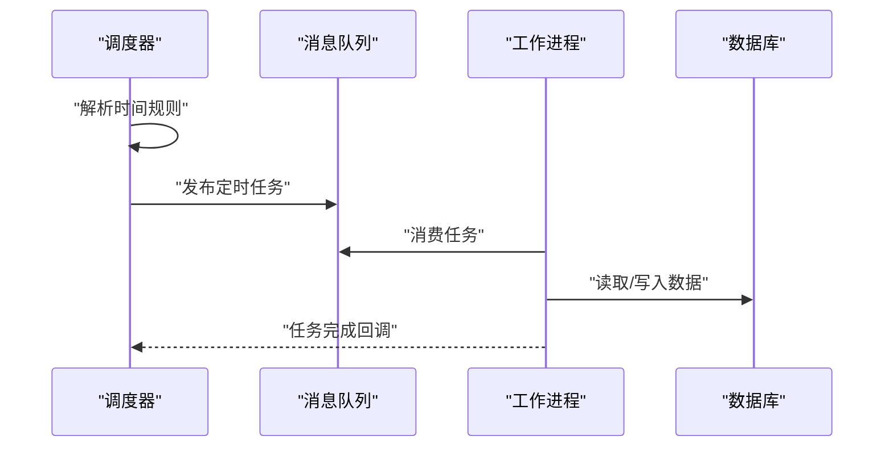

图表来源
- [apps/scheduler/schedule.py:1-200](file://apps/scheduler/schedule.py#L1-L200)
- [deploy/docker-compose.yml:1-200](file://deploy/docker-compose.yml#L1-L200)

章节来源
- [apps/scheduler/schedule.py:1-200](file://apps/scheduler/schedule.py#L1-L200)

### 数据源适配层（Data Sources）
- 职责：抽象多市场数据接入，统一标准化格式与元数据，支撑跨市场一致性处理。
- 关键特性：
  - 适配器模式：不同市场/数据提供方实现统一接口
  - 去重与合并：冲突检测与权威源选择
  - 血缘追踪：数据来源与转换过程可追溯

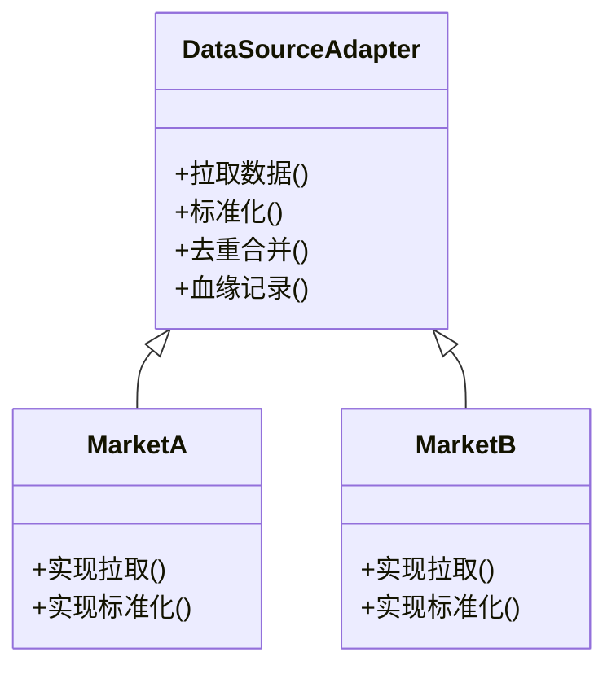

图表来源
- [packages/data_sources/__init__.py:1-200](file://packages/data_sources/__init__.py#L1-L200)

章节来源
- [packages/data_sources/__init__.py:1-200](file://packages/data_sources/__init__.py#L1-L200)

### 回测引擎（Backtest）
- 职责：封装策略执行、撮合与绩效评估，支持多种策略类型与风险指标。
- 关键特性：
  - 策略插拔：策略类实现统一接口，动态加载
  - 事件驱动：按时间步推进，模拟真实交易环境
  - 指标丰富：收益、回撤、夏普、换手率等

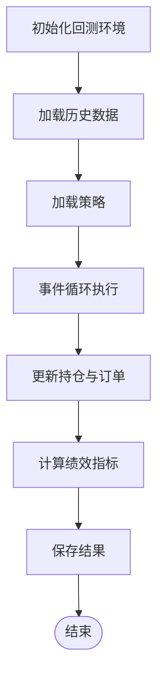

图表来源
- [packages/backtest/__init__.py:1-200](file://packages/backtest/__init__.py#L1-L200)

章节来源
- [packages/backtest/__init__.py:1-200](file://packages/backtest/__init__.py#L1-L200)

### 报告输出（Reporting）
- 职责：将回测结果、风控与审计信息输出至多渠道（文件、数据库、消息通道）。
- 关键特性：
  - 模板化：报告模板与变量替换
  - 渠道扩展：新增渠道只需实现统一接口
  - 版本化：报告版本管理与归档

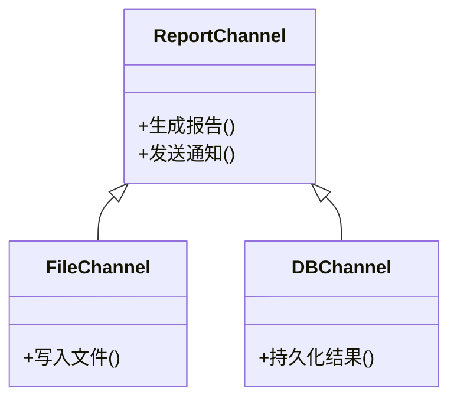

图表来源
- [packages/reporting/__init__.py:1-200](file://packages/reporting/__init__.py#L1-L200)

章节来源
- [packages/reporting/__init__.py:1-200](file://packages/reporting/__init__.py#L1-L200)

### 可观测性（Observability）
- 职责：采集指标、日志与追踪，对接Prometheus与集中式日志系统。
- 关键特性：
  - 指标埋点：任务耗时、成功率、队列长度等
  - 日志聚合：结构化日志与上下文关联
  - 告警规则：阈值与异常模式识别

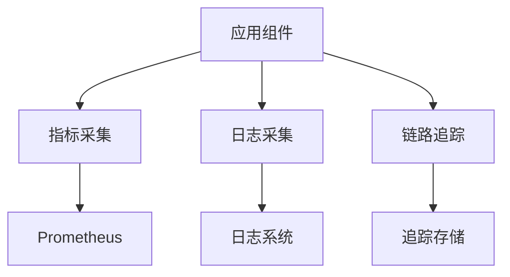

图表来源
- [packages/observability/__init__.py:1-200](file://packages/observability/__init__.py#L1-L200)
- [deploy/prometheus.yml:1-200](file://deploy/prometheus.yml#L1-L200)

章节来源
- [packages/observability/__init__.py:1-200](file://packages/observability/__init__.py#L1-L200)
- [deploy/prometheus.yml:1-200](file://deploy/prometheus.yml#L1-L200)

### 数据模型与迁移（Models & Migrations）
- 职责：使用SQLAlchemy定义持久化实体，Alembic管理版本化迁移。
- 关键特性：
  - 模型分层：领域模型与ORM映射分离
  - 迁移脚本：增量变更与回滚支持
  - 环境配置：按环境切换数据库连接

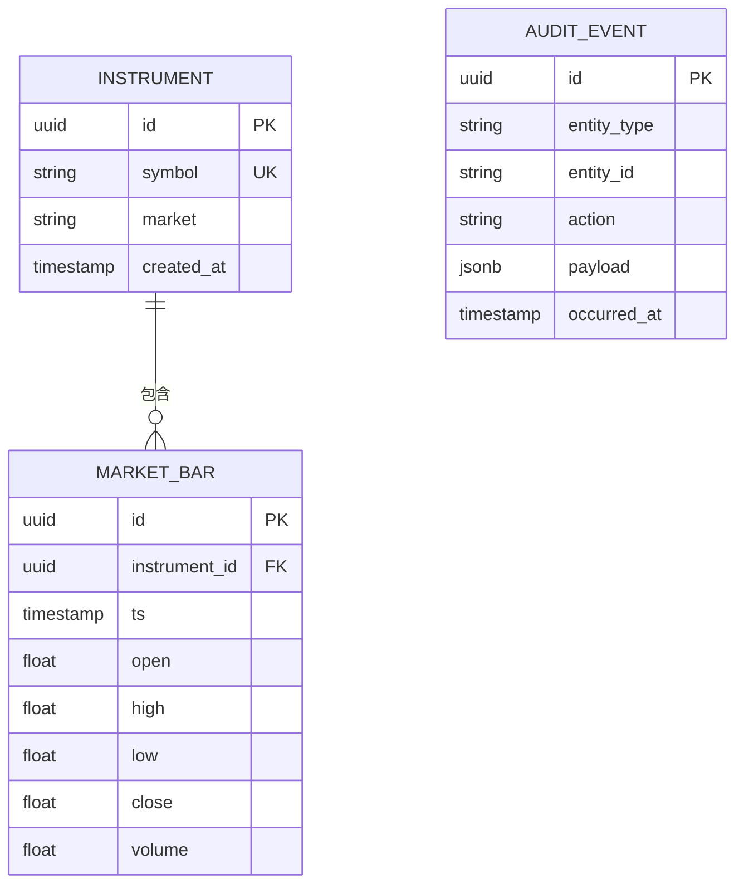

图表来源
- [packages/models/__init__.py:1-200](file://packages/models/__init__.py#L1-L200)
- [sql/migrations/env.py:1-200](file://sql/migrations/env.py#L1-L200)
- [alembic.ini:1-200](file://alembic.ini#L1-L200)

章节来源
- [packages/models/__init__.py:1-200](file://packages/models/__init__.py#L1-L200)
- [sql/migrations/env.py:1-200](file://sql/migrations/env.py#L1-L200)
- [alembic.ini:1-200](file://alembic.ini#L1-L200)

## 依赖关系分析
- 组件耦合：
  - API服务依赖消息队列与数据库，低耦合于具体任务实现
  - 工作进程依赖消息队列与数据库，通过任务接口解耦业务逻辑
  - 调度器依赖消息队列与时间规则引擎，协调任务生命周期
- 外部依赖：
  - 外部数据源：通过适配层屏蔽差异
  - Prometheus：指标采集与可视化
  - 数据库：关系型存储与迁移管理

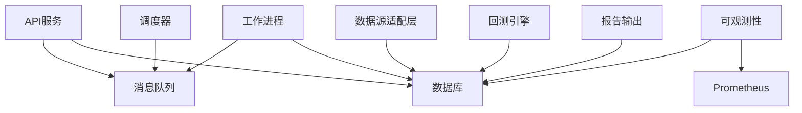

图表来源
- [deploy/docker-compose.yml:1-200](file://deploy/docker-compose.yml#L1-L200)
- [deploy/prometheus.yml:1-200](file://deploy/prometheus.yml#L1-L200)

章节来源
- [deploy/docker-compose.yml:1-200](file://deploy/docker-compose.yml#L1-L200)
- [deploy/prometheus.yml:1-200](file://deploy/prometheus.yml#L1-L200)

## 性能与扩展性
- 水平扩展：
  - 工作进程无状态，可按负载动态扩缩容
  - 消息队列支持分区与副本，保障高吞吐与可靠性
- 插件化架构：
  - 数据源：新增市场或提供方仅需实现适配器接口
  - 策略：策略类实现统一接口，动态注册与加载
  - 报告渠道：新增渠道实现统一接口，无缝接入
- 性能优化：
  - 批处理：批量写入与索引优化
  - 缓存：热点数据缓存与失效策略
  - 异步：I/O密集型操作异步化，减少阻塞

[本节为通用指导，不直接分析具体文件]

## 监控与可观测性
- 指标体系：
  - 任务指标：入队/出队速率、处理时长、失败率
  - 系统指标：CPU/内存/磁盘/网络使用率
  - 业务指标：数据覆盖率、回测收益、风控阈值
- 告警策略：
  - 阈值告警：队列积压、任务失败率、延迟超时
  - 异常模式：数据漂移、模型退化、市场异常
- 运维管理：
  - 健康检查：API与服务端点健康探针
  - 日志聚合：结构化日志与上下文关联
  - 追踪链路：端到端请求追踪与瓶颈定位

章节来源
- [deploy/prometheus.yml:1-200](file://deploy/prometheus.yml#L1-L200)
- [packages/observability/__init__.py:1-200](file://packages/observability/__init__.py#L1-L200)

## 故障排查指南
- 常见问题：
  - 任务失败：检查任务日志与重试策略，确认输入参数与依赖服务可用性
  - 数据不一致：核对数据血缘与去重逻辑，验证权威源与合并策略
  - 性能瓶颈：分析指标与追踪，定位慢查询与CPU热点
- 诊断步骤：
  - 查看任务状态与错误堆栈
  - 检查数据库连接与迁移状态
  - 验证消息队列连通性与堆积情况
  - 审查外部数据源返回格式与限流策略

章节来源
- [apps/worker/tasks.py:1-200](file://apps/worker/tasks.py#L1-L200)
- [apps/api/deps.py:1-200](file://apps/api/deps.py#L1-L200)
- [sql/migrations/env.py:1-200](file://sql/migrations/env.py#L1-L200)

## 结论
本系统以微服务与插件化为核心设计理念，实现了跨市场数据处理、AI Agent集成、策略回测与报告输出的完整闭环。通过清晰的职责划分与松耦合架构，系统在扩展性、可观测性与运维管理方面具备良好基础，能够支撑复杂投研场景与生产级稳定运行。

[本节为总结性内容，不直接分析具体文件]

## 附录
- 配置管理：
  - 基础配置与环境变量：按环境拆分，支持热重载
  - 数据库连接：连接池与超时策略
  - 消息队列：重试与死信队列配置
- 部署清单：
  - 容器编排：服务依赖与健康检查
  - 监控采集：Prometheus抓取与告警规则
  - 日志收集：集中式日志与保留策略

章节来源
- [configs/base.yaml:1-200](file://configs/base.yaml#L1-L200)
- [configs/dev.yaml:1-200](file://configs/dev.yaml#L1-L200)
- [deploy/docker-compose.yml:1-200](file://deploy/docker-compose.yml#L1-L200)
- [deploy/prometheus.yml:1-200](file://deploy/prometheus.yml#L1-L200)