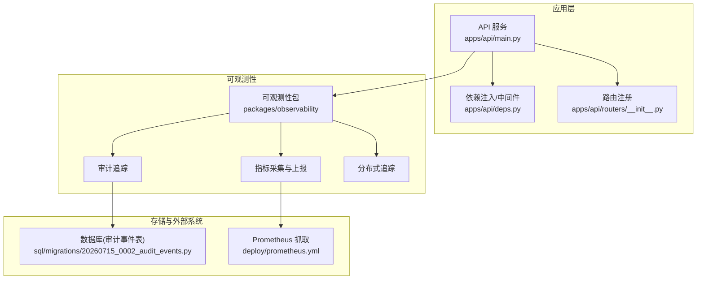
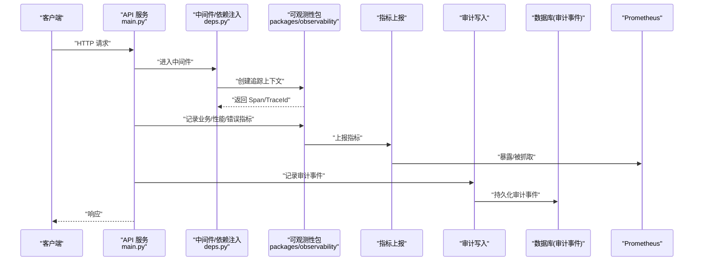
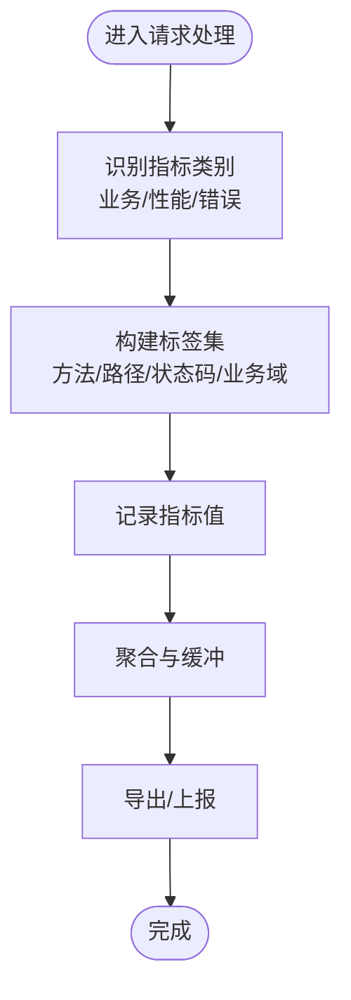
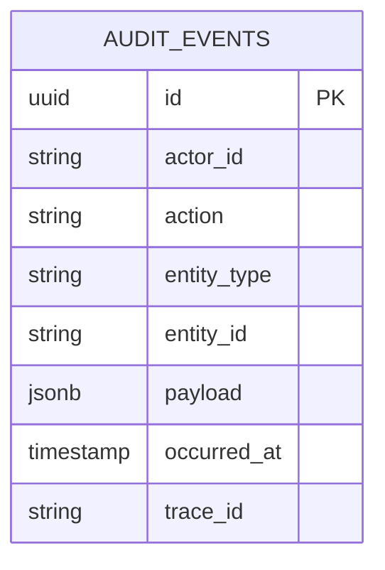
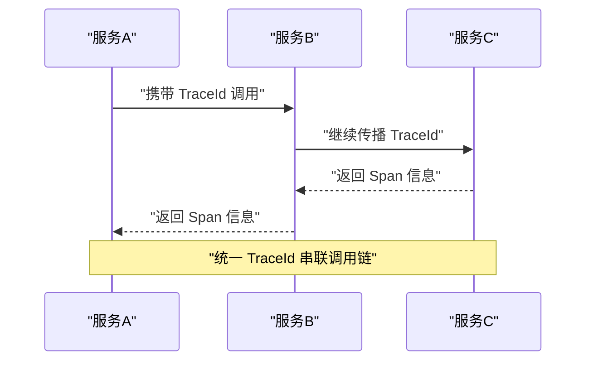
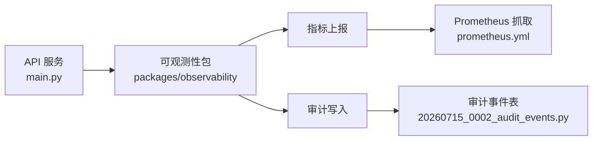

# 可观测性与监控

<cite>
**本文引用的文件**   
- [packages/observability](file://packages/observability)
- [tests/unit/test_observability_metrics.py](file://tests/unit/test_observability_metrics.py)
- [deploy/prometheus.yml](file://deploy/prometheus.yml)
- [sql/migrations/20260715_0002_audit_events.py](file://sql/migrations/20260715_0002_audit_events.py)
- [apps/api/main.py](file://apps/api/main.py)
- [apps/api/deps.py](file://apps/api/deps.py)
- [apps/api/routers/__init__.py](file://apps/api/routers/__init__.py)
</cite>

## 目录
1. [简介](#简介)
2. [项目结构](#项目结构)
3. [核心组件](#核心组件)
4. [架构总览](#架构总览)
5. [详细组件分析](#详细组件分析)
6. [依赖关系分析](#依赖关系分析)
7. [性能考虑](#性能考虑)
8. [故障诊断指南](#故障诊断指南)
9. [结论](#结论)
10. [附录](#附录)

## 简介
本章节面向“可观测性与监控”模块，系统性阐述指标采集与上报、审计追踪、告警规则、分布式追踪与链路监控、监控面板定制与通知配置，以及性能瓶颈分析与故障诊断最佳实践。文档以仓库现有实现为依据，结合测试与部署配置进行说明，并提供代码级参考路径以便深入阅读。

## 项目结构
可观测性与监控相关能力分布在以下位置：
- packages/observability：可观测性核心实现（指标、日志、追踪等）
- tests/unit/test_observability_metrics.py：指标子系统单元测试，覆盖业务/性能/错误指标分类与上报流程
- deploy/prometheus.yml：Prometheus 抓取配置，用于拉取应用暴露的指标端点
- sql/migrations/20260715_0002_audit_events.py：审计事件表结构迁移脚本，支撑操作日志、数据变更历史、访问记录的持久化
- apps/api/main.py、apps/api/deps.py、apps/api/routers/__init__.py：API 服务入口与中间件/依赖注入，通常集成指标收集、请求追踪与审计埋点

图表来源
- [apps/api/main.py](file://apps/api/main.py)
- [apps/api/deps.py](file://apps/api/deps.py)
- [apps/api/routers/__init__.py](file://apps/api/routers/__init__.py)
- [packages/observability](file://packages/observability)
- [sql/migrations/20260715_0002_audit_events.py](file://sql/migrations/20260715_0002_audit_events.py)
- [deploy/prometheus.yml](file://deploy/prometheus.yml)

章节来源
- [apps/api/main.py](file://apps/api/main.py)
- [apps/api/deps.py](file://apps/api/deps.py)
- [apps/api/routers/__init__.py](file://apps/api/routers/__init__.py)
- [packages/observability](file://packages/observability)
- [sql/migrations/20260715_0002_audit_events.py](file://sql/migrations/20260715_0002_audit_events.py)
- [deploy/prometheus.yml](file://deploy/prometheus.yml)

## 核心组件
- 指标子系统
  - 负责业务指标、性能指标、错误指标的采集、聚合与上报
  - 通过测试用例验证指标分类与上报路径的正确性
- 审计追踪子系统
  - 基于数据库迁移定义审计事件表，持久化操作日志、数据变更历史与访问记录
- 分布式追踪
  - 在请求生命周期中注入上下文，串联跨进程/服务的调用链
- 告警与可视化
  - 通过 Prometheus 抓取指标，配合告警规则与可视化面板进行监控与预警

章节来源
- [tests/unit/test_observability_metrics.py](file://tests/unit/test_observability_metrics.py)
- [sql/migrations/20260715_0002_audit_events.py](file://sql/migrations/20260715_0002_audit_events.py)
- [deploy/prometheus.yml](file://deploy/prometheus.yml)

## 架构总览
下图展示了从 API 请求进入，到指标采集、审计落库、追踪贯穿，再到 Prometheus 抓取的整体链路。

图表来源
- [apps/api/main.py](file://apps/api/main.py)
- [apps/api/deps.py](file://apps/api/deps.py)
- [packages/observability](file://packages/observability)
- [sql/migrations/20260715_0002_audit_events.py](file://sql/migrations/20260715_0002_audit_events.py)
- [deploy/prometheus.yml](file://deploy/prometheus.yml)

## 详细组件分析

### 指标子系统（业务/性能/错误指标）
- 指标分类与管理
  - 业务指标：反映关键业务流程状态与结果（如订单量、转化率等）
  - 性能指标：反映系统运行效率（如延迟分位、吞吐、队列长度等）
  - 错误指标：统计异常与失败（如 HTTP 错误码分布、异常计数等）
- 采集与上报机制
  - 在请求处理关键路径埋点，按维度（方法、路径、状态码、业务域）打标签
  - 支持计数器、直方图、时序指标等类型，统一封装后上报至后端存储或导出端点
- 测试验证
  - 单元测试覆盖指标命名规范、维度完整性、上报频率与去重逻辑

章节来源
- [tests/unit/test_observability_metrics.py](file://tests/unit/test_observability_metrics.py)
- [packages/observability](file://packages/observability)

### 审计追踪系统（操作日志、数据变更历史、访问记录）
- 设计目标
  - 提供不可篡改的操作轨迹与数据变更历史，满足合规与排障需求
- 持久化存储
  - 使用数据库表存储审计事件，包含操作主体、对象、动作、时间戳、前后快照摘要等字段
- 触发时机
  - 在写操作、权限校验、关键参数变更处插入审计事件
- 查询与分析
  - 基于时间范围、操作者、对象类型、动作类型进行检索；支持关联追踪 ID 定位问题

图表来源
- [sql/migrations/20260715_0002_audit_events.py](file://sql/migrations/20260715_0002_audit_events.py)

章节来源
- [sql/migrations/20260715_0002_audit_events.py](file://sql/migrations/20260715_0002_audit_events.py)

### 告警规则配置与管理
- 指标接入
  - 通过 Prometheus 抓取应用暴露的指标端点，确保目标可达且标签完整
- 规则定义
  - 基于阈值、窗口、聚合函数定义告警条件（如错误率超过阈值、P99 延迟升高）
- 通知渠道
  - 配置邮件、IM、Webhook 等通知方式，避免告警风暴（抑制、分组、静默）
- 管理建议
  - 将规则纳入版本控制，灰度发布并观察误报/漏报情况

章节来源
- [deploy/prometheus.yml](file://deploy/prometheus.yml)

### 分布式追踪与链路监控
- 上下文传播
  - 在网关/入口生成 TraceId，随请求向下传递，跨服务保持链路一致
- 采样策略
  - 默认全量采样，生产环境可按错误率或慢请求比例进行采样
- 可视化
  - 将 Span 数据汇聚至追踪后端，形成端到端调用图，辅助定位瓶颈与异常

[此图为概念示意，不直接映射具体源码文件]

### 监控面板定制与告警通知配置指南
- 面板定制
  - 基于指标维度组合视图（如按服务、接口、状态码），设置多面板联动
  - 常用视图：QPS、延迟分位、错误率、资源利用率、队列积压
- 告警通知
  - 为关键指标设置分级告警（警告/严重），并配置升级策略
  - 结合审计事件与追踪 ID，快速定位根因

章节来源
- [deploy/prometheus.yml](file://deploy/prometheus.yml)

## 依赖关系分析
- API 服务依赖可观测性包，在请求生命周期内注入追踪上下文、记录指标与审计事件
- 审计事件依赖数据库表结构（由迁移脚本定义）
- 指标上报依赖 Prometheus 抓取配置，确保端点暴露与目标发现正确

图表来源
- [apps/api/main.py](file://apps/api/main.py)
- [packages/observability](file://packages/observability)
- [sql/migrations/20260715_0002_audit_events.py](file://sql/migrations/20260715_0002_audit_events.py)
- [deploy/prometheus.yml](file://deploy/prometheus.yml)

章节来源
- [apps/api/main.py](file://apps/api/main.py)
- [packages/observability](file://packages/observability)
- [sql/migrations/20260715_0002_audit_events.py](file://sql/migrations/20260715_0002_audit_events.py)
- [deploy/prometheus.yml](file://deploy/prometheus.yml)

## 性能考虑
- 指标上报
  - 采用批量与异步上报，降低对主流程的影响；合理设置刷新间隔与缓冲区大小
- 审计写入
  - 对高频审计事件采用批处理写入；必要时拆分读写路径，避免阻塞关键路径
- 追踪采样
  - 生产环境启用自适应采样，优先保留错误与慢请求样本
- 标签治理
  - 严格控制标签基数，防止高基数字段导致存储与查询压力过大

[本节为通用指导，无需特定文件引用]

## 故障诊断指南
- 常见问题
  - 指标缺失或维度不完整：检查埋点位置与标签构建逻辑
  - 审计事件丢失：确认写入路径与事务边界，核对幂等与重试策略
  - 追踪断链：确认上下文传播是否在各服务间保持一致
- 排查步骤
  - 通过 TraceId 关联审计事件与指标，定位异常发生的具体阶段
  - 对比健康检查与关键指标趋势，缩小影响面
  - 复现最小场景，逐步增加复杂度以隔离问题

章节来源
- [tests/unit/test_observability_metrics.py](file://tests/unit/test_observability_metrics.py)
- [sql/migrations/20260715_0002_audit_events.py](file://sql/migrations/20260715_0002_audit_events.py)

## 结论
本模块围绕“指标—审计—追踪—告警—可视化”构建完整的可观测性体系。通过统一的埋点规范、严格的标签治理、可靠的审计持久化与灵活的告警策略，能够有效提升系统的可观测性与可维护性。建议在迭代中持续完善指标字典、审计模板与告警规则，并结合实际业务演进优化采样与存储策略。

## 附录
- 自定义监控指标示例（参考路径）
  - 指标定义与埋点：参见 [packages/observability](file://packages/observability)
  - 指标测试用例：参见 [tests/unit/test_observability_metrics.py](file://tests/unit/test_observability_metrics.py)
- 自定义审计事件示例（参考路径）
  - 审计事件表结构：参见 [sql/migrations/20260715_0002_audit_events.py](file://sql/migrations/20260715_0002_audit_events.py)
- 监控面板与告警配置（参考路径）
  - Prometheus 抓取配置：参见 [deploy/prometheus.yml](file://deploy/prometheus.yml)