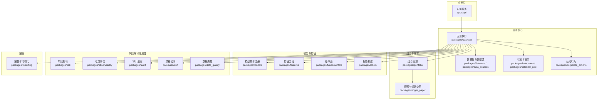
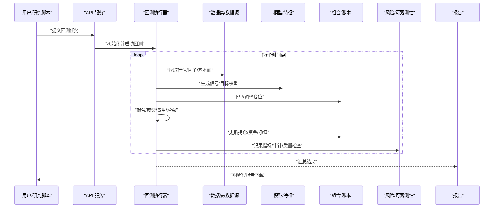
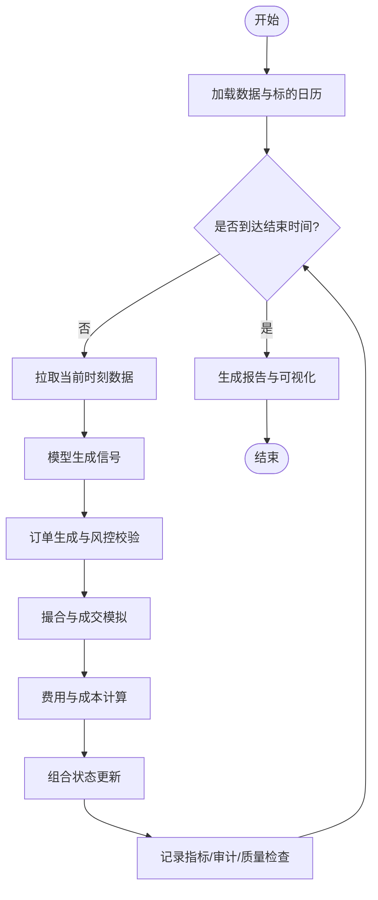
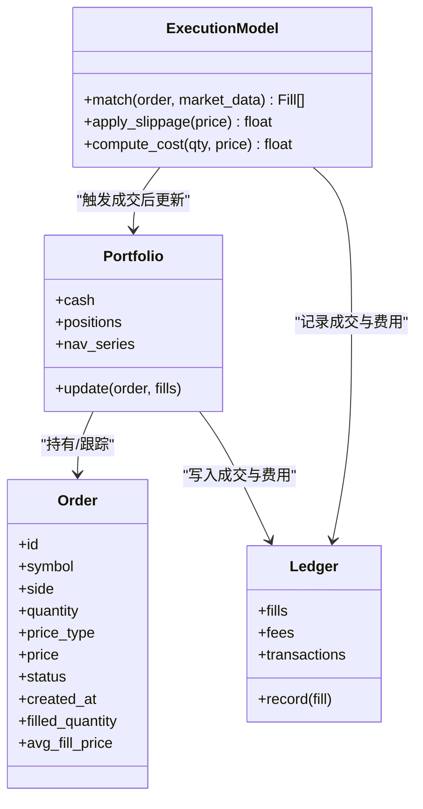
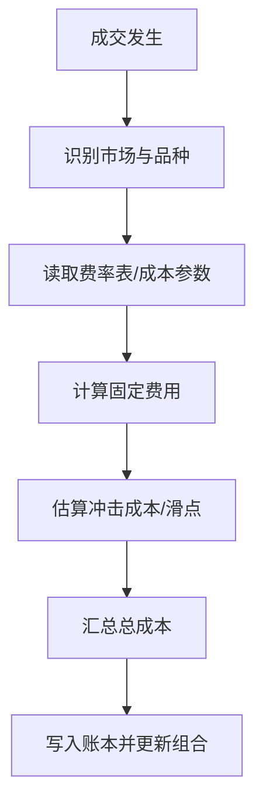
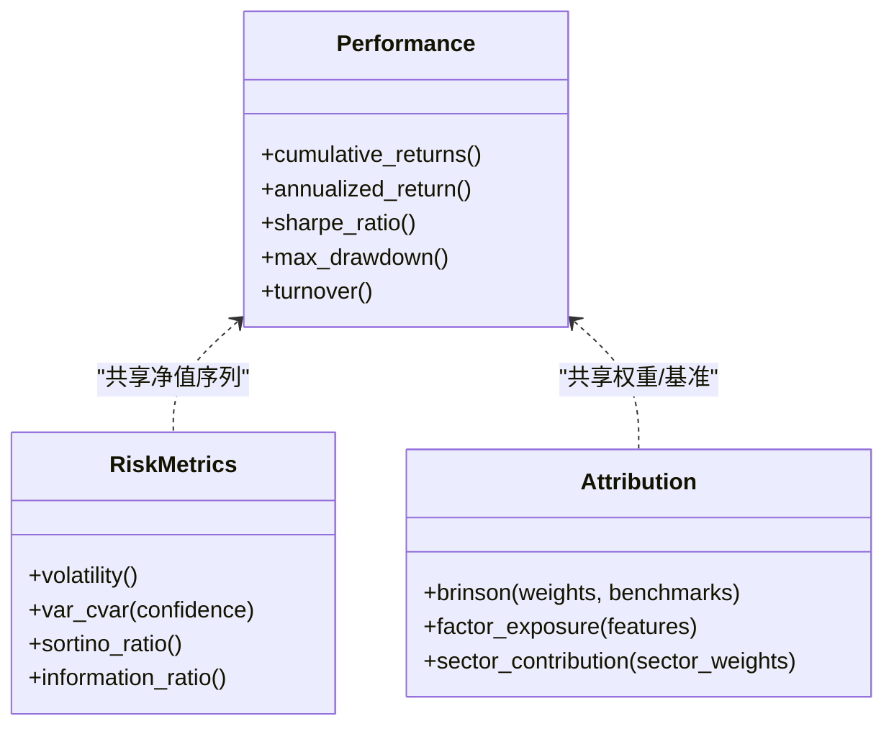
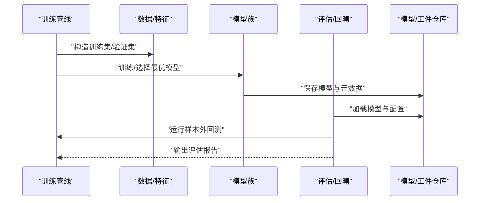
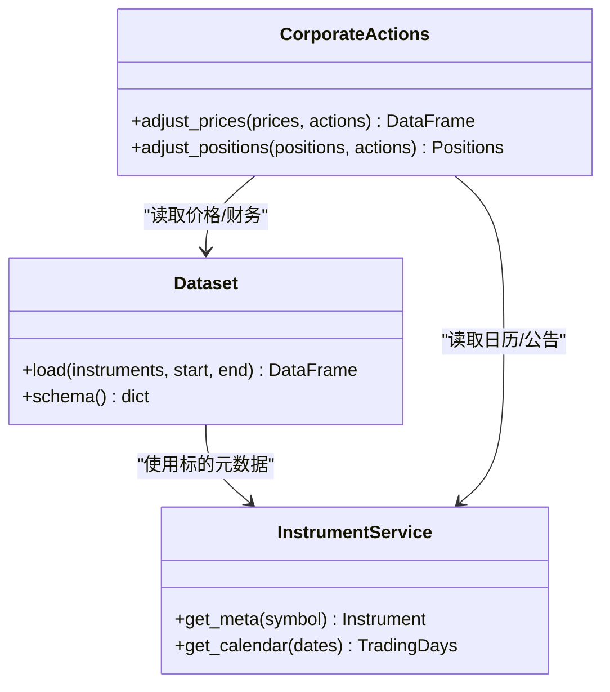
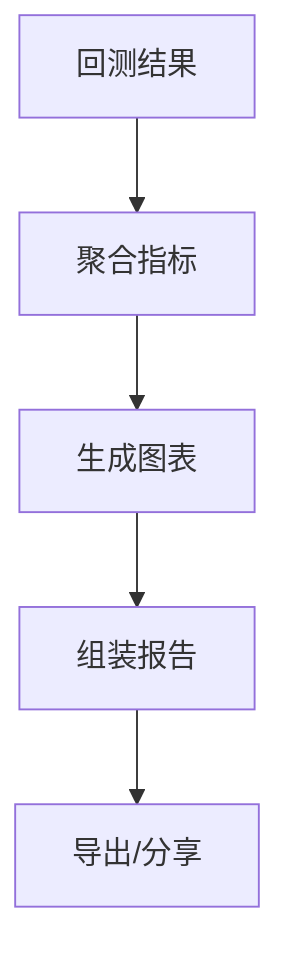
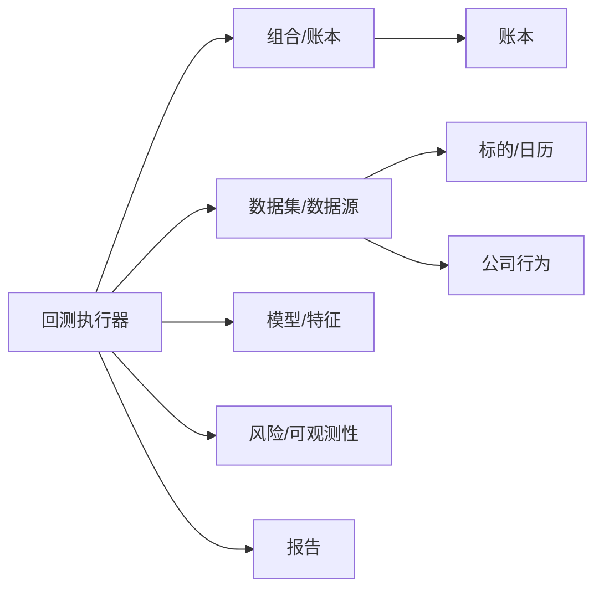

# 回测引擎

<cite>
**本文引用的文件**   
- [README.md](file://README.md)
- [pyproject.toml](file://pyproject.toml)
- [apps/api/main.py](file://apps/api/main.py)
- [apps/api/routers/__init__.py](file://apps/api/routers/__init__.py)
- [packages/backtest/__init__.py](file://packages/backtest/__init__.py)
- [packages/evaluation/__init__.py](file://packages/evaluation/__init__.py)
- [packages/training/__init__.py](file://packages/training/__init__.py)
- [packages/portfolio/__init__.py](file://packages/portfolio/__init__.py)
- [packages/reporting/__init__.py](file://packages/reporting/__init__.py)
- [packages/risk/__init__.py](file://packages/risk/__init__.py)
- [packages/ledger_paper/__init__.py](file://packages/ledger_paper/__init__.py)
- [packages/instrument/__init__.py](file://packages/instrument/__init__.py)
- [packages/datasets/__init__.py](file://packages/datasets/__init__.py)
- [packages/data_sources/__init__.py](file://packages/data_sources/__init__.py)
- [packages/corporate_actions/__init__.py](file://packages/corporate_actions/__init__.py)
- [packages/calendar_rule/__init__.py](file://packages/calendar_rule/__init__.py)
- [packages/features/__init__.py](file://packages/features/__init__.py)
- [packages/fundamentals/__init__.py](file://packages/fundamentals/__init__.py)
- [packages/labels/__init__.py](file://packages/labels/__init__.py)
- [packages/models/__init__.py](file://packages/models/__init__.py)
- [packages/observability/__init__.py](file://packages/observability/__init__.py)
- [packages/drift/__init__.py](file://packages/drift/__init__.py)
- [packages/audit/__init__.py](file://packages/audit/__init__.py)
- [packages/data_quality/__init__.py](file://packages/data_quality/__init__.py)
- [tests/unit/test_execution_models.py](file://tests/unit/test_execution_models.py)
- [tests/unit/test_golden_scenarios.py](file://tests/unit/test_golden_scenarios.py)
- [tests/unit/test_golden_scenarios_more.py](file://tests/unit/test_golden_scenarios_more.py)
- [skills/cross-market-quant-research/SKILL.md](file://skills/cross-market-quant-research/SKILL.md)
</cite>

## 目录
1. [简介](#简介)
2. [项目结构](#项目结构)
3. [核心组件](#核心组件)
4. [架构总览](#架构总览)
5. [详细组件分析](#详细组件分析)
6. [依赖关系分析](#依赖关系分析)
7. [性能考虑](#性能考虑)
8. [故障排查指南](#故障排查指南)
9. [结论](#结论)
10. [附录](#附录)

## 简介
本文件为“回测引擎”模块的综合技术文档，面向策略研究员与量化工程师。文档围绕事件驱动的回测执行机制、订单管理与成交模拟、费用与交易成本建模、绩效分析与风险评估、训练与评估闭环、可视化与报告生成等主题展开，并提供端到端的策略开发与验证流程建议。

## 项目结构
仓库采用多包（packages）分层组织，回测相关能力分布在多个子包中：
- 回测执行与数据：backtest、datasets、data_sources、instrument、calendar_rule、corporate_actions
- 组合与账本：portfolio、ledger_paper
- 模型与特征：models、features、fundamentals、labels
- 风险与审计：risk、audit、observability、drift、data_quality
- 报告与可视化：reporting
- API 入口与调度：apps/api
- 测试与技能规范：tests、skills

图表来源
- [apps/api/main.py](file://apps/api/main.py)
- [packages/backtest/__init__.py](file://packages/backtest/__init__.py)
- [packages/portfolio/__init__.py](file://packages/portfolio/__init__.py)
- [packages/reporting/__init__.py](file://packages/reporting/__init__.py)
- [packages/risk/__init__.py](file://packages/risk/__init__.py)
- [packages/observability/__init__.py](file://packages/observability/__init__.py)
- [packages/audit/__init__.py](file://packages/audit/__init__.py)
- [packages/drift/__init__.py](file://packages/drift/__init__.py)
- [packages/data_quality/__init__.py](file://packages/data_quality/__init__.py)
- [packages/ledger_paper/__init__.py](file://packages/ledger_paper/__init__.py)
- [packages/instrument/__init__.py](file://packages/instrument/__init__.py)
- [packages/datasets/__init__.py](file://packages/datasets/__init__.py)
- [packages/data_sources/__init__.py](file://packages/data_sources/__init__.py)
- [packages/corporate_actions/__init__.py](file://packages/corporate_actions/__init__.py)
- [packages/calendar_rule/__init__.py](file://packages/calendar_rule/__init__.py)
- [packages/features/__init__.py](file://packages/features/__init__.py)
- [packages/fundamentals/__init__.py](file://packages/fundamentals/__init__.py)
- [packages/labels/__init__.py](file://packages/labels/__init__.py)
- [packages/models/__init__.py](file://packages/models/__init__.py)

章节来源
- [README.md](file://README.md)
- [pyproject.toml](file://pyproject.toml)

## 核心组件
- 回测执行器：负责事件循环、时间步进、信号到订单的转换、撮合与成交、费用与滑点模拟、组合状态更新、日志与指标采集。
- 数据与标的：统一的数据集接口、数据源适配、标的元数据与交易日历、公司行为处理（拆合股、分红等）。
- 组合与账本：持仓、资金、头寸、订单簿、成交流水、费用明细、净值曲线。
- 模型与特征：模型族注册、预测输出接入、特征工厂、基本面与标签对齐。
- 风险与可观测性：风险指标计算、监控埋点、审计事件、数据质量校验、分布漂移检测。
- 报告与可视化：收益统计、风险评估、归因分析、图表与报告导出。

章节来源
- [packages/backtest/__init__.py](file://packages/backtest/__init__.py)
- [packages/portfolio/__init__.py](file://packages/portfolio/__init__.py)
- [packages/reporting/__init__.py](file://packages/reporting/__init__.py)
- [packages/risk/__init__.py](file://packages/risk/__init__.py)
- [packages/observability/__init__.py](file://packages/observability/__init__.py)
- [packages/audit/__init__.py](file://packages/audit/__init__.py)
- [packages/drift/__init__.py](file://packages/drift/__init__.py)
- [packages/data_quality/__init__.py](file://packages/data_quality/__init__.py)
- [packages/ledger_paper/__init__.py](file://packages/ledger_paper/__init__.py)
- [packages/instrument/__init__.py](file://packages/instrument/__init__.py)
- [packages/datasets/__init__.py](file://packages/datasets/__init__.py)
- [packages/data_sources/__init__.py](file://packages/data_sources/__init__.py)
- [packages/corporate_actions/__init__.py](file://packages/corporate_actions/__init__.py)
- [packages/calendar_rule/__init__.py](file://packages/calendar_rule/__init__.py)
- [packages/features/__init__.py](file://packages/features/__init__.py)
- [packages/fundamentals/__init__.py](file://packages/fundamentals/__init__.py)
- [packages/labels/__init__.py](file://packages/labels/__init__.py)
- [packages/models/__init__.py](file://packages/models/__init__.py)

## 架构总览
下图展示事件驱动回测的核心时序：从数据与模型输入，到信号生成、订单创建、撮合成交、费用扣减、组合更新、风险与报告产出。

图表来源
- [apps/api/main.py](file://apps/api/main.py)
- [packages/backtest/__init__.py](file://packages/backtest/__init__.py)
- [packages/datasets/__init__.py](file://packages/datasets/__init__.py)
- [packages/data_sources/__init__.py](file://packages/data_sources/__init__.py)
- [packages/models/__init__.py](file://packages/models/__init__.py)
- [packages/portfolio/__init__.py](file://packages/portfolio/__init__.py)
- [packages/risk/__init__.py](file://packages/risk/__init__.py)
- [packages/reporting/__init__.py](file://packages/reporting/__init__.py)

## 详细组件分析

### 事件驱动回测执行器
- 事件循环：按交易日历推进，逐日/逐分钟触发事件。
- 信号到订单：将模型输出转换为可执行的订单流，支持阈值过滤、调仓幅度限制、风控拦截。
- 撮合与成交：基于价格路径与流动性假设进行成交模拟，支持分批成交、部分成交、撤单逻辑。
- 费用与成本：佣金、印花税、过户费、冲击成本、滑点等；支持按市场/品种差异化费率。
- 组合更新：实时维护现金、市值、持仓、盈亏、回撤、暴露度等。
- 可观测性：埋点关键步骤耗时、内存占用、异常计数，便于定位瓶颈。

图表来源
- [packages/backtest/__init__.py](file://packages/backtest/__init__.py)
- [packages/calendar_rule/__init__.py](file://packages/calendar_rule/__init__.py)
- [packages/portfolio/__init__.py](file://packages/portfolio/__init__.py)
- [packages/risk/__init__.py](file://packages/risk/__init__.py)
- [packages/reporting/__init__.py](file://packages/reporting/__init__.py)

章节来源
- [packages/backtest/__init__.py](file://packages/backtest/__init__.py)
- [packages/calendar_rule/__init__.py](file://packages/calendar_rule/__init__.py)
- [packages/portfolio/__init__.py](file://packages/portfolio/__init__.py)
- [packages/risk/__init__.py](file://packages/risk/__init__.py)
- [packages/reporting/__init__.py](file://packages/reporting/__init__.py)

### 订单管理与成交模拟
- 订单生命周期：创建、排队、部分成交、完全成交、取消、失败。
- 撮合模型：按时间切片或事件驱动撮合，支持限价/市价、冰山单、TWAP/VWAP 等算法单。
- 成交约束：涨跌停、停牌、最小交易单位、做空限制、保证金要求。
- 成交确认：生成成交流水，关联订单号、时间戳、价格、数量、费用。

图表来源
- [packages/portfolio/__init__.py](file://packages/portfolio/__init__.py)
- [packages/ledger_paper/__init__.py](file://packages/ledger_paper/__init__.py)
- [packages/backtest/__init__.py](file://packages/backtest/__init__.py)

章节来源
- [packages/portfolio/__init__.py](file://packages/portfolio/__init__.py)
- [packages/ledger_paper/__init__.py](file://packages/ledger_paper/__init__.py)
- [packages/backtest/__init__.py](file://packages/backtest/__init__.py)

### 费用与交易成本建模
- 固定费用：佣金、印花税、过户费等，按市场规则配置。
- 可变成本：冲击成本、滑点、买卖价差、流动性惩罚。
- 成本分摊：按成交比例或调仓幅度分摊至资产层面，用于归因。
- 费用审计：所有费用明细进入账本，支持回溯与对账。

图表来源
- [packages/ledger_paper/__init__.py](file://packages/ledger_paper/__init__.py)
- [packages/portfolio/__init__.py](file://packages/portfolio/__init__.py)
- [packages/backtest/__init__.py](file://packages/backtest/__init__.py)

章节来源
- [packages/ledger_paper/__init__.py](file://packages/ledger_paper/__init__.py)
- [packages/portfolio/__init__.py](file://packages/portfolio/__init__.py)
- [packages/backtest/__init__.py](file://packages/backtest/__init__.py)

### 绩效分析与风险评估
- 收益统计：累计收益、年化收益、月度/年度收益矩阵、滚动收益。
- 风险指标：波动率、最大回撤、VaR/CVaR、夏普/索提诺比率、信息比率、换手率。
- 归因分析：Brinson 归因、风格暴露归因、行业/因子贡献分解。
- 压力测试：极端行情、流动性枯竭、跳空缺口下的表现。

图表来源
- [packages/risk/__init__.py](file://packages/risk/__init__.py)
- [packages/reporting/__init__.py](file://packages/reporting/__init__.py)
- [packages/portfolio/__init__.py](file://packages/portfolio/__init__.py)

章节来源
- [packages/risk/__init__.py](file://packages/risk/__init__.py)
- [packages/reporting/__init__.py](file://packages/reporting/__init__.py)
- [packages/portfolio/__init__.py](file://packages/portfolio/__init__.py)

### 训练与评估模块
- 训练：数据准备、特征工程、模型训练、超参搜索、交叉验证。
- 评估：样本外回测、滚动窗口评估、稳定性检验、过拟合检测。
- 流水线：从原始数据到标签、特征、模型、预测、回测的一体化流程。
- 版本化：模型、特征、数据快照的版本管理与可复现性。

图表来源
- [packages/training/__init__.py](file://packages/training/__init__.py)
- [packages/models/__init__.py](file://packages/models/__init__.py)
- [packages/features/__init__.py](file://packages/features/__init__.py)
- [packages/labels/__init__.py](file://packages/labels/__init__.py)
- [packages/backtest/__init__.py](file://packages/backtest/__init__.py)

章节来源
- [packages/training/__init__.py](file://packages/training/__init__.py)
- [packages/models/__init__.py](file://packages/models/__init__.py)
- [packages/features/__init__.py](file://packages/features/__init__.py)
- [packages/labels/__init__.py](file://packages/labels/__init__.py)
- [packages/backtest/__init__.py](file://packages/backtest/__init__.py)

### 数据、标的与公司行为
- 数据与数据源：统一数据集接口，适配多种后端（SQL/对象存储/流式）。
- 标的与日历：标准化 ID、交易日历、节假日、早收/晚开。
- 公司行为：拆合股、分红派息、配股、退市等对价格与持仓的影响校正。

图表来源
- [packages/datasets/__init__.py](file://packages/datasets/__init__.py)
- [packages/data_sources/__init__.py](file://packages/data_sources/__init__.py)
- [packages/instrument/__init__.py](file://packages/instrument/__init__.py)
- [packages/corporate_actions/__init__.py](file://packages/corporate_actions/__init__.py)

章节来源
- [packages/datasets/__init__.py](file://packages/datasets/__init__.py)
- [packages/data_sources/__init__.py](file://packages/data_sources/__init__.py)
- [packages/instrument/__init__.py](file://packages/instrument/__init__.py)
- [packages/corporate_actions/__init__.py](file://packages/corporate_actions/__init__.py)

### 报告与可视化
- 指标面板：收益曲线、回撤图、月度热力图、行业/风格暴露。
- 报告导出：PDF/HTML/JSON，包含摘要、图表、明细流水。
- 对比分析：多策略/多参数对比、基准对照、敏感性分析。

图表来源
- [packages/reporting/__init__.py](file://packages/reporting/__init__.py)
- [packages/risk/__init__.py](file://packages/risk/__init__.py)
- [packages/portfolio/__init__.py](file://packages/portfolio/__init__.py)

章节来源
- [packages/reporting/__init__.py](file://packages/reporting/__init__.py)
- [packages/risk/__init__.py](file://packages/risk/__init__.py)
- [packages/portfolio/__init__.py](file://packages/portfolio/__init__.py)

## 依赖关系分析
- 低耦合高内聚：各子包通过明确接口交互，避免强耦合。
- 外部依赖：数据库、对象存储、消息队列、监控平台等通过适配器注入。
- 潜在环依赖：确保回测执行器不反向依赖报告与风险模块，仅通过事件/数据总线解耦。

图表来源
- [packages/backtest/__init__.py](file://packages/backtest/__init__.py)
- [packages/portfolio/__init__.py](file://packages/portfolio/__init__.py)
- [packages/ledger_paper/__init__.py](file://packages/ledger_paper/__init__.py)
- [packages/datasets/__init__.py](file://packages/datasets/__init__.py)
- [packages/data_sources/__init__.py](file://packages/data_sources/__init__.py)
- [packages/instrument/__init__.py](file://packages/instrument/__init__.py)
- [packages/corporate_actions/__init__.py](file://packages/corporate_actions/__init__.py)
- [packages/risk/__init__.py](file://packages/risk/__init__.py)
- [packages/reporting/__init__.py](file://packages/reporting/__init__.py)

章节来源
- [packages/backtest/__init__.py](file://packages/backtest/__init__.py)
- [packages/portfolio/__init__.py](file://packages/portfolio/__init__.py)
- [packages/ledger_paper/__init__.py](file://packages/ledger_paper/__init__.py)
- [packages/datasets/__init__.py](file://packages/datasets/__init__.py)
- [packages/data_sources/__init__.py](file://packages/data_sources/__init__.py)
- [packages/instrument/__init__.py](file://packages/instrument/__init__.py)
- [packages/corporate_actions/__init__.py](file://packages/corporate_actions/__init__.py)
- [packages/risk/__init__.py](file://packages/risk/__init__.py)
- [packages/reporting/__init__.py](file://packages/reporting/__init__.py)

## 性能考虑
- 数据读取：优先批量拉取、列裁剪、分区读取，减少 I/O 放大。
- 内存管理：分块处理、惰性计算、及时释放中间结果。
- 并行化：跨标的/跨因子并行计算，注意锁与序列化开销。
- 撮合优化：批量撮合、索引加速、避免热点路径频繁分配。
- 监控与采样：关键路径埋点、采样日志、避免全量打印。

[本节为通用指导，无需代码来源]

## 故障排查指南
- 常见错误：
  - 数据缺失/错位：检查数据源连通性与时间对齐，核对标的日历与交易时段。
  - 成交异常：核查涨跌停/停牌/最小交易单位等约束，确认撮合模型参数。
  - 费用不符：核对费率表与市场差异，确认费用计入顺序与口径。
  - 内存溢出：降低批次大小、启用增量计算、释放大对象引用。
- 诊断工具：
  - 审计事件：查看订单/成交/费用明细流水。
  - 可观测性：关注耗时、错误计数、资源占用。
  - 数据质量：缺失值、异常值、重复记录检测。
  - 漂移检测：特征/标签分布变化预警。

章节来源
- [packages/audit/__init__.py](file://packages/audit/__init__.py)
- [packages/observability/__init__.py](file://packages/observability/__init__.py)
- [packages/data_quality/__init__.py](file://packages/data_quality/__init__.py)
- [packages/drift/__init__.py](file://packages/drift/__init__.py)

## 结论
本回测引擎以事件驱动为核心，提供可扩展的数据、模型、组合、风险与报告能力。通过清晰的组件边界与接口契约，既满足快速迭代的研究需求，也支撑生产级回测与评估。建议在策略开发中遵循“数据先行、模型稳健、成本真实、风险可控、报告完备”的最佳实践。

[本节为总结，无需代码来源]

## 附录

### 策略开发与回测验证流程
- 定义问题与数据范围：确定标的池、时间窗、频率与基准。
- 构建特征与标签：清洗、对齐、去偏、防止未来函数。
- 设计信号与风控：阈值、仓位控制、止损止盈、集中度限制。
- 配置费用与撮合：真实费率、滑点、冲击成本、流动性假设。
- 运行回测与评估：样本内/样本外、滚动窗口、敏感性分析。
- 生成报告与归档：指标、图表、明细、模型与配置版本化。

章节来源
- [skills/cross-market-quant-research/SKILL.md](file://skills/cross-market-quant-research/SKILL.md)

### 实际示例参考（路径指引）
- 执行模型与撮合用例：参见单元测试中对执行模型的覆盖场景。
- 黄金场景回归：参见端到端场景与更多黄金场景用例，用于验证回测一致性。

章节来源
- [tests/unit/test_execution_models.py](file://tests/unit/test_execution_models.py)
- [tests/unit/test_golden_scenarios.py](file://tests/unit/test_golden_scenarios.py)
- [tests/unit/test_golden_scenarios_more.py](file://tests/unit/test_golden_scenarios_more.py)