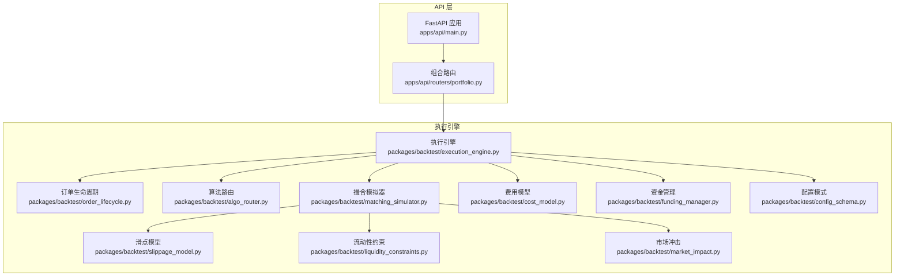
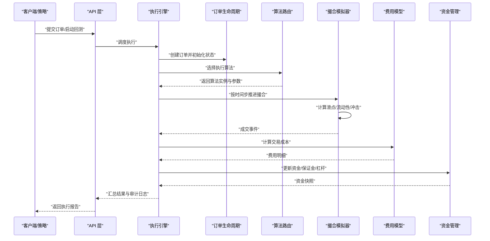
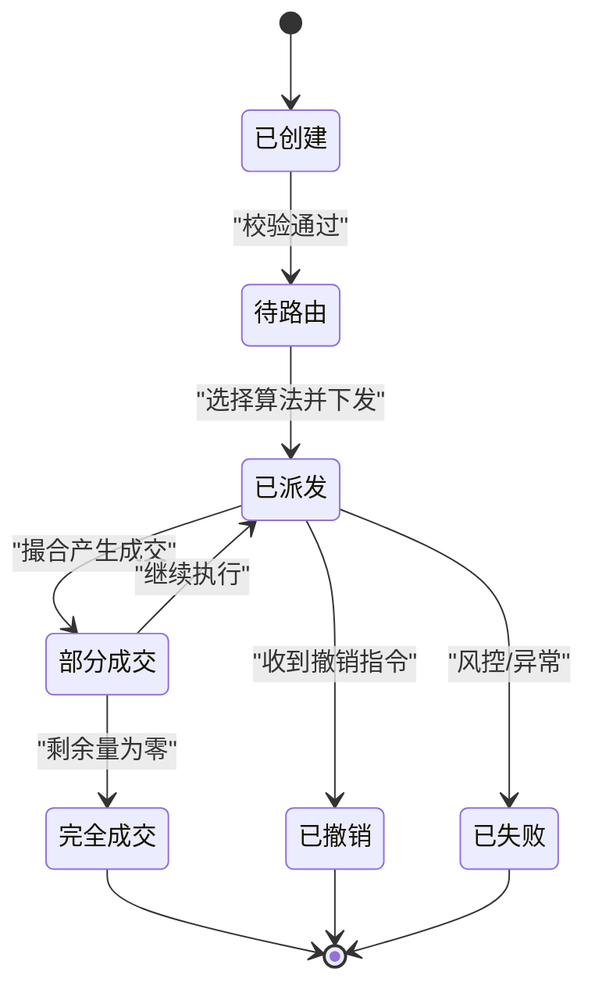
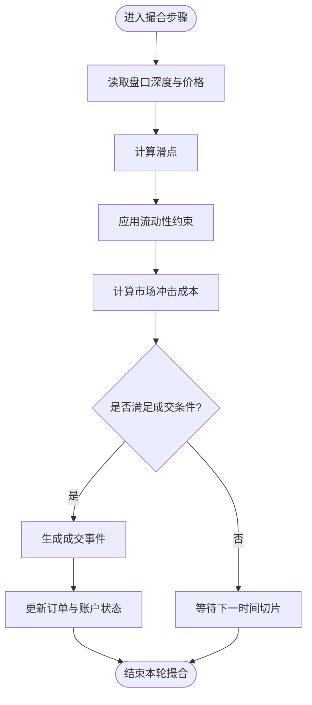
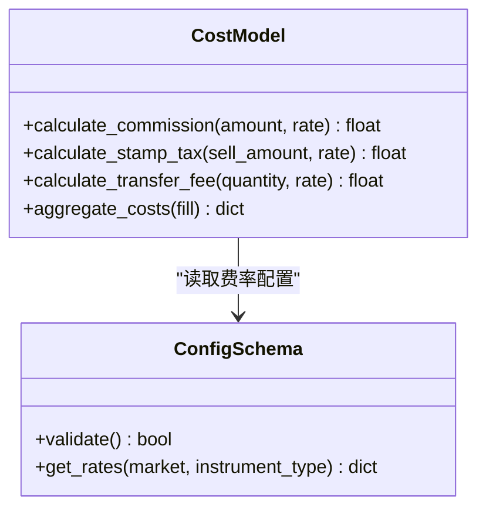
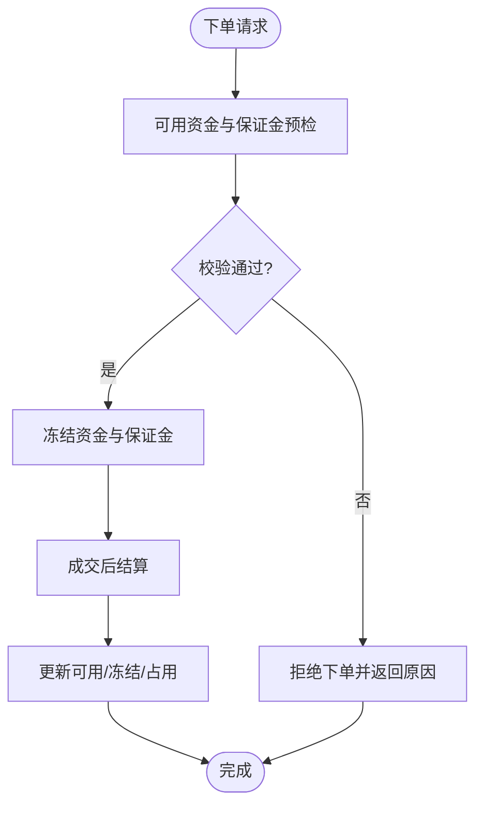
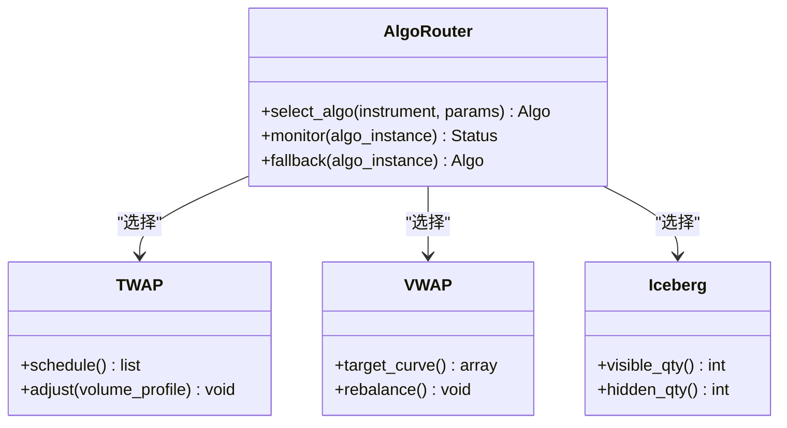
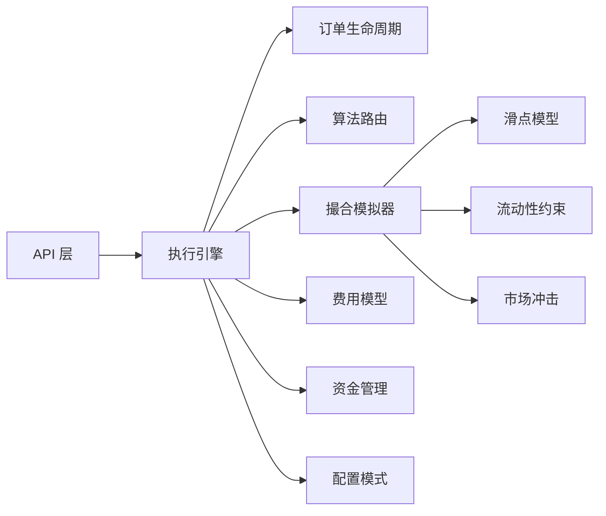

# 执行引擎

<cite>
**本文引用的文件**   
- [apps/api/main.py](file://apps/api/main.py)
- [apps/api/routers/portfolio.py](file://apps/api/routers/portfolio.py)
- [packages/backtest/execution_engine.py](file://packages/backtest/execution_engine.py)
- [packages/backtest/order_lifecycle.py](file://packages/backtest/order_lifecycle.py)
- [packages/backtest/matching_simulator.py](file://packages/backtest/matching_simulator.py)
- [packages/backtest/slippage_model.py](file://packages/backtest/slippage_model.py)
- [packages/backtest/liquidity_constraints.py](file://packages/backtest/liquidity_constraints.py)
- [packages/backtest/market_impact.py](file://packages/backtest/market_impact.py)
- [packages/backtest/cost_model.py](file://packages/backtest/cost_model.py)
- [packages/backtest/funding_manager.py](file://packages/backtest/funding_manager.py)
- [packages/backtest/algo_router.py](file://packages/backtest/algo_router.py)
- [packages/backtest/config_schema.py](file://packages/backtest/config_schema.py)
- [tests/unit/test_execution_models.py](file://tests/unit/test_execution_models.py)
- [tests/unit/test_families_and_routers.py](file://tests/unit/test_families_and_routers.py)
</cite>

## 目录
1. [简介](#简介)
2. [项目结构](#项目结构)
3. [核心组件](#核心组件)
4. [架构总览](#架构总览)
5. [详细组件分析](#详细组件分析)
6. [依赖关系分析](#依赖关系分析)
7. [性能考虑](#性能考虑)
8. [故障排查指南](#故障排查指南)
9. [结论](#结论)
10. [附录](#附录)

## 简介
本文件面向“执行引擎”子系统，围绕订单管理系统与成交模拟机制展开，覆盖订单生命周期、状态转换、订单路由、滑点处理、流动性约束、市场冲击成本计算、费用模型配置（佣金、印花税、过户费等）、资金管理（资金分配、保证金、杠杆）以及执行算法的配置与调优。文档同时提供使用示例与常见问题解决方案，帮助读者快速理解并高效使用该模块。

## 项目结构
执行引擎位于 backtest 包内，采用分层与职责分离的设计：
- 入口与编排：通过 API 层暴露运行接口，内部调用执行引擎进行回测与撮合。
- 订单管理：负责订单创建、状态机流转、路由分发。
- 撮合与模拟：基于市场数据与流动性约束生成成交结果，并计入滑点与市场冲击。
- 费用与资金：统一计算交易成本与账户资金变化，支持保证金与杠杆。
- 算法路由：根据标的特性与策略意图选择最优执行算法。

图表来源
- [apps/api/main.py](file://apps/api/main.py)
- [apps/api/routers/portfolio.py](file://apps/api/routers/portfolio.py)
- [packages/backtest/execution_engine.py](file://packages/backtest/execution_engine.py)
- [packages/backtest/order_lifecycle.py](file://packages/backtest/order_lifecycle.py)
- [packages/backtest/algo_router.py](file://packages/backtest/algo_router.py)
- [packages/backtest/matching_simulator.py](file://packages/backtest/matching_simulator.py)
- [packages/backtest/slippage_model.py](file://packages/backtest/slippage_model.py)
- [packages/backtest/liquidity_constraints.py](file://packages/backtest/liquidity_constraints.py)
- [packages/backtest/market_impact.py](file://packages/backtest/market_impact.py)
- [packages/backtest/cost_model.py](file://packages/backtest/cost_model.py)
- [packages/backtest/funding_manager.py](file://packages/backtest/funding_manager.py)
- [packages/backtest/config_schema.py](file://packages/backtest/config_schema.py)

章节来源
- [apps/api/main.py](file://apps/api/main.py)
- [apps/api/routers/portfolio.py](file://apps/api/routers/portfolio.py)
- [packages/backtest/execution_engine.py](file://packages/backtest/execution_engine.py)
- [packages/backtest/config_schema.py](file://packages/backtest/config_schema.py)

## 核心组件
- 执行引擎：协调订单生命周期、算法路由、撮合模拟、费用与资金管理，对外提供统一的回测执行接口。
- 订单生命周期：定义订单从创建到完成/撤销/失败的状态机，确保可追踪与幂等。
- 撮合模拟器：依据时间切片与盘口信息生成成交，集成滑点、流动性约束与市场冲击。
- 费用模型：统一计算佣金、印花税、过户费及其他交易成本。
- 资金管理：维护可用资金、冻结资金、保证金占用与杠杆倍数，防止超额下单。
- 算法路由：按标的属性、波动率、流动性与策略目标选择 VWAP/TWAP/冰山/狙击等算法。
- 配置模式：以结构化 Schema 校验执行参数，保证稳定性与可复现性。

章节来源
- [packages/backtest/execution_engine.py](file://packages/backtest/execution_engine.py)
- [packages/backtest/order_lifecycle.py](file://packages/backtest/order_lifecycle.py)
- [packages/backtest/matching_simulator.py](file://packages/backtest/matching_simulator.py)
- [packages/backtest/cost_model.py](file://packages/backtest/cost_model.py)
- [packages/backtest/funding_manager.py](file://packages/backtest/funding_manager.py)
- [packages/backtest/algo_router.py](file://packages/backtest/algo_router.py)
- [packages/backtest/config_schema.py](file://packages/backtest/config_schema.py)

## 架构总览
执行引擎在回测中扮演“中枢”角色：接收来自上层策略或 API 的订单请求，经路由选择执行算法后进入撮合流程；撮合过程中动态评估滑点、流动性与市场冲击，最终由费用模型与资金管理更新账户与持仓。

图表来源
- [apps/api/main.py](file://apps/api/main.py)
- [apps/api/routers/portfolio.py](file://apps/api/routers/portfolio.py)
- [packages/backtest/execution_engine.py](file://packages/backtest/execution_engine.py)
- [packages/backtest/order_lifecycle.py](file://packages/backtest/order_lifecycle.py)
- [packages/backtest/algo_router.py](file://packages/backtest/algo_router.py)
- [packages/backtest/matching_simulator.py](file://packages/backtest/matching_simulator.py)
- [packages/backtest/cost_model.py](file://packages/backtest/cost_model.py)
- [packages/backtest/funding_manager.py](file://packages/backtest/funding_manager.py)

## 详细组件分析

### 订单生命周期与状态转换
- 设计要点
  - 状态机驱动：订单具备明确的生命周期阶段，如已创建、待路由、已派发、部分成交、完全成交、已撤销、已失败等。
  - 幂等与可重放：同一订单 ID 多次提交应产生一致结果，便于审计与回放。
  - 事件溯源：每个状态变更均记录事件，用于回溯与诊断。
- 关键行为
  - 路由前校验：检查标的可用性、交易时段、涨跌停与停牌规则。
  - 路由后派发：将订单交由具体算法实例，跟踪其进度与剩余量。
  - 终止条件：达到目标成交量、超时、风控触发或外部撤销指令。

图表来源
- [packages/backtest/order_lifecycle.py](file://packages/backtest/order_lifecycle.py)

章节来源
- [packages/backtest/order_lifecycle.py](file://packages/backtest/order_lifecycle.py)

### 成交模拟机制（滑点、流动性约束、市场冲击）
- 滑点处理
  - 方向性滑点：买入向上滑点，卖向下滑点，受价差、波动率与订单规模影响。
  - 自适应滑点：根据实时盘口深度与历史成交分布动态调整。
- 流动性约束
  - 盘口容量限制：单笔成交不超过当前档位可成交数量。
  - 时间分片：按分钟/秒级切片逐步消耗盘口，避免瞬时冲击过大。
- 市场冲击成本
  - 线性/非线性冲击函数：随订单规模与相对成交量比例递增。
  - 冲击衰减：长时间跨度的拆单可降低单位冲击成本。

图表来源
- [packages/backtest/matching_simulator.py](file://packages/backtest/matching_simulator.py)
- [packages/backtest/slippage_model.py](file://packages/backtest/slippage_model.py)
- [packages/backtest/liquidity_constraints.py](file://packages/backtest/liquidity_constraints.py)
- [packages/backtest/market_impact.py](file://packages/backtest/market_impact.py)

章节来源
- [packages/backtest/matching_simulator.py](file://packages/backtest/matching_simulator.py)
- [packages/backtest/slippage_model.py](file://packages/backtest/slippage_model.py)
- [packages/backtest/liquidity_constraints.py](file://packages/backtest/liquidity_constraints.py)
- [packages/backtest/market_impact.py](file://packages/backtest/market_impact.py)

### 费用模型配置（佣金、印花税、过户费）
- 费用构成
  - 佣金：按成交金额或固定费率计收，可能包含最低收费。
  - 印花税：按卖出成交金额比例收取（依市场规则）。
  - 过户费：按成交数量或金额计收。
  - 其他：平台费、结算费等。
- 计算方式
  - 逐笔累计：每笔成交即时计算并累加至账户费用项。
  - 税费差异化：不同标的类别（股票/基金/债券）适用不同税率。
- 配置项
  - 费率表：按市场、标的类型、券商等级设置。
  - 阈值与封顶：最低收费、最高收费、阶梯费率。

图表来源
- [packages/backtest/cost_model.py](file://packages/backtest/cost_model.py)
- [packages/backtest/config_schema.py](file://packages/backtest/config_schema.py)

章节来源
- [packages/backtest/cost_model.py](file://packages/backtest/cost_model.py)
- [packages/backtest/config_schema.py](file://packages/backtest/config_schema.py)

### 资金管理（资金分配、保证金、杠杆）
- 功能要点
  - 可用资金：扣除冻结资金与预估费用后的可下单额度。
  - 冻结资金：下单时预占的资金，成交后转为实际占用。
  - 保证金：合约类标的需按比率冻结作为履约保障。
  - 杠杆：允许放大头寸，但需同步提高保证金要求与风险限额。
- 风险控制
  - 超额检测：下单前校验可用资金与保证金覆盖率。
  - 强平触发：当维持保证金低于阈值时发出预警或强制减仓。

图表来源
- [packages/backtest/funding_manager.py](file://packages/backtest/funding_manager.py)

章节来源
- [packages/backtest/funding_manager.py](file://packages/backtest/funding_manager.py)

### 执行算法与路由
- 算法家族
  - 时间加权（TWAP）：均匀拆分订单，降低冲击。
  - 成交量加权（VWAP）：跟随市场成交分布，提升成交质量。
  - 冰山订单：隐藏真实规模，仅显示最小可见量。
  - 狙击/限价优先：在有利价位挂单等待成交。
- 路由策略
  - 基于标的特征：流动性、波动率、涨跌停概率。
  - 基于策略目标：追求速度 vs 追求成本优化。
  - 动态切换：根据盘中表现自动切换算法。

图表来源
- [packages/backtest/algo_router.py](file://packages/backtest/algo_router.py)

章节来源
- [packages/backtest/algo_router.py](file://packages/backtest/algo_router.py)

### 配置模式与校验
- 目的
  - 统一参数入口，避免硬编码。
  - 运行时校验，提前发现非法配置。
- 主要字段
  - 费用参数：佣金率、印花税率、过户费率、最低收费。
  - 滑点参数：基础滑点、波动率系数、规模系数。
  - 流动性参数：盘口深度阈值、最大单次成交占比。
  - 资金参数：初始资金、保证金比率、杠杆上限。
  - 算法参数：TWAP/VWAP 分段数、冰山可见量、狙击价偏移。

章节来源
- [packages/backtest/config_schema.py](file://packages/backtest/config_schema.py)

## 依赖关系分析
- 耦合与内聚
  - 执行引擎对订单生命周期、算法路由、撮合模拟器、费用模型与资金管理存在直接依赖，体现高内聚低耦合的分层设计。
  - 撮合模拟器进一步依赖滑点、流动性约束与市场冲击子模块，形成清晰的职责边界。
- 外部依赖
  - API 层通过 FastAPI 暴露执行接口，供策略或前端调用。
  - 配置模式为所有子模块提供统一参数源，减少分散配置带来的不一致。

图表来源
- [packages/backtest/execution_engine.py](file://packages/backtest/execution_engine.py)
- [packages/backtest/order_lifecycle.py](file://packages/backtest/order_lifecycle.py)
- [packages/backtest/algo_router.py](file://packages/backtest/algo_router.py)
- [packages/backtest/matching_simulator.py](file://packages/backtest/matching_simulator.py)
- [packages/backtest/slippage_model.py](file://packages/backtest/slippage_model.py)
- [packages/backtest/liquidity_constraints.py](file://packages/backtest/liquidity_constraints.py)
- [packages/backtest/market_impact.py](file://packages/backtest/market_impact.py)
- [packages/backtest/cost_model.py](file://packages/backtest/cost_model.py)
- [packages/backtest/funding_manager.py](file://packages/backtest/funding_manager.py)
- [packages/backtest/config_schema.py](file://packages/backtest/config_schema.py)
- [apps/api/main.py](file://apps/api/main.py)

章节来源
- [packages/backtest/execution_engine.py](file://packages/backtest/execution_engine.py)
- [apps/api/main.py](file://apps/api/main.py)

## 性能考虑
- 撮合效率
  - 时间切片粒度：过细会增加计算开销，过粗会降低成交精度，建议根据标的活跃度与回测时长权衡。
  - 盘口缓存：复用历史盘口快照，减少重复解析。
- 算法选择
  - 大单优先使用 VWAP/TWAP，小单可使用限价优先或冰山以降低冲击。
  - 动态切换：在流动性枯竭或波动加剧时切换到保守算法。
- 费用与资金
  - 批量计算：对高频小额成交合并计算费用，减少锁竞争。
  - 保证金预检：下单前快速路径校验，避免昂贵计算。
- 资源利用
  - 并行化：对不同标的独立执行流水线，注意共享状态（账户、盘口）的并发安全。
  - I/O 优化：将审计日志与中间结果异步落盘，避免阻塞主流程。

[本节为通用指导，不直接分析具体文件]

## 故障排查指南
- 常见错误
  - 配置无效：费用或滑点参数超出合理范围导致校验失败。
  - 流动性不足：盘口深度不够导致无法成交或大量延迟。
  - 资金不足：可用资金或保证金覆盖率不足被拒绝。
  - 算法异常：路由选择错误或算法实例初始化失败。
- 定位方法
  - 查看订单事件流：确认状态转换是否符合预期。
  - 检查撮合日志：核对滑点、冲击与成交量的计算过程。
  - 审查费用明细：逐项比对费率与计算结果。
  - 监控资金快照：对比冻结与占用变化，定位超额或强平触发点。
- 修复建议
  - 调整参数：放宽滑点或冲击系数，增加盘口深度阈值。
  - 优化算法：切换更稳健的执行策略或增加分段数。
  - 强化风控：收紧杠杆与保证金比率，增加前置校验。

章节来源
- [tests/unit/test_execution_models.py](file://tests/unit/test_execution_models.py)
- [tests/unit/test_families_and_routers.py](file://tests/unit/test_families_and_routers.py)

## 结论
执行引擎通过清晰的分层与职责划分，实现了订单管理、撮合模拟、费用与资金管理的闭环。借助灵活的算法路由与严格的配置校验，系统能够在不同市场环境下保持稳定的执行质量与可追溯性。结合性能优化与故障排查实践，可有效提升回测与实盘的可靠性与效率。

[本节为总结性内容，不直接分析具体文件]

## 附录
- 使用示例
  - 通过 API 提交订单并启动回测，观察订单状态与成交明细。
  - 修改费用与滑点参数，验证对净收益的影响。
  - 切换执行算法，比较不同策略下的冲击与成交质量。
- 最佳实践
  - 先小单试运行，再逐步放大规模。
  - 定期校准费用与滑点参数，贴近真实市场。
  - 建立监控与告警，及时发现异常与瓶颈。

[本节为概念性内容，不直接分析具体文件]