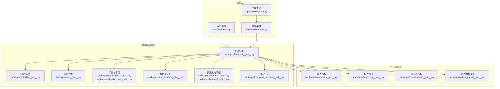
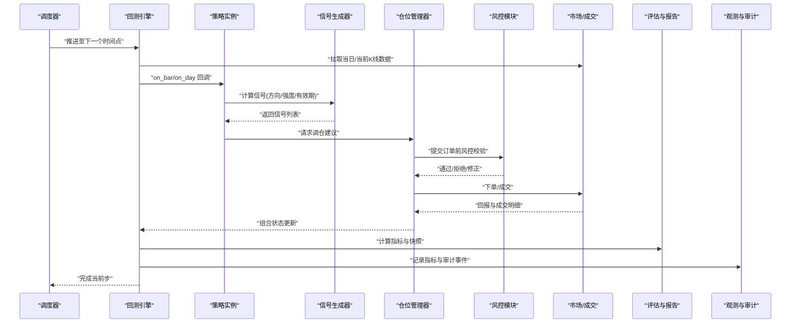
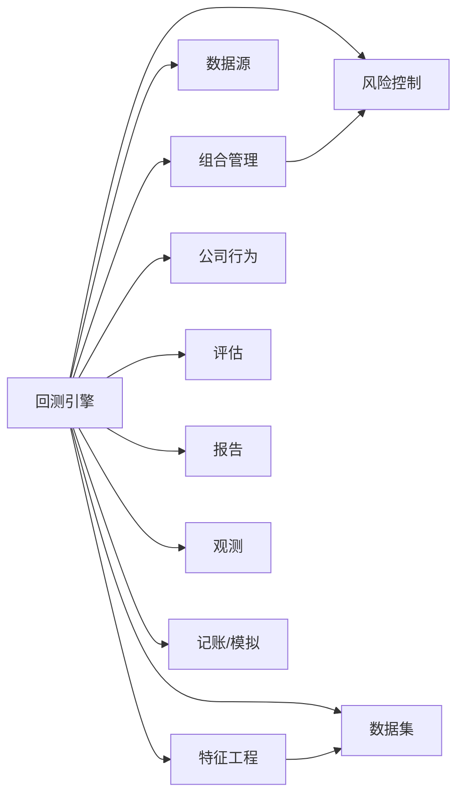

# 策略框架

<cite>
**本文引用的文件**   
- [README.md](file://README.md)
- [pyproject.toml](file://pyproject.toml)
- [apps/api/main.py](file://apps/api/main.py)
- [apps/api/deps.py](file://apps/api/deps.py)
- [apps/worker/main.py](file://apps/worker/main.py)
- [apps/worker/tasks.py](file://apps/worker/tasks.py)
- [packages/backtest/__init__.py](file://packages/backtest/__init__.py)
- [packages/portfolio/__init__.py](file://packages/portfolio/__init__.py)
- [packages/risk/__init__.py](file://packages/risk/__init__.py)
- [packages/instruments/__init__.py](file://packages/instruments/__init__.py)
- [packages/datasets/__init__.py](file://packages/datasets/__init__.py)
- [packages/features/__init__.py](file://packages/features/__init__.py)
- [packages/evaluation/__init__.py](file://packages/evaluation/__init__.py)
- [packages/reporting/__init__.py](file://packages/reporting/__init__.py)
- [packages/observability/__init__.py](file://packages/observability/__init__.py)
- [packages/ledger_paper/__init__.py](file://packages/ledger_paper/__init__.py)
- [packages/corporate_actions/__init__.py](file://packages/corporate_actions/__init__.py)
- [packages/calendar_rule/__init__.py](file://packages/calendar_rule/__init__.py)
- [packages/data_sources/__init__.py](file://packages/data_sources/__init__.py)
- [packages/models/__init__.py](file://packages/models/__init__.py)
- [packages/training/__init__.py](file://packages/training/__init__.py)
- [packages/fundamentals/__init__.py](file://packages/fundamentals/__init__.py)
- [packages/labels/__init__.py](file://packages/labels/__init__.py)
- [packages/drift/__init__.py](file://packages/drift/__init__.py)
- [packages/audit/__init__.py](file://packages/audit/__init__.py)
- [packages/data_quality/__init__.py](file://packages/data_quality/__init__.py)
</cite>

## 目录
1. [简介](#简介)
2. [项目结构](#项目结构)
3. [核心组件](#核心组件)
4. [架构总览](#架构总览)
5. [详细组件分析](#详细组件分析)
6. [依赖关系分析](#依赖关系分析)
7. [性能考虑](#性能考虑)
8. [故障排查指南](#故障排查指南)
9. [结论](#结论)
10. [附录](#附录)

## 简介
本文件面向“策略框架”的文档目标，围绕回测框架的核心架构设计进行系统化说明。重点覆盖：
- 事件驱动的执行模型与生命周期管理
- 策略基类定义、继承与扩展方式
- 信号生成机制、仓位管理与风险控制集成点
- 策略开发模板与最佳实践
- 配置参数、性能优化与调试方法
- 从简单到复杂的策略实现路径（以代码片段路径指引为主）

本项目采用多包分层组织，将数据、因子、组合、风险、评估、报告等能力解耦为独立模块，并通过API与Worker提供可编排的回测与推理流水线入口。

## 项目结构
仓库采用应用层与包层分离的组织方式：
- apps：对外暴露的服务与任务执行入口（API、Worker、调度器）
- packages：领域能力包集合（backtest、portfolio、risk、instruments、datasets、features、evaluation、reporting、observability、ledger_paper、corporate_actions、calendar_rule、data_sources、models、training、fundamentals、labels、drift、audit、data_quality 等）
- configs：配置中心（基础与开发环境）
- scripts：工具脚本
- tests：单元测试与集成测试
- sql/migrations：数据库迁移

图表来源
- [apps/api/main.py](file://apps/api/main.py)
- [apps/worker/main.py](file://apps/worker/main.py)
- [apps/worker/tasks.py](file://apps/worker/tasks.py)
- [packages/backtest/__init__.py](file://packages/backtest/__init__.py)
- [packages/portfolio/__init__.py](file://packages/portfolio/__init__.py)
- [packages/risk/__init__.py](file://packages/risk/__init__.py)
- [packages/instruments/__init__.py](file://packages/instruments/__init__.py)
- [packages/calendar_rule/__init__.py](file://packages/calendar_rule/__init__.py)
- [packages/data_sources/__init__.py](file://packages/data_sources/__init__.py)
- [packages/datasets/__init__.py](file://packages/datasets/__init__.py)
- [packages/features/__init__.py](file://packages/features/__init__.py)
- [packages/corporate_actions/__init__.py](file://packages/corporate_actions/__init__.py)
- [packages/evaluation/__init__.py](file://packages/evaluation/__init__.py)
- [packages/reporting/__init__.py](file://packages/reporting/__init__.py)
- [packages/observability/__init__.py](file://packages/observability/__init__.py)
- [packages/ledger_paper/__init__.py](file://packages/ledger_paper/__init__.py)

章节来源
- [README.md](file://README.md)
- [pyproject.toml](file://pyproject.toml)

## 核心组件
- 回测引擎（Backtest）：负责事件循环、时间步进、订单路由、成交撮合、状态更新与日志记录。
- 策略基类（Strategy Base）：定义策略生命周期钩子（初始化、每日/每根K线处理、收盘后处理、资源释放），并提供统一的上下文访问接口（市场数据、组合状态、风控规则、观测指标）。
- 信号生成（Signal Generator）：基于特征与模型输出产生交易信号（方向、强度、有效期等）。
- 仓位管理（Portfolio Manager）：将信号转换为头寸或订单，支持目标权重、调仓幅度限制、滑点与手续费建模。
- 风险控制（Risk Control）：在订单提交前后进行合规检查（集中度、止损、波动率、杠杆上限等），并可拦截或修正订单。
- 数据与特征（Data & Features）：统一的数据接入与清洗、复权与公司行为处理、特征工程管线。
- 评估与报告（Evaluation & Reporting）：计算收益曲线、回撤、夏普、换手率等指标，并输出结构化报告。
- 观测与记账（Observability & Ledger/Paper）：指标采集、审计追踪、模拟交易账本与流水。

章节来源
- [packages/backtest/__init__.py](file://packages/backtest/__init__.py)
- [packages/portfolio/__init__.py](file://packages/portfolio/__init__.py)
- [packages/risk/__init__.py](file://packages/risk/__init__.py)
- [packages/datasets/__init__.py](file://packages/datasets/__init__.py)
- [packages/features/__init__.py](file://packages/features/__init__.py)
- [packages/evaluation/__init__.py](file://packages/evaluation/__init__.py)
- [packages/reporting/__init__.py](file://packages/reporting/__init__.py)
- [packages/observability/__init__.py](file://packages/observability/__init__.py)
- [packages/ledger_paper/__init__.py](file://packages/ledger_paper/__init__.py)
- [packages/corporate_actions/__init__.py](file://packages/corporate_actions/__init__.py)
- [packages/calendar_rule/__init__.py](file://packages/calendar_rule/__init__.py)
- [packages/data_sources/__init__.py](file://packages/data_sources/__init__.py)

## 架构总览
下图展示事件驱动的回测主流程：调度器按时间推进，依次触发数据加载、策略计算、信号生成、风控校验、订单执行与组合更新，并在每个阶段写入观测与审计信息。

图表来源
- [apps/api/main.py](file://apps/api/main.py)
- [apps/worker/main.py](file://apps/worker/main.py)
- [apps/worker/tasks.py](file://apps/worker/tasks.py)
- [packages/backtest/__init__.py](file://packages/backtest/__init__.py)
- [packages/portfolio/__init__.py](file://packages/portfolio/__init__.py)
- [packages/risk/__init__.py](file://packages/risk/__init__.py)
- [packages/evaluation/__init__.py](file://packages/evaluation/__init__.py)
- [packages/reporting/__init__.py](file://packages/reporting/__init__.py)
- [packages/observability/__init__.py](file://packages/observability/__init__.py)

## 详细组件分析

### 事件驱动执行模型与生命周期
- 事件类型：开盘、盘中Bar/Tick、收盘、日终结算、系统启动/关闭。
- 生命周期钩子：
  - on_init：加载配置、初始化数据源、构建特征管线、注册风控规则。
  - on_bar/on_tick：逐条数据处理，生成信号与调仓建议。
  - on_close：汇总当日结果、触发风控复盘、更新组合快照。
  - on_shutdown：释放资源、持久化中间结果。
- 控制流：由调度器驱动，回测引擎维护全局时钟与事件队列，确保确定性回放。

章节来源
- [packages/backtest/__init__.py](file://packages/backtest/__init__.py)
- [packages/calendar_rule/__init__.py](file://packages/calendar_rule/__init__.py)

### 策略基类与扩展方式
- 基类职责：
  - 提供统一的上下文对象（市场数据、组合状态、风控接口、观测指标）。
  - 暴露生命周期钩子供子类重写。
  - 封装信号与订单的标准化数据结构。
- 扩展步骤：
  - 继承基类并重写必要钩子。
  - 在 on_init 中注册数据源与特征计算逻辑。
  - 在 on_bar/on_day 中实现信号与仓位调整逻辑。
  - 在 on_close 中进行复盘与日志记录。
- 推荐模式：
  - 将信号生成与仓位管理解耦，便于单独测试与替换。
  - 使用配置对象注入策略参数，避免硬编码。

章节来源
- [packages/backtest/__init__.py](file://packages/backtest/__init__.py)
- [packages/features/__init__.py](file://packages/features/__init__.py)
- [packages/datasets/__init__.py](file://packages/datasets/__init__.py)

### 信号生成机制
- 输入：标准化后的特征序列、模型预测、宏观/基本面因子。
- 输出：信号元组（标的、方向、强度、有效期、优先级）。
- 关键要点：
  - 去噪与平滑：滑动窗口、阈值过滤、趋势确认。
  - 失效与退出：时间衰减、反向信号、止损止盈。
  - 可观测性：对信号分布、命中率、延迟进行监控。

章节来源
- [packages/features/__init__.py](file://packages/features/__init__.py)
- [packages/datasets/__init__.py](file://packages/datasets/__init__.py)
- [packages/observability/__init__.py](file://packages/observability/__init__.py)

### 仓位管理与订单路由
- 功能：
  - 将信号映射为目标权重或手数。
  - 考虑调仓成本、流动性约束、涨跌停与停牌。
  - 拆单与滑点建模。
- 与风控集成：
  - 提交前校验：集中度、杠杆、单笔限额、行业暴露。
  - 提交后复核：成交偏差、异常成交处理。

章节来源
- [packages/portfolio/__init__.py](file://packages/portfolio/__init__.py)
- [packages/risk/__init__.py](file://packages/risk/__init__.py)
- [packages/corporate_actions/__init__.py](file://packages/corporate_actions/__init__.py)

### 风险控制集成点
- 规则类型：
  - 事前：头寸上限、行业/风格暴露、波动率预算、杠杆限制。
  - 事中：实时止损、最大回撤熔断、异常波动暂停。
  - 事后：复盘归因、违规记录与告警。
- 集成方式：
  - 作为订单路由的拦截器与修正器。
  - 与组合快照联动，动态调整可用额度。

章节来源
- [packages/risk/__init__.py](file://packages/risk/__init__.py)
- [packages/portfolio/__init__.py](file://packages/portfolio/__init__.py)

### 数据、特征与公司行为
- 数据接入：统一适配器抽象，屏蔽不同数据源差异。
- 特征工程：时序对齐、缺失值处理、标准化、滚动统计。
- 公司行为：除权除息、送转股、分红再投资、停牌与复牌。

章节来源
- [packages/data_sources/__init__.py](file://packages/data_sources/__init__.py)
- [packages/datasets/__init__.py](file://packages/datasets/__init__.py)
- [packages/features/__init__.py](file://packages/features/__init__.py)
- [packages/corporate_actions/__init__.py](file://packages/corporate_actions/__init__.py)

### 评估、报告与观测
- 评估指标：收益、回撤、夏普、Sortino、Calmar、换手率、胜率、盈亏比。
- 报告输出：结构化JSON/CSV、可视化图表、对比基准。
- 观测与审计：指标采集、事件溯源、错误追踪、性能剖析。

章节来源
- [packages/evaluation/__init__.py](file://packages/evaluation/__init__.py)
- [packages/reporting/__init__.py](file://packages/reporting/__init__.py)
- [packages/observability/__init__.py](file://packages/observability/__init__.py)
- [packages/audit/__init__.py](file://packages/audit/__init__.py)

### 记账与模拟交易
- 功能：记录委托、成交、持仓、资金流水；支持多账户与多币种。
- 用途：与真实交易对接前的端到端验证与压力测试。

章节来源
- [packages/ledger_paper/__init__.py](file://packages/ledger_paper/__init__.py)

### 策略开发模板与最佳实践
- 模板结构：
  - 配置段：参数、数据源、风控阈值、观测开关。
  - 策略类：继承基类，实现 on_init/on_bar/on_close。
  - 信号模块：纯函数式，易于单元测试。
  - 仓位模块：可插拔，支持多种调仓算法。
  - 风控模块：规则清单化，支持热更新。
- 最佳实践：
  - 参数外置与版本化管理。
  - 信号与执行解耦，避免耦合副作用。
  - 全链路可观测，关键路径埋点。
  - 回归测试与金标准用例。

章节来源
- [packages/backtest/__init__.py](file://packages/backtest/__init__.py)
- [packages/features/__init__.py](file://packages/features/__init__.py)
- [packages/portfolio/__init__.py](file://packages/portfolio/__init__.py)
- [packages/risk/__init__.py](file://packages/risk/__init__.py)
- [packages/observability/__init__.py](file://packages/observability/__init__.py)

### 实际示例路径（从简单到复杂）
- 简单均线策略：
  - 参考路径：[packages/backtest/__init__.py](file://packages/backtest/__init__.py)、[packages/features/__init__.py](file://packages/features/__init__.py)
- 多因子选股+风控：
  - 参考路径：[packages/features/__init__.py](file://packages/features/__init__.py)、[packages/risk/__init__.py](file://packages/risk/__init__.py)、[packages/portfolio/__init__.py](file://packages/portfolio/__init__.py)
- 高频日内策略（Tick级）：
  - 参考路径：[packages/backtest/__init__.py](file://packages/backtest/__init__.py)、[packages/ledger_paper/__init__.py](file://packages/ledger_paper/__init__.py)
- 跨品种配对交易：
  - 参考路径：[packages/datasets/__init__.py](file://packages/datasets/__init__.py)、[packages/evaluation/__init__.py](file://packages/evaluation/__init__.py)

## 依赖关系分析
- 内聚与耦合：
  - backtest 作为编排核心，依赖 portfolio、risk、data_sources、datasets、features、corporate_actions、evaluation、reporting、observability、ledger_paper。
  - risk 与 portfolio 双向协作（订单前置校验与组合状态反馈）。
  - features 与 datasets 紧密耦合，共同支撑信号生成。
- 外部集成点：
  - data_sources 对接外部数据源。
  - observability 对接指标与日志系统。
  - reporting 对接存储与可视化后端。

图表来源
- [packages/backtest/__init__.py](file://packages/backtest/__init__.py)
- [packages/portfolio/__init__.py](file://packages/portfolio/__init__.py)
- [packages/risk/__init__.py](file://packages/risk/__init__.py)
- [packages/data_sources/__init__.py](file://packages/data_sources/__init__.py)
- [packages/datasets/__init__.py](file://packages/datasets/__init__.py)
- [packages/features/__init__.py](file://packages/features/__init__.py)
- [packages/corporate_actions/__init__.py](file://packages/corporate_actions/__init__.py)
- [packages/evaluation/__init__.py](file://packages/evaluation/__init__.py)
- [packages/reporting/__init__.py](file://packages/reporting/__init__.py)
- [packages/observability/__init__.py](file://packages/observability/__init__.py)
- [packages/ledger_paper/__init__.py](file://packages/ledger_paper/__init__.py)

章节来源
- [packages/backtest/__init__.py](file://packages/backtest/__init__.py)
- [packages/portfolio/__init__.py](file://packages/portfolio/__init__.py)
- [packages/risk/__init__.py](file://packages/risk/__init__.py)
- [packages/data_sources/__init__.py](file://packages/data_sources/__init__.py)
- [packages/datasets/__init__.py](file://packages/datasets/__init__.py)
- [packages/features/__init__.py](file://packages/features/__init__.py)
- [packages/corporate_actions/__init__.py](file://packages/corporate_actions/__init__.py)
- [packages/evaluation/__init__.py](file://packages/evaluation/__init__.py)
- [packages/reporting/__init__.py](file://packages/reporting/__init__.py)
- [packages/observability/__init__.py](file://packages/observability/__init__.py)
- [packages/ledger_paper/__init__.py](file://packages/ledger_paper/__init__.py)

## 性能考虑
- 数据读取：批量预取、列式存储、按需加载、缓存热点数据。
- 特征计算：向量化运算、增量更新、懒加载与分块处理。
- 事件循环：减少锁竞争、异步I/O、批处理订单合并。
- 内存管理：对象池、零拷贝视图、及时释放中间结果。
- 并行化：因子计算与评估可并行，注意随机种子与顺序一致性。
- I/O与序列化：压缩传输、增量落盘、断点续跑。

## 故障排查指南
- 常见问题定位：
  - 数据缺失或对齐失败：检查数据源适配器与日历规则。
  - 信号异常：查看特征分布与阈值设置，启用观测指标。
  - 风控拦截：核对规则阈值与组合快照一致性。
  - 成交偏差：检查滑点与手续费模型、涨跌停与停牌处理。
- 调试手段：
  - 开启详细日志与审计事件。
  - 使用最小数据集与单标的回归用例。
  - 逐步注释策略逻辑，二分法定位问题。
  - 导出中间快照与指标，对比基线。

章节来源
- [packages/observability/__init__.py](file://packages/observability/__init__.py)
- [packages/audit/__init__.py](file://packages/audit/__init__.py)
- [packages/data_quality/__init__.py](file://packages/data_quality/__init__.py)

## 结论
本策略框架以事件驱动为核心，通过清晰的模块化设计与可扩展的策略基类，实现了从信号生成到风控与执行的完整闭环。借助统一的观测与审计能力，开发者可以快速迭代策略并进行严谨的评估与回归。建议在开发过程中坚持参数外置、信号与执行解耦、全链路可观测的原则，以获得更高的稳定性与可维护性。

## 附录
- 配置项建议：
  - 数据源：连接参数、认证、重试与超时。
  - 策略：参数文件、版本标签、依赖特征清单。
  - 风控：规则清单、阈值、豁免名单。
  - 观测：采样频率、保留周期、告警通道。
- 部署与运行：
  - API 服务用于发起回测任务与查询结果。
  - Worker 进程负责执行耗时任务与批处理。
  - 调度器统一管理任务队列与重试策略。

章节来源
- [apps/api/main.py](file://apps/api/main.py)
- [apps/worker/main.py](file://apps/worker/main.py)
- [apps/worker/tasks.py](file://apps/worker/tasks.py)