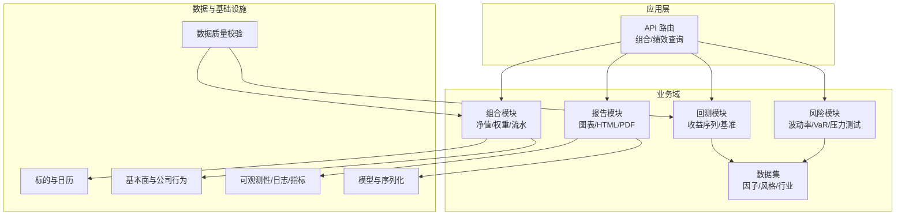
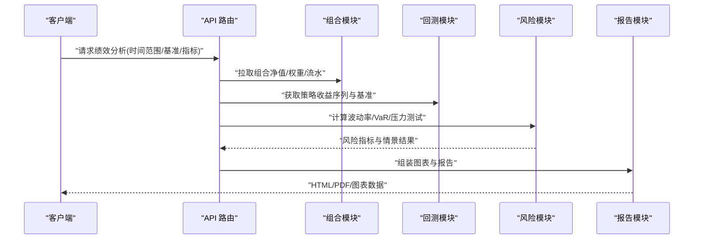
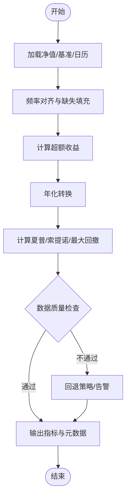
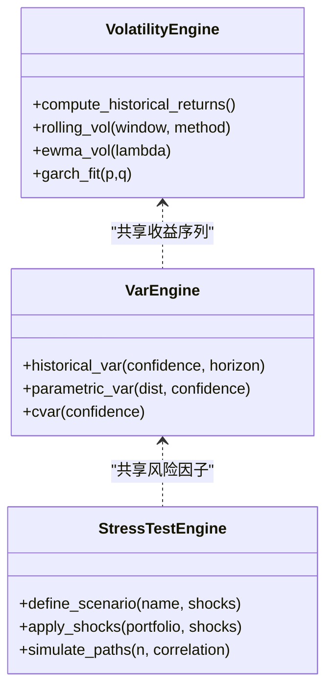
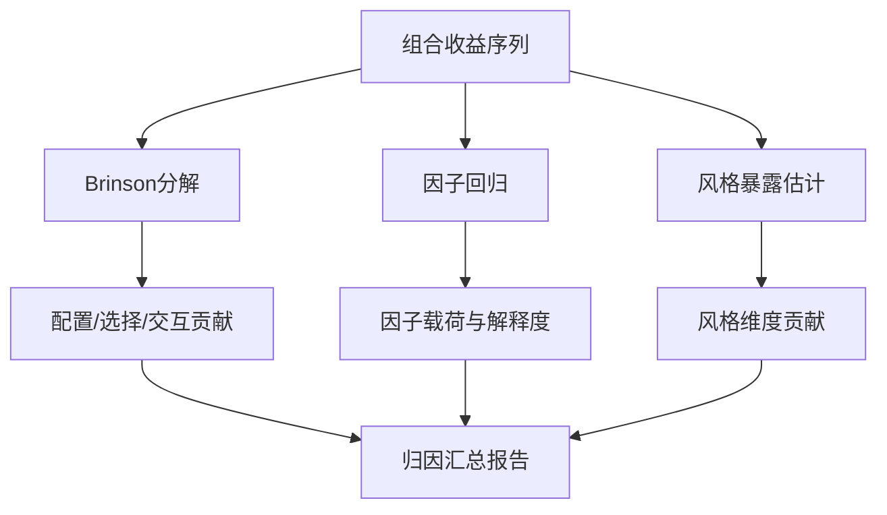
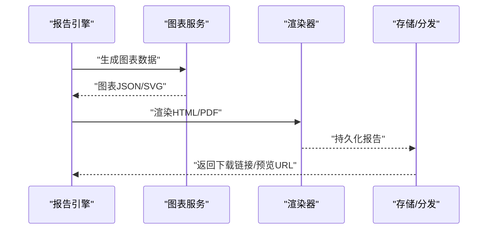
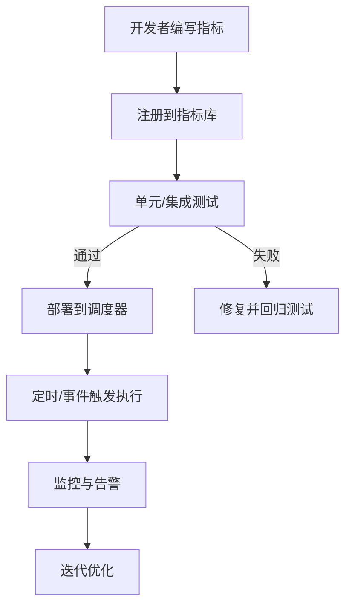
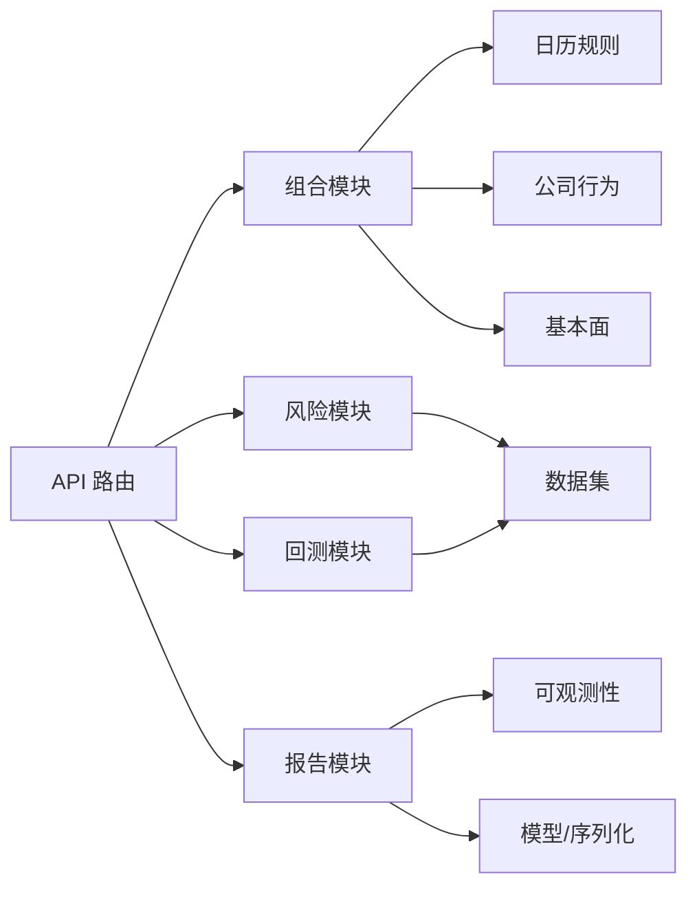

# 绩效分析

<cite>
**本文引用的文件**   
- [apps/api/routers/portfolio.py](file://apps/api/routers/portfolio.py)
- [packages/reporting/](file://packages/reporting/)
- [packages/risk/](file://packages/risk/)
- [packages/portfolio/](file://packages/portfolio/)
- [packages/backtest/](file://packages/backtest/)
- [packages/datasets/](file://packages/datasets/)
- [packages/instrument/](file://packages/instrument/)
- [packages/fundamentals/](file://packages/fundamentals/)
- [packages/corporate_actions/](file://packages/corporate_actions/)
- [packages/data_quality/](file://packages/data_quality/)
- [packages/observability/](file://packages/observability/)
- [packages/models/](file://packages/models/)
- [packages/evaluation/](file://packages/evaluation/)
- [packages/features/](file://packages/features/)
- [packages/labels/](file://packages/labels/)
- [packages/training/](file://packages/training/)
- [packages/ledger_paper/](file://packages/ledger_paper/)
- [packages/calendar_rule/](file://packages/calendar_rule/)
- [packages/ingestion/](file://packages/ingestion/)
- [packages/data_sources/](file://packages/data_sources/)
- [packages/drift/](file://packages/drift/)
- [sql/migrations/20260715_0006_fund_fx_portfolio.py](file://sql/migrations/20260715_0006_fund_fx_portfolio.py)
</cite>

## 目录
1. [简介](#简介)
2. [项目结构](#项目结构)
3. [核心组件](#核心组件)
4. [架构总览](#架构总览)
5. [详细组件分析](#详细组件分析)
6. [依赖关系分析](#依赖关系分析)
7. [性能考量](#性能考量)
8. [故障排查指南](#故障排查指南)
9. [结论](#结论)
10. [附录](#附录)

## 简介
本文件面向“绩效分析”能力，围绕收益统计指标、风险度量、归因分析、报告生成与自定义指标扩展进行系统化说明。目标读者包括量化研究员、投研工程师与产品使用者，既提供高层架构概览，也给出可落地的实现要点与排障建议。

## 项目结构
本项目采用多包（packages）分层组织，API层通过FastAPI路由暴露服务；数据与模型位于独立包中；风险、回测、报告等能力以模块化方式集成。与绩效分析直接相关的目录包括：
- API路由：组合与绩效查询入口
- 报告：HTML/PDF导出与可视化
- 风险：波动率、VaR、压力测试等
- 组合：净值、权重、交易流水聚合
- 回测：策略收益序列与基准对齐
- 数据集：因子、风格、行业暴露等
- 基础数据：公司行为、基本面、日历规则等

图示来源
- [apps/api/routers/portfolio.py](file://apps/api/routers/portfolio.py)
- [packages/reporting/](file://packages/reporting/)
- [packages/risk/](file://packages/risk/)
- [packages/portfolio/](file://packages/portfolio/)
- [packages/backtest/](file://packages/backtest/)
- [packages/datasets/](file://packages/datasets/)
- [packages/instrument/](file://packages/instrument/)
- [packages/fundamentals/](file://packages/fundamentals/)
- [packages/corporate_actions/](file://packages/corporate_actions/)
- [packages/data_quality/](file://packages/data_quality/)
- [packages/observability/](file://packages/observability/)
- [packages/models/](file://packages/models/)

章节来源
- [apps/api/routers/portfolio.py](file://apps/api/routers/portfolio.py)
- [sql/migrations/20260715_0006_fund_fx_portfolio.py](file://sql/migrations/20260715_0006_fund_fx_portfolio.py)

## 核心组件
- 收益统计指标
  - 年化收益率：基于复利几何平均或算术平均的年化转换，需考虑交易日日历与复权处理。
  - 夏普比率：超额收益均值除以超额收益标准差，注意无风险利率曲线与频率对齐。
  - 最大回撤：累计净值相对历史峰值的最大跌幅，用于衡量尾部风险。
  - 索提诺比率：仅对下行波动惩罚，使用下行标准差替代全波动率。
- 风险评估工具
  - 波动率分析：日频/周频/月频滚动窗口计算，含参数选择与稳健估计。
  - VaR计算：历史模拟法、参数法（正态/学生t）、条件风险价值（CVaR）。
  - 压力测试：情景定义、冲击矩阵、跨资产传导与流动性约束。
- 归因分析
  - Brinson归因：配置/择时/交互效应分解至行业与个股层面。
  - 因子归因：多因子模型解释收益来源，含因子暴露与因子收益回归。
  - 风格归因：规模、价值、动量等风格维度贡献度评估。
- 报告生成机制
  - 可视化图表：净值曲线、回撤图、收益分布、因子暴露热力图。
  - HTML报告：模板渲染、交互式图表、版本与数据来源标注。
  - PDF导出：矢量图嵌入、分页布局、水印与签名。
- 自定义指标开发
  - 指标接口规范：输入输出约定、频率对齐、缺失值处理、可复现性。
  - 注册与调度：指标注册表、批处理任务编排、增量更新。
  - 集成验证：单元测试、金样本对比、漂移检测。

章节来源
- [packages/risk/](file://packages/risk/)
- [packages/backtest/](file://packages/backtest/)
- [packages/datasets/](file://packages/datasets/)
- [packages/reporting/](file://packages/reporting/)
- [packages/portfolio/](file://packages/portfolio/)

## 架构总览
绩效分析从组合与回测模块获取时序数据，经风险与归因引擎加工后，由报告模块统一输出。API路由作为对外入口，负责参数校验、任务调度与结果封装。

图示来源
- [apps/api/routers/portfolio.py](file://apps/api/routers/portfolio.py)
- [packages/reporting/](file://packages/reporting/)
- [packages/risk/](file://packages/risk/)
- [packages/backtest/](file://packages/backtest/)
- [packages/portfolio/](file://packages/portfolio/)

## 详细组件分析

### 收益统计指标
- 年化收益率
  - 输入：日频净值序列、交易日日历、复权价格。
  - 处理：剔除停牌/异常点，按交易日对齐，几何平均转年化。
  - 输出：年度化收益率及置信区间。
- 夏普比率
  - 输入：超额收益序列、无风险利率曲线。
  - 处理：频率对齐、滚动窗口、极端值缩尾。
  - 输出：年化夏普比率与分位数。
- 最大回撤
  - 输入：累计净值序列。
  - 处理：峰值追踪、回撤期识别、恢复时间统计。
  - 输出：最大回撤幅度、持续时间、恢复时长。
- 索提诺比率
  - 输入：下行收益序列。
  - 处理：阈值设定（如零或目标收益）、下行波动估计。
  - 输出：年化索提诺比率。

章节来源
- [packages/backtest/](file://packages/backtest/)
- [packages/portfolio/](file://packages/portfolio/)
- [packages/data_quality/](file://packages/data_quality/)

### 风险评估工具
- 波动率分析
  - 方法：历史波动率、EWMA/GARCH族、已实现波动率（如有高频）。
  - 输出：滚动波动率曲线、波动率期限结构、波动率聚类特征。
- VaR计算
  - 方法：历史模拟、参数法（正态/学生t）、蒙特卡洛。
  - 输出：日/周/月VaR、CVaR、分位数路径。
- 压力测试
  - 情景：宏观冲击、市场崩盘、流动性枯竭、汇率跳变。
  - 输出：组合损益分布、关键驱动因子、敏感性排序。

图示来源
- [packages/risk/](file://packages/risk/)
- [packages/datasets/](file://packages/datasets/)

章节来源
- [packages/risk/](file://packages/risk/)
- [packages/datasets/](file://packages/datasets/)

### 归因分析方法
- Brinson归因
  - 分解：资产配置效应、个股选择效应、交互效应。
  - 粒度：行业/风格/区域多层级。
  - 输出：各层级贡献度与累计偏差。
- 因子归因
  - 模型：多因子线性回归、正则化、动态因子暴露。
  - 输出：因子载荷、因子收益解释度、残差分析。
- 风格归因
  - 维度：规模、价值、动量、质量、低波等。
  - 输出：风格暴露轨迹、风格轮动信号、稳定性评估。

章节来源
- [packages/datasets/](file://packages/datasets/)
- [packages/backtest/](file://packages/backtest/)

### 报告生成机制
- 可视化图表
  - 类型：净值曲线、回撤图、收益分布直方图、因子暴露热力图、压力情景瀑布图。
  - 交互：缩放、筛选、下钻到行业/个股。
- HTML报告
  - 模板：标题、摘要、关键指标、图表、附录（数据来源、方法论、免责声明）。
  - 版本：时间戳、策略版本、基准版本、数据快照哈希。
- PDF导出
  - 布局：A4/A3自适应、页眉页脚、图表矢量嵌入。
  - 安全：水印、数字签名、访问控制。

图示来源
- [packages/reporting/](file://packages/reporting/)
- [packages/observability/](file://packages/observability/)

章节来源
- [packages/reporting/](file://packages/reporting/)
- [packages/observability/](file://packages/observability/)

### 自定义指标开发与集成
- 指标接口规范
  - 输入：标准化时序对象（日期索引、数值列、元数据）。
  - 输出：结构化指标字典（名称、值、单位、置信区间、备注）。
  - 约束：幂等、可复现、内存友好、支持增量更新。
- 注册与调度
  - 注册表：按类别分组（收益/风险/归因），支持版本兼容。
  - 调度：批处理任务、依赖解析、失败重试与补偿。
- 集成验证
  - 单元测试：边界条件、缺失值、极端行情。
  - 金样本：固定随机种子、确定性输出。
  - 漂移检测：指标分布变化监控与告警。

章节来源
- [packages/evaluation/](file://packages/evaluation/)
- [packages/features/](file://packages/features/)
- [packages/labels/](file://packages/labels/)
- [packages/training/](file://packages/training/)

### 实际分析案例与结果解读
- 案例一：单策略月度绩效
  - 步骤：拉取净值与基准、计算年化收益/夏普/最大回撤/索提诺、生成HTML报告。
  - 解读：关注超额收益稳定性、回撤深度与恢复速度、下行风险是否可控。
- 案例二：多因子归因
  - 步骤：构建因子暴露矩阵、回归解释收益、输出因子贡献排名。
  - 解读：识别主要收益来源与风格暴露漂移，评估因子有效性。
- 案例三：压力测试
  - 步骤：定义情景冲击、应用至组合、输出损益分布与敏感因子。
  - 解读：定位脆弱环节、制定对冲与仓位调整方案。

章节来源
- [packages/backtest/](file://packages/backtest/)
- [packages/risk/](file://packages/risk/)
- [packages/reporting/](file://packages/reporting/)

## 依赖关系分析
- 组件耦合
  - API路由依赖组合与回测模块，风险与报告为横向支撑。
  - 风险模块依赖数据集（因子/风格/行业），并与回测共享收益序列。
  - 报告模块依赖可观测性与模型序列化，确保可追溯与一致性。
- 外部依赖
  - 数据库迁移定义组合与外汇相关字段，影响组合净值与汇率调整。
  - 数据质量与日历规则保障时序完整性与对齐。

图示来源
- [apps/api/routers/portfolio.py](file://apps/api/routers/portfolio.py)
- [packages/risk/](file://packages/risk/)
- [packages/backtest/](file://packages/backtest/)
- [packages/reporting/](file://packages/reporting/)
- [packages/datasets/](file://packages/datasets/)
- [packages/calendar_rule/](file://packages/calendar_rule/)
- [packages/corporate_actions/](file://packages/corporate_actions/)
- [packages/fundamentals/](file://packages/fundamentals/)
- [packages/observability/](file://packages/observability/)
- [packages/models/](file://packages/models/)

章节来源
- [apps/api/routers/portfolio.py](file://apps/api/routers/portfolio.py)
- [sql/migrations/20260715_0006_fund_fx_portfolio.py](file://sql/migrations/20260715_0006_fund_fx_portfolio.py)

## 性能考量
- 数据对齐与去重：优先在数据层完成频率对齐与去重，减少上层计算开销。
- 向量化计算：尽量使用向量化操作，避免逐行循环，提升吞吐。
- 增量更新：对长时序指标采用增量计算与缓存，降低重复计算成本。
- 内存管理：大对象及时释放，流式读取与分批处理，防止OOM。
- 并行化：风险与归因任务可并行执行，注意锁与资源隔离。
- 监控与限流：对热点接口设置超时与熔断，结合可观测性指标定位瓶颈。

[本节为通用指导，无需特定文件引用]

## 故障排查指南
- 常见错误
  - 数据缺失与停牌：检查日历规则与复权处理，必要时插值或剔除。
  - 频率不一致：确认基准与组合频率对齐，统一起始与结束日期。
  - 极端值影响：使用缩尾或稳健估计，避免异常点扭曲指标。
  - 报告渲染失败：检查图表依赖与字体，确保PDF渲染环境完整。
- 诊断步骤
  - 查看可观测性日志与指标，定位失败阶段。
  - 回放金样本，验证回归问题。
  - 逐步缩小时间窗口，隔离问题区间。
- 恢复策略
  - 启用回退指标集，保证报告可用性。
  - 触发重新计算任务，清理中间状态。
  - 通知数据源与上游，修复数据质量问题。

章节来源
- [packages/observability/](file://packages/observability/)
- [packages/data_quality/](file://packages/data_quality/)

## 结论
本绩效分析体系以模块化设计为核心，覆盖收益统计、风险度量、归因分析与报告生成全流程。通过清晰的接口规范与可扩展的指标注册机制，既能满足常规投研需求，也能支持复杂场景的定制化扩展。建议在工程实践中强化数据质量与可观测性，确保指标的可复现性与可追溯性。

[本节为总结性内容，无需特定文件引用]

## 附录
- 术语表
  - 年化收益率、夏普比率、最大回撤、索提诺比率、VaR、CVaR、Brinson归因、因子归因、风格归因。
- 参考实现路径
  - 收益与风险：参见回测与风险模块。
  - 归因与数据集：参见数据集与回测模块。
  - 报告与可视化：参见报告模块与可观测性模块。
  - 组合与基础数据：参见组合、公司行为、基本面与日历规则模块。

[本节为补充信息，无需特定文件引用]