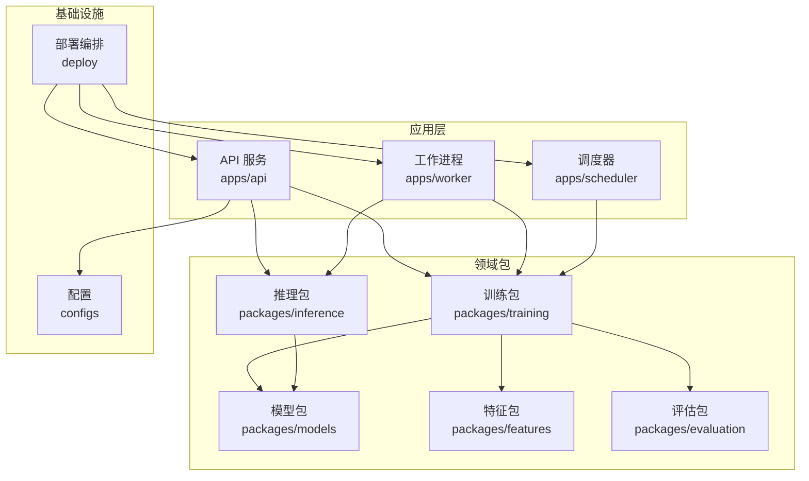
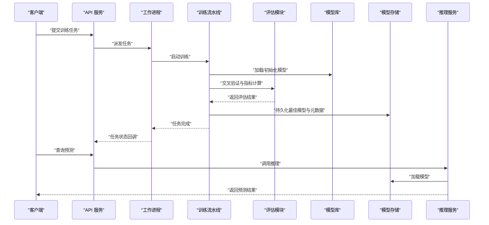
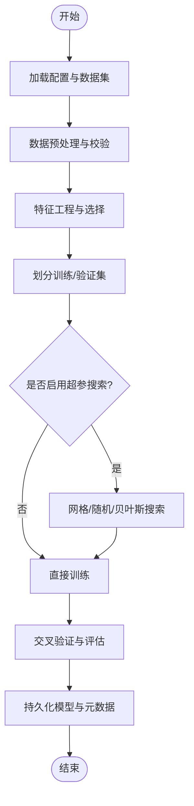
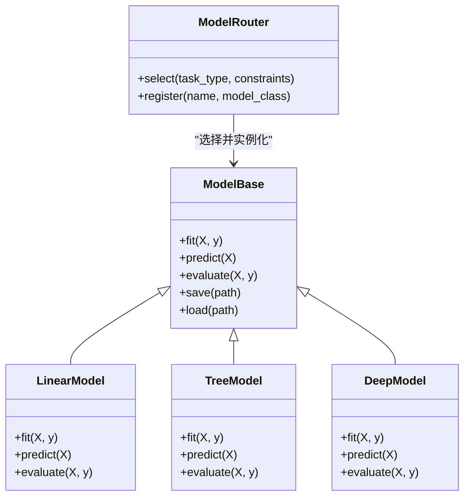
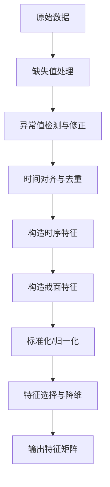
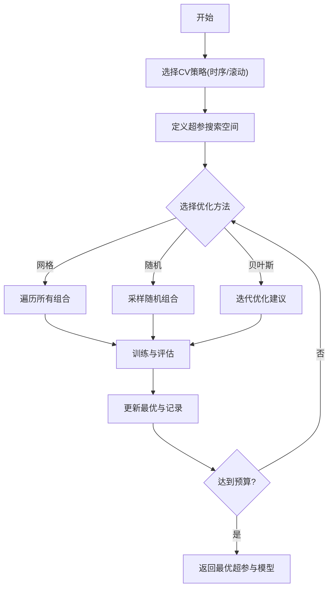
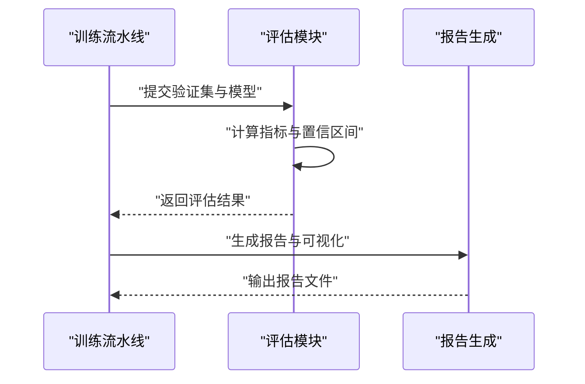
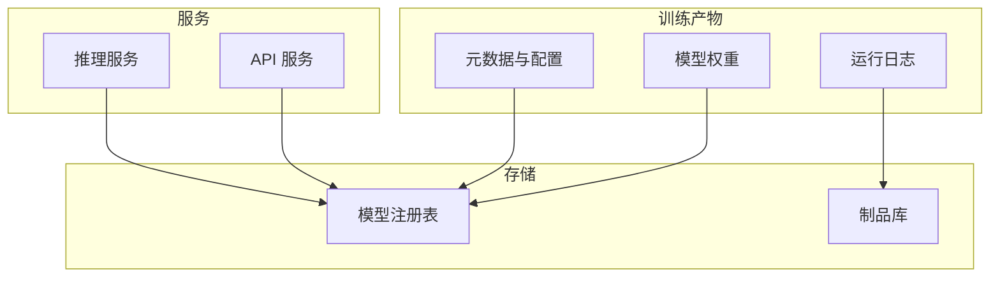
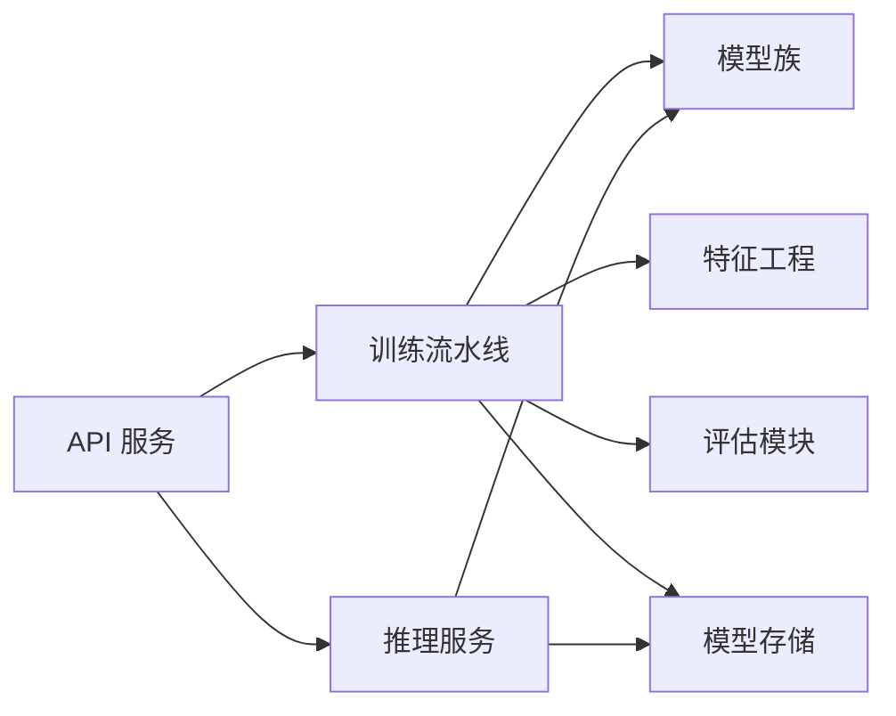

# 训练优化

<cite>
**本文引用的文件**   
- [packages/training/__init__.py](file://packages/training/__init__.py)
- [packages/models/__init__.py](file://packages/models/__init__.py)
- [packages/features/__init__.py](file://packages/features/__init__.py)
- [packages/evaluation/__init__.py](file://packages/evaluation/__init__.py)
- [packages/inference/__init__.py](file://packages/inference/__init__.py)
- [apps/api/routers/forecast.py](file://apps/api/routers/forecast.py)
- [apps/api/main.py](file://apps/api/main.py)
- [configs/base.yaml](file://configs/base.yaml)
- [deploy/docker-compose.yml](file://deploy/docker-compose.yml)
</cite>

## 目录
1. [简介](#简介)
2. [项目结构](#项目结构)
3. [核心组件](#核心组件)
4. [架构总览](#架构总览)
5. [详细组件分析](#详细组件分析)
6. [依赖关系分析](#依赖关系分析)
7. [性能考虑](#性能考虑)
8. [故障排查指南](#故障排查指南)
9. [结论](#结论)
10. [附录](#附录)

## 简介
本文件面向“训练优化”主题，围绕机器学习模型的训练框架进行系统化说明。内容覆盖数据预处理、特征工程、模型选择与超参数优化（网格搜索、随机搜索、贝叶斯优化）、交叉验证策略（时间序列交叉验证、滚动窗口验证）、评估指标与选择标准、模型持久化与版本管理、部署方案、分布式训练支持与性能优化策略，并提供实际训练案例与技巧分享。文档力求在保持技术深度的同时，让非专业读者也能理解整体流程与关键决策点。

## 项目结构
仓库采用多包分层组织方式：应用层位于 apps，领域能力以 packages 形式提供，配置集中于 configs，部署编排使用 deploy。训练相关能力主要分布在以下包中：
- training：训练流水线、任务编排、实验管理与结果归档
- models：模型族定义、路由与选择策略
- features：特征工厂、变换器与管道
- evaluation：指标计算、回测与报告
- inference：推理服务、批处理与在线预测
- api：REST 接口，暴露预测与训练任务管理能力

图表来源
- [apps/api/main.py](file://apps/api/main.py)
- [apps/api/routers/forecast.py](file://apps/api/routers/forecast.py)
- [packages/training/__init__.py](file://packages/training/__init__.py)
- [packages/models/__init__.py](file://packages/models/__init__.py)
- [packages/features/__init__.py](file://packages/features/__init__.py)
- [packages/evaluation/__init__.py](file://packages/evaluation/__init__.py)
- [packages/inference/__init__.py](file://packages/inference/__init__.py)
- [configs/base.yaml](file://configs/base.yaml)
- [deploy/docker-compose.yml](file://deploy/docker-compose.yml)

章节来源
- [apps/api/main.py](file://apps/api/main.py)
- [apps/api/routers/forecast.py](file://apps/api/routers/forecast.py)
- [packages/training/__init__.py](file://packages/training/__init__.py)
- [packages/models/__init__.py](file://packages/models/__init__.py)
- [packages/features/__init__.py](file://packages/features/__init__.py)
- [packages/evaluation/__init__.py](file://packages/evaluation/__init__.py)
- [packages/inference/__init__.py](file://packages/inference/__init__.py)
- [configs/base.yaml](file://configs/base.yaml)
- [deploy/docker-compose.yml](file://deploy/docker-compose.yml)

## 核心组件
- 训练流水线
  - 负责数据读取、清洗、对齐、切分、特征构建、模型训练、评估与结果归档。
  - 支持可插拔的数据源与存储后端，便于扩展新市场或新数据格式。
- 模型族与路由
  - 统一抽象不同模型族（线性、树模型、深度学习等），通过路由器根据任务类型与约束自动选择合适模型。
- 特征工程
  - 提供特征工厂与变换器集合，支持时序特征、截面特征与宏观因子组合。
- 评估与回测
  - 内置多种指标（如准确率、AUC、夏普比率、最大回撤等）与回测引擎，输出标准化报告。
- 推理服务
  - 提供批量与在线推理接口，支持模型热更新与灰度发布。
- 配置与部署
  - 基于 YAML 的配置中心，结合 Docker Compose 编排 API、Worker 与调度器。

章节来源
- [packages/training/__init__.py](file://packages/training/__init__.py)
- [packages/models/__init__.py](file://packages/models/__init__.py)
- [packages/features/__init__.py](file://packages/features/__init__.py)
- [packages/evaluation/__init__.py](file://packages/evaluation/__init__.py)
- [packages/inference/__init__.py](file://packages/inference/__init__.py)
- [configs/base.yaml](file://configs/base.yaml)
- [deploy/docker-compose.yml](file://deploy/docker-compose.yml)

## 架构总览
训练优化系统由“训练—评估—部署—监控”闭环构成。API 暴露训练任务与预测接口；Worker 执行训练与推理任务；Scheduler 定时触发重训与滚动验证；Models/Features/Evaluation 提供可复用能力；Inference 对外提供服务；配置与部署保障环境一致性与可扩展性。

图表来源
- [apps/api/routers/forecast.py](file://apps/api/routers/forecast.py)
- [apps/api/main.py](file://apps/api/main.py)
- [packages/training/__init__.py](file://packages/training/__init__.py)
- [packages/evaluation/__init__.py](file://packages/evaluation/__init__.py)
- [packages/models/__init__.py](file://packages/models/__init__.py)
- [packages/inference/__init__.py](file://packages/inference/__init__.py)

## 详细组件分析

### 训练流水线与任务编排
- 职责
  - 接收配置与数据集，执行数据预处理、特征工程、模型训练、交叉验证、超参搜索、结果归档。
  - 支持断点续训、任务重试与失败告警。
- 关键流程
  - 数据准备：校验、缺失值处理、异常值检测、时间对齐。
  - 特征工程：构造时序与截面特征，标准化/归一化，降维与选择。
  - 模型训练：按模型族初始化，支持早停、正则化与学习率调度。
  - 评估：时间序列交叉验证、滚动窗口验证、指标汇总与报告生成。
  - 归档：保存模型权重、特征映射、评估结果与运行日志。
- 可视化

图表来源
- [packages/training/__init__.py](file://packages/training/__init__.py)

章节来源
- [packages/training/__init__.py](file://packages/training/__init__.py)

### 模型族与路由
- 设计要点
  - 统一模型接口：fit/predict/evaluate/save/load。
  - 路由器：根据任务类型（分类/回归/排序）、数据规模、时延要求与资源约束选择模型族。
  - 扩展性：新增模型族只需实现统一接口并注册到路由器。
- 类图

图表来源
- [packages/models/__init__.py](file://packages/models/__init__.py)

章节来源
- [packages/models/__init__.py](file://packages/models/__init__.py)

### 特征工程与管道
- 功能
  - 提供常用变换器：缺失值填充、缩放、编码、滑动窗口统计、滞后特征、截面排名等。
  - 支持管道组合与缓存，避免重复计算。
- 流程图

图表来源
- [packages/features/__init__.py](file://packages/features/__init__.py)

章节来源
- [packages/features/__init__.py](file://packages/features/__init__.py)

### 交叉验证与超参数优化
- 交叉验证策略
  - 时间序列交叉验证：保证未来信息不泄露，按时间顺序划分训练/验证集。
  - 滚动窗口验证：固定长度窗口向前滚动，适合长序列与概念漂移场景。
- 超参数优化方法
  - 网格搜索：穷举候选集，适合小空间与强基线。
  - 随机搜索：在高维空间中快速探索，常优于网格。
  - 贝叶斯优化：基于历史结果建模目标函数，高效收敛。
- 流程图

图表来源
- [packages/training/__init__.py](file://packages/training/__init__.py)
- [packages/evaluation/__init__.py](file://packages/evaluation/__init__.py)

章节来源
- [packages/training/__init__.py](file://packages/training/__init__.py)
- [packages/evaluation/__init__.py](file://packages/evaluation/__init__.py)

### 模型评估与选择标准
- 指标体系
  - 分类：准确率、精确率、召回率、F1、AUC、对数损失等。
  - 回归：MAE、RMSE、R²、MAPE 等。
  - 金融回测：年化收益、夏普比率、最大回撤、胜率、盈亏比等。
- 选择标准
  - 稳健性优先：跨期稳定性、样本外表现、分布偏移鲁棒性。
  - 业务导向：风险调整后收益、交易成本与滑点影响。
- 评估流程

图表来源
- [packages/evaluation/__init__.py](file://packages/evaluation/__init__.py)

章节来源
- [packages/evaluation/__init__.py](file://packages/evaluation/__init__.py)

### 模型持久化、版本管理与部署
- 持久化
  - 保存模型权重、特征映射、评估结果与运行日志，确保可复现。
- 版本管理
  - 为每次训练生成唯一 ID，关联配置、数据快照与指标，支持回溯与对比。
- 部署
  - 通过容器化将 API、Worker、Scheduler 打包，配合配置中心与环境变量管理。
- 架构图

图表来源
- [packages/training/__init__.py](file://packages/training/__init__.py)
- [packages/inference/__init__.py](file://packages/inference/__init__.py)
- [deploy/docker-compose.yml](file://deploy/docker-compose.yml)

章节来源
- [packages/training/__init__.py](file://packages/training/__init__.py)
- [packages/inference/__init__.py](file://packages/inference/__init__.py)
- [deploy/docker-compose.yml](file://deploy/docker-compose.yml)

### 实际训练案例与优化技巧
- 典型流程
  - 定义任务与数据源，配置特征管道与模型族。
  - 选择交叉验证策略与超参搜索方法，设置资源与早停策略。
  - 运行训练，查看评估报告，选择最优模型并部署。
- 优化技巧
  - 特征层面：减少冗余、控制维度、关注经济含义与稳定性。
  - 模型层面：正则化、学习率预热与衰减、早停与集成。
  - 训练层面：批次大小与并行度调优、混合精度、梯度累积。
  - 评估层面：关注样本外与跨期稳定性，避免过拟合短期噪声。

[本节为通用指导，无需特定文件引用]

### 分布式训练支持与性能优化
- 分布式策略
  - 数据并行：多进程/多线程并行训练不同子集。
  - 超参搜索并行：多节点并行尝试不同超参组合。
  - 推理并行：水平扩展推理服务实例，负载均衡。
- 性能优化
  - IO 优化：预取、列式存储、分区裁剪。
  - 内存优化：增量计算、流式处理、对象池。
  - GPU/CPU 协同：GPU 加速训练，CPU 负责特征与调度。
- 部署弹性
  - 容器编排与自动扩缩容，按需分配资源。

[本节为通用指导，无需特定文件引用]

## 依赖关系分析
训练、模型、特征、评估与推理之间的依赖关系如下：

图表来源
- [apps/api/main.py](file://apps/api/main.py)
- [apps/api/routers/forecast.py](file://apps/api/routers/forecast.py)
- [packages/training/__init__.py](file://packages/training/__init__.py)
- [packages/models/__init__.py](file://packages/models/__init__.py)
- [packages/features/__init__.py](file://packages/features/__init__.py)
- [packages/evaluation/__init__.py](file://packages/evaluation/__init__.py)
- [packages/inference/__init__.py](file://packages/inference/__init__.py)

章节来源
- [apps/api/main.py](file://apps/api/main.py)
- [apps/api/routers/forecast.py](file://apps/api/routers/forecast.py)
- [packages/training/__init__.py](file://packages/training/__init__.py)
- [packages/models/__init__.py](file://packages/models/__init__.py)
- [packages/features/__init__.py](file://packages/features/__init__.py)
- [packages/evaluation/__init__.py](file://packages/evaluation/__init__.py)
- [packages/inference/__init__.py](file://packages/inference/__init__.py)

## 性能考虑
- 数据层
  - 使用高效存储格式与索引，减少 IO 瓶颈。
  - 特征管道缓存与增量更新，避免重复计算。
- 训练层
  - 合理设置批次大小、学习率与早停阈值。
  - 利用并行与异步提升吞吐。
- 推理层
  - 模型量化与剪枝，降低延迟与内存占用。
  - 批处理与连接池，提高并发能力。
- 资源与成本
  - 动态扩缩容与抢占式实例，平衡性能与成本。

[本节为通用指导，无需特定文件引用]

## 故障排查指南
- 常见问题
  - 数据不一致：检查时间戳、时区与对齐逻辑。
  - 特征泄漏：确认未来信息未进入训练集。
  - 评估不稳定：扩大样本外范围，关注指标方差。
  - 部署失败：核对环境变量、镜像依赖与端口冲突。
- 定位手段
  - 查看训练与推理日志，定位错误堆栈。
  - 对比不同版本的模型与配置，识别回归原因。
  - 使用最小复现数据集与简化配置隔离问题。

[本节为通用指导，无需特定文件引用]

## 结论
本训练优化框架以模块化与可插拔为核心，覆盖从数据到部署的完整链路。通过合理的交叉验证与超参优化策略，结合稳健的评估指标与版本管理，能够在复杂金融场景中持续提升模型质量与稳定性。分布式与性能优化进一步保障了大规模训练与高并发推理的需求。

[本节为总结性内容，无需特定文件引用]

## 附录
- 配置项参考
  - 基础配置示例路径：[configs/base.yaml](file://configs/base.yaml)
- 部署编排
  - 容器编排示例路径：[deploy/docker-compose.yml](file://deploy/docker-compose.yml)
- API 入口
  - 主应用入口路径：[apps/api/main.py](file://apps/api/main.py)
  - 预测路由路径：[apps/api/routers/forecast.py](file://apps/api/routers/forecast.py)

章节来源
- [configs/base.yaml](file://configs/base.yaml)
- [deploy/docker-compose.yml](file://deploy/docker-compose.yml)
- [apps/api/main.py](file://apps/api/main.py)
- [apps/api/routers/forecast.py](file://apps/api/routers/forecast.py)