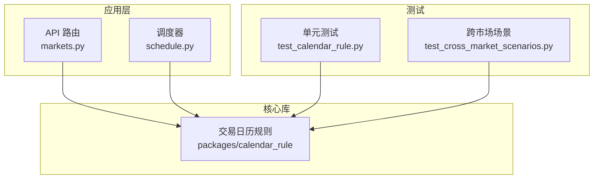
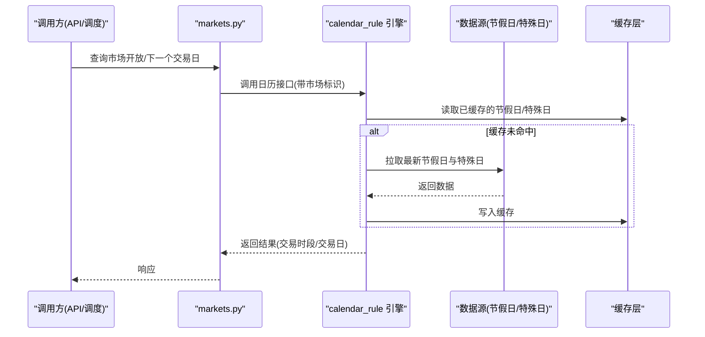
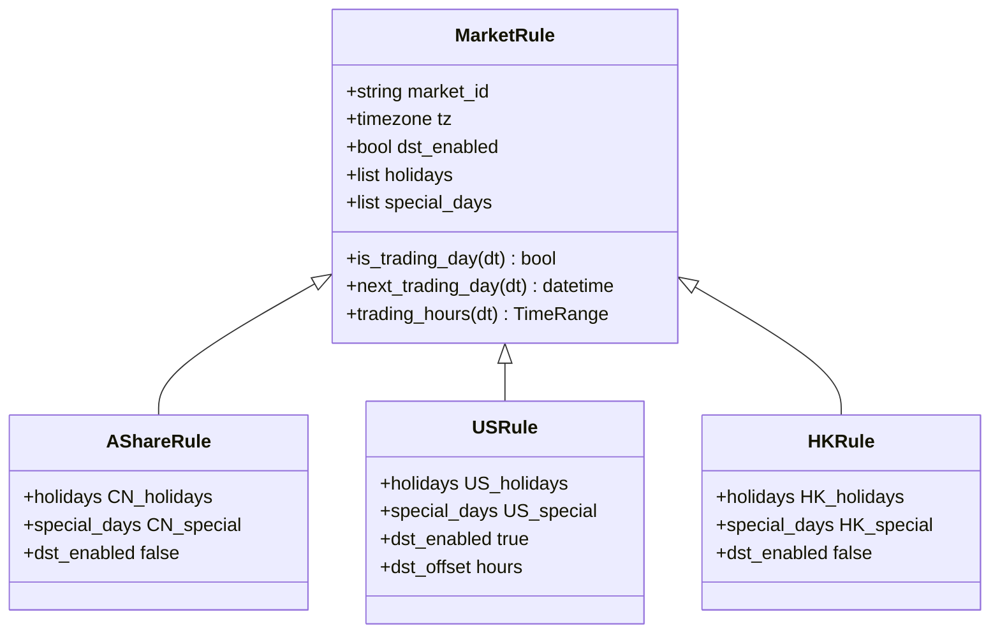
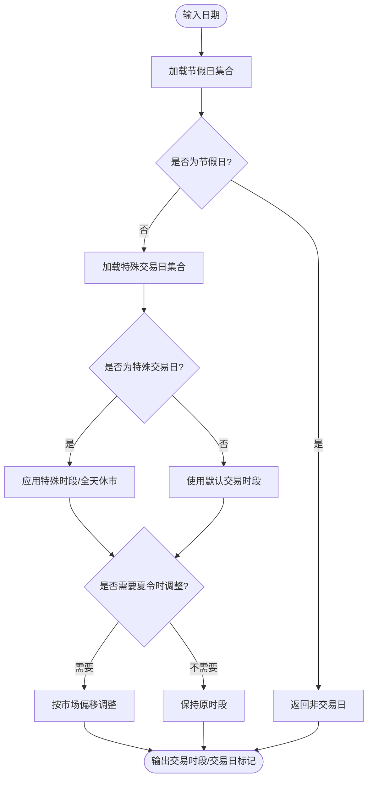
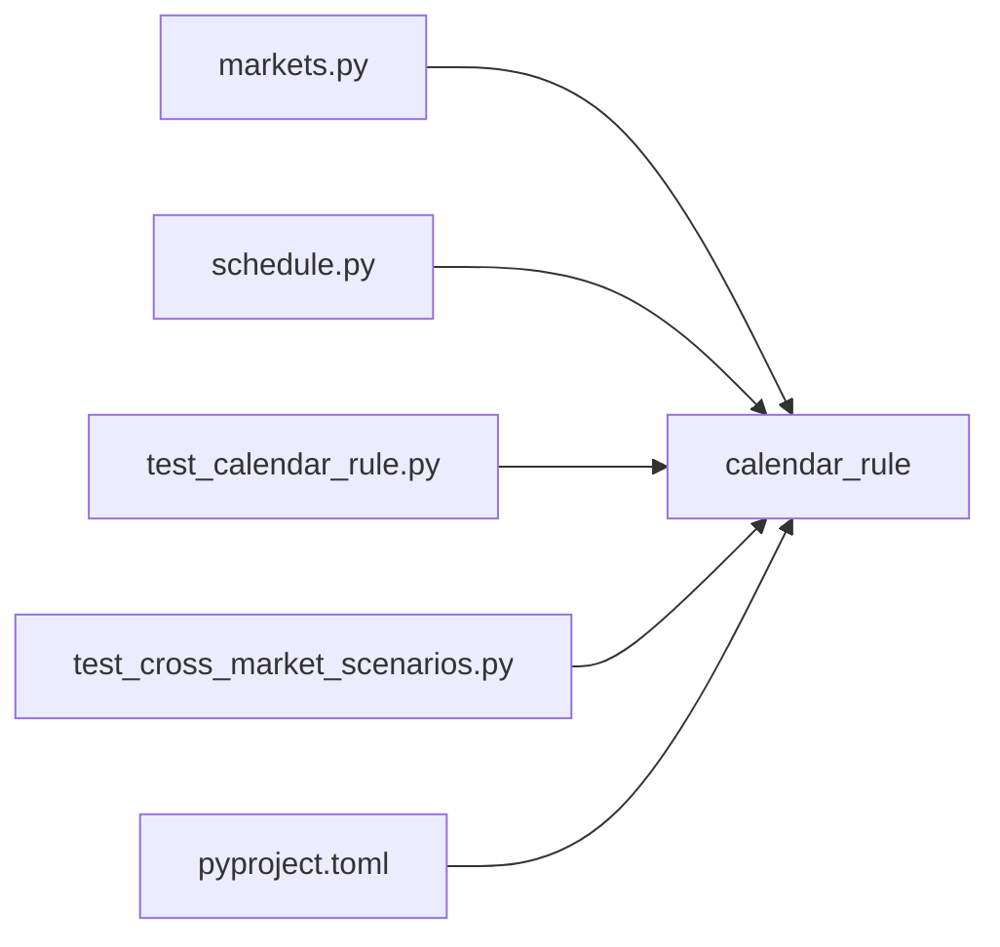

# 交易日历规则

<cite>
**本文引用的文件**   
- [packages/calendar_rule](file://packages/calendar_rule)
- [tests/unit/test_calendar_rule.py](file://tests/unit/test_calendar_rule.py)
- [tests/unit/test_cross_market_scenarios.py](file://tests/unit/test_cross_market_scenarios.py)
- [apps/api/routers/markets.py](file://apps/api/routers/markets.py)
- [apps/scheduler/schedule.py](file://apps/scheduler/schedule.py)
- [pyproject.toml](file://pyproject.toml)
</cite>

## 目录
1. [简介](#简介)
2. [项目结构](#项目结构)
3. [核心组件](#核心组件)
4. [架构总览](#架构总览)
5. [详细组件分析](#详细组件分析)
6. [依赖关系分析](#依赖关系分析)
7. [性能考虑](#性能考虑)
8. [故障排查指南](#故障排查指南)
9. [结论](#结论)
10. [附录](#附录)

## 简介
本模块聚焦跨市场交易日历规则，面向A股、美股、港股等多市场场景，提供统一的交易时间计算与节假日处理能力。目标包括：
- 统一抽象不同市场的交易时段、休市日、夏令时调整与特殊交易日判定
- 提供可配置的自定义日历扩展点
- 封装常用交易时间工具函数（下一个交易日、交易日间隔、市场开放时间查询等）
- 支持数据源集成与缓存策略，提升大规模回测与在线计算的吞吐与时延表现

## 项目结构
仓库中与交易日历相关的代码主要位于 packages/calendar_rule 目录，并在测试套件中覆盖多市场场景与边界条件；API 层通过 markets 路由暴露市场信息；调度器 schedule 使用日历进行任务编排。

图表来源
- [apps/api/routers/markets.py](file://apps/api/routers/markets.py)
- [apps/scheduler/schedule.py](file://apps/scheduler/schedule.py)
- [packages/calendar_rule](file://packages/calendar_rule)
- [tests/unit/test_calendar_rule.py](file://tests/unit/test_calendar_rule.py)
- [tests/unit/test_cross_market_scenarios.py](file://tests/unit/test_cross_market_scenarios.py)

章节来源
- [packages/calendar_rule](file://packages/calendar_rule)
- [tests/unit/test_calendar_rule.py](file://tests/unit/test_calendar_rule.py)
- [tests/unit/test_cross_market_scenarios.py](file://tests/unit/test_cross_market_scenarios.py)
- [apps/api/routers/markets.py](file://apps/api/routers/markets.py)
- [apps/scheduler/schedule.py](file://apps/scheduler/schedule.py)

## 核心组件
- 市场抽象与规则定义：为每个市场定义交易时段、节假日、夏令时偏移与特殊交易日集合
- 日历引擎：基于规则判断给定时间是否属于交易时段/交易日，并计算相邻交易日
- 工具函数：下一个交易日、交易日间隔、市场开放状态查询、跨市场合并窗口等
- 配置与扩展：通过配置文件或注册表注入自定义市场规则
- 数据源与缓存：从外部数据源加载节假日与特殊交易日，结合内存/持久化缓存降低重复计算成本

章节来源
- [packages/calendar_rule](file://packages/calendar_rule)
- [tests/unit/test_calendar_rule.py](file://tests/unit/test_calendar_rule.py)
- [tests/unit/test_cross_market_scenarios.py](file://tests/unit/test_cross_market_scenarios.py)

## 架构总览
整体采用“规则定义 + 引擎执行 + 工具封装 + 配置注入”的分层设计。API 与调度器作为调用方，通过统一接口访问日历能力；测试用例覆盖单市场与跨市场复杂场景。

图表来源
- [apps/api/routers/markets.py](file://apps/api/routers/markets.py)
- [apps/scheduler/schedule.py](file://apps/scheduler/schedule.py)
- [packages/calendar_rule](file://packages/calendar_rule)

## 详细组件分析

### 市场规则抽象与实现
- 市场基类/协议：定义交易时段、时区、夏令时开关、节假日集合、特殊交易日集合等字段与方法
- 具体市场实现：A股、美股、港股分别实现各自规则，如开盘收盘时间、午间休市、节假日来源、夏令时偏移等
- 规则优先级：当存在夏令时与特殊交易日冲突时，以特殊交易日为准；若遇提前收市或延迟开市，优先采用当日特殊时段

图表来源
- [packages/calendar_rule](file://packages/calendar_rule)

章节来源
- [packages/calendar_rule](file://packages/calendar_rule)

### 节假日与特殊交易日处理
- 数据来源：本地静态列表、远程数据源（如交易所公告、第三方日历服务）
- 更新策略：定时增量更新、变更检测、版本化存储
- 冲突消解：同一日期同时出现在普通交易日与特殊交易日时，以特殊交易日为准；若特殊日为提前收市/延迟开市，则覆盖默认时段

图表来源
- [packages/calendar_rule](file://packages/calendar_rule)

章节来源
- [packages/calendar_rule](file://packages/calendar_rule)

### 夏令时调整机制
- 适用市场：例如美股在夏令时期间时钟前移，导致交易时段相对标准时间发生偏移
- 调整方式：根据市场定义的夏令时起止时间与偏移量，对 UTC 时间转换为本地交易时间后再进行判断
- 边界处理：切换日当天可能出现重叠或缺失小时，需明确采用“早结束/晚开始”的策略以避免歧义

章节来源
- [packages/calendar_rule](file://packages/calendar_rule)

### 自定义日历规则扩展方法
- 注册式扩展：通过注册表将自定义市场规则注入到全局工厂，供统一入口调用
- 配置驱动：在配置文件中声明市场 ID、时区、节假日来源、特殊日来源与夏令时参数
- 最小改动原则：新增市场仅需实现规则接口并提供配置项，无需修改核心逻辑

章节来源
- [packages/calendar_rule](file://packages/calendar_rule)

### 交易时间计算工具函数
- 下一个交易日：给定时间点，向前或向后搜索最近的交易日
- 交易日间隔：计算两个日期之间的自然日与交易日差值
- 市场开放时间查询：判断当前时间是否处于某市场的交易时段内
- 跨市场窗口：在多市场之间对齐时间轴，生成统一的交易时间序列

章节来源
- [packages/calendar_rule](file://packages/calendar_rule)

### 日历数据源集成与缓存策略
- 数据源：支持本地文件、数据库、HTTP 服务等；提供适配器模式屏蔽差异
- 缓存策略：
  - 内存缓存：短期热点数据（如近期节假日与特殊日）
  - 持久化缓存：长期历史数据，避免重复下载
  - 失效策略：按日期范围或版本号失效，支持增量更新
- 一致性保障：读写分离与并发控制，确保高并发下的一致性

章节来源
- [packages/calendar_rule](file://packages/calendar_rule)

### 实际示例路径（配置与计算）
- 配置示例：参考测试中的市场规则配置与注册方式
  - [tests/unit/test_calendar_rule.py](file://tests/unit/test_calendar_rule.py)
- 跨市场场景：参考跨市场组合与时间对齐用例
  - [tests/unit/test_cross_market_scenarios.py](file://tests/unit/test_cross_market_scenarios.py)
- API 使用：参考 markets 路由对市场信息的查询与返回
  - [apps/api/routers/markets.py](file://apps/api/routers/markets.py)
- 调度集成：参考调度器如何基于日历安排任务
  - [apps/scheduler/schedule.py](file://apps/scheduler/schedule.py)

章节来源
- [tests/unit/test_calendar_rule.py](file://tests/unit/test_calendar_rule.py)
- [tests/unit/test_cross_market_scenarios.py](file://tests/unit/test_cross_market_scenarios.py)
- [apps/api/routers/markets.py](file://apps/api/routers/markets.py)
- [apps/scheduler/schedule.py](file://apps/scheduler/schedule.py)

## 依赖关系分析
- 内部依赖：API 与调度器依赖 calendar_rule 提供的统一接口；测试覆盖核心逻辑与边界场景
- 外部依赖：可能依赖时区库、日期运算库与 HTTP/数据库客户端（由 pyproject.toml 管理）
- 耦合度：calendar_rule 对外暴露稳定接口，内部实现可替换；数据源与缓存通过适配器隔离

图表来源
- [apps/api/routers/markets.py](file://apps/api/routers/markets.py)
- [apps/scheduler/schedule.py](file://apps/scheduler/schedule.py)
- [packages/calendar_rule](file://packages/calendar_rule)
- [tests/unit/test_calendar_rule.py](file://tests/unit/test_calendar_rule.py)
- [tests/unit/test_cross_market_scenarios.py](file://tests/unit/test_cross_market_scenarios.py)
- [pyproject.toml](file://pyproject.toml)

章节来源
- [pyproject.toml](file://pyproject.toml)
- [apps/api/routers/markets.py](file://apps/api/routers/markets.py)
- [apps/scheduler/schedule.py](file://apps/scheduler/schedule.py)
- [packages/calendar_rule](file://packages/calendar_rule)

## 性能考虑
- 批量计算优化：对大范围日期区间预构建交易日索引，减少逐日判断开销
- 缓存命中率：合理设置缓存粒度（按市场+年份+月份），提高热点数据命中率
- 并发安全：读写锁或无锁数据结构保证多线程/协程环境下的稳定性
- I/O 去重：对数据源请求进行去抖与合并，避免频繁网络调用

[本节为通用指导，不直接分析具体文件]

## 故障排查指南
- 常见问题
  - 节假日缺失或过期：检查数据源连接与更新任务是否正常
  - 夏令时切换异常：确认市场定义的夏令时起止时间与偏移量是否正确
  - 特殊交易日未生效：验证特殊日集合是否被正确加载与优先级覆盖
- 定位步骤
  - 启用调试日志，记录关键决策分支（节假日/特殊日/夏令时）
  - 使用测试用例复现问题，逐步缩小范围至具体市场或日期
  - 检查缓存键与失效策略，确认是否存在脏数据

章节来源
- [tests/unit/test_calendar_rule.py](file://tests/unit/test_calendar_rule.py)
- [tests/unit/test_cross_market_scenarios.py](file://tests/unit/test_cross_market_scenarios.py)

## 结论
本模块通过统一抽象与可扩展的规则体系，实现了跨市场交易日历的核心能力。借助数据源集成与缓存策略，既保证了准确性也兼顾了性能。建议在生产环境中完善监控与告警，持续优化缓存与数据源刷新策略，确保在高并发与长周期运行下的稳定性。

[本节为总结性内容，不直接分析具体文件]

## 附录
- 术语说明
  - 交易日：市场正常开市的日期
  - 特殊交易日：因节日或事件导致的提前收市、延迟开市或全天休市
  - 夏令时：部分地区在特定时期将时钟前移，影响交易时段换算
- 最佳实践
  - 为新市场仅实现规则接口与配置项，遵循最小改动原则
  - 对批量计算使用预构建索引与批处理缓存键
  - 对数据源变更引入版本化与回滚机制

[本节为概念性内容，不直接分析具体文件]