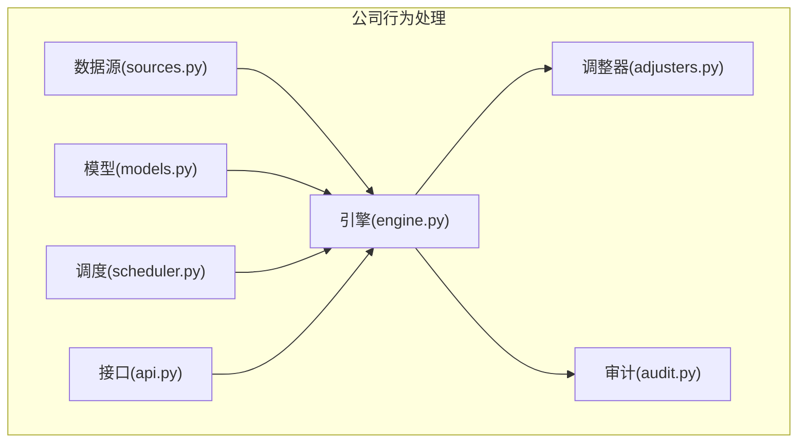
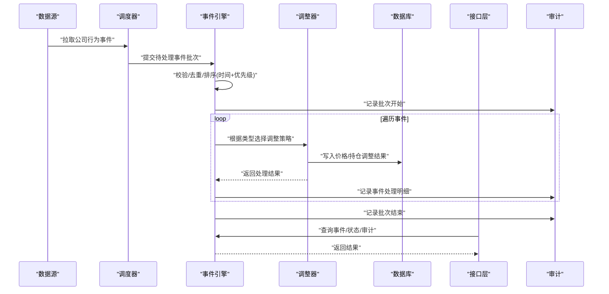
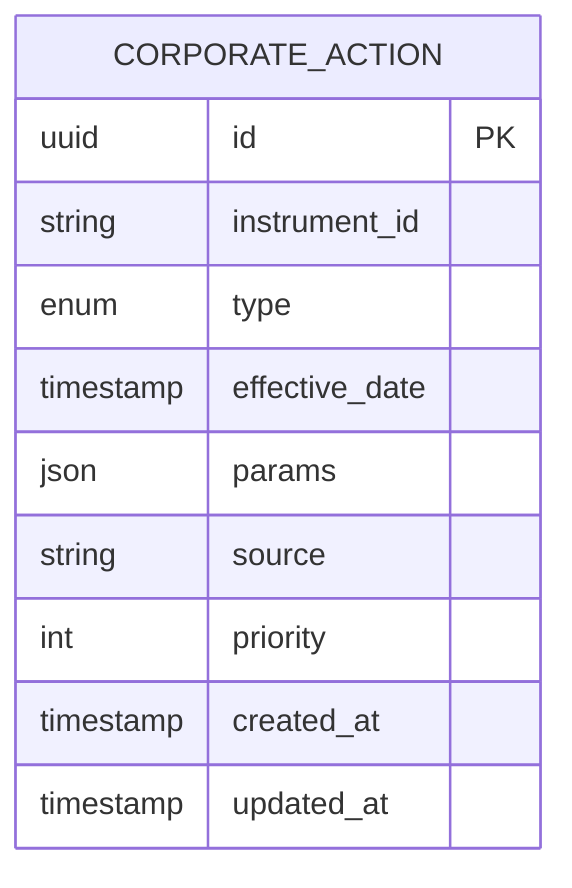
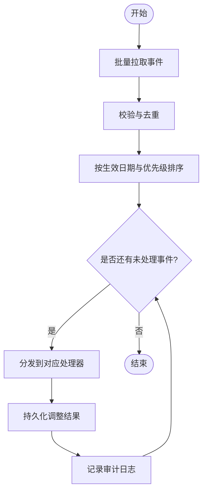
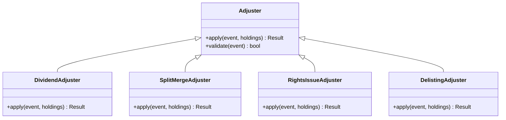
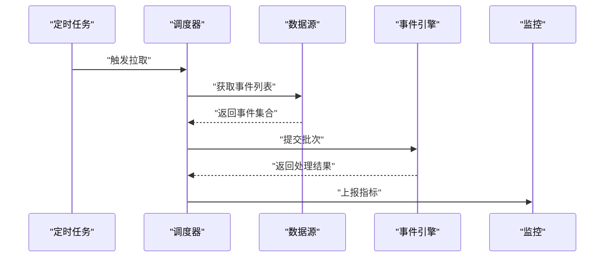
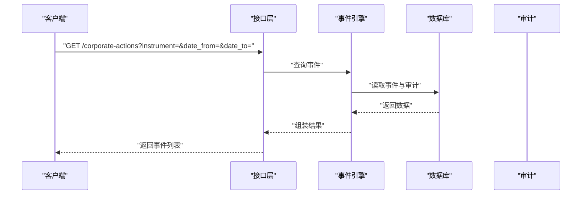
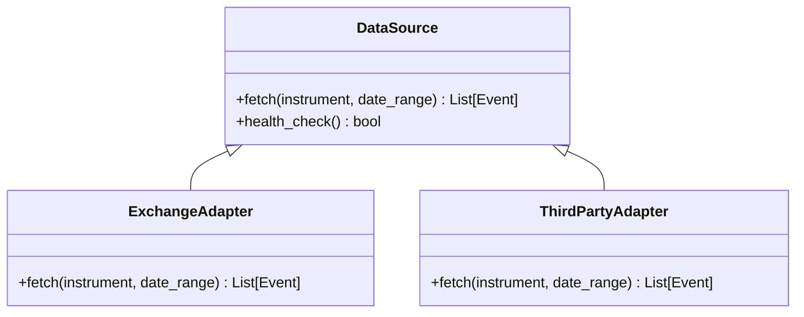
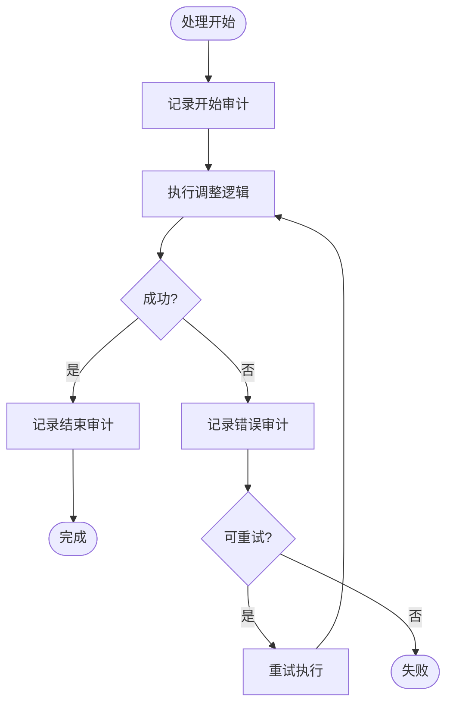
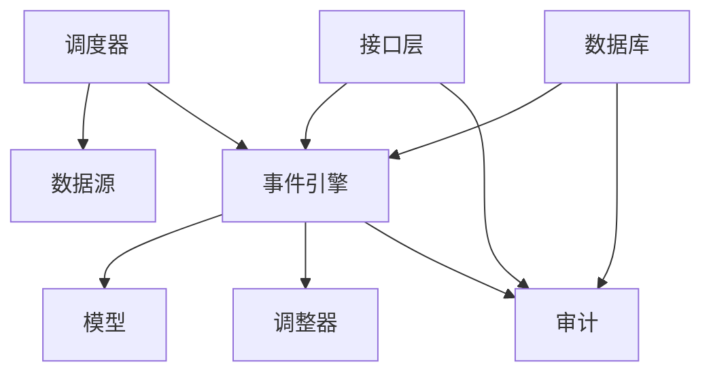

# 公司行为处理

<cite>
**本文引用的文件**   
- [packages/corporate_actions/__init__.py](file://packages/corporate_actions/__init__.py)
- [packages/corporate_actions/models.py](file://packages/corporate_actions/models.py)
- [packages/corporate_actions/engine.py](file://packages/corporate_actions/engine.py)
- [packages/corporate_actions/adjusters.py](file://packages/corporate_actions/adjusters.py)
- [packages/corporate_actions/scheduler.py](file://packages/corporate_actions/scheduler.py)
- [packages/corporate_actions/api.py](file://packages/corporate_actions/api.py)
- [packages/corporate_actions/sources.py](file://packages/corporate_actions/sources.py)
- [packages/corporate_actions/audit.py](file://packages/corporate_actions/audit.py)
- [sql/migrations/20260715_0004_corporate_action.py](file://sql/migrations/20260715_0004_corporate_action.py)
- [apps/api/routers/fundamentals.py](file://apps/api/routers/fundamentals.py)
- [tests/unit/test_corporate_actions.py](file://tests/unit/test_corporate_actions.py)
- [tests/unit/test_corporate_actions_extended.py](file://tests/unit/test_corporate_actions_extended.py)
</cite>

## 目录
1. [简介](#简介)
2. [项目结构](#项目结构)
3. [核心组件](#核心组件)
4. [架构总览](#架构总览)
5. [详细组件分析](#详细组件分析)
6. [依赖关系分析](#依赖关系分析)
7. [性能考量](#性能考量)
8. [故障排查指南](#故障排查指南)
9. [结论](#结论)
10. [附录](#附录)

## 简介
本文件面向公司内部“公司行为处理”子系统，提供标准化、可扩展的公司事件处理架构文档。该框架支持分红、拆股、合股、配股、退市等多种公司行为类型，涵盖事件数据结构设计、时间戳与优先级排序机制、价格与持仓调整算法、历史数据修正方法、数据源集成、批量处理能力以及审计追踪能力。文档同时给出扩展新公司行为类型的开发指南，并通过测试用例路径展示注册、处理与查询的实现方式。

## 项目结构
公司行为处理位于 packages/corporate_actions 模块中，围绕“模型-引擎-调整器-调度-接口-数据源-审计”分层组织：
- 模型层：定义公司行为事件的数据结构与约束
- 引擎层：负责事件注册、排序、批处理与执行
- 调整器层：实现价格与持仓的差异化调整策略
- 调度层：定时拉取与触发处理
- 接口层：对外暴露查询与操作 API
- 数据源层：接入外部数据并提供统一抽象
- 审计层：记录不可变审计日志，保障可追溯性

图表来源
- [packages/corporate_actions/models.py](file://packages/corporate_actions/models.py)
- [packages/corporate_actions/engine.py](file://packages/corporate_actions/engine.py)
- [packages/corporate_actions/adjusters.py](file://packages/corporate_actions/adjusters.py)
- [packages/corporate_actions/scheduler.py](file://packages/corporate_actions/scheduler.py)
- [packages/corporate_actions/api.py](file://packages/corporate_actions/api.py)
- [packages/corporate_actions/sources.py](file://packages/corporate_actions/sources.py)
- [packages/corporate_actions/audit.py](file://packages/corporate_actions/audit.py)

章节来源
- [packages/corporate_actions/__init__.py](file://packages/corporate_actions/__init__.py)
- [packages/corporate_actions/models.py](file://packages/corporate_actions/models.py)
- [packages/corporate_actions/engine.py](file://packages/corporate_actions/engine.py)
- [packages/corporate_actions/adjusters.py](file://packages/corporate_actions/adjusters.py)
- [packages/corporate_actions/scheduler.py](file://packages/corporate_actions/scheduler.py)
- [packages/corporate_actions/api.py](file://packages/corporate_actions/api.py)
- [packages/corporate_actions/sources.py](file://packages/corporate_actions/sources.py)
- [packages/corporate_actions/audit.py](file://packages/corporate_actions/audit.py)

## 核心组件
- 事件模型与枚举
  - 定义公司行为类型（如分红、拆股、合股、配股、退市等）
  - 定义事件字段：标的标识、生效日期、参数集、来源、优先级、时间戳等
  - 通过迁移脚本持久化到数据库，确保版本演进与一致性
- 事件引擎
  - 注册与发现：动态注册不同公司行为的处理器
  - 排序与去重：按生效时间与优先级进行稳定排序，避免重复处理
  - 批处理：批量拉取、校验、分发至对应处理器
  - 幂等与回滚：保证多次执行结果一致，失败可重试或补偿
- 调整器
  - 价格调整：对历史K线、净值等进行复权计算
  - 持仓调整：对组合持仓数量与成本进行同步修正
  - 策略可插拔：不同类型的事件映射到不同的调整策略
- 调度器
  - 定时任务：周期性地从数据源拉取事件并触发处理
  - 容错与监控：失败重试、指标上报、告警
- 接口层
  - 查询接口：按标的、时间范围、类型筛选事件
  - 管理接口：手动触发、查看状态、审计追踪
- 数据源
  - 多源适配：对接交易所、第三方数据提供商
  - 统一抽象：将异构数据转换为标准事件模型
- 审计
  - 不可变日志：记录事件生命周期关键节点
  - 溯源：关联数据源、批次ID、处理人、耗时、错误信息

章节来源
- [packages/corporate_actions/models.py](file://packages/corporate_actions/models.py)
- [packages/corporate_actions/engine.py](file://packages/corporate_actions/engine.py)
- [packages/corporate_actions/adjusters.py](file://packages/corporate_actions/adjusters.py)
- [packages/corporate_actions/scheduler.py](file://packages/corporate_actions/scheduler.py)
- [packages/corporate_actions/api.py](file://packages/corporate_actions/api.py)
- [packages/corporate_actions/sources.py](file://packages/corporate_actions/sources.py)
- [packages/corporate_actions/audit.py](file://packages/corporate_actions/audit.py)
- [sql/migrations/20260715_0004_corporate_action.py](file://sql/migrations/20260715_0004_corporate_action.py)

## 架构总览
下图展示了公司行为处理的端到端流程：数据源拉取事件，引擎进行排序与分发，调整器执行价格与持仓修正，审计记录全过程，API对外提供查询与管理能力。

图表来源
- [packages/corporate_actions/sources.py](file://packages/corporate_actions/sources.py)
- [packages/corporate_actions/scheduler.py](file://packages/corporate_actions/scheduler.py)
- [packages/corporate_actions/engine.py](file://packages/corporate_actions/engine.py)
- [packages/corporate_actions/adjusters.py](file://packages/corporate_actions/adjusters.py)
- [packages/corporate_actions/api.py](file://packages/corporate_actions/api.py)
- [packages/corporate_actions/audit.py](file://packages/corporate_actions/audit.py)

## 详细组件分析

### 事件模型与数据库设计
- 事件模型要点
  - 唯一键：标的 + 生效日期 + 类型，防止重复
  - 时间戳：包含创建时间、生效时间、更新时间，用于排序与回溯
  - 参数集：以结构化形式存储不同类型事件的差异化参数
  - 来源与批次：记录数据来源与批次ID，便于溯源
- 数据库迁移
  - 通过 Alembic 迁移脚本维护表结构演进
  - 索引优化：按标的、生效日期、类型建立索引，提升查询性能

图表来源
- [packages/corporate_actions/models.py](file://packages/corporate_actions/models.py)
- [sql/migrations/20260715_0004_corporate_action.py](file://sql/migrations/20260715_0004_corporate_action.py)

章节来源
- [packages/corporate_actions/models.py](file://packages/corporate_actions/models.py)
- [sql/migrations/20260715_0004_corporate_action.py](file://sql/migrations/20260715_0004_corporate_action.py)

### 事件引擎：注册、排序与批处理
- 注册与发现
  - 使用装饰器或工厂模式注册各类型事件处理器
  - 运行时根据事件类型路由到对应处理器
- 排序与优先级
  - 主排序键：生效日期（升序）
  - 次排序键：优先级（降序），确保高优先级事件先处理
  - 稳定性：相同键保持插入顺序不变
- 批处理
  - 批量拉取后统一校验、去重、排序
  - 分片执行，控制并发度，避免资源争用
- 幂等与重试
  - 基于批次ID与事件ID的去重键
  - 失败事件进入重试队列，支持指数退避

图表来源
- [packages/corporate_actions/engine.py](file://packages/corporate_actions/engine.py)
- [packages/corporate_actions/audit.py](file://packages/corporate_actions/audit.py)

章节来源
- [packages/corporate_actions/engine.py](file://packages/corporate_actions/engine.py)
- [packages/corporate_actions/audit.py](file://packages/corporate_actions/audit.py)

### 调整器：价格与持仓调整算法
- 价格调整
  - 分红：按除息日调整历史收盘价与成交量
  - 拆股/合股：按比例调整历史价格序列
  - 配股：考虑配股价与比例，对历史价格进行加权调整
  - 退市：在退市日前一日标记特殊状态，后续交易日不再更新
- 持仓调整
  - 数量调整：按拆合比例或配股比例更新持仓数量
  - 成本调整：按复权因子更新单位成本，保持市值一致
  - 组合级联：对涉及多个子组合的持仓进行联动修正
- 策略可插拔
  - 每种公司行为类型映射到一个调整策略类
  - 新增类型只需实现策略接口并注册

图表来源
- [packages/corporate_actions/adjusters.py](file://packages/corporate_actions/adjusters.py)

章节来源
- [packages/corporate_actions/adjusters.py](file://packages/corporate_actions/adjusters.py)

### 调度器：定时拉取与触发
- 定时策略
  - 固定间隔或 Cron 表达式配置
  - 支持跨时区与节假日日历规则
- 容错与监控
  - 失败重试、死信队列
  - 指标上报：拉取量、处理量、失败率、耗时分布
- 与 API 集成
  - 提供手动触发与状态查询接口

图表来源
- [packages/corporate_actions/scheduler.py](file://packages/corporate_actions/scheduler.py)
- [packages/corporate_actions/sources.py](file://packages/corporate_actions/sources.py)
- [packages/corporate_actions/engine.py](file://packages/corporate_actions/engine.py)

章节来源
- [packages/corporate_actions/scheduler.py](file://packages/corporate_actions/scheduler.py)
- [packages/corporate_actions/sources.py](file://packages/corporate_actions/sources.py)

### 接口层：查询与管理
- 查询接口
  - 按标的、时间范围、类型筛选
  - 分页与排序
- 管理接口
  - 手动触发拉取与处理
  - 查看批次状态与审计日志
- 与前端/其他服务集成
  - RESTful 风格，统一响应信封
  - 鉴权与限流

图表来源
- [packages/corporate_actions/api.py](file://packages/corporate_actions/api.py)
- [packages/corporate_actions/engine.py](file://packages/corporate_actions/engine.py)
- [packages/corporate_actions/audit.py](file://packages/corporate_actions/audit.py)

章节来源
- [packages/corporate_actions/api.py](file://packages/corporate_actions/api.py)

### 数据源：多源适配与统一抽象
- 适配器模式
  - 为不同数据源实现统一接口
  - 将异构数据转换为标准事件模型
- 校验与清洗
  - 必填字段校验、数值范围检查
  - 异常值过滤与告警
- 增量与全量
  - 支持增量拉取（基于时间戳或游标）
  - 支持全量重建（用于修复或迁移）

图表来源
- [packages/corporate_actions/sources.py](file://packages/corporate_actions/sources.py)

章节来源
- [packages/corporate_actions/sources.py](file://packages/corporate_actions/sources.py)

### 审计：不可变日志与溯源
- 审计内容
  - 批次ID、事件ID、处理人、开始/结束时间、状态、错误信息
  - 输入输出快照（脱敏）
- 查询与分析
  - 按批次、事件、时间范围检索
  - 生成报表与导出
- 合规与安全
  - 只写不删，保留完整链路
  - 敏感信息脱敏与访问控制

图表来源
- [packages/corporate_actions/audit.py](file://packages/corporate_actions/audit.py)

章节来源
- [packages/corporate_actions/audit.py](file://packages/corporate_actions/audit.py)

### 扩展开发指南：新增公司行为类型
- 步骤概览
  - 在模型中声明新的公司行为类型与参数结构
  - 实现对应的调整器类，继承基础调整器接口
  - 在引擎中注册新类型处理器
  - 编写单元测试与集成测试
  - 更新迁移脚本（如需变更表结构）
- 最佳实践
  - 保持幂等：同一事件多次执行结果一致
  - 明确边界：生效日期前后数据的处理规则清晰
  - 充分验证：覆盖正常、异常、边界场景
  - 可观测性：增加指标与日志埋点

章节来源
- [packages/corporate_actions/models.py](file://packages/corporate_actions/models.py)
- [packages/corporate_actions/adjusters.py](file://packages/corporate_actions/adjusters.py)
- [packages/corporate_actions/engine.py](file://packages/corporate_actions/engine.py)
- [sql/migrations/20260715_0004_corporate_action.py](file://sql/migrations/20260715_0004_corporate_action.py)

### 实际示例路径：注册、处理与查询
- 注册与处理
  - 参考单元测试中的注册与处理流程，了解如何为新类型添加处理器并触发执行
- 查询与审计
  - 参考接口与审计模块的使用方式，了解如何查询事件与审计日志
- 相关测试用例路径
  - [tests/unit/test_corporate_actions.py](file://tests/unit/test_corporate_actions.py)
  - [tests/unit/test_corporate_actions_extended.py](file://tests/unit/test_corporate_actions_extended.py)

章节来源
- [tests/unit/test_corporate_actions.py](file://tests/unit/test_corporate_actions.py)
- [tests/unit/test_corporate_actions_extended.py](file://tests/unit/test_corporate_actions_extended.py)

## 依赖关系分析
- 内部依赖
  - 引擎依赖模型、调整器、审计
  - 调度器依赖数据源与引擎
  - 接口层依赖引擎与审计
- 外部依赖
  - 数据库：持久化事件与审计
  - 监控系统：指标与告警
  - 消息队列（可选）：异步处理与重试

图表来源
- [packages/corporate_actions/engine.py](file://packages/corporate_actions/engine.py)
- [packages/corporate_actions/models.py](file://packages/corporate_actions/models.py)
- [packages/corporate_actions/adjusters.py](file://packages/corporate_actions/adjusters.py)
- [packages/corporate_actions/scheduler.py](file://packages/corporate_actions/scheduler.py)
- [packages/corporate_actions/sources.py](file://packages/corporate_actions/sources.py)
- [packages/corporate_actions/api.py](file://packages/corporate_actions/api.py)
- [packages/corporate_actions/audit.py](file://packages/corporate_actions/audit.py)

章节来源
- [packages/corporate_actions/engine.py](file://packages/corporate_actions/engine.py)
- [packages/corporate_actions/models.py](file://packages/corporate_actions/models.py)
- [packages/corporate_actions/adjusters.py](file://packages/corporate_actions/adjusters.py)
- [packages/corporate_actions/scheduler.py](file://packages/corporate_actions/scheduler.py)
- [packages/corporate_actions/sources.py](file://packages/corporate_actions/sources.py)
- [packages/corporate_actions/api.py](file://packages/corporate_actions/api.py)
- [packages/corporate_actions/audit.py](file://packages/corporate_actions/audit.py)

## 性能考量
- 索引优化
  - 针对高频查询字段建立复合索引（标的、生效日期、类型）
- 批处理与并发
  - 合理设置批次大小与并发度，避免内存峰值与数据库压力
- 缓存策略
  - 对热点事件与配置进行缓存，减少重复计算
- 慢查询治理
  - 定期分析慢查询日志，优化 SQL 与索引
- 资源隔离
  - 将拉取、处理、写入任务拆分到不同进程或线程池

## 故障排查指南
- 常见问题
  - 事件重复：检查去重键与幂等逻辑
  - 排序异常：确认生效日期与时区处理
  - 调整失败：核对参数合法性与边界条件
  - 审计缺失：确认审计埋点与事务边界
- 定位手段
  - 通过批次ID与事件ID检索审计日志
  - 对比输入输出快照，定位差异
  - 检查监控指标，识别瓶颈与异常
- 恢复策略
  - 重新拉取与处理指定批次
  - 对失败事件进行人工干预与补偿

章节来源
- [packages/corporate_actions/audit.py](file://packages/corporate_actions/audit.py)
- [packages/corporate_actions/engine.py](file://packages/corporate_actions/engine.py)

## 结论
公司行为处理框架通过标准化的事件模型、可插拔的调整策略、可靠的批处理与审计机制，实现了对公司行为的全面支持与高效处理。其清晰的架构与良好的扩展性，使得新增公司行为类型与维护现有逻辑变得简单可控。建议在生产环境中持续优化索引与并发策略，完善监控与告警，确保系统在高可用与高性能下稳定运行。

## 附录
- 术语表
  - 公司行为：影响证券价格或股东权益的企业行为，如分红、拆股、合股、配股、退市等
  - 复权：对历史价格进行调整以反映公司行为影响的过程
  - 幂等：同一操作多次执行产生相同结果
- 参考实现路径
  - 接口层与基本面数据集成示例：[apps/api/routers/fundamentals.py](file://apps/api/routers/fundamentals.py)