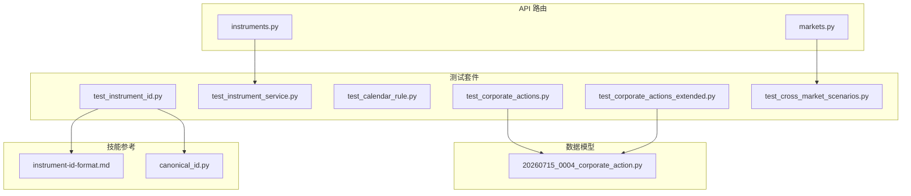
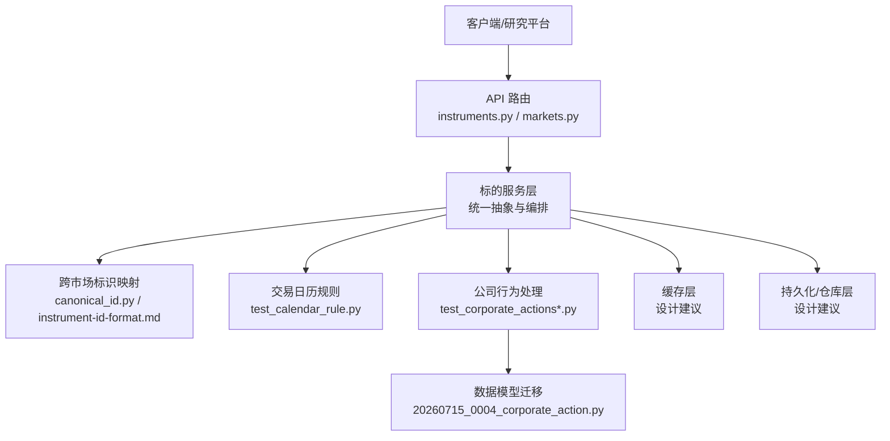
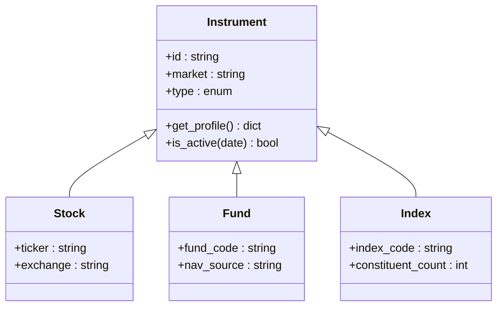
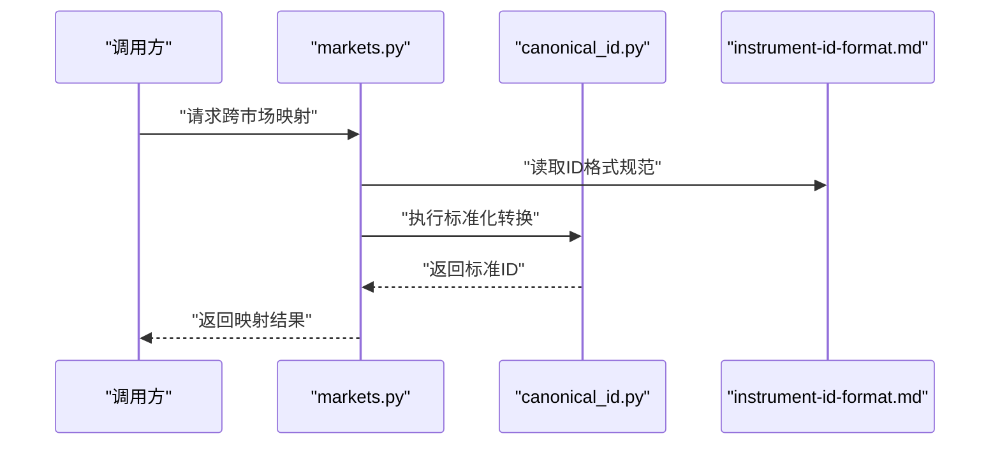
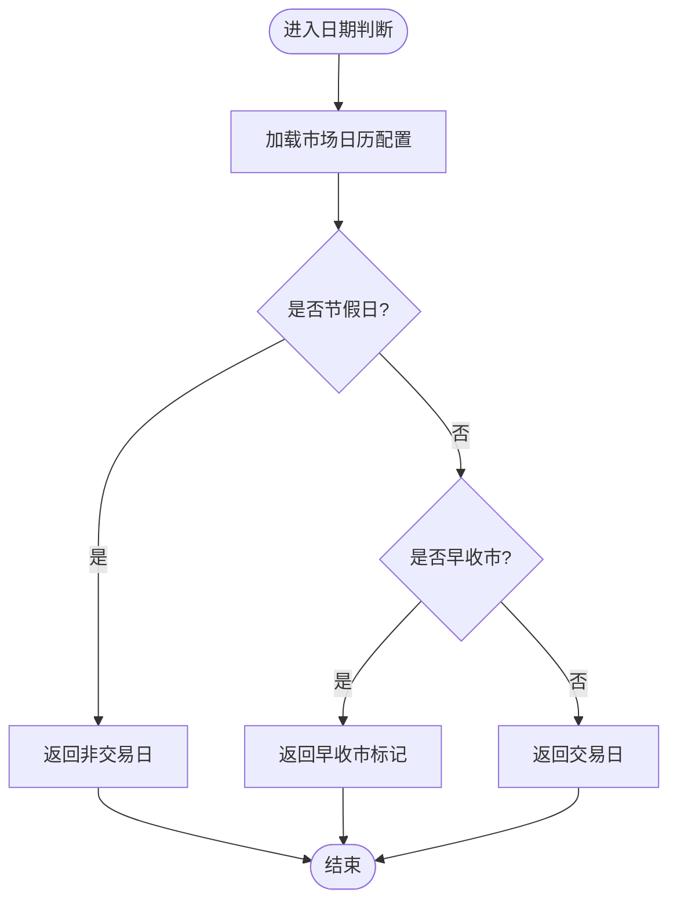
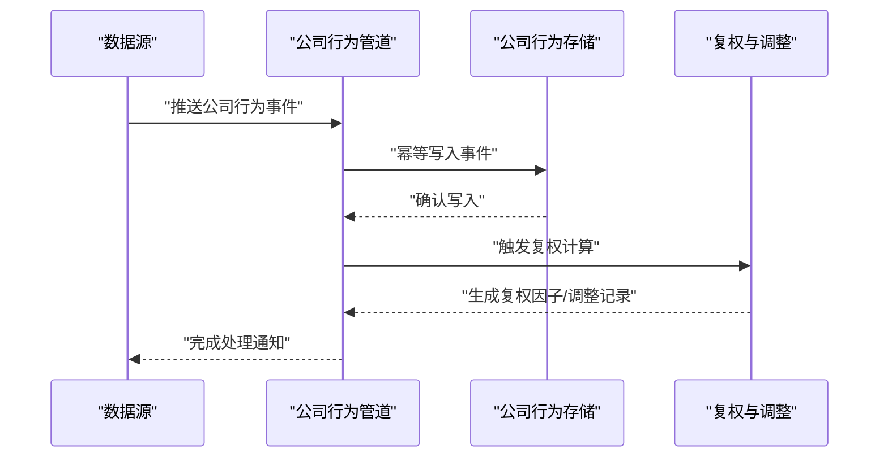
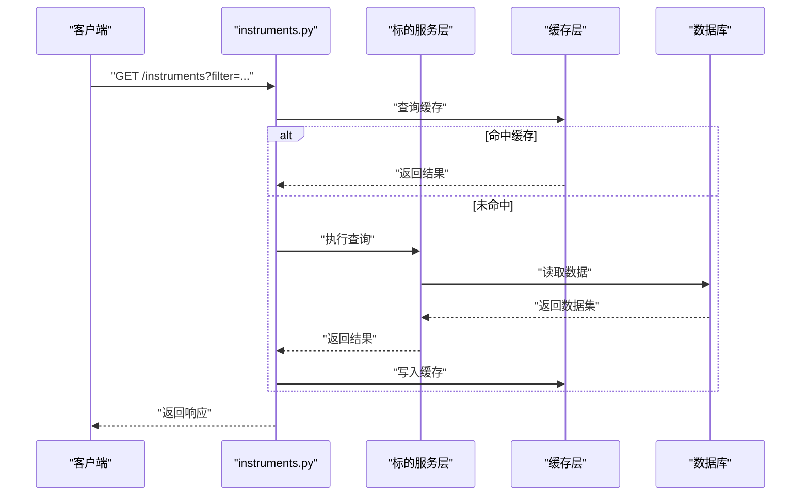
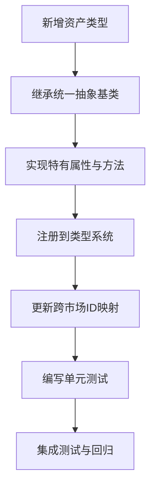
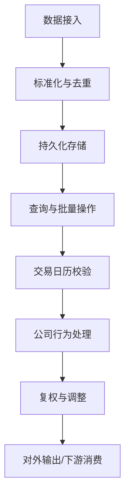
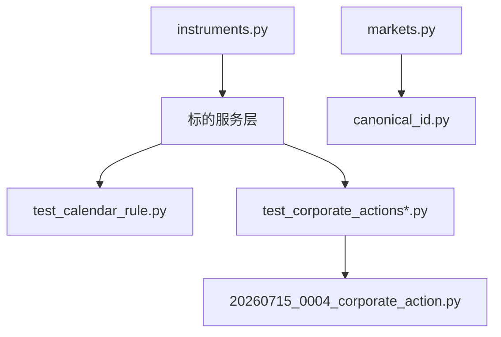

# 投资标的框架

<cite>
**本文引用的文件**   
- [instruments.py](file://apps/api/routers/instruments.py)
- [markets.py](file://apps/api/routers/markets.py)
- [test_instrument_service.py](file://tests/unit/test_instrument_service.py)
- [test_instrument_id.py](file://tests/unit/test_instrument_id.py)
- [test_calendar_rule.py](file://tests/unit/test_calendar_rule.py)
- [test_corporate_actions.py](file://tests/unit/test_corporate_actions.py)
- [test_corporate_actions_extended.py](file://tests/unit/test_corporate_actions_extended.py)
- [test_cross_market_scenarios.py](file://tests/unit/test_cross_market_scenarios.py)
- [20260715_0004_corporate_action.py](file://sql/migrations/20260715_0004_corporate_action.py)
- [canonical_id.py](file://skills/cross-market-quant-research/scripts/canonical_id.py)
- [instrument-id-format.md](file://skills/cross-market-quant-research/references/instrument-id-format.md)
</cite>

## 目录
1. [简介](#简介)
2. [项目结构](#项目结构)
3. [核心组件](#核心组件)
4. [架构总览](#架构总览)
5. [详细组件分析](#详细组件分析)
6. [依赖关系分析](#依赖关系分析)
7. [性能考虑](#性能考虑)
8. [故障排查指南](#故障排查指南)
9. [结论](#结论)
10. [附录](#附录)

## 简介
本文件围绕“投资标的框架模块”进行系统化文档化，聚焦以下目标：
- 统一投资标的抽象层：对股票、基金、指数等资产类型提供一致的标识、查询与操作接口。
- 跨市场识别与映射：支持多市场（如A股、美股、基金）的标准化标识与互转。
- 交易日历规则与节假日处理：定义可配置的交易日判定逻辑，支撑回测与实盘一致性。
- 公司行为处理框架：对分红、拆股、配股等事件进行标准化建模与处理。
- 扩展新资产类型：提供清晰的扩展点与开发指南。
- 标的信息查询、批量操作与缓存策略：覆盖API路由、测试用例与工程实践建议。
- 实战示例：通过测试与迁移脚本路径展示关键实现位置，便于快速定位代码。

## 项目结构
与投资标的相关的核心代码分布在以下位置：
- API 路由层：提供标的与市场的查询接口
  - apps/api/routers/instruments.py
  - apps/api/routers/markets.py
- 单元测试：覆盖标的ID、服务、日历规则、公司行为、跨市场场景
  - tests/unit/test_instrument_id.py
  - tests/unit/test_instrument_service.py
  - tests/unit/test_calendar_rule.py
  - tests/unit/test_corporate_actions.py
  - tests/unit/test_corporate_actions_extended.py
  - tests/unit/test_cross_market_scenarios.py
- 数据模型迁移：公司行为表结构
  - sql/migrations/20260715_0004_corporate_action.py
- 技能参考与脚本：跨市场标的ID规范与工具
  - skills/cross-market-quant-research/references/instrument-id-format.md
  - skills/cross-market-quant-research/scripts/canonical_id.py

图表来源
- [instruments.py](file://apps/api/routers/instruments.py)
- [markets.py](file://apps/api/routers/markets.py)
- [test_instrument_id.py](file://tests/unit/test_instrument_id.py)
- [test_instrument_service.py](file://tests/unit/test_instrument_service.py)
- [test_calendar_rule.py](file://tests/unit/test_calendar_rule.py)
- [test_corporate_actions.py](file://tests/unit/test_corporate_actions.py)
- [test_corporate_actions_extended.py](file://tests/unit/test_corporate_actions_extended.py)
- [test_cross_market_scenarios.py](file://tests/unit/test_cross_market_scenarios.py)
- [20260715_0004_corporate_action.py](file://sql/migrations/20260715_0004_corporate_action.py)
- [instrument-id-format.md](file://skills/cross-market-quant-research/references/instrument-id-format.md)
- [canonical_id.py](file://skills/cross-market-quant-research/scripts/canonical_id.py)

章节来源
- [instruments.py](file://apps/api/routers/instruments.py)
- [markets.py](file://apps/api/routers/markets.py)
- [test_instrument_id.py](file://tests/unit/test_instrument_id.py)
- [test_instrument_service.py](file://tests/unit/test_instrument_service.py)
- [test_calendar_rule.py](file://tests/unit/test_calendar_rule.py)
- [test_corporate_actions.py](file://tests/unit/test_corporate_actions.py)
- [test_corporate_actions_extended.py](file://tests/unit/test_corporate_actions_extended.py)
- [test_cross_market_scenarios.py](file://tests/unit/test_cross_market_scenarios.py)
- [20260715_0004_corporate_action.py](file://sql/migrations/20260715_0004_corporate_action.py)
- [instrument-id-format.md](file://skills/cross-market-quant-research/references/instrument-id-format.md)
- [canonical_id.py](file://skills/cross-market-quant-research/scripts/canonical_id.py)

## 核心组件
- 统一标的抽象层
  - 职责：为不同资产类型（股票、基金、指数等）提供统一的标识、属性与查询能力。
  - 关键点：标准化ID格式、跨市场映射、可扩展的资产类型注册机制。
- 跨市场识别与映射
  - 职责：将不同市场的本地代码转换为全局唯一标识，并支持反向解析。
  - 关键点：ID规范、转换脚本、校验器。
- 交易日历与节假日
  - 职责：定义交易日判定规则，支持多市场日历与节假日配置。
  - 关键点：规则引擎、时区与夏令时处理、回测一致性。
- 公司行为处理框架
  - 职责：对分红、拆股、配股等事件进行标准化建模、存储与回放。
  - 关键点：事件模型、幂等写入、价格复权与持仓调整。
- 查询与批量操作
  - 职责：提供REST接口与批量处理能力，满足研究与生产需求。
  - 关键点：分页、过滤、并发控制、错误聚合。
- 缓存策略
  - 职责：提升高频查询性能，降低后端压力。
  - 关键点：多级缓存、失效策略、一致性保障。

章节来源
- [instruments.py](file://apps/api/routers/instruments.py)
- [markets.py](file://apps/api/routers/markets.py)
- [test_instrument_id.py](file://tests/unit/test_instrument_id.py)
- [test_instrument_service.py](file://tests/unit/test_instrument_service.py)
- [test_calendar_rule.py](file://tests/unit/test_calendar_rule.py)
- [test_corporate_actions.py](file://tests/unit/test_corporate_actions.py)
- [test_corporate_actions_extended.py](file://tests/unit/test_corporate_actions_extended.py)
- [test_cross_market_scenarios.py](file://tests/unit/test_cross_market_scenarios.py)
- [20260715_0004_corporate_action.py](file://sql/migrations/20260715_0004_corporate_action.py)
- [instrument-id-format.md](file://skills/cross-market-quant-research/references/instrument-id-format.md)
- [canonical_id.py](file://skills/cross-market-quant-research/scripts/canonical_id.py)

## 架构总览
整体架构以“统一标的抽象层”为核心，向上暴露API路由，向下对接数据模型与外部源；横向由跨市场映射、交易日历与公司行为三大子系统协同工作。

图表来源
- [instruments.py](file://apps/api/routers/instruments.py)
- [markets.py](file://apps/api/routers/markets.py)
- [test_instrument_id.py](file://tests/unit/test_instrument_id.py)
- [test_calendar_rule.py](file://tests/unit/test_calendar_rule.py)
- [test_corporate_actions.py](file://tests/unit/test_corporate_actions.py)
- [test_corporate_actions_extended.py](file://tests/unit/test_corporate_actions_extended.py)
- [20260715_0004_corporate_action.py](file://sql/migrations/20260715_0004_corporate_action.py)
- [canonical_id.py](file://skills/cross-market-quant-research/scripts/canonical_id.py)
- [instrument-id-format.md](file://skills/cross-market-quant-research/references/instrument-id-format.md)

## 详细组件分析

### 统一标的抽象层
- 设计要点
  - 统一标识：采用跨市场标准ID格式，屏蔽市场差异。
  - 类型抽象：股票、基金、指数等作为具体实现，共享通用属性与方法。
  - 扩展点：通过注册表或工厂模式新增资产类型。
- 相关实现位置
  - 测试验证了ID与服务能力：[test_instrument_id.py](file://tests/unit/test_instrument_id.py)、[test_instrument_service.py](file://tests/unit/test_instrument_service.py)
  - 跨市场ID规范与脚本：[instrument-id-format.md](file://skills/cross-market-quant-research/references/instrument-id-format.md)、[canonical_id.py](file://skills/cross-market-quant-research/scripts/canonical_id.py)

图表来源
- [test_instrument_id.py](file://tests/unit/test_instrument_id.py)
- [test_instrument_service.py](file://tests/unit/test_instrument_service.py)
- [instrument-id-format.md](file://skills/cross-market-quant-research/references/instrument-id-format.md)
- [canonical_id.py](file://skills/cross-market-quant-research/scripts/canonical_id.py)

章节来源
- [test_instrument_id.py](file://tests/unit/test_instrument_id.py)
- [test_instrument_service.py](file://tests/unit/test_instrument_service.py)
- [instrument-id-format.md](file://skills/cross-market-quant-research/references/instrument-id-format.md)
- [canonical_id.py](file://skills/cross-market-quant-research/scripts/canonical_id.py)

### 跨市场标的识别与映射
- 设计要点
  - 输入：市场+本地代码（如 A股.SH.600000、美股.NYSE.AAPL）。
  - 输出：全局唯一标准ID（Canonical ID），用于跨系统一致引用。
  - 反向解析：从标准ID还原市场与本地代码，便于展示与溯源。
- 相关实现位置
  - 规范文档与转换脚本：[instrument-id-format.md](file://skills/cross-market-quant-research/references/instrument-id-format.md)、[canonical_id.py](file://skills/cross-market-quant-research/scripts/canonical_id.py)
  - 跨市场场景测试：[test_cross_market_scenarios.py](file://tests/unit/test_cross_market_scenarios.py)

图表来源
- [markets.py](file://apps/api/routers/markets.py)
- [canonical_id.py](file://skills/cross-market-quant-research/scripts/canonical_id.py)
- [instrument-id-format.md](file://skills/cross-market-quant-research/references/instrument-id-format.md)
- [test_cross_market_scenarios.py](file://tests/unit/test_cross_market_scenarios.py)

章节来源
- [markets.py](file://apps/api/routers/markets.py)
- [canonical_id.py](file://skills/cross-market-quant-research/scripts/canonical_id.py)
- [instrument-id-format.md](file://skills/cross-market-quant-research/references/instrument-id-format.md)
- [test_cross_market_scenarios.py](file://tests/unit/test_cross_market_scenarios.py)

### 交易日历规则与节假日处理
- 设计要点
  - 规则引擎：按市场加载日历配置（工作日、节假日、早收市等）。
  - 时间对齐：确保回测与实盘在相同日历下运行，避免偏移。
  - 扩展性：支持新增市场与自定义规则。
- 相关实现位置
  - 规则测试覆盖：[test_calendar_rule.py](file://tests/unit/test_calendar_rule.py)

图表来源
- [test_calendar_rule.py](file://tests/unit/test_calendar_rule.py)

章节来源
- [test_calendar_rule.py](file://tests/unit/test_calendar_rule.py)

### 公司行为处理框架
- 设计要点
  - 事件模型：标准化记录分红、拆股、配股等事件，包含生效日期、比例/金额等字段。
  - 幂等写入：同一事件多次入库不重复影响。
  - 复权与调整：基于事件序列计算复权因子，调整历史价格与持仓数量。
- 相关实现位置
  - 数据模型迁移：[20260715_0004_corporate_action.py](file://sql/migrations/20260715_0004_corporate_action.py)
  - 单元测试覆盖：[test_corporate_actions.py](file://tests/unit/test_corporate_actions.py)、[test_corporate_actions_extended.py](file://tests/unit/test_corporate_actions_extended.py)

图表来源
- [20260715_0004_corporate_action.py](file://sql/migrations/20260715_0004_corporate_action.py)
- [test_corporate_actions.py](file://tests/unit/test_corporate_actions.py)
- [test_corporate_actions_extended.py](file://tests/unit/test_corporate_actions_extended.py)

章节来源
- [20260715_0004_corporate_action.py](file://sql/migrations/20260715_0004_corporate_action.py)
- [test_corporate_actions.py](file://tests/unit/test_corporate_actions.py)
- [test_corporate_actions_extended.py](file://tests/unit/test_corporate_actions_extended.py)

### 标的信息查询与批量操作（API）
- 设计要点
  - 查询接口：支持按标准ID、市场+本地代码、类型过滤等条件检索。
  - 批量操作：支持批量创建、更新、删除与状态同步。
  - 错误处理：聚合错误信息，保证部分失败不影响整体事务边界。
- 相关实现位置
  - 路由实现：[instruments.py](file://apps/api/routers/instruments.py)
  - 市场相关路由：[markets.py](file://apps/api/routers/markets.py)

图表来源
- [instruments.py](file://apps/api/routers/instruments.py)
- [markets.py](file://apps/api/routers/markets.py)

章节来源
- [instruments.py](file://apps/api/routers/instruments.py)
- [markets.py](file://apps/api/routers/markets.py)

### 新资产类型扩展指南
- 步骤概览
  - 定义资产类型：继承统一标的抽象基类，补充特有属性与方法。
  - 注册类型：在类型注册表中登记新类型，供路由与服务发现。
  - 适配ID映射：在跨市场映射中增加该类型的编码/解码规则。
  - 编写测试：覆盖ID转换、查询、公司行为与日历交互。
- 参考实现位置
  - 类型与ID规范：[instrument-id-format.md](file://skills/cross-market-quant-research/references/instrument-id-format.md)、[canonical_id.py](file://skills/cross-market-quant-research/scripts/canonical_id.py)
  - 服务与ID测试：[test_instrument_service.py](file://tests/unit/test_instrument_service.py)、[test_instrument_id.py](file://tests/unit/test_instrument_id.py)

图表来源
- [instrument-id-format.md](file://skills/cross-market-quant-research/references/instrument-id-format.md)
- [canonical_id.py](file://skills/cross-market-quant-research/scripts/canonical_id.py)
- [test_instrument_service.py](file://tests/unit/test_instrument_service.py)
- [test_instrument_id.py](file://tests/unit/test_instrument_id.py)

章节来源
- [instrument-id-format.md](file://skills/cross-market-quant-research/references/instrument-id-format.md)
- [canonical_id.py](file://skills/cross-market-quant-research/scripts/canonical_id.py)
- [test_instrument_service.py](file://tests/unit/test_instrument_service.py)
- [test_instrument_id.py](file://tests/unit/test_instrument_id.py)

### 概念总览
下图展示了标的管理在公司行为与日历约束下的端到端流程，帮助理解各组件协作方式。

[此图为概念流程图，无需图表来源]

## 依赖关系分析
- 组件耦合
  - API路由依赖服务层与缓存层，服务层依赖跨市场映射、日历规则与公司行为处理。
  - 公司行为处理依赖数据模型迁移定义的表结构。
- 外部依赖
  - 跨市场ID规范与脚本为外部参考与工具。
- 潜在循环依赖
  - 当前结构清晰分层，未见明显循环依赖风险。

图表来源
- [instruments.py](file://apps/api/routers/instruments.py)
- [markets.py](file://apps/api/routers/markets.py)
- [test_calendar_rule.py](file://tests/unit/test_calendar_rule.py)
- [test_corporate_actions.py](file://tests/unit/test_corporate_actions.py)
- [test_corporate_actions_extended.py](file://tests/unit/test_corporate_actions_extended.py)
- [20260715_0004_corporate_action.py](file://sql/migrations/20260715_0004_corporate_action.py)
- [canonical_id.py](file://skills/cross-market-quant-research/scripts/canonical_id.py)

章节来源
- [instruments.py](file://apps/api/routers/instruments.py)
- [markets.py](file://apps/api/routers/markets.py)
- [test_calendar_rule.py](file://tests/unit/test_calendar_rule.py)
- [test_corporate_actions.py](file://tests/unit/test_corporate_actions.py)
- [test_corporate_actions_extended.py](file://tests/unit/test_corporate_actions_extended.py)
- [20260715_0004_corporate_action.py](file://sql/migrations/20260715_0004_corporate_action.py)
- [canonical_id.py](file://skills/cross-market-quant-research/scripts/canonical_id.py)

## 性能考虑
- 查询优化
  - 使用索引与分页减少大结果集传输开销。
  - 热点数据采用多级缓存（内存+分布式），设置合理过期与失效策略。
- 批处理
  - 批量写入采用事务与分批提交，避免长事务锁竞争。
- 公司行为处理
  - 复权计算增量更新，避免全量重算。
  - 事件幂等写入，防止重复处理导致的数据膨胀。
- 日历规则
  - 预计算常用市场日历，减少运行时判断成本。

[本节为通用指导，无需章节来源]

## 故障排查指南
- 常见问题
  - 跨市场ID不一致：检查ID规范与转换脚本版本一致性。
  - 公司行为缺失或重复：核对幂等键与事件时间戳，确认写入顺序。
  - 日历偏差：对比多市场日历配置，确认节假日与早收市规则。
- 定位方法
  - 查看对应测试用例，复现问题路径：
    - 标的ID与服务：[test_instrument_id.py](file://tests/unit/test_instrument_id.py)、[test_instrument_service.py](file://tests/unit/test_instrument_service.py)
    - 公司行为：[test_corporate_actions.py](file://tests/unit/test_corporate_actions.py)、[test_corporate_actions_extended.py](file://tests/unit/test_corporate_actions_extended.py)
    - 跨市场场景：[test_cross_market_scenarios.py](file://tests/unit/test_cross_market_scenarios.py)
    - 日历规则：[test_calendar_rule.py](file://tests/unit/test_calendar_rule.py)
- 修复建议
  - 修正ID映射规则与常量配置。
  - 完善幂等键设计与重试策略。
  - 校准日历配置与时间戳时区。

章节来源
- [test_instrument_id.py](file://tests/unit/test_instrument_id.py)
- [test_instrument_service.py](file://tests/unit/test_instrument_service.py)
- [test_corporate_actions.py](file://tests/unit/test_corporate_actions.py)
- [test_corporate_actions_extended.py](file://tests/unit/test_corporate_actions_extended.py)
- [test_cross_market_scenarios.py](file://tests/unit/test_cross_market_scenarios.py)
- [test_calendar_rule.py](file://tests/unit/test_calendar_rule.py)

## 结论
本框架通过统一标的抽象层、跨市场映射、交易日历与公司行为处理四大支柱，构建了可扩展、高一致性的投资标的管理体系。配合API路由与测试用例，能够快速落地多资产类型管理与复杂业务场景。建议在后续迭代中持续完善缓存策略、批处理与监控指标，以提升稳定性与性能。

[本节为总结性内容，无需章节来源]

## 附录
- 实战示例路径（不含代码片段）
  - 标的ID与服务能力验证：[test_instrument_id.py](file://tests/unit/test_instrument_id.py)、[test_instrument_service.py](file://tests/unit/test_instrument_service.py)
  - 跨市场映射与场景：[test_cross_market_scenarios.py](file://tests/unit/test_cross_market_scenarios.py)、[canonical_id.py](file://skills/cross-market-quant-research/scripts/canonical_id.py)、[instrument-id-format.md](file://skills/cross-market-quant-research/references/instrument-id-format.md)
  - 公司行为处理与模型：[test_corporate_actions.py](file://tests/unit/test_corporate_actions.py)、[test_corporate_actions_extended.py](file://tests/unit/test_corporate_actions_extended.py)、[20260715_0004_corporate_action.py](file://sql/migrations/20260715_0004_corporate_action.py)
  - 交易日历规则：[test_calendar_rule.py](file://tests/unit/test_calendar_rule.py)
  - 查询与批量操作API：[instruments.py](file://apps/api/routers/instruments.py)、[markets.py](file://apps/api/routers/markets.py)

[本节为参考路径汇总，无需章节来源]