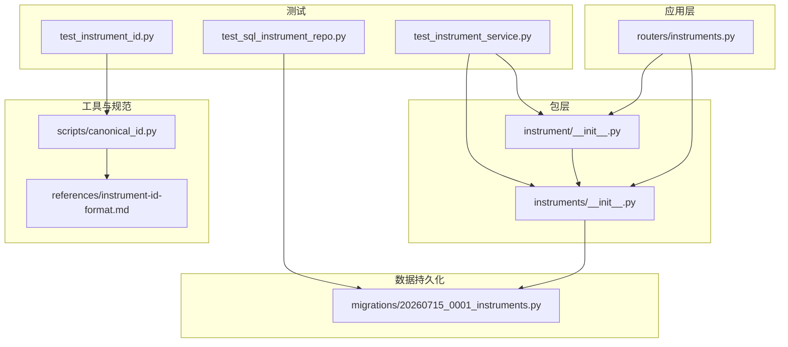
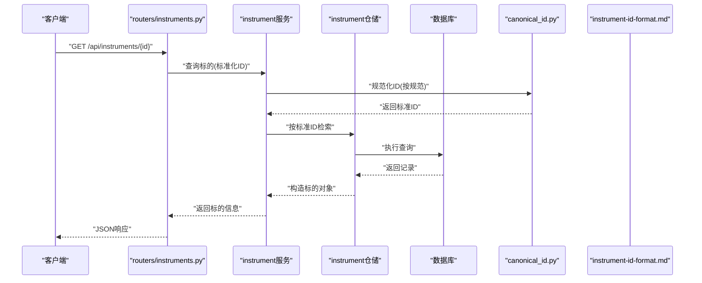
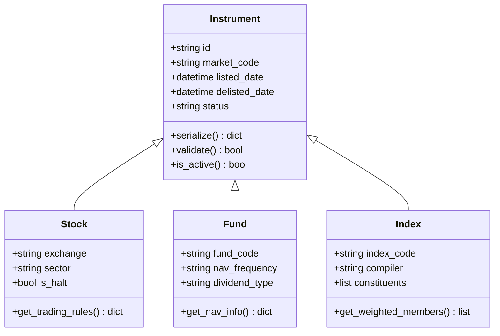
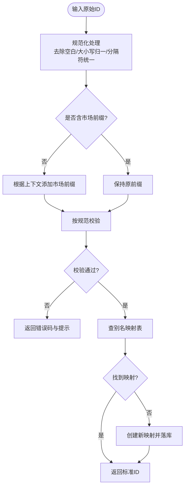
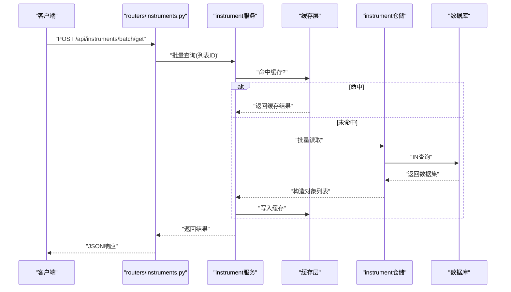
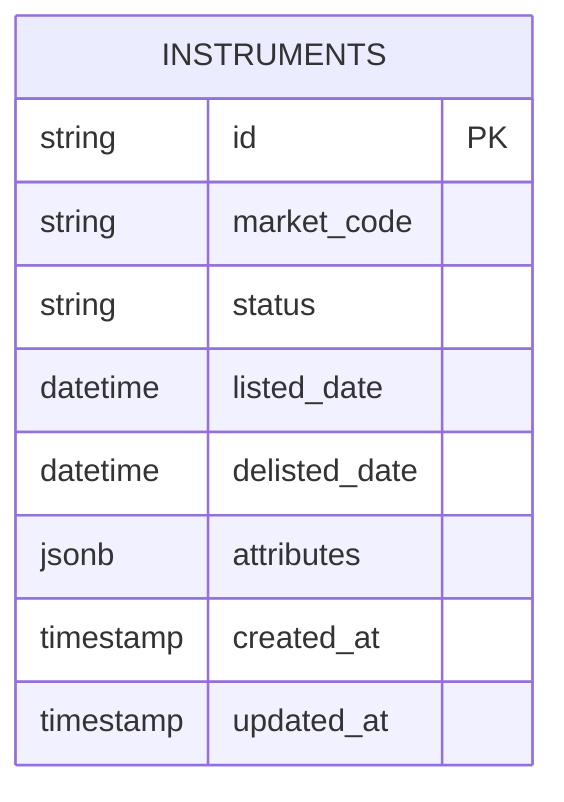
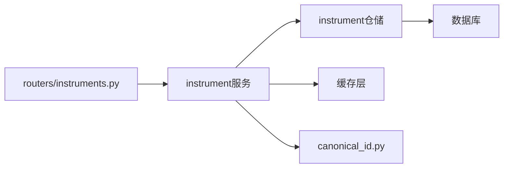

# 标的抽象层

<cite>
**本文引用的文件**   
- [apps/api/routers/instruments.py](file://apps/api/routers/instruments.py)
- [packages/instrument/__init__.py](file://packages/instrument/__init__.py)
- [packages/instruments/__init__.py](file://packages/instruments/__init__.py)
- [scripts/canonical_id.py](file://scripts/canonical_id.py)
- [skills/cross-market-quant-research/references/instrument-id-format.md](file://skills/cross-market-quant-research/references/instrument-id-format.md)
- [tests/unit/test_instrument_id.py](file://tests/unit/test_instrument_id.py)
- [tests/unit/test_instrument_service.py](file://tests/unit/test_instrument_service.py)
- [tests/unit/test_sql_instrument_repo.py](file://tests/unit/test_sql_instrument_repo.py)
- [sql/migrations/20260715_0001_instruments.py](file://sql/migrations/20260715_0001_instruments.py)
</cite>

## 目录
1. [简介](#简介)
2. [项目结构](#项目结构)
3. [核心组件](#核心组件)
4. [架构总览](#架构总览)
5. [详细组件分析](#详细组件分析)
6. [依赖关系分析](#依赖关系分析)
7. [性能考虑](#性能考虑)
8. [故障排查指南](#故障排查指南)
9. [结论](#结论)
10. [附录](#附录)

## 简介
本文件围绕“投资标的抽象层”进行系统化说明，重点覆盖：
- 统一标的抽象设计原理与Instrument基类架构
- 资产类型继承体系（股票、基金、指数等）及其特殊属性与处理方法
- 跨市场标的识别机制与ID标准化格式、映射规则
- 标的信息查询API、批量操作方法与缓存策略
- 新资产类型扩展指南（必需接口实现与验证规则）
- 使用示例路径（创建、查询、类型转换）

## 项目结构
与标的抽象层直接相关的代码主要分布在以下位置：
- 应用层API路由：提供标的查询与操作的HTTP接口
- 包层抽象与实现：定义Instrument基类、资产类型派生类、服务与仓储
- 脚本与规范：ID规范化脚本与跨市场ID格式规范
- 测试：对ID、服务、仓储的单元测试
- 数据库迁移：标的表结构与字段定义

图表来源
- [apps/api/routers/instruments.py](file://apps/api/routers/instruments.py)
- [packages/instrument/__init__.py](file://packages/instrument/__init__.py)
- [packages/instruments/__init__.py](file://packages/instruments/__init__.py)
- [scripts/canonical_id.py](file://scripts/canonical_id.py)
- [skills/cross-market-quant-research/references/instrument-id-format.md](file://skills/cross-market-quant-research/references/instrument-id-format.md)
- [tests/unit/test_instrument_id.py](file://tests/unit/test_instrument_id.py)
- [tests/unit/test_instrument_service.py](file://tests/unit/test_instrument_service.py)
- [tests/unit/test_sql_instrument_repo.py](file://tests/unit/test_sql_instrument_repo.py)
- [sql/migrations/20260715_0001_instruments.py](file://sql/migrations/20260715_0001_instruments.py)

章节来源
- [apps/api/routers/instruments.py](file://apps/api/routers/instruments.py)
- [packages/instrument/__init__.py](file://packages/instrument/__init__.py)
- [packages/instruments/__init__.py](file://packages/instruments/__init__.py)
- [scripts/canonical_id.py](file://scripts/canonical_id.py)
- [skills/cross-market-quant-research/references/instrument-id-format.md](file://skills/cross-market-quant-research/references/instrument-id-format.md)
- [tests/unit/test_instrument_id.py](file://tests/unit/test_instrument_id.py)
- [tests/unit/test_instrument_service.py](file://tests/unit/test_instrument_service.py)
- [tests/unit/test_sql_instrument_repo.py](file://tests/unit/test_sql_instrument_repo.py)
- [sql/migrations/20260715_0001_instruments.py](file://sql/migrations/20260715_0001_instruments.py)

## 核心组件
本节聚焦于标的抽象层的核心构件与职责划分：
- Instrument基类：定义统一的标的元数据、生命周期、跨市场标识与通用方法
- 资产类型派生类：针对股票、基金、指数等资产类型的特有属性与处理逻辑
- 服务层：封装查询、批量操作、缓存策略与事务边界
- 仓储层：对接数据库，负责持久化与检索
- ID规范化与映射：跨市场ID标准化、别名解析与校验

章节来源
- [packages/instrument/__init__.py](file://packages/instrument/__init__.py)
- [packages/instruments/__init__.py](file://packages/instruments/__init__.py)
- [sql/migrations/20260715_0001_instruments.py](file://sql/migrations/20260715_0001_instruments.py)

## 架构总览
下图展示从API到存储层的端到端调用链，以及ID规范化在流程中的介入点。

图表来源
- [apps/api/routers/instruments.py](file://apps/api/routers/instruments.py)
- [packages/instrument/__init__.py](file://packages/instrument/__init__.py)
- [packages/instruments/__init__.py](file://packages/instruments/__init__.py)
- [scripts/canonical_id.py](file://scripts/canonical_id.py)
- [skills/cross-market-quant-research/references/instrument-id-format.md](file://skills/cross-market-quant-research/references/instrument-id-format.md)
- [sql/migrations/20260715_0001_instruments.py](file://sql/migrations/20260715_0001_instruments.py)

## 详细组件分析

### Instrument基类与资产类型继承体系
- 基类职责
  - 统一标识：维护跨市场唯一ID、市场代码、交易时段、币种等基础字段
  - 生命周期：上市/退市时间、状态、版本控制
  - 通用方法：序列化、反序列化、校验、类型判断
- 资产类型派生
  - 股票：证券代码、交易所、行业分类、涨跌停规则等
  - 基金：基金代码、净值频率、分红方式、托管行等
  - 指数：指数代码、编制机构、权重规则、成分股集合等
- 跨市场识别
  - 通过市场代码与ID前缀组合形成全局唯一键
  - 支持多源别名映射与冲突消解

图表来源
- [packages/instrument/__init__.py](file://packages/instrument/__init__.py)
- [packages/instruments/__init__.py](file://packages/instruments/__init__.py)

章节来源
- [packages/instrument/__init__.py](file://packages/instrument/__init__.py)
- [packages/instruments/__init__.py](file://packages/instruments/__init__.py)

### 标的ID标准化与映射规则
- 标准化目标
  - 消除大小写、空格、分隔符差异
  - 统一市场前缀与后缀约定
  - 保证跨市场唯一性与可排序性
- 映射规则
  - 别名到标准ID的映射表
  - 冲突检测与回退策略
  - 校验失败时的错误码与提示
- 参考规范
  - 详见跨市场ID格式文档，包含命名空间、分隔符、长度限制与保留字

图表来源
- [scripts/canonical_id.py](file://scripts/canonical_id.py)
- [skills/cross-market-quant-research/references/instrument-id-format.md](file://skills/cross-market-quant-references/instrument-id-format.md)
- [tests/unit/test_instrument_id.py](file://tests/unit/test_instrument_id.py)

章节来源
- [scripts/canonical_id.py](file://scripts/canonical_id.py)
- [skills/cross-market-quant-research/references/instrument-id-format.md](file://skills/cross-market-quant-research/references/instrument-id-format.md)
- [tests/unit/test_instrument_id.py](file://tests/unit/test_instrument_id.py)

### 标的信息查询API与批量操作
- 查询接口
  - 单标的基本信息、历史状态、关联事件
  - 支持按标准ID、别名、市场+代码组合查询
- 批量操作
  - 批量获取、批量更新状态、批量导入导出
  - 分页与游标优化，避免大结果集阻塞
- 路由组织
  - 路由文件集中管理，参数校验、异常包装、日志埋点

图表来源
- [apps/api/routers/instruments.py](file://apps/api/routers/instruments.py)
- [packages/instrument/__init__.py](file://packages/instrument/__init__.py)
- [packages/instruments/__init__.py](file://packages/instruments/__init__.py)

章节来源
- [apps/api/routers/instruments.py](file://apps/api/routers/instruments.py)

### 仓储层与数据库模型
- 表结构
  - 主键：标准ID
  - 索引：市场代码、状态、更新时间
  - 字段：基础元数据、扩展属性JSON、审计字段
- 仓储接口
  - 按ID查询、条件过滤、分页、批量写入
  - 事务边界与重试策略
- 迁移脚本
  - 定义初始表结构、约束与默认值

图表来源
- [sql/migrations/20260715_0001_instruments.py](file://sql/migrations/20260715_0001_instruments.py)

章节来源
- [sql/migrations/20260715_0001_instruments.py](file://sql/migrations/20260715_0001_instruments.py)
- [tests/unit/test_sql_instrument_repo.py](file://tests/unit/test_sql_instrument_repo.py)

### 缓存策略
- 缓存粒度
  - 以标准ID为键，对象序列化为值
  - 批量查询采用复合键或布隆过滤器预检
- 失效策略
  - 基于更新时间戳失效
  - 事件驱动失效（如停牌、退市）
- 一致性保障
  - 读写穿透与双写保护
  - 热点键防抖与限流

章节来源
- [packages/instrument/__init__.py](file://packages/instrument/__init__.py)
- [packages/instruments/__init__.py](file://packages/instruments/__init__.py)

### 新资产类型扩展指南
- 必需接口实现
  - 继承Instrument基类，实现特有属性与方法
  - 提供序列化/反序列化与校验逻辑
- 注册与发现
  - 在资产类型注册表中声明新类型
  - 确保ID前缀与命名空间不冲突
- 验证规则
  - 遵循ID格式规范，通过单元测试覆盖边界用例
  - 引入专项校验器（如基金净值频率、指数成分数范围）
- 示例路径
  - 参考现有资产类型的实现与测试，定位新增类的定义与用法

章节来源
- [packages/instrument/__init__.py](file://packages/instrument/__init__.py)
- [packages/instruments/__init__.py](file://packages/instruments/__init__.py)
- [tests/unit/test_instrument_service.py](file://tests/unit/test_instrument_service.py)

## 依赖关系分析
- 模块耦合
  - API路由依赖服务层；服务层依赖仓储层与缓存层
  - ID规范化脚本独立于业务，被服务层与测试引用
- 外部依赖
  - 数据库访问由仓储层封装
  - 缓存系统通过服务层注入
- 循环依赖检查
  - 当前分层清晰，未见循环导入迹象

图表来源
- [apps/api/routers/instruments.py](file://apps/api/routers/instruments.py)
- [packages/instrument/__init__.py](file://packages/instrument/__init__.py)
- [packages/instruments/__init__.py](file://packages/instruments/__init__.py)
- [scripts/canonical_id.py](file://scripts/canonical_id.py)

章节来源
- [apps/api/routers/instruments.py](file://apps/api/routers/instruments.py)
- [packages/instrument/__init__.py](file://packages/instrument/__init__.py)
- [packages/instruments/__init__.py](file://packages/instruments/__init__.py)
- [scripts/canonical_id.py](file://scripts/canonical_id.py)

## 性能考虑
- 查询优化
  - 使用标准ID作为主键，减少二次转换开销
  - 批量查询采用IN语句与分页游标
- 缓存命中率
  - 热点标的优先预热
  - 合理设置TTL与失效触发
- 并发控制
  - 读写分离与连接池配置
  - 限流与熔断保护

[本节为通用指导，无需特定文件来源]

## 故障排查指南
- 常见问题
  - ID不规范导致查询失败：检查规范化脚本与映射表
  - 缓存不一致：核对失效策略与事件驱动更新
  - 批量查询超时：检查分页参数与数据库索引
- 诊断步骤
  - 启用详细日志，记录ID规范化前后对比
  - 查看仓储层SQL执行计划与慢查询
  - 验证缓存键生成与过期时间
- 相关测试
  - 参考ID与服务层测试用例复现问题场景

章节来源
- [tests/unit/test_instrument_id.py](file://tests/unit/test_instrument_id.py)
- [tests/unit/test_instrument_service.py](file://tests/unit/test_instrument_service.py)
- [tests/unit/test_sql_instrument_repo.py](file://tests/unit/test_sql_instrument_repo.py)

## 结论
本抽象层通过统一的Instrument基类与清晰的资产类型继承体系，实现了跨市场标的的一致化管理。结合ID标准化、服务层缓存与仓储层持久化，提供了稳定高效的查询与批量操作能力。扩展新资产类型时，遵循接口契约与验证规则即可平滑接入。

[本节为总结性内容，无需特定文件来源]

## 附录
- 使用示例路径
  - 标的创建：参考服务层与仓储层测试用例中关于新建标的的流程
  - 标的查询：参考API路由与ID规范化脚本的使用方式
  - 类型转换：参考资产类型派生类的序列化/反序列化实现

章节来源
- [apps/api/routers/instruments.py](file://apps/api/routers/instruments.py)
- [scripts/canonical_id.py](file://scripts/canonical_id.py)
- [tests/unit/test_instrument_service.py](file://tests/unit/test_instrument_service.py)
- [tests/unit/test_sql_instrument_repo.py](file://tests/unit/test_sql_instrument_repo.py)