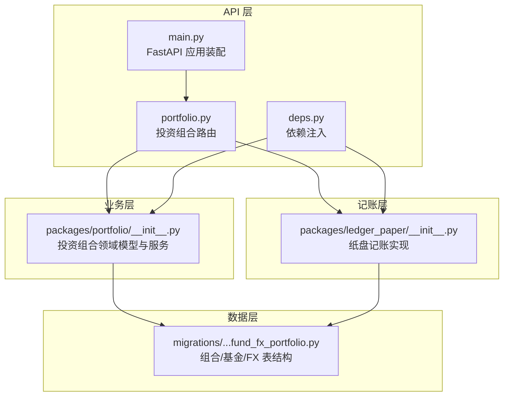
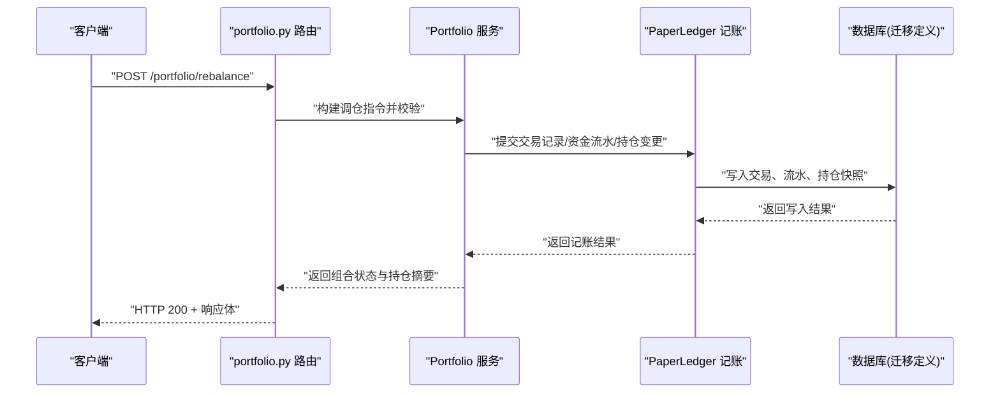
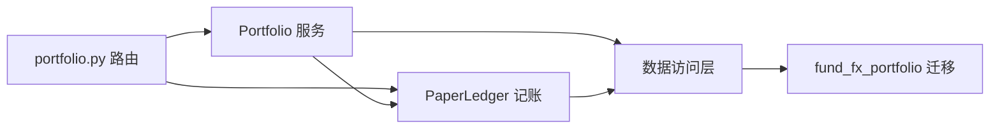

# 投资组合核心管理

<cite>
**本文引用的文件**   
- [apps/api/routers/portfolio.py](file://apps/api/routers/portfolio.py)
- [packages/portfolio/__init__.py](file://packages/portfolio/__init__.py)
- [packages/ledger_paper/__init__.py](file://packages/ledger_paper/__init__.py)
- [sql/migrations/20260715_0006_fund_fx_portfolio.py](file://sql/migrations/20260715_0006_fund_fx_portfolio.py)
- [apps/api/main.py](file://apps/api/main.py)
- [apps/api/deps.py](file://apps/api/deps.py)
</cite>

## 目录
1. [简介](#简介)
2. [项目结构](#项目结构)
3. [核心组件](#核心组件)
4. [架构总览](#架构总览)
5. [详细组件分析](#详细组件分析)
6. [依赖关系分析](#依赖关系分析)
7. [性能考虑](#性能考虑)
8. [故障排查指南](#故障排查指南)
9. [结论](#结论)
10. [附录](#附录)

## 简介
本文件面向“投资组合核心管理模块”，围绕账户结构设计、资产分类体系、仓位跟踪逻辑、持仓数据存储与更新机制、查询接口、记账系统（交易记录、资金流水、持仓变动）、组合调仓流程（指令生成、成交确认、持仓调整）、初始化与日常维护、绩效统计以及数据一致性与错误处理最佳实践进行系统化说明。文档以仓库中实际代码为依据，提供可追溯的源码路径与图示，帮助读者快速理解并落地使用。

## 项目结构
投资组合相关能力主要分布在以下位置：
- API 层：路由定义与请求处理入口
- 业务层：投资组合领域模型与服务编排
- 记账层：纸盘记账实现（交易、资金流水、持仓）
- 数据层：数据库迁移脚本（表结构与字段）
- 应用装配：API 服务启动与依赖注入

图表来源
- [apps/api/routers/portfolio.py](file://apps/api/routers/portfolio.py)
- [packages/portfolio/__init__.py](file://packages/portfolio/__init__.py)
- [packages/ledger_paper/__init__.py](file://packages/ledger_paper/__init__.py)
- [sql/migrations/20260715_0006_fund_fx_portfolio.py](file://sql/migrations/20260715_0006_fund_fx_portfolio.py)
- [apps/api/main.py](file://apps/api/main.py)
- [apps/api/deps.py](file://apps/api/deps.py)

章节来源
- [apps/api/routers/portfolio.py](file://apps/api/routers/portfolio.py)
- [packages/portfolio/__init__.py](file://packages/portfolio/__init__.py)
- [packages/ledger_paper/__init__.py](file://packages/ledger_paper/__init__.py)
- [sql/migrations/20260715_0006_fund_fx_portfolio.py](file://sql/migrations/20260715_0006_fund_fx_portfolio.py)
- [apps/api/main.py](file://apps/api/main.py)
- [apps/api/deps.py](file://apps/api/deps.py)

## 核心组件
- 投资组合路由层：暴露组合创建、调仓、查询等 HTTP 接口，负责参数校验、事务边界与响应封装。
- 投资组合业务层：承载组合生命周期管理、账户与资产分类、仓位跟踪、调仓执行与一致性保证。
- 纸盘记账层：提供交易记录、资金流水、持仓变动的原子化写入与查询，确保账实相符。
- 数据模型与迁移：通过 Alembic 迁移定义组合、基金、外汇等持久化结构，支撑组合与多资产类别的统一建模。

章节来源
- [apps/api/routers/portfolio.py](file://apps/api/routers/portfolio.py)
- [packages/portfolio/__init__.py](file://packages/portfolio/__init__.py)
- [packages/ledger_paper/__init__.py](file://packages/ledger_paper/__init__.py)
- [sql/migrations/20260715_0006_fund_fx_portfolio.py](file://sql/migrations/20260715_0006_fund_fx_portfolio.py)

## 架构总览
整体采用分层架构：API 路由接收请求，调用业务服务；业务服务协调记账与数据访问；数据层由迁移脚本定义的表结构承载。

图表来源
- [apps/api/routers/portfolio.py](file://apps/api/routers/portfolio.py)
- [packages/portfolio/__init__.py](file://packages/portfolio/__init__.py)
- [packages/ledger_paper/__init__.py](file://packages/ledger_paper/__init__.py)
- [sql/migrations/20260715_0006_fund_fx_portfolio.py](file://sql/migrations/20260715_0006_fund_fx_portfolio.py)

## 详细组件分析

### 投资组合路由层（portfolio.py）
职责
- 定义组合相关的 REST 接口，如创建组合、提交调仓、查询持仓与净值等。
- 解析请求体、校验必填字段、组装领域对象。
- 控制事务边界，将业务结果转换为统一响应格式。

关键流程
- 调仓接口：接收目标权重或数量，委托业务层生成订单、执行记账、更新组合状态。
- 查询接口：聚合当前持仓、可用资金、风险指标等视图。

建议关注点
- 幂等键设计：为调仓请求引入幂等键，避免重复提交导致重复记账。
- 输入校验：对标的、数量、价格、币种、时间戳等进行严格校验。
- 错误映射：将领域异常映射为明确的 HTTP 状态码与错误消息。

章节来源
- [apps/api/routers/portfolio.py](file://apps/api/routers/portfolio.py)

### 投资组合业务层（packages/portfolio/__init__.py）
职责
- 组合生命周期：创建、激活、冻结、归档。
- 账户与资产分类：按资产类别（股票、基金、债券、外汇等）组织账户与头寸。
- 仓位跟踪：计算市值、成本、盈亏、权重与集中度。
- 调仓执行：根据策略输出生成买入/卖出指令，驱动记账与持仓更新。
- 一致性保障：在事务内完成交易、流水、持仓快照的原子更新。

数据结构要点
- 组合实体：包含组合 ID、名称、基准、币种、状态、创建/更新时间等。
- 账户实体：关联组合，区分现金账户与证券账户，支持多币种。
- 资产分类：基于 instrument 维度，结合市场与类型标签进行分类。
- 头寸快照：按日或事件触发，记录持仓数量、成本价、市价、市值、权重等。

算法与复杂度
- 权重归一化：O(n)，n 为持仓标的数。
- 盈亏计算：O(n)，遍历持仓汇总未实现/已实现损益。
- 调仓重平衡：O(n log n)（排序/阈值比较），必要时二次扫描修正。

错误处理
- 资金不足、标的不可交易、价格越界、流动性不足等场景抛出明确异常。
- 回滚策略：任一子步骤失败即回滚整个调仓事务。

章节来源
- [packages/portfolio/__init__.py](file://packages/portfolio/__init__.py)

### 纸盘记账系统（packages/ledger_paper/__init__.py）
职责
- 交易记录：记录每笔成交的标的、方向、数量、价格、费用、时间戳。
- 资金流水：记录现金流入流出、手续费、分红派息、汇兑损益等。
- 持仓变动：记录每次成交后的持仓增量/减量与成本更新。
- 查询接口：按组合、标的、日期范围、交易类型等维度查询。

存储结构（与迁移对应）
- 交易表：主键、组合 ID、标的 ID、方向、数量、价格、费用、成交时间、流水号。
- 资金流水表：主键、组合 ID、科目（买卖、费用、分红、汇兑等）、金额、币种、时间、关联交易号。
- 持仓快照表：主键、组合 ID、标的 ID、数量、成本价、市价、市值、权重、快照时间。

一致性保证
- 事务内同时写入交易、流水、持仓快照，保证三表一致。
- 幂等键去重：同一幂等键仅允许一次成功写入。
- 外键约束：交易与流水均关联组合与标的，防止孤儿记录。

查询优化
- 常用索引：组合+时间、标的+时间、交易号、流水号。
- 分页与过滤：支持按时间窗口、交易类型、标的集合筛选。

章节来源
- [packages/ledger_paper/__init__.py](file://packages/ledger_paper/__init__.py)
- [sql/migrations/20260715_0006_fund_fx_portfolio.py](file://sql/migrations/20260715_0006_fund_fx_portfolio.py)

### 数据模型与迁移（fund_fx_portfolio）
- 该迁移定义了组合、基金、外汇等核心表的字段与约束，涵盖主键、外键、唯一约束与默认值。
- 字段命名遵循统一规范，便于跨模块复用与报表聚合。
- 建议新增字段时同步补充索引与注释，提升可读性与查询性能。

章节来源
- [sql/migrations/20260715_0006_fund_fx_portfolio.py](file://sql/migrations/20260715_0006_fund_fx_portfolio.py)

### 应用装配与依赖注入（main.py, deps.py）
- main.py 注册路由、中间件、健康检查与监控端点。
- deps.py 提供共享依赖（数据库会话、配置、日志、缓存等）的注入方式，降低耦合度。

章节来源
- [apps/api/main.py](file://apps/api/main.py)
- [apps/api/deps.py](file://apps/api/deps.py)

## 依赖关系分析
- 路由层依赖业务层与记账层，不直接操作数据库。
- 业务层依赖记账层与数据访问层，负责领域规则与一致性。
- 记账层依赖数据层，提供事务性写入与查询。
- 迁移脚本作为数据契约，被业务与记账层共同遵守。

图表来源
- [apps/api/routers/portfolio.py](file://apps/api/routers/portfolio.py)
- [packages/portfolio/__init__.py](file://packages/portfolio/__init__.py)
- [packages/ledger_paper/__init__.py](file://packages/ledger_paper/__init__.py)
- [sql/migrations/20260715_0006_fund_fx_portfolio.py](file://sql/migrations/20260715_0006_fund_fx_portfolio.py)

## 性能考虑
- 批量写入：调仓时合并同标的多次成交，减少事务次数。
- 索引策略：为高频查询字段建立复合索引（组合+时间、标的+时间）。
- 分页与投影：查询接口仅返回必要字段，避免大对象传输。
- 缓存热点：组合概览、权重分布等只读视图可短期缓存。
- 异步任务：大批量历史回填与重算可放入队列异步执行。

[本节为通用指导，无需源码引用]

## 故障排查指南
常见问题与定位方法
- 重复提交导致重复记账：检查幂等键是否一致，核对交易号唯一性。
- 资金不足报错：核对现金流水与可用余额，确认费用与汇率换算。
- 持仓不一致：对比交易明细与持仓快照，定位缺失或重复记录。
- 查询超时：检查慢查询与缺失索引，评估分页大小与过滤条件。

建议日志与观测
- 关键路径埋点：调仓开始/结束、交易写入、流水写入、快照更新。
- 指标上报：交易成功率、平均延迟、失败原因分布。
- 审计事件：重要操作的审计日志与回溯。

章节来源
- [packages/ledger_paper/__init__.py](file://packages/ledger_paper/__init__.py)
- [packages/portfolio/__init__.py](file://packages/portfolio/__init__.py)

## 结论
本模块通过清晰的分层设计与严格的记账一致性保障，实现了投资组合从创建、调仓到查询的全链路管理能力。建议在后续迭代中持续完善幂等与审计、扩展更多资产类别与风控指标，并通过压测与索引优化提升高并发下的稳定性与性能。

[本节为总结，无需源码引用]

## 附录

### 初始化与日常维护示例（路径指引）
- 初始化组合：参考路由与服务的组合创建流程，确保基础账户与初始资金到位。
  - 参考路径：[apps/api/routers/portfolio.py](file://apps/api/routers/portfolio.py)、[packages/portfolio/__init__.py](file://packages/portfolio/__init__.py)
- 日常调仓：提交调仓指令，系统自动生成买入/卖出订单并完成记账与持仓更新。
  - 参考路径：[apps/api/routers/portfolio.py](file://apps/api/routers/portfolio.py)、[packages/ledger_paper/__init__.py](file://packages/ledger_paper/__init__.py)
- 持仓与流水查询：按组合、标的、时间范围检索交易与流水，验证账实一致。
  - 参考路径：[packages/ledger_paper/__init__.py](file://packages/ledger_paper/__init__.py)

### 绩效统计示例（路径指引）
- 收益曲线与回撤：基于持仓快照与资金流水计算累计收益、年化收益与最大回撤。
  - 参考路径：[packages/portfolio/__init__.py](file://packages/portfolio/__init__.py)
- 风险指标：波动率、VaR、集中度、行业暴露等可按组合与时间窗口聚合。
  - 参考路径：[packages/portfolio/__init__.py](file://packages/portfolio/__init__.py)

### 数据一致性保证与错误处理最佳实践
- 事务边界：所有涉及交易、流水、持仓的写操作必须在同一事务内完成。
- 幂等设计：为调仓请求分配幂等键，服务端去重写入。
- 外键与唯一约束：利用数据库约束防止脏数据与重复记录。
- 错误分类与重试：区分可重试与不可重试错误，合理设置退避策略。
- 审计与回放：保留完整审计日志，支持问题定位与事后回放。

章节来源
- [packages/ledger_paper/__init__.py](file://packages/ledger_paper/__init__.py)
- [packages/portfolio/__init__.py](file://packages/portfolio/__init__.py)
- [sql/migrations/20260715_0006_fund_fx_portfolio.py](file://sql/migrations/20260715_0006_fund_fx_portfolio.py)