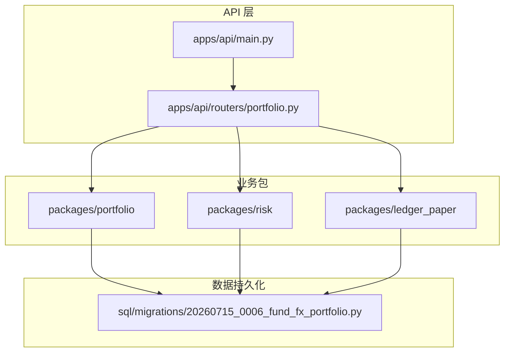
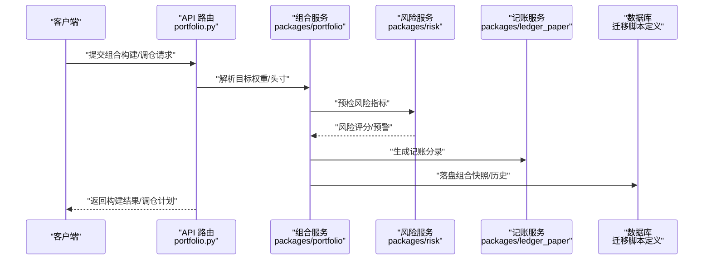
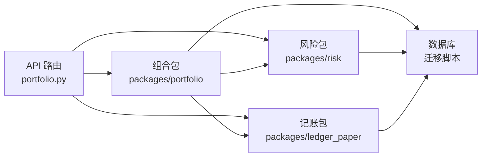

# 投资组合管理

<cite>
**本文引用的文件**   
- [apps/api/routers/portfolio.py](file://apps/api/routers/portfolio.py)
- [packages/portfolio](file://packages/portfolio)
- [packages/risk](file://packages/risk)
- [packages/ledger_paper](file://packages/ledger_paper)
- [sql/migrations/20260715_0006_fund_fx_portfolio.py](file://sql/migrations/20260715_0006_fund_fx_portfolio.py)
- [apps/api/main.py](file://apps/api/main.py)
</cite>

## 目录
1. [简介](#简介)
2. [项目结构](#项目结构)
3. [核心组件](#核心组件)
4. [架构总览](#架构总览)
5. [详细组件分析](#详细组件分析)
6. [依赖分析](#依赖分析)
7. [性能考虑](#性能考虑)
8. [故障排查指南](#故障排查指南)
9. [结论](#结论)
10. [附录](#附录)

## 简介
本文件面向“投资组合管理”模块，围绕持仓管理、风险管理、记账与纸质交易处理、组合优化与资产配置、组合构建与调仓、绩效归因、风险预警与合规检查等主题，提供系统化文档。内容基于仓库中实际代码结构与迁移脚本进行梳理，帮助读者快速理解系统能力边界、数据流与控制流，并给出可操作的实践建议。

## 项目结构
投资组合相关能力分布在以下位置：
- API 路由层：暴露组合相关的 HTTP 接口
- 业务包：portfolio（组合）、risk（风险）、ledger_paper（记账与纸质交易）
- 数据库迁移：定义组合、基金、外汇等实体与关系

图表来源
- [apps/api/routers/portfolio.py](file://apps/api/routers/portfolio.py)
- [apps/api/main.py](file://apps/api/main.py)
- [packages/portfolio](file://packages/portfolio)
- [packages/risk](file://packages/risk)
- [packages/ledger_paper](file://packages/ledger_paper)
- [sql/migrations/20260715_0006_fund_fx_portfolio.py](file://sql/migrations/20260715_0006_fund_fx_portfolio.py)

章节来源
- [apps/api/routers/portfolio.py](file://apps/api/routers/portfolio.py)
- [apps/api/main.py](file://apps/api/main.py)
- [sql/migrations/20260715_0006_fund_fx_portfolio.py](file://sql/migrations/20260715_0006_fund_fx_portfolio.py)

## 核心组件
- 账户结构与资产分类
  - 通过迁移脚本定义组合、基金、外汇等实体，支撑多账户、多资产类别的建模与隔离。
- 仓位跟踪
  - 由组合包负责计算与更新各标的的持仓数量、市值、权重等指标，并与市场数据联动。
- 风险管理
  - 风险包提供风险度量模型（如波动率、VaR、回撤等）与监控机制（阈值、告警）。
- 记账与纸质交易
  - ledger_paper 包记录手工或纸质交易流水，确保账实一致与审计追溯。
- 组合优化与资产配置
  - 在组合包内实现优化目标函数与约束，输出目标权重，驱动调仓。
- 组合构建与调仓
  - 将目标权重转换为可执行指令，结合风控与合规规则生成最终订单。
- 绩效归因
  - 基于持仓与收益序列，按资产类别、行业或因子维度进行贡献度分解。
- 风险预警与合规检查
  - 在交易前后执行限额、集中度、流动性等规则校验，触发预警与拦截。

章节来源
- [sql/migrations/20260715_0006_fund_fx_portfolio.py](file://sql/migrations/20260715_0006_fund_fx_portfolio.py)
- [packages/portfolio](file://packages/portfolio)
- [packages/risk](file://packages/risk)
- [packages/ledger_paper](file://packages/ledger_paper)

## 架构总览
整体采用分层架构：API 路由作为入口，调用组合、风险、记账等业务包；数据层通过迁移脚本定义的表结构进行持久化。

图表来源
- [apps/api/routers/portfolio.py](file://apps/api/routers/portfolio.py)
- [packages/portfolio](file://packages/portfolio)
- [packages/risk](file://packages/risk)
- [packages/ledger_paper](file://packages/ledger_paper)
- [sql/migrations/20260715_0006_fund_fx_portfolio.py](file://sql/migrations/20260715_0006_fund_fx_portfolio.py)

## 详细组件分析

### 账户结构与资产分类
- 设计要点
  - 以“组合-账户-资产类别”为基本维度，支持多币种、多市场、多策略隔离。
  - 通过迁移脚本建立组合、基金、外汇等主数据与关联关系，保证数据一致性。
- 关键实体与关系
  - 组合：承载策略与权限边界
  - 基金/证券：代表底层投资标的
  - 外汇：用于汇率折算与净值统一口径
- 最佳实践
  - 明确资产分类字典与映射，避免重复与歧义
  - 使用统一的标识符规范，便于跨模块引用

章节来源
- [sql/migrations/20260715_0006_fund_fx_portfolio.py](file://sql/migrations/20260715_0006_fund_fx_portfolio.py)

### 仓位跟踪与持仓快照
- 功能范围
  - 实时/日终计算持仓数量、成本、市值、权重、未实现盈亏等
  - 维护历史快照，支持回溯与审计
- 数据流
  - 输入：交易流水、公司行为、价格序列
  - 处理：增量更新与全量重算相结合
  - 输出：持仓视图、权重分布、流动性指标
- 复杂度与优化
  - 大规模标的场景下，优先使用向量化计算与增量更新
  - 对热点标的采用缓存与分区存储

章节来源
- [packages/portfolio](file://packages/portfolio)

### 风险管理：度量模型与监控机制
- 风险度量
  - 波动率、VaR、CVaR、最大回撤、Beta、久期/凸性（固收适用）等
  - 组合层面与标的层面的聚合与穿透
- 监控与预警
  - 阈值配置、分级告警、事件日志
  - 与合规检查联动，超限自动拦截或提示
- 集成点
  - 在组合构建与调仓前进行压力测试与情景分析
  - 与记账模块联动，确保风险敞口与账面一致

章节来源
- [packages/risk](file://packages/risk)

### 记账与纸质交易处理
- 目标
  - 记录所有真实与模拟交易，形成完整审计轨迹
  - 支持手工录入（纸质交易）与系统自动生成
- 流程
  - 交易确认 → 生成分录 → 更新余额与持仓 → 风险与合规复核 → 归档
- 关键点
  - 幂等性与去重，防止重复记账
  - 时间戳与版本控制，支持回滚与对比

章节来源
- [packages/ledger_paper](file://packages/ledger_paper)

### 组合优化与资产配置策略
- 常见策略
  - 均值-方差、Black-Litterman、风险平价、最小方差、带约束的线性/二次规划
- 输入与约束
  - 预期收益、协方差矩阵、交易成本、流动性限制、行业/风格中性
- 输出
  - 目标权重、再平衡幅度、预计冲击成本
- 落地
  - 与风控前置校验，确保方案可行
  - 与调仓引擎对接，生成可执行订单

章节来源
- [packages/portfolio](file://packages/portfolio)

### 组合构建与调仓操作
- 组合构建
  - 从策略信号到目标权重，再到订单清单
- 调仓执行
  - 分批下单、滑点与冲击成本估算、成交回报与差异处理
- 闭环
  - 成交后更新持仓与风险，触发绩效归因与报告

章节来源
- [apps/api/routers/portfolio.py](file://apps/api/routers/portfolio.py)
- [packages/portfolio](file://packages/portfolio)

### 绩效归因
- 方法
  - Brinson 归因、因子归因、收益桥接
- 维度
  - 资产类别、行业、风格、个股/个券贡献
- 输出
  - 贡献度报表、滚动窗口趋势、异常贡献识别

章节来源
- [packages/portfolio](file://packages/portfolio)

### 风险预警设置与合规检查
- 预警
  - 阈值配置、通知渠道、事件溯源
- 合规
  - 集中度、杠杆、流动性、禁投池、监管红线
- 联动
  - 与风控、记账、审批流一体化

章节来源
- [packages/risk](file://packages/risk)

## 依赖分析
- 模块耦合
  - API 路由依赖组合、风险、记账三个业务包
  - 组合包依赖风险与记账，形成“构建-风控-记账”的强内聚链路
- 外部依赖
  - 数据库通过迁移脚本定义，保证 schema 演进可控
- 潜在循环
  - 需避免组合与风险之间的双向直接依赖，建议通过事件或接口解耦

图表来源
- [apps/api/routers/portfolio.py](file://apps/api/routers/portfolio.py)
- [packages/portfolio](file://packages/portfolio)
- [packages/risk](file://packages/risk)
- [packages/ledger_paper](file://packages/ledger_paper)
- [sql/migrations/20260715_0006_fund_fx_portfolio.py](file://sql/migrations/20260715_0006_fund_fx_portfolio.py)

章节来源
- [apps/api/routers/portfolio.py](file://apps/api/routers/portfolio.py)
- [packages/portfolio](file://packages/portfolio)
- [packages/risk](file://packages/risk)
- [packages/ledger_paper](file://packages/ledger_paper)
- [sql/migrations/20260715_0006_fund_fx_portfolio.py](file://sql/migrations/20260715_0006_fund_fx_portfolio.py)

## 性能考虑
- 计算优化
  - 使用向量化与并行化加速协方差估计、风险指标计算
  - 增量更新持仓，减少全量重算开销
- 存储优化
  - 历史快照分表/分区，冷热数据分离
  - 高频指标物化视图，降低查询延迟
- 并发与一致性
  - 读写分离与事务边界清晰，避免长事务
  - 幂等写入与重试策略，保障高可用

[本节为通用指导，不直接分析具体文件]

## 故障排查指南
- 常见问题定位
  - 组合权重与持仓不一致：核对调仓日志与成交回报
  - 风险指标突变：检查价格源、缺失值与异常值
  - 记账差异：比对交易流水与会计分录，定位重复或遗漏
- 建议步骤
  - 启用详细日志与追踪 ID，串联跨模块调用链
  - 使用回放模式重放历史数据，复现问题
  - 对关键路径增加断言与契约测试

章节来源
- [packages/ledger_paper](file://packages/ledger_paper)
- [packages/risk](file://packages/risk)
- [packages/portfolio](file://packages/portfolio)

## 结论
本模块以“组合-风险-记账”为核心三角，配合清晰的账户与资产分类、完善的迁移与审计能力，形成从策略到执行的闭环。建议在工程实践中强化幂等、可观测与可回放能力，并通过持续的性能优化与回归测试保障稳定性。

[本节为总结性内容，不直接分析具体文件]

## 附录
- 参考实现路径
  - API 路由入口：[apps/api/routers/portfolio.py](file://apps/api/routers/portfolio.py)
  - 组合与优化逻辑：[packages/portfolio](file://packages/portfolio)
  - 风险度量与监控：[packages/risk](file://packages/risk)
  - 记账与纸质交易：[packages/ledger_paper](file://packages/ledger_paper)
  - 数据模型与迁移：[sql/migrations/20260715_0006_fund_fx_portfolio.py](file://sql/migrations/20260715_0006_fund_fx_portfolio.py)