# 绩效归因分析

<cite>
**本文引用的文件**   
- [apps/api/routers/portfolio.py](file://apps/api/routers/portfolio.py)
- [packages/evaluation/__init__.py](file://packages/evaluation/__init__.py)
- [packages/reporting/__init__.py](file://packages/reporting/__init__.py)
- [packages/backtest/__init__.py](file://packages/backtest/__init__.py)
- [packages/portfolio/__init__.py](file://packages/portfolio/__init__.py)
- [packages/risk/__init__.py](file://packages/risk/__init__.py)
- [packages/data_quality/__init__.py](file://packages/data_quality/__init__.py)
- [sql/migrations/20260715_0006_fund_fx_portfolio.py](file://sql/migrations/20260715_0006_fund_fx_portfolio.py)
</cite>

## 目录
1. [引言](#引言)
2. [项目结构](#项目结构)
3. [核心组件](#核心组件)
4. [架构总览](#架构总览)
5. [详细组件分析](#详细组件分析)
6. [依赖关系分析](#依赖关系分析)
7. [性能考量](#性能考量)
8. [故障排查指南](#故障排查指南)
9. [结论](#结论)
10. [附录](#附录)

## 引言
本文件面向“绩效归因分析”模块，系统性阐述投资组合绩效评估的理论基础与计算方法、绩效归因模型实现（Brinson归因、因子归因）、基准选择与对标策略（跟踪误差、主动收益分解）、多期归因与时间加权收益率逻辑，以及报告自动生成、可视化展示、历史回测与数据质量控制等实践方法。文档同时提供架构图、时序图与流程图，帮助读者从概念到代码实现建立完整认知。

## 项目结构
围绕绩效归因相关能力，仓库采用按领域分包的组织方式：
- API层：暴露组合查询与绩效相关接口
- 计算与分析层：评估、风险、回测、组合管理、数据质量
- 报表层：报告生成与输出
- 数据层：数据库迁移定义组合与净值等实体

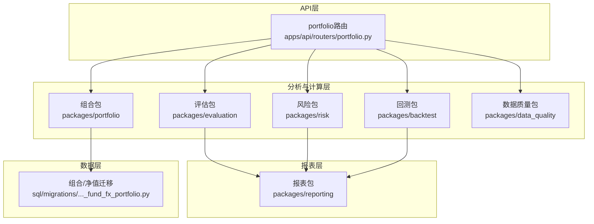

图表来源
- [apps/api/routers/portfolio.py](file://apps/api/routers/portfolio.py)
- [packages/evaluation/__init__.py](file://packages/evaluation/__init__.py)
- [packages/risk/__init__.py](file://packages/risk/__init__.py)
- [packages/backtest/__init__.py](file://packages/backtest/__init__.py)
- [packages/portfolio/__init__.py](file://packages/portfolio/__init__.py)
- [packages/data_quality/__init__.py](file://packages/data_quality/__init__.py)
- [packages/reporting/__init__.py](file://packages/reporting/__init__.py)
- [sql/migrations/20260715_0006_fund_fx_portfolio.py](file://sql/migrations/20260715_0006_fund_fx_portfolio.py)

章节来源
- [apps/api/routers/portfolio.py](file://apps/api/routers/portfolio.py)
- [packages/evaluation/__init__.py](file://packages/evaluation/__init__.py)
- [packages/reporting/__init__.py](file://packages/reporting/__init__.py)
- [packages/backtest/__init__.py](file://packages/backtest/__init__.py)
- [packages/portfolio/__init__.py](file://packages/portfolio/__init__.py)
- [packages/risk/__init__.py](file://packages/risk/__init__.py)
- [packages/data_quality/__init__.py](file://packages/data_quality/__init__.py)
- [sql/migrations/20260715_0006_fund_fx_portfolio.py](file://sql/migrations/20260715_0006_fund_fx_portfolio.py)

## 核心组件
- 组合与净值数据模型：通过迁移脚本定义组合、基金、外汇与净值表结构，为绩效计算提供统一数据源。
- 评估与风险指标：在评估与风险包中实现收益率、波动率、夏普比率、最大回撤、信息比率等常用指标。
- 回测引擎：封装交易信号、成交、滑点与手续费等假设，产出可对比的模拟绩效序列。
- 报表生成：将评估结果、归因结果与可视化图表组装为标准化报告。
- 数据质量：对输入数据进行完整性、一致性、异常值检测与修复建议。

章节来源
- [sql/migrations/20260715_0006_fund_fx_portfolio.py](file://sql/migrations/20260715_0006_fund_fx_portfolio.py)
- [packages/evaluation/__init__.py](file://packages/evaluation/__init__.py)
- [packages/risk/__init__.py](file://packages/risk/__init__.py)
- [packages/backtest/__init__.py](file://packages/backtest/__init__.py)
- [packages/reporting/__init__.py](file://packages/reporting/__init__.py)
- [packages/data_quality/__init__.py](file://packages/data_quality/__init__.py)

## 架构总览
下图展示了从API请求到数据读取、指标计算、归因分析、报表生成的端到端流程。

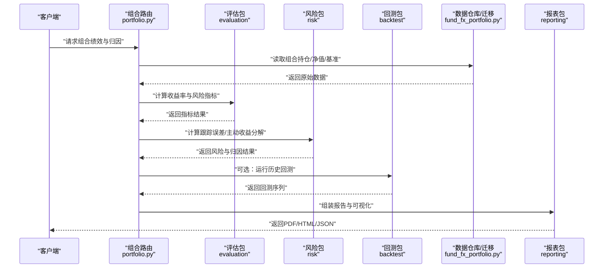

图表来源
- [apps/api/routers/portfolio.py](file://apps/api/routers/portfolio.py)
- [packages/evaluation/__init__.py](file://packages/evaluation/__init__.py)
- [packages/risk/__init__.py](file://packages/risk/__init__.py)
- [packages/backtest/__init__.py](file://packages/backtest/__init__.py)
- [packages/reporting/__init__.py](file://packages/reporting/__init__.py)
- [sql/migrations/20260715_0006_fund_fx_portfolio.py](file://sql/migrations/20260715_0006_fund_fx_portfolio.py)

## 详细组件分析

### 组合与净值数据模型（迁移）
- 目标：为绩效与归因提供一致的数据基座，包括组合标识、资产权重、净值序列、基准序列与汇率换算字段。
- 关键点：
  - 主键与外键约束确保组合与标的、净值与日期的唯一性
  - 数值精度与币种字段支持跨市场与多币种组合
  - 索引优化常见查询路径（日期范围、组合ID、基准ID）

章节来源
- [sql/migrations/20260715_0006_fund_fx_portfolio.py](file://sql/migrations/20260715_0006_fund_fx_portfolio.py)

### 评估与风险指标计算
- 收益率口径：
  - 简单收益率、对数收益率、时间加权收益率（TWR）
  - 资金加权收益率（MWR）用于现金流场景
- 风险调整后收益：
  - 夏普比率、索提诺比率、卡尔玛比率、特雷诺比率
  - 下行风险、半方差、VaR/CVaR
- 基准对比：
  - 超额收益、跟踪误差、信息比率、Beta/Alpha
  - 主动收益分解（配置效应、选股效应、交互效应）

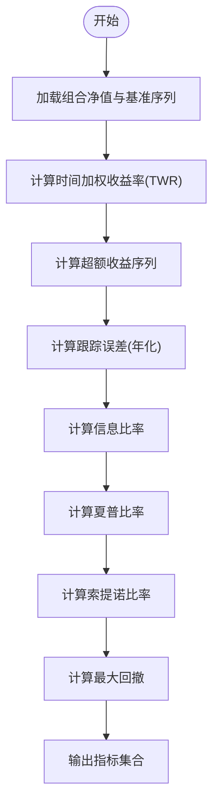

图表来源
- [packages/evaluation/__init__.py](file://packages/evaluation/__init__.py)
- [packages/risk/__init__.py](file://packages/risk/__init__.py)

章节来源
- [packages/evaluation/__init__.py](file://packages/evaluation/__init__.py)
- [packages/risk/__init__.py](file://packages/risk/__init__.py)

### Brinson归因模型
- 思想：将组合相对基准的收益分解为资产配置效应、个股选择效应与交互效应。
- 输入：
  - 组合与基准在各行业/板块的权重与收益率
  - 组合与基准在各细分标的上的权重与收益率
- 输出：
  - 各层级贡献度（配置/选择/交互）
  - 累计贡献与排名

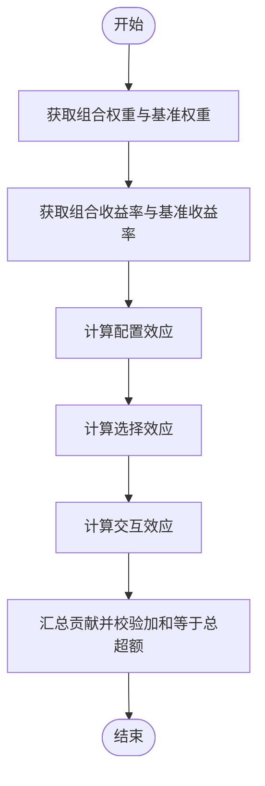

图表来源
- [packages/evaluation/__init__.py](file://packages/evaluation/__init__.py)
- [packages/risk/__init__.py](file://packages/risk/__init__.py)

章节来源
- [packages/evaluation/__init__.py](file://packages/evaluation/__init__.py)
- [packages/risk/__init__.py](file://packages/risk/__init__.py)

### 因子归因分析
- 目标：将超额收益解释为风格与因子暴露的贡献，如价值、动量、规模、质量、低波等。
- 步骤：
  - 构建或引入因子数据集（中性化、标准化）
  - 回归估计因子暴露与因子溢价
  - 分解每期与累计因子贡献，识别主要驱动因素
- 输出：
  - 因子暴露矩阵、因子贡献表、残差与拟合优度

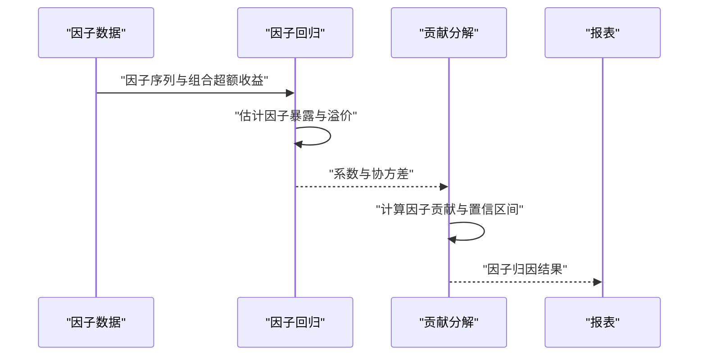

图表来源
- [packages/evaluation/__init__.py](file://packages/evaluation/__init__.py)
- [packages/risk/__init__.py](file://packages/risk/__init__.py)
- [packages/reporting/__init__.py](file://packages/reporting/__init__.py)

章节来源
- [packages/evaluation/__init__.py](file://packages/evaluation/__init__.py)
- [packages/risk/__init__.py](file://packages/risk/__init__.py)
- [packages/reporting/__init__.py](file://packages/reporting/__init__.py)

### 基准选择与对标分析
- 基准选择原则：
  - 投资范围与风格匹配
  - 流动性与可投资性
  - 透明度与再平衡规则清晰
- 对标分析：
  - 指数跟踪误差（年化标准差）
  - 主动收益分解（配置/选股/交互）
  - 滚动窗口跟踪误差与稳定性监测

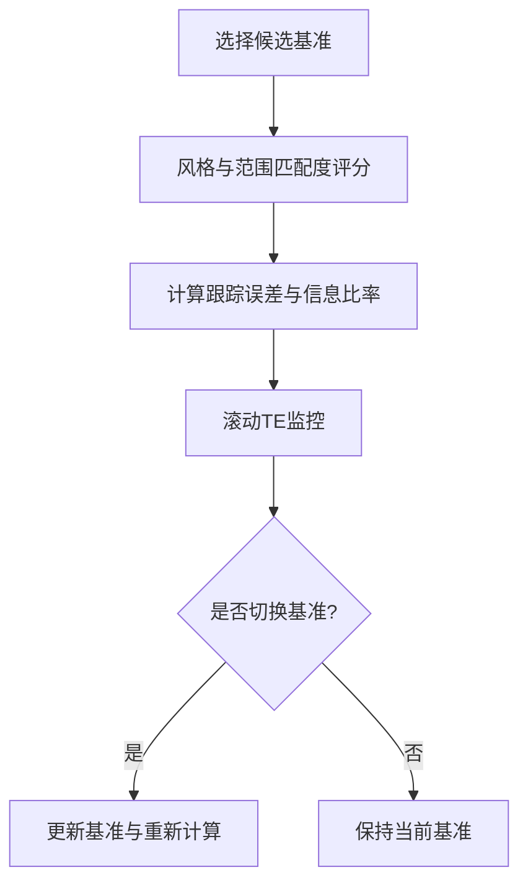

图表来源
- [packages/risk/__init__.py](file://packages/risk/__init__.py)
- [packages/evaluation/__init__.py](file://packages/evaluation/__init__.py)

章节来源
- [packages/risk/__init__.py](file://packages/risk/__init__.py)
- [packages/evaluation/__init__.py](file://packages/evaluation/__init__.py)

### 多期绩效归因与时间加权收益率
- 时间加权收益率（TWR）：消除外部现金流影响，适合评价基金经理能力
- 多期归因：
  - 逐期Brinson/因子归因后，进行几何累加或算术累加以得到累计贡献
  - 注意乘积项的处理与近似校正
- 输出：
  - 多期贡献热力图、累计贡献曲线、关键期段归因快照

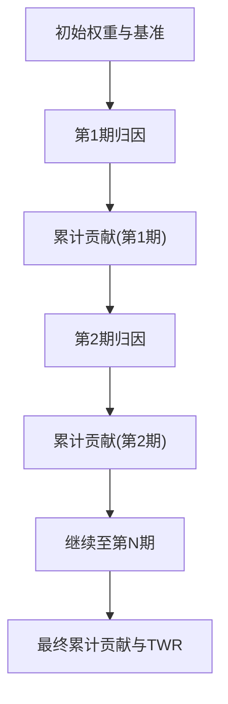

图表来源
- [packages/evaluation/__init__.py](file://packages/evaluation/__init__.py)
- [packages/risk/__init__.py](file://packages/risk/__init__.py)

章节来源
- [packages/evaluation/__init__.py](file://packages/evaluation/__init__.py)
- [packages/risk/__init__.py](file://packages/risk/__init__.py)

### 报告自动生成与可视化
- 内容：
  - 绩效摘要（收益、波动、回撤、风险调整收益）
  - 归因结果（Brinson/因子）
  - 图表（净值曲线、超额曲线、贡献瀑布图、因子雷达图）
- 输出格式：
  - PDF/HTML/JSON，便于归档与二次加工
- 自动化：
  - 定时任务触发、参数化模板、版本化报告

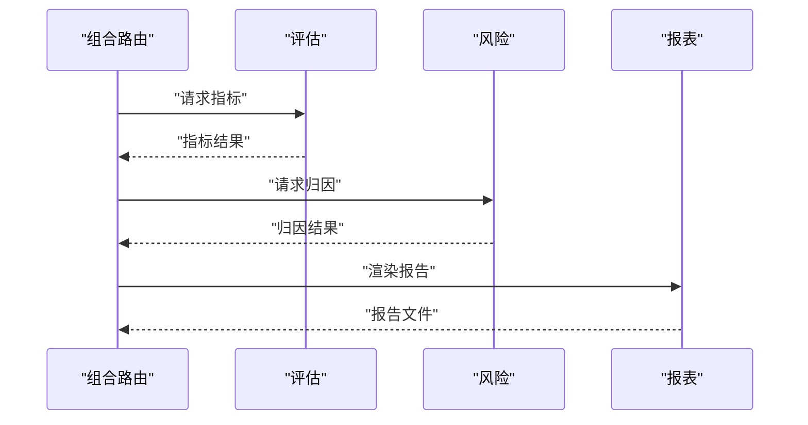

图表来源
- [apps/api/routers/portfolio.py](file://apps/api/routers/portfolio.py)
- [packages/evaluation/__init__.py](file://packages/evaluation/__init__.py)
- [packages/risk/__init__.py](file://packages/risk/__init__.py)
- [packages/reporting/__init__.py](file://packages/reporting/__init__.py)

章节来源
- [apps/api/routers/portfolio.py](file://apps/api/routers/portfolio.py)
- [packages/reporting/__init__.py](file://packages/reporting/__init__.py)

### 历史回测实现示例
- 要素：
  - 交易信号、成交模型、滑点与手续费
  - 组合权重更新与净值序列生成
  - 与真实业绩对比与偏差分析
- 输出：
  - 回测净值、交易明细、绩效与归因快照

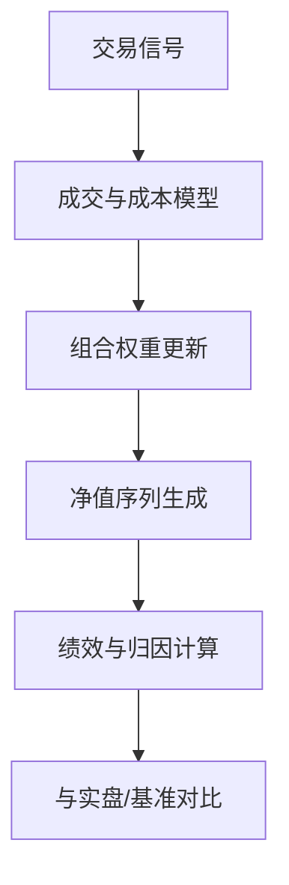

图表来源
- [packages/backtest/__init__.py](file://packages/backtest/__init__.py)
- [packages/evaluation/__init__.py](file://packages/evaluation/__init__.py)
- [packages/risk/__init__.py](file://packages/risk/__init__.py)

章节来源
- [packages/backtest/__init__.py](file://packages/backtest/__init__.py)
- [packages/evaluation/__init__.py](file://packages/evaluation/__init__.py)
- [packages/risk/__init__.py](file://packages/risk/__init__.py)

### 数据质量控制与异常检测
- 检查项：
  - 缺失值与重复记录
  - 价格跳变与停牌处理
  - 权重合计异常与负权重
  - 净值断点与复权一致性
- 处理策略：
  - 插值/前向填充/剔除
  - 标记异常并告警
  - 审计日志与可追溯性

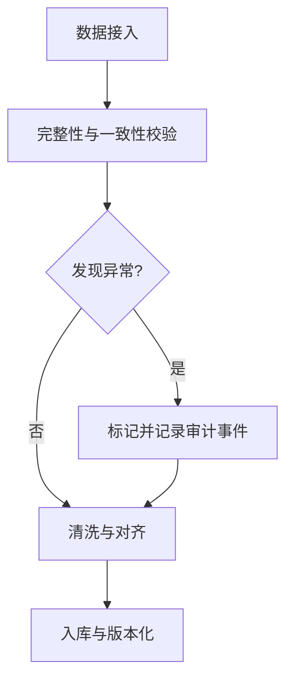

图表来源
- [packages/data_quality/__init__.py](file://packages/data_quality/__init__.py)

章节来源
- [packages/data_quality/__init__.py](file://packages/data_quality/__init__.py)

## 依赖关系分析
- 耦合关系：
  - API路由依赖评估、风险、回测与报表模块
  - 评估与风险模块共享净值与基准数据
  - 报表模块消费评估与风险结果
- 外部依赖：
  - 数据库（由迁移脚本定义）
  - 可能的第三方库（未在仓库内显式声明，需结合工程配置确认）

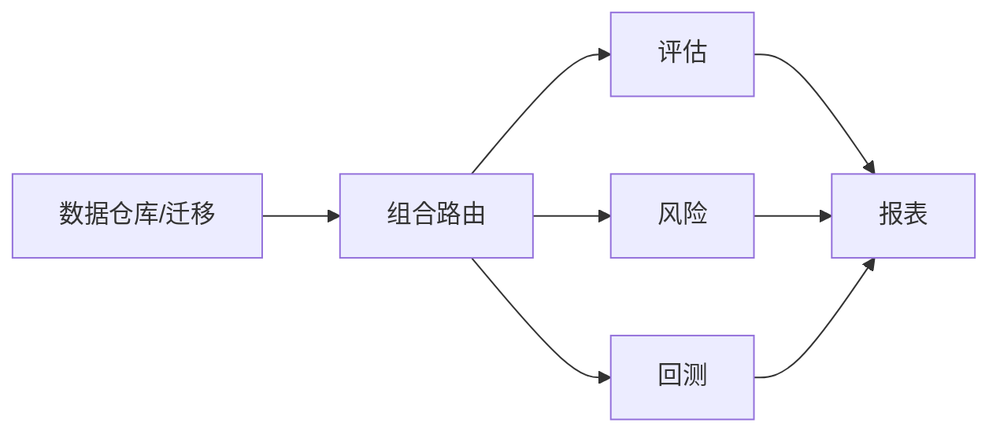

图表来源
- [apps/api/routers/portfolio.py](file://apps/api/routers/portfolio.py)
- [packages/evaluation/__init__.py](file://packages/evaluation/__init__.py)
- [packages/risk/__init__.py](file://packages/risk/__init__.py)
- [packages/backtest/__init__.py](file://packages/backtest/__init__.py)
- [packages/reporting/__init__.py](file://packages/reporting/__init__.py)
- [sql/migrations/20260715_0006_fund_fx_portfolio.py](file://sql/migrations/20260715_0006_fund_fx_portfolio.py)

章节来源
- [apps/api/routers/portfolio.py](file://apps/api/routers/portfolio.py)
- [packages/evaluation/__init__.py](file://packages/evaluation/__init__.py)
- [packages/risk/__init__.py](file://packages/risk/__init__.py)
- [packages/backtest/__init__.py](file://packages/backtest/__init__.py)
- [packages/reporting/__init__.py](file://packages/reporting/__init__.py)
- [sql/migrations/20260715_0006_fund_fx_portfolio.py](file://sql/migrations/20260715_0006_fund_fx_portfolio.py)

## 性能考量
- 数据层面：
  - 使用分区与索引优化日期范围查询
  - 预聚合高频指标（如月度/季度统计）
- 计算层面：
  - 批量向量化计算避免循环
  - 增量更新净值与归因贡献，减少全量重算
- 存储与IO：
  - 冷热数据分层存储
  - 报表缓存与按需刷新

[本节为通用指导，不直接分析具体文件]

## 故障排查指南
- 常见问题：
  - 净值断点导致TWR异常：检查复权与缺失值处理
  - 跟踪误差飙升：核查基准变更与权重对齐
  - 归因贡献不闭合：检查权重与收益率口径一致性
- 定位手段：
  - 查看数据质量审计日志
  - 分阶段打印中间结果（净值、超额、归因贡献）
  - 使用最小样本复现问题

章节来源
- [packages/data_quality/__init__.py](file://packages/data_quality/__init__.py)

## 结论
本模块以统一的组合与净值数据为基础，提供完整的绩效评估、归因分析与报告生成能力。通过Brinson与因子归因相结合的方法，既能解释大类资产配置效果，又能深入风格与因子维度；配合数据质量控制与回测验证，形成闭环的投资研究与管理工具链。

[本节为总结性内容，不直接分析具体文件]

## 附录
- 术语速查：
  - TWR：时间加权收益率
  - MWR：资金加权收益率
  - TE：跟踪误差
  - IR：信息比率
  - VaR/CVaR：风险价值/条件风险价值
- 参考实现路径：
  - 指标与归因：见评估与风险包初始化入口
  - 报表生成：见报表包初始化入口
  - 数据模型：见组合/净值迁移脚本

章节来源
- [packages/evaluation/__init__.py](file://packages/evaluation/__init__.py)
- [packages/risk/__init__.py](file://packages/risk/__init__.py)
- [packages/reporting/__init__.py](file://packages/reporting/__init__.py)
- [sql/migrations/20260715_0006_fund_fx_portfolio.py](file://sql/migrations/20260715_0006_fund_fx_portfolio.py)