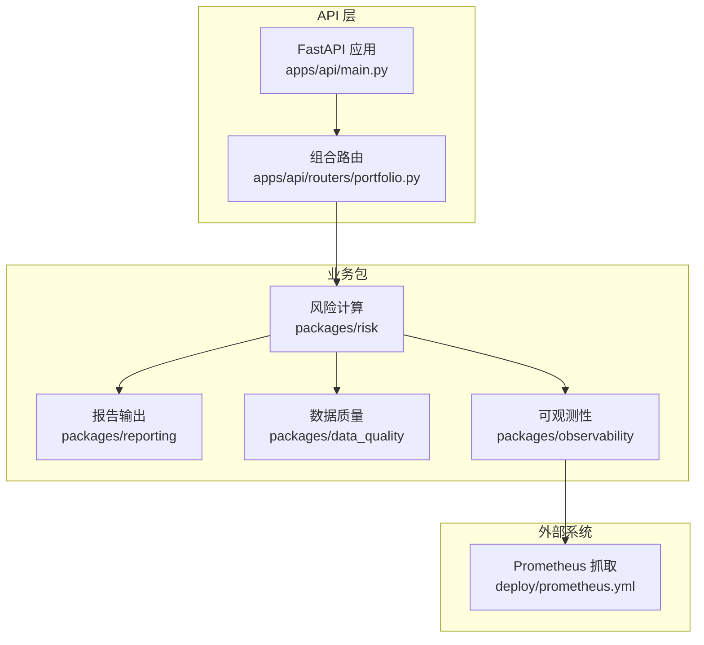
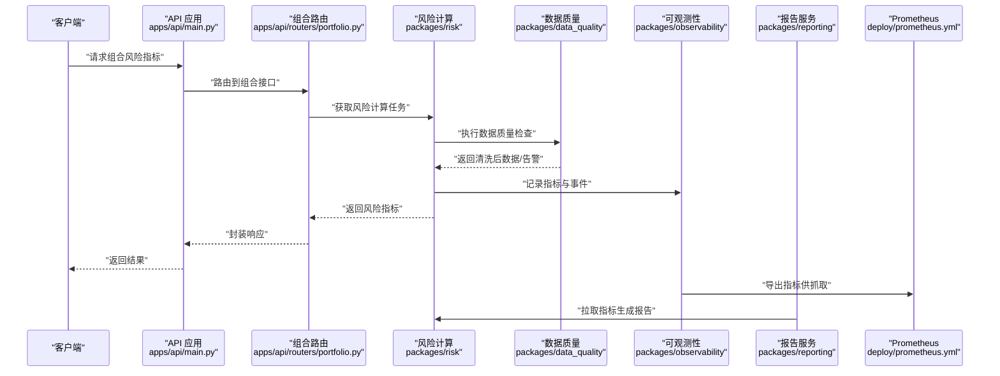
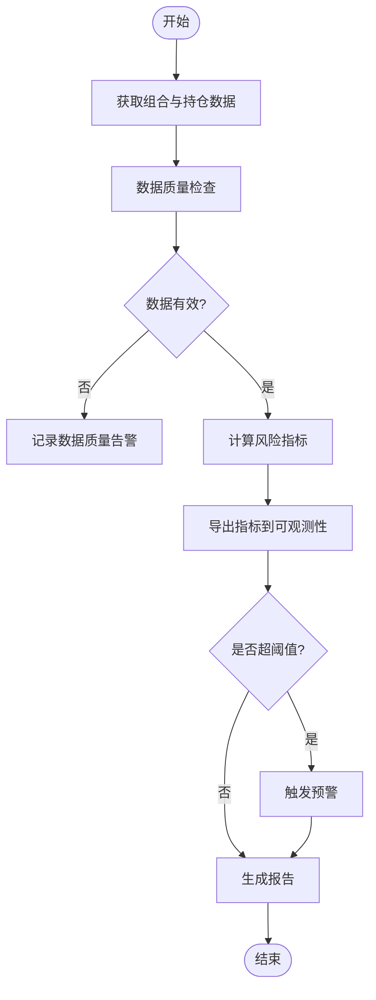
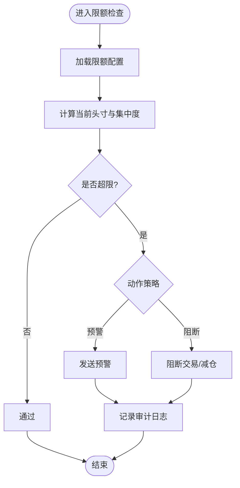
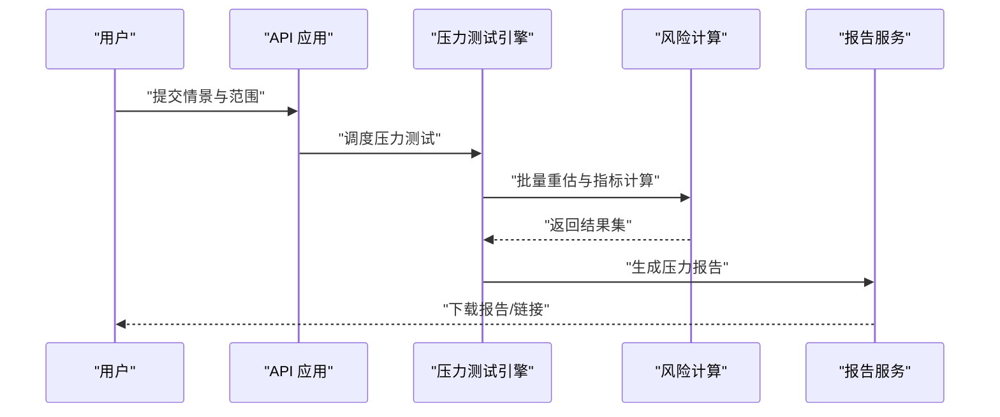
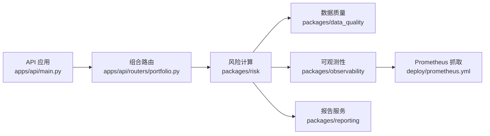

# 风险管理系统

<cite>
**本文引用的文件**   
- [apps/api/main.py](file://apps/api/main.py)
- [apps/api/routers/portfolio.py](file://apps/api/routers/portfolio.py)
- [packages/risk/__init__.py](file://packages/risk/__init__.py)
- [packages/reporting/__init__.py](file://packages/reporting/__init__.py)
- [packages/data_quality/__init__.py](file://packages/data_quality/__init__.py)
- [packages/observability/__init__.py](file://packages/observability/__init__.py)
- [deploy/prometheus.yml](file://deploy/prometheus.yml)
- [skills/cross-market-quant-research/references/risk-layers.md](file://skills/cross-market-quant-research/references/risk-layers.md)
</cite>

## 目录
1. [引言](#引言)
2. [项目结构](#项目结构)
3. [核心组件](#核心组件)
4. [架构总览](#架构总览)
5. [详细组件分析](#详细组件分析)
6. [依赖分析](#依赖分析)
7. [性能考虑](#性能考虑)
8. [故障排查指南](#故障排查指南)
9. [结论](#结论)
10. [附录](#附录)

## 引言
本文件面向风险管理系统，聚焦以下目标：
- 风险度量模型设计原理：市场风险、信用风险、流动性风险的量化方法
- 风险监控机制实现：实时指标计算、阈值预警、报告生成
- 限额管理与合规检查：头寸限制、集中度控制、止损规则
- 压力测试与情景分析框架
- 配置与定制：风险指标配置、监控告警设置、风险报告定制
- 数据质量与异常处理实践

说明：本项目仓库包含风险相关模块（如 packages/risk、packages/reporting、packages/data_quality、packages/observability）以及 API 路由（portfolio 等）。由于未提供具体实现源码，本文在“架构与流程”层面给出可落地的设计与集成建议，并在涉及代码映射的图表中仅引用已存在的入口文件路径。

## 项目结构
从仓库结构看，风险系统由多个包协同构成：
- API 层：暴露组合与风险查询接口（如 portfolio 路由）
- 风险计算：位于 packages/risk（未展示源码，按约定组织）
- 报告输出：位于 packages/reporting（未展示源码，按约定组织）
- 数据质量：位于 packages/data_quality（未展示源码，按约定组织）
- 可观测性：位于 packages/observability（未展示源码，按约定组织）
- 监控采集：deploy/prometheus.yml 定义抓取配置
- 参考规范：skills/cross-market-quant-research/references/risk-layers.md 提供风险分层参考

图示来源
- [apps/api/main.py](file://apps/api/main.py)
- [apps/api/routers/portfolio.py](file://apps/api/routers/portfolio.py)
- [packages/risk/__init__.py](file://packages/risk/__init__.py)
- [packages/reporting/__init__.py](file://packages/reporting/__init__.py)
- [packages/data_quality/__init__.py](file://packages/data_quality/__init__.py)
- [packages/observability/__init__.py](file://packages/observability/__init__.py)
- [deploy/prometheus.yml](file://deploy/prometheus.yml)

章节来源
- [apps/api/main.py](file://apps/api/main.py)
- [apps/api/routers/portfolio.py](file://apps/api/routers/portfolio.py)
- [deploy/prometheus.yml](file://deploy/prometheus.yml)

## 核心组件
- 风险计算引擎（packages/risk）
  - 负责市场风险、信用风险、流动性风险等指标的建模与计算
  - 对接数据质量校验，确保输入数据的完整性与一致性
  - 输出指标到可观测性子系统并触发告警
- 报告服务（packages/reporting）
  - 将风险指标聚合为日报、周报、月报及专项报告
  - 支持模板化与多渠道分发
- 数据质量（packages/data_quality）
  - 对原始数据进行缺失值、异常值、重复值、时间对齐等检查
  - 提供修复策略与回滚方案
- 可观测性（packages/observability）
  - 暴露指标、日志、追踪，接入 Prometheus 进行持久化与告警
- API 层（apps/api）
  - 提供组合、风险指标查询与报告下载接口
  - 承载限额与合规检查的查询能力

章节来源
- [packages/risk/__init__.py](file://packages/risk/__init__.py)
- [packages/reporting/__init__.py](file://packages/reporting/__init__.py)
- [packages/data_quality/__init__.py](file://packages/data_quality/__init__.py)
- [packages/observability/__init__.py](file://packages/observability/__init__.py)
- [apps/api/routers/portfolio.py](file://apps/api/routers/portfolio.py)

## 架构总览
下图展示了从请求到指标计算、质量校验、报告生成与监控告警的整体流程。

图示来源
- [apps/api/main.py](file://apps/api/main.py)
- [apps/api/routers/portfolio.py](file://apps/api/routers/portfolio.py)
- [packages/risk/__init__.py](file://packages/risk/__init__.py)
- [packages/data_quality/__init__.py](file://packages/data_quality/__init__.py)
- [packages/observability/__init__.py](file://packages/observability/__init__.py)
- [packages/reporting/__init__.py](file://packages/reporting/__init__.py)
- [deploy/prometheus.yml](file://deploy/prometheus.yml)

## 详细组件分析

### 风险度量模型设计
- 市场风险
  - 常用方法：历史模拟法、方差-协方差法、蒙特卡洛模拟；关键指标包括 VaR、ES、Greeks、波动率曲面
  - 数据需求：价格序列、因子暴露、相关性矩阵、波动率估计
- 信用风险
  - 常用方法：违约概率（PD）、违约损失率（LGD）、风险敞口（EAD）、预期损失（EL）；信用利差与久期敏感性
  - 数据需求：主体评级、违约历史、回收率、行业与区域分布
- 流动性风险
  - 常用方法：买卖价差、冲击成本模型、折价曲线、资金缺口与期限错配
  - 数据需求：订单簿快照、成交明细、融资成本曲线

章节来源
- [skills/cross-market-quant-research/references/risk-layers.md](file://skills/cross-market-quant-research/references/risk-layers.md)

### 风险监控机制实现
- 实时指标计算
  - 通过 API 路由触发组合风险计算，内部调用风险引擎与数据质量模块
  - 指标经可观测性模块导出至 Prometheus，便于低延迟查询
- 阈值预警
  - 基于 Prometheus 规则或应用内阈值判断，触发告警通道（邮件、IM、工单）
- 风险报告生成
  - 报告服务定时或按需拉取指标，渲染模板并归档

章节来源
- [apps/api/routers/portfolio.py](file://apps/api/routers/portfolio.py)
- [packages/risk/__init__.py](file://packages/risk/__init__.py)
- [packages/data_quality/__init__.py](file://packages/data_quality/__init__.py)
- [packages/observability/__init__.py](file://packages/observability/__init__.py)
- [packages/reporting/__init__.py](file://packages/reporting/__init__.py)
- [deploy/prometheus.yml](file://deploy/prometheus.yml)

### 限额管理与合规检查
- 头寸限制
  - 维度：单一标的、行业、地区、币种、交易对手
  - 逻辑：计算当前头寸与限额对比，超限则阻断或预警
- 集中度控制
  - 维度：前 N 大持仓占比、赫芬达尔指数、最大回撤容忍度
  - 逻辑：动态调整权重上限，触发再平衡建议
- 止损规则
  - 维度：账户级、组合级、策略级止损线
  - 逻辑：实时监控净值与回撤，触及止损线自动减仓或暂停交易

章节来源
- [apps/api/routers/portfolio.py](file://apps/api/routers/portfolio.py)
- [packages/risk/__init__.py](file://packages/risk/__init__.py)

### 压力测试与情景分析框架
- 框架设计
  - 输入：基准情景与自定义情景（宏观冲击、利率骤变、汇率跳空、信用事件）
  - 过程：重估资产价值、重新计算风险指标、汇总影响
  - 输出：损益分布、VaR/ES 变化、流动性缺口、资本占用变化
- 实施要点
  - 参数化情景库与版本管理
  - 批处理与并行计算优化
  - 结果可视化与差异对比

章节来源
- [apps/api/main.py](file://apps/api/main.py)
- [packages/risk/__init__.py](file://packages/risk/__init__.py)
- [packages/reporting/__init__.py](file://packages/reporting/__init__.py)

### 配置与定制
- 风险指标配置
  - 指标定义、窗口长度、频率、分组维度
  - 存储于配置中心或 YAML，支持热更新
- 监控告警设置
  - 在 prometheus.yml 中定义抓取目标与规则文件路径
  - 结合告警通道（Webhook、邮件、IM）
- 风险报告定制
  - 模板变量、分页、附件、多语言
  - 定时任务与手动触发并存

章节来源
- [deploy/prometheus.yml](file://deploy/prometheus.yml)

### 数据质量检查与异常处理
- 数据质量检查
  - 缺失值填充、异常值检测、重复记录去重、时间戳对齐、跨源一致性校验
  - 产出质量评分与修复建议
- 异常处理
  - 失败重试、降级策略、熔断与限流
  - 审计日志与可追溯性

章节来源
- [packages/data_quality/__init__.py](file://packages/data_quality/__init__.py)
- [packages/observability/__init__.py](file://packages/observability/__init__.py)

## 依赖分析
- 组件耦合
  - API 路由依赖风险计算与报告服务
  - 风险计算依赖数据质量与可观测性
  - 可观测性依赖 Prometheus 抓取配置
- 外部依赖
  - Prometheus 用于指标持久化与告警
  - 数据库与消息队列（未在图中展示，可按需引入）

图示来源
- [apps/api/main.py](file://apps/api/main.py)
- [apps/api/routers/portfolio.py](file://apps/api/routers/portfolio.py)
- [packages/risk/__init__.py](file://packages/risk/__init__.py)
- [packages/data_quality/__init__.py](file://packages/data_quality/__init__.py)
- [packages/observability/__init__.py](file://packages/observability/__init__.py)
- [packages/reporting/__init__.py](file://packages/reporting/__init__.py)
- [deploy/prometheus.yml](file://deploy/prometheus.yml)

章节来源
- [apps/api/main.py](file://apps/api/main.py)
- [apps/api/routers/portfolio.py](file://apps/api/routers/portfolio.py)
- [deploy/prometheus.yml](file://deploy/prometheus.yml)

## 性能考虑
- 指标计算
  - 使用增量计算与滑动窗口，避免全量重算
  - 对热点指标采用缓存与预聚合
- 并发与批处理
  - 压力测试与批量报告采用并行任务队列
  - 合理设置线程池与连接池大小
- 存储与查询
  - 指标时序数据写入列式存储或时序数据库
  - 查询侧建立索引与物化视图

[本节为通用指导，不直接分析具体文件]

## 故障排查指南
- 常见问题定位
  - 指标缺失：检查数据质量模块输出与上游数据源
  - 告警风暴：审查阈值与冷却时间，合并相似告警
  - 报告延迟：确认任务队列与资源配额
- 诊断手段
  - 查看可观测性日志与追踪链路
  - 使用 Prometheus 查询指标趋势与错误率
  - 核对限额与合规规则版本

章节来源
- [packages/data_quality/__init__.py](file://packages/data_quality/__init__.py)
- [packages/observability/__init__.py](file://packages/observability/__init__.py)
- [deploy/prometheus.yml](file://deploy/prometheus.yml)

## 结论
本风险管理文档从架构、组件、流程与配置四个维度给出了完整的设计与落地建议。结合现有仓库中的 API 入口、风险与报告包、数据质量与可观测性模块，以及 Prometheus 抓取配置，可实现端到端的风险度量、监控、限额与报告体系。后续可在各包内补充具体算法实现与配置项，以进一步提升系统的准确性与稳定性。

[本节为总结性内容，不直接分析具体文件]

## 附录
- 术语表
  - VaR：风险价值
  - ES：条件风险价值
  - PD/LGD/EAD：违约概率/违约损失率/风险敞口
  - 久期：利率敏感性度量
- 参考规范
  - 风险分层与指标体系参考见 skills/cross-market-quant-research/references/risk-layers.md

章节来源
- [skills/cross-market-quant-research/references/risk-layers.md](file://skills/cross-market-quant-research/references/risk-layers.md)