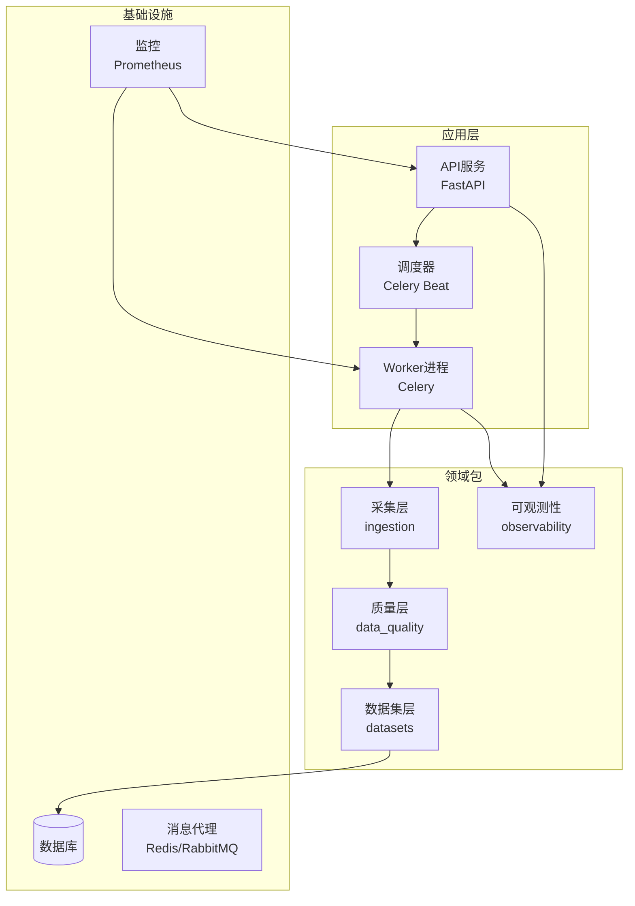
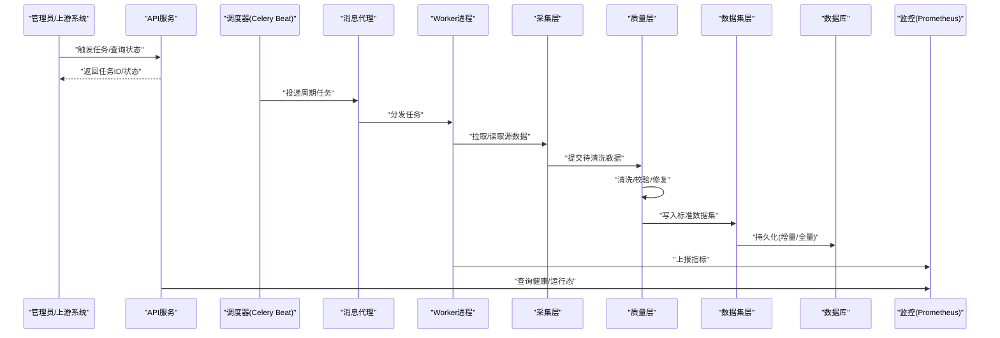
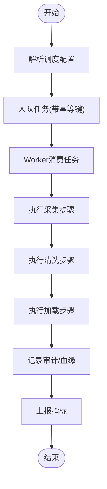
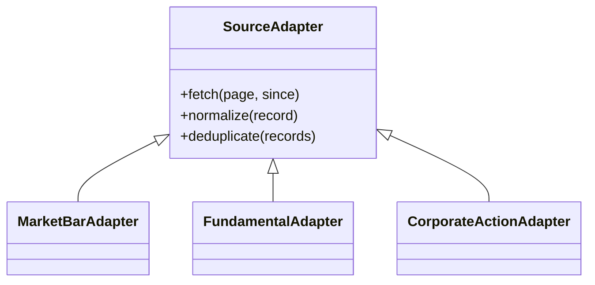
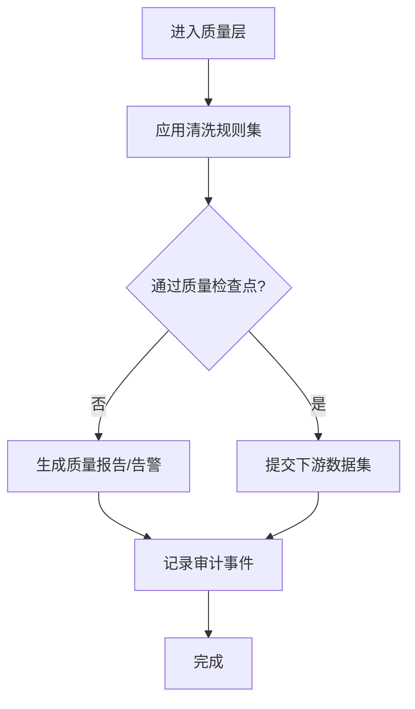
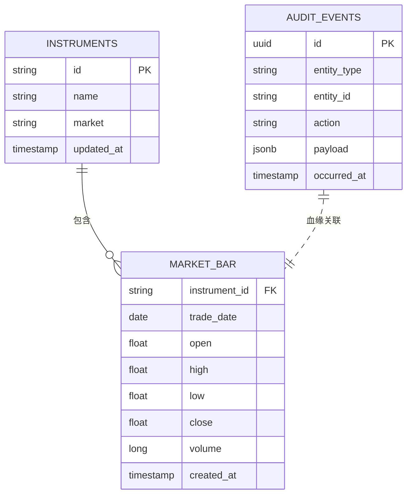
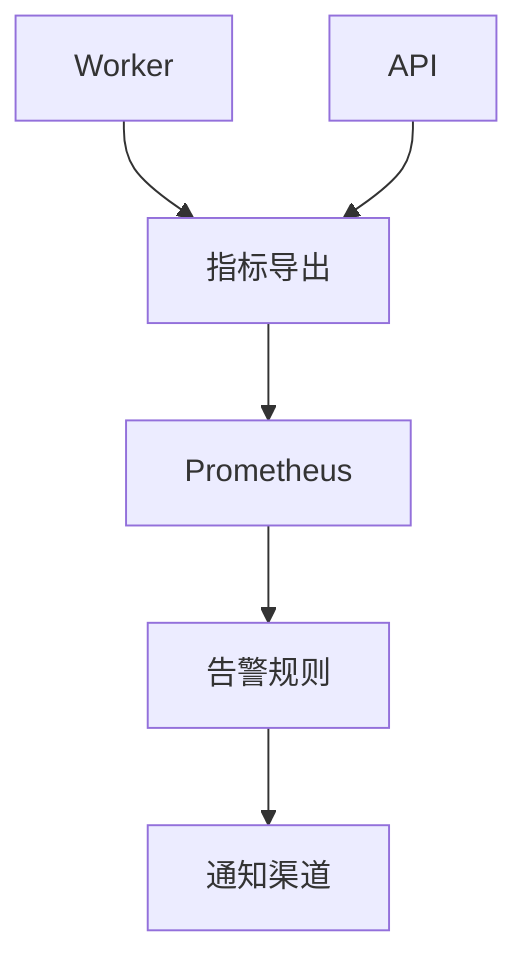
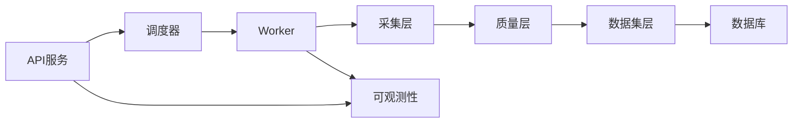

# ETL数据处理流程

<cite>
**本文引用的文件**   
- [apps/api/main.py](file://apps/api/main.py)
- [apps/worker/main.py](file://apps/worker/main.py)
- [apps/worker/tasks.py](file://apps/worker/tasks.py)
- [apps/scheduler/schedule.py](file://apps/scheduler/schedule.py)
- [configs/base.yaml](file://configs/base.yaml)
- [deploy/docker-compose.yml](file://deploy/docker-compose.yml)
- [sql/migrations/env.py](file://sql/migrations/env.py)
- [packages/ingestion](file://packages/ingestion)
- [packages/data_quality](file://packages/data_quality)
- [packages/datasets](file://packages/datasets)
- [packages/observability](file://packages/observability)
</cite>

## 目录
1. [简介](#简介)
2. [项目结构](#项目结构)
3. [核心组件](#核心组件)
4. [架构总览](#架构总览)
5. [详细组件分析](#详细组件分析)
6. [依赖关系分析](#依赖关系分析)
7. [性能考虑](#性能考虑)
8. [故障排查指南](#故障排查指南)
9. [结论](#结论)
10. [附录](#附录)

## 简介
本文件面向ETL数据处理流水线，覆盖数据采集、转换与加载的端到端设计；深入解析异步任务调度（Celery）配置与管理；阐述数据清洗规则与质量检查点；说明增量更新与全量更新策略；文档化数据血缘追踪与版本控制机制；提供监控与告警配置建议；并给出性能优化与大规模数据处理最佳实践。文末以实际案例展示复杂数据转换场景的实现方法。

## 项目结构
仓库采用“应用层 + 领域包 + 部署与配置”的分层组织方式：
- 应用层
  - API服务：暴露管理接口与查询接口
  - Worker：Celery工作进程，执行ETL任务
  - Scheduler：定时调度器，触发周期性任务
- 领域包
  - ingestion：数据采集适配与入库
  - data_quality：数据清洗与质量校验
  - datasets：数据集抽象与读写
  - observability：可观测性指标与日志
- 配置与部署
  - configs：YAML配置
  - deploy：Docker Compose编排与Prometheus抓取配置
- 数据库迁移
  - sql/migrations：Alembic迁移脚本与环境配置

图表来源
- [apps/api/main.py](file://apps/api/main.py)
- [apps/worker/main.py](file://apps/worker/main.py)
- [apps/scheduler/schedule.py](file://apps/scheduler/schedule.py)
- [deploy/docker-compose.yml](file://deploy/docker-compose.yml)

章节来源
- [apps/api/main.py](file://apps/api/main.py)
- [apps/worker/main.py](file://apps/worker/main.py)
- [apps/scheduler/schedule.py](file://apps/scheduler/schedule.py)
- [deploy/docker-compose.yml](file://deploy/docker-compose.yml)

## 核心组件
- 采集层（ingestion）
  - 负责对接多源数据（市场、基本面、公司行为等），进行标准化与初步清洗，写入中间存储或目标库。
- 质量层（data_quality）
  - 定义清洗规则、完整性与一致性校验、异常检测与修复策略，输出质量报告与审计事件。
- 数据集层（datasets）
  - 封装表/主题的数据访问接口，统一Schema与分区策略，支持增量与全量写入。
- 可观测性（observability）
  - 暴露指标、结构化日志与链路追踪，支撑监控与告警。
- 任务调度（scheduler + worker）
  - Celery Beat按周期触发任务，Worker消费队列执行ETL步骤，支持重试、超时与幂等。

章节来源
- [packages/ingestion](file://packages/ingestion)
- [packages/data_quality](file://packages/data_quality)
- [packages/datasets](file://packages/datasets)
- [packages/observability](file://packages/observability)

## 架构总览
整体ETL流水线由“调度器 -> 任务队列 -> 工作进程 -> 数据层”构成，API用于触发与查询状态，Prometheus采集关键指标。

图表来源
- [apps/api/main.py](file://apps/api/main.py)
- [apps/worker/main.py](file://apps/worker/main.py)
- [apps/scheduler/schedule.py](file://apps/scheduler/schedule.py)
- [deploy/docker-compose.yml](file://deploy/docker-compose.yml)

## 详细组件分析

### 任务调度与执行（Celery）
- 调度器（Beat）
  - 基于配置文件声明周期任务，如每日开盘前拉取前日行情、盘后计算因子等。
- Worker
  - 接收任务后依次执行：采集 -> 清洗 -> 加载；记录任务元数据与审计事件；失败自动重试与死信处理。
- 任务定义
  - 将ETL步骤拆分为细粒度任务，便于并行与重试；每个任务具备幂等键，避免重复写入。

图表来源
- [apps/scheduler/schedule.py](file://apps/scheduler/schedule.py)
- [apps/worker/tasks.py](file://apps/worker/tasks.py)
- [apps/worker/main.py](file://apps/worker/main.py)

章节来源
- [apps/scheduler/schedule.py](file://apps/scheduler/schedule.py)
- [apps/worker/tasks.py](file://apps/worker/tasks.py)
- [apps/worker/main.py](file://apps/worker/main.py)

### 数据采集（ingestion）
- 适配器模式
  - 针对不同数据源实现统一接口，屏蔽差异；支持分页、断点续传与速率限制。
- 标准化
  - 字段映射、类型转换、时间与时区归一、代码体系对齐。
- 幂等与去重
  - 基于主键/业务键+时间戳的去重策略，确保重复拉取不产生脏数据。

图表来源
- [packages/ingestion](file://packages/ingestion)

章节来源
- [packages/ingestion](file://packages/ingestion)

### 数据清洗与质量检查（data_quality）
- 清洗规则
  - 空值填充、异常值裁剪、跨源一致性校验、时间序列连续性修复。
- 质量检查点
  - 完整性（行数/覆盖率）、一致性（主外键/枚举）、时效性（延迟阈值）、准确性（抽样比对）。
- 质量报告与审计
  - 生成质量报告，记录问题样本与修复动作，纳入审计事件。

图表来源
- [packages/data_quality](file://packages/data_quality)

章节来源
- [packages/data_quality](file://packages/data_quality)

### 数据集与加载（datasets）
- 模型与Schema
  - 使用迁移脚本维护表结构与演进；数据集层封装读写逻辑。
- 增量与全量
  - 增量：基于时间窗口/水位线/变更流追加写入；全量：快照重建或分区替换。
- 事务与回滚
  - 批量写入采用事务边界，失败时回滚保证一致性。

图表来源
- [sql/migrations/env.py](file://sql/migrations/env.py)

章节来源
- [packages/datasets](file://packages/datasets)
- [sql/migrations/env.py](file://sql/migrations/env.py)

### 可观测性与监控（observability）
- 指标
  - 任务耗时、成功率、延迟、吞吐、数据量、质量通过率等。
- 日志与追踪
  - 结构化日志、任务上下文透传、关键路径Trace ID。
- 告警
  - 基于阈值与趋势的告警规则，结合通知渠道。

图表来源
- [packages/observability](file://packages/observability)
- [deploy/docker-compose.yml](file://deploy/docker-compose.yml)

章节来源
- [packages/observability](file://packages/observability)
- [deploy/docker-compose.yml](file://deploy/docker-compose.yml)

## 依赖关系分析
- 组件耦合
  - API仅依赖调度与查询接口；Worker依赖采集、质量与数据集层；可观测性贯穿各层。
- 外部依赖
  - 消息代理（Redis/RabbitMQ）、数据库（PostgreSQL/MySQL等）、监控系统（Prometheus）。
- 潜在循环依赖
  - 通过分层与接口隔离避免循环；任务拆分降低模块间直接调用。

图表来源
- [apps/api/main.py](file://apps/api/main.py)
- [apps/worker/main.py](file://apps/worker/main.py)
- [apps/scheduler/schedule.py](file://apps/scheduler/schedule.py)
- [packages/ingestion](file://packages/ingestion)
- [packages/data_quality](file://packages/data_quality)
- [packages/datasets](file://packages/datasets)
- [packages/observability](file://packages/observability)

章节来源
- [apps/api/main.py](file://apps/api/main.py)
- [apps/worker/main.py](file://apps/worker/main.py)
- [apps/scheduler/schedule.py](file://apps/scheduler/schedule.py)
- [packages/ingestion](file://packages/ingestion)
- [packages/data_quality](file://packages/data_quality)
- [packages/datasets](file://packages/datasets)
- [packages/observability](file://packages/observability)

## 性能考虑
- 任务并行与批处理
  - 按标的/日期分片并行；批量写入减少IO次数。
- 内存与序列化
  - 流式处理大对象；合理设置序列化格式与压缩。
- 数据库写入
  - 使用UPSERT/批量插入；分区表按时间/主题划分；索引按需创建。
- 背压与限流
  - 对上游源限速；队列长度与并发度调优；失败快速失败与退避重试。
- 缓存与物化
  - 热点字典/维度表缓存；中间结果物化提升复用率。
- 资源隔离
  - 不同任务池隔离；CPU/内存配额限制防止抖动。

[本节为通用指导，无需特定文件引用]

## 故障排查指南
- 常见问题定位
  - 任务堆积：检查队列长度、Worker并发、上游延迟。
  - 数据不一致：核对质量报告与审计事件，回溯血缘定位问题源。
  - 写入失败：查看事务边界与锁等待，确认幂等键冲突。
- 诊断手段
  - 查看任务日志与Trace ID；对比前后版本Schema变更；回放失败样本。
- 恢复策略
  - 幂等重放；按分区/天级重跑；必要时全量重建快照。

章节来源
- [packages/data_quality](file://packages/data_quality)
- [packages/observability](file://packages/observability)

## 结论
本ETL流水线以“调度-队列-工作进程-数据层”为核心，配合质量检查与可观测性，形成稳定、可扩展、可追溯的数据管道。通过增量与全量策略组合、严格的幂等设计与完善的监控告警，可在大规模场景下保持高可用与高质量交付。

[本节为总结性内容，无需特定文件引用]

## 附录

### 增量更新与全量更新策略
- 增量更新
  - 适用：高频时序数据、变更流；依据时间窗口/水位线追加写入。
  - 要点：幂等键、去重、顺序保证、补偿重放。
- 全量更新
  - 适用：低频主题、快照重建；分区替换或原子切换。
  - 要点：双写验证、灰度切换、回滚预案。

[本节为概念性说明，无需特定文件引用]

### 数据血缘追踪与版本控制
- 血缘追踪
  - 在采集、清洗、加载各环节记录输入/输出实体、任务ID、时间戳与参数，形成血缘图。
- 版本控制
  - 使用迁移脚本管理Schema演进；数据集层记录版本标签；任务元数据绑定版本。

章节来源
- [sql/migrations/env.py](file://sql/migrations/env.py)
- [packages/datasets](file://packages/datasets)

### 监控与告警配置指南
- 指标采集
  - 暴露任务耗时、成功率、延迟、吞吐、数据量、质量通过率等。
- Prometheus抓取
  - 在编排文件中配置抓取目标与间隔。
- 告警规则
  - 基于阈值与趋势设置告警；结合通知渠道（邮件/IM）。

章节来源
- [deploy/docker-compose.yml](file://deploy/docker-compose.yml)
- [packages/observability](file://packages/observability)

### 复杂数据转换案例：跨市场公司行为调整
- 场景
  - 合并分红、拆合股、停牌复牌等事件，对历史价格与成交量进行复权与修正。
- 流程
  - 采集公司行为事件 -> 质量校验（事件有效性、时间范围）-> 计算复权因子 -> 批量更新受影响区间 -> 生成审计与血缘记录。
- 关键点
  - 区间覆盖与冲突合并；幂等重算；分批回滚与校验。

章节来源
- [packages/ingestion](file://packages/ingestion)
- [packages/data_quality](file://packages/data_quality)
- [packages/datasets](file://packages/datasets)