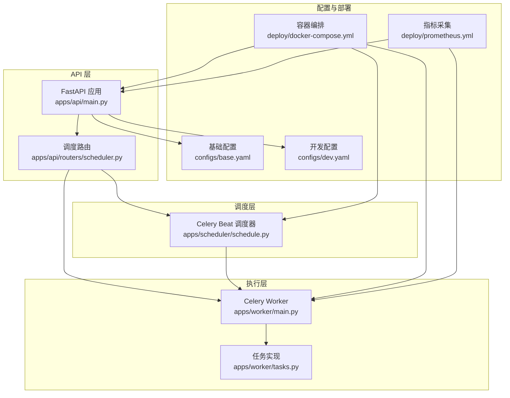
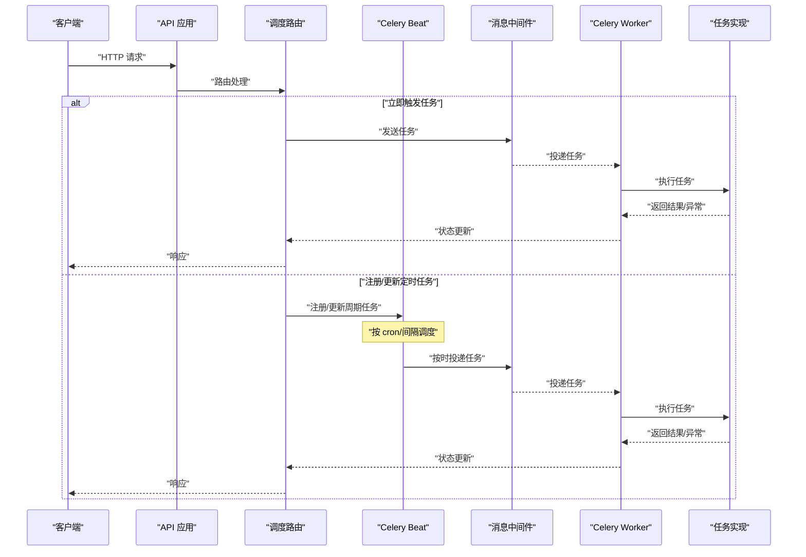
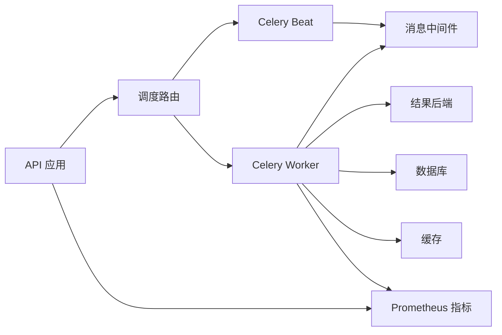

# 任务调度系统

<cite>
**本文引用的文件**   
- [apps/api/main.py](file://apps/api/main.py)
- [apps/api/routers/scheduler.py](file://apps/api/routers/scheduler.py)
- [apps/scheduler/schedule.py](file://apps/scheduler/schedule.py)
- [apps/worker/main.py](file://apps/worker/main.py)
- [apps/worker/tasks.py](file://apps/worker/tasks.py)
- [configs/base.yaml](file://configs/base.yaml)
- [configs/dev.yaml](file://configs/dev.yaml)
- [deploy/docker-compose.yml](file://deploy/docker-compose.yml)
- [deploy/prometheus.yml](file://deploy/prometheus.yml)
- [packages/observability/__init__.py](file://packages/observability/__init__.py)
- [tests/unit/test_scheduler.py](file://tests/unit/test_scheduler.py)
- [tests/unit/test_worker_tasks.py](file://tests/unit/test_worker_tasks.py)
</cite>

## 目录
1. [简介](#简介)
2. [项目结构](#项目结构)
3. [核心组件](#核心组件)
4. [架构总览](#架构总览)
5. [详细组件分析](#详细组件分析)
6. [依赖关系分析](#依赖关系分析)
7. [性能与扩展性](#性能与扩展性)
8. [故障排查指南](#故障排查指南)
9. [结论](#结论)
10. [附录](#附录)

## 简介
本文件面向任务调度系统的研发与运维人员，系统性阐述基于 Celery 的异步任务队列配置、定时任务调度策略（含 cron 表达式与动态注册）、任务优先级与失败重试机制、监控日志与性能追踪、分布式部署与负载均衡策略，并通过一个复杂 ETL 编排案例串联端到端流程。文档力求在保持技术深度的同时，兼顾非专业读者的可理解性。

## 项目结构
本项目采用分层与按功能域组织相结合的结构：
- API 层：提供任务触发、状态查询等 HTTP 接口
- 调度器：定义并管理周期性任务（Celery Beat）
- Worker：执行具体任务的进程
- 配置：集中式 YAML 配置，区分基础与开发环境
- 可观测性：指标、日志、链路追踪集成
- 部署：Docker Compose 编排服务，Prometheus 采集指标

图表来源
- [apps/api/main.py](file://apps/api/main.py)
- [apps/api/routers/scheduler.py](file://apps/api/routers/scheduler.py)
- [apps/scheduler/schedule.py](file://apps/scheduler/schedule.py)
- [apps/worker/main.py](file://apps/worker/main.py)
- [apps/worker/tasks.py](file://apps/worker/tasks.py)
- [configs/base.yaml](file://configs/base.yaml)
- [configs/dev.yaml](file://configs/dev.yaml)
- [deploy/docker-compose.yml](file://deploy/docker-compose.yml)
- [deploy/prometheus.yml](file://deploy/prometheus.yml)

章节来源
- [apps/api/main.py](file://apps/api/main.py)
- [apps/api/routers/scheduler.py](file://apps/api/routers/scheduler.py)
- [apps/scheduler/schedule.py](file://apps/scheduler/schedule.py)
- [apps/worker/main.py](file://apps/worker/main.py)
- [apps/worker/tasks.py](file://apps/worker/tasks.py)
- [configs/base.yaml](file://configs/base.yaml)
- [configs/dev.yaml](file://configs/dev.yaml)
- [deploy/docker-compose.yml](file://deploy/docker-compose.yml)
- [deploy/prometheus.yml](file://deploy/prometheus.yml)

## 核心组件
- API 应用与调度路由：负责对外暴露任务触发、状态查询、调度管理等 REST 接口，并与调度器/Worker 交互
- Celery Beat 调度器：加载周期任务定义，按 cron 或间隔策略投递任务到消息中间件
- Celery Worker：消费队列中的任务，执行业务逻辑，支持并发、优先级与重试
- 配置中心：YAML 配置文件统一注入 Broker、结果后端、任务路由、重试策略等
- 可观测性：通过 Prometheus 指标、结构化日志与可选链路追踪，覆盖任务生命周期

章节来源
- [apps/api/main.py](file://apps/api/main.py)
- [apps/api/routers/scheduler.py](file://apps/api/routers/scheduler.py)
- [apps/scheduler/schedule.py](file://apps/scheduler/schedule.py)
- [apps/worker/main.py](file://apps/worker/main.py)
- [apps/worker/tasks.py](file://apps/worker/tasks.py)
- [configs/base.yaml](file://configs/base.yaml)
- [configs/dev.yaml](file://configs/dev.yaml)

## 架构总览
下图展示从 API 触发到 Worker 执行的完整调用链，以及调度器的周期性触发路径。

图表来源
- [apps/api/main.py](file://apps/api/main.py)
- [apps/api/routers/scheduler.py](file://apps/api/routers/scheduler.py)
- [apps/scheduler/schedule.py](file://apps/scheduler/schedule.py)
- [apps/worker/main.py](file://apps/worker/main.py)
- [apps/worker/tasks.py](file://apps/worker/tasks.py)

## 详细组件分析

### API 应用与调度路由
- 职责
  - 启动 FastAPI 应用，挂载健康检查、任务触发、状态查询、调度管理等路由
  - 校验请求参数，构造任务参数，调用底层调度能力
  - 返回任务 ID 与状态查询入口，便于前端轮询或回调
- 关键设计点
  - 路由与业务解耦：仅做入参校验与转发
  - 幂等性：对重复提交进行去重或幂等键控制
  - 错误处理：统一错误码与提示，避免泄露内部细节

章节来源
- [apps/api/main.py](file://apps/api/main.py)
- [apps/api/routers/scheduler.py](file://apps/api/routers/scheduler.py)

### Celery Beat 调度器
- 职责
  - 加载周期任务定义，支持 cron 表达式与固定间隔
  - 支持动态注册/更新/删除周期任务，满足运行时调整需求
- 关键设计点
  - 配置驱动：cron 表达式、时区、最大运行时间等来自配置
  - 动态注册：通过 API 或管理命令在运行时更新任务计划
  - 幂等与容错：任务重复投递时的幂等键与去重策略

章节来源
- [apps/scheduler/schedule.py](file://apps/scheduler/schedule.py)
- [tests/unit/test_scheduler.py](file://tests/unit/test_scheduler.py)

### Celery Worker 与任务实现
- 职责
  - 消费队列任务，执行业务逻辑，持久化结果与审计信息
  - 实现任务重试、超时、优先级路由、并发控制
- 关键设计点
  - 重试策略：指数退避、最大重试次数、死信队列
  - 优先级：不同任务类型路由至不同队列，结合 Broker 优先级特性
  - 可观测性：记录结构化日志、上报指标、可选链路追踪

章节来源
- [apps/worker/main.py](file://apps/worker/main.py)
- [apps/worker/tasks.py](file://apps/worker/tasks.py)
- [tests/unit/test_worker_tasks.py](file://tests/unit/test_worker_tasks.py)

### 配置中心（YAML）
- 职责
  - 集中管理 Broker、结果后端、任务路由、重试策略、日志级别、可观测性开关等
  - 区分基础配置与环境差异化配置
- 关键设计点
  - 配置合并：基础配置 + 环境覆盖
  - 安全敏感项：密钥与连接串通过环境变量注入
  - 热更新：部分配置支持运行时刷新（如日志级别）

章节来源
- [configs/base.yaml](file://configs/base.yaml)
- [configs/dev.yaml](file://configs/dev.yaml)

### 可观测性与监控
- 职责
  - 暴露 Prometheus 指标（任务吞吐、延迟、失败率、队列长度等）
  - 结构化日志输出，便于集中收集与分析
  - 可选链路追踪，用于跨服务调用链定位问题
- 关键设计点
  - 指标粒度：任务级、队列级、实例级
  - 采样与降采样：高吞吐场景下的指标聚合
  - 告警规则：失败率、延迟阈值、队列堆积告警

章节来源
- [deploy/prometheus.yml](file://deploy/prometheus.yml)
- [packages/observability/__init__.py](file://packages/observability/__init__.py)

### 部署与编排
- 职责
  - 使用 Docker Compose 编排 API、Beat、Worker、数据库、缓存、消息中间件等
  - 配置网络、卷、环境变量、资源限制与健康检查
- 关键设计点
  - 水平扩展：多 Worker 实例共享同一队列，实现负载均衡
  - 隔离：不同任务类型使用独立队列与 Worker 池
  - 弹性：根据负载自动扩缩容（结合编排平台能力）

章节来源
- [deploy/docker-compose.yml](file://deploy/docker-compose.yml)

## 依赖关系分析
- 组件耦合
  - API 与调度路由低耦合，仅依赖调度抽象
  - Beat 与 Worker 通过消息中间件解耦
  - 任务实现与基础设施通过配置与抽象接口隔离
- 外部依赖
  - 消息中间件（Broker）
  - 结果后端（存储任务结果与状态）
  - 监控系统（Prometheus）
  - 数据库与缓存（数据读写与缓存）

图表来源
- [apps/api/main.py](file://apps/api/main.py)
- [apps/api/routers/scheduler.py](file://apps/api/routers/scheduler.py)
- [apps/scheduler/schedule.py](file://apps/scheduler/schedule.py)
- [apps/worker/main.py](file://apps/worker/main.py)
- [apps/worker/tasks.py](file://apps/worker/tasks.py)
- [deploy/prometheus.yml](file://deploy/prometheus.yml)

章节来源
- [apps/api/main.py](file://apps/api/main.py)
- [apps/api/routers/scheduler.py](file://apps/api/routers/scheduler.py)
- [apps/scheduler/schedule.py](file://apps/scheduler/schedule.py)
- [apps/worker/main.py](file://apps/worker/main.py)
- [apps/worker/tasks.py](file://apps/worker/tasks.py)
- [deploy/prometheus.yml](file://deploy/prometheus.yml)

## 性能与扩展性
- 任务优先级
  - 通过不同队列与 Worker 池分离高优与低优任务
  - 结合 Broker 优先级特性，确保关键任务优先执行
- 失败重试
  - 指数退避与最大重试次数，避免雪崩
  - 死信队列兜底，便于人工干预与补偿
- 并发与吞吐
  - 合理设置 Worker 并发度与预取数
  - 批量任务拆分与并行化，提升吞吐
- 可观测性
  - 指标维度：任务名、队列、实例、阶段（入队、开始、完成、失败）
  - 日志规范：结构化字段、关联 ID、耗时、错误码
- 扩展性
  - 新增任务类型无需改动核心框架，仅需注册任务与路由
  - 动态注册周期任务，支持运行时调整调度策略

[本节为通用指导，不直接分析具体文件]

## 故障排查指南
- 常见问题
  - 任务未执行：检查 Broker 连通性、队列名称、Worker 是否在线
  - 任务重复执行：确认幂等键与去重策略
  - 任务失败重试风暴：检查重试策略与退避参数
  - 指标缺失：确认 Prometheus 抓取配置与端口暴露
- 定位方法
  - 查看任务日志与错误堆栈
  - 检查任务状态与结果后端
  - 观察队列长度与 Worker 利用率
  - 使用链路追踪定位慢调用与瓶颈

章节来源
- [tests/unit/test_worker_tasks.py](file://tests/unit/test_worker_tasks.py)
- [tests/unit/test_scheduler.py](file://tests/unit/test_scheduler.py)

## 结论
本任务调度系统以 Celery 为核心，结合 API、Beat、Worker 与配置中心，形成高内聚、低耦合的可扩展架构。通过优先级、重试、可观测性与分布式部署，满足复杂 ETL 与实时数据处理的需求。建议在生产环境中完善监控告警、容量规划与灰度发布策略，持续提升稳定性与效率。

[本节为总结性内容，不直接分析具体文件]

## 附录

### 定时任务调度策略与 cron 表达式
- 策略要点
  - 使用 cron 表达式精确控制执行时机与时区
  - 支持动态注册/更新/删除周期任务，满足运行时调整
  - 任务幂等键避免重复执行导致的数据不一致
- 示例说明
  - 每日开盘前拉取市场数据
  - 每小时计算因子与指标
  - 每五分钟清理临时结果

章节来源
- [apps/scheduler/schedule.py](file://apps/scheduler/schedule.py)
- [tests/unit/test_scheduler.py](file://tests/unit/test_scheduler.py)

### 任务优先级管理与失败重试机制
- 优先级
  - 不同队列承载不同优先级任务
  - Worker 池按队列隔离，保障高优任务及时消费
- 重试
  - 指数退避与最大重试次数
  - 死信队列兜底，便于人工介入
- 示例说明
  - 关键交易数据拉取高优先级
  - 非关键报表生成低优先级
  - 网络抖动导致的瞬时失败自动重试

章节来源
- [apps/worker/main.py](file://apps/worker/main.py)
- [apps/worker/tasks.py](file://apps/worker/tasks.py)
- [tests/unit/test_worker_tasks.py](file://tests/unit/test_worker_tasks.py)

### 任务监控、日志与性能追踪
- 监控
  - Prometheus 指标：任务吞吐、延迟、失败率、队列长度
  - 告警规则：失败率、延迟、堆积阈值
- 日志
  - 结构化日志：任务 ID、阶段、耗时、错误码
  - 集中收集与检索
- 追踪
  - 链路追踪：跨服务调用链定位瓶颈
  - 采样策略：高吞吐场景下降低开销

章节来源
- [deploy/prometheus.yml](file://deploy/prometheus.yml)
- [packages/observability/__init__.py](file://packages/observability/__init__.py)

### 分布式部署与负载均衡
- 部署
  - Docker Compose 编排 API、Beat、Worker、数据库、缓存、消息中间件
  - 环境变量注入敏感配置
- 负载均衡
  - 多 Worker 实例共享队列，天然负载均衡
  - 按任务类型划分队列与 Worker 池，避免相互影响
- 弹性伸缩
  - 根据负载自动扩缩容
  - 健康检查与自愈

章节来源
- [deploy/docker-compose.yml](file://deploy/docker-compose.yml)
- [configs/base.yaml](file://configs/base.yaml)
- [configs/dev.yaml](file://configs/dev.yaml)

### 复杂 ETL 任务编排与执行流程
- 编排思路
  - 将 ETL 拆分为多个子任务：数据拉取、清洗、转换、入库、校验、报告
  - 使用 DAG 或工作流引擎编排，支持条件分支与重试
- 执行流程
  - 上游任务完成后触发下游任务
  - 失败节点重试与补偿
  - 全链路可观测与审计
- 示例说明
  - 每日收盘后批量处理行情与基本面数据
  - 增量更新与全量校验结合
  - 结果写入数据仓库并生成质量报告

章节来源
- [apps/worker/tasks.py](file://apps/worker/tasks.py)
- [apps/api/routers/scheduler.py](file://apps/api/routers/scheduler.py)
- [apps/scheduler/schedule.py](file://apps/scheduler/schedule.py)