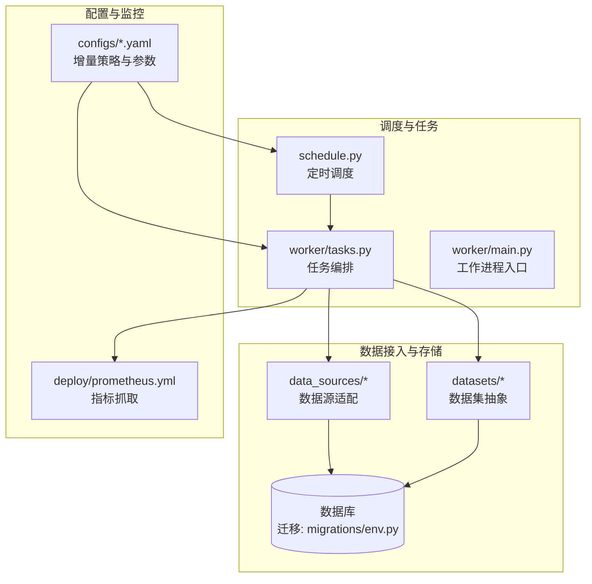
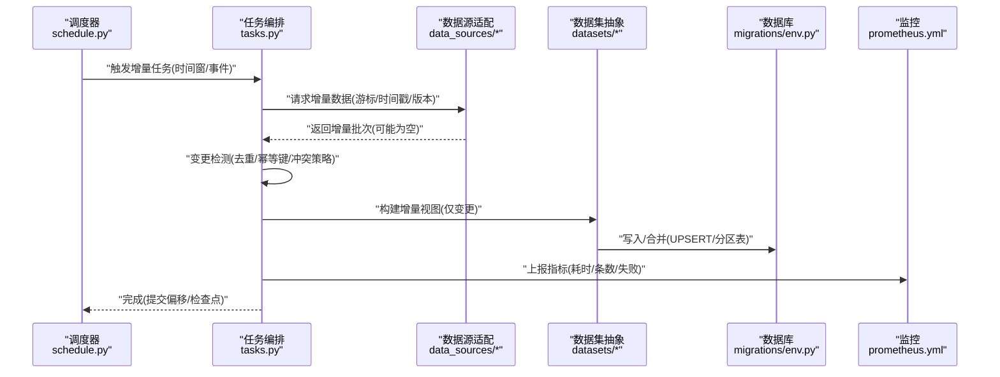
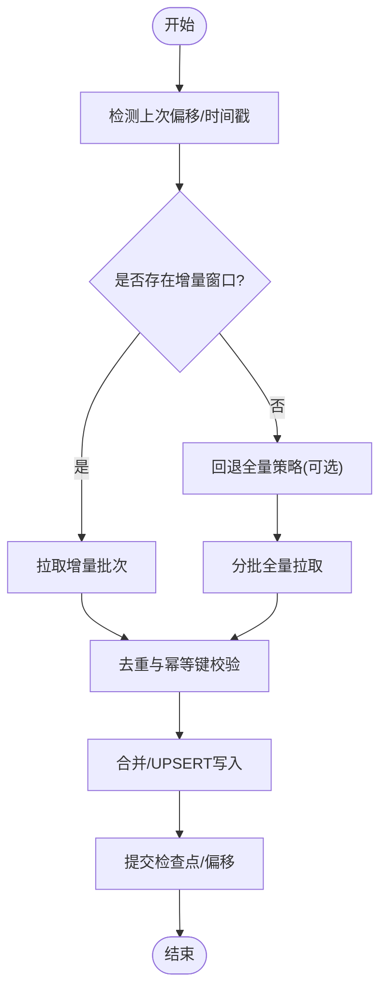
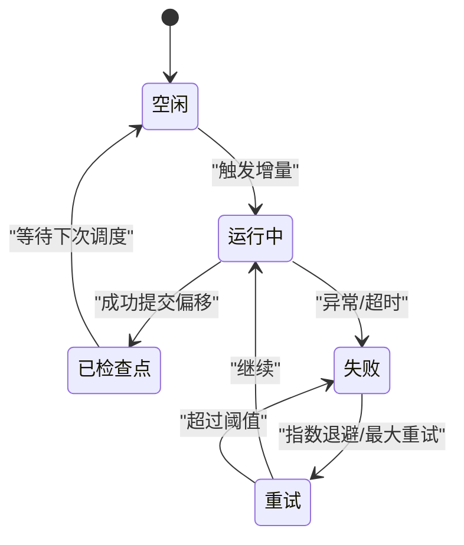
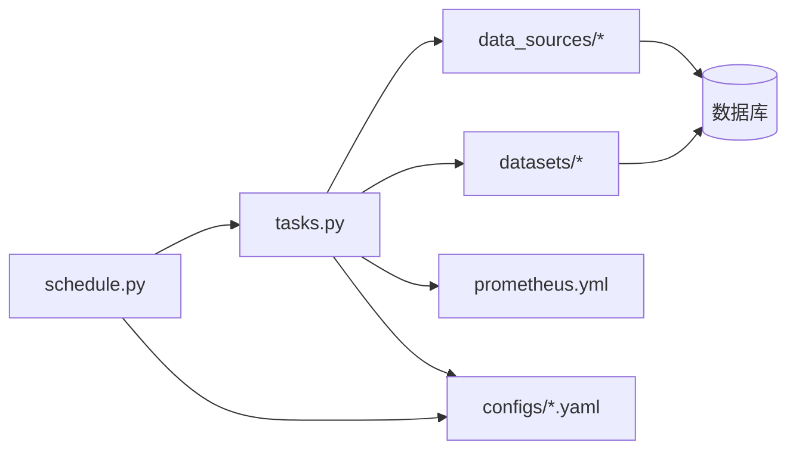

# 增量更新机制

<cite>
**本文引用的文件**   
- [apps/worker/main.py](file://apps/worker/main.py)
- [apps/worker/tasks.py](file://apps/worker/tasks.py)
- [apps/scheduler/schedule.py](file://apps/scheduler/schedule.py)
- [packages/ingestion/__init__.py](file://packages/ingestion/__init__.py)
- [packages/datasets/__init__.py](file://packages/datasets/__init__.py)
- [packages/data_sources/__init__.py](file://packages/data_sources/__init__.py)
- [configs/base.yaml](file://configs/base.yaml)
- [configs/dev.yaml](file://configs/dev.yaml)
- [sql/migrations/env.py](file://sql/migrations/env.py)
- [deploy/prometheus.yml](file://deploy/prometheus.yml)
</cite>

## 目录
1. [简介](#简介)
2. [项目结构](#项目结构)
3. [核心组件](#核心组件)
4. [架构总览](#架构总览)
5. [详细组件分析](#详细组件分析)
6. [依赖关系分析](#依赖关系分析)
7. [性能考虑](#性能考虑)
8. [故障排查指南](#故障排查指南)
9. [结论](#结论)
10. [附录](#附录)

## 简介
本文件围绕“增量更新机制”展开，聚焦于以下目标：
- 增量数据与全量数据的识别和处理策略
- 数据变更检测与同步机制的实现原理
- 断点续传与冲突解决的技术方案
- 增量更新的配置参数与性能优化选项
- 错误处理与恢复机制
- 大规模增量同步的性能监控与调优建议
- 不同数据源的增量更新实现方案与最佳实践（以仓库现有模块为参考）

## 项目结构
从仓库结构看，增量更新相关能力分布在调度、任务执行、数据接入与数据集抽象层：
- 调度层：负责周期性触发增量或全量任务
- 任务层：具体执行拉取、转换、写入与状态管理
- 数据源层：对接外部数据源，提供增量/全量读取接口
- 数据集层：对上层暴露统一的数据集访问语义（含增量视图）
- 配置层：集中定义增量策略、批大小、重试等参数
- 可观测性：通过 Prometheus 指标采集进行监控

图表来源
- [apps/scheduler/schedule.py](file://apps/scheduler/schedule.py)
- [apps/worker/tasks.py](file://apps/worker/tasks.py)
- [apps/worker/main.py](file://apps/worker/main.py)
- [packages/data_sources/__init__.py](file://packages/data_sources/__init__.py)
- [packages/datasets/__init__.py](file://packages/datasets/__init__.py)
- [sql/migrations/env.py](file://sql/migrations/env.py)
- [deploy/prometheus.yml](file://deploy/prometheus.yml)

章节来源
- [apps/worker/main.py](file://apps/worker/main.py)
- [apps/worker/tasks.py](file://apps/worker/tasks.py)
- [apps/scheduler/schedule.py](file://apps/scheduler/schedule.py)
- [packages/ingestion/__init__.py](file://packages/ingestion/__init__.py)
- [packages/datasets/__init__.py](file://packages/datasets/__init__.py)
- [packages/data_sources/__init__.py](file://packages/data_sources/__init__.py)
- [configs/base.yaml](file://configs/base.yaml)
- [configs/dev.yaml](file://configs/dev.yaml)
- [sql/migrations/env.py](file://sql/migrations/env.py)
- [deploy/prometheus.yml](file://deploy/prometheus.yml)

## 核心组件
- 调度器：按周期或事件驱动触发增量/全量任务；支持基于时间窗口的增量范围计算。
- 任务编排：将一次增量更新拆分为多个阶段（发现变更、拉取、去重、合并、落库、校验）。
- 数据源适配：封装外部数据源的差异读取能力（如游标、时间戳、版本号），并兼容无增量能力的源回退到全量。
- 数据集抽象：向上层提供统一的增量视图（例如“自某时间点以来的变更”），屏蔽底层差异。
- 配置中心：集中管理增量策略（窗口大小、并发度、重试次数、幂等键、冲突策略等）。
- 可观测性：在关键路径埋点指标（拉取耗时、记录数、失败率、延迟等），供 Prometheus 抓取。

章节来源
- [apps/scheduler/schedule.py](file://apps/scheduler/schedule.py)
- [apps/worker/tasks.py](file://apps/worker/tasks.py)
- [packages/data_sources/__init__.py](file://packages/data_sources/__init__.py)
- [packages/datasets/__init__.py](file://packages/datasets/__init__.py)
- [configs/base.yaml](file://configs/base.yaml)
- [configs/dev.yaml](file://configs/dev.yaml)
- [deploy/prometheus.yml](file://deploy/prometheus.yml)

## 架构总览
下图展示一次典型增量更新的端到端流程，包括调度、任务编排、数据源读取、变更检测、合并写入与监控埋点。

图表来源
- [apps/scheduler/schedule.py](file://apps/scheduler/schedule.py)
- [apps/worker/tasks.py](file://apps/worker/tasks.py)
- [packages/data_sources/__init__.py](file://packages/data_sources/__init__.py)
- [packages/datasets/__init__.py](file://packages/datasets/__init__.py)
- [sql/migrations/env.py](file://sql/migrations/env.py)
- [deploy/prometheus.yml](file://deploy/prometheus.yml)

## 详细组件分析

### 增量与全量的识别策略
- 识别依据
  - 数据源能力：若数据源提供增量接口（游标、时间戳、版本号），优先使用增量；否则回退全量。
  - 任务上下文：调度传入的“上次成功偏移/时间戳”，用于计算本次增量窗口。
  - 业务开关：配置项控制是否强制全量（如冷启动、修复场景）。
- 处理策略
  - 增量模式：仅拉取窗口内变更，结合幂等键与冲突策略进行合并。
  - 全量模式：按批次拉取并覆盖或合并，通常用于首次初始化或修复。
- 推荐实践
  - 为所有数据源统一暴露“是否支持增量”的能力探测方法。
  - 在全量模式下采用分片并行与幂等写入，避免重复与乱序影响。

章节来源
- [packages/data_sources/__init__.py](file://packages/data_sources/__init__.py)
- [packages/datasets/__init__.py](file://packages/datasets/__init__.py)
- [configs/base.yaml](file://configs/base.yaml)
- [configs/dev.yaml](file://configs/dev.yaml)

### 数据变更检测与同步机制
- 变更检测
  - 基于时间戳/游标的窗口过滤，确保不遗漏、不重复。
  - 应用层去重：利用唯一键/幂等键集合，结合数据库约束保证最终一致性。
- 同步机制
  - 两阶段提交思想：先写增量日志/临时表，再原子切换或合并至主表。
  - 幂等写入：UPSERT 或 MERGE 语句，避免重复提交导致数据膨胀。
  - 顺序保证：必要时引入序列号或分区键排序，减少乱序带来的冲突。

图表来源
- [apps/worker/tasks.py](file://apps/worker/tasks.py)
- [packages/data_sources/__init__.py](file://packages/data_sources/__init__.py)
- [packages/datasets/__init__.py](file://packages/datasets/__init__.py)

章节来源
- [apps/worker/tasks.py](file://apps/worker/tasks.py)
- [packages/data_sources/__init__.py](file://packages/data_sources/__init__.py)
- [packages/datasets/__init__.py](file://packages/datasets/__init__.py)

### 断点续传与冲突解决
- 断点续传
  - 检查点：每次成功提交后持久化“偏移/时间戳/版本号”。
  - 失败恢复：重启后读取最近检查点，从该位置继续拉取。
  - 幂等性：同一批次多次提交不会产生重复数据。
- 冲突解决
  - 策略选择：最新值优先、指定字段覆盖、或业务规则合并。
  - 冲突检测：比较关键字段变化，记录冲突事件以便审计。
  - 补偿任务：针对异常分支提供人工或自动补偿流程。

图表来源
- [apps/worker/tasks.py](file://apps/worker/tasks.py)
- [configs/base.yaml](file://configs/base.yaml)
- [configs/dev.yaml](file://configs/dev.yaml)

章节来源
- [apps/worker/tasks.py](file://apps/worker/tasks.py)
- [configs/base.yaml](file://configs/base.yaml)
- [configs/dev.yaml](file://configs/dev.yaml)

### 增量更新配置参数与性能优化
- 关键配置项（示例类别）
  - 增量窗口：窗口大小、滑动步长、保留时长
  - 并发与批大小：并发拉取数、每批记录数
  - 重试与退避：最大重试次数、退避策略
  - 幂等与冲突：幂等键字段、冲突策略（覆盖/跳过/合并）
  - 资源限制：CPU/内存上限、连接池大小
- 性能优化建议
  - 合理设置批大小与并发度，避免下游数据库拥塞
  - 使用 UPSERT/MERGE 减少二次查询
  - 对热点表建立合适索引，提升幂等判断效率
  - 开启只读副本用于历史回溯与报表查询

章节来源
- [configs/base.yaml](file://configs/base.yaml)
- [configs/dev.yaml](file://configs/dev.yaml)

### 错误处理与恢复机制
- 分类处理
  - 网络/超时：指数退避重试，记录告警
  - 数据不一致：标记异常批次，进入死信队列或隔离表
  - 幂等冲突：根据策略自动解决或转人工
- 恢复流程
  - 自动：基于检查点与重试策略恢复
  - 手动：提供补偿任务与回放工具
- 可观测性
  - 指标：拉取耗时、失败率、重试次数、延迟分布
  - 日志：结构化日志包含批次ID、偏移、错误码

章节来源
- [apps/worker/tasks.py](file://apps/worker/tasks.py)
- [deploy/prometheus.yml](file://deploy/prometheus.yml)

### 大规模增量同步的性能监控与调优
- 监控要点
  - 吞吐：每秒记录数、批次大小分布
  - 延迟：端到端延迟、数据新鲜度
  - 稳定性：失败率、重试率、OOM/CPU 峰值
- 调优方向
  - 调整批大小与并发度，观察下游数据库压力
  - 拆分大表为分区表，按时间/维度分区写入
  - 预热索引与统计信息，减少冷启动开销
  - 使用物化视图或聚合表降低查询成本

章节来源
- [deploy/prometheus.yml](file://deploy/prometheus.yml)
- [sql/migrations/env.py](file://sql/migrations/env.py)

### 实际案例与最佳实践（基于仓库模块）
- 市场K线增量更新
  - 数据源：行情数据源提供时间戳/游标
  - 策略：按交易日窗口增量拉取，幂等键为“代码+时间戳”
  - 合并：UPSERT 到分区表，按日期分区
  - 监控：记录每日新增行数与延迟
- 公司行为（分红/拆股）增量更新
  - 数据源：公告/事件流
  - 策略：事件驱动触发增量，冲突时以最新公告为准
  - 恢复：失败事件进入死信队列，提供回放任务
- 基本面数据增量更新
  - 数据源：财报发布后增量推送
  - 策略：按报告期窗口增量，合并时保留审计轨迹
  - 监控：发布时效性与覆盖率

章节来源
- [packages/data_sources/__init__.py](file://packages/data_sources/__init__.py)
- [packages/datasets/__init__.py](file://packages/datasets/__init__.py)
- [apps/worker/tasks.py](file://apps/worker/tasks.py)

## 依赖关系分析
- 组件耦合
  - 调度器依赖任务编排；任务编排依赖数据源与数据集抽象；两者共同依赖配置与监控。
- 外部依赖
  - 数据库：通过迁移与环境脚本管理结构与连接
  - 监控：Prometheus 抓取应用暴露的指标
- 潜在循环依赖
  - 应避免数据源与数据集互相引用，保持单向依赖（任务→数据源→数据集）

图表来源
- [apps/scheduler/schedule.py](file://apps/scheduler/schedule.py)
- [apps/worker/tasks.py](file://apps/worker/tasks.py)
- [packages/data_sources/__init__.py](file://packages/data_sources/__init__.py)
- [packages/datasets/__init__.py](file://packages/datasets/__init__.py)
- [sql/migrations/env.py](file://sql/migrations/env.py)
- [deploy/prometheus.yml](file://deploy/prometheus.yml)

章节来源
- [apps/scheduler/schedule.py](file://apps/scheduler/schedule.py)
- [apps/worker/tasks.py](file://apps/worker/tasks.py)
- [packages/data_sources/__init__.py](file://packages/data_sources/__init__.py)
- [packages/datasets/__init__.py](file://packages/datasets/__init__.py)
- [sql/migrations/env.py](file://sql/migrations/env.py)
- [deploy/prometheus.yml](file://deploy/prometheus.yml)

## 性能考虑
- 批大小与并发度需联合调优，避免下游数据库锁竞争
- 使用幂等键与UPSERT减少重复写入与二次查询
- 分区表与索引设计对增量合并至关重要
- 监控指标应覆盖端到端延迟与吞吐，及时定位瓶颈

## 故障排查指南
- 常见问题
  - 增量丢失：检查偏移提交时机与幂等键设计
  - 重复数据：确认UPSERT逻辑与唯一约束
  - 高延迟：关注批大小、并发度与下游数据库负载
- 定位手段
  - 查看任务日志中的批次ID与偏移
  - 通过监控面板观察失败率与重试曲线
  - 回放死信队列中的异常批次进行复现

章节来源
- [apps/worker/tasks.py](file://apps/worker/tasks.py)
- [deploy/prometheus.yml](file://deploy/prometheus.yml)

## 结论
本增量更新机制以“调度—任务—数据源—数据集—数据库—监控”为主线，通过明确的增量/全量识别、变更检测、断点续传与冲突解决策略，保障大规模数据同步的可靠性与性能。配合合理的配置与监控，可在多数据源场景下稳定落地。

## 附录
- 术语
  - 增量：仅包含自上次成功偏移以来的变更数据
  - 全量：完整数据集的一次性拉取与合并
  - 幂等键：确保相同数据多次提交不会产生重复记录的键
  - 检查点：持久化的进度标记，用于断点续传
- 参考文件
  - 调度与任务：[apps/scheduler/schedule.py](file://apps/scheduler/schedule.py)、[apps/worker/tasks.py](file://apps/worker/tasks.py)
  - 数据源与数据集：[packages/data_sources/__init__.py](file://packages/data_sources/__init__.py)、[packages/datasets/__init__.py](file://packages/datasets/__init__.py)
  - 配置与监控：[configs/base.yaml](file://configs/base.yaml)、[configs/dev.yaml](file://configs/dev.yaml)、[deploy/prometheus.yml](file://deploy/prometheus.yml)
  - 数据库迁移：[sql/migrations/env.py](file://sql/migrations/env.py)