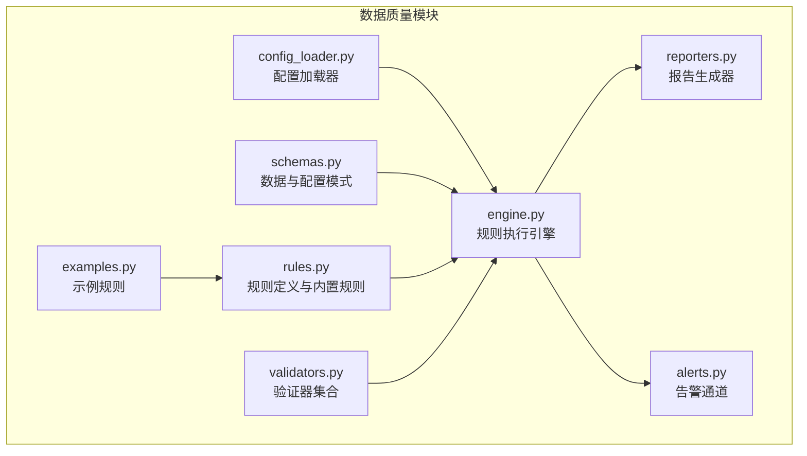
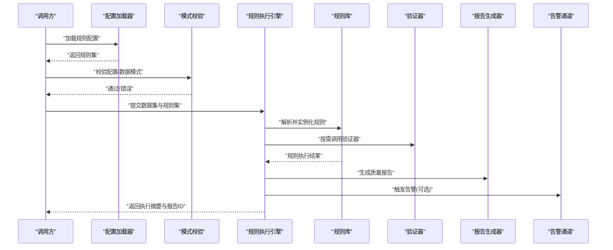
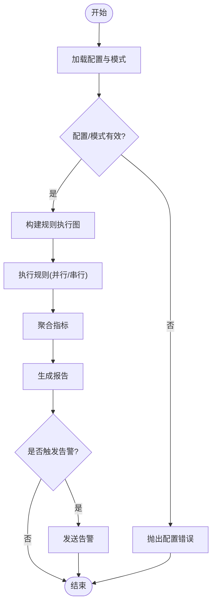
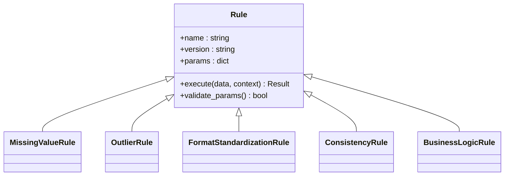
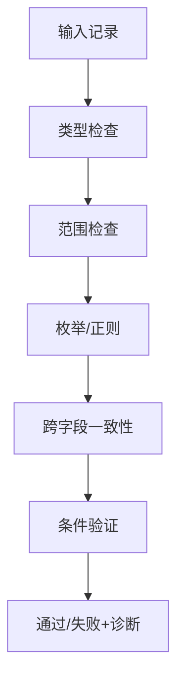
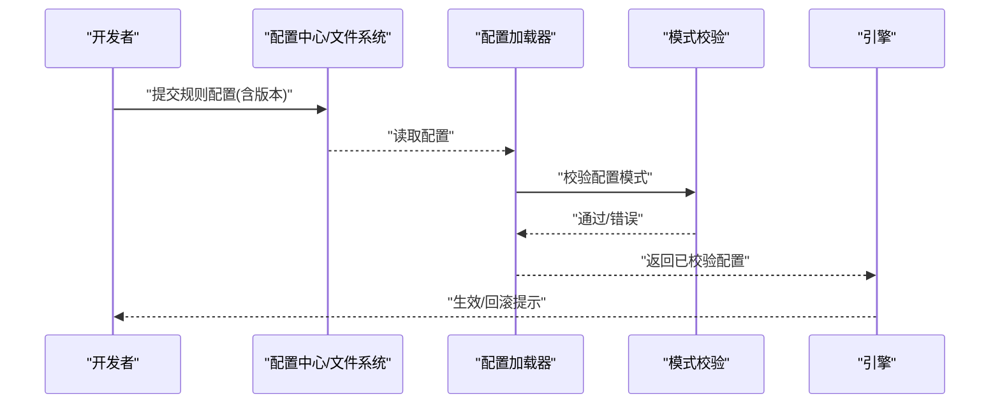
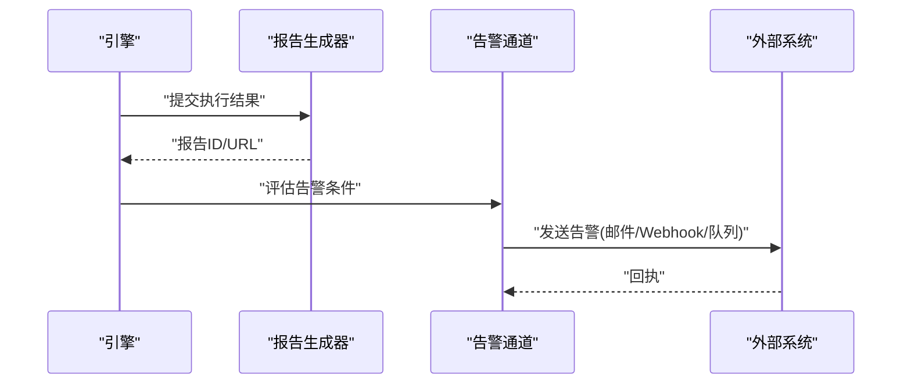
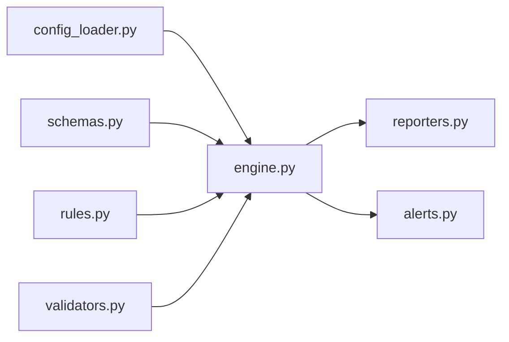

# 数据清洗规则

<cite>
**本文引用的文件**   
- [data_quality/__init__.py](file://packages/data_quality/__init__.py)
- [data_quality/engine.py](file://packages/data_quality/engine.py)
- [data_quality/rules.py](file://packages/data_quality/rules.py)
- [data_quality/reporters.py](file://packages/data_quality/reporters.py)
- [data_quality/validators.py](file://packages/data_quality/validators.py)
- [data_quality/config_loader.py](file://packages/data_quality/config_loader.py)
- [data_quality/schemas.py](file://packages/data_quality/schemas.py)
- [data_quality/alerts.py](file://packages/data_quality/alerts.py)
- [data_quality/examples.py](file://packages/data_quality/examples.py)
- [data_quality/test_rules.py](file://packages/data_quality/test_rules.py)
- [data_quality/test_engine.py](file://packages/data_quality/test_engine.py)
- [data_quality/test_reporters.py](file://packages/data_quality/test_reporters.py)
- [data_quality/test_validators.py](file://packages/data_quality/test_validators.py)
- [data_quality/test_config_loader.py](file://packages/data_quality/test_config_loader.py)
- [data_quality/test_alerts.py](file://packages/data_quality/test_alerts.py)
- [data_quality/test_examples.py](file://packages/data_quality/test_examples.py)
</cite>

## 目录
1. [简介](#简介)
2. [项目结构](#项目结构)
3. [核心组件](#核心组件)
4. [架构总览](#架构总览)
5. [详细组件分析](#详细组件分析)
6. [依赖关系分析](#依赖关系分析)
7. [性能考虑](#性能考虑)
8. [故障排查指南](#故障排查指南)
9. [结论](#结论)
10. [附录](#附录)

## 简介
本文件面向“数据质量检查框架”与“数据清洗规则”的设计与实现，覆盖以下目标：
- 解释数据质量检查框架的整体设计与关键流程
- 说明各类清洗规则的编写方法（缺失值处理、异常值检测、格式标准化）
- 介绍数据验证规则与业务逻辑校验的实现机制
- 文档化清洗规则的配置管理与版本控制策略
- 提供自定义清洗规则的开发指南与测试方法
- 说明数据质量报告生成与告警通知能力
- 通过实际案例展示复杂数据清洗场景的处理方案

## 项目结构
数据质量相关代码位于 packages/data_quality 目录下，采用分层与职责分离的组织方式：
- 引擎层：负责规则加载、执行编排、结果聚合与上报
- 规则层：定义通用规则基类与内置规则族（缺失值、异常值、格式等）
- 验证器层：提供字段级与记录级的校验工具
- 配置层：从 YAML/JSON 加载规则集、阈值与开关
- 报告与告警：输出结构化质量报告并触发告警通道
- 示例与测试：包含示例规则与单元测试，便于扩展与回归

图表来源
- [engine.py](file://packages/data_quality/engine.py)
- [rules.py](file://packages/data_quality/rules.py)
- [validators.py](file://packages/data_quality/validators.py)
- [config_loader.py](file://packages/data_quality/config_loader.py)
- [schemas.py](file://packages/data_quality/schemas.py)
- [reporters.py](file://packages/data_quality/reporters.py)
- [alerts.py](file://packages/data_quality/alerts.py)
- [examples.py](file://packages/data_quality/examples.py)

章节来源
- [__init__.py](file://packages/data_quality/__init__.py)
- [engine.py](file://packages/data_quality/engine.py)
- [rules.py](file://packages/data_quality/rules.py)
- [validators.py](file://packages/data_quality/validators.py)
- [config_loader.py](file://packages/data_quality/config_loader.py)
- [schemas.py](file://packages/data_quality/schemas.py)
- [reporters.py](file://packages/data_quality/reporters.py)
- [alerts.py](file://packages/data_quality/alerts.py)
- [examples.py](file://packages/data_quality/examples.py)

## 核心组件
- 规则执行引擎
  - 负责读取配置、解析规则、按批次或流式方式执行规则、汇总指标、驱动报告与告警
  - 支持并行执行、失败隔离、重试与降级策略
- 规则体系
  - 提供规则抽象基类与多种内置规则族：缺失值、异常值、格式标准化、一致性、业务约束
  - 规则可组合、可参数化、可带上下文（如市场日历、标的元信息）
- 验证器
  - 提供类型、范围、枚举、正则、跨字段一致性等原子验证能力
  - 支持复合验证器与条件验证
- 配置管理
  - 基于 YAML/JSON 的规则集描述，支持环境区分、版本标签、灰度发布
- 报告与告警
  - 输出结构化质量报告（JSON/CSV/HTML），支持阈值与趋势对比
  - 告警通道可扩展（邮件、Webhook、消息队列等）

章节来源
- [engine.py](file://packages/data_quality/engine.py)
- [rules.py](file://packages/data_quality/rules.py)
- [validators.py](file://packages/data_quality/validators.py)
- [config_loader.py](file://packages/data_quality/config_loader.py)
- [reporters.py](file://packages/data_quality/reporters.py)
- [alerts.py](file://packages/data_quality/alerts.py)

## 架构总览
下图展示了数据清洗规则在整体系统中的位置与交互。

图表来源
- [config_loader.py](file://packages/data_quality/config_loader.py)
- [schemas.py](file://packages/data_quality/schemas.py)
- [engine.py](file://packages/data_quality/engine.py)
- [rules.py](file://packages/data_quality/rules.py)
- [validators.py](file://packages/data_quality/validators.py)
- [reporters.py](file://packages/data_quality/reporters.py)
- [alerts.py](file://packages/data_quality/alerts.py)

## 详细组件分析

### 规则执行引擎
- 职责
  - 解析配置、构建规则图、调度执行、收集指标、驱动报告与告警
- 关键流程
  - 初始化：加载配置、校验模式、准备上下文
  - 执行：按依赖顺序或并行执行规则，捕获异常并隔离失败
  - 聚合：汇总通过率、失败率、影响行数、严重等级
  - 上报：写入报告、触发告警、持久化中间结果
- 扩展点
  - 自定义执行策略（批/流）、自定义上下文注入、自定义结果聚合器

图表来源
- [engine.py](file://packages/data_quality/engine.py)
- [config_loader.py](file://packages/data_quality/config_loader.py)
- [schemas.py](file://packages/data_quality/schemas.py)
- [reporters.py](file://packages/data_quality/reporters.py)
- [alerts.py](file://packages/data_quality/alerts.py)

章节来源
- [engine.py](file://packages/data_quality/engine.py)

### 规则体系与内置规则族
- 设计要点
  - 统一规则接口：输入为数据片段与上下文，输出为通过/失败与诊断信息
  - 参数化：阈值、窗口、容差、白名单等通过配置注入
  - 组合：规则可串联、分支、条件执行
- 内置规则族
  - 缺失值处理：空值比例、关键字段必填、时间戳连续性
  - 异常值检测：分位数截断、Z-score、IQR、领域阈值
  - 格式标准化：数值精度、日期/时区、编码、单位换算
  - 一致性校验：跨表关联完整性、主键唯一性、外键约束
  - 业务逻辑校验：交易时段、涨跌停、除权除息、基金申赎截止
- 开发建议
  - 优先使用验证器组合表达简单规则
  - 复杂规则封装为独立 Rule 子类，保持幂等与可观测性

图表来源
- [rules.py](file://packages/data_quality/rules.py)

章节来源
- [rules.py](file://packages/data_quality/rules.py)

### 验证器集合
- 能力清单
  - 类型与范围：整数、浮点、布尔、字符串长度、数值区间
  - 枚举与正则：取值域、模式匹配
  - 跨字段一致性：相等、大小关系、和为定值
  - 条件验证：当某字段满足条件时启用子验证器
- 使用方式
  - 在规则中组合多个验证器形成复合校验
  - 支持短路评估与详细错误定位

图表来源
- [validators.py](file://packages/data_quality/validators.py)

章节来源
- [validators.py](file://packages/data_quality/validators.py)

### 配置管理与版本控制
- 配置结构
  - 规则集：名称、版本、适用市场/标的、优先级
  - 参数：阈值、窗口、容差、白名单路径
  - 开关：启用/禁用、灰度比例、环境差异
- 版本控制
  - 语义化版本号；变更需保留向后兼容或提供迁移脚本
  - 配置 diff 与回滚策略；灰度发布与快速回退
- 加载流程
  - 从配置文件加载 -> 模式校验 -> 缓存 -> 热更新（可选）

图表来源
- [config_loader.py](file://packages/data_quality/config_loader.py)
- [schemas.py](file://packages/data_quality/schemas.py)

章节来源
- [config_loader.py](file://packages/data_quality/config_loader.py)
- [schemas.py](file://packages/data_quality/schemas.py)

### 报告与告警
- 报告
  - 结构化输出：JSON/CSV/HTML，包含规则明细、指标、受影响样本、趋势
  - 可订阅：按任务/数据集/规则维度聚合
- 告警
  - 阈值触发：失败率、严重级别、持续时长
  - 通道：邮件、Webhook、消息队列；支持去重与抑制

图表来源
- [reporters.py](file://packages/data_quality/reporters.py)
- [alerts.py](file://packages/data_quality/alerts.py)
- [engine.py](file://packages/data_quality/engine.py)

章节来源
- [reporters.py](file://packages/data_quality/reporters.py)
- [alerts.py](file://packages/data_quality/alerts.py)

### 自定义清洗规则开发指南
- 步骤
  - 继承规则基类，实现 execute 与 validate_params
  - 使用验证器组合表达基础校验，必要时引入领域上下文
  - 为规则添加参数与文档，确保可配置与可观测
- 最佳实践
  - 幂等与可重复执行；避免副作用
  - 明确失败语义与诊断信息；记录必要上下文
  - 对大数据集进行采样与基准测试
- 测试方法
  - 单测：构造最小数据集，断言通过/失败与诊断
  - 集成：端到端流水线验证，覆盖边界与异常路径
  - 回归：Golden 用例与快照对比

章节来源
- [rules.py](file://packages/data_quality/rules.py)
- [test_rules.py](file://packages/data_quality/test_rules.py)

### 示例与实战案例
- 示例规则
  - 缺失值：关键字段非空、时间序列连续
  - 异常值：价格偏离历史分位、成交量突增
  - 格式标准化：价格小数位、日期时区、币种单位
- 复杂场景
  - 多源数据冲突：以权威源为准，记录分歧与仲裁策略
  - 公司行为：除权除息、拆合股、分红派息的时间对齐与复权
  - 跨市场规则：交易时段、节假日、涨跌停限制

章节来源
- [examples.py](file://packages/data_quality/examples.py)
- [test_examples.py](file://packages/data_quality/test_examples.py)

## 依赖关系分析
- 内部依赖
  - 引擎依赖配置加载器、模式校验、规则库、验证器、报告与告警
  - 规则库依赖验证器与上下文提供者
- 外部依赖
  - 配置存储（YAML/JSON/配置中心）
  - 报告存储（对象存储/数据库）
  - 告警通道（邮件/IM/消息队列）

图表来源
- [config_loader.py](file://packages/data_quality/config_loader.py)
- [schemas.py](file://packages/data_quality/schemas.py)
- [engine.py](file://packages/data_quality/engine.py)
- [rules.py](file://packages/data_quality/rules.py)
- [validators.py](file://packages/data_quality/validators.py)
- [reporters.py](file://packages/data_quality/reporters.py)
- [alerts.py](file://packages/data_quality/alerts.py)

章节来源
- [engine.py](file://packages/data_quality/engine.py)
- [rules.py](file://packages/data_quality/rules.py)
- [validators.py](file://packages/data_quality/validators.py)
- [config_loader.py](file://packages/data_quality/config_loader.py)
- [schemas.py](file://packages/data_quality/schemas.py)
- [reporters.py](file://packages/data_quality/reporters.py)
- [alerts.py](file://packages/data_quality/alerts.py)

## 性能考虑
- 规则执行
  - 并行执行与资源池；短规则优先；长耗时规则异步化
  - 增量计算与缓存：对静态规则与热点数据进行缓存
- I/O 优化
  - 流式读取与分页；批量写入报告；压缩归档
- 内存与稳定性
  - 限制单次处理规模；失败隔离与重试；超时与熔断
- 监控与可观测性
  - 指标埋点：执行时长、吞吐、失败率、告警次数
  - 日志与追踪：规则名、参数、样本标识、错误堆栈

[本节为通用指导，不直接分析具体文件]

## 故障排查指南
- 常见问题
  - 配置错误：模式校验失败、参数越界、版本不兼容
  - 规则异常：未捕获异常、空指针、数据类型不一致
  - 性能问题：全量扫描、锁竞争、I/O 瓶颈
- 排查步骤
  - 查看报告中的失败明细与样本定位
  - 开启调试日志，核对规则参数与上下文
  - 使用最小数据集复现，逐步缩小范围
- 恢复策略
  - 快速回滚到上一稳定版本配置
  - 临时关闭高风险规则，先保通再修复
  - 对告警通道进行健康检查与重试

章节来源
- [engine.py](file://packages/data_quality/engine.py)
- [test_engine.py](file://packages/data_quality/test_engine.py)
- [test_reporters.py](file://packages/data_quality/test_reporters.py)
- [test_alerts.py](file://packages/data_quality/test_alerts.py)

## 结论
本框架通过清晰的层次划分与可扩展的规则体系，提供了完整的数据清洗与质量保障能力。借助配置化管理、版本控制、报告与告警，可在保证稳定性的同时快速迭代规则。建议在生产环境中结合监控与演练，持续提升数据质量与系统韧性。

[本节为总结性内容，不直接分析具体文件]

## 附录
- 术语
  - 规则：对数据施加的校验与转换逻辑
  - 验证器：原子校验能力的封装
  - 报告：结构化质量结果的输出
  - 告警：基于阈值的异常通知
- 参考
  - 示例规则与测试用例可作为扩展起点
  - 配置模式定义用于约束规则集的结构与语义

[本节为补充信息，不直接分析具体文件]