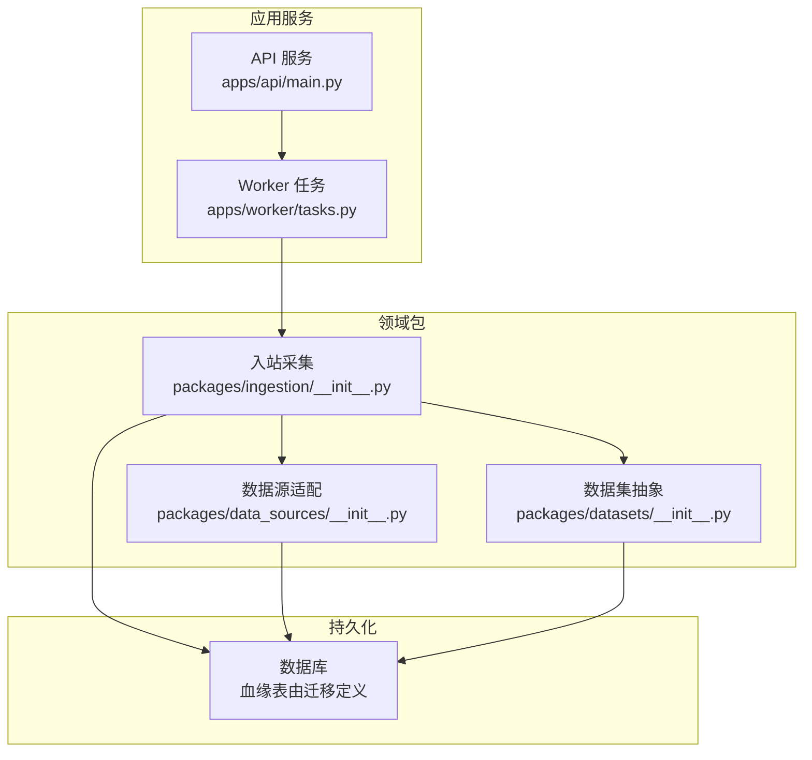
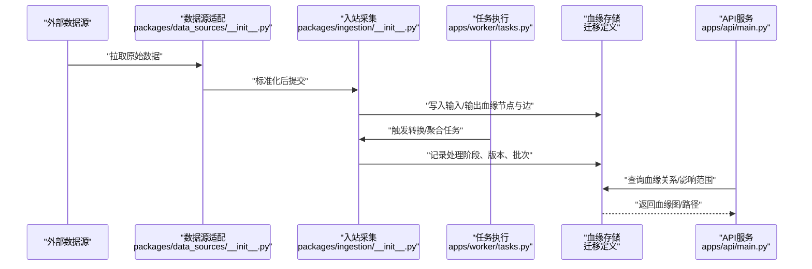
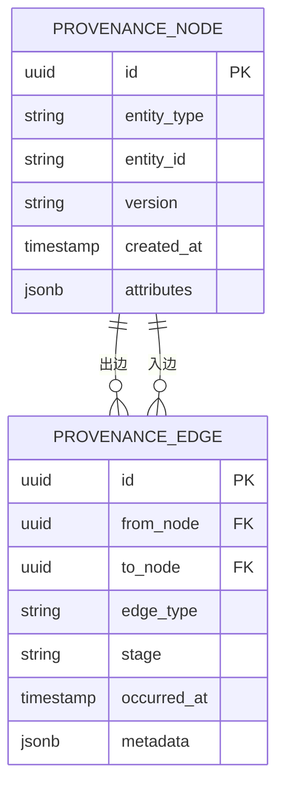
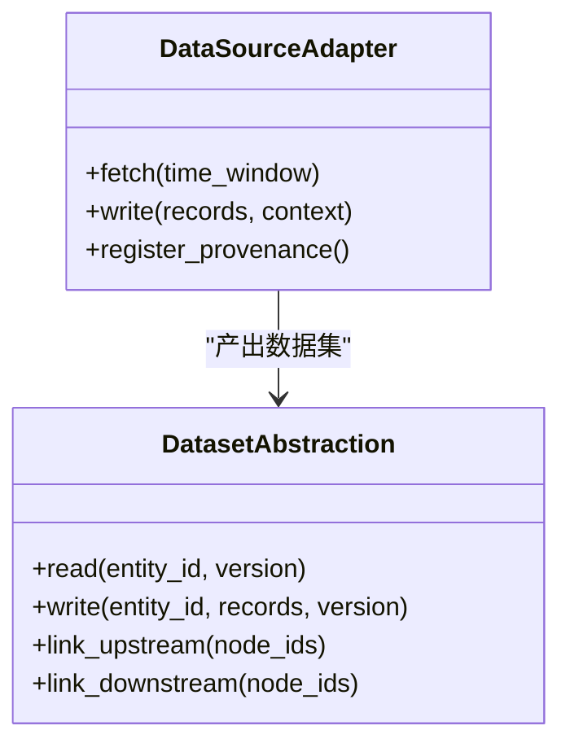
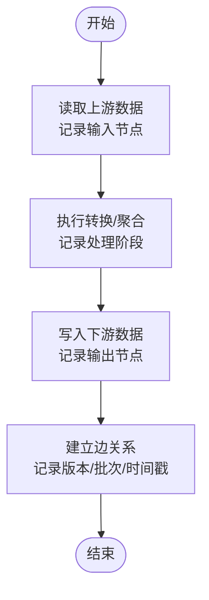
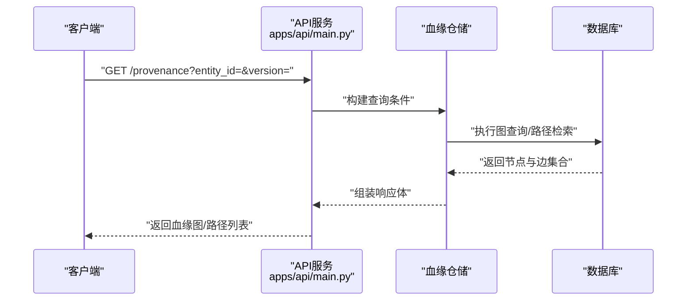
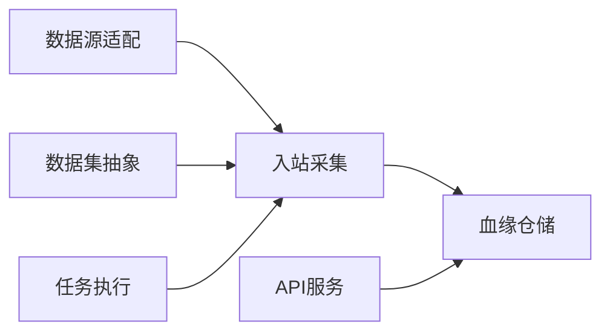

# 数据血缘追踪

<cite>
**本文引用的文件**   
- [apps/api/main.py](file://apps/api/main.py)
- [apps/api/deps.py](file://apps/api/deps.py)
- [apps/worker/tasks.py](file://apps/worker/tasks.py)
- [packages/data_sources/__init__.py](file://packages/data_sources/__init__.py)
- [packages/datasets/__init__.py](file://packages/datasets/__init__.py)
- [packages/ingestion/__init__.py](file://packages/ingestion/__init__.py)
- [sql/migrations/20260715_0007_market_bar_provenance.py](file://sql/migrations/20260715_0007_market_bar_provenance.py)
- [sql/migrations/20260715_0008_ca_nav_provenance.py](file://sql/migrations/20260715_0008_ca_nav_provenance.py)
- [tests/unit/test_adapter_provenance.py](file://tests/unit/test_adapter_provenance.py)
- [tests/unit/test_ingestion_sql_sink.py](file://tests/unit/test_ingestion_sql_sink.py)
</cite>

## 目录
1. [简介](#简介)
2. [项目结构](#项目结构)
3. [核心组件](#核心组件)
4. [架构总览](#架构总览)
5. [详细组件分析](#详细组件分析)
6. [依赖关系分析](#依赖关系分析)
7. [性能考虑](#性能考虑)
8. [故障排查指南](#故障排查指南)
9. [结论](#结论)
10. [附录](#附录)

## 简介
本文件围绕“数据血缘追踪”目标，系统化阐述该仓库中数据来源追踪、转换过程记录与结果影响分析的建模与实现。重点覆盖：
- 血缘关系的建模与存储机制（数据库迁移定义）
- 数据采集与入湖过程中的血缘采集点
- 转换与任务执行中的血缘注入
- 版本控制与变更历史管理
- 血缘查询API与可视化展示思路
- 问题排查与影响分析方法
- 大数据量场景下的存储优化与查询调优
- 复杂数据处理链路的实际案例

## 项目结构
从仓库结构看，血缘相关能力主要分布在以下位置：
- API层：提供健康检查与可能的血缘查询接口入口
- Worker层：调度与执行数据任务，负责在任务执行过程中写入血缘
- 包层：数据源适配、数据集抽象、入站采集等模块，是血缘信息的来源与注入点
- 迁移脚本：定义血缘表结构与索引策略
- 测试：验证适配器与SQL Sink的血缘写入逻辑

图表来源
- [apps/api/main.py](file://apps/api/main.py)
- [apps/worker/tasks.py](file://apps/worker/tasks.py)
- [packages/data_sources/__init__.py](file://packages/data_sources/__init__.py)
- [packages/datasets/__init__.py](file://packages/datasets/__init__.py)
- [packages/ingestion/__init__.py](file://packages/ingestion/__init__.py)
- [sql/migrations/20260715_0007_market_bar_provenance.py](file://sql/migrations/20260715_0007_market_bar_provenance.py)
- [sql/migrations/20260715_0008_ca_nav_provenance.py](file://sql/migrations/20260715_0008_ca_nav_provenance.py)

章节来源
- [apps/api/main.py](file://apps/api/main.py)
- [apps/worker/tasks.py](file://apps/worker/tasks.py)
- [packages/data_sources/__init__.py](file://packages/data_sources/__init__.py)
- [packages/datasets/__init__.py](file://packages/datasets/__init__.py)
- [packages/ingestion/__init__.py](file://packages/ingestion/__init__.py)
- [sql/migrations/20260715_0007_market_bar_provenance.py](file://sql/migrations/20260715_0007_market_bar_provenance.py)
- [sql/migrations/20260715_0008_ca_nav_provenance.py](file://sql/migrations/20260715_0008_ca_nav_provenance.py)

## 核心组件
- 血缘模型与存储
  - 通过数据库迁移定义血缘表结构，用于持久化“节点-边-属性”的血缘图信息，包括市场K线与公司行动/净值等主题域的血缘记录。
- 数据源适配与数据集抽象
  - 数据源适配层负责从外部系统拉取原始数据；数据集抽象层对上层暴露统一的数据视图。两者在读写时均可携带并记录血缘上下文。
- 入站采集与任务执行
  - 入站采集将原始数据标准化入库，并在入库前后记录输入输出实体、处理阶段、时间窗口、版本号等元数据。
  - Worker任务在执行批处理或流式任务时，将任务实例ID、运行批次、上下游节点等信息写入血缘库。
- API与服务依赖
  - API服务作为对外暴露的入口，可承载血缘查询与健康检查接口；依赖注入模块集中管理服务生命周期与资源。

章节来源
- [sql/migrations/20260715_0007_market_bar_provenance.py](file://sql/migrations/20260715_0007_market_bar_provenance.py)
- [sql/migrations/20260715_0008_ca_nav_provenance.py](file://sql/migrations/20260715_0008_ca_nav_provenance.py)
- [packages/data_sources/__init__.py](file://packages/data_sources/__init__.py)
- [packages/datasets/__init__.py](file://packages/datasets/__init__.py)
- [packages/ingestion/__init__.py](file://packages/ingestion/__init__.py)
- [apps/worker/tasks.py](file://apps/worker/tasks.py)
- [apps/api/main.py](file://apps/api/main.py)
- [apps/api/deps.py](file://apps/api/deps.py)

## 架构总览
下图展示了从数据源到最终产物的端到端血缘链路，以及关键写入点。

图表来源
- [packages/data_sources/__init__.py](file://packages/data_sources/__init__.py)
- [packages/ingestion/__init__.py](file://packages/ingestion/__init__.py)
- [apps/worker/tasks.py](file://apps/worker/tasks.py)
- [apps/api/main.py](file://apps/api/main.py)
- [sql/migrations/20260715_0007_market_bar_provenance.py](file://sql/migrations/20260715_0007_market_bar_provenance.py)
- [sql/migrations/20260715_0008_ca_nav_provenance.py](file://sql/migrations/20260715_0008_ca_nav_provenance.py)

## 详细组件分析

### 血缘模型与存储设计
- 设计要点
  - 采用“节点-边-属性”的通用图模型，便于扩展不同主题域（如市场K线、公司行动/净值）。
  - 为高频查询字段建立索引，例如实体标识、时间窗口、处理阶段、版本等。
  - 支持版本化：同一实体在不同批次/版本下产生新的血缘分支，便于回溯与对比。
- 迁移定义
  - 市场K线血缘迁移：定义市场K线实体的输入来源、加工阶段、输出产物及关联边。
  - 公司行动/净值血缘迁移：定义公司行动与净值数据的血缘关系，支撑事件驱动型数据更新的影响分析。

图表来源
- [sql/migrations/20260715_0007_market_bar_provenance.py](file://sql/migrations/20260715_0007_market_bar_provenance.py)
- [sql/migrations/20260715_0008_ca_nav_provenance.py](file://sql/migrations/20260715_0008_ca_nav_provenance.py)

章节来源
- [sql/migrations/20260715_0007_market_bar_provenance.py](file://sql/migrations/20260715_0007_market_bar_provenance.py)
- [sql/migrations/20260715_0008_ca_nav_provenance.py](file://sql/migrations/20260715_0008_ca_nav_provenance.py)

### 数据源适配与数据集抽象
- 数据源适配
  - 负责对接多源异构数据，抽取原始记录并生成上游血缘节点（如数据源名称、连接标识、抓取时间窗）。
  - 在读取/写入时携带上下文，确保后续环节能追溯至最细粒度的输入。
- 数据集抽象
  - 对上层提供统一的读/写接口，内部维护数据集版本与分区策略，并将数据集元数据注册为血缘节点。

图表来源
- [packages/data_sources/__init__.py](file://packages/data_sources/__init__.py)
- [packages/datasets/__init__.py](file://packages/datasets/__init__.py)

章节来源
- [packages/data_sources/__init__.py](file://packages/data_sources/__init__.py)
- [packages/datasets/__init__.py](file://packages/datasets/__init__.py)

### 入站采集与任务执行的血缘注入
- 入站采集
  - 在标准化入库前，记录输入节点（原始数据）、处理阶段（清洗/对齐/去重等）、输出节点（标准表/分区），并写入边关系。
- 任务执行
  - Worker任务在执行批处理或流式计算时，将任务实例ID、运行批次、上下游节点、耗时与状态写入血缘库，形成可审计的执行轨迹。

图表来源
- [packages/ingestion/__init__.py](file://packages/ingestion/__init__.py)
- [apps/worker/tasks.py](file://apps/worker/tasks.py)

章节来源
- [packages/ingestion/__init__.py](file://packages/ingestion/__init__.py)
- [apps/worker/tasks.py](file://apps/worker/tasks.py)

### 血缘查询API与可视化展示
- API入口
  - API服务提供健康检查与可能的血缘查询接口，供前端或工具调用。
- 查询能力
  - 按实体ID/版本/时间窗查询上游/下游路径
  - 按处理阶段过滤，定位问题环节
  - 批量导出血缘子图，用于离线分析与可视化渲染
- 可视化建议
  - 使用图数据库或图可视化库渲染节点与边，支持层级展开、路径高亮、异常标记

图表来源
- [apps/api/main.py](file://apps/api/main.py)
- [apps/api/deps.py](file://apps/api/deps.py)

章节来源
- [apps/api/main.py](file://apps/api/main.py)
- [apps/api/deps.py](file://apps/api/deps.py)

### 版本控制与变更历史管理
- 版本化策略
  - 每个实体具备唯一标识与版本字段，版本可由批次号、时间戳或语义版本构成。
  - 变更历史以追加方式写入，保留完整演进轨迹，支持回滚与对比。
- 影响分析
  - 基于版本化的边关系，快速定位受影响的下游实体与报表/模型。

章节来源
- [sql/migrations/20260715_0007_market_bar_provenance.py](file://sql/migrations/20260715_0007_market_bar_provenance.py)
- [sql/migrations/20260715_0008_ca_nav_provenance.py](file://sql/migrations/20260715_0008_ca_nav_provenance.py)

### 单元测试与验证
- 适配器血缘写入验证
  - 验证数据源适配在读写过程中正确记录输入/输出节点与边。
- SQL Sink血缘写入验证
  - 验证入站SQL Sink在落盘时正确写入血缘元数据，保证端到端可追溯。

章节来源
- [tests/unit/test_adapter_provenance.py](file://tests/unit/test_adapter_provenance.py)
- [tests/unit/test_ingestion_sql_sink.py](file://tests/unit/test_ingestion_sql_sink.py)

## 依赖关系分析
- 组件耦合
  - 入站采集依赖数据源适配与数据集抽象，二者共同决定血缘粒度和准确性。
  - Worker任务通过入站采集与血缘仓储交互，形成执行轨迹。
  - API服务依赖血缘仓储进行查询，不直接访问底层数据。
- 外部依赖
  - 数据库：血缘表与索引由迁移脚本定义，需关注DDL变更与兼容性。
  - 外部数据源：数据源适配层屏蔽差异，但需保证上游元数据稳定。

图表来源
- [packages/data_sources/__init__.py](file://packages/data_sources/__init__.py)
- [packages/datasets/__init__.py](file://packages/datasets/__init__.py)
- [packages/ingestion/__init__.py](file://packages/ingestion/__init__.py)
- [apps/worker/tasks.py](file://apps/worker/tasks.py)
- [apps/api/main.py](file://apps/api/main.py)

章节来源
- [packages/data_sources/__init__.py](file://packages/data_sources/__init__.py)
- [packages/datasets/__init__.py](file://packages/datasets/__init__.py)
- [packages/ingestion/__init__.py](file://packages/ingestion/__init__.py)
- [apps/worker/tasks.py](file://apps/worker/tasks.py)
- [apps/api/main.py](file://apps/api/main.py)

## 性能考虑
- 存储优化
  - 为高频查询字段建立复合索引（实体ID+版本+时间窗），减少全表扫描。
  - 对大表进行分区（按时间或主题域），提升查询与归档效率。
  - 使用列存或压缩格式存储JSONB/元数据，降低I/O压力。
- 查询调优
  - 限制返回图的规模，提供分页与裁剪参数（仅返回指定深度/类型）。
  - 缓存热点查询结果（如最近N天的热门实体路径），降低数据库负载。
  - 异步导出大型血缘子图，避免阻塞在线查询。
- 写入优化
  - 批量写入血缘边，合并小事务，减少锁竞争。
  - 在Worker侧做幂等写入，避免重复记录导致膨胀。

[本节为通用指导，无需具体文件引用]

## 故障排查指南
- 常见问题
  - 缺失上游节点：检查数据源适配是否成功注册输入节点。
  - 边关系断裂：确认入站采集是否在写入输出节点后建立边关系。
  - 版本不一致：核对批次号/时间戳是否与任务执行日志一致。
- 定位方法
  - 通过API查询实体ID与版本，查看上游/下游路径是否存在断点。
  - 结合Worker任务日志与血缘记录，定位失败阶段与重试情况。
  - 使用单元测试用例复现问题，验证适配器与SQL Sink的血缘写入逻辑。

章节来源
- [tests/unit/test_adapter_provenance.py](file://tests/unit/test_adapter_provenance.py)
- [tests/unit/test_ingestion_sql_sink.py](file://tests/unit/test_ingestion_sql_sink.py)

## 结论
本仓库通过迁移脚本定义了可扩展的血缘模型，并在数据源适配、数据集抽象、入站采集与任务执行等环节注入血缘信息，形成端到端的可追溯链路。配合API查询与可视化展示，可有效支撑数据问题排查与影响分析。针对大数据量场景，建议采用分区、索引、缓存与异步导出等手段优化存储与查询性能。

[本节为总结性内容，无需具体文件引用]

## 附录
- 术语
  - 节点：表示一个数据实体（如市场K线、公司行动、净值等）
  - 边：表示节点之间的血缘关系（输入/输出、处理阶段）
  - 版本：实体的迭代标识，用于区分不同批次或语义版本
- 最佳实践
  - 在数据接入与落盘的关键点记录血缘，确保粒度足够细
  - 保持版本与批次的稳定性，便于回溯与对比
  - 定期清理过期血缘数据，控制存储成本

[本节为概念性内容，无需具体文件引用]