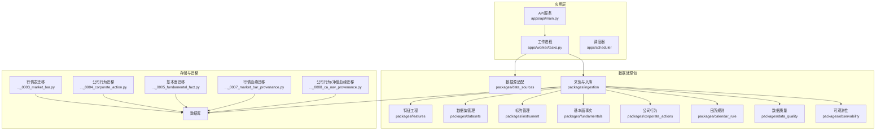
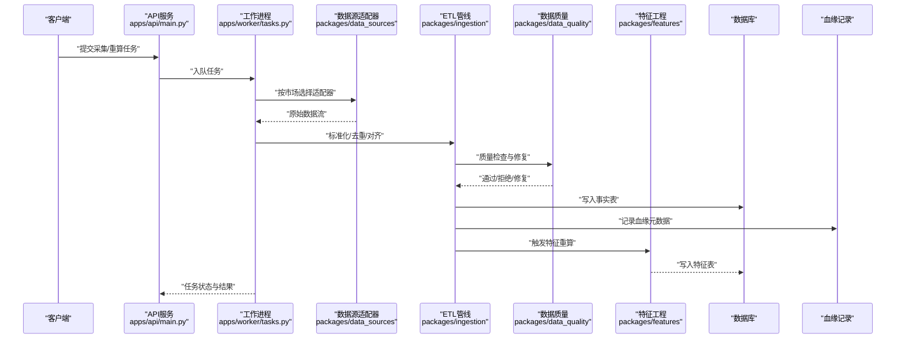
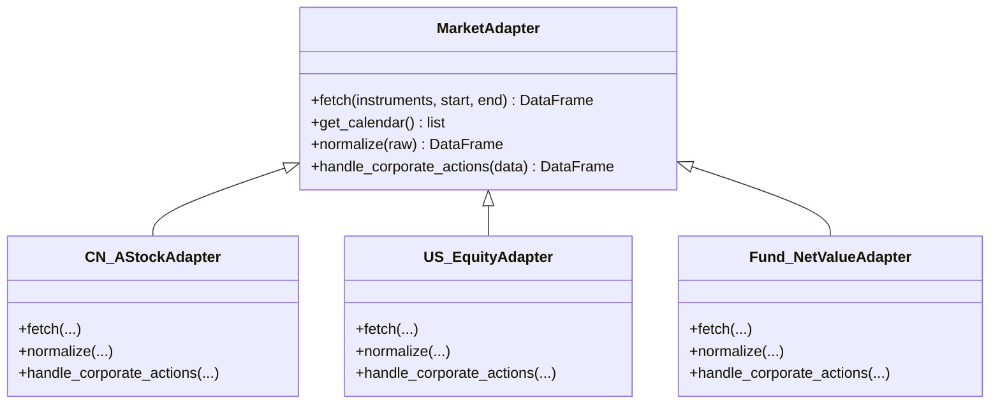
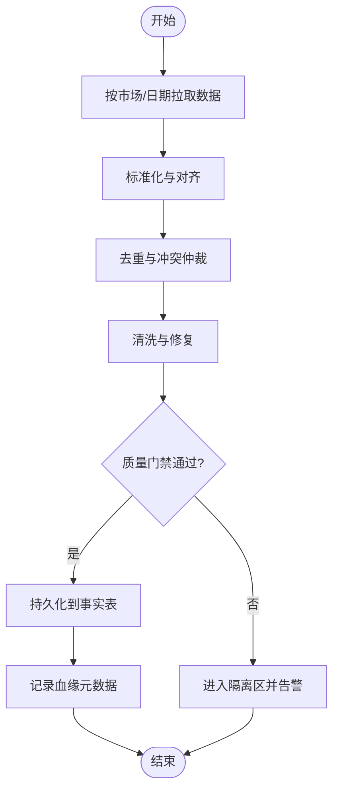
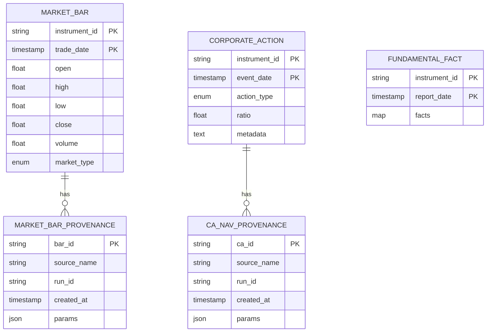
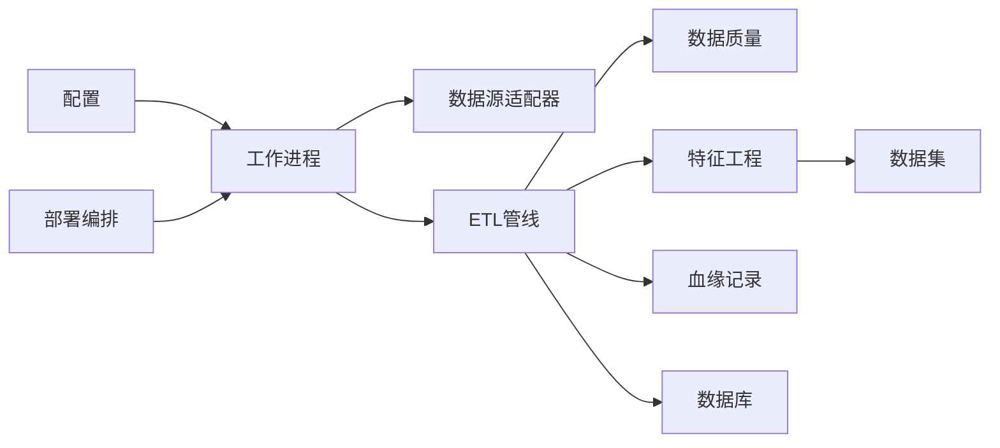

# 数据处理管道

<cite>
**本文引用的文件**   
- [apps/api/main.py](file://apps/api/main.py)
- [apps/worker/tasks.py](file://apps/worker/tasks.py)
- [packages/data_sources/__init__.py](file://packages/data_sources/__init__.py)
- [packages/ingestion/__init__.py](file://packages/ingestion/__init__.py)
- [packages/features/__init__.py](file://packages/features/__init__.py)
- [packages/datasets/__init__.py](file://packages/datasets/__init__.py)
- [packages/instrument/__init__.py](file://packages/instrument/__init__.py)
- [packages/fundamentals/__init__.py](file://packages/fundamentals/__init__.py)
- [packages/corporate_actions/__init__.py](file://packages/corporate_actions/__init__.py)
- [packages/calendar_rule/__init__.py](file://packages/calendar_rule/__init__.py)
- [packages/data_quality/__init__.py](file://packages/data_quality/__init__.py)
- [packages/observability/__init__.py](file://packages/observability/__init__.py)
- [sql/migrations/20260715_0003_market_bar.py](file://sql/migrations/20260715_0003_market_bar.py)
- [sql/migrations/20260715_0004_corporate_action.py](file://sql/migrations/20260715_0004_corporate_action.py)
- [sql/migrations/20260715_0005_fundamental_fact.py](file://sql/migrations/20260715_0005_fundamental_fact.py)
- [sql/migrations/20260715_0007_market_bar_provenance.py](file://sql/migrations/20260715_0007_market_bar_provenance.py)
- [sql/migrations/20260715_0008_ca_nav_provenance.py](file://sql/migrations/20260715_0008_ca_nav_provenance.py)
- [configs/base.yaml](file://configs/base.yaml)
- [deploy/docker-compose.yml](file://deploy/docker-compose.yml)
- [tests/unit/test_ingestion.py](file://tests/unit/test_ingestion.py)
- [tests/unit/test_adapter_transforms.py](file://tests/unit/test_adapter_transforms.py)
- [tests/unit/test_adapter_provenance.py](file://tests/unit/test_adapter_provenance.py)
- [tests/integration/test_e2e_pipeline.py](file://tests/integration/test_e2e_pipeline.py)
</cite>

## 目录
1. [简介](#简介)
2. [项目结构](#项目结构)
3. [核心组件](#核心组件)
4. [架构总览](#架构总览)
5. [详细组件分析](#详细组件分析)
6. [依赖关系分析](#依赖关系分析)
7. [性能考虑](#性能考虑)
8. [故障排查指南](#故障排查指南)
9. [结论](#结论)
10. [附录](#附录)

## 简介
本文件面向数据处理管道模块，系统性阐述多市场数据源适配器的统一抽象层、ETL流程实现机制、数据清洗与质量控制策略、特征工程框架设计与扩展方式、数据血缘追踪与版本管理机制，并提供接入示例与自定义适配器开发指南。文档同时给出性能优化建议与常见故障排查方法，帮助读者快速理解并高效使用该系统。

## 项目结构
仓库采用应用与服务分层组织：
- apps：API服务、调度器、工作进程等运行期入口
- packages：业务与数据处理能力包（数据源、采集、特征、数据集、公司行为、基本面、日历规则、数据质量、可观测性等）
- sql/migrations：数据库迁移脚本，定义行情、公司行为、基本面及血缘表结构
- configs：配置项
- deploy：部署编排
- tests：单元与集成测试，覆盖ETL、血缘、端到端流水线

图表来源
- [apps/api/main.py](file://apps/api/main.py)
- [apps/worker/tasks.py](file://apps/worker/tasks.py)
- [packages/data_sources/__init__.py](file://packages/data_sources/__init__.py)
- [packages/ingestion/__init__.py](file://packages/ingestion/__init__.py)
- [packages/features/__init__.py](file://packages/features/__init__.py)
- [packages/datasets/__init__.py](file://packages/datasets/__init__.py)
- [packages/instrument/__init__.py](file://packages/instrument/__init__.py)
- [packages/fundamentals/__init__.py](file://packages/fundamentals/__init__.py)
- [packages/corporate_actions/__init__.py](file://packages/corporate_actions/__init__.py)
- [packages/calendar_rule/__init__.py](file://packages/calendar_rule/__init__.py)
- [packages/data_quality/__init__.py](file://packages/data_quality/__init__.py)
- [packages/observability/__init__.py](file://packages/observability/__init__.py)
- [sql/migrations/20260715_0003_market_bar.py](file://sql/migrations/20260715_0003_market_bar.py)
- [sql/migrations/20260715_0004_corporate_action.py](file://sql/migrations/20260715_0004_corporate_action.py)
- [sql/migrations/20260715_0005_fundamental_fact.py](file://sql/migrations/20260715_0005_fundamental_fact.py)
- [sql/migrations/20260715_0007_market_bar_provenance.py](file://sql/migrations/20260715_0007_market_bar_provenance.py)
- [sql/migrations/20260715_0008_ca_nav_provenance.py](file://sql/migrations/20260715_0008_ca_nav_provenance.py)

章节来源
- [apps/api/main.py](file://apps/api/main.py)
- [apps/worker/tasks.py](file://apps/worker/tasks.py)
- [deploy/docker-compose.yml](file://deploy/docker-compose.yml)

## 核心组件
- 多市场数据源适配器：提供A股、美股、基金等市场的统一抽象接口，屏蔽差异化的数据格式、交易日历、复权处理与公司行为事件。
- ETL流水线：从数据源拉取、标准化、校验、转换到落库的完整流程，支持增量与全量模式，具备幂等与重试能力。
- 数据质量与治理：在ETL各阶段执行完整性、一致性、时效性与异常检测，输出质量报告与告警。
- 特征工程框架：以声明式DSL或函数式组合构建指标，支持跨市场通用因子与特定市场因子，具备版本化与可回放能力。
- 数据血缘与版本：记录每条数据的来源、生成路径、参数与时间戳，支撑可追溯与回滚。
- 标的与日历：统一的标的ID规范与跨市场交易日历，确保对齐与可比性。
- 可观测性：指标、日志与链路追踪贯穿采集、清洗、特征计算与入库环节。

章节来源
- [packages/data_sources/__init__.py](file://packages/data_sources/__init__.py)
- [packages/ingestion/__init__.py](file://packages/ingestion/__init__.py)
- [packages/data_quality/__init__.py](file://packages/data_quality/__init__.py)
- [packages/features/__init__.py](file://packages/features/__init__.py)
- [packages/instrument/__init__.py](file://packages/instrument/__init__.py)
- [packages/calendar_rule/__init__.py](file://packages/calendar_rule/__init__.py)
- [packages/observability/__init__.py](file://packages/observability/__init__.py)

## 架构总览
系统由API服务触发任务，工作进程执行ETL；数据源适配器负责多市场数据接入，ETL完成清洗与转换后写入数据库；特征工程基于标准数据集产出可用特征；所有关键数据均附带血缘信息，便于审计与回溯。

图表来源
- [apps/api/main.py](file://apps/api/main.py)
- [apps/worker/tasks.py](file://apps/worker/tasks.py)
- [packages/data_sources/__init__.py](file://packages/data_sources/__init__.py)
- [packages/ingestion/__init__.py](file://packages/ingestion/__init__.py)
- [packages/data_quality/__init__.py](file://packages/data_quality/__init__.py)
- [packages/features/__init__.py](file://packages/features/__init__.py)

## 详细组件分析

### 多市场数据源适配器（A股/美股/基金）
- 统一抽象层：定义跨市场一致的接口契约（拉取范围、返回字段、时间戳与时区、复权基准、公司行为类型），内部根据市场路由至具体实现。
- 差异化处理：
  - A股：涨跌停、停牌、集合竞价、除权除息、分红派息等事件；交易日历与节假日。
  - 美股：盘前盘后、夏令时切换、退市与拆合股；不同交易所休市规则。
  - 基金：净值更新频率、申赎截止日、估值调整与特殊公告。
- 标准化输出：将原始数据映射为统一Schema，包含标的ID、时间戳、价格序列、成交量、公司行为标记等。
- 错误与重试：网络抖动、限流、部分缺失数据时的重试与降级策略。

图表来源
- [packages/data_sources/__init__.py](file://packages/data_sources/__init__.py)

章节来源
- [packages/data_sources/__init__.py](file://packages/data_sources/__init__.py)
- [tests/unit/test_adapter_transforms.py](file://tests/unit/test_adapter_transforms.py)

### ETL流程与数据清洗
- 拉取与分区：按市场与日期分区拉取，避免重复与越界读取。
- 标准化：统一字段名、单位、时区、时间戳精度；对齐交易日历，填充缺失交易日。
- 去重与合并：同一天多源冲突时的仲裁策略（优先级、最近有效值、加权平均）。
- 清洗与修复：异常值裁剪、跳空处理、停牌插值策略、复权基准一致化。
- 质量门禁：完整性、唯一性、时序连续性、极值与分布检验，失败则阻断或进入隔离区。
- 幂等与事务：同一批次多次执行不产生重复数据；失败可回滚或断点续跑。

图表来源
- [packages/ingestion/__init__.py](file://packages/ingestion/__init__.py)
- [packages/data_quality/__init__.py](file://packages/data_quality/__init__.py)

章节来源
- [packages/ingestion/__init__.py](file://packages/ingestion/__init__.py)
- [packages/data_quality/__init__.py](file://packages/data_quality/__init__.py)
- [tests/unit/test_ingestion.py](file://tests/unit/test_ingestion.py)

### 数据质量与治理
- 规则集：字段非空、主键唯一、时间递增、价格非负、成交量合理区间、公司行为逻辑自洽。
- 监控与报告：统计通过率、失败明细、趋势对比；支持阈值告警与自动重试。
- 修复策略：软修复（标记与插值）、硬拒绝（丢弃并上报）、人工复核通道。

章节来源
- [packages/data_quality/__init__.py](file://packages/data_quality/__init__.py)

### 特征工程框架
- 设计原则：声明式DSL或函数式组合，输入为标准数据集，输出为带版本号的特征表。
- 扩展方式：新增因子只需注册到特征工厂，指定输入依赖与计算逻辑；支持并行与增量计算。
- 版本管理：特征代码变更触发新版本，旧版本保留以供回测与对比。
- 可观测性：记录每个特征的输入、参数、耗时与资源消耗。

章节来源
- [packages/features/__init__.py](file://packages/features/__init__.py)
- [packages/datasets/__init__.py](file://packages/datasets/__init__.py)

### 数据血缘追踪与版本管理
- 血缘粒度：从原始数据源到最终特征的全链路记录，包括时间窗口、过滤条件、聚合维度与算法版本。
- 存储模型：迁移脚本定义了行情、公司行为、基本面事实以及对应的血缘表结构。
- 版本控制：数据快照与特征版本绑定，支持按版本回放与对比。

图表来源
- [sql/migrations/20260715_0003_market_bar.py](file://sql/migrations/20260715_0003_market_bar.py)
- [sql/migrations/20260715_0004_corporate_action.py](file://sql/migrations/20260715_0004_corporate_action.py)
- [sql/migrations/20260715_0005_fundamental_fact.py](file://sql/migrations/20260715_0005_fundamental_fact.py)
- [sql/migrations/20260715_0007_market_bar_provenance.py](file://sql/migrations/20260715_0007_market_bar_provenance.py)
- [sql/migrations/20260715_0008_ca_nav_provenance.py](file://sql/migrations/20260715_0008_ca_nav_provenance.py)

章节来源
- [sql/migrations/20260715_0003_market_bar.py](file://sql/migrations/20260715_0003_market_bar.py)
- [sql/migrations/20260715_0004_corporate_action.py](file://sql/migrations/20260715_0004_corporate_action.py)
- [sql/migrations/20260715_0005_fundamental_fact.py](file://sql/migrations/20260715_0005_fundamental_fact.py)
- [sql/migrations/20260715_0007_market_bar_provenance.py](file://sql/migrations/20260715_0007_market_bar_provenance.py)
- [sql/migrations/20260715_0008_ca_nav_provenance.py](file://sql/migrations/20260715_0008_ca_nav_provenance.py)
- [tests/unit/test_adapter_provenance.py](file://tests/unit/test_adapter_provenance.py)

### 标的管理与日历规则
- 标的ID规范：跨市场统一编码，保证唯一性与可读性。
- 交易日历：按市场维护休市与节假日，用于对齐时间序列与缺失填充策略。

章节来源
- [packages/instrument/__init__.py](file://packages/instrument/__init__.py)
- [packages/calendar_rule/__init__.py](file://packages/calendar_rule/__init__.py)

### 基本面与公司行为
- 基本面事实：财报披露、财务指标与事件时间线。
- 公司行为：拆合股、分红、配股、退市等，影响价格序列与持仓成本。

章节来源
- [packages/fundamentals/__init__.py](file://packages/fundamentals/__init__.py)
- [packages/corporate_actions/__init__.py](file://packages/corporate_actions/__init__.py)

## 依赖关系分析
- 组件耦合：
  - 工作进程依赖数据源适配器与ETL管线；ETL依赖数据质量与可观测性。
  - 特征工程依赖标准数据集与标的/日历信息。
  - 血缘记录贯穿ETL与特征计算，写入独立血缘表。
- 外部依赖：
  - 数据库：通过迁移脚本管理Schema演进。
  - 配置：集中化管理连接串、批大小、超时与重试策略。
  - 部署：容器编排协调API、Worker与数据库。

图表来源
- [apps/worker/tasks.py](file://apps/worker/tasks.py)
- [packages/data_sources/__init__.py](file://packages/data_sources/__init__.py)
- [packages/ingestion/__init__.py](file://packages/ingestion/__init__.py)
- [packages/data_quality/__init__.py](file://packages/data_quality/__init__.py)
- [packages/features/__init__.py](file://packages/features/__init__.py)
- [packages/datasets/__init__.py](file://packages/datasets/__init__.py)
- [configs/base.yaml](file://configs/base.yaml)
- [deploy/docker-compose.yml](file://deploy/docker-compose.yml)

章节来源
- [apps/worker/tasks.py](file://apps/worker/tasks.py)
- [configs/base.yaml](file://configs/base.yaml)
- [deploy/docker-compose.yml](file://deploy/docker-compose.yml)

## 性能考虑
- 批量与分页：按批次拉取与写入，减少往返次数；对大表使用分批插入与索引优化。
- 并发与限流：按市场与标的分片并行，结合速率限制避免被上游限流。
- 增量与断点续跑：记录已处理的时间窗口与游标，失败后可从断点恢复。
- 内存与序列化：使用列式数据结构与惰性计算，避免一次性加载全量数据。
- 缓存与复用：对静态字典（如交易日历、标的映射）进行缓存。
- 可观测性：采集吞吐、延迟、错误率与资源占用指标，定位瓶颈。

[本节为通用指导，无需源码引用]

## 故障排查指南
- 常见问题
  - 数据缺失或不连续：检查交易日历对齐与停牌处理；确认拉取范围与偏移。
  - 重复数据：核对去重键与幂等策略；检查批次边界是否重叠。
  - 公司行为异常：验证事件类型与比率一致性；确认复权基准。
  - 特征计算失败：查看输入数据集版本与依赖变更；核对参数与时间窗口。
- 诊断步骤
  - 查看任务日志与指标，定位失败阶段。
  - 检查血缘记录，确认数据来源与参数。
  - 使用隔离区数据与质量报告，定位问题样本。
  - 回滚到上一稳定版本的数据或特征，验证回归。
- 恢复策略
  - 针对局部失败进行增量重跑；必要时全量重建。
  - 启用重试与退避策略，避免雪崩。

章节来源
- [tests/unit/test_ingestion.py](file://tests/unit/test_ingestion.py)
- [tests/unit/test_adapter_provenance.py](file://tests/unit/test_adapter_provenance.py)
- [tests/integration/test_e2e_pipeline.py](file://tests/integration/test_e2e_pipeline.py)

## 结论
本数据处理管道通过统一的多市场适配器抽象、健壮的ETL与质量门禁、可扩展的特征工程与完善的数据血缘追踪，实现了跨市场数据的一致接入与高质量供给。配合配置化与容器化部署，系统具备良好的可维护性与可扩展性。建议在生产环境持续完善质量规则与可观测性，逐步引入更精细的增量与缓存策略以提升吞吐与稳定性。

[本节为总结，无需源码引用]

## 附录

### 数据接入示例（概念流程）
- 选择市场与标的列表，配置拉取时间窗口。
- 调用工作进程任务，自动路由至对应适配器。
- ETL执行标准化、去重、清洗与质量门禁。
- 写入事实表并记录血缘；可选触发特征重算。
- 查询结果与质量报告，确认成功。

[本节为概念说明，无需源码引用]

### 自定义适配器开发指南
- 继承统一适配器接口，实现拉取、标准化与公司行为处理。
- 注册到市场路由器，确保按市场正确分发。
- 编写单元测试覆盖异常与边界场景，验证标准化输出。
- 在ETL中启用质量规则，观察血缘记录是否正确。

章节来源
- [packages/data_sources/__init__.py](file://packages/data_sources/__init__.py)
- [tests/unit/test_adapter_transforms.py](file://tests/unit/test_adapter_transforms.py)