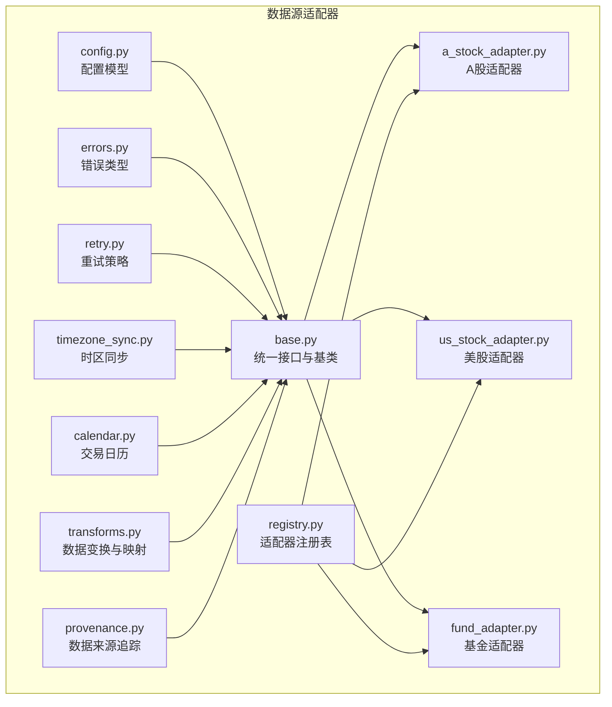
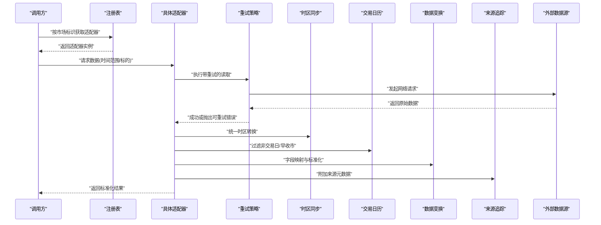
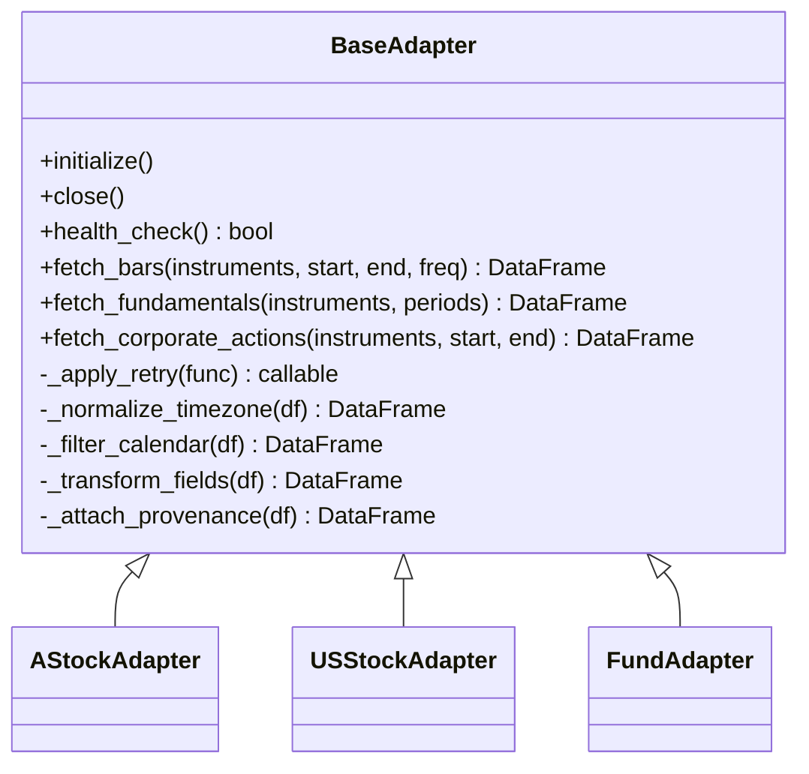
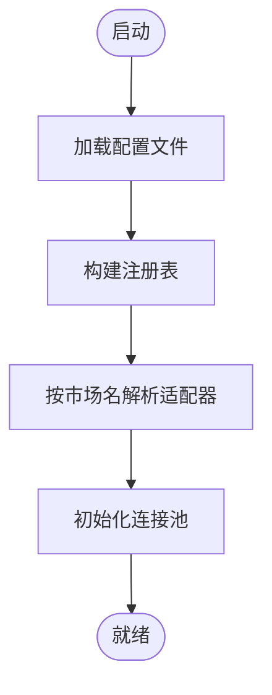
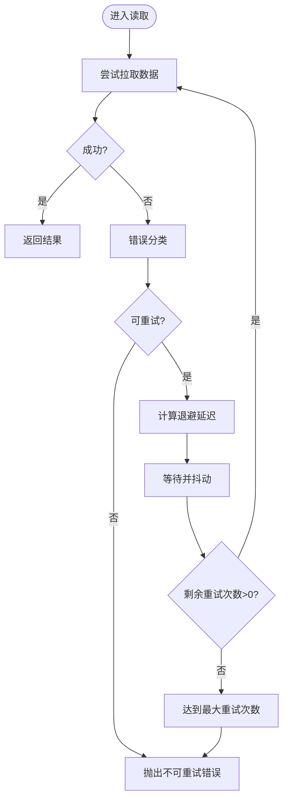
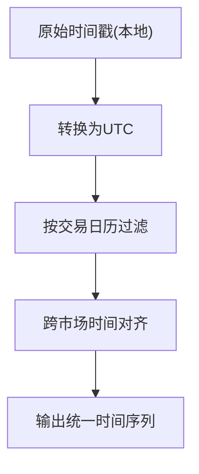
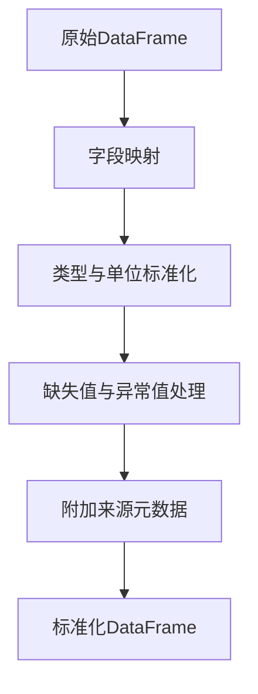
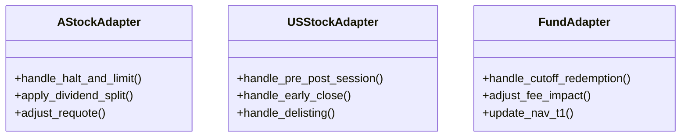
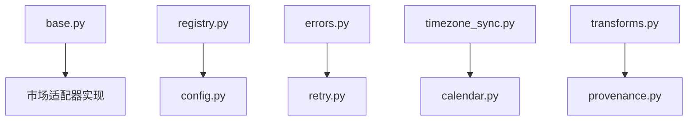

# 数据源适配器

<cite>
**本文引用的文件**   
- [packages/data_sources/__init__.py](file://packages/data_sources/__init__.py)
- [packages/data_sources/base.py](file://packages/data_sources/base.py)
- [packages/data_sources/a_stock_adapter.py](file://packages/data_sources/a_stock_adapter.py)
- [packages/data_sources/us_stock_adapter.py](file://packages/data_sources/us_stock_adapter.py)
- [packages/data_sources/fund_adapter.py](file://packages/data_sources/fund_adapter.py)
- [packages/data_sources/registry.py](file://packages/data_sources/registry.py)
- [packages/data_sources/config.py](file://packages/data_sources/config.py)
- [packages/data_sources/errors.py](file://packages/data_sources/errors.py)
- [packages/data_sources/retry.py](file://packages/data_sources/retry.py)
- [packages/data_sources/timezone_sync.py](file://packages/data_sources/timezone_sync.py)
- [packages/data_sources/calendar.py](file://packages/data_sources/calendar.py)
- [packages/data_sources/transforms.py](file://packages/data_sources/transforms.py)
- [packages/data_sources/provenance.py](file://packages/data_sources/provenance.py)
- [tests/unit/test_adapter_provenance.py](file://tests/unit/test_adapter_provenance.py)
- [tests/unit/test_adapter_transforms.py](file://tests/unit/test_adapter_transforms.py)
- [tests/unit/test_cross_market_scenarios.py](file://tests/unit/test_cross_market_scenarios.py)
- [configs/base.yaml](file://configs/base.yaml)
- [configs/dev.yaml](file://configs/dev.yaml)
</cite>

## 目录
1. [简介](#简介)
2. [项目结构](#项目结构)
3. [核心组件](#核心组件)
4. [架构总览](#架构总览)
5. [详细组件分析](#详细组件分析)
6. [依赖关系分析](#依赖关系分析)
7. [性能考虑](#性能考虑)
8. [故障排查指南](#故障排查指南)
9. [结论](#结论)
10. [附录](#附录)

## 简介
本模块为多市场（A股、美股、基金）数据源的统一抽象层，提供一致的接口规范、连接管理、错误处理与重试策略，以及跨市场时间同步和交易日历处理。通过标准化数据格式与字段映射机制，屏蔽底层数据源差异，支持自定义适配器的快速接入与测试。

## 项目结构
数据源适配器位于 packages/data_sources 下，采用“基础抽象 + 市场实现 + 公共能力”的分层组织方式：
- 基础抽象：定义统一的读取接口、配置模型、错误类型、重试策略等
- 市场实现：针对 A 股、美股、基金的差异化处理逻辑
- 公共能力：时区同步、交易日历、数据变换、来源追踪等
- 注册中心：按市场名称动态加载具体适配器
- 配置：集中管理各市场连接参数、重试策略、时区与日历规则
- 测试：覆盖来源追踪、变换逻辑、跨市场场景

图表来源
- [packages/data_sources/base.py](file://packages/data_sources/base.py)
- [packages/data_sources/registry.py](file://packages/data_sources/registry.py)
- [packages/data_sources/config.py](file://packages/data_sources/config.py)
- [packages/data_sources/errors.py](file://packages/data_sources/errors.py)
- [packages/data_sources/retry.py](file://packages/data_sources/retry.py)
- [packages/data_sources/timezone_sync.py](file://packages/data_sources/timezone_sync.py)
- [packages/data_sources/calendar.py](file://packages/data_sources/calendar.py)
- [packages/data_sources/transforms.py](file://packages/data_sources/transforms.py)
- [packages/data_sources/provenance.py](file://packages/data_sources/provenance.py)
- [packages/data_sources/a_stock_adapter.py](file://packages/data_sources/a_stock_adapter.py)
- [packages/data_sources/us_stock_adapter.py](file://packages/data_sources/us_stock_adapter.py)
- [packages/data_sources/fund_adapter.py](file://packages/data_sources/fund_adapter.py)

章节来源
- [packages/data_sources/__init__.py](file://packages/data_sources/__init__.py)
- [packages/data_sources/base.py](file://packages/data_sources/base.py)
- [packages/data_sources/registry.py](file://packages/data_sources/registry.py)
- [packages/data_sources/config.py](file://packages/data_sources/config.py)
- [packages/data_sources/errors.py](file://packages/data_sources/errors.py)
- [packages/data_sources/retry.py](file://packages/data_sources/retry.py)
- [packages/data_sources/timezone_sync.py](file://packages/data_sources/timezone_sync.py)
- [packages/data_sources/calendar.py](file://packages/data_sources/calendar.py)
- [packages/data_sources/transforms.py](file://packages/data_sources/transforms.py)
- [packages/data_sources/provenance.py](file://packages/data_sources/provenance.py)
- [packages/data_sources/a_stock_adapter.py](file://packages/data_sources/a_stock_adapter.py)
- [packages/data_sources/us_stock_adapter.py](file://packages/data_sources/us_stock_adapter.py)
- [packages/data_sources/fund_adapter.py](file://packages/data_sources/fund_adapter.py)

## 核心组件
- 统一接口与基类：定义获取行情/基本面/公司行为的标准方法、上下文生命周期、元数据描述、批处理与流式读取约定
- 适配器注册表：基于市场标识符（如 cn、us、fund）动态解析并实例化具体适配器
- 配置模型：封装连接参数、认证信息、超时、并发、重试次数与退避策略、时区与日历开关
- 错误体系：区分网络异常、鉴权失败、数据缺失、格式不合法、业务校验失败等
- 重试策略：指数退避、抖动、最大重试次数、可重试错误分类
- 时区同步：将不同市场的本地时间转换为统一 UTC 基准，处理夏令时与早收市
- 交易日历：过滤非交易日、节假日、早收市时段，保证跨市场对齐
- 数据变换与映射：统一字段名、单位、币种、复权因子、时间戳精度
- 来源追踪：记录每条数据的来源、版本、采集时间、哈希指纹，便于审计与回溯

章节来源
- [packages/data_sources/base.py](file://packages/data_sources/base.py)
- [packages/data_sources/registry.py](file://packages/data_sources/registry.py)
- [packages/data_sources/config.py](file://packages/data_sources/config.py)
- [packages/data_sources/errors.py](file://packages/data_sources/errors.py)
- [packages/data_sources/retry.py](file://packages/data_sources/retry.py)
- [packages/data_sources/timezone_sync.py](file://packages/data_sources/timezone_sync.py)
- [packages/data_sources/calendar.py](file://packages/data_sources/calendar.py)
- [packages/data_sources/transforms.py](file://packages/data_sources/transforms.py)
- [packages/data_sources/provenance.py](file://packages/data_sources/provenance.py)

## 架构总览
下图展示了从调用方到具体数据源的完整流程，包括注册、连接、重试、时区与日历处理、数据变换与来源追踪。

图表来源
- [packages/data_sources/registry.py](file://packages/data_sources/registry.py)
- [packages/data_sources/base.py](file://packages/data_sources/base.py)
- [packages/data_sources/retry.py](file://packages/data_sources/retry.py)
- [packages/data_sources/timezone_sync.py](file://packages/data_sources/timezone_sync.py)
- [packages/data_sources/calendar.py](file://packages/data_sources/calendar.py)
- [packages/data_sources/transforms.py](file://packages/data_sources/transforms.py)
- [packages/data_sources/provenance.py](file://packages/data_sources/provenance.py)

## 详细组件分析

### 统一接口与基类
- 职责
  - 定义标准方法：批量读取、增量拉取、元数据查询、健康检查
  - 生命周期：初始化连接、资源释放、心跳检测
  - 通用能力：重试包装、时区转换、日历过滤、变换管道、来源追踪
- 设计要点
  - 所有市场适配器继承同一基类，确保对外 API 一致
  - 通过配置注入连接参数与策略，避免硬编码
  - 错误类型向上抛出，由上层统一处理

图表来源
- [packages/data_sources/base.py](file://packages/data_sources/base.py)
- [packages/data_sources/a_stock_adapter.py](file://packages/data_sources/a_stock_adapter.py)
- [packages/data_sources/us_stock_adapter.py](file://packages/data_sources/us_stock_adapter.py)
- [packages/data_sources/fund_adapter.py](file://packages/data_sources/fund_adapter.py)

章节来源
- [packages/data_sources/base.py](file://packages/data_sources/base.py)

### 注册中心与配置
- 注册中心
  - 维护市场标识到适配器类的映射
  - 提供按市场名解析与缓存实例的能力
- 配置模型
  - 连接参数：主机、端口、协议、认证令牌
  - 重试策略：最大重试次数、初始延迟、最大延迟、退避系数、抖动
  - 时区与日历：默认时区、是否启用交易日历、自定义节假日列表
  - 性能参数：并发度、批大小、超时时间

图表来源
- [packages/data_sources/registry.py](file://packages/data_sources/registry.py)
- [packages/data_sources/config.py](file://packages/data_sources/config.py)

章节来源
- [packages/data_sources/registry.py](file://packages/data_sources/registry.py)
- [packages/data_sources/config.py](file://packages/data_sources/config.py)
- [configs/base.yaml](file://configs/base.yaml)
- [configs/dev.yaml](file://configs/dev.yaml)

### 错误处理与重试策略
- 错误分类
  - 网络异常：超时、连接中断、DNS 解析失败
  - 鉴权失败：令牌过期、权限不足
  - 数据异常：字段缺失、类型不匹配、数值越界
  - 业务异常：标的不存在、时间范围非法、频率不支持
- 重试策略
  - 仅对可重试错误进行重试
  - 指数退避 + 随机抖动，防止雪崩
  - 最大重试次数与最大延迟上限保护

图表来源
- [packages/data_sources/errors.py](file://packages/data_sources/errors.py)
- [packages/data_sources/retry.py](file://packages/data_sources/retry.py)

章节来源
- [packages/data_sources/errors.py](file://packages/data_sources/errors.py)
- [packages/data_sources/retry.py](file://packages/data_sources/retry.py)

### 跨市场时间同步与交易日历
- 时区同步
  - 将各市场本地时间转换为统一 UTC
  - 处理夏令时切换与早收市导致的半日交易
- 交易日历
  - 过滤非交易日、节假日、早收市
  - 支持自定义节假日与特殊交易日
- 跨市场对齐
  - 以 UTC 为基准对齐时间戳
  - 合并不同市场的时间序列，保持频率一致

图表来源
- [packages/data_sources/timezone_sync.py](file://packages/data_sources/timezone_sync.py)
- [packages/data_sources/calendar.py](file://packages/data_sources/calendar.py)

章节来源
- [packages/data_sources/timezone_sync.py](file://packages/data_sources/timezone_sync.py)
- [packages/data_sources/calendar.py](file://packages/data_sources/calendar.py)

### 数据格式标准化与字段映射
- 目标格式
  - 统一列名：时间、开盘价、最高价、最低价、收盘价、成交量、成交额、复权因子等
  - 统一数据类型与精度：时间戳为 UTC 毫秒、价格为浮点、量为整数
  - 统一单位与币种：价格按币种标注，金额按币种换算
- 映射规则
  - 市场特定字段到标准字段的映射表
  - 缺失值填充策略与异常值裁剪
  - 复权与拆合股调整

图表来源
- [packages/data_sources/transforms.py](file://packages/data_sources/transforms.py)
- [packages/data_sources/provenance.py](file://packages/data_sources/provenance.py)

章节来源
- [packages/data_sources/transforms.py](file://packages/data_sources/transforms.py)
- [packages/data_sources/provenance.py](file://packages/data_sources/provenance.py)

### 市场差异化处理机制
- A 股市场
  - 特殊事件：停牌、涨跌停、分红派息、拆合股
  - 交易时段：上午与下午两段，午间休市
  - 复权：前复权/后复权因子应用
- 美股市场
  - 特殊事件：盘前盘后交易、早收市、退市
  - 时区：美东/美西时区与夏令时
  - 货币：美元计价，汇率换算可选
- 基金市场
  - 净值更新：T+1 披露、截止日与赎回日
  - 费用：管理费、托管费影响净值
  - 份额变动：申购赎回导致份额变化

图表来源
- [packages/data_sources/a_stock_adapter.py](file://packages/data_sources/a_stock_adapter.py)
- [packages/data_sources/us_stock_adapter.py](file://packages/data_sources/us_stock_adapter.py)
- [packages/data_sources/fund_adapter.py](file://packages/data_sources/fund_adapter.py)

章节来源
- [packages/data_sources/a_stock_adapter.py](file://packages/data_sources/a_stock_adapter.py)
- [packages/data_sources/us_stock_adapter.py](file://packages/data_sources/us_stock_adapter.py)
- [packages/data_sources/fund_adapter.py](file://packages/data_sources/fund_adapter.py)

### 自定义数据源适配器开发指南
- 步骤
  - 继承统一基类，实现市场特定的拉取与处理逻辑
  - 在注册表中注册新适配器，绑定市场标识
  - 编写配置项，注入连接参数与策略
  - 实现单元测试与集成测试，覆盖正常路径与异常路径
- 示例要点
  - 使用重试包装器处理网络波动
  - 使用时区同步与日历过滤保证时间一致性
  - 使用变换管道完成字段映射与标准化
  - 使用来源追踪记录数据来源与版本
- 测试方法
  - 单元测试：验证变换逻辑、错误分类、重试边界
  - 集成测试：端到端拉取与存储，对比黄金数据集
  - 跨市场场景：验证时间对齐与事件处理

章节来源
- [packages/data_sources/base.py](file://packages/data_sources/base.py)
- [packages/data_sources/registry.py](file://packages/data_sources/registry.py)
- [packages/data_sources/retry.py](file://packages/data_sources/retry.py)
- [packages/data_sources/timezone_sync.py](file://packages/data_sources/timezone_sync.py)
- [packages/data_sources/calendar.py](file://packages/data_sources/calendar.py)
- [packages/data_sources/transforms.py](file://packages/data_sources/transforms.py)
- [packages/data_sources/provenance.py](file://packages/data_sources/provenance.py)
- [tests/unit/test_adapter_provenance.py](file://tests/unit/test_adapter_provenance.py)
- [tests/unit/test_adapter_transforms.py](file://tests/unit/test_adapter_transforms.py)
- [tests/unit/test_cross_market_scenarios.py](file://tests/unit/test_cross_market_scenarios.py)

## 依赖关系分析
- 组件耦合
  - 基类与具体适配器：松耦合，通过接口约束
  - 注册中心与配置：强耦合，需保持一致性
  - 重试与错误：低耦合，错误类型驱动重试决策
- 外部依赖
  - 网络库：HTTP/gRPC 客户端
  - 时区库：处理时区与夏令时
  - 日历库：节假日与交易时段
  - 数据处理：DataFrame 操作与序列化

图表来源
- [packages/data_sources/base.py](file://packages/data_sources/base.py)
- [packages/data_sources/registry.py](file://packages/data_sources/registry.py)
- [packages/data_sources/config.py](file://packages/data_sources/config.py)
- [packages/data_sources/errors.py](file://packages/data_sources/errors.py)
- [packages/data_sources/retry.py](file://packages/data_sources/retry.py)
- [packages/data_sources/timezone_sync.py](file://packages/data_sources/timezone_sync.py)
- [packages/data_sources/calendar.py](file://packages/data_sources/calendar.py)
- [packages/data_sources/transforms.py](file://packages/data_sources/transforms.py)
- [packages/data_sources/provenance.py](file://packages/data_sources/provenance.py)

章节来源
- [packages/data_sources/base.py](file://packages/data_sources/base.py)
- [packages/data_sources/registry.py](file://packages/data_sources/registry.py)
- [packages/data_sources/config.py](file://packages/data_sources/config.py)
- [packages/data_sources/errors.py](file://packages/data_sources/errors.py)
- [packages/data_sources/retry.py](file://packages/data_sources/retry.py)
- [packages/data_sources/timezone_sync.py](file://packages/data_sources/timezone_sync.py)
- [packages/data_sources/calendar.py](file://packages/data_sources/calendar.py)
- [packages/data_sources/transforms.py](file://packages/data_sources/transforms.py)
- [packages/data_sources/provenance.py](file://packages/data_sources/provenance.py)

## 性能考虑
- 连接池与复用：减少握手开销，提升吞吐
- 批处理与分页：降低请求次数，提高带宽利用率
- 并发控制：限制并发度，避免压垮上游
- 超时与熔断：快速失败，保护系统稳定性
- 缓存策略：热点数据缓存，减少重复拉取
- 数据压缩：传输层压缩，降低带宽占用
- 指标与观测：监控延迟、错误率、重试次数、吞吐量

[本节为通用指导，无需代码引用]

## 故障排查指南
- 常见问题
  - 连接失败：检查网络连通性与认证信息
  - 鉴权过期：刷新令牌或重新登录
  - 数据缺失：核对时间范围与标的有效性
  - 格式错误：检查字段映射与类型转换
  - 时序错乱：确认时区设置与夏令时处理
- 定位技巧
  - 查看来源追踪日志，定位数据版本与来源
  - 开启重试日志，观察退避与抖动效果
  - 打印变换前后数据快照，比对字段映射
  - 使用交易日历工具，验证过滤逻辑
- 恢复建议
  - 降级策略：切换到备用数据源或只读模式
  - 回滚策略：使用最近一次成功快照
  - 告警通知：关键错误及时上报

章节来源
- [packages/data_sources/provenance.py](file://packages/data_sources/provenance.py)
- [packages/data_sources/retry.py](file://packages/data_sources/retry.py)
- [packages/data_sources/transforms.py](file://packages/data_sources/transforms.py)
- [packages/data_sources/calendar.py](file://packages/data_sources/calendar.py)
- [tests/unit/test_adapter_provenance.py](file://tests/unit/test_adapter_provenance.py)
- [tests/unit/test_adapter_transforms.py](file://tests/unit/test_adapter_transforms.py)
- [tests/unit/test_cross_market_scenarios.py](file://tests/unit/test_cross_market_scenarios.py)

## 结论
数据源适配器模块通过统一抽象层屏蔽多市场差异，提供一致的接口、健壮的错误处理与重试机制、标准化的数据格式与时序对齐，以及完善的来源追踪与测试支撑。在此基础上，开发者可以快速扩展新的市场数据源，并确保数据质量与系统稳定性。

[本节为总结，无需代码引用]

## 附录
- 配置选项参考
  - 连接参数：主机、端口、协议、认证令牌、超时
  - 重试策略：最大重试次数、初始延迟、最大延迟、退避系数、抖动
  - 时区与日历：默认时区、是否启用交易日历、自定义节假日
  - 性能参数：并发度、批大小、缓存开关
- 常见接入模式
  - 批量拉取：按时间范围与标的集合拉取
  - 增量拉取：基于最后更新时间增量获取
  - 事件驱动：在公司行为发生时触发拉取
- 最佳实践
  - 明确错误分类与重试边界
  - 严格时区与日历处理
  - 完备的字段映射与数据校验
  - 完整的来源追踪与审计日志
  - 充分的单元与集成测试

章节来源
- [configs/base.yaml](file://configs/base.yaml)
- [configs/dev.yaml](file://configs/dev.yaml)
- [packages/data_sources/config.py](file://packages/data_sources/config.py)
- [packages/data_sources/retry.py](file://packages/data_sources/retry.py)
- [packages/data_sources/timezone_sync.py](file://packages/data_sources/timezone_sync.py)
- [packages/data_sources/calendar.py](file://packages/data_sources/calendar.py)
- [packages/data_sources/transforms.py](file://packages/data_sources/transforms.py)
- [packages/data_sources/provenance.py](file://packages/data_sources/provenance.py)
- [tests/unit/test_adapter_provenance.py](file://tests/unit/test_adapter_provenance.py)
- [tests/unit/test_adapter_transforms.py](file://tests/unit/test_adapter_transforms.py)
- [tests/unit/test_cross_market_scenarios.py](file://tests/unit/test_cross_market_scenarios.py)