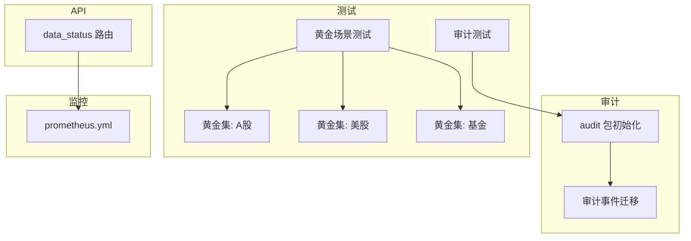
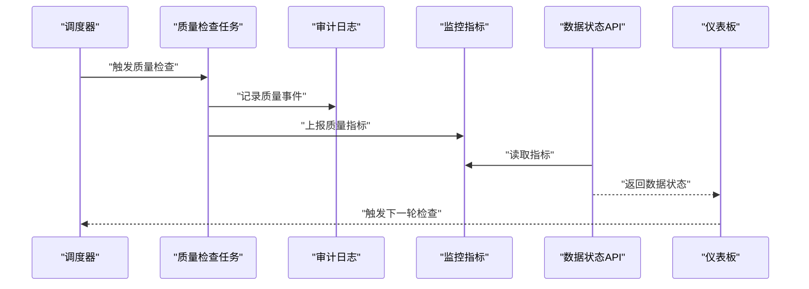
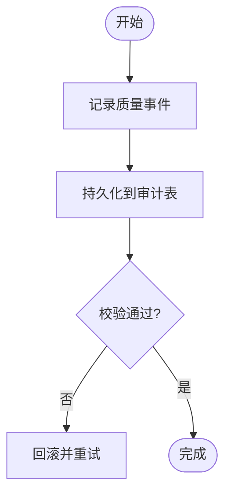
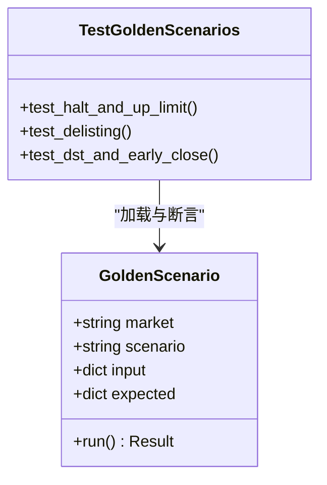
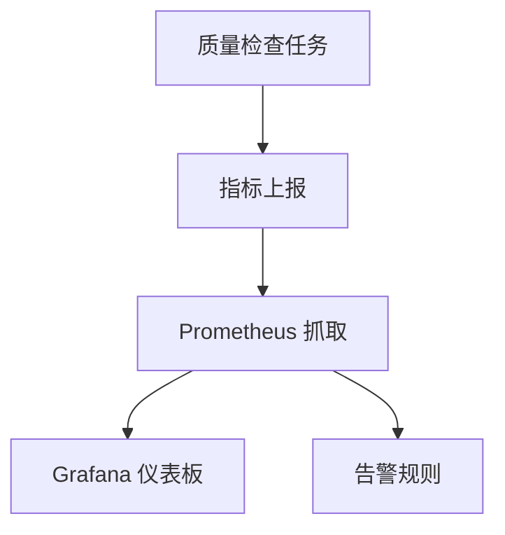
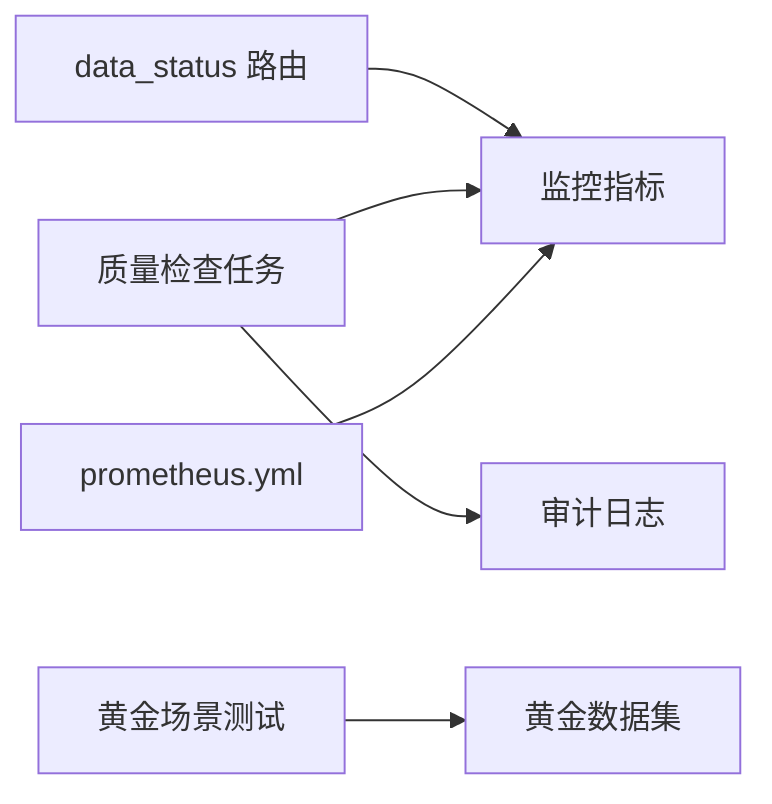

# 数据质量控制

<cite>
**本文引用的文件**   
- [apps/api/routers/data_status.py](file://apps/api/routers/data_status.py)
- [packages/audit/__init__.py](file://packages/audit/__init__.py)
- [tests/fixtures/golden/cn/halt_and_up_limit.jsonl](file://tests/fixtures/golden/cn/halt_and_up_limit.jsonl)
- [tests/fixtures/golden/cn/halt_lift_resume.jsonl](file://tests/fixtures/golden/cn/halt_lift_resume.jsonl)
- [tests/fixtures/golden/cn/split_and_dividend.jsonl](file://tests/fixtures/golden/cn/split_and_dividend.jsonl)
- [tests/fixtures/golden/fund/cutoff_and_redemption.jsonl](file://tests/fixtures/golden/fund/cutoff_and_redemption.jsonl)
- [tests/fixtures/golden/us/cross_source_disagreement.jsonl](file://tests/fixtures/golden/us/cross来源分歧.jsonl)
- [tests/fixtures/golden/us/delisting.jsonl](file://tests/fixtures/golden/us/delisting.jsonl)
- [tests/fixtures/golden/us/dst_and_early_close.jsonl](file://tests/fixtures/golden/us/dst_and_early_close.jsonl)
- [tests/unit/test_golden_scenarios.py](file://tests/unit/test_golden_scenarios.py)
- [tests/unit/test_audit.py](file://tests/unit/test_audit.py)
- [sql/migrations/20260715_0002_audit_events.py](file://sql/migrations/20260715_0002_audit_events.py)
- [deploy/prometheus.yml](file://deploy/prometheus.yml)
</cite>

## 目录
1. [简介](#简介)
2. [项目结构](#项目结构)
3. [核心组件](#核心组件)
4. [架构总览](#架构总览)
5. [详细组件分析](#详细组件分析)
6. [依赖分析](#依赖分析)
7. [性能考虑](#性能考虑)
8. [故障排查指南](#故障排查指南)
9. [结论](#结论)
10. [附录](#附录)

## 简介
本文件面向“数据质量控制”模块，系统性阐述数据质量检查规则与验证框架的设计原理、异常检测算法与完整性校验机制、黄金数据集使用规范与测试用例编写方法、审计日志与变更追踪、质量报告生成与告警通知、监控仪表板配置，以及常见问题排查与修复最佳实践。文档以仓库现有实现为依据，结合测试与部署配置进行说明，帮助读者快速理解并落地数据质量保障体系。

## 项目结构
围绕数据质量相关能力，仓库在以下位置提供关键支撑：
- API 层：暴露数据状态查询接口，便于上层系统或仪表板获取质量指标与事件。
- 审计与可观测性：通过迁移脚本定义审计事件表结构；单元测试覆盖审计写入流程。
- 黄金数据集：位于 tests/fixtures/golden 下，按市场/主题组织，用于回归与场景化验证。
- 测试套件：包含针对黄金场景的单元测试，确保质量规则稳定可靠。
- 部署与监控：Prometheus 配置文件用于采集与展示质量相关指标。

图表来源
- [apps/api/routers/data_status.py](file://apps/api/routers/data_status.py)
- [packages/audit/__init__.py](file://packages/audit/__init__.py)
- [sql/migrations/20260715_0002_audit_events.py](file://sql/migrations/20260715_0002_audit_events.py)
- [tests/unit/test_golden_scenarios.py](file://tests/unit/test_golden_scenarios.py)
- [tests/unit/test_audit.py](file://tests/unit/test_audit.py)
- [deploy/prometheus.yml](file://deploy/prometheus.yml)

章节来源
- [apps/api/routers/data_status.py](file://apps/api/routers/data_status.py)
- [packages/audit/__init__.py](file://packages/audit/__init__.py)
- [sql/migrations/20260715_0002_audit_events.py](file://sql/migrations/20260715_0002_audit_events.py)
- [tests/unit/test_golden_scenarios.py](file://tests/unit/test_golden_scenarios.py)
- [tests/unit/test_audit.py](file://tests/unit/test_audit.py)
- [deploy/prometheus.yml](file://deploy/prometheus.yml)

## 核心组件
- 数据状态查询（API）
  - 通过 data_status 路由对外暴露数据质量相关的状态信息，供调度器、报表或仪表板消费。
- 审计日志与变更追踪
  - 通过 audit 包与数据库迁移共同实现审计事件的持久化与查询，记录关键数据变更与质量事件。
- 黄金数据集与场景化测试
  - 以 JSONL 形式维护典型市场事件与边界条件，配合单元测试对质量规则进行回归验证。
- 监控与告警
  - 基于 Prometheus 抓取质量指标，为告警策略与可视化提供基础。

章节来源
- [apps/api/routers/data_status.py](file://apps/api/routers/data_status.py)
- [packages/audit/__init__.py](file://packages/audit/__init__.py)
- [sql/migrations/20260715_0002_audit_events.py](file://sql/migrations/20260715_0002_audit_events.py)
- [tests/unit/test_golden_scenarios.py](file://tests/unit/test_golden_scenarios.py)
- [tests/unit/test_audit.py](file://tests/unit/test_audit.py)
- [deploy/prometheus.yml](file://deploy/prometheus.yml)

## 架构总览
数据质量控制的整体流程如下：
- 数据入湖/入库后，触发质量检查任务（由调度器驱动）。
- 检查任务执行规则引擎，产出质量事件与指标。
- 质量事件写入审计日志，指标暴露给监控系统。
- API 层提供数据状态查询，供报表与仪表板消费。
- 测试套件使用黄金数据集持续验证规则正确性与稳定性。

图表来源
- [apps/api/routers/data_status.py](file://apps/api/routers/data_status.py)
- [packages/audit/__init__.py](file://packages/audit/__init__.py)
- [deploy/prometheus.yml](file://deploy/prometheus.yml)

## 详细组件分析

### 数据状态查询（API）
- 职责
  - 提供数据质量状态的查询入口，支持上层系统拉取最新质量结果与事件摘要。
- 设计要点
  - 路由集中管理，便于扩展新的质量维度。
  - 与监控指标对接，减少直接访问底层存储的压力。
- 使用建议
  - 将 API 作为仪表板与报表的唯一数据源，统一口径。
  - 对高频查询增加缓存或聚合视图，降低延迟。

章节来源
- [apps/api/routers/data_status.py](file://apps/api/routers/data_status.py)

### 审计日志与变更追踪
- 职责
  - 记录数据质量相关的关键事件（如规则命中、阈值突破、数据修正等），并提供可追溯的审计轨迹。
- 实现要点
  - 通过迁移脚本定义审计事件表结构，保证版本一致性与可回滚。
  - 单元测试覆盖审计写入路径，确保事件格式与字段完整。
- 最佳实践
  - 事件应包含时间戳、实体标识、操作类型、影响范围与上下文快照。
  - 对敏感字段脱敏，保留最小必要信息。

图表来源
- [packages/audit/__init__.py](file://packages/audit/__init__.py)
- [sql/migrations/20260715_0002_audit_events.py](file://sql/migrations/20260715_0002_audit_events.py)
- [tests/unit/test_audit.py](file://tests/unit/test_audit.py)

章节来源
- [packages/audit/__init__.py](file://packages/audit/__init__.py)
- [sql/migrations/20260715_0002_audit_events.py](file://sql/migrations/20260715_0002_audit_events.py)
- [tests/unit/test_audit.py](file://tests/unit/test_audit.py)

### 黄金数据集与场景化测试
- 黄金数据集组织
  - A 股：停牌与涨停、复牌与恢复、拆股与分红等典型事件。
  - 美股：跨来源分歧、退市、夏令时与提前收盘等复杂场景。
  - 基金：截止日与赎回等生命周期事件。
- 使用方法
  - 在单元测试中加载对应 JSONL 文件，构造输入数据与期望输出。
  - 运行质量检查规则，断言规则命中与结果符合预期。
- 编写规范
  - 每个 JSONL 条目代表一个可独立执行的场景，包含输入、环境与期望。
  - 命名清晰，覆盖边界与异常路径，避免重复与冗余。
  - 保持数据量可控，兼顾覆盖率与执行效率。

图表来源
- [tests/unit/test_golden_scenarios.py](file://tests/unit/test_golden_scenarios.py)
- [tests/fixtures/golden/cn/halt_and_up_limit.jsonl](file://tests/fixtures/golden/cn/halt_and_up_limit.jsonl)
- [tests/fixtures/golden/cn/halt_lift_resume.jsonl](file://tests/fixtures/golden/cn/halt_lift_resume.jsonl)
- [tests/fixtures/golden/cn/split_and_dividend.jsonl](file://tests/fixtures/golden/cn/split_and_dividend.jsonl)
- [tests/fixtures/golden/us/cross_source_disagreement.jsonl](file://tests/fixtures/golden/us/cross来源分歧.jsonl)
- [tests/fixtures/golden/us/delisting.jsonl](file://tests/fixtures/golden/us/delisting.jsonl)
- [tests/fixtures/golden/us/dst_and_early_close.jsonl](file://tests/fixtures/golden/us/dst_and_early_close.jsonl)
- [tests/fixtures/golden/fund/cutoff_and_redemption.jsonl](file://tests/fixtures/golden/fund/cutoff_and_redemption.jsonl)

章节来源
- [tests/unit/test_golden_scenarios.py](file://tests/unit/test_golden_scenarios.py)
- [tests/fixtures/golden/cn/halt_and_up_limit.jsonl](file://tests/fixtures/golden/cn/halt_and_up_limit.jsonl)
- [tests/fixtures/golden/cn/halt_lift_resume.jsonl](file://tests/fixtures/golden/cn/halt_lift_resume.jsonl)
- [tests/fixtures/golden/cn/split_and_dividend.jsonl](file://tests/fixtures/golden/cn/split_and_dividend.jsonl)
- [tests/fixtures/golden/us/cross_source_disagreement.jsonl](file://tests/fixtures/golden/us/cross来源分歧.jsonl)
- [tests/fixtures/golden/us/delisting.jsonl](file://tests/fixtures/golden/us/delisting.jsonl)
- [tests/fixtures/golden/us/dst_and_early_close.jsonl](file://tests/fixtures/golden/us/dst_and_early_close.jsonl)
- [tests/fixtures/golden/fund/cutoff_and_redemption.jsonl](file://tests/fixtures/golden/fund/cutoff_and_redemption.jsonl)

### 监控与告警
- 指标采集
  - 通过 prometheus.yml 配置抓取目标与间隔，确保质量指标稳定上报。
- 告警策略
  - 基于指标阈值与趋势变化设置告警规则，覆盖缺失、异常波动与一致性错误。
- 仪表板配置
  - 将关键质量指标（如缺失率、异常率、规则命中率）纳入统一看板，便于运维与研究团队协同。

图表来源
- [deploy/prometheus.yml](file://deploy/prometheus.yml)

章节来源
- [deploy/prometheus.yml](file://deploy/prometheus.yml)

## 依赖分析
- 组件耦合
  - API 与监控指标存在弱耦合，便于替换后端存储或引入缓存。
  - 审计与数据库迁移强耦合，需保证版本一致与回滚能力。
- 外部依赖
  - Prometheus 作为指标采集与告警的基础设施。
  - 测试套件依赖黄金数据集，确保规则演进不破坏既有行为。

图表来源
- [apps/api/routers/data_status.py](file://apps/api/routers/data_status.py)
- [packages/audit/__init__.py](file://packages/audit/__init__.py)
- [deploy/prometheus.yml](file://deploy/prometheus.yml)
- [tests/unit/test_golden_scenarios.py](file://tests/unit/test_golden_scenarios.py)

章节来源
- [apps/api/routers/data_status.py](file://apps/api/routers/data_status.py)
- [packages/audit/__init__.py](file://packages/audit/__init__.py)
- [deploy/prometheus.yml](file://deploy/prometheus.yml)
- [tests/unit/test_golden_scenarios.py](file://tests/unit/test_golden_scenarios.py)

## 性能考虑
- 批量处理与增量计算
  - 对大规模数据采用分区与增量扫描，减少全量重算成本。
- 指标聚合与缓存
  - 在 API 层引入短期缓存，降低频繁查询对后端的压力。
- 规则优化
  - 将高开销规则下沉至离线批处理，在线仅做轻量校验。
- 资源隔离
  - 将质量检查任务与核心交易链路解耦，避免相互影响。

[本节为通用指导，不涉及具体文件]

## 故障排查指南
- 常见症状
  - 指标缺失或跳变：检查质量任务是否按时执行、指标上报是否正常。
  - 审计事件丢失：确认审计写入路径与事务提交逻辑。
  - 黄金测试失败：核对黄金数据集与规则变更是否匹配。
- 定位步骤
  - 查看 API 返回的数据状态，确认最近一次质量检查结果。
  - 检索审计日志，定位问题发生时间与影响范围。
  - 运行黄金场景测试，复现并缩小问题范围。
  - 检查 Prometheus 抓取配置与指标标签，确保可观测性完整。
- 修复建议
  - 对规则进行灰度发布与回滚预案，避免一次性大范围变更。
  - 对关键路径增加重试与幂等保护，提升鲁棒性。
  - 完善告警阈值与通知渠道，缩短平均恢复时间。

章节来源
- [apps/api/routers/data_status.py](file://apps/api/routers/data_status.py)
- [packages/audit/__init__.py](file://packages/audit/__init__.py)
- [tests/unit/test_audit.py](file://tests/unit/test_audit.py)
- [tests/unit/test_golden_scenarios.py](file://tests/unit/test_golden_scenarios.py)
- [deploy/prometheus.yml](file://deploy/prometheus.yml)

## 结论
本模块通过“规则引擎 + 审计日志 + 黄金数据集 + 监控告警”的组合，构建了端到端的数据质量控制闭环。API 提供统一的状态查询入口，审计保障可追溯性，黄金数据集确保规则稳定性，监控与告警提升可观测性与响应速度。建议在后续迭代中持续完善规则库、优化性能与增强告警策略，以提升整体数据质量水平。

[本节为总结性内容，不涉及具体文件]

## 附录
- 术语
  - 黄金数据集：用于回归与场景化验证的典型数据集合。
  - 审计日志：记录关键数据变更与质量事件的持久化轨迹。
  - 监控指标：反映数据质量状态的可量化信号。
- 参考
  - 数据状态查询：参见 data_status 路由。
  - 审计事件结构：参见审计事件迁移脚本。
  - 黄金场景示例：参见 tests/fixtures/golden 下的 JSONL 文件。
  - 监控配置：参见 prometheus.yml。

章节来源
- [apps/api/routers/data_status.py](file://apps/api/routers/data_status.py)
- [sql/migrations/20260715_0002_audit_events.py](file://sql/migrations/20260715_0002_audit_events.py)
- [tests/fixtures/golden/cn/halt_and_up_limit.jsonl](file://tests/fixtures/golden/cn/halt_and_up_limit.jsonl)
- [tests/fixtures/golden/us/delisting.jsonl](file://tests/fixtures/golden/us/delisting.jsonl)
- [tests/fixtures/golden/fund/cutoff_and_redemption.jsonl](file://tests/fixtures/golden/fund/cutoff_and_redemption.jsonl)
- [deploy/prometheus.yml](file://deploy/prometheus.yml)