# 特征工程框架

<cite>
**本文引用的文件**   
- [packages/features/__init__.py](file://packages/features/__init__.py)
- [packages/features/engine.py](file://packages/features/engine.py)
- [packages/features/builder.py](file://packages/features/builder.py)
- [packages/features/registry.py](file://packages/features/registry.py)
- [packages/features/cache.py](file://packages/features/cache.py)
- [packages/features/versioning.py](file://packages/features/versioning.py)
- [packages/features/evaluation.py](file://packages/features/evaluation.py)
- [packages/features/indicators.py](file://packages/features/indicators.py)
- [packages/features/fundamentals.py](file://packages/features/fundamentals.py)
- [packages/features/sentiment.py](file://packages/features/sentiment.py)
- [packages/features/pipeline.py](file://packages/features/pipeline.py)
- [apps/api/routers/forecast.py](file://apps/api/routers/forecast.py)
- [apps/api/routers/fundamentals.py](file://apps/api/routers/fundamentals.py)
- [apps/api/routers/instruments.py](file://apps/api/routers/instruments.py)
- [apps/api/main.py](file://apps/api/main.py)
- [configs/base.yaml](file://configs/base.yaml)
- [configs/dev.yaml](file://configs/dev.yaml)
</cite>

## 目录
1. [简介](#简介)
2. [项目结构](#项目结构)
3. [核心组件](#核心组件)
4. [架构总览](#架构总览)
5. [详细组件分析](#详细组件分析)
6. [依赖关系分析](#依赖关系分析)
7. [性能考虑](#性能考虑)
8. [故障排查指南](#故障排查指南)
9. [结论](#结论)
10. [附录](#附录)

## 简介
本文件面向“特征工程框架”的开发者与使用者，系统性阐述特征计算引擎的架构设计与扩展机制，覆盖内置特征库（技术指标、基本面特征、市场情绪指标）、自定义特征开发规范、缓存策略与性能优化、版本管理与回滚、有效性评估与选择工具，以及最佳实践与常见问题解决方案。文档同时提供端到端流程图与时序图，帮助读者快速理解从数据到特征、从注册到推理的全链路流程。

## 项目结构
特征工程相关代码集中于 packages/features 目录，并通过 API 层暴露能力；配置位于 configs 目录。整体组织遵循“分层+模块化”的设计：
- 应用接口层：API 路由将外部请求映射到特征服务与流水线编排
- 特征引擎层：负责特征构建、注册、执行、缓存、版本控制与评估
- 内置特征库：技术指标、基本面、情绪三类特征实现
- 配置层：基础与开发环境配置项

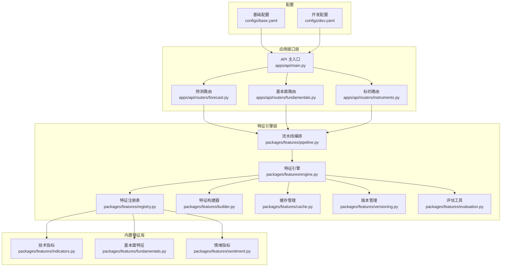

图表来源
- [apps/api/main.py](file://apps/api/main.py)
- [apps/api/routers/forecast.py](file://apps/api/routers/forecast.py)
- [apps/api/routers/fundamentals.py](file://apps/api/routers/fundamentals.py)
- [apps/api/routers/instruments.py](file://apps/api/routers/instruments.py)
- [packages/features/engine.py](file://packages/features/engine.py)
- [packages/features/builder.py](file://packages/features/builder.py)
- [packages/features/registry.py](file://packages/features/registry.py)
- [packages/features/cache.py](file://packages/features/cache.py)
- [packages/features/versioning.py](file://packages/features/versioning.py)
- [packages/features/evaluation.py](file://packages/features/evaluation.py)
- [packages/features/indicators.py](file://packages/features/indicators.py)
- [packages/features/fundamentals.py](file://packages/features/fundamentals.py)
- [packages/features/sentiment.py](file://packages/features/sentiment.py)
- [configs/base.yaml](file://configs/base.yaml)
- [configs/dev.yaml](file://configs/dev.yaml)

章节来源
- [apps/api/main.py](file://apps/api/main.py)
- [apps/api/routers/forecast.py](file://apps/api/routers/forecast.py)
- [apps/api/routers/fundamentals.py](file://apps/api/routers/fundamentals.py)
- [apps/api/routers/instruments.py](file://apps/api/routers/instruments.py)
- [packages/features/engine.py](file://packages/features/engine.py)
- [packages/features/builder.py](file://packages/features/builder.py)
- [packages/features/registry.py](file://packages/features/registry.py)
- [packages/features/cache.py](file://packages/features/cache.py)
- [packages/features/versioning.py](file://packages/features/versioning.py)
- [packages/features/evaluation.py](file://packages/features/evaluation.py)
- [packages/features/indicators.py](file://packages/features/indicators.py)
- [packages/features/fundamentals.py](file://packages/features/fundamentals.py)
- [packages/features/sentiment.py](file://packages/features/sentiment.py)
- [configs/base.yaml](file://configs/base.yaml)
- [configs/dev.yaml](file://configs/dev.yaml)

## 核心组件
- 特征注册表：集中管理特征名称、参数签名、依赖声明与元数据，支持按版本检索与校验
- 特征构建器：根据注册表解析依赖、生成 DAG、进行拓扑排序与增量更新
- 特征引擎：调度执行、合并中间结果、统一错误处理与可观测性埋点
- 缓存管理：基于键值索引与时间窗口策略，避免重复计算并保证一致性
- 版本管理：记录特征定义变更、兼容性与回滚策略
- 评估工具：统计稳定性、信息量、相关性、漂移等指标，辅助特征选择
- 内置特征库：技术指标、基本面、情绪三类特征的实现与注册
- 流水线编排：组合多阶段任务（拉取、清洗、计算、落盘）并提供批/流式执行

章节来源
- [packages/features/registry.py](file://packages/features/registry.py)
- [packages/features/builder.py](file://packages/features/builder.py)
- [packages/features/engine.py](file://packages/features/engine.py)
- [packages/features/cache.py](file://packages/features/cache.py)
- [packages/features/versioning.py](file://packages/features/versioning.py)
- [packages/features/evaluation.py](file://packages/features/evaluation.py)
- [packages/features/indicators.py](file://packages/features/indicators.py)
- [packages/features/fundamentals.py](file://packages/features/fundamentals.py)
- [packages/features/sentiment.py](file://packages/features/sentiment.py)
- [packages/features/pipeline.py](file://packages/features/pipeline.py)

## 架构总览
下图展示一次典型“预测特征计算”的请求时序：API 路由接收请求，调用流水线编排，引擎解析依赖并执行，命中缓存则直接返回，否则触发构建与计算，最终写入缓存并返回结果。

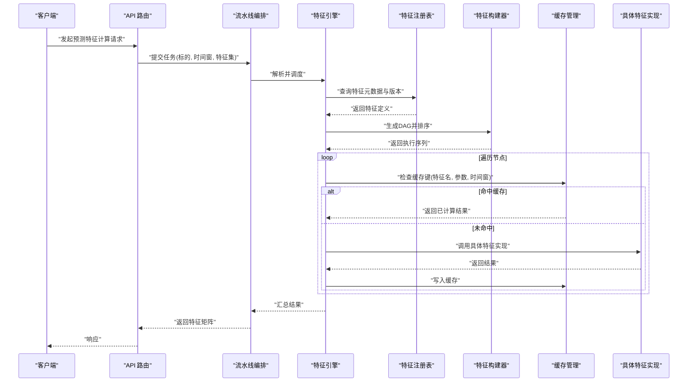

图表来源
- [apps/api/routers/forecast.py](file://apps/api/routers/forecast.py)
- [packages/features/pipeline.py](file://packages/features/pipeline.py)
- [packages/features/engine.py](file://packages/features/engine.py)
- [packages/features/registry.py](file://packages/features/registry.py)
- [packages/features/builder.py](file://packages/features/builder.py)
- [packages/features/cache.py](file://packages/features/cache.py)
- [packages/features/indicators.py](file://packages/features/indicators.py)
- [packages/features/fundamentals.py](file://packages/features/fundamentals.py)
- [packages/features/sentiment.py](file://packages/features/sentiment.py)

## 详细组件分析

### 特征注册表（Registry）
职责
- 维护特征名称到实现的映射
- 存储参数签名、依赖列表、版本标签与兼容性约束
- 提供按版本、按标签、按依赖的反查能力

设计要点
- 原子注册：注册时校验签名与依赖完整性
- 版本隔离：同名不同版本并存，默认指向最新稳定版
- 冲突检测：对循环依赖与不兼容版本进行早期拦截

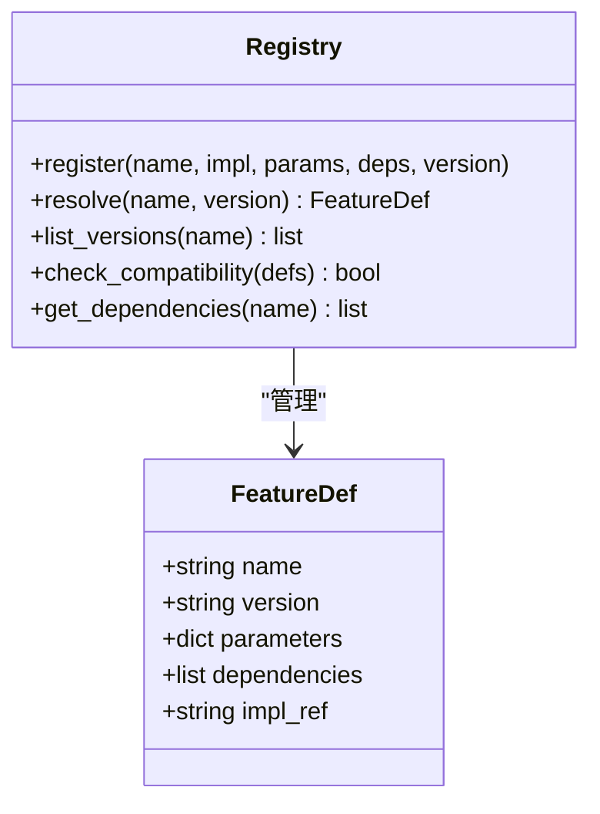

图表来源
- [packages/features/registry.py](file://packages/features/registry.py)

章节来源
- [packages/features/registry.py](file://packages/features/registry.py)

### 特征构建器（Builder）
职责
- 基于注册表解析依赖，构建有向无环图（DAG）
- 拓扑排序生成执行序列
- 支持增量构建：仅重算受影响子图

关键流程
- 输入：目标特征集合、时间窗、标的集合
- 输出：有序执行计划（含并行度建议）

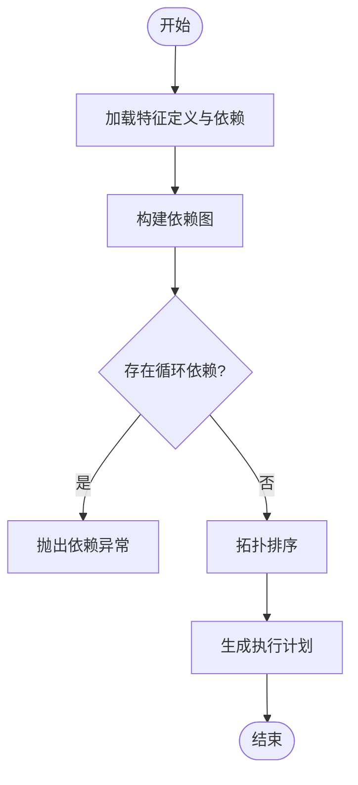

图表来源
- [packages/features/builder.py](file://packages/features/builder.py)

章节来源
- [packages/features/builder.py](file://packages/features/builder.py)

### 特征引擎（Engine）
职责
- 协调注册表、构建器、缓存与具体实现
- 统一错误处理、重试与可观测性埋点
- 提供批量与流式两种执行模式

执行要点
- 按拓扑顺序调度节点
- 节点级缓存命中优先
- 失败节点短路或降级策略

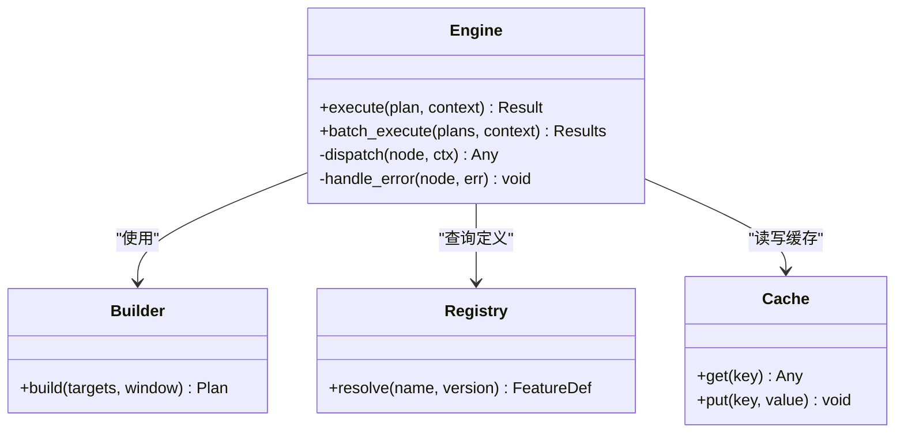

图表来源
- [packages/features/engine.py](file://packages/features/engine.py)
- [packages/features/builder.py](file://packages/features/builder.py)
- [packages/features/registry.py](file://packages/features/registry.py)
- [packages/features/cache.py](file://packages/features/cache.py)

章节来源
- [packages/features/engine.py](file://packages/features/engine.py)

### 缓存管理（Cache）
职责
- 为每个特征节点生成唯一键（包含特征名、参数哈希、时间窗、标的标识）
- 支持过期策略与一致性校验
- 提供内存与持久化后端抽象

策略
- 短周期高频特征：内存缓存 + TTL
- 长周期低频特征：持久化存储 + 按需刷新
- 跨进程共享：基于分布式键空间

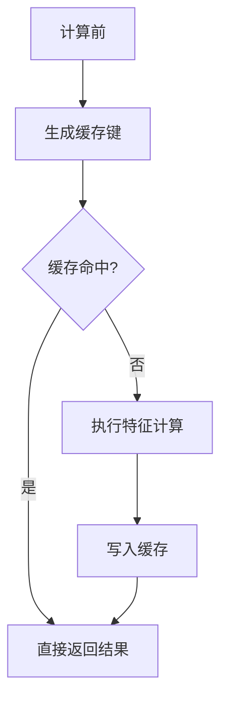

图表来源
- [packages/features/cache.py](file://packages/features/cache.py)

章节来源
- [packages/features/cache.py](file://packages/features/cache.py)

### 版本管理（Versioning）
职责
- 记录特征定义变更（参数、逻辑、依赖）
- 提供向后兼容检查与回滚能力
- 支持灰度发布与A/B切换

流程
- 变更提交 -> 版本递增 -> 兼容性校验 -> 上线/回滚

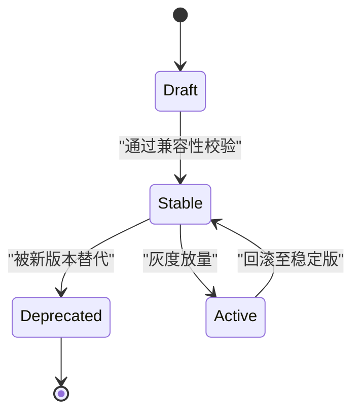

图表来源
- [packages/features/versioning.py](file://packages/features/versioning.py)

章节来源
- [packages/features/versioning.py](file://packages/features/versioning.py)

### 评估工具（Evaluation）
职责
- 计算特征稳定性（PSI/CSI）、信息量（IV/IC）、相关性（Pearson/Spearman）
- 检测分布漂移与缺失率变化
- 输出评分与选择建议

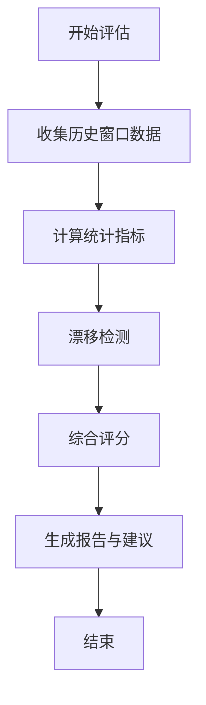

图表来源
- [packages/features/evaluation.py](file://packages/features/evaluation.py)

章节来源
- [packages/features/evaluation.py](file://packages/features/evaluation.py)

### 内置特征库

#### 技术指标（Indicators）
- 常见类别：趋势类（移动平均、MACD）、动量类（RSI、KDJ）、波动类（ATR、布林带）、成交量类（OBV、VPIN）
- 输入：OHLCV 序列、窗口长度、平滑参数
- 输出：同频对齐的特征列，支持滚动窗口与前瞻对齐控制

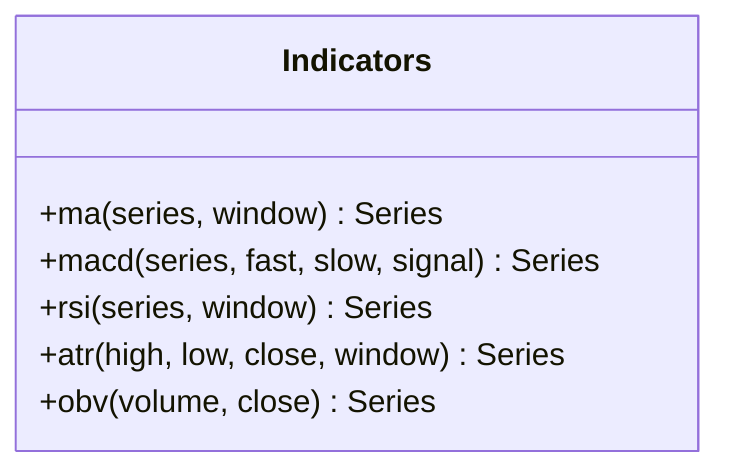

图表来源
- [packages/features/indicators.py](file://packages/features/indicators.py)

章节来源
- [packages/features/indicators.py](file://packages/features/indicators.py)

#### 基本面特征（Fundamentals）
- 常见类别：估值（PE/PB/EV/EBITDA）、盈利（ROE/毛利率/净利率）、成长（营收/利润同比环比）、财务健康（资产负债率/利息保障倍数）
- 输入：财务报表事实、公告事件、复权因子
- 输出：截面特征与时间序列特征，支持财报季对齐与前瞻期控制

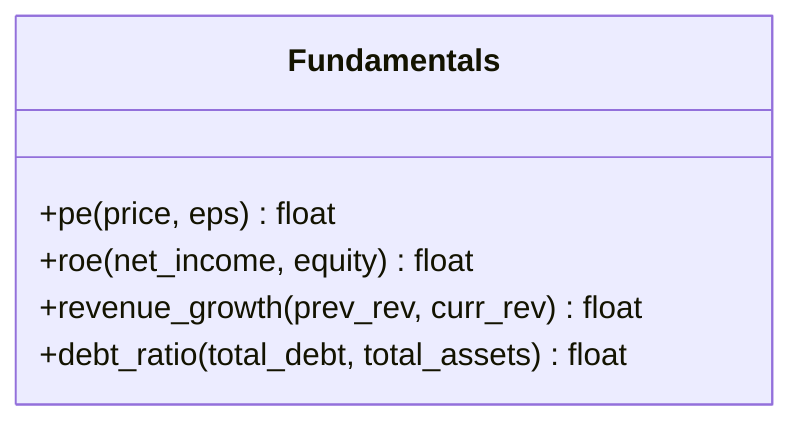

图表来源
- [packages/features/fundamentals.py](file://packages/features/fundamentals.py)

章节来源
- [packages/features/fundamentals.py](file://packages/features/fundamentals.py)

#### 市场情绪指标（Sentiment）
- 常见类别：新闻情感得分、社交媒体热度、期权偏度、资金流向
- 输入：文本源、交易数据、衍生品数据
- 输出：标准化后的情绪指数与方向信号

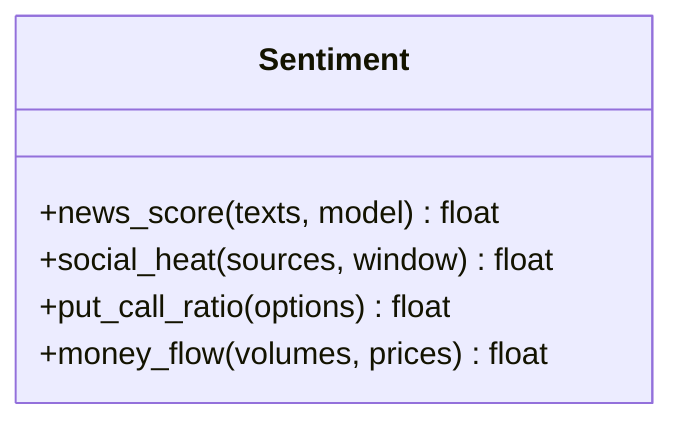

图表来源
- [packages/features/sentiment.py](file://packages/features/sentiment.py)

章节来源
- [packages/features/sentiment.py](file://packages/features/sentiment.py)

### 流水线编排（Pipeline）
职责
- 组合多个阶段：数据拉取、清洗、特征计算、验证、落盘
- 支持批处理与流式处理两种模式
- 提供进度追踪与断点续跑

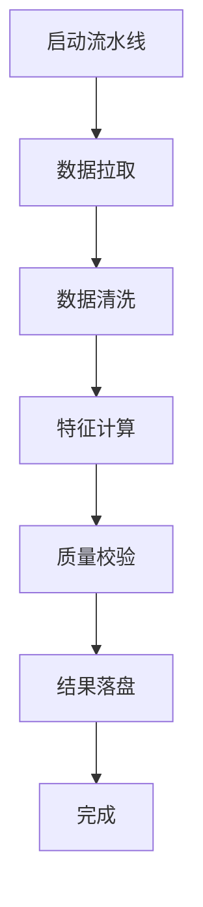

图表来源
- [packages/features/pipeline.py](file://packages/features/pipeline.py)

章节来源
- [packages/features/pipeline.py](file://packages/features/pipeline.py)

### API 集成示例（概念时序）
以下时序展示了如何通过 API 获取预测所需特征：

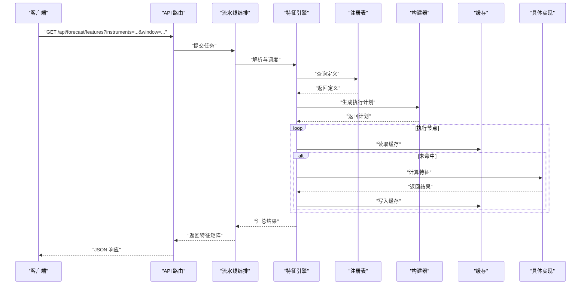

图表来源
- [apps/api/routers/forecast.py](file://apps/api/routers/forecast.py)
- [packages/features/pipeline.py](file://packages/features/pipeline.py)
- [packages/features/engine.py](file://packages/features/engine.py)
- [packages/features/registry.py](file://packages/features/registry.py)
- [packages/features/builder.py](file://packages/features/builder.py)
- [packages/features/cache.py](file://packages/features/cache.py)
- [packages/features/indicators.py](file://packages/features/indicators.py)
- [packages/features/fundamentals.py](file://packages/features/fundamentals.py)
- [packages/features/sentiment.py](file://packages/features/sentiment.py)

章节来源
- [apps/api/routers/forecast.py](file://apps/api/routers/forecast.py)
- [apps/api/routers/fundamentals.py](file://apps/api/routers/fundamentals.py)
- [apps/api/routers/instruments.py](file://apps/api/routers/instruments.py)

## 依赖关系分析
- 组件耦合
  - 引擎强依赖注册表、构建器、缓存；与具体实现解耦
  - 构建器依赖注册表的元数据，不感知实现细节
  - 缓存独立于业务逻辑，可通过后端替换
- 外部依赖
  - API 路由依赖 FastAPI/FastMCP（由 main.py 装配）
  - 配置依赖 YAML 配置文件
- 潜在风险
  - 循环依赖在注册阶段应被拦截
  - 缓存键设计不当会导致命中率低或污染

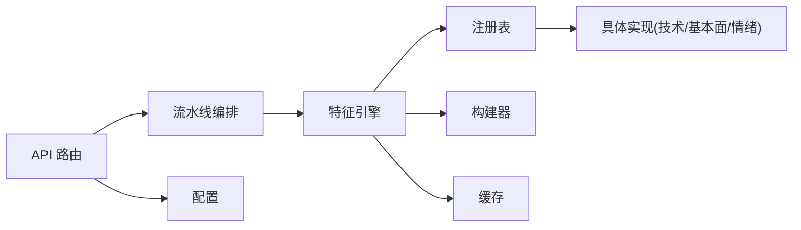

图表来源
- [apps/api/main.py](file://apps/api/main.py)
- [apps/api/routers/forecast.py](file://apps/api/routers/forecast.py)
- [packages/features/pipeline.py](file://packages/features/pipeline.py)
- [packages/features/engine.py](file://packages/features/engine.py)
- [packages/features/registry.py](file://packages/features/registry.py)
- [packages/features/builder.py](file://packages/features/builder.py)
- [packages/features/cache.py](file://packages/features/cache.py)
- [packages/features/indicators.py](file://packages/features/indicators.py)
- [packages/features/fundamentals.py](file://packages/features/fundamentals.py)
- [packages/features/sentiment.py](file://packages/features/sentiment.py)
- [configs/base.yaml](file://configs/base.yaml)
- [configs/dev.yaml](file://configs/dev.yaml)

章节来源
- [apps/api/main.py](file://apps/api/main.py)
- [packages/features/engine.py](file://packages/features/engine.py)
- [packages/features/registry.py](file://packages/features/registry.py)
- [packages/features/builder.py](file://packages/features/builder.py)
- [packages/features/cache.py](file://packages/features/cache.py)
- [configs/base.yaml](file://configs/base.yaml)
- [configs/dev.yaml](file://configs/dev.yaml)

## 性能考虑
- 缓存策略
  - 合理设计缓存键，包含特征名、参数哈希、时间窗、标的标识
  - 区分热冷特征，采用不同存储后端与TTL
- 增量计算
  - 基于DAG的局部重算，减少全量重算开销
- 并行执行
  - 无依赖节点并发执行，注意资源上限与背压
- 数据对齐
  - 统一时间戳与频率对齐，避免广播与插值带来的额外成本
- 监控与度量
  - 记录各节点耗时、缓存命中率、失败率，定位瓶颈

[本节为通用指导，无需特定文件引用]

## 故障排查指南
- 依赖异常
  - 现象：注册或构建阶段报错提示循环依赖或不满足版本约束
  - 排查：检查注册表中的依赖声明与版本兼容性
- 缓存不一致
  - 现象：相同输入在不同进程得到不同结果
  - 排查：核对缓存键生成规则与时间窗边界处理
- 性能退化
  - 现象：特征计算耗时显著增加
  - 排查：查看缓存命中率、DAG规模、并行度设置与后端延迟
- 版本回滚失败
  - 现象：切换至旧版本后出现兼容性问题
  - 排查：确认下游消费方是否仍依赖新字段或参数

章节来源
- [packages/features/registry.py](file://packages/features/registry.py)
- [packages/features/builder.py](file://packages/features/builder.py)
- [packages/features/cache.py](file://packages/features/cache.py)
- [packages/features/versioning.py](file://packages/features/versioning.py)

## 结论
本框架以“注册表+构建器+引擎+缓存+版本+评估”的分层架构为核心，实现了可扩展、可观测、可回滚的特征工程体系。通过内置技术指标、基本面与情绪三类特征库，配合流水线编排与API集成，能够快速支撑预测与研究场景。建议在新增特征时严格遵循注册与版本规范，结合评估工具持续优化特征集，确保系统长期稳定与高效运行。

[本节为总结性内容，无需特定文件引用]

## 附录

### 自定义特征开发规范
- 命名与注册
  - 唯一名称、清晰参数签名、明确依赖声明
  - 在注册表中登记版本与兼容性说明
- 实现要求
  - 输入输出类型一致，时间对齐与缺失值处理策略明确
  - 幂等与可重入，避免副作用
- 测试与评估
  - 单元测试覆盖边界条件
  - 使用评估工具输出稳定性与有效性指标
- 上线与回滚
  - 先灰度再放量，保留回滚路径

章节来源
- [packages/features/registry.py](file://packages/features/registry.py)
- [packages/features/versioning.py](file://packages/features/versioning.py)
- [packages/features/evaluation.py](file://packages/features/evaluation.py)

### 复杂特征计算示例（概念步骤）
- 需求：构建“复合动量-波动调整因子”
  - 步骤1：计算短期与中期动量（如收益率差）
  - 步骤2：计算波动率（如滚动标准差）
  - 步骤3：将动量除以波动率并进行横截面标准化
  - 步骤4：注册为新特征，声明依赖与版本
  - 步骤5：加入流水线，开启缓存与评估
- 参考路径
  - 技术指标实现参考：[packages/features/indicators.py](file://packages/features/indicators.py)
  - 注册与版本：[packages/features/registry.py](file://packages/features/registry.py)、[packages/features/versioning.py](file://packages/features/versioning.py)
  - 构建与执行：[packages/features/builder.py](file://packages/features/builder.py)、[packages/features/engine.py](file://packages/features/engine.py)
  - 缓存与流水线：[packages/features/cache.py](file://packages/features/cache.py)、[packages/features/pipeline.py](file://packages/features/pipeline.py)

章节来源
- [packages/features/indicators.py](file://packages/features/indicators.py)
- [packages/features/registry.py](file://packages/features/registry.py)
- [packages/features/versioning.py](file://packages/features/versioning.py)
- [packages/features/builder.py](file://packages/features/builder.py)
- [packages/features/engine.py](file://packages/features/engine.py)
- [packages/features/cache.py](file://packages/features/cache.py)
- [packages/features/pipeline.py](file://packages/features/pipeline.py)

### 配置项参考
- 基础配置（base.yaml）
  - 全局默认参数、缓存后端、日志级别
- 开发配置（dev.yaml）
  - 调试开关、模拟数据源、本地缓存路径

章节来源
- [configs/base.yaml](file://configs/base.yaml)
- [configs/dev.yaml](file://configs/dev.yaml)