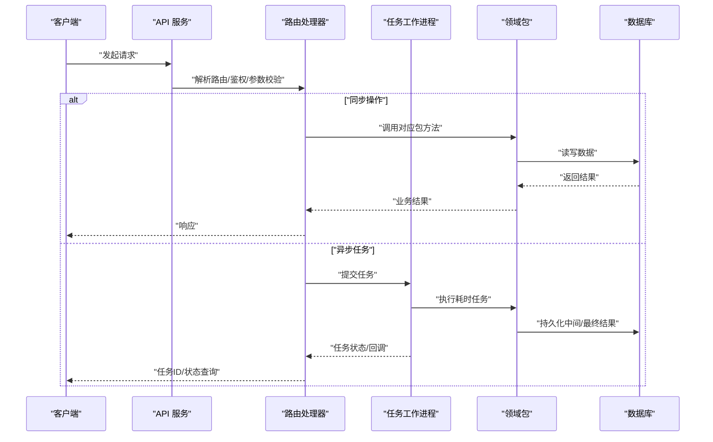
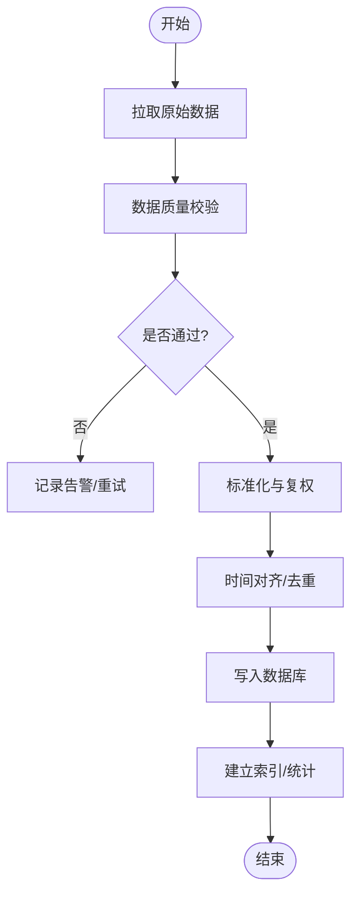
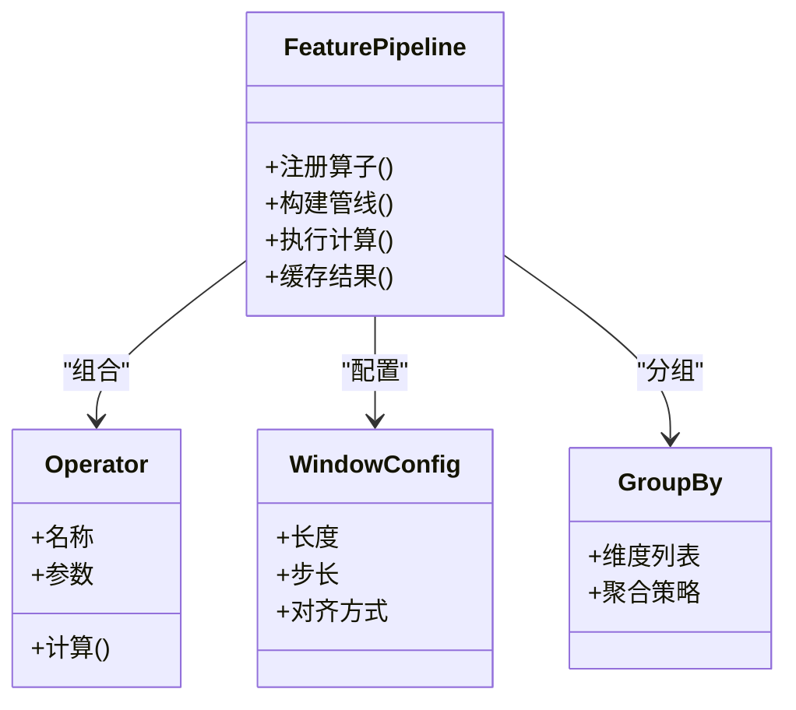
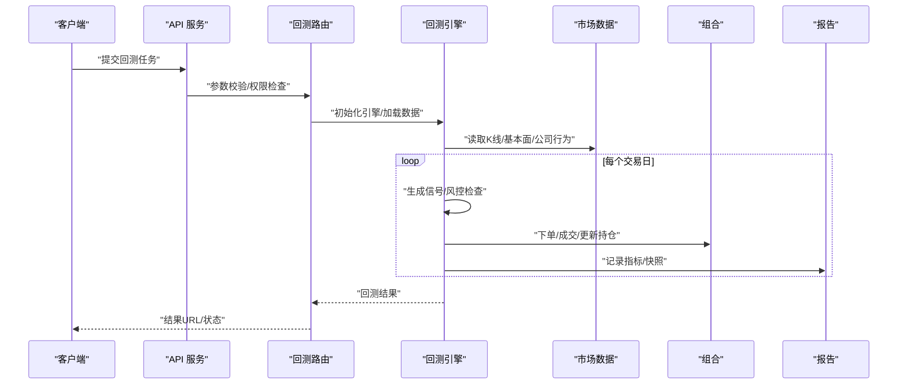
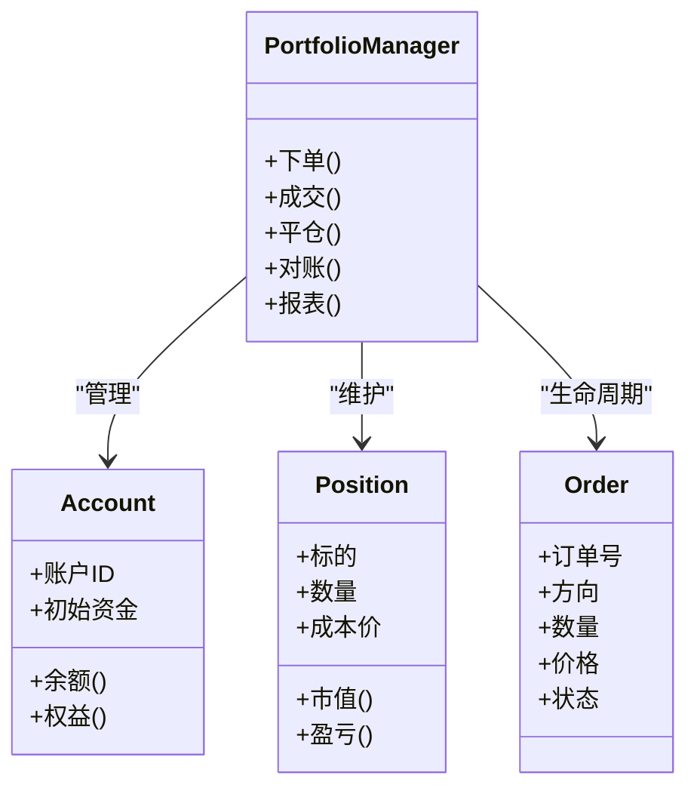
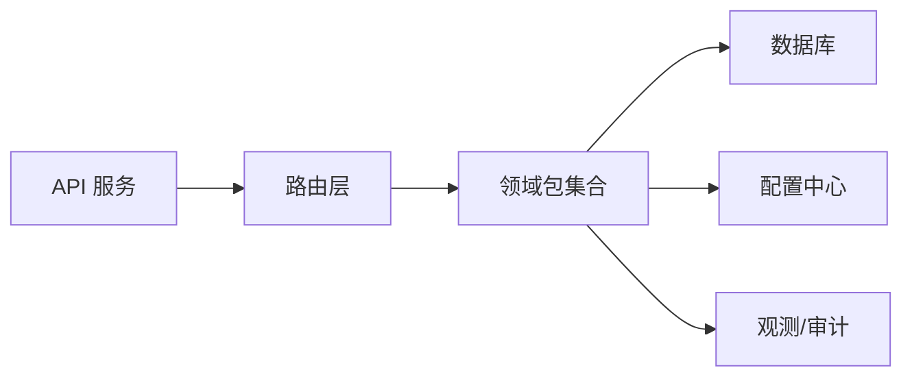

# 核心模块

<cite>
**本文引用的文件**   
- [apps/api/main.py](file://apps/api/main.py)
- [apps/api/routers/instruments.py](file://apps/api/routers/instruments.py)
- [apps/api/routers/forecast.py](file://apps/api/routers/forecast.py)
- [apps/api/routers/portfolio.py](file://apps/api/routers/portfolio.py)
- [apps/api/routers/fundamentals.py](file://apps/api/routers/fundamentals.py)
- [apps/api/routers/markets.py](file://apps/api/routers/markets.py)
- [apps/api/routers/data_status.py](file://apps/api/routers/data_status.py)
- [apps/api/routers/admin_ingestion.py](file://apps/api/routers/admin_ingestion.py)
- [apps/api/routers/scheduler.py](file://apps/api/routers/scheduler.py)
- [apps/api/deps.py](file://apps/api/deps.py)
- [apps/worker/main.py](file://apps/worker/main.py)
- [apps/worker/tasks.py](file://apps/worker/tasks.py)
- [apps/scheduler/schedule.py](file://apps/scheduler/schedule.py)
- [packages/backtest/__init__.py](file://packages/backtest/__init__.py)
- [packages/features/__init__.py](file://packages/features/__init__.py)
- [packages/datasets/__init__.py](file://packages/datasets/__init__.py)
- [packages/ingestion/__init__.py](file://packages/ingestion/__init__.py)
- [packages/instrument/__init__.py](file://packages/instrument/__init__.py)
- [packages/instruments/__init__.py](file://packages/instruments/__init__.py)
- [packages/fundamentals/__init__.py](file://packages/fundamentals/__init__.py)
- [packages/corporate_actions/__init__.py](file://packages/corporate_actions/__init__.py)
- [packages/calendar_rule/__init__.py](file://packages/calendar_rule/__init__.py)
- [packages/training/__init__.py](file://packages/training/__init__.py)
- [packages/models/__init__.py](file://packages/models/__init__.py)
- [packages/evaluation/__init__.py](file://packages/evaluation/__init__.py)
- [packages/risk/__init__.py](file://packages/risk/__init__.py)
- [packages/reporting/__init__.py](file://packages/reporting/__init__.py)
- [packages/observability/__init__.py](file://packages/observability/__init__.py)
- [packages/data_quality/__init__.py](file://packages/data_quality/__init__.py)
- [packages/data_sources/__init__.py](file://packages/data_sources/__init__.py)
- [packages/audit/__init__.py](file://packages/audit/__init__.py)
- [packages/ledger_paper/__init__.py](file://packages/ledger_paper/__init__.py)
- [packages/drift/__init__.py](file://packages/drift/__init__.py)
- [packages/labels/__init__.py](file://packages/labels/__init__.py)
- [packages/inference/__init__.py](file://packages/inference/__init__.py)
- [packages/portfolio/__init__.py](file://packages/portfolio/__init__.py)
- [configs/base.yaml](file://configs/base.yaml)
- [configs/dev.yaml](file://configs/dev.yaml)
- [sql/migrations/env.py](file://sql/migrations/env.py)
- [alembic.ini](file://alembic.ini)
</cite>

## 目录
1. [简介](#简介)
2. [项目结构](#项目结构)
3. [核心组件](#核心组件)
4. [架构总览](#架构总览)
5. [详细组件分析](#详细组件分析)
6. [依赖关系分析](#依赖关系分析)
7. [性能考虑](#性能考虑)
8. [故障排查指南](#故障排查指南)
9. [结论](#结论)
10. [附录](#附录)

## 简介
本文件面向量化投资系统的核心模块，系统性梳理数据处理管道、特征工程框架、策略回测引擎、投资组合管理等关键能力。文档从系统架构、组件职责、数据流与通信机制入手，结合API路由、任务调度、工作进程与包组织方式，给出使用示例、最佳实践、配置项说明与性能优化建议，帮助不同经验水平的开发者快速上手并高效扩展。

## 项目结构
仓库采用“应用层 + 领域包”的分层组织：
- apps：对外暴露的HTTP API、定时调度、后台任务等运行态服务
- packages：按业务域划分的可复用库（如回测、特征、数据集、因子、公司行为、日历规则、训练、评估、风险、报告、观测、数据质量、数据源、审计、账本、漂移、标签、推理、组合等）
- configs：环境配置（基础与开发）
- sql/migrations：数据库迁移脚本（Alembic）
- tests：单元与集成测试
- deploy：部署编排（Docker Compose、Prometheus）

```mermaid
graph TB
subgraph "应用层"
API["API 服务<br/>apps/api"]
Worker["任务工作进程<br/>apps/worker"]
Scheduler["定时调度器<br/>apps/scheduler"]
end
subgraph "领域包"
Ingestion["数据接入<br/>packages/ingestion"]
Datasets["数据集<br/>packages/datasets"]
Features["特征工程<br/>packages/features"]
Backtest["回测引擎<br/>packages/backtest"]
Portfolio["投资组合<br/>packages/portfolio"]
Fundamentals["基本面<br/>packages/fundamentals"]
CorporateActions["公司行为<br/>packages/corporate_actions"]
CalendarRule["日历规则<br/>packages/calendar_rule"]
Training["模型训练<br/>packages/training"]
Evaluation["评估<br/>packages/evaluation"]
Risk["风险<br/>packages/risk"]
Reporting["报告<br/>packages/reporting"]
Observability["观测<br/>packages/observability"]
DataQuality["数据质量<br/>packages/data_quality"]
DataSources["数据源<br/>packages/data_sources"]
Audit["审计<br/>packages/audit"]
LedgerPaper["账本/模拟交易<br/>packages/ledger_paper"]
Drift["漂移检测<br/>packages/drift"]
Labels["标签<br/>packages/labels"]
Inference["推理<br/>packages/inference"]
Instrument["标的管理(单标) <br/>packages/instrument"]
Instruments["标的集合<br/>packages/instruments"]
Models["模型定义<br/>packages/models"]
end
API --> Ingestion
API --> Datasets
API --> Features
API --> Backtest
API --> Portfolio
API --> Fundamentals
API --> CorporateActions
API --> CalendarRule
API --> Training
API --> Evaluation
API --> Risk
API --> Reporting
API --> Observability
API --> DataQuality
API --> DataSources
API --> Audit
API --> LedgerPaper
API --> Drift
API --> Labels
API --> Inference
API --> Instrument
API --> Instruments
API --> Models
Worker --> Ingestion
Worker --> Datasets
Worker --> Features
Worker --> Backtest
Worker --> Portfolio
Worker --> Fundamentals
Worker --> CorporateActions
Worker --> CalendarRule
Worker --> Training
Worker --> Evaluation
Worker --> Risk
Worker --> Reporting
Worker --> Observability
Worker --> DataQuality
Worker --> DataSources
Worker --> Audit
Worker --> LedgerPaper
Worker --> Drift
Worker --> Labels
Worker --> Inference
Worker --> Instrument
Worker --> Instruments
Worker --> Models
Scheduler --> API
Scheduler --> Worker
```

图表来源
- [apps/api/main.py](file://apps/api/main.py)
- [apps/worker/main.py](file://apps/worker/main.py)
- [apps/scheduler/schedule.py](file://apps/scheduler/schedule.py)
- [packages/backtest/__init__.py](file://packages/backtest/__init__.py)
- [packages/features/__init__.py](file://packages/features/__init__.py)
- [packages/datasets/__init__.py](file://packages/datasets/__init__.py)
- [packages/ingestion/__init__.py](file://packages/ingestion/__init__.py)
- [packages/instrument/__init__.py](file://packages/instrument/__init__.py)
- [packages/instruments/__init__.py](file://packages/instruments/__init__.py)
- [packages/fundamentals/__init__.py](file://packages/fundamentals/__init__.py)
- [packages/corporate_actions/__init__.py](file://packages/corporate_actions/__init__.py)
- [packages/calendar_rule/__init__.py](file://packages/calendar_rule/__init__.py)
- [packages/training/__init__.py](file://packages/training/__init__.py)
- [packages/models/__init__.py](file://packages/models/__init__.py)
- [packages/evaluation/__init__.py](file://packages/evaluation/__init__.py)
- [packages/risk/__init__.py](file://packages/risk/__init__.py)
- [packages/reporting/__init__.py](file://packages/reporting/__init__.py)
- [packages/observability/__init__.py](file://packages/observability/__init__.py)
- [packages/data_quality/__init__.py](file://packages/data_quality/__init__.py)
- [packages/data_sources/__init__.py](file://packages/data_sources/__init__.py)
- [packages/audit/__init__.py](file://packages/audit/__init__.py)
- [packages/ledger_paper/__init__.py](file://packages/ledger_paper/__init__.py)
- [packages/drift/__init__.py](file://packages/drift/__init__.py)
- [packages/labels/__init__.py](file://packages/labels/__init__.py)
- [packages/inference/__init__.py](file://packages/inference/__init__.py)
- [packages/portfolio/__init__.py](file://packages/portfolio/__init__.py)

章节来源
- [apps/api/main.py](file://apps/api/main.py)
- [apps/worker/main.py](file://apps/worker/main.py)
- [apps/scheduler/schedule.py](file://apps/scheduler/schedule.py)
- [configs/base.yaml](file://configs/base.yaml)
- [configs/dev.yaml](file://configs/dev.yaml)
- [alembic.ini](file://alembic.ini)
- [sql/migrations/env.py](file://sql/migrations/env.py)

## 核心组件
- 数据处理管道
  - 数据接入：负责多源数据的拉取、校验、转换与入库，提供一致性ID与时间对齐能力
  - 数据集：封装常用市场数据切片、窗口聚合、去重与合并逻辑
  - 数据质量：缺失值、异常值、重复与一致性检查
- 特征工程框架
  - 基于可组合算子构建时序/截面特征，支持滚动窗口、分组聚合、跨资产对齐
  - 与日历规则、公司行为联动，保证复权与停牌处理正确性
- 策略回测引擎
  - 事件驱动或向量化回测，支持手续费、滑点、涨跌停、熔断、流动性约束
  - 输出持仓、成交、净值曲线与风险指标
- 投资组合管理
  - 头寸、现金、费用、盈亏、风险敞口跟踪；支持模拟交易与实盘对接
- 基本面与公司行为
  - 财务事实、分红送转、拆合股、退市等事件处理与复权
- 训练与评估
  - 模型训练流水线、交叉验证、指标计算与结果归档
- 风险与报告
  - 风险度量（波动率、VaR、回撤等）、绩效归因、可视化报告
- 观测与审计
  - 指标采集、日志、追踪与审计事件记录
- 推理与标签
  - 在线预测、离线标签生成与版本化

章节来源
- [packages/ingestion/__init__.py](file://packages/ingestion/__init__.py)
- [packages/datasets/__init__.py](file://packages/datasets/__init__.py)
- [packages/data_quality/__init__.py](file://packages/data_quality/__init__.py)
- [packages/features/__init__.py](file://packages/features/__init__.py)
- [packages/backtest/__init__.py](file://packages/backtest/__init__.py)
- [packages/portfolio/__init__.py](file://packages/portfolio/__init__.py)
- [packages/fundamentals/__init__.py](file://packages/fundamentals/__init__.py)
- [packages/corporate_actions/__init__.py](file://packages/corporate_actions/__init__.py)
- [packages/calendar_rule/__init__.py](file://packages/calendar_rule/__init__.py)
- [packages/training/__init__.py](file://packages/training/__init__.py)
- [packages/evaluation/__init__.py](file://packages/evaluation/__init__.py)
- [packages/risk/__init__.py](file://packages/risk/__init__.py)
- [packages/reporting/__init__.py](file://packages/reporting/__init__.py)
- [packages/observability/__init__.py](file://packages/observability/__init__.py)
- [packages/audit/__init__.py](file://packages/audit/__init__.py)
- [packages/inference/__init__.py](file://packages/inference/__init__.py)
- [packages/labels/__init__.py](file://packages/labels/__init__.py)

## 架构总览
系统由三类运行时组成：
- API 服务：提供REST接口，协调各包完成查询、写入、回测、训练等操作
- 任务工作进程：异步执行耗时任务（数据接入、批量特征、回测批跑）
- 定时调度器：按日历规则触发任务，保障T+1、盘中增量等节奏

图表来源
- [apps/api/main.py](file://apps/api/main.py)
- [apps/api/routers/instruments.py](file://apps/api/routers/instruments.py)
- [apps/api/routers/forecast.py](file://apps/api/routers/forecast.py)
- [apps/api/routers/portfolio.py](file://apps/api/routers/portfolio.py)
- [apps/api/routers/fundamentals.py](file://apps/api/routers/fundamentals.py)
- [apps/api/routers/markets.py](file://apps/api/routers/markets.py)
- [apps/api/routers/data_status.py](file://apps/api/routers/data_status.py)
- [apps/api/routers/admin_ingestion.py](file://apps/api/routers/admin_ingestion.py)
- [apps/api/routers/scheduler.py](file://apps/api/routers/scheduler.py)
- [apps/worker/main.py](file://apps/worker/main.py)
- [apps/worker/tasks.py](file://apps/worker/tasks.py)
- [apps/scheduler/schedule.py](file://apps/scheduler/schedule.py)

## 详细组件分析

### 数据处理管道
- 目标：将多源行情/基本面/公司行为数据标准化入库，并提供高质量的数据集供下游消费
- 关键流程
  - 拉取与校验：数据源适配、格式统一、完整性与一致性校验
  - 转换与对齐：时间戳对齐、复权处理、停牌/涨跌停标记
  - 存储与索引：按日频/分钟频分区，建立主键与时间索引
  - 质量门禁：缺失、异常、重复检测与告警
- 典型用法
  - 通过API触发全量/增量接入，或通过调度器按日历规则自动执行
  - 在任务队列中并行处理多市场/多品种

章节来源
- [packages/ingestion/__init__.py](file://packages/ingestion/__init__.py)
- [packages/datasets/__init__.py](file://packages/datasets/__init__.py)
- [packages/data_quality/__init__.py](file://packages/data_quality/__init__.py)
- [apps/api/routers/admin_ingestion.py](file://apps/api/routers/admin_ingestion.py)
- [apps/api/routers/data_status.py](file://apps/api/routers/data_status.py)
- [apps/worker/tasks.py](file://apps/worker/tasks.py)

### 特征工程框架
- 目标：以可组合的方式构建稳健的时序/截面特征，兼容多市场与多频率
- 关键能力
  - 算子库：移动平均、波动率、动量、截面排名、行业中性化等
  - 窗口与分组：按标的/行业/风格分组，支持滚动窗口与前瞻期
  - 事件联动：结合公司行为与日历规则，避免未来函数
- 典型用法
  - 在回测前预计算特征，或在推理时按需计算
  - 通过API查询特征快照或批量导出

章节来源
- [packages/features/__init__.py](file://packages/features/__init__.py)
- [packages/calendar_rule/__init__.py](file://packages/calendar_rule/__init__.py)
- [packages/corporate_actions/__init__.py](file://packages/corporate_actions/__init__.py)
- [packages/datasets/__init__.py](file://packages/datasets/__init__.py)

### 策略回测引擎
- 目标：提供高保真回测，贴近真实交易约束，输出可解释的绩效与风险指标
- 关键能力
  - 约束建模：手续费、滑点、涨跌停、熔断、最小交易单位、流动性阈值
  - 事件驱动：信号→下单→撮合→持仓更新→风控→报告
  - 可插拔：信号源、撮合器、风控器、报告器可替换
- 典型用法
  - 通过API提交回测任务，指定标的范围、时间区间、参数与约束
  - 查看进度、下载结果与可视化报告

章节来源
- [packages/backtest/__init__.py](file://packages/backtest/__init__.py)
- [packages/portfolio/__init__.py](file://packages/portfolio/__init__.py)
- [packages/reporting/__init__.py](file://packages/reporting/__init__.py)
- [apps/api/routers/forecast.py](file://apps/api/routers/forecast.py)

### 投资组合管理
- 目标：维护头寸、现金、费用、盈亏与风险敞口，支撑模拟与实盘
- 关键能力
  - 账户与子账户：多策略/多账户隔离
  - 交易流水：逐笔成交、费用分摊、资金占用
  - 风险限额：仓位上限、集中度、止损止盈
- 典型用法
  - 通过API查询当前持仓、历史流水、净值曲线
  - 在回测中注入组合实例，或在推理阶段进行模拟交易

章节来源
- [packages/portfolio/__init__.py](file://packages/portfolio/__init__.py)
- [apps/api/routers/portfolio.py](file://apps/api/routers/portfolio.py)

### 基本面与公司行为
- 目标：提供标准化的财务事实与事件序列，支撑估值因子与复权处理
- 关键能力
  - 财务事实：收入、利润、现金流等指标的时间序列
  - 公司行为：分红、送转股、配股、退市等事件
  - 复权：前复权/后复权与除权除息处理
- 典型用法
  - 通过API查询某标的的基本面快照或事件序列
  - 在特征工程中作为输入或过滤条件

章节来源
- [packages/fundamentals/__init__.py](file://packages/fundamentals/__init__.py)
- [packages/corporate_actions/__init__.py](file://packages/corporate_actions/__init__.py)
- [apps/api/routers/fundamentals.py](file://apps/api/routers/fundamentals.py)

### 日历规则与市场数据
- 目标：统一交易日历、节假日与特殊交易时段，确保时间对齐
- 关键能力
  - 多市场日历：A股、美股、基金等差异
  - 特殊日：提前收盘、延迟开盘、临时休市
- 典型用法
  - 在数据接入与回测中作为时间基准
  - 通过API查询某日的交易状态

章节来源
- [packages/calendar_rule/__init__.py](file://packages/calendar_rule/__init__.py)
- [apps/api/routers/markets.py](file://apps/api/routers/markets.py)

### 训练、评估与推理
- 目标：端到端模型生命周期管理，从训练到上线推理
- 关键能力
  - 训练流水线：数据准备、特征抽取、模型训练、超参搜索
  - 评估体系：样本外表现、稳定性、过拟合检测
  - 推理服务：批量/在线预测、版本管理与灰度发布
- 典型用法
  - 通过API触发训练任务、查看评估报告、部署推理服务

章节来源
- [packages/training/__init__.py](file://packages/training/__init__.py)
- [packages/evaluation/__init__.py](file://packages/evaluation/__init__.py)
- [packages/inference/__init__.py](file://packages/inference/__init__.py)
- [packages/models/__init__.py](file://packages/models/__init__.py)
- [apps/api/routers/forecast.py](file://apps/api/routers/forecast.py)

### 风险、报告与观测
- 目标：全面的风险度量、可追溯的报告与系统观测
- 关键能力
  - 风险：波动率、VaR、最大回撤、集中度、杠杆
  - 报告：绩效归因、持仓穿透、合规检查
  - 观测：指标采集、日志、链路追踪
- 典型用法
  - 在回测与实盘中持续输出风险与报告
  - 通过API获取监控面板与审计日志

章节来源
- [packages/risk/__init__.py](file://packages/risk/__init__.py)
- [packages/reporting/__init__.py](file://packages/reporting/__init__.py)
- [packages/observability/__init__.py](file://packages/observability/__init__.py)
- [packages/audit/__init__.py](file://packages/audit/__init__.py)

### 标的管理
- 目标：统一的标的标识与元数据管理，支持跨市场映射
- 关键能力
  - 唯一ID规范、别名映射、上市/退市状态
  - 分类与属性：行业、板块、指数成分等
- 典型用法
  - 通过API查询标的信息、筛选股票池
  - 在特征与回测中作为维度与过滤条件

章节来源
- [packages/instrument/__init__.py](file://packages/instrument/__init__.py)
- [packages/instruments/__init__.py](file://packages/instruments/__init__.py)
- [apps/api/routers/instruments.py](file://apps/api/routers/instruments.py)

### 数据源与标签
- 目标：抽象多数据源接入与标签生产
- 关键能力
  - 数据源适配器：统一接口、连接池、重试与降级
  - 标签工厂：收益率、涨跌分类、事件标签等
- 典型用法
  - 在训练与评估中读取标签
  - 在数据接入中写入原始数据

章节来源
- [packages/data_sources/__init__.py](file://packages/data_sources/__init__.py)
- [packages/labels/__init__.py](file://packages/labels/__init__.py)

## 依赖关系分析
- 耦合与内聚
  - API层仅依赖路由与公共依赖，业务逻辑下沉至packages，保持低耦合
  - 包之间通过明确接口交互，减少循环依赖
- 外部依赖
  - 数据库迁移由Alembic管理，配置文件集中管理
- 可能的循环依赖
  - 若出现包间互相引用，应引入抽象层或事件总线解耦

图表来源
- [apps/api/main.py](file://apps/api/main.py)
- [apps/api/deps.py](file://apps/api/deps.py)
- [configs/base.yaml](file://configs/base.yaml)
- [configs/dev.yaml](file://configs/dev.yaml)
- [packages/observability/__init__.py](file://packages/observability/__init__.py)
- [packages/audit/__init__.py](file://packages/audit/__init__.py)

章节来源
- [apps/api/deps.py](file://apps/api/deps.py)
- [configs/base.yaml](file://configs/base.yaml)
- [configs/dev.yaml](file://configs/dev.yaml)

## 性能考虑
- 数据管道
  - 并行拉取与分片写入，批量插入与索引重建错峰执行
  - 冷热分层存储，热点表加索引与物化视图
- 特征工程
  - 预计算与增量更新结合，结果缓存与版本化
  - 向量化计算优先，避免Python循环
- 回测引擎
  - 事件驱动与向量化混合：大规模历史用向量化，复杂约束用事件驱动
  - 内存池与对象复用，减少GC压力
- 组合与风控
  - 增量更新持仓与风险指标，避免全量重算
- 观测与审计
  - 采样上报与异步落盘，降低主路径开销

[本节为通用指导，不直接分析具体文件]

## 故障排查指南
- 常见问题
  - 数据缺失或不一致：检查数据质量门禁与入站校验日志
  - 复权错误：核对公司行为事件与复权算法
  - 回测偏差：确认手续费、滑点、涨跌停与流动性约束
  - 任务失败：查看任务队列状态与工作进程日志
- 定位手段
  - 通过API查询数据状态与任务进度
  - 使用观测与审计模块检索关键事件
  - 对比迁移版本与配置差异

章节来源
- [apps/api/routers/data_status.py](file://apps/api/routers/data_status.py)
- [apps/api/routers/admin_ingestion.py](file://apps/api/routers/admin_ingestion.py)
- [apps/worker/tasks.py](file://apps/worker/tasks.py)
- [packages/observability/__init__.py](file://packages/observability/__init__.py)
- [packages/audit/__init__.py](file://packages/audit/__init__.py)

## 结论
本系统以清晰的层次划分与模块化设计，实现了从数据接入、特征工程、回测到组合管理与观测的全链路能力。通过API、任务与调度器的协同，既满足研究探索的灵活性，也兼顾生产环境的稳定性与可扩展性。建议在迭代中持续完善数据质量门禁、特征版本化与回测约束建模，以提升整体可靠性与效率。

[本节为总结性内容，不直接分析具体文件]

## 附录

### 配置与环境
- 基础配置与开发配置分离，便于本地调试与线上部署
- 数据库迁移由Alembic管理，迁移脚本位于sql/migrations

章节来源
- [configs/base.yaml](file://configs/base.yaml)
- [configs/dev.yaml](file://configs/dev.yaml)
- [alembic.ini](file://alembic.ini)
- [sql/migrations/env.py](file://sql/migrations/env.py)

### API 概览（按路由）
- 标的相关：查询与筛选标的、映射与属性
- 预测相关：提交预测/回测任务、查询结果
- 组合相关：查询持仓、流水、净值
- 基本面相关：查询财务事实与公司行为
- 市场相关：查询交易日历与状态
- 数据状态：查看数据接入进度与质量
- 管理接入：触发全量/增量接入
- 调度器：查看与管理定时任务

章节来源
- [apps/api/routers/instruments.py](file://apps/api/routers/instruments.py)
- [apps/api/routers/forecast.py](file://apps/api/routers/forecast.py)
- [apps/api/routers/portfolio.py](file://apps/api/routers/portfolio.py)
- [apps/api/routers/fundamentals.py](file://apps/api/routers/fundamentals.py)
- [apps/api/routers/markets.py](file://apps/api/routers/markets.py)
- [apps/api/routers/data_status.py](file://apps/api/routers/data_status.py)
- [apps/api/routers/admin_ingestion.py](file://apps/api/routers/admin_ingestion.py)
- [apps/api/routers/scheduler.py](file://apps/api/routers/scheduler.py)

### 使用示例与最佳实践
- 数据接入
  - 通过管理路由触发增量接入，观察数据状态路由反馈
  - 建议设置质量阈值与告警通道
- 特征工程
  - 先小规模验证算子与窗口，再扩展到全市场
  - 对重要特征做版本化与回归测试
- 回测
  - 逐步放宽约束，先无摩擦回测，再加入滑点与涨跌停
  - 关注样本外与滚动窗口表现
- 组合管理
  - 严格限额与止损，定期复盘与压力测试
- 观测与审计
  - 关键节点埋点，保留审计事件以便溯源

[本节为通用指导，不直接分析具体文件]