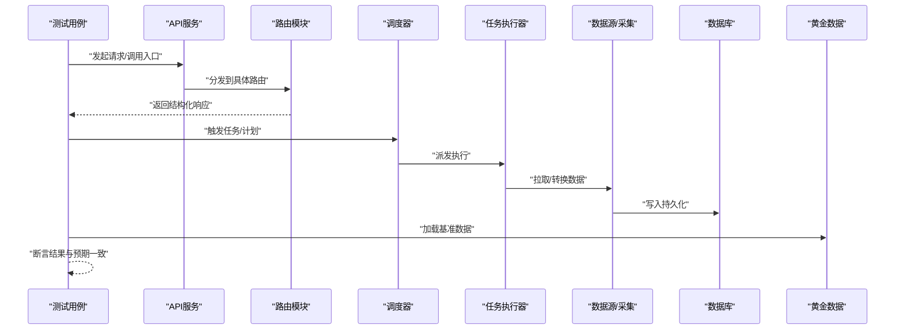
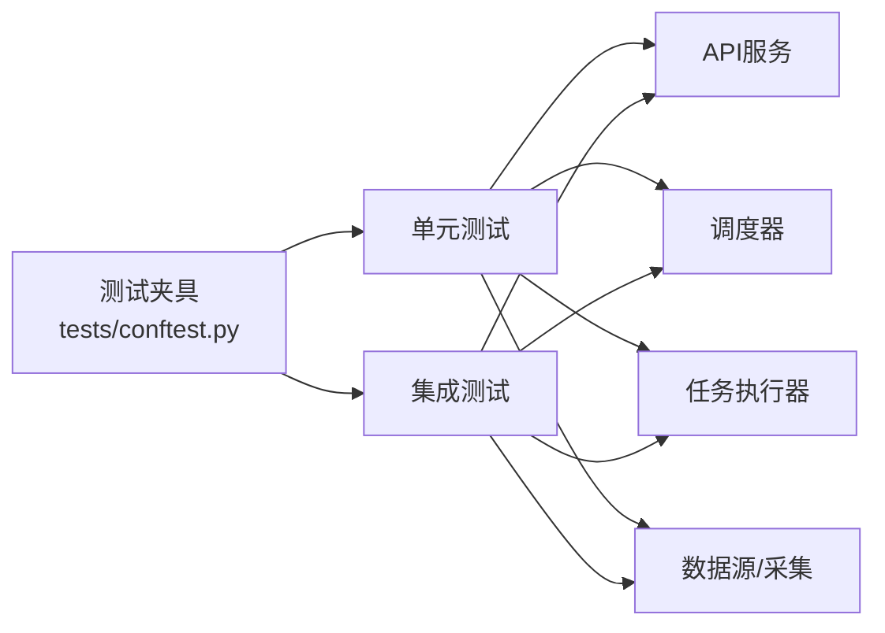

# 测试策略

<cite>
**本文引用的文件**   
- [tests/conftest.py](file://tests/conftest.py)
- [tests/integration/test_e2e_pipeline.py](file://tests/integration/test_e2e_pipeline.py)
- [tests/unit/test_api_health.py](file://tests/unit/test_api_health.py)
- [tests/unit/test_instruments_router_wired.py](file://tests/unit/test_instruments_router_wired.py)
- [tests/unit/test_scheduler.py](file://tests/unit/test_scheduler.py)
- [tests/unit/test_worker_tasks.py](file://tests/unit/test_worker_tasks.py)
- [tests/unit/test_ingestion.py](file://tests/unit/test_ingestion.py)
- [tests/unit/test_ingestion_sql_sink.py](file://tests/unit/test_ingestion_sql_sink.py)
- [tests/unit/test_golden_scenarios.py](file://tests/unit/test_golden_scenarios.py)
- [tests/unit/test_golden_scenarios_more.py](file://tests/unit/test_golden_scenarios_more.py)
- [tests/fixtures/golden/cn/halt_and_up_limit.jsonl](file://tests/fixtures/golden/cn/halt_and_up_limit.jsonl)
- [tests/fixtures/golden/us/delisting.jsonl](file://tests/fixtures/golden/us/dellisting.jsonl)
- [apps/api/main.py](file://apps/api/main.py)
- [apps/api/routers/instruments.py](file://apps/api/routers/instruments.py)
- [apps/scheduler/executor.py](file://apps/scheduler/executor.py)
- [apps/scheduler/schedule.py](file://apps/scheduler/schedule.py)
- [apps/worker/tasks.py](file://apps/worker/tasks.py)
- [packages/data_sources/__init__.py](file://packages/data_sources/__init__.py)
- [packages/ingestion/__init__.py](file://packages/ingestion/__init__.py)
- [packages/backtest/__init__.py](file://packages/backtest/__init__.py)
- [packages/features/__init__.py](file://packages/features/__init__.py)
- [packages/models/__init__.py](file://packages/models/__init__.py)
- [packages/portfolio/__init__.py](file://packages/portfolio/__init__.py)
- [packages/risk/__init__.py](file://packages/risk/__init__.py)
- [packages/training/__init__.py](file://packages/training/__init__.py)
- [packages/evaluation/__init__.py](file://packages/evaluation/__init__.py)
- [packages/fundamentals/__init__.py](file://packages/fundamentals/__init__.py)
- [packages/fx/__init__.py](file://packages/fx/__init__.py)
- [packages/instrument/__init__.py](file://packages/instrument/__init__.py)
- [packages/instruments/__init__.py](file://packages/instruments/__init__.py)
- [packages/observability/__init__.py](file://packages/observability/__init__.py)
- [packages/reporting/__init__.py](file://packages/reporting/__init__.py)
- [packages/audit/__init__.py](file://packages/audit/__init__.py)
- [packages/automation/__init__.py](file://packages/automation/__init__.py)
- [packages/broker/__init__.py](file://packages/broker/__init__.py)
- [packages/calendar_rule/__init__.py](file://packages/calendar_rule/__init__.py)
- [packages/corporate_actions/__init__.py](file://packages/corporate_actions/__init__.py)
- [packages/data_quality/__init__.py](file://packages/data_quality/__init__.py)
- [packages/datasets/__init__.py](file://packages/datasets/__init__.py)
- [packages/drift/__init__.py](file://packages/drift/__init__.py)
- [packages/labels/__init__.py](file://packages/labels/__init__.py)
- [packages/ledger_paper/__init__.py](file://packages/ledger_paper/__init__.py)
</cite>

## 目录
1. [简介](#简介)
2. [项目结构](#项目结构)
3. [核心组件](#核心组件)
4. [架构总览](#架构总览)
5. [详细组件分析](#详细组件分析)
6. [依赖分析](#依赖分析)
7. [性能考虑](#性能考虑)
8. [故障排查指南](#故障排查指南)
9. [结论](#结论)
10. [附录](#附录)

## 简介
本测试策略文档面向量化交易MCP系统，覆盖单元测试、集成测试与性能测试的完整方案。重点包括：
- 测试夹具设计与模拟数据管理
- 量化策略、数据处理与API接口的测试最佳实践
- 持续集成中的自动化执行与结果分析
- 常见问题定位与调试技巧
- 覆盖率目标与质量门禁建议

## 项目结构
仓库采用多应用+多包的分层组织方式，测试代码集中于 tests 目录，按 unit 与 integration 分层；golden 场景数据位于 fixtures/golden。

```mermaid
graph TB
subgraph "应用"
API["API服务<br/>apps/api"]
SCHED["调度器<br/>apps/scheduler"]
WORKER["任务执行器<br/>apps/worker"]
MCP_READ["读取MCP<br/>apps/quant-read-mcp"]
MCP_ADMIN["管理MCP<br/>apps/quant-admin-mcp"]
end
subgraph "领域包"
DS["数据源<br/>packages/data_sources"]
ING["采集入库<br/>packages/ingestion"]
BT["回测<br/>packages/backtest"]
FEAT["特征工程<br/>packages/features"]
MOD["模型训练/推理<br/>packages/models, training"]
PORT["组合<br/>packages/portfolio"]
RISK["风险<br/>packages/risk"]
EVAL["评估<br/>packages/evaluation"]
OBS["可观测性<br/>packages/observability"]
REP["报告<br/>packages/reporting"]
AUD["审计<br/>packages/audit"]
AUT["自动化<br/>packages/automation"]
BRK["经纪商<br/>packages/broker"]
CAL["日历规则<br/>packages/calendar_rule"]
CA["公司行为<br/>packages/corporate_actions"]
DQ["数据质量<br/>packages/data_quality"]
DAT["数据集<br/>packages/datasets"]
DRIFT["漂移检测<br/>packages/drift"]
LAB["标签<br/>packages/labels"]
LED["记账/纸交易<br/>packages/ledger_paper"]
INST["标的/工具<br/>packages/instrument, instruments"]
FX["外汇<br/>packages/fx"]
FUND["基本面<br/>packages/fundamentals"]
end
subgraph "测试"
T_UNIT["单元测试<br/>tests/unit"]
T_INT["集成测试<br/>tests/integration"]
FIX["测试夹具与黄金数据<br/>tests/fixtures"]
end
API --> INST
API --> OBS
API --> AUD
SCHED --> ING
SCHED --> DS
WORKER --> ING
WORKER --> DS
T_UNIT --> API
T_UNIT --> SCHED
T_UNIT --> WORKER
T_UNIT --> DS
T_UNIT --> ING
T_UNIT --> BT
T_UNIT --> FEAT
T_UNIT --> MOD
T_UNIT --> PORT
T_UNIT --> RISK
T_UNIT --> EVAL
T_UNIT --> OBS
T_UNIT --> REP
T_UNIT --> AUD
T_UNIT --> AUT
T_UNIT --> BRK
T_UNIT --> CAL
T_UNIT --> CA
T_UNIT --> DQ
T_UNIT --> DAT
T_UNIT --> DRIFT
T_UNIT --> LAB
T_UNIT --> LED
T_UNIT --> INST
T_UNIT --> FX
T_UNIT --> FUND
T_INT --> API
T_INT --> SCHED
T_INT --> WORKER
T_INT --> DS
T_INT --> ING
T_UNIT --> FIX
T_INT --> FIX
```

图表来源
- [apps/api/main.py](file://apps/api/main.py)
- [apps/scheduler/executor.py](file://apps/scheduler/executor.py)
- [apps/scheduler/schedule.py](file://apps/scheduler/schedule.py)
- [apps/worker/tasks.py](file://apps/worker/tasks.py)
- [packages/data_sources/__init__.py](file://packages/data_sources/__init__.py)
- [packages/ingestion/__init__.py](file://packages/ingestion/__init__.py)
- [packages/backtest/__init__.py](file://packages/backtest/__init__.py)
- [packages/features/__init__.py](file://packages/features/__init__.py)
- [packages/models/__init__.py](file://packages/models/__init__.py)
- [packages/portfolio/__init__.py](file://packages/portfolio/__init__.py)
- [packages/risk/__init__.py](file://packages/risk/__init__.py)
- [packages/evaluation/__init__.py](file://packages/evaluation/__init__.py)
- [packages/fundamentals/__init__.py](file://packages/fundamentals/__init__.py)
- [packages/fx/__init__.py](file://packages/fx/__init__.py)
- [packages/instrument/__init__.py](file://packages/instrument/__init__.py)
- [packages/instruments/__init__.py](file://packages/instruments/__init__.py)
- [packages/observability/__init__.py](file://packages/observability/__init__.py)
- [packages/reporting/__init__.py](file://packages/reporting/__init__.py)
- [packages/audit/__init__.py](file://packages/audit/__init__.py)
- [packages/automation/__init__.py](file://packages/automation/__init__.py)
- [packages/broker/__init__.py](file://packages/broker/__init__.py)
- [packages/calendar_rule/__init__.py](file://packages/calendar_rule/__init__.py)
- [packages/corporate_actions/__init__.py](file://packages/corporate_actions/__init__.py)
- [packages/data_quality/__init__.py](file://packages/data_quality/__init__.py)
- [packages/datasets/__init__.py](file://packages/datasets/__init__.py)
- [packages/drift/__init__.py](file://packages/drift/__init__.py)
- [packages/labels/__init__.py](file://packages/labels/__init__.py)
- [packages/ledger_paper/__init__.py](file://packages/ledger_paper/__init__.py)

章节来源
- [tests/conftest.py](file://tests/conftest.py)
- [tests/integration/test_e2e_pipeline.py](file://tests/integration/test_e2e_pipeline.py)
- [tests/unit/test_api_health.py](file://tests/unit/test_api_health.py)
- [tests/unit/test_instruments_router_wired.py](file://tests/unit/test_instruments_router_wired.py)
- [tests/unit/test_scheduler.py](file://tests/unit/test_scheduler.py)
- [tests/unit/test_worker_tasks.py](file://tests/unit/test_worker_tasks.py)
- [tests/unit/test_ingestion.py](file://tests/unit/test_ingestion.py)
- [tests/unit/test_ingestion_sql_sink.py](file://tests/unit/test_ingestion_sql_sink.py)
- [tests/unit/test_golden_scenarios.py](file://tests/unit/test_golden_scenarios.py)
- [tests/unit/test_golden_scenarios_more.py](file://tests/unit/test_golden_scenarios_more.py)
- [tests/fixtures/golden/cn/halt_and_up_limit.jsonl](file://tests/fixtures/golden/cn/halt_and_up_limit.jsonl)
- [tests/fixtures/golden/us/delisting.jsonl](file://tests/fixtures/golden/us/dellisting.jsonl)

## 核心组件
- 测试夹具与共享配置
  - 通过 conftest 提供跨用例复用的数据库连接、客户端、资源清理等能力，确保单元与集成测试环境一致。
- 端到端流水线测试
  - 以真实或半真实的数据路径验证从数据接入到调度执行的闭环流程，保障关键业务链路稳定。
- API健康与路由连通性
  - 针对HTTP接口进行轻量级连通性与响应格式校验，快速发现服务启动、依赖注入与路由绑定问题。
- 调度与任务执行
  - 对调度器的触发逻辑与任务执行器进行隔离测试，必要时使用内存存储或内存队列替代外部依赖。
- 数据采集与SQL落库
  - 验证数据适配器、转换管道与SQL Sink的正确性，结合Golden数据保证边界场景回归。
- 黄金场景回归
  - 基于固定输入输出（JSONL）断言复杂市场事件（停牌、涨跌停、除权除息、退市等）的处理一致性。

章节来源
- [tests/conftest.py](file://tests/conftest.py)
- [tests/integration/test_e2e_pipeline.py](file://tests/integration/test_e2e_pipeline.py)
- [tests/unit/test_api_health.py](file://tests/unit/test_api_health.py)
- [tests/unit/test_instruments_router_wired.py](file://tests/unit/test_instruments_router_wired.py)
- [tests/unit/test_scheduler.py](file://tests/unit/test_scheduler.py)
- [tests/unit/test_worker_tasks.py](file://tests/unit/test_worker_tasks.py)
- [tests/unit/test_ingestion.py](file://tests/unit/test_ingestion.py)
- [tests/unit/test_ingestion_sql_sink.py](file://tests/unit/test_ingestion_sql_sink.py)
- [tests/unit/test_golden_scenarios.py](file://tests/unit/test_golden_scenarios.py)
- [tests/unit/test_golden_scenarios_more.py](file://tests/unit/test_golden_scenarios_more.py)
- [tests/fixtures/golden/cn/halt_and_up_limit.jsonl](file://tests/fixtures/golden/cn/halt_and_up_limit.jsonl)
- [tests/fixtures/golden/us/delisting.jsonl](file://tests/fixtures/golden/us/dellisting.jsonl)

## 架构总览
下图展示测试在系统中的位置与交互关系：单元测试直接调用各包接口；集成测试串联API、调度与任务执行；黄金数据贯穿数据处理与策略评估。

图表来源
- [apps/api/main.py](file://apps/api/main.py)
- [apps/api/routers/instruments.py](file://apps/api/routers/instruments.py)
- [apps/scheduler/executor.py](file://apps/scheduler/executor.py)
- [apps/scheduler/schedule.py](file://apps/scheduler/schedule.py)
- [apps/worker/tasks.py](file://apps/worker/tasks.py)
- [packages/data_sources/__init__.py](file://packages/data_sources/__init__.py)
- [packages/ingestion/__init__.py](file://packages/ingestion/__init__.py)
- [tests/unit/test_api_health.py](file://tests/unit/test_api_health.py)
- [tests/unit/test_instruments_router_wired.py](file://tests/unit/test_instruments_router_wired.py)
- [tests/unit/test_scheduler.py](file://tests/unit/test_scheduler.py)
- [tests/unit/test_worker_tasks.py](file://tests/unit/test_worker_tasks.py)
- [tests/unit/test_ingestion.py](file://tests/unit/test_ingestion.py)
- [tests/unit/test_ingestion_sql_sink.py](file://tests/unit/test_ingestion_sql_sink.py)
- [tests/unit/test_golden_scenarios.py](file://tests/unit/test_golden_scenarios.py)
- [tests/unit/test_golden_scenarios_more.py](file://tests/unit/test_golden_scenarios_more.py)

## 详细组件分析

### API接口测试
- 目标
  - 验证服务启动、路由注册、依赖注入与响应格式。
- 方法
  - 使用轻量客户端直连API进程或测试服务器实例，发送最小请求并断言状态码与关键字段。
  - 针对特定路由（如标的信息）构造典型查询参数，验证返回结构与空值处理。
- 最佳实践
  - 将数据库与外部依赖替换为内存实现或Mock对象，避免IO抖动。
  - 对错误分支（参数缺失、权限不足、上游不可用）补充负向用例。
- 参考实现路径
  - [tests/unit/test_api_health.py](file://tests/unit/test_api_health.py)
  - [tests/unit/test_instruments_router_wired.py](file://tests/unit/test_instruments_router_wired.py)
  - [apps/api/main.py](file://apps/api/main.py)
  - [apps/api/routers/instruments.py](file://apps/api/routers/instruments.py)

章节来源
- [tests/unit/test_api_health.py](file://tests/unit/test_api_health.py)
- [tests/unit/test_instruments_router_wired.py](file://tests/unit/test_instruments_router_wired.py)
- [apps/api/main.py](file://apps/api/main.py)
- [apps/api/routers/instruments.py](file://apps/api/routers/instruments.py)

### 调度与任务执行测试
- 目标
  - 验证调度周期、任务派发、失败重试与幂等性。
- 方法
  - 使用内存时间推进或冻结时间，驱动调度器触发；对任务执行器注入内存队列/存储，断言任务入队与完成事件。
- 最佳实践
  - 对长耗时任务拆分断点，优先验证控制流与状态机。
  - 引入超时与取消语义，防止测试挂起。
- 参考实现路径
  - [tests/unit/test_scheduler.py](file://tests/unit/test_scheduler.py)
  - [tests/unit/test_worker_tasks.py](file://tests/unit/test_worker_tasks.py)
  - [apps/scheduler/executor.py](file://apps/scheduler/executor.py)
  - [apps/scheduler/schedule.py](file://apps/scheduler/schedule.py)
  - [apps/worker/tasks.py](file://apps/worker/tasks.py)

章节来源
- [tests/unit/test_scheduler.py](file://tests/unit/test_scheduler.py)
- [tests/unit/test_worker_tasks.py](file://tests/unit/test_worker_tasks.py)
- [apps/scheduler/executor.py](file://apps/scheduler/executor.py)
- [apps/scheduler/schedule.py](file://apps/scheduler/schedule.py)
- [apps/worker/tasks.py](file://apps/worker/tasks.py)

### 数据采集与SQL落库测试
- 目标
  - 验证数据适配器的解析、清洗、转换与SQL Sink的写入正确性。
- 方法
  - 使用内存数据库或SQLite，构造不同市场与资产类型的样本数据，断言表结构与字段映射。
  - 对异常数据（缺失字段、重复记录、时间戳越界）进行健壮性断言。
- 最佳实践
  - 将数据源抽象为接口，测试中注入内存或文件源，避免网络依赖。
  - 对批量写入进行事务边界断言，确保原子性。
- 参考实现路径
  - [tests/unit/test_ingestion.py](file://tests/unit/test_ingestion.py)
  - [tests/unit/test_ingestion_sql_sink.py](file://tests/unit/test_ingestion_sql_sink.py)
  - [packages/data_sources/__init__.py](file://packages/data_sources/__init__.py)
  - [packages/ingestion/__init__.py](file://packages/ingestion/__init__.py)

章节来源
- [tests/unit/test_ingestion.py](file://tests/unit/test_ingestion.py)
- [tests/unit/test_ingestion_sql_sink.py](file://tests/unit/test_ingestion_sql_sink.py)
- [packages/data_sources/__init__.py](file://packages/data_sources/__init__.py)
- [packages/ingestion/__init__.py](file://packages/ingestion/__init__.py)

### 黄金场景回归测试
- 目标
  - 以历史真实或精心构造的市场事件作为基准，确保策略与数据处理逻辑长期稳定。
- 方法
  - 从fixtures/golden加载JSONL基准数据，运行数据处理/策略管线，断言输出指标、信号序列或报表摘要。
- 最佳实践
  - 分市场/资产类型维护独立场景集，便于增量回归。
  - 对数值型输出设置容差阈值，避免浮点误差导致误报。
- 参考实现路径
  - [tests/unit/test_golden_scenarios.py](file://tests/unit/test_golden_scenarios.py)
  - [tests/unit/test_golden_scenarios_more.py](file://tests/unit/test_golden_scenarios_more.py)
  - [tests/fixtures/golden/cn/halt_and_up_limit.jsonl](file://tests/fixtures/golden/cn/halt_and_up_limit.jsonl)
  - [tests/fixtures/golden/us/delisting.jsonl](file://tests/fixtures/golden/us/dellisting.jsonl)

章节来源
- [tests/unit/test_golden_scenarios.py](file://tests/unit/test_golden_scenarios.py)
- [tests/unit/test_golden_scenarios_more.py](file://tests/unit/test_golden_scenarios_more.py)
- [tests/fixtures/golden/cn/halt_and_up_limit.jsonl](file://tests/fixtures/golden/cn/halt_and_up_limit.jsonl)
- [tests/fixtures/golden/us/delisting.jsonl](file://tests/fixtures/golden/us/dellisting.jsonl)

### 端到端流水线测试
- 目标
  - 验证从数据接入、调度执行到结果产出的全链路一致性。
- 方法
  - 在受控环境中启动必要服务（API、调度、任务），注入最小数据集，断言最终产出物（数据库记录、报表、指标）。
- 最佳实践
  - 使用容器化或本地Compose编排，确保依赖可用且可重置。
  - 为每个E2E用例准备独立命名空间或临时数据库，避免相互污染。
- 参考实现路径
  - [tests/integration/test_e2e_pipeline.py](file://tests/integration/test_e2e_pipeline.py)

章节来源
- [tests/integration/test_e2e_pipeline.py](file://tests/integration/test_e2e_pipeline.py)

### 量化策略与评估测试
- 目标
  - 验证策略生成信号、回测引擎计算收益/风险指标、评估框架打分的一致性。
- 方法
  - 使用固定种子与静态数据，断言确定性输出；对关键指标（夏普、最大回撤、换手率）设置合理容差。
- 最佳实践
  - 将策略与回测解耦，分别编写单测；评估用例聚焦指标计算与边界条件。
- 参考实现路径
  - [packages/backtest/__init__.py](file://packages/backtest/__init__.py)
  - [packages/features/__init__.py](file://packages/features/__init__.py)
  - [packages/models/__init__.py](file://packages/models/__init__.py)
  - [packages/training/__init__.py](file://packages/training/__init__.py)
  - [packages/evaluation/__init__.py](file://packages/evaluation/__init__.py)

章节来源
- [packages/backtest/__init__.py](file://packages/backtest/__init__.py)
- [packages/features/__init__.py](file://packages/features/__init__.py)
- [packages/models/__init__.py](file://packages/models/__init__.py)
- [packages/training/__init__.py](file://packages/training/__init__.py)
- [packages/evaluation/__init__.py](file://packages/evaluation/__init__.py)

### 组合、风险与风控闸门测试
- 目标
  - 验证头寸构建、风险暴露计算与风控规则拦截逻辑。
- 方法
  - 构造极端持仓与市场情景，断言风险限额、集中度与流动性约束生效。
- 最佳实践
  - 对风控规则进行白盒单测，确保每条规则有正向与反向用例。
- 参考实现路径
  - [packages/portfolio/__init__.py](file://packages/portfolio/__init__.py)
  - [packages/risk/__init__.py](file://packages/risk/__init__.py)

章节来源
- [packages/portfolio/__init__.py](file://packages/portfolio/__init__.py)
- [packages/risk/__init__.py](file://packages/risk/__init__.py)

### 基本面、外汇与多资产测试
- 目标
  - 验证多资产数据融合、汇率换算与基本面因子对齐。
- 方法
  - 使用交叉货币与多时区数据，断言对齐窗口、缺失值填充与币种转换精度。
- 最佳实践
  - 对时区与夏令时切换场景单独设计用例。
- 参考实现路径
  - [packages/fundamentals/__init__.py](file://packages/fundamentals/__init__.py)
  - [packages/fx/__init__.py](file://packages/fx/__init__.py)

章节来源
- [packages/fundamentals/__init__.py](file://packages/fundamentals/__init__.py)
- [packages/fx/__init__.py](file://packages/fx/__init__.py)

### 标的与工具、日历与公司行为测试
- 目标
  - 验证标的标识规范化、交易日历规则与公司行为（拆股、分红、停牌、退市）处理。
- 方法
  - 构造边界日期与事件序列，断言价格调整、成交量修正与可用性标记。
- 最佳实践
  - 将公司行为与价格序列解耦，分别验证影响传播。
- 参考实现路径
  - [packages/instrument/__init__.py](file://packages/instrument/__init__.py)
  - [packages/instruments/__init__.py](file://packages/instruments/__init__.py)
  - [packages/calendar_rule/__init__.py](file://packages/calendar_rule/__init__.py)
  - [packages/corporate_actions/__init__.py](file://packages/corporate_actions/__init__.py)

章节来源
- [packages/instrument/__init__.py](file://packages/instrument/__init__.py)
- [packages/instruments/__init__.py](file://packages/instruments/__init__.py)
- [packages/calendar_rule/__init__.py](file://packages/calendar_rule/__init__.py)
- [packages/corporate_actions/__init__.py](file://packages/corporate_actions/__init__.py)

### 可观测性、报告与审计测试
- 目标
  - 验证指标上报、日志与审计事件完整性。
- 方法
  - 捕获指标与事件总线消息，断言关键维度与计数。
- 最佳实践
  - 对上报通道进行Mock，避免对外部监控系统的强依赖。
- 参考实现路径
  - [packages/observability/__init__.py](file://packages/observability/__init__.py)
  - [packages/reporting/__init__.py](file://packages/reporting/__init__.py)
  - [packages/audit/__init__.py](file://packages/audit/__init__.py)

章节来源
- [packages/observability/__init__.py](file://packages/observability/__init__.py)
- [packages/reporting/__init__.py](file://packages/reporting/__init__.py)
- [packages/audit/__init__.py](file://packages/audit/__init__.py)

### 其他支撑包测试
- 目标
  - 覆盖自动化、经纪商、数据质量、数据集、漂移检测、标签、记账/纸交易等辅助能力。
- 方法
  - 针对各自职责编写单测，尽量使用内存或文件后端替代外部系统。
- 参考实现路径
  - [packages/automation/__init__.py](file://packages/automation/__init__.py)
  - [packages/broker/__init__.py](file://packages/broker/__init__.py)
  - [packages/data_quality/__init__.py](file://packages/data_quality/__init__.py)
  - [packages/datasets/__init__.py](file://packages/datasets/__init__.py)
  - [packages/drift/__init__.py](file://packages/drift/__init__.py)
  - [packages/labels/__init__.py](file://packages/labels/__init__.py)
  - [packages/ledger_paper/__init__.py](file://packages/ledger_paper/__init__.py)

章节来源
- [packages/automation/__init__.py](file://packages/automation/__init__.py)
- [packages/broker/__init__.py](file://packages/broker/__init__.py)
- [packages/data_quality/__init__.py](file://packages/data_quality/__init__.py)
- [packages/datasets/__init__.py](file://packages/datasets/__init__.py)
- [packages/drift/__init__.py](file://packages/drift/__init__.py)
- [packages/labels/__init__.py](file://packages/labels/__init__.py)
- [packages/ledger_paper/__init__.py](file://packages/ledger_paper/__init__.py)

## 依赖分析
- 耦合与内聚
  - 测试对API、调度、任务执行与数据源的依赖清晰，通过conftest集中管理共享资源，降低耦合度。
- 外部依赖
  - 数据库、消息队列、外部数据源均应在测试中以内存或Mock替代，确保可重复与快速执行。
- 循环依赖
  - 测试不应引入生产循环依赖；若存在，应通过接口抽象与依赖注入化解。

图表来源
- [tests/conftest.py](file://tests/conftest.py)
- [tests/unit/test_api_health.py](file://tests/unit/test_api_health.py)
- [tests/unit/test_instruments_router_wired.py](file://tests/unit/test_instruments_router_wired.py)
- [tests/unit/test_scheduler.py](file://tests/unit/test_scheduler.py)
- [tests/unit/test_worker_tasks.py](file://tests/unit/test_worker_tasks.py)
- [tests/integration/test_e2e_pipeline.py](file://tests/integration/test_e2e_pipeline.py)
- [apps/api/main.py](file://apps/api/main.py)
- [apps/scheduler/executor.py](file://apps/scheduler/executor.py)
- [apps/scheduler/schedule.py](file://apps/scheduler/schedule.py)
- [apps/worker/tasks.py](file://apps/worker/tasks.py)
- [packages/data_sources/__init__.py](file://packages/data_sources/__init__.py)
- [packages/ingestion/__init__.py](file://packages/ingestion/__init__.py)

章节来源
- [tests/conftest.py](file://tests/conftest.py)
- [tests/unit/test_api_health.py](file://tests/unit/test_api_health.py)
- [tests/unit/test_instruments_router_wired.py](file://tests/unit/test_instruments_router_wired.py)
- [tests/unit/test_scheduler.py](file://tests/unit/test_scheduler.py)
- [tests/unit/test_worker_tasks.py](file://tests/unit/test_worker_tasks.py)
- [tests/integration/test_e2e_pipeline.py](file://tests/integration/test_e2e_pipeline.py)
- [apps/api/main.py](file://apps/api/main.py)
- [apps/scheduler/executor.py](file://apps/scheduler/executor.py)
- [apps/scheduler/schedule.py](file://apps/scheduler/schedule.py)
- [apps/worker/tasks.py](file://apps/worker/tasks.py)
- [packages/data_sources/__init__.py](file://packages/data_sources/__init__.py)
- [packages/ingestion/__init__.py](file://packages/ingestion/__init__.py)

## 性能考虑
- 测试分类与时长控制
  - 快测（unit）：无IO或仅内存IO，单次执行毫秒至秒级。
  - 慢测（integration/e2e）：包含数据库与进程间通信，需限制并发与数据规模。
- 并行与隔离
  - 使用独立数据库会话/命名空间，避免锁竞争；对CPU密集型任务采用进程级隔离。
- 采样与近似
  - 大数据量场景下采用时间切片或行采样，保持统计特性不变。
- 资源上限
  - 为测试设置超时、内存与CPU配额，防止异常用例拖垮CI。

[本节为通用指导，不直接分析具体文件]

## 故障排查指南
- 常见问题
  - 数据库连接失败：检查夹具初始化顺序与连接字符串；确认迁移已执行。
  - 任务未触发：验证调度器时钟与任务注册；打印调度日志定位。
  - API路由未注册：检查主程序导入与路由装饰器；确认依赖注入成功。
  - 黄金数据不一致：核对时间戳与时区；放宽数值容差或锁定随机种子。
- 调试技巧
  - 启用详细日志与结构化输出，结合上下文ID追踪请求/任务。
  - 使用断点与交互式调试器逐步推进关键路径。
  - 将失败用例最小化，抽取为独立单测以便快速复现。
- 参考实现路径
  - [tests/conftest.py](file://tests/conftest.py)
  - [tests/unit/test_api_health.py](file://tests/unit/test_api_health.py)
  - [tests/unit/test_scheduler.py](file://tests/unit/test_scheduler.py)
  - [tests/unit/test_worker_tasks.py](file://tests/unit/test_worker_tasks.py)
  - [tests/unit/test_ingestion.py](file://tests/unit/test_ingestion.py)
  - [tests/unit/test_ingestion_sql_sink.py](file://tests/unit/test_ingestion_sql_sink.py)
  - [tests/unit/test_golden_scenarios.py](file://tests/unit/test_golden_scenarios.py)
  - [tests/unit/test_golden_scenarios_more.py](file://tests/unit/test_golden_scenarios_more.py)

章节来源
- [tests/conftest.py](file://tests/conftest.py)
- [tests/unit/test_api_health.py](file://tests/unit/test_api_health.py)
- [tests/unit/test_scheduler.py](file://tests/unit/test_scheduler.py)
- [tests/unit/test_worker_tasks.py](file://tests/unit/test_worker_tasks.py)
- [tests/unit/test_ingestion.py](file://tests/unit/test_ingestion.py)
- [tests/unit/test_ingestion_sql_sink.py](file://tests/unit/test_ingestion_sql_sink.py)
- [tests/unit/test_golden_scenarios.py](file://tests/unit/test_golden_scenarios.py)
- [tests/unit/test_golden_scenarios_more.py](file://tests/unit/test_golden_scenarios_more.py)

## 结论
本测试策略围绕“快速反馈、稳定回归、可控成本”的目标，构建了从单元到端到端的分层体系。通过统一的夹具与黄金数据，确保跨模块变更的可追溯与可回归。建议在CI中强制覆盖率门槛与关键路径用例必跑，持续优化测试稳定性与执行效率。

[本节为总结性内容，不直接分析具体文件]

## 附录

### 测试覆盖率要求与门禁
- 建议目标
  - 语句覆盖率≥80%，分支覆盖率≥70%，关键模块（API、调度、采集、回测、评估）≥90%。
- 门禁策略
  - PR合并前必须通过全部快测；慢测与E2E可在定时任务或发布流水线执行。
- 度量与可视化
  - 生成HTML覆盖率报告并归档；趋势图用于识别退化。

[本节为通用指导，不直接分析具体文件]

### 持续集成与自动化
- 阶段划分
  - 快测：每次提交触发；慢测：每日或合并前；E2E：发布候选版本。
- 环境与数据
  - 使用容器化数据库与缓存；预置最小数据集与黄金数据。
- 结果分析
  - 自动收集日志、覆盖率与产物；失败用例自动生成最小复现脚本。

[本节为通用指导，不直接分析具体文件]

### 测试夹具与模拟数据规范
- 夹具设计
  - 按层级组织：会话级（数据库）、函数级（客户端/资源）、用例级（临时数据）。
- 模拟数据
  - 统一存放于fixtures，命名体现场景与资产类型；对数值型输出设定容差。
- 参考实现路径
  - [tests/conftest.py](file://tests/conftest.py)
  - [tests/fixtures/golden/cn/halt_and_up_limit.jsonl](file://tests/fixtures/golden/cn/halt_and_up_limit.jsonl)
  - [tests/fixtures/golden/us/delisting.jsonl](file://tests/fixtures/golden/us/dellisting.jsonl)

章节来源
- [tests/conftest.py](file://tests/conftest.py)
- [tests/fixtures/golden/cn/halt_and_up_limit.jsonl](file://tests/fixtures/golden/cn/halt_and_up_limit.jsonl)
- [tests/fixtures/golden/us/delisting.jsonl](file://tests/fixtures/golden/us/dellisting.jsonl)