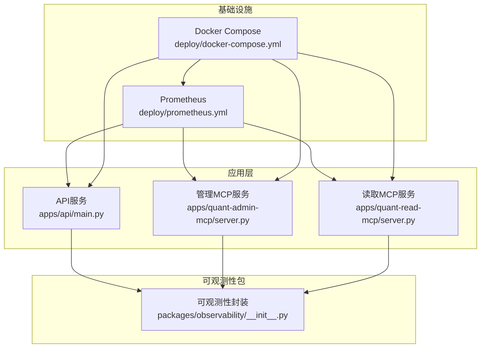
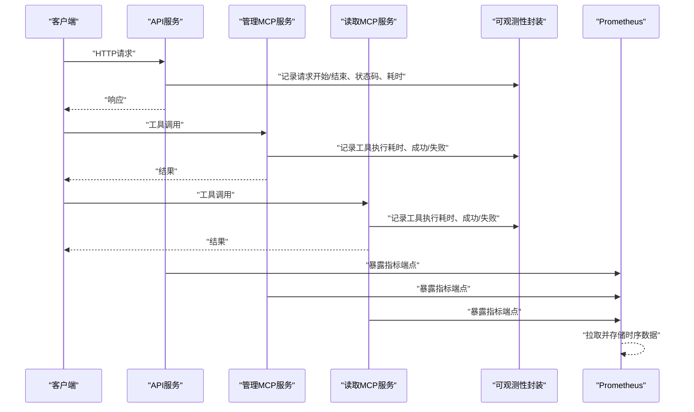
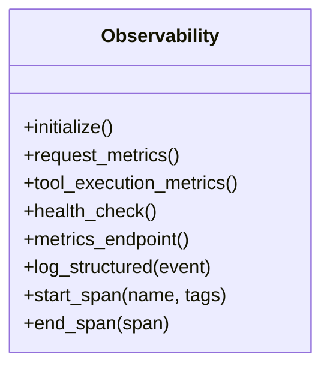
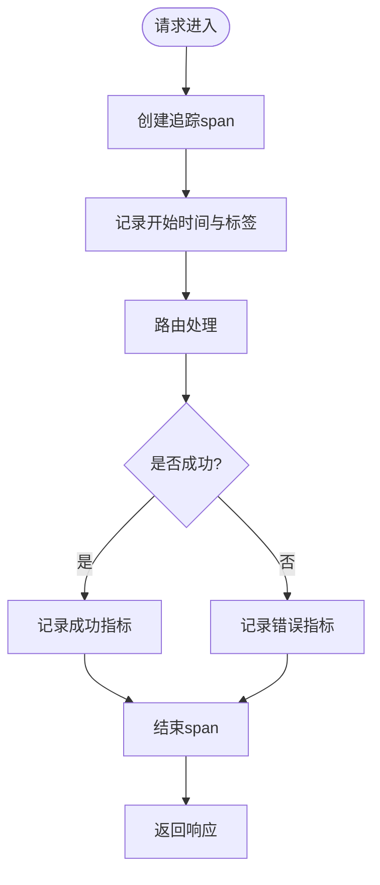
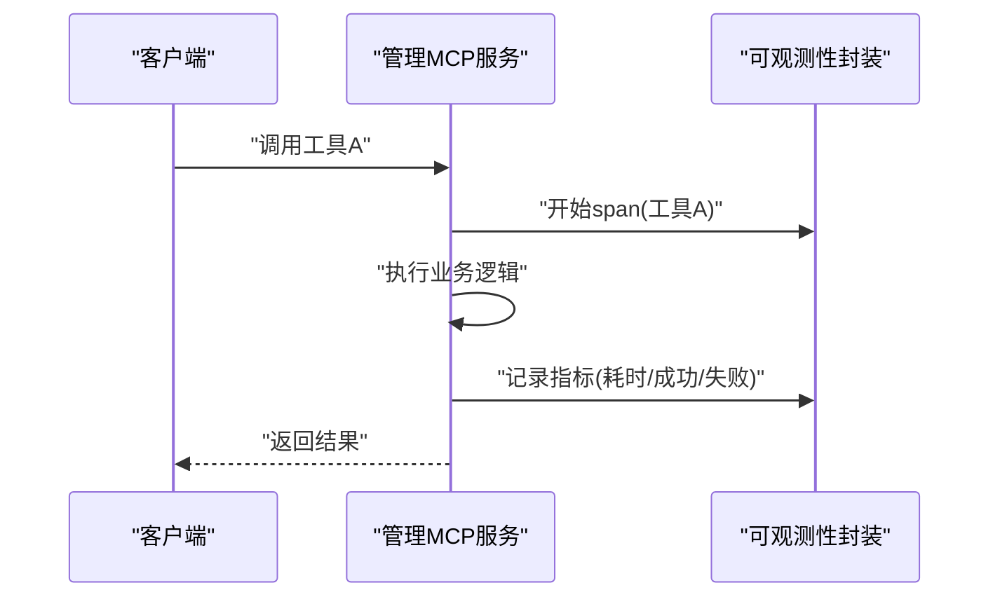
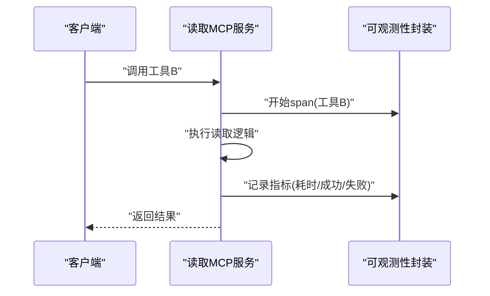
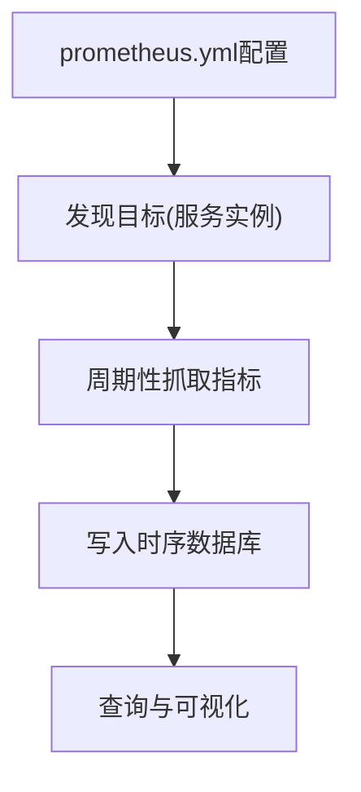
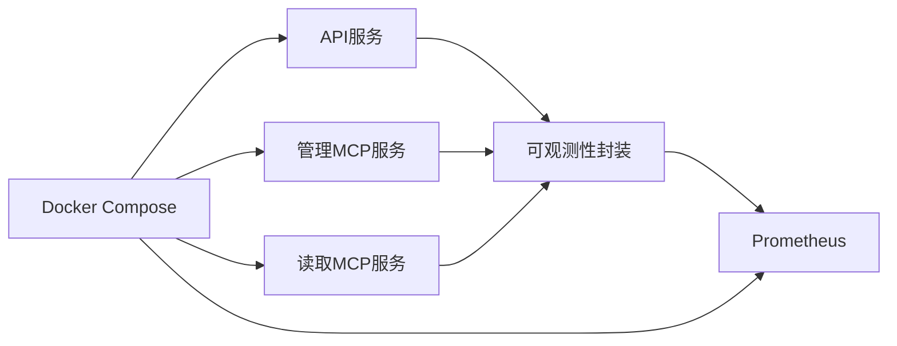

# 监控与可观测性

<cite>
**本文引用的文件**   
- [apps/api/main.py](file://apps/api/main.py)
- [apps/quant-admin-mcp/server.py](file://apps/quant-admin-mcp/server.py)
- [apps/quant-read-mcp/server.py](file://apps/quant-read-mcp/server.py)
- [packages/observability/__init__.py](file://packages/observability/__init__.py)
- [deploy/prometheus.yml](file://deploy/prometheus.yml)
- [deploy/docker-compose.yml](file://deploy/docker-compose.yml)
- [tests/unit/test_observability_metrics.py](file://tests/unit/test_observability_metrics.py)
</cite>

## 目录
1. [简介](#简介)
2. [项目结构](#项目结构)
3. [核心组件](#核心组件)
4. [架构总览](#架构总览)
5. [详细组件分析](#详细组件分析)
6. [依赖关系分析](#依赖关系分析)
7. [性能考虑](#性能考虑)
8. [故障排查指南](#故障排查指南)
9. [结论](#结论)
10. [附录](#附录)

## 简介
本文件面向量化交易MCP系统的监控与可观测性，覆盖指标收集设计、日志记录规范、告警规则配置、Prometheus集成、Grafana仪表板思路、分布式追踪实现、应用性能监控（APM）、业务指标采集、异常检测机制、外部系统集成与数据导出格式，以及部署、维护与排障要点。文档以仓库现有实现为基础，结合通用最佳实践给出可操作的指导。

## 项目结构
与监控和可观测性直接相关的代码与配置主要分布在以下位置：
- 应用入口与中间件：API服务、MCP服务端入口负责初始化可观测性能力并暴露健康检查端点
- 可观测性包：统一封装指标、日志、追踪等能力
- 部署配置：Prometheus抓取配置与容器编排
- 测试用例：验证指标导出与基本行为

图表来源
- [apps/api/main.py](file://apps/api/main.py)
- [apps/quant-admin-mcp/server.py](file://apps/quant-admin-mcp/server.py)
- [apps/quant-read-mcp/server.py](file://apps/quant-read-mcp/server.py)
- [packages/observability/__init__.py](file://packages/observability/__init__.py)
- [deploy/prometheus.yml](file://deploy/prometheus.yml)
- [deploy/docker-compose.yml](file://deploy/docker-compose.yml)

章节来源
- [apps/api/main.py](file://apps/api/main.py)
- [apps/quant-admin-mcp/server.py](file://apps/quant-admin-mcp/server.py)
- [apps/quant-read-mcp/server.py](file://apps/quant-read-mcp/server.py)
- [packages/observability/__init__.py](file://packages/observability/__init__.py)
- [deploy/prometheus.yml](file://deploy/prometheus.yml)
- [deploy/docker-compose.yml](file://deploy/docker-compose.yml)

## 核心组件
- 可观测性封装模块：提供统一的指标、日志、追踪接口，供各服务在启动时初始化并在关键路径埋点
- API服务：作为对外HTTP入口，需暴露健康检查与指标端点，并对请求进行耗时、错误率等指标采集
- MCP服务（管理与读取）：作为工具调用入口，需记录工具执行耗时、成功率、失败原因等指标
- Prometheus抓取配置：定义目标、标签、抓取间隔等
- Docker Compose编排：将应用与Prometheus等组件组合部署

章节来源
- [packages/observability/__init__.py](file://packages/observability/__init__.py)
- [apps/api/main.py](file://apps/api/main.py)
- [apps/quant-admin-mcp/server.py](file://apps/quant-admin-mcp/server.py)
- [apps/quant-read-mcp/server.py](file://apps/quant-read-mcp/server.py)
- [deploy/prometheus.yml](file://deploy/prometheus.yml)
- [deploy/docker-compose.yml](file://deploy/docker-compose.yml)

## 架构总览
下图展示了从请求进入、内部处理到指标导出与采集的整体流程。

图表来源
- [apps/api/main.py](file://apps/api/main.py)
- [apps/quant-admin-mcp/server.py](file://apps/quant-admin-mcp/server.py)
- [apps/quant-read-mcp/server.py](file://apps/quant-read-mcp/server.py)
- [packages/observability/__init__.py](file://packages/observability/__init__.py)
- [deploy/prometheus.yml](file://deploy/prometheus.yml)

## 详细组件分析

### 可观测性封装模块
职责
- 统一初始化指标、日志、追踪后端
- 提供装饰器或上下文管理器用于自动埋点（如请求耗时、错误计数）
- 暴露健康检查与指标导出端点

建议的指标类别
- 应用性能：请求延迟分布、QPS、错误率、GC停顿、内存占用、线程池使用率
- 业务指标：工具调用次数、成功率、失败分类、数据入库量、模型推理耗时
- 资源指标：CPU、内存、磁盘IO、网络IO

建议的日志规范
- 结构化JSON输出，包含时间戳、级别、服务名、实例ID、trace_id、span_id、消息体
- 敏感信息脱敏（密钥、PII）
- 按服务维度分文件/流输出，便于聚合

建议的追踪规范
- 跨进程传播trace_id/span_id
- 为关键路径创建span（HTTP入站、工具调用、数据库访问、外部API）
- 采样策略：生产环境采用动态采样，降低开销

图表来源
- [packages/observability/__init__.py](file://packages/observability/__init__.py)

章节来源
- [packages/observability/__init__.py](file://packages/observability/__init__.py)

### API服务
职责
- 启动HTTP服务，注册路由与健康检查端点
- 在请求生命周期中注入可观测性逻辑（计时、错误统计、链路追踪）
- 暴露指标端点供Prometheus抓取

关键埋点
- HTTP请求：方法、路径、状态码、耗时
- 路由级错误：异常类型、堆栈摘要
- 资源使用：每请求内存峰值、线程数变化

图表来源
- [apps/api/main.py](file://apps/api/main.py)

章节来源
- [apps/api/main.py](file://apps/api/main.py)

### 管理MCP服务
职责
- 提供管理相关工具调用（如任务调度、系统状态查询）
- 对每个工具执行进行计时与错误统计
- 暴露指标端点

关键埋点
- 工具名称、参数摘要（脱敏）、执行时长、成功/失败、失败原因分类
- 并发度与队列长度（如有）

图表来源
- [apps/quant-admin-mcp/server.py](file://apps/quant-admin-mcp/server.py)
- [packages/observability/__init__.py](file://packages/observability/__init__.py)

章节来源
- [apps/quant-admin-mcp/server.py](file://apps/quant-admin-mcp/server.py)
- [packages/observability/__init__.py](file://packages/observability/__init__.py)

### 读取MCP服务
职责
- 提供数据读取相关工具调用（如行情、基本面、组合快照）
- 对每次读取进行计时与错误统计
- 暴露指标端点

关键埋点
- 数据源名称、查询键、返回行数、缓存命中/未命中、延迟分布
- 下游依赖错误分类（超时、连接失败、权限拒绝）

图表来源
- [apps/quant-read-mcp/server.py](file://apps/quant-read-mcp/server.py)
- [packages/observability/__init__.py](file://packages/observability/__init__.py)

章节来源
- [apps/quant-read-mcp/server.py](file://apps/quant-read-mcp/server.py)
- [packages/observability/__init__.py](file://packages/observability/__init__.py)

### Prometheus集成
职责
- 定义抓取目标、标签、抓取间隔
- 确保各服务暴露标准指标端点
- 支持多实例与高可用部署

建议配置项
- scrape_interval：根据业务吞吐调整（例如10s~30s）
- metrics_path：默认/metrics
- labels：添加服务名、环境、实例标识
- honor_labels：避免覆盖上游标签

图表来源
- [deploy/prometheus.yml](file://deploy/prometheus.yml)

章节来源
- [deploy/prometheus.yml](file://deploy/prometheus.yml)

### Docker Compose编排
职责
- 将API、MCP服务与Prometheus组合部署
- 管理网络、端口映射、环境变量
- 提供一键拉起与停止

建议编排要点
- 为每个服务设置独立容器与网络
- 通过环境变量注入可观测性后端地址
- 为Prometheus挂载持久卷保存时序数据

章节来源
- [deploy/docker-compose.yml](file://deploy/docker-compose.yml)

### 测试与验证
- 单元测试覆盖指标导出与基本行为，确保在CI中持续验证可观测性能力

章节来源
- [tests/unit/test_observability_metrics.py](file://tests/unit/test_observability_metrics.py)

## 依赖关系分析
- 服务间耦合：API与MCP服务均依赖可观测性封装模块，形成松耦合的可插拔式埋点
- 外部依赖：Prometheus通过HTTP抓取指标；可选地对接Grafana进行可视化
- 部署依赖：Docker Compose协调容器生命周期与网络

图表来源
- [apps/api/main.py](file://apps/api/main.py)
- [apps/quant-admin-mcp/server.py](file://apps/quant-admin-mcp/server.py)
- [apps/quant-read-mcp/server.py](file://apps/quant-read-mcp/server.py)
- [packages/observability/__init__.py](file://packages/observability/__init__.py)
- [deploy/prometheus.yml](file://deploy/prometheus.yml)
- [deploy/docker-compose.yml](file://deploy/docker-compose.yml)

章节来源
- [apps/api/main.py](file://apps/api/main.py)
- [apps/quant-admin-mcp/server.py](file://apps/quant-admin-mcp/server.py)
- [apps/quant-read-mcp/server.py](file://apps/quant-read-mcp/server.py)
- [packages/observability/__init__.py](file://packages/observability/__init__.py)
- [deploy/prometheus.yml](file://deploy/prometheus.yml)
- [deploy/docker-compose.yml](file://deploy/docker-compose.yml)

## 性能考虑
- 指标粒度与基数控制：避免高基数字段（如用户ID、随机字符串）作为标签，防止时序爆炸
- 采样与降采样：对高频指标采用滑动窗口或预聚合，减少存储压力
- 异步导出：指标上报采用批量与异步队列，避免阻塞主流程
- 追踪采样：生产环境启用动态采样，仅保留关键路径的完整链路
- 资源隔离：为可观测性组件分配独立资源，避免影响业务性能

## 故障排查指南
常见问题与定位步骤
- 指标缺失
  - 检查服务是否暴露指标端点且可达
  - 确认Prometheus抓取配置正确（目标、端口、路径、标签）
  - 查看服务日志中的初始化与埋点错误
- 指标延迟或丢失
  - 检查网络连通性与防火墙策略
  - 评估抓取间隔与指标体积，必要时调整scrape_interval
  - 观察Prometheus存储盘空间与写入延迟
- 追踪不完整
  - 确认trace_id在各服务间正确传播
  - 检查采样策略是否过严导致链路被丢弃
  - 校验span命名与标签一致性，便于检索
- 日志不可用
  - 检查日志输出格式是否为结构化JSON
  - 确认日志聚合系统（如ELK/Loki）接入正常
  - 核对敏感字段是否被脱敏导致无法关联问题

快速自检清单
- 健康检查端点返回正常
- /metrics端点可访问且包含预期指标
- Prometheus目标状态为UP
- Grafana面板能展示最新数据
- 关键业务事件在日志中可检索

章节来源
- [deploy/prometheus.yml](file://deploy/prometheus.yml)
- [deploy/docker-compose.yml](file://deploy/docker-compose.yml)
- [tests/unit/test_observability_metrics.py](file://tests/unit/test_observability_metrics.py)

## 结论
通过在API与MCP服务中统一引入可观测性封装，配合Prometheus抓取与Grafana可视化，可实现端到端的监控与可观测性体系。建议在开发阶段即纳入指标与日志规范，并通过自动化测试保障稳定性。生产环境应关注指标基数、采样策略与资源隔离，确保系统在大规模下仍具备高可用与可诊断性。

## 附录

### 指标收集设计（示例清单）
- 应用性能
  - 请求总数、成功数、失败数、延迟分位数、错误率
  - 资源使用：CPU、内存、GC停顿、线程池活跃数
- 业务指标
  - 工具调用次数、成功率、失败分类、数据入库量、模型推理耗时
- 资源与基础设施
  - 磁盘IO、网络IO、连接池使用率、队列长度

### 日志记录规范（要点）
- 结构化JSON，包含时间戳、级别、服务名、实例ID、trace_id、span_id、消息体
- 敏感信息脱敏，统一字段命名
- 按服务维度输出，便于聚合与检索

### 告警规则配置（示例说明）
- 可用性类
  - 服务指标端点不可达超过阈值
  - 健康检查失败持续N分钟
- 性能类
  - P99延迟超过阈值
  - QPS突降或突增超出范围
- 错误类
  - 错误率超过阈值
  - 特定失败分类占比过高
- 资源类
  - 内存使用率超过阈值
  - 磁盘空间不足

### 分布式追踪实现（要点）
- 跨进程传播trace_id/span_id
- 关键路径创建span（HTTP入站、工具调用、数据库访问、外部API）
- 采样策略：生产环境动态采样，降低开销

### 与外部监控系统集成与数据导出
- Prometheus：通过HTTP抓取指标，支持多实例与高可用
- Grafana：基于PromQL构建仪表板，支持告警与通知
- 日志聚合：将结构化日志推送至ELK/Loki等平台
- 导出格式：遵循OpenMetrics/Prometheus文本格式

### 部署与维护
- 使用Docker Compose编排服务与Prometheus
- 为Prometheus挂载持久卷保存时序数据
- 定期备份与清理历史数据，避免磁盘爆满
- 灰度发布与回滚策略中纳入可观测性验证