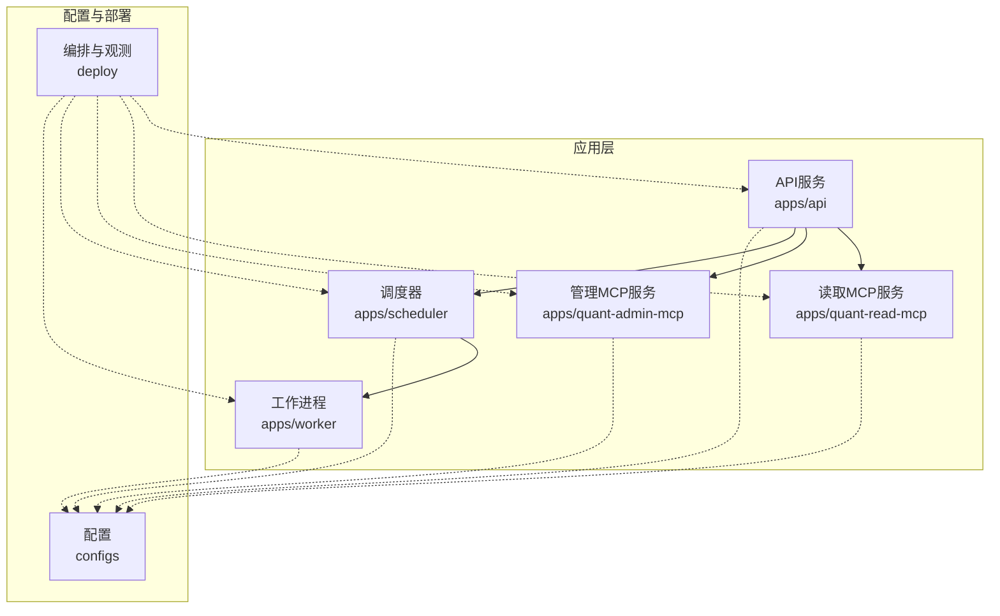
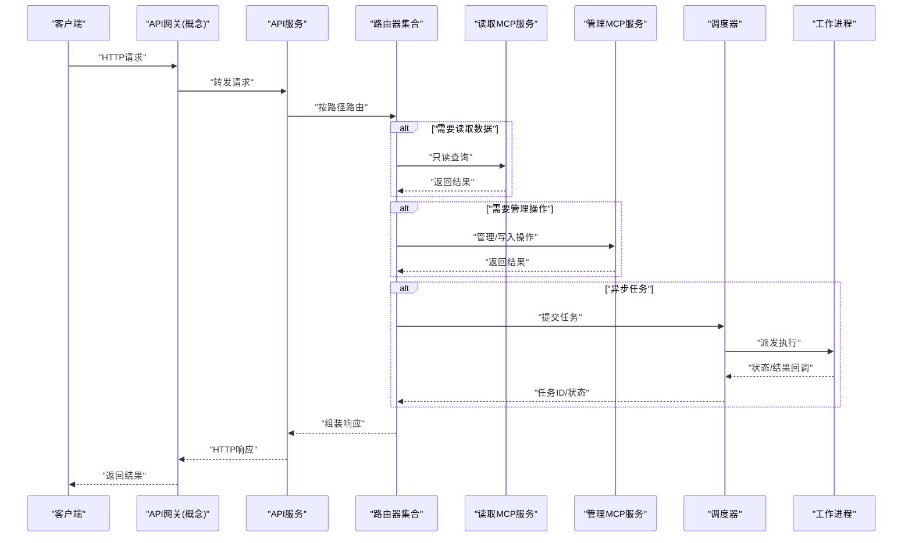
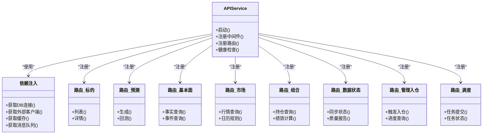
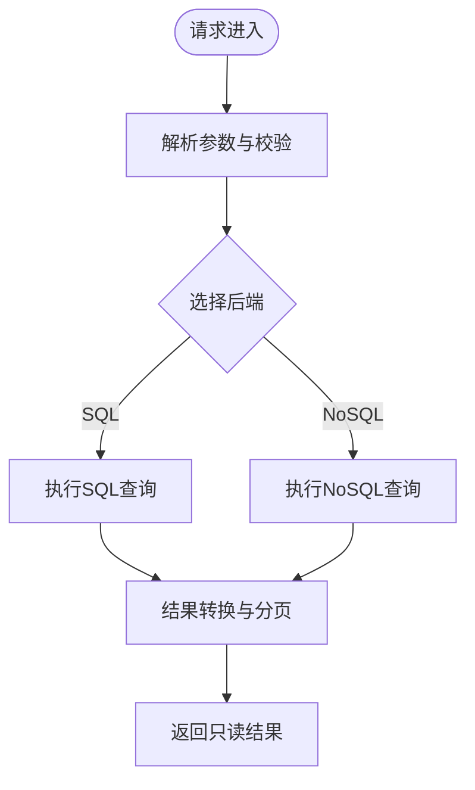
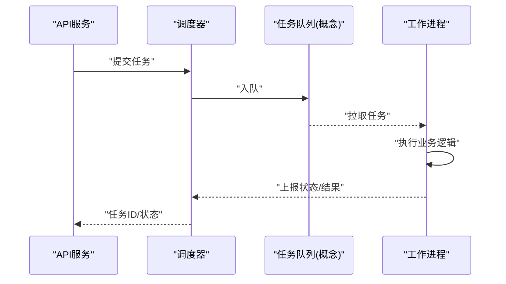
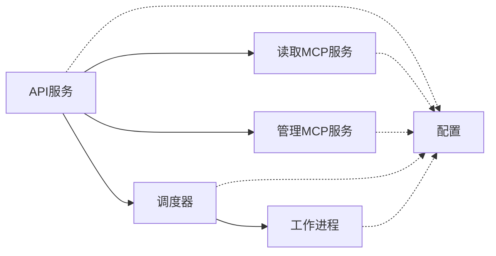
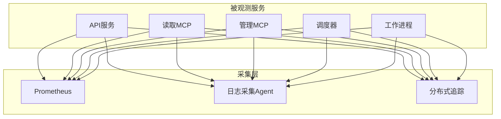

# 微服务架构

<cite>
**本文引用的文件**   
- [apps/api/main.py](file://apps/api/main.py)
- [apps/api/deps.py](file://apps/api/deps.py)
- [apps/api/routers/instruments.py](file://apps/api/routers/instruments.py)
- [apps/api/routers/forecast.py](file://apps/api/routers/forecast.py)
- [apps/api/routers/fundamentals.py](file://apps/api/routers/fundamentals.py)
- [apps/api/routers/markets.py](file://apps/api/routers/markets.py)
- [apps/api/routers/portfolio.py](file://apps/api/routers/portfolio.py)
- [apps/api/routers/data_status.py](file://apps/api/routers/data_status.py)
- [apps/api/routers/admin_ingestion.py](file://apps/api/routers/admin_ingestion.py)
- [apps/api/routers/scheduler.py](file://apps/api/routers/scheduler.py)
- [apps/quant-read-mcp/server.py](file://apps/quant-read-mcp/server.py)
- [apps/quant-read-mcp/db_backends.py](file://apps/quant-read-mcp/db_backends.py)
- [apps/quant-admin-mcp/server.py](file://apps/quant-admin-mcp/server.py)
- [apps/scheduler/executor.py](file://apps/scheduler/executor.py)
- [apps/scheduler/schedule.py](file://apps/scheduler/schedule.py)
- [apps/worker/main.py](file://apps/worker/main.py)
- [apps/worker/tasks.py](file://apps/worker/tasks.py)
- [configs/base.yaml](file://configs/base.yaml)
- [configs/dev.yaml](file://configs/dev.yaml)
- [deploy/docker-compose.yml](file://deploy/docker-compose.yml)
- [deploy/prometheus.yml](file://deploy/prometheus.yml)
</cite>

## 目录
1. [简介](#简介)
2. [项目结构](#项目结构)
3. [核心组件](#核心组件)
4. [架构总览](#架构总览)
5. [详细组件分析](#详细组件分析)
6. [依赖关系分析](#依赖关系分析)
7. [性能与弹性](#性能与弹性)
8. [监控与日志](#监控与日志)
9. [故障排查指南](#故障排查指南)
10. [结论](#结论)

## 简介
本文件面向量化交易MCP系统的微服务化设计与落地，围绕以下目标展开：
- 服务拆分原则、边界定义与职责划分
- 服务间通信协议与接口契约
- API网关的路由与负载均衡策略（概念性说明）
- 服务发现与配置管理方案
- 部署拓扑与资源分配策略
- 服务依赖关系图与网络通信图
- 监控指标与日志收集方案
- 扩缩容策略与弹性设计

## 项目结构
仓库采用“应用+包”的模块化组织方式。应用层位于 apps 下，包含API服务、MCP读写服务、调度器与任务执行器；可复用能力以 packages 下的领域包形式提供；配置集中于 configs；部署编排与观测在 deploy 中。

图表来源
- [apps/api/main.py:1-200](file://apps/api/main.py#L1-L200)
- [apps/quant-read-mcp/server.py:1-200](file://apps/quant-read-mcp/server.py#L1-L200)
- [apps/quant-admin-mcp/server.py:1-200](file://apps/quant-admin-mcp/server.py#L1-L200)
- [apps/scheduler/executor.py:1-200](file://apps/scheduler/executor.py#L1-L200)
- [apps/worker/main.py:1-200](file://apps/worker/main.py#L1-L200)
- [configs/base.yaml:1-200](file://configs/base.yaml#L1-L200)
- [deploy/docker-compose.yml:1-200](file://deploy/docker-compose.yml#L1-L200)
- [deploy/prometheus.yml:1-200](file://deploy/prometheus.yml#L1-L200)

章节来源
- [apps/api/main.py:1-200](file://apps/api/main.py#L1-L200)
- [apps/quant-read-mcp/server.py:1-200](file://apps/quant-read-mcp/server.py#L1-L200)
- [apps/quant-admin-mcp/server.py:1-200](file://apps/quant-admin-mcp/server.py#L1-L200)
- [apps/scheduler/executor.py:1-200](file://apps/scheduler/executor.py#L1-L200)
- [apps/worker/main.py:1-200](file://apps/worker/main.py#L1-L200)
- [configs/base.yaml:1-200](file://configs/base.yaml#L1-L200)
- [deploy/docker-compose.yml:1-200](file://deploy/docker-compose.yml#L1-L200)
- [deploy/prometheus.yml:1-200](file://deploy/prometheus.yml#L1-L200)

## 核心组件
- API服务：对外暴露REST接口，聚合业务路由，负责鉴权、限流、请求校验与响应封装。
- 读取MCP服务：提供只读数据访问能力，适配多种后端存储，供查询与分析场景使用。
- 管理MCP服务：提供管理与运维工具能力，用于系统配置、数据治理与审计等。
- 调度器：负责任务编排、周期触发与执行协调。
- 工作进程：执行具体批处理或长耗时任务，支持水平扩展。

章节来源
- [apps/api/main.py:1-200](file://apps/api/main.py#L1-L200)
- [apps/quant-read-mcp/server.py:1-200](file://apps/quant-read-mcp/server.py#L1-L200)
- [apps/quant-admin-mcp/server.py:1-200](file://apps/quant-admin-mcp/server.py#L1-L200)
- [apps/scheduler/executor.py:1-200](file://apps/scheduler/executor.py#L1-L200)
- [apps/worker/main.py:1-200](file://apps/worker/main.py#L1-L200)

## 架构总览
下图展示典型请求链路：客户端通过API网关进入API服务，API服务根据路径分发到各路由器，必要时调用读取MCP与管理MCP服务，并触发调度与工作进程完成异步任务。

图表来源
- [apps/api/main.py:1-200](file://apps/api/main.py#L1-L200)
- [apps/api/routers/instruments.py:1-200](file://apps/api/routers/instruments.py#L1-L200)
- [apps/api/routers/forecast.py:1-200](file://apps/api/routers/forecast.py#L1-L200)
- [apps/api/routers/fundamentals.py:1-200](file://apps/api/routers/fundamentals.py#L1-L200)
- [apps/api/routers/markets.py:1-200](file://apps/api/routers/markets.py#L1-L200)
- [apps/api/routers/portfolio.py:1-200](file://apps/api/routers/portfolio.py#L1-L200)
- [apps/api/routers/data_status.py:1-200](file://apps/api/routers/data_status.py#L1-L200)
- [apps/api/routers/admin_ingestion.py:1-200](file://apps/api/routers/admin_ingestion.py#L1-L200)
- [apps/api/routers/scheduler.py:1-200](file://apps/api/routers/scheduler.py#L1-L200)
- [apps/quant-read-mcp/server.py:1-200](file://apps/quant-read-mcp/server.py#L1-L200)
- [apps/quant-admin-mcp/server.py:1-200](file://apps/quant-admin-mcp/server.py#L1-L200)
- [apps/scheduler/executor.py:1-200](file://apps/scheduler/executor.py#L1-L200)
- [apps/worker/main.py:1-200](file://apps/worker/main.py#L1-L200)

## 详细组件分析

### API服务与路由
- 入口与中间件：统一初始化应用生命周期、注册路由、挂载健康检查与错误处理。
- 依赖注入：集中管理数据库连接、外部服务客户端、缓存与消息队列等共享资源。
- 路由模块：按领域拆分为标的、预测、基本面、市场、组合、数据状态、管理入仓与调度等。

图表来源
- [apps/api/main.py:1-200](file://apps/api/main.py#L1-L200)
- [apps/api/deps.py:1-200](file://apps/api/deps.py#L1-L200)
- [apps/api/routers/instruments.py:1-200](file://apps/api/routers/instruments.py#L1-L200)
- [apps/api/routers/forecast.py:1-200](file://apps/api/routers/forecast.py#L1-L200)
- [apps/api/routers/fundamentals.py:1-200](file://apps/api/routers/fundamentals.py#L1-L200)
- [apps/api/routers/markets.py:1-200](file://apps/api/routers/markets.py#L1-L200)
- [apps/api/routers/portfolio.py:1-200](file://apps/api/routers/portfolio.py#L1-L200)
- [apps/api/routers/data_status.py:1-200](file://apps/api/routers/data_status.py#L1-L200)
- [apps/api/routers/admin_ingestion.py:1-200](file://apps/api/routers/admin_ingestion.py#L1-L200)
- [apps/api/routers/scheduler.py:1-200](file://apps/api/routers/scheduler.py#L1-L200)

章节来源
- [apps/api/main.py:1-200](file://apps/api/main.py#L1-L200)
- [apps/api/deps.py:1-200](file://apps/api/deps.py#L1-L200)
- [apps/api/routers/instruments.py:1-200](file://apps/api/routers/instruments.py#L1-L200)
- [apps/api/routers/forecast.py:1-200](file://apps/api/routers/forecast.py#L1-L200)
- [apps/api/routers/fundamentals.py:1-200](file://apps/api/routers/fundamentals.py#L1-L200)
- [apps/api/routers/markets.py:1-200](file://apps/api/routers/markets.py#L1-L200)
- [apps/api/routers/portfolio.py:1-200](file://apps/api/routers/portfolio.py#L1-L200)
- [apps/api/routers/data_status.py:1-200](file://apps/api/routers/data_status.py#L1-L200)
- [apps/api/routers/admin_ingestion.py:1-200](file://apps/api/routers/admin_ingestion.py#L1-L200)
- [apps/api/routers/scheduler.py:1-200](file://apps/api/routers/scheduler.py#L1-L200)

### 读取MCP服务
- 职责：提供只读数据访问，屏蔽底层存储差异，为查询类场景提供高性能接口。
- 后端适配：通过后端抽象层对接不同数据库或对象存储，便于替换与扩展。

图表来源
- [apps/quant-read-mcp/server.py:1-200](file://apps/quant-read-mcp/server.py#L1-L200)
- [apps/quant-read-mcp/db_backends.py:1-200](file://apps/quant-read-mcp/db_backends.py#L1-L200)

章节来源
- [apps/quant-read-mcp/server.py:1-200](file://apps/quant-read-mcp/server.py#L1-L200)
- [apps/quant-read-mcp/db_backends.py:1-200](file://apps/quant-read-mcp/db_backends.py#L1-L200)

### 管理MCP服务
- 职责：提供系统管理、数据治理、审计与配置变更等能力。
- 安全：建议结合鉴权与审计日志，确保敏感操作的合规性与可追溯性。

章节来源
- [apps/quant-admin-mcp/server.py:1-200](file://apps/quant-admin-mcp/server.py#L1-L200)

### 调度器与工作进程
- 调度器：维护任务计划、触发执行、重试与补偿逻辑。
- 工作进程：消费任务队列，执行批处理、模型训练、数据入仓等耗时任务。

图表来源
- [apps/scheduler/executor.py:1-200](file://apps/scheduler/executor.py#L1-L200)
- [apps/scheduler/schedule.py:1-200](file://apps/scheduler/schedule.py#L1-L200)
- [apps/worker/main.py:1-200](file://apps/worker/main.py#L1-L200)
- [apps/worker/tasks.py:1-200](file://apps/worker/tasks.py#L1-L200)

章节来源
- [apps/scheduler/executor.py:1-200](file://apps/scheduler/executor.py#L1-L200)
- [apps/scheduler/schedule.py:1-200](file://apps/scheduler/schedule.py#L1-L200)
- [apps/worker/main.py:1-200](file://apps/worker/main.py#L1-L200)
- [apps/worker/tasks.py:1-200](file://apps/worker/tasks.py#L1-L200)

## 依赖关系分析
- API服务依赖读取MCP与管理MCP进行数据访问与管理操作。
- 调度器与工作进程构成异步执行链，API服务通过调度器间接驱动工作进程。
- 所有服务均从配置中心加载运行时参数，并通过部署编排进行容器化运行。

图表来源
- [apps/api/main.py:1-200](file://apps/api/main.py#L1-L200)
- [apps/quant-read-mcp/server.py:1-200](file://apps/quant-read-mcp/server.py#L1-L200)
- [apps/quant-admin-mcp/server.py:1-200](file://apps/quant-admin-mcp/server.py#L1-L200)
- [apps/scheduler/executor.py:1-200](file://apps/scheduler/executor.py#L1-L200)
- [apps/worker/main.py:1-200](file://apps/worker/main.py#L1-L200)
- [configs/base.yaml:1-200](file://configs/base.yaml#L1-L200)

章节来源
- [apps/api/main.py:1-200](file://apps/api/main.py#L1-L200)
- [apps/quant-read-mcp/server.py:1-200](file://apps/quant-read-mcp/server.py#L1-L200)
- [apps/quant-admin-mcp/server.py:1-200](file://apps/quant-admin-mcp/server.py#L1-L200)
- [apps/scheduler/executor.py:1-200](file://apps/scheduler/executor.py#L1-L200)
- [apps/worker/main.py:1-200](file://apps/worker/main.py#L1-L200)
- [configs/base.yaml:1-200](file://configs/base.yaml#L1-L200)

## 性能与弹性
- 服务拆分原则
  - 高内聚低耦合：按领域边界拆分，避免跨域强依赖。
  - 读写分离：读取MCP专注只读查询，管理MCP专注写与管理。
  - 异步优先：将耗时任务下沉至调度器与工作进程，提升API响应时延。
- 负载均衡策略（概念）
  - 网关层基于轮询或最少连接数分发，结合健康检查剔除异常实例。
  - 对CPU密集型工作进程采用亲和性调度，减少上下文切换。
- 服务发现与配置管理（概念）
  - 服务发现：通过DNS或服务网格实现动态注册与注销。
  - 配置管理：分层配置（基础+环境），热更新与灰度发布结合。
- 扩缩容策略
  - 水平扩展：无状态API与服务实例按需扩容；有状态组件（如数据库）通过主从与分片。
  - 弹性伸缩：基于CPU/内存/队列深度等指标触发自动扩缩容。
- 资源分配策略
  - CPU/内存配额与限制，预留缓冲应对突发流量。
  - I/O密集型服务提高磁盘IOPS与网络带宽配额。

[本节为通用指导，不直接分析具体文件]

## 监控与日志
- 监控指标
  - 服务可用性：存活探针、就绪探针、错误率、延迟分位。
  - 业务指标：任务成功率、入仓增量、预测命中率、组合风险敞口。
  - 基础设施：CPU/内存/磁盘/网络、数据库连接池、消息队列积压。
- 日志收集
  - 结构化JSON日志，统一字段（trace_id、service、level、msg）。
  - 采集到集中式日志平台，配合告警规则与检索索引。
- 观测配置
  - Prometheus抓取端点与自定义指标导出。
  - 分布式追踪贯穿API→MCP→调度→工作进程全链路。

图表来源
- [deploy/prometheus.yml:1-200](file://deploy/prometheus.yml#L1-L200)

章节来源
- [deploy/prometheus.yml:1-200](file://deploy/prometheus.yml#L1-L200)

## 故障排查指南
- 常见问题定位
  - 接口超时：检查下游MCP服务健康与负载，确认连接池与超时配置。
  - 任务失败：查看工作进程日志与重试次数，核对任务幂等与补偿逻辑。
  - 数据不一致：对比入仓前后快照，核查数据质量与血缘信息。
- 诊断手段
  - 健康检查与就绪探针：快速识别不可用实例。
  - 指标看板：关注错误率、P99延迟、队列积压与资源水位。
  - 日志检索：基于trace_id串联全链路日志。
- 恢复策略
  - 自动重启与熔断降级，隔离故障域。
  - 滚动升级与灰度发布，降低变更风险。

[本节为通用指导，不直接分析具体文件]

## 结论
通过将API、MCP读写、调度与工作进程解耦，系统实现了清晰的边界与良好的可扩展性。结合统一的配置与观测体系，可在保障稳定性的同时快速迭代与弹性伸缩。建议在后续演进中完善服务发现、配置中心与分布式追踪的集成，进一步提升整体可观测性与运维效率。