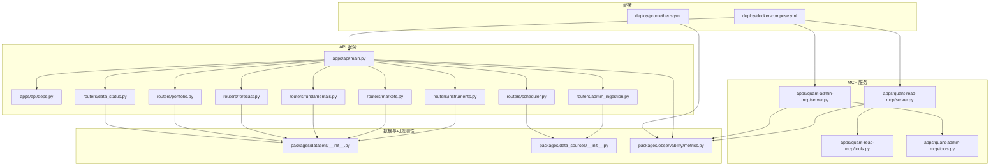
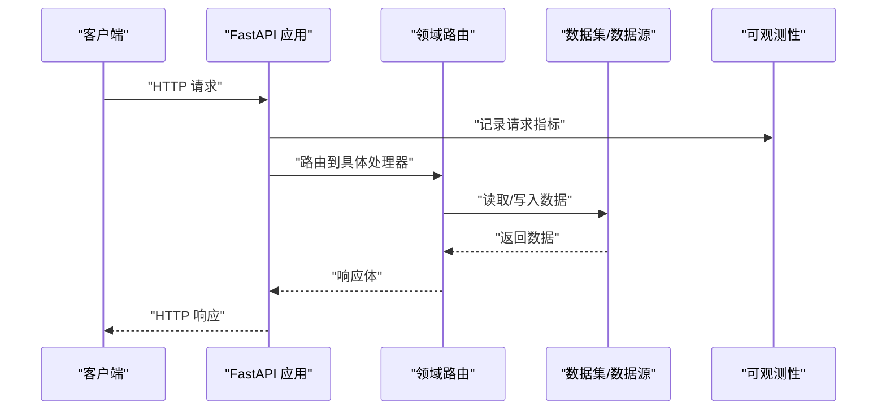
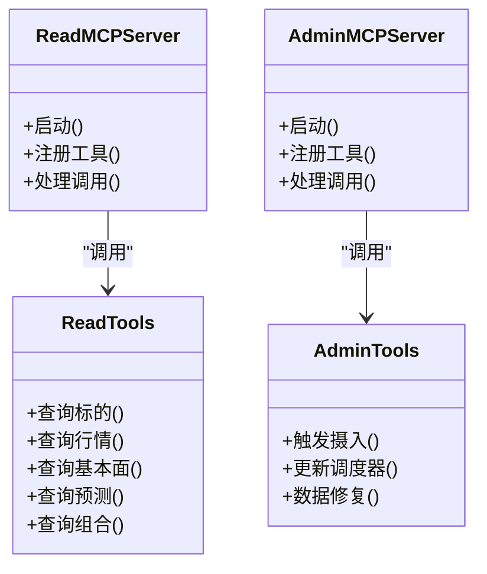
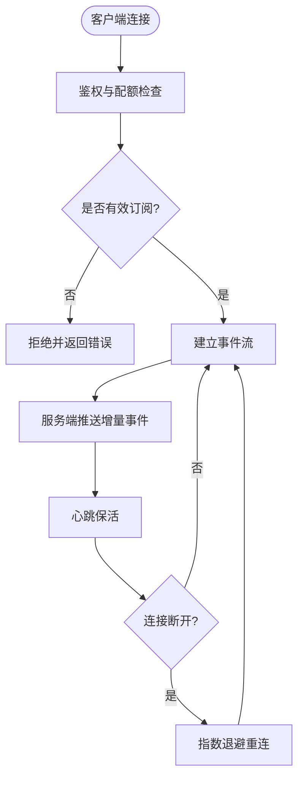
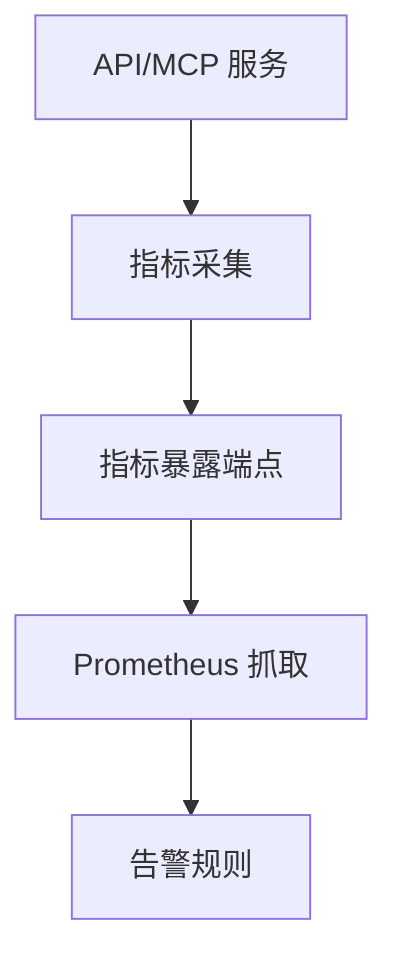
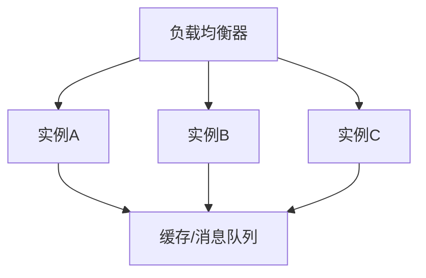
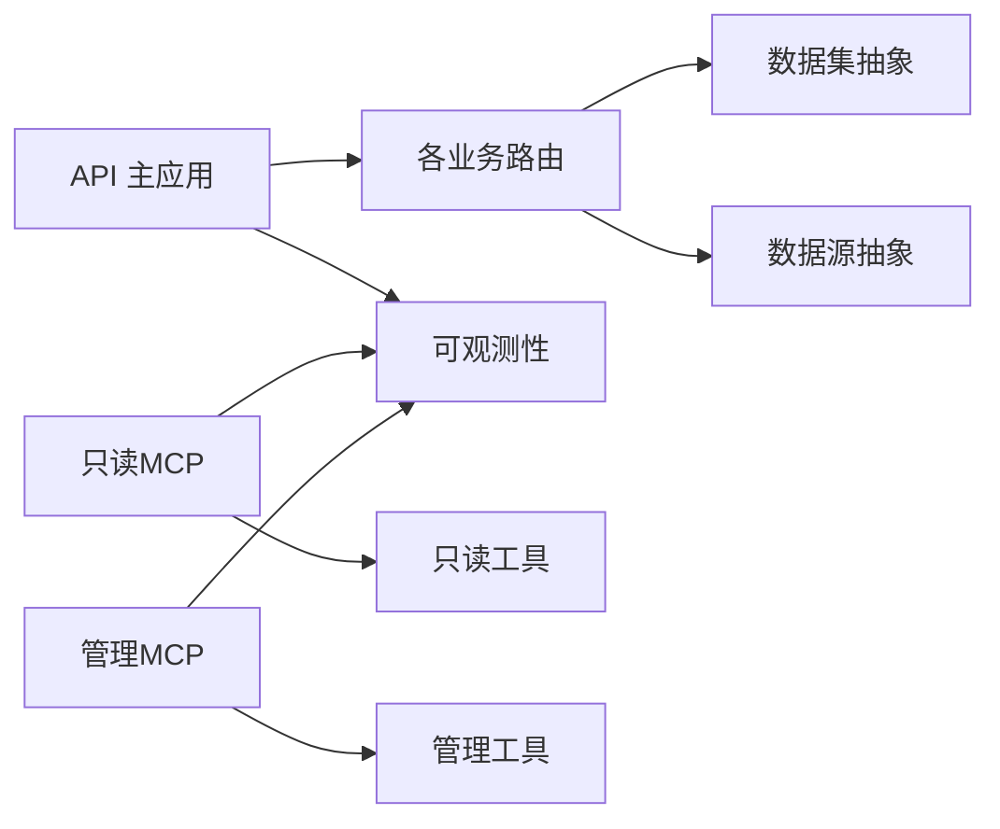

# 数据分发服务

<cite>
**本文引用的文件**   
- [apps/api/main.py](file://apps/api/main.py)
- [apps/api/deps.py](file://apps/api/deps.py)
- [apps/api/routers/instruments.py](file://apps/api/routers/instruments.py)
- [apps/api/routers/markets.py](file://apps/api/routers/markets.py)
- [apps/api/routers/fundamentals.py](file://apps/api/routers/fundamentals.py)
- [apps/api/routers/forecast.py](file://apps/api/routers/forecast.py)
- [apps/api/routers/portfolio.py](file://apps/api/routers/portfolio.py)
- [apps/api/routers/data_status.py](file://apps/api/routers/data_status.py)
- [apps/api/routers/admin_ingestion.py](file://apps/api/routers/admin_ingestion.py)
- [apps/api/routers/scheduler.py](file://apps/api/routers/scheduler.py)
- [apps/quant-read-mcp/server.py](file://apps/quant-read-mcp/server.py)
- [apps/quant-read-mcp/tools.py](file://apps/quant-read-mcp/tools.py)
- [apps/quant-admin-mcp/server.py](file://apps/quant-admin-mcp/server.py)
- [apps/quant-admin-mcp/tools.py](file://apps/quant-admin-mcp/tools.py)
- [packages/datasets/__init__.py](file://packages/datasets/__init__.py)
- [packages/data_sources/__init__.py](file://packages/data_sources/__init__.py)
- [packages/observability/metrics.py](file://packages/observability/metrics.py)
- [deploy/docker-compose.yml](file://deploy/docker-compose.yml)
- [deploy/prometheus.yml](file://deploy/prometheus.yml)
</cite>

## 目录
1. [简介](#简介)
2. [项目结构](#项目结构)
3. [核心组件](#核心组件)
4. [架构总览](#架构总览)
5. [详细组件分析](#详细组件分析)
6. [依赖关系分析](#依赖关系分析)
7. [性能与扩展性](#性能与扩展性)
8. [监控与告警](#监控与告警)
9. [故障排查指南](#故障排查指南)
10. [结论](#结论)
11. [附录：API 参考与最佳实践](#附录api-参考与最佳实践)

## 简介
本文件面向量化交易MCP系统的数据分发服务，聚焦以下目标：
- RESTful API 与 MCP 协议的数据访问接口设计说明
- 实时数据推送与订阅机制（含建议方案）
- 数据缓存策略与CDN集成方案
- API 限流、认证与授权机制
- 数据版本控制与向后兼容性管理
- 客户端SDK使用指南与最佳实践
- 监控指标收集与告警配置
- 负载均衡与水平扩展方案

## 项目结构
数据分发服务由 FastAPI 应用、多个业务路由、MCP 读写服务器以及可观测性与部署配置组成。整体采用分层组织：
- 应用入口与依赖注入
- 按领域划分的REST路由
- MCP 工具与服务端实现
- 可观测性指标与部署编排

图表来源
- [apps/api/main.py](file://apps/api/main.py)
- [apps/api/deps.py](file://apps/api/deps.py)
- [apps/api/routers/instruments.py](file://apps/api/routers/instruments.py)
- [apps/api/routers/markets.py](file://apps/api/routers/markets.py)
- [apps/api/routers/fundamentals.py](file://apps/api/routers/fundamentals.py)
- [apps/api/routers/forecast.py](file://apps/api/routers/forecast.py)
- [apps/api/routers/portfolio.py](file://apps/api/routers/portfolio.py)
- [apps/api/routers/data_status.py](file://apps/api/routers/data_status.py)
- [apps/api/routers/admin_ingestion.py](file://apps/api/routers/admin_ingestion.py)
- [apps/api/routers/scheduler.py](file://apps/api/routers/scheduler.py)
- [apps/quant-read-mcp/server.py](file://apps/quant-read-mcp/server.py)
- [apps/quant-read-mcp/tools.py](file://apps/quant-read-mcp/tools.py)
- [apps/quant-admin-mcp/server.py](file://apps/quant-admin-mcp/server.py)
- [apps/quant-admin-mcp/tools.py](file://apps/quant-admin-mcp/tools.py)
- [packages/datasets/__init__.py](file://packages/datasets/__init__.py)
- [packages/data_sources/__init__.py](file://packages/data_sources/__init__.py)
- [packages/observability/metrics.py](file://packages/observability/metrics.py)
- [deploy/docker-compose.yml](file://deploy/docker-compose.yml)
- [deploy/prometheus.yml](file://deploy/prometheus.yml)

章节来源
- [apps/api/main.py](file://apps/api/main.py)
- [apps/api/deps.py](file://apps/api/deps.py)
- [apps/api/routers/instruments.py](file://apps/api/routers/instruments.py)
- [apps/api/routers/markets.py](file://apps/api/routers/markets.py)
- [apps/api/routers/fundamentals.py](file://apps/api/routers/fundamentals.py)
- [apps/api/routers/forecast.py](file://apps/api/routers/forecast.py)
- [apps/api/routers/portfolio.py](file://apps/api/routers/portfolio.py)
- [apps/api/routers/data_status.py](file://apps/api/routers/data_status.py)
- [apps/api/routers/admin_ingestion.py](file://apps/api/routers/admin_ingestion.py)
- [apps/api/routers/scheduler.py](file://apps/api/routers/scheduler.py)
- [apps/quant-read-mcp/server.py](file://apps/quant-read-mcp/server.py)
- [apps/quant-read-mcp/tools.py](file://apps/quant-read-mcp/tools.py)
- [apps/quant-admin-mcp/server.py](file://apps/quant-admin-mcp/server.py)
- [apps/quant-admin-mcp/tools.py](file://apps/quant-admin-mcp/tools.py)
- [packages/datasets/__init__.py](file://packages/datasets/__init__.py)
- [packages/data_sources/__init__.py](file://packages/data_sources/__init__.py)
- [packages/observability/metrics.py](file://packages/observability/metrics.py)
- [deploy/docker-compose.yml](file://deploy/docker-compose.yml)
- [deploy/prometheus.yml](file://deploy/prometheus.yml)

## 核心组件
- API 主应用与依赖注入
  - 负责注册路由、中间件、生命周期钩子与全局依赖解析。
  - 提供统一的错误处理、请求上下文与资源清理。
- 领域路由
  - instruments：标的维度查询与元数据
  - markets：行情与K线等市场数据
  - fundamentals：基本面事实与快照
  - forecast：预测与评分结果
  - portfolio：组合相关数据
  - data_status：数据健康状态与就绪检查
  - admin_ingestion：数据接入与管理操作
  - scheduler：调度任务管理与触发
- MCP 服务
  - quant-read-mcp：只读数据访问工具集
  - quant-admin-mcp：管理与写入类工具集
- 可观测性
  - 指标采集、暴露与上报

章节来源
- [apps/api/main.py](file://apps/api/main.py)
- [apps/api/deps.py](file://apps/api/deps.py)
- [apps/api/routers/instruments.py](file://apps/api/routers/instruments.py)
- [apps/api/routers/markets.py](file://apps/api/routers/markets.py)
- [apps/api/routers/fundamentals.py](file://apps/api/routers/fundamentals.py)
- [apps/api/routers/forecast.py](file://apps/api/routers/forecast.py)
- [apps/api/routers/portfolio.py](file://apps/api/routers/portfolio.py)
- [apps/api/routers/data_status.py](file://apps/api/routers/data_status.py)
- [apps/api/routers/admin_ingestion.py](file://apps/api/routers/admin_ingestion.py)
- [apps/api/routers/scheduler.py](file://apps/api/routers/scheduler.py)
- [apps/quant-read-mcp/server.py](file://apps/quant-read-mcp/server.py)
- [apps/quant-read-mcp/tools.py](file://apps/quant-read-mcp/tools.py)
- [apps/quant-admin-mcp/server.py](file://apps/quant-admin-mcp/server.py)
- [apps/quant-admin-mcp/tools.py](file://apps/quant-admin-mcp/tools.py)
- [packages/observability/metrics.py](file://packages/observability/metrics.py)

## 架构总览
数据分发服务通过统一API网关对外暴露REST接口，同时提供MCP工具用于AI代理或自动化流程调用。数据层由数据集与数据源抽象封装，可观测性模块为所有服务提供指标采集能力。

图表来源
- [apps/api/main.py](file://apps/api/main.py)
- [apps/api/routers/instruments.py](file://apps/api/routers/instruments.py)
- [packages/datasets/__init__.py](file://packages/datasets/__init__.py)
- [packages/data_sources/__init__.py](file://packages/data_sources/__init__.py)
- [packages/observability/metrics.py](file://packages/observability/metrics.py)

## 详细组件分析

### REST API 设计与路由
- 路由组织
  - 每个业务域一个路由文件，职责单一，便于独立测试与演进。
- 典型接口类别
  - 查询类：GET /instruments, GET /markets, GET /fundamentals, GET /forecast, GET /portfolio
  - 状态与健康：GET /data-status
  - 管理写入：POST/PUT /admin-ingestion
  - 调度：GET/POST /scheduler
- 请求/响应约定
  - 统一分页参数、时间范围过滤、字段选择与排序
  - 标准错误码与错误体结构，便于客户端重试与降级
- 鉴权与限流
  - 在依赖注入层集中实现鉴权与限流逻辑，避免在各路由重复实现
  - 支持基于路径或资源的细粒度权限控制

章节来源
- [apps/api/main.py](file://apps/api/main.py)
- [apps/api/deps.py](file://apps/api/deps.py)
- [apps/api/routers/instruments.py](file://apps/api/routers/instruments.py)
- [apps/api/routers/markets.py](file://apps/api/routers/markets.py)
- [apps/api/routers/fundamentals.py](file://apps/api/routers/fundamentals.py)
- [apps/api/routers/forecast.py](file://apps/api/routers/forecast.py)
- [apps/api/routers/portfolio.py](file://apps/api/routers/portfolio.py)
- [apps/api/routers/data_status.py](file://apps/api/routers/data_status.py)
- [apps/api/routers/admin_ingestion.py](file://apps/api/routers/admin_ingestion.py)
- [apps/api/routers/scheduler.py](file://apps/api/routers/scheduler.py)

### MCP 协议数据访问接口
- 只读MCP服务（quant-read-mcp）
  - 暴露只读工具方法，供AI代理安全访问历史与快照数据
  - 工具命名遵循“动词_名词”风格，参数校验严格
- 管理MCP服务（quant-admin-mcp）
  - 暴露管理与写入工具，需强鉴权与审计
  - 适合批处理、回灌、校准等后台任务
- 工具与后端解耦
  - tools 层仅定义工具契约，server 层负责绑定与生命周期管理

图表来源
- [apps/quant-read-mcp/server.py](file://apps/quant-read-mcp/server.py)
- [apps/quant-read-mcp/tools.py](file://apps/quant-read-mcp/tools.py)
- [apps/quant-admin-mcp/server.py](file://apps/quant-admin-mcp/server.py)
- [apps/quant-admin-mcp/tools.py](file://apps/quant-admin-mcp/tools.py)

章节来源
- [apps/quant-read-mcp/server.py](file://apps/quant-read-mcp/server.py)
- [apps/quant-read-mcp/tools.py](file://apps/quant-read-mcp/tools.py)
- [apps/quant-admin-mcp/server.py](file://apps/quant-admin-mcp/server.py)
- [apps/quant-admin-mcp/tools.py](file://apps/quant-admin-mcp/tools.py)

### 实时数据推送与订阅机制
- 现状
  - 当前代码库未包含WebSocket或SSE的显式实现
- 建议方案
  - 在API主应用中新增SSE端点，用于增量事件流（如行情tick、数据就绪通知）
  - 对高频场景采用分片订阅与去抖合并，降低带宽与CPU开销
  - 客户端侧实现断线重连与幂等消费，保证最终一致性

[本节为概念性设计，不直接映射具体源码文件]

### 数据缓存策略与CDN集成
- 缓存层级
  - 应用内缓存：热点标的/因子快照，短TTL，内存级
  - 分布式缓存：跨实例共享，用于聚合查询与预计算结果
  - 静态数据：标的字典、日历等，结合CDN边缘缓存
- CDN集成
  - 将只读、稳定的静态数据（如合约列表、基准指数快照）置于CDN
  - 通过版本号或Etag控制缓存失效
- 一致性保障
  - 写后失效策略，关键数据采用主动失效+被动过期双重保障

[本节为通用策略说明，不直接映射具体源码文件]

### API 限流、认证与授权
- 认证
  - 基于令牌或会话的认证，在依赖注入层统一校验
- 授权
  - 基于角色或资源标签的细粒度访问控制
- 限流
  - 基于IP、用户或租户维度的速率限制
  - 针对批量导出与写入接口设置更严格的阈值

章节来源
- [apps/api/deps.py](file://apps/api/deps.py)

### 数据版本控制与向后兼容
- 版本化策略
  - URL路径或请求头中携带版本标识
  - 响应体中包含schema版本与变更日志链接
- 兼容性管理
  - 新增字段默认可选，废弃字段保留一段时间并输出弃用警告
  - 迁移脚本与数据库版本对齐，确保读写两端一致

章节来源
- [apps/api/routers/instruments.py](file://apps/api/routers/instruments.py)
- [apps/api/routers/markets.py](file://apps/api/routers/markets.py)
- [apps/api/routers/fundamentals.py](file://apps/api/routers/fundamentals.py)
- [apps/api/routers/forecast.py](file://apps/api/routers/forecast.py)
- [apps/api/routers/portfolio.py](file://apps/api/routers/portfolio.py)

### 客户端SDK使用指南与最佳实践
- SDK职责
  - 封装鉴权、重试、分页、序列化与反序列化
  - 提供类型安全的模型与错误类型
- 最佳实践
  - 连接复用与连接池
  - 指数退避与熔断
  - 本地缓存与ETag协商
  - 结构化日志与追踪ID透传

[本节为通用指导，不直接映射具体源码文件]

### 监控指标收集与告警配置
- 指标采集
  - 在API与MCP服务中埋点，采集QPS、延迟、错误率、缓存命中率等
- 暴露与抓取
  - 通过Prometheus抓取指标端点
- 告警规则
  - 基于阈值与趋势变化配置告警，覆盖P95/P99延迟与错误率突增

图表来源
- [packages/observability/metrics.py](file://packages/observability/metrics.py)
- [deploy/prometheus.yml](file://deploy/prometheus.yml)

章节来源
- [packages/observability/metrics.py](file://packages/observability/metrics.py)
- [deploy/prometheus.yml](file://deploy/prometheus.yml)

### 负载均衡与水平扩展
- 容器编排
  - 使用编排文件启动多副本服务实例
- 负载均衡
  - 前置反向代理或服务网格进行流量分发
- 无状态设计
  - 会话与状态外置，确保任意实例均可处理请求
- 弹性伸缩
  - 基于CPU/内存或自定义指标自动扩缩容

图表来源
- [deploy/docker-compose.yml](file://deploy/docker-compose.yml)

章节来源
- [deploy/docker-compose.yml](file://deploy/docker-compose.yml)

## 依赖关系分析
- 组件耦合
  - 路由层依赖数据集与数据源抽象，保持与存储实现的松耦合
  - 可观测性模块被API与MCP服务共同引用，形成横向关注点
- 外部依赖
  - 部署与监控通过编排与配置文件引入

图表来源
- [apps/api/main.py](file://apps/api/main.py)
- [apps/api/routers/instruments.py](file://apps/api/routers/instruments.py)
- [packages/datasets/__init__.py](file://packages/datasets/__init__.py)
- [packages/data_sources/__init__.py](file://packages/data_sources/__init__.py)
- [packages/observability/metrics.py](file://packages/observability/metrics.py)
- [apps/quant-read-mcp/server.py](file://apps/quant-read-mcp/server.py)
- [apps/quant-read-mcp/tools.py](file://apps/quant-read-mcp/tools.py)
- [apps/quant-admin-mcp/server.py](file://apps/quant-admin-mcp/server.py)
- [apps/quant-admin-mcp/tools.py](file://apps/quant-admin-mcp/tools.py)

章节来源
- [apps/api/main.py](file://apps/api/main.py)
- [apps/api/routers/instruments.py](file://apps/api/routers/instruments.py)
- [packages/datasets/__init__.py](file://packages/datasets/__init__.py)
- [packages/data_sources/__init__.py](file://packages/data_sources/__init__.py)
- [packages/observability/metrics.py](file://packages/observability/metrics.py)
- [apps/quant-read-mcp/server.py](file://apps/quant-read-mcp/server.py)
- [apps/quant-read-mcp/tools.py](file://apps/quant-read-mcp/tools.py)
- [apps/quant-admin-mcp/server.py](file://apps/quant-admin-mcp/server.py)
- [apps/quant-admin-mcp/tools.py](file://apps/quant-admin-mcp/tools.py)

## 性能与扩展性
- 查询优化
  - 合理索引与分页游标，避免深分页
  - 字段裁剪与投影，减少网络传输
- 并发与吞吐
  - 异步I/O与连接池复用
  - 热点数据缓存与预取
- 水平扩展
  - 无状态服务多副本部署
  - 读写分离与分库分表（按需）

[本节为通用指导，不直接映射具体源码文件]

## 监控与告警
- 指标体系
  - 服务可用性、请求延迟分布、错误分类、缓存命中、下游依赖健康
- 告警策略
  - 错误率突增、P99延迟超标、缓存命中率骤降、数据新鲜度异常
- 可视化
  - 仪表盘展示核心指标与拓扑健康

章节来源
- [packages/observability/metrics.py](file://packages/observability/metrics.py)
- [deploy/prometheus.yml](file://deploy/prometheus.yml)

## 故障排查指南
- 常见问题定位
  - 鉴权失败：检查令牌有效期与权限范围
  - 限流触发：查看配额与突发阈值
  - 数据不一致：核对版本与缓存失效策略
  - 性能退化：观察延迟分布与慢查询
- 诊断手段
  - 启用结构化日志与追踪ID
  - 使用健康检查与就绪探针
  - 利用指标与日志关联分析

章节来源
- [apps/api/deps.py](file://apps/api/deps.py)
- [apps/api/routers/data_status.py](file://apps/api/routers/data_status.py)
- [packages/observability/metrics.py](file://packages/observability/metrics.py)

## 结论
数据分发服务以REST为主、MCP为辅的双通道模式，满足人类与AI代理的数据访问需求。通过清晰的依赖注入、模块化路由与可观测性埋点，系统在可扩展性与可维护性方面具备良好基础。后续可在实时推送、缓存与CDN、限流与鉴权等方面持续完善，以满足高并发与低延迟的量化交易场景。

## 附录：API 参考与最佳实践
- 接口清单
  - 标的：查询标的元数据与状态
  - 行情：查询K线与盘口快照
  - 基本面：查询财务与公告事实
  - 预测：查询模型输出与置信区间
  - 组合：查询持仓与风险指标
  - 数据状态：查询数据就绪与新鲜度
  - 管理摄入：触发数据接入与修复
  - 调度器：管理定时任务与执行状态
- 最佳实践
  - 客户端侧实现幂等与重试
  - 服务端侧做好参数校验与边界保护
  - 全链路追踪与错误归因
  - 灰度发布与特性开关

[本节为通用指导，不直接映射具体源码文件]