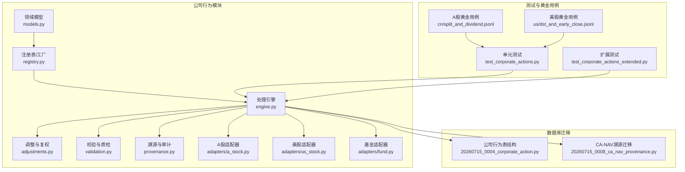
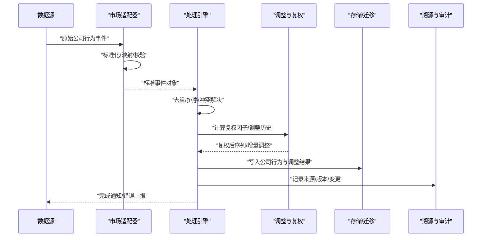
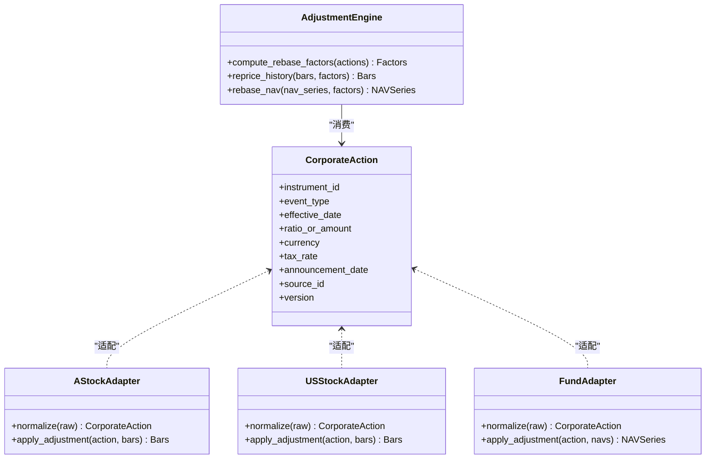
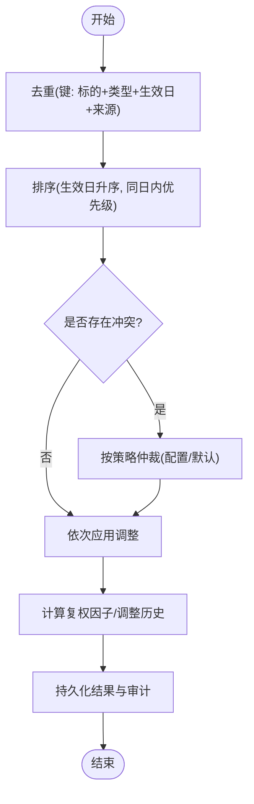
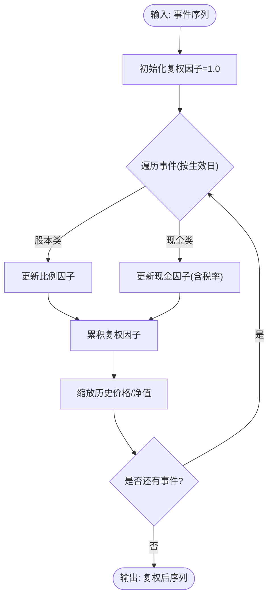
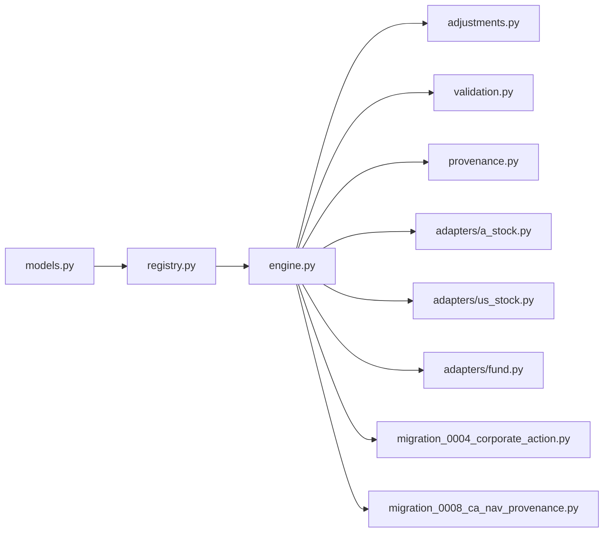

# 公司行为处理

<cite>
**本文引用的文件**   
- [packages/corporate_actions/__init__.py](file://packages/corporate_actions/__init__.py)
- [packages/corporate_actions/models.py](file://packages/corporate_actions/models.py)
- [packages/corporate_actions/registry.py](file://packages/corporate_actions/registry.py)
- [packages/corporate_actions/engine.py](file://packages/corporate_actions/engine.py)
- [packages/corporate_actions/adapters/a_stock.py](file://packages/corporate_actions/adapters/a_stock.py)
- [packages/corporate_actions/adapters/us_stock.py](file://packages/corporate_actions/adapters/us_stock.py)
- [packages/corporate_actions/adapters/fund.py](file://packages/corporate_actions/adapters/fund.py)
- [packages/corporate_actions/adjustments.py](file://packages/corporate_actions/adjustments.py)
- [packages/corporate_actions/validation.py](file://packages/corporate_actions/validation.py)
- [packages/corporate_actions/provenance.py](file://packages/corporate_actions/provenance.py)
- [sql/migrations/20260715_0004_corporate_action.py](file://sql/migrations/20260715_0004_corporate_action.py)
- [sql/migrations/20260715_0008_ca_nav_provenance.py](file://sql/migrations/20260715_0008_ca_nav_provenance.py)
- [tests/unit/test_corporate_actions.py](file://tests/unit/test_corporate_actions.py)
- [tests/unit/test_corporate_actions_extended.py](file://tests/unit/test_corporate_actions_extended.py)
- [tests/fixtures/golden/cn/split_and_dividend.jsonl](file://tests/fixtures/golden/cn/split_and_dividend.jsonl)
- [tests/fixtures/golden/us/dst_and_early_close.jsonl](file://tests/fixtures/golden/us/dst_and_early_close.jsonl)
</cite>

## 目录
1. [简介](#简介)
2. [项目结构](#项目结构)
3. [核心组件](#核心组件)
4. [架构总览](#架构总览)
5. [详细组件分析](#详细组件分析)
6. [依赖关系分析](#依赖关系分析)
7. [性能考虑](#性能考虑)
8. [故障排查指南](#故障排查指南)
9. [结论](#结论)
10. [附录](#附录)

## 简介
本模块面向量化交易MCP系统中的“公司行为”（Corporate Actions）处理，覆盖拆股、合股、分红、配股等事件识别与处理，提供历史价格调整算法与复权计算，支持多市场差异（如A股除权除息、美股股息税等），并给出时间序列处理流程、影响评估方法、数据来源验证与质量控制机制，以及对公司行为在因子计算和回测中的处理方式。

## 项目结构
公司行为相关代码位于 packages/corporate_actions 目录下，采用分层与适配器模式组织：
- 领域模型与注册表：定义事件类型、字段、校验规则与工厂注册
- 引擎层：编排事件解析、调整计算、持久化与审计溯源
- 市场适配器：封装不同市场的差异化逻辑（A股、美股、基金）
- 调整与复权：统一的价格/净值调整算法与复权因子维护
- 数据质量与溯源：输入校验、冲突检测、来源追踪与迁移脚本

图表来源
- [packages/corporate_actions/models.py](file://packages/corporate_actions/models.py)
- [packages/corporate_actions/registry.py](file://packages/corporate_actions/registry.py)
- [packages/corporate_actions/engine.py](file://packages/corporate_actions/engine.py)
- [packages/corporate_actions/adjustments.py](file://packages/corporate_actions/adjustments.py)
- [packages/corporate_actions/validation.py](file://packages/corporate_actions/validation.py)
- [packages/corporate_actions/provenance.py](file://packages/corporate_actions/provenance.py)
- [packages/corporate_actions/adapters/a_stock.py](file://packages/corporate_actions/adapters/a_stock.py)
- [packages/corporate_actions/adapters/us_stock.py](file://packages/corporate_actions/adapters/us_stock.py)
- [packages/corporate_actions/adapters/fund.py](file://packages/corporate_actions/adapters/fund.py)
- [sql/migrations/20260715_0004_corporate_action.py](file://sql/migrations/20260715_0004_corporate_action.py)
- [sql/migrations/20260715_0008_ca_nav_provenance.py](file://sql/migrations/20260715_0008_ca_nav_provenance.py)
- [tests/unit/test_corporate_actions.py](file://tests/unit/test_corporate_actions.py)
- [tests/unit/test_corporate_actions_extended.py](file://tests/unit/test_corporate_actions_extended.py)
- [tests/fixtures/golden/cn/split_and_dividend.jsonl](file://tests/fixtures/golden/cn/split_and_dividend.jsonl)
- [tests/fixtures/golden/us/dst_and_early_close.jsonl](file://tests/fixtures/golden/us/dst_and_early_close.jsonl)

章节来源
- [packages/corporate_actions/__init__.py](file://packages/corporate_actions/__init__.py)
- [packages/corporate_actions/models.py](file://packages/corporate_actions/models.py)
- [packages/corporate_actions/registry.py](file://packages/corporate_actions/registry.py)
- [packages/corporate_actions/engine.py](file://packages/corporate_actions/engine.py)
- [packages/corporate_actions/adjustments.py](file://packages/corporate_actions/adjustments.py)
- [packages/corporate_actions/validation.py](file://packages/corporate_actions/validation.py)
- [packages/corporate_actions/provenance.py](file://packages/corporate_actions/provenance.py)
- [packages/corporate_actions/adapters/a_stock.py](file://packages/corporate_actions/adapters/a_stock.py)
- [packages/corporate_actions/adapters/us_stock.py](file://packages/corporate_actions/adapters/us_stock.py)
- [packages/corporate_actions/adapters/fund.py](file://packages/corporate_actions/adapters/fund.py)
- [sql/migrations/20260715_0004_corporate_action.py](file://sql/migrations/20260715_0004_corporate_action.py)
- [sql/migrations/20260715_0008_ca_nav_provenance.py](file://sql/migrations/20260715_0008_ca_nav_provenage.py)
- [tests/unit/test_corporate_actions.py](file://tests/unit/test_corporate_actions.py)
- [tests/unit/test_corporate_actions_extended.py](file://tests/unit/test_corporate_actions_extended.py)
- [tests/fixtures/golden/cn/split_and_dividend.jsonl](file://tests/fixtures/golden/cn/split_and_dividend.jsonl)
- [tests/fixtures/golden/us/dst_and_early_close.jsonl](file://tests/fixtures/golden/us/dst_and_early_close.jsonl)

## 核心组件
- 领域模型与枚举：定义公司行为事件类型（拆股、合股、现金分红、送股、配股、退市等）、关键属性（生效日、比例、金额、币种、税率等）及约束。
- 注册表/工厂：按市场+事件类型路由到具体适配器，便于扩展新市场与新事件。
- 处理引擎：负责事件解析、去重、排序、应用顺序、调整计算、结果落库与审计记录。
- 市场适配器：封装各市场差异（如A股除权除息口径、美股股息税后净支付、基金申赎与截止日）。
- 调整与复权：提供统一的复权因子维护与历史价格/净值回溯调整算法。
- 校验与质检：对输入数据进行完整性、一致性、边界条件检查，输出告警与拒绝策略。
- 溯源与审计：记录数据来源、转换过程、版本与变更轨迹，支撑可追溯性与合规审计。

章节来源
- [packages/corporate_actions/models.py](file://packages/corporate_actions/models.py)
- [packages/corporate_actions/registry.py](file://packages/corporate_actions/registry.py)
- [packages/corporate_actions/engine.py](file://packages/corporate_actions/engine.py)
- [packages/corporate_actions/adjustments.py](file://packages/corporate_actions/adjustments.py)
- [packages/corporate_actions/validation.py](file://packages/corporate_actions/validation.py)
- [packages/corporate_actions/provenance.py](file://packages/corporate_actions/provenance.py)

## 架构总览
公司行为处理采用“适配器+引擎”的架构：上游数据源经适配器标准化为内部事件模型，再由引擎进行全局排序与应用，最终产出复权后的价格/净值序列与审计日志。

图表来源
- [packages/corporate_actions/engine.py](file://packages/corporate_actions/engine.py)
- [packages/corporate_actions/adapters/a_stock.py](file://packages/corporate_actions/adapters/a_stock.py)
- [packages/corporate_actions/adapters/us_stock.py](file://packages/corporate_actions/adapters/us_stock.py)
- [packages/corporate_actions/adapters/fund.py](file://packages/corporate_actions/adapters/fund.py)
- [packages/corporate_actions/adjustments.py](file://packages/corporate_actions/adjustments.py)
- [packages/corporate_actions/provenance.py](file://packages/corporate_actions/provenance.py)
- [sql/migrations/20260715_0004_corporate_action.py](file://sql/migrations/20260715_0004_corporate_action.py)
- [sql/migrations/20260715_0008_ca_nav_provenance.py](file://sql/migrations/20260715_0008_ca_nav_provenance.py)

## 详细组件分析

### 领域模型与事件类型
- 事件类型：拆股、合股、现金分红、送股、配股、退市、基金申购/赎回、基金截止日等。
- 关键字段：标的标识、事件类型、生效日期、比例/数量、金额/单价、币种、税率、公告日、来源ID、版本号等。
- 约束与校验：必填字段、数值范围、日期有效性、比例非零、金额非负等。

图表来源
- [packages/corporate_actions/models.py](file://packages/corporate_actions/models.py)
- [packages/corporate_actions/adapters/a_stock.py](file://packages/corporate_actions/adapters/a_stock.py)
- [packages/corporate_actions/adapters/us_stock.py](file://packages/corporate_actions/adapters/us_stock.py)
- [packages/corporate_actions/adapters/fund.py](file://packages/corporate_actions/adapters/fund.py)
- [packages/corporate_actions/adjustments.py](file://packages/corporate_actions/adjustments.py)

章节来源
- [packages/corporate_actions/models.py](file://packages/corporate_actions/models.py)

### 注册表与工厂
- 功能：按市场与事件类型选择对应适配器；支持动态注册与热插拔。
- 设计要点：键空间为 (market, event_type)，返回适配器实例；异常时抛出明确错误以便上层降级或告警。

章节来源
- [packages/corporate_actions/registry.py](file://packages/corporate_actions/registry.py)

### 处理引擎与时间序列处理
- 输入：标准化后的公司行为事件列表。
- 步骤：
  - 去重：基于 (instrument_id, event_type, effective_date, source_id) 组合键。
  - 排序：按生效日期升序，同一天内按优先级（如先拆合股后分红）确定应用顺序。
  - 冲突检测：同一标的同日存在互斥事件时的仲裁策略（以配置为准）。
  - 应用：依次调用调整引擎更新复权因子与历史序列。
  - 输出：复权后的价格/净值序列、事件审计记录。

图表来源
- [packages/corporate_actions/engine.py](file://packages/corporate_actions/engine.py)
- [packages/corporate_actions/adjustments.py](file://packages/corporate_actions/adjustments.py)

章节来源
- [packages/corporate_actions/engine.py](file://packages/corporate_actions/engine.py)

### 市场适配器差异处理
- A股：
  - 除权除息：同时考虑价格调整与现金红利再投资假设（可选）。
  - 送转股：按比例调整股本与价格。
  - 停牌/涨跌停：结合日历规则与成交特征进行过滤或标记。
- 美股：
  - 股息税：按预设税率计算税后净支付，影响复权因子。
  - 提前收盘/夏令时：与事件生效时间对齐，避免跨日错位。
- 基金：
  - 截止日与申赎：影响净值计算窗口与份额变动。
  - 分红方式：现金分红与红利再投资的差异处理。

章节来源
- [packages/corporate_actions/adapters/a_stock.py](file://packages/corporate_actions/adapters/a_stock.py)
- [packages/corporate_actions/adapters/us_stock.py](file://packages/corporate_actions/adapters/us_stock.py)
- [packages/corporate_actions/adapters/fund.py](file://packages/corporate_actions/adapters/fund.py)

### 历史价格调整与复权计算
- 复权因子：从最早交易日至当前，累积所有公司行为的调整系数。
- 调整顺序：优先处理股本类事件（拆/合/送），再处理现金类（分红/配股），确保价格连续性。
- 算法要点：
  - 前复权：将历史价格按累计因子缩放，保持最近价格不变。
  - 后复权：将初始价格按累计因子放大，保持首日价格不变。
  - 净值复权：对基金净值序列执行相同逻辑，考虑分红再投资。
- 复杂度：对长度为T的时间序列，单次事件O(T)，N次事件总体O(N·T)。

图表来源
- [packages/corporate_actions/adjustments.py](file://packages/corporate_actions/adjustments.py)

章节来源
- [packages/corporate_actions/adjustments.py](file://packages/corporate_actions/adjustments.py)

### 数据质量与来源验证
- 输入校验：字段完整性、类型、取值范围、日期合法性、比例/金额非零与非负。
- 冲突检测：同日多事件冲突、重复事件、来源不一致。
- 溯源记录：每个事件的来源ID、版本号、转换步骤、校验结果。
- 迁移与存储：通过数据库迁移脚本定义公司行为与溯源表结构，保证一致性。

章节来源
- [packages/corporate_actions/validation.py](file://packages/corporate_actions/validation.py)
- [packages/corporate_actions/provenance.py](file://packages/corporate_actions/provenance.py)
- [sql/migrations/20260715_0004_corporate_action.py](file://sql/migrations/20260715_0004_corporate_action.py)
- [sql/migrations/20260715_0008_ca_nav_provenance.py](file://sql/migrations/20260715_0008_ca_nav_provenance.py)

### 测试与黄金用例
- 单元测试：覆盖基本事件处理、复权计算、冲突仲裁、错误路径。
- 扩展测试：跨市场场景、极端值、并发与幂等性。
- 黄金用例：A股拆分与分红、美股除息与提前收盘等真实场景回归。

章节来源
- [tests/unit/test_corporate_actions.py](file://tests/unit/test_corporate_actions.py)
- [tests/unit/test_corporate_actions_extended.py](file://tests/unit/test_corporate_actions_extended.py)
- [tests/fixtures/golden/cn/split_and_dividend.jsonl](file://tests/fixtures/golden/cn/split_and_dividend.jsonl)
- [tests/fixtures/golden/us/dst_and_early_close.jsonl](file://tests/fixtures/golden/us/dst_and_early_close.jsonl)

## 依赖关系分析
- 低耦合：适配器仅依赖领域模型与调整接口，引擎聚合适配器与调整器。
- 可扩展：注册表支持新增市场与事件类型，无需改动核心流程。
- 外部依赖：数据库迁移脚本提供持久化契约；测试依赖黄金用例保障回归。

图表来源
- [packages/corporate_actions/models.py](file://packages/corporate_actions/models.py)
- [packages/corporate_actions/registry.py](file://packages/corporate_actions/registry.py)
- [packages/corporate_actions/engine.py](file://packages/corporate_actions/engine.py)
- [packages/corporate_actions/adjustments.py](file://packages/corporate_actions/adjustments.py)
- [packages/corporate_actions/validation.py](file://packages/corporate_actions/validation.py)
- [packages/corporate_actions/provenance.py](file://packages/corporate_actions/provenance.py)
- [packages/corporate_actions/adapters/a_stock.py](file://packages/corporate_actions/adapters/a_stock.py)
- [packages/corporate_actions/adapters/us_stock.py](file://packages/corporate_actions/adapters/us_stock.py)
- [packages/corporate_actions/adapters/fund.py](file://packages/corporate_actions/adapters/fund.py)
- [sql/migrations/20260715_0004_corporate_action.py](file://sql/migrations/20260715_0004_corporate_action.py)
- [sql/migrations/20260715_0008_ca_nav_provenance.py](file://sql/migrations/20260715_0008_ca_nav_provenance.py)

章节来源
- [packages/corporate_actions/registry.py](file://packages/corporate_actions/registry.py)
- [packages/corporate_actions/engine.py](file://packages/corporate_actions/engine.py)

## 性能考虑
- 批量处理：对长序列使用向量化操作减少循环开销。
- 增量更新：仅对受影响区间重新计算复权因子，避免全量重算。
- 索引优化：对 (instrument_id, effective_date) 建立索引加速查询与合并。
- 内存管理：分块读取与流式处理，控制峰值内存占用。
- 并行化：独立标的的事件处理可并行，注意锁与写竞争。

[本节为通用指导，不直接分析具体文件]

## 故障排查指南
- 常见错误：
  - 事件缺失关键字段：检查校验规则与输入清洗。
  - 同日冲突未仲裁：确认冲突策略配置与优先级。
  - 复权因子异常（无穷/NaN）：检查比例/金额是否为0或负数。
  - 时序错位：核对生效日与日历规则（节假日/提前收盘）。
- 定位方法：
  - 查看溯源日志，定位来源ID与版本号。
  - 回放黄金用例，对比预期输出。
  - 启用调试开关，打印中间复权因子与调整明细。

章节来源
- [packages/corporate_actions/validation.py](file://packages/corporate_actions/validation.py)
- [packages/corporate_actions/provenance.py](file://packages/corporate_actions/provenance.py)
- [tests/unit/test_corporate_actions.py](file://tests/unit/test_corporate_actions.py)

## 结论
公司行为处理模块通过清晰的领域模型、可扩展的适配器与稳健的引擎流程，实现了多市场公司行为的统一识别与处理。复权算法兼顾连续性与准确性，配合严格的数据质量与溯源机制，为因子计算与回测提供了可靠基础。建议在生产环境中持续完善冲突仲裁策略、税务参数与日历规则，并通过回归测试保障稳定性。

[本节为总结，不直接分析具体文件]

## 附录
- 术语说明：
  - 复权：对历史价格/净值进行调整，消除公司行为带来的不连续。
  - 除权除息：股票因分红或配股导致价格调整的机制。
  - 股息税：对现金分红征收的税费，影响净支付额。
- 参考实现路径：
  - 领域模型与事件类型：[packages/corporate_actions/models.py](file://packages/corporate_actions/models.py)
  - 注册表与工厂：[packages/corporate_actions/registry.py](file://packages/corporate_actions/registry.py)
  - 处理引擎：[packages/corporate_actions/engine.py](file://packages/corporate_actions/engine.py)
  - 调整与复权：[packages/corporate_actions/adjustments.py](file://packages/corporate_actions/adjustments.py)
  - 校验与溯源：[packages/corporate_actions/validation.py](file://packages/corporate_actions/validation.py), [packages/corporate_actions/provenance.py](file://packages/corporate_actions/provenance.py)
  - 市场适配器：[packages/corporate_actions/adapters/a_stock.py](file://packages/corporate_actions/adapters/a_stock.py), [packages/corporate_actions/adapters/us_stock.py](file://packages/corporate_actions/adapters/us_stock.py), [packages/corporate_actions/adapters/fund.py](file://packages/corporate_actions/adapters/fund.py)
  - 数据库迁移：[sql/migrations/20260715_0004_corporate_action.py](file://sql/migrations/20260715_0004_corporate_action.py), [sql/migrations/20260715_0008_ca_nav_provenance.py](file://sql/migrations/20260715_0008_ca_nav_provenance.py)
  - 测试与黄金用例：[tests/unit/test_corporate_actions.py](file://tests/unit/test_corporate_actions.py), [tests/unit/test_corporate_actions_extended.py](file://tests/unit/test_corporate_actions_extended.py), [tests/fixtures/golden/cn/split_and_dividend.jsonl](file://tests/fixtures/golden/cn/split_and_dividend.jsonl), [tests/fixtures/golden/us/dst_and_early_close.jsonl](file://tests/fixtures/golden/us/dst_and_early_close.jsonl)