# 因子计算引擎

<cite>
**本文引用的文件**   
- [README.md](file://README.md)
- [pyproject.toml](file://pyproject.toml)
- [apps/api/main.py](file://apps/api/main.py)
- [apps/api/routers/fundamentals.py](file://apps/api/routers/fundamentals.py)
- [apps/api/routers/forecast.py](file://apps/api/routers/forecast.py)
- [apps/api/routers/instruments.py](file://apps/api/routers/instruments.py)
- [apps/api/routers/markets.py](file://apps/api/routers/markets.py)
- [apps/api/routers/portfolio.py](file://apps/api/routers/portfolio.py)
- [apps/api/routers/scheduler.py](file://apps/api/routers/scheduler.py)
- [apps/api/deps.py](file://apps/api/deps.py)
- [apps/quant-admin-mcp/server.py](file://apps/quant-admin-mcp/server.py)
- [apps/quant-admin-mcp/tools.py](file://apps/quant-admin-mcp/tools.py)
- [apps/quant-read-mcp/server.py](file://apps/quant-read-mcp/server.py)
- [apps/quant-read-mcp/db_backends.py](file://apps/quant-read-mcp/db_backends.py)
- [apps/quant-read-mcp/tools.py](file://apps/quant-read-mcp/tools.py)
- [apps/scheduler/executor.py](file://apps/scheduler/executor.py)
- [apps/scheduler/schedule.py](file://apps/scheduler/schedule.py)
- [apps/worker/main.py](file://apps/worker/main.py)
- [apps/worker/tasks.py](file://apps/worker/tasks.py)
- [packages/features/__init__.py](file://packages/features/__init__.py)
- [packages/fundamentals/__init__.py](file://packages/fundamentals/__init__.py)
- [packages/backtest/__init__.py](file://packages/backtest/__init__.py)
- [packages/training/__init__.py](file://packages/training/__init__.py)
- [packages/datasets/__init__.py](file://packages/datasets/__init__.py)
- [packages/data_sources/__init__.py](file://packages/data_sources/__init__.py)
- [packages/models/__init__.py](file://packages/models/__init__.py)
- [packages/evaluation/__init__.py](file://packages/evaluation/__init__.py)
- [packages/observability/__init__.py](file://packages/observability/__init__.py)
- [scripts/register_and_evaluate.py](file://scripts/register_and_evaluate.py)
- [scripts/run_research_baseline.py](file://scripts/run_research_baseline.py)
- [sql/migrations/env.py](file://sql/migrations/env.py)
</cite>

## 目录
1. [简介](#简介)
2. [项目结构](#项目结构)
3. [核心组件](#核心组件)
4. [架构总览](#架构总览)
5. [详细组件分析](#详细组件分析)
6. [依赖关系分析](#依赖关系分析)
7. [性能与并行调度](#性能与并行调度)
8. [缓存与增量计算](#缓存与增量计算)
9. [因子版本管理与血缘追踪](#因子版本管理与血缘追踪)
10. [因子有效性检验与回测集成](#因子有效性检验与回测集成)
11. [自定义因子开发指南与最佳实践](#自定义因子开发指南与最佳实践)
12. [故障排查指南](#故障排查指南)
13. [结论](#结论)

## 简介
本文件面向量化交易MCP系统的“因子计算引擎”，系统性阐述因子库的架构设计与扩展机制，覆盖技术指标计算、基本面因子处理、机器学习特征工程实现；记录因子缓存策略与增量计算优化方案；说明因子有效性检验与回测集成方法；提供自定义因子开发指南与最佳实践；并给出并行计算与资源调度策略以及因子版本管理与血缘追踪能力。文档以仓库现有代码为依据，结合可视化图示帮助读者快速理解系统全貌与关键流程。

## 项目结构
仓库采用多应用+多包的分层组织方式：
- apps：对外暴露的服务与工具（API、MCP服务、调度器、工作进程）
- packages：领域功能包（特征、基本面、回测、训练、数据集、数据源、模型、评估、可观测性等）
- scripts：研究脚本与流水线入口
- sql：数据库迁移与元数据管理
- configs：配置项
- deploy：部署编排与监控

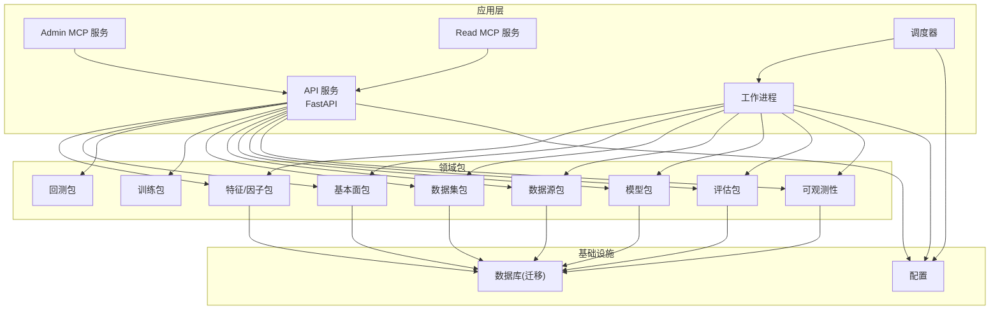

图表来源
- [apps/api/main.py](file://apps/api/main.py)
- [apps/quant-admin-mcp/server.py](file://apps/quant-admin-mcp/server.py)
- [apps/quant-read-mcp/server.py](file://apps/quant-read-mcp/server.py)
- [apps/scheduler/executor.py](file://apps/scheduler/executor.py)
- [apps/worker/main.py](file://apps/worker/main.py)
- [packages/features/__init__.py](file://packages/features/__init__.py)
- [packages/fundamentals/__init__.py](file://packages/fundamentals/__init__.py)
- [packages/backtest/__init__.py](file://packages/backtest/__init__.py)
- [packages/training/__init__.py](file://packages/training/__init__.py)
- [packages/datasets/__init__.py](file://packages/datasets/__init__.py)
- [packages/data_sources/__init__.py](file://packages/data_sources/__init__.py)
- [packages/models/__init__.py](file://packages/models/__init__.py)
- [packages/evaluation/__init__.py](file://packages/evaluation/__init__.py)
- [packages/observability/__init__.py](file://packages/observability/__init__.py)
- [sql/migrations/env.py](file://sql/migrations/env.py)

章节来源
- [README.md](file://README.md)
- [pyproject.toml](file://pyproject.toml)

## 核心组件
- 因子注册与发现：通过统一接口将技术指标、基本面因子、机器学习特征进行注册，形成可发现的因子库。
- 计算执行：支持批处理与流式增量计算，按时间窗口与标的维度进行切片计算。
- 数据接入：从数据源与数据集包中读取行情、基本面、公司行为等数据，并进行标准化。
- 存储与血缘：结果写入数据库，同时记录数据来源、参数、版本等元数据，形成因子血缘。
- 评估与回测：提供因子有效性检验与回测集成，支持IC、分层收益、换手率等指标。
- 可观测性与调度：任务调度、并发控制、指标采集与日志追踪贯穿全流程。

章节来源
- [packages/features/__init__.py](file://packages/features/__init__.py)
- [packages/fundamentals/__init__.py](file://packages/fundamentals/__init__.py)
- [packages/datasets/__init__.py](file://packages/datasets/__init__.py)
- [packages/data_sources/__init__.py](file://packages/data_sources/__init__.py)
- [packages/models/__init__.py](file://packages/models/__init__.py)
- [packages/evaluation/__init__.py](file://packages/evaluation/__init__.py)
- [packages/observability/__init__.py](file://packages/observability/__init__.py)
- [apps/scheduler/executor.py](file://apps/scheduler/executor.py)
- [apps/worker/tasks.py](file://apps/worker/tasks.py)

## 架构总览
整体采用“服务化+包化”的架构：API/MCP作为入口，调度与工作进程负责计算执行，领域包封装具体业务逻辑，数据库承载持久化与血缘信息。

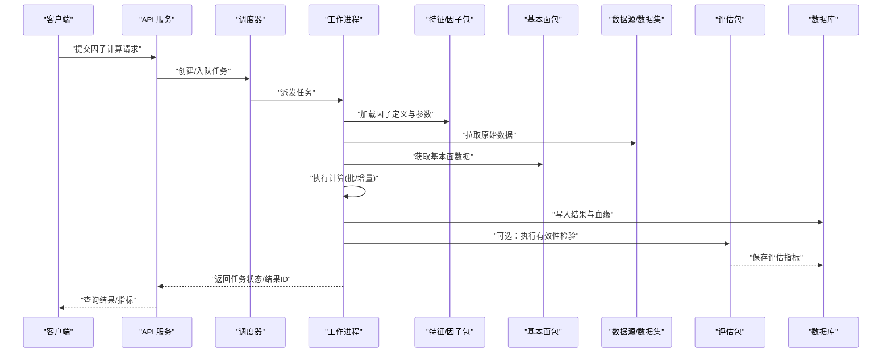

图表来源
- [apps/api/main.py](file://apps/api/main.py)
- [apps/scheduler/executor.py](file://apps/scheduler/executor.py)
- [apps/worker/tasks.py](file://apps/worker/tasks.py)
- [packages/features/__init__.py](file://packages/features/__init__.py)
- [packages/fundamentals/__init__.py](file://packages/fundamentals/__init__.py)
- [packages/datasets/__init__.py](file://packages/datasets/__init__.py)
- [packages/data_sources/__init__.py](file://packages/data_sources/__init__.py)
- [packages/evaluation/__init__.py](file://packages/evaluation/__init__.py)
- [sql/migrations/env.py](file://sql/migrations/env.py)

## 详细组件分析

### 因子注册与发现
- 目标：为技术指标、基本面因子、机器学习特征提供统一的注册表与发现机制，便于按需组合与复用。
- 关键点：
  - 统一接口：定义因子描述、输入输出契约、依赖声明、参数校验。
  - 动态加载：基于包扫描或显式注册，启动时构建因子索引。
  - 版本兼容：因子定义包含版本字段，支持向后兼容与灰度切换。
  - 依赖解析：根据依赖图生成计算DAG，避免重复计算。

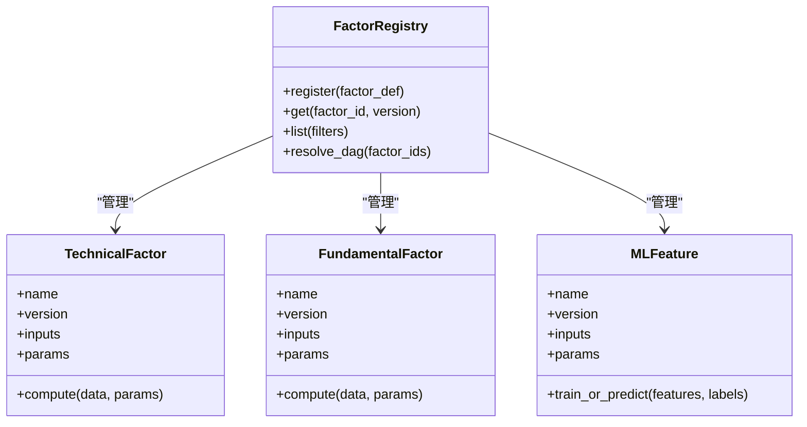

图表来源
- [packages/features/__init__.py](file://packages/features/__init__.py)
- [packages/fundamentals/__init__.py](file://packages/fundamentals/__init__.py)

章节来源
- [packages/features/__init__.py](file://packages/features/__init__.py)
- [packages/fundamentals/__init__.py](file://packages/fundamentals/__init__.py)

### 技术指标计算
- 输入：高频/日频行情序列（开高低收量、复权因子等）。
- 处理：滚动窗口聚合、去极值、缺失值填充、截面标准化。
- 输出：时序因子矩阵（标的×时间），附带质量标签与统计摘要。
- 优化：向量化计算、分块迭代、内存映射、增量更新。

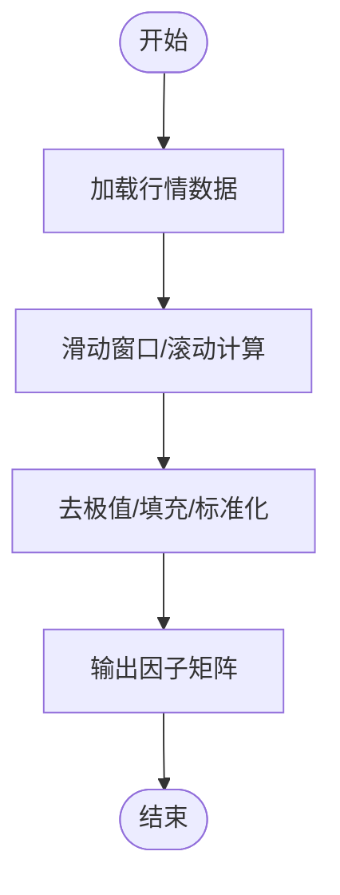

图表来源
- [packages/features/__init__.py](file://packages/features/__init__.py)
- [packages/datasets/__init__.py](file://packages/datasets/__init__.py)
- [packages/data_sources/__init__.py](file://packages/data_sources/__init__.py)

章节来源
- [packages/features/__init__.py](file://packages/features/__init__.py)
- [packages/datasets/__init__.py](file://packages/datasets/__init__.py)
- [packages/data_sources/__init__.py](file://packages/data_sources/__init__.py)

### 基本面因子处理
- 输入：财务报表、公告、估值指标、行业分类等。
- 处理：对齐口径、会计调整、前瞻/滞后对齐、截面横排处理。
- 输出：基本面因子矩阵，附带数据质量评分与来源标记。

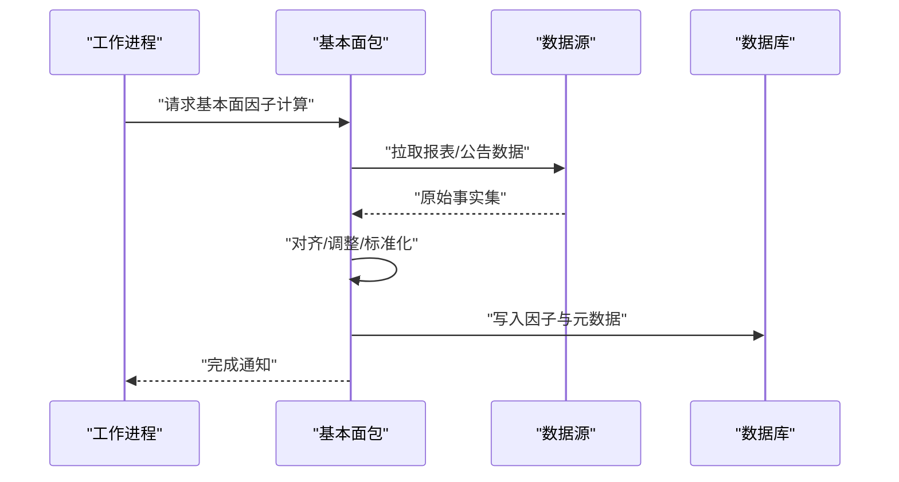

图表来源
- [packages/fundamentals/__init__.py](file://packages/fundamentals/__init__.py)
- [packages/data_sources/__init__.py](file://packages/data_sources/__init__.py)
- [sql/migrations/env.py](file://sql/migrations/env.py)

章节来源
- [packages/fundamentals/__init__.py](file://packages/fundamentals/__init__.py)
- [packages/data_sources/__init__.py](file://packages/data_sources/__init__.py)

### 机器学习特征工程
- 输入：技术因子、基本面因子、宏观/新闻等外部特征。
- 处理：特征构造、交叉/滞后、降维、编码、样本权重。
- 输出：模型训练特征集与预测特征集，附带特征重要性/稳定性指标。

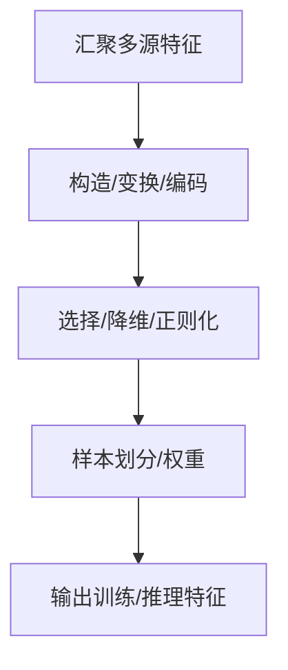

图表来源
- [packages/features/__init__.py](file://packages/features/__init__.py)
- [packages/training/__init__.py](file://packages/training/__init__.py)

章节来源
- [packages/features/__init__.py](file://packages/features/__init__.py)
- [packages/training/__init__.py](file://packages/training/__init__.py)

### 调度与工作进程
- 调度器：接收任务、拆分批次、维护队列、重试与超时控制。
- 工作进程：消费任务、加载依赖、执行计算、落盘结果、上报指标。

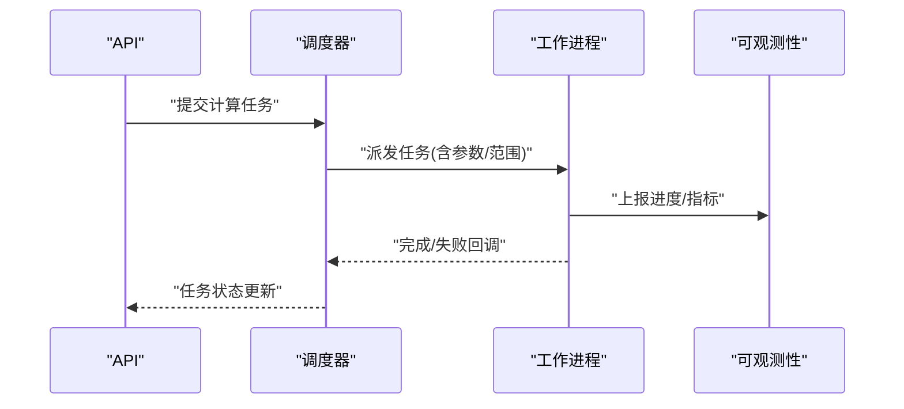

图表来源
- [apps/scheduler/executor.py](file://apps/scheduler/executor.py)
- [apps/worker/tasks.py](file://apps/worker/tasks.py)
- [packages/observability/__init__.py](file://packages/observability/__init__.py)

章节来源
- [apps/scheduler/executor.py](file://apps/scheduler/executor.py)
- [apps/worker/tasks.py](file://apps/worker/tasks.py)
- [packages/observability/__init__.py](file://packages/observability/__init__.py)

### API与MCP服务
- API：提供因子计算、结果查询、评估报告、资产与市场信息查询等REST接口。
- MCP服务：对外暴露工具能力，供上层智能体调用（如读取数据库、触发计算任务）。

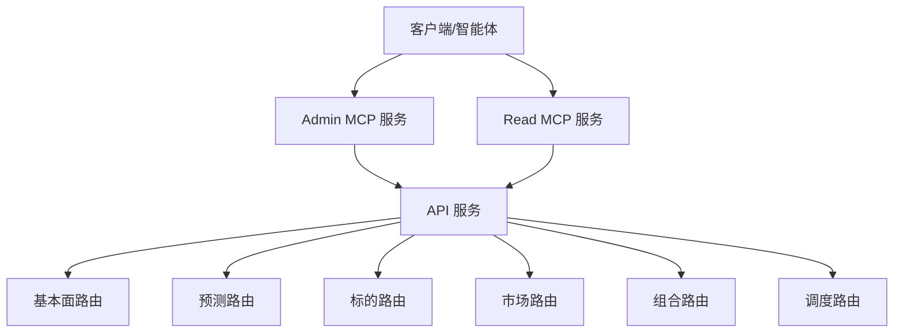

图表来源
- [apps/api/main.py](file://apps/api/main.py)
- [apps/quant-admin-mcp/server.py](file://apps/quant-admin-mcp/server.py)
- [apps/quant-read-mcp/server.py](file://apps/quant-read-mcp/server.py)
- [apps/api/routers/fundamentals.py](file://apps/api/routers/fundamentals.py)
- [apps/api/routers/forecast.py](file://apps/api/routers/forecast.py)
- [apps/api/routers/instruments.py](file://apps/api/routers/instruments.py)
- [apps/api/routers/markets.py](file://apps/api/routers/markets.py)
- [apps/api/routers/portfolio.py](file://apps/api/routers/portfolio.py)
- [apps/api/routers/scheduler.py](file://apps/api/routers/scheduler.py)

章节来源
- [apps/api/main.py](file://apps/api/main.py)
- [apps/quant-admin-mcp/server.py](file://apps/quant-admin-mcp/server.py)
- [apps/quant-read-mcp/server.py](file://apps/quant-read-mcp/server.py)
- [apps/api/routers/fundamentals.py](file://apps/api/routers/fundamentals.py)
- [apps/api/routers/forecast.py](file://apps/api/routers/forecast.py)
- [apps/api/routers/instruments.py](file://apps/api/routers/instruments.py)
- [apps/api/routers/markets.py](file://apps/api/routers/markets.py)
- [apps/api/routers/portfolio.py](file://apps/api/routers/portfolio.py)
- [apps/api/routers/scheduler.py](file://apps/api/routers/scheduler.py)

## 依赖关系分析
- 包内耦合：特征包依赖数据源与数据集包；基本面包依赖数据源；评估包依赖模型与特征；训练包依赖特征与模型。
- 服务耦合：API依赖各路由器；调度与工作进程解耦，通过消息队列/任务表通信。
- 外部依赖：数据库用于持久化与血缘；可观测性用于指标与日志。

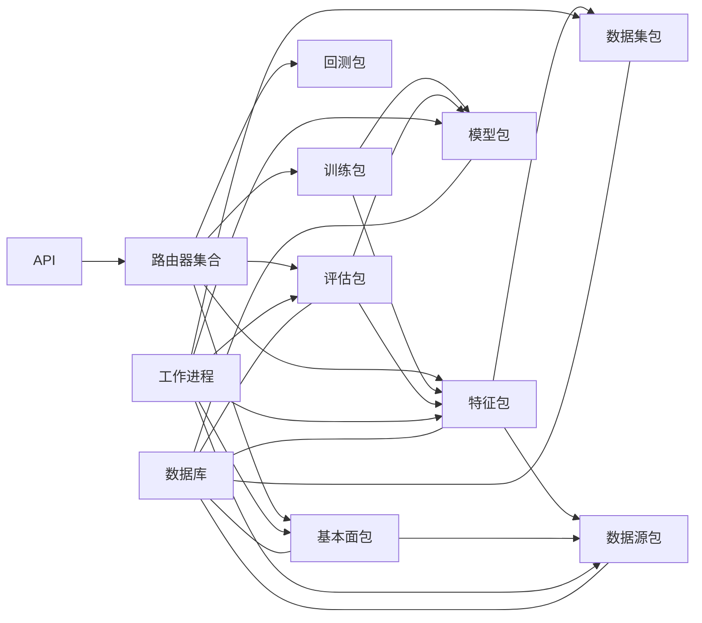

图表来源
- [apps/api/main.py](file://apps/api/main.py)
- [packages/features/__init__.py](file://packages/features/__init__.py)
- [packages/fundamentals/__init__.py](file://packages/fundamentals/__init__.py)
- [packages/backtest/__init__.py](file://packages/backtest/__init__.py)
- [packages/training/__init__.py](file://packages/training/__init__.py)
- [packages/evaluation/__init__.py](file://packages/evaluation/__init__.py)
- [packages/datasets/__init__.py](file://packages/datasets/__init__.py)
- [packages/data_sources/__init__.py](file://packages/data_sources/__init__.py)
- [packages/models/__init__.py](file://packages/models/__init__.py)
- [apps/worker/tasks.py](file://apps/worker/tasks.py)

章节来源
- [apps/api/main.py](file://apps/api/main.py)
- [apps/worker/tasks.py](file://apps/worker/tasks.py)

## 性能与并行调度
- 并行策略：
  - 标的级并行：对多标的独立因子计算进行并行化。
  - 时间片并行：对大时间窗切分为多个片段并行计算。
  - 任务级并行：不同因子类型（技术/基本面/ML）并行执行。
- 资源调度：
  - 调度器按优先级与资源配额分配任务。
  - 工作进程池大小与CPU/内存上限可配置。
  - 失败重试与退避策略保障鲁棒性。
- 可观测性：
  - 指标采集（吞吐、延迟、错误率）。
  - 结构化日志与链路追踪。

章节来源
- [apps/scheduler/executor.py](file://apps/scheduler/executor.py)
- [apps/worker/tasks.py](file://apps/worker/tasks.py)
- [packages/observability/__init__.py](file://packages/observability/__init__.py)

## 缓存与增量计算
- 缓存策略：
  - 中间结果缓存：按因子ID、参数哈希、时间范围、标的集合生成缓存键。
  - 多级缓存：内存缓存+磁盘/数据库缓存，命中优先。
  - 失效策略：数据变更、因子版本升级、参数变化触发失效。
- 增量计算：
  - 仅重算受影响的时间片与标的。
  - 依赖图传播：上游变更向下游因子传播最小必要更新。
  - 幂等写入：结果写入带事务与幂等键，避免重复。

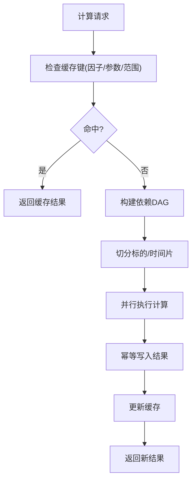

[此图为概念流程图，不直接映射到具体源码文件]

## 因子版本管理与血缘追踪
- 版本管理：
  - 因子定义包含版本号与兼容性约束。
  - 发布流程：注册→测试→上线→灰度→回滚。
- 血缘追踪：
  - 记录输入数据源、版本、参数、计算过程、输出结果。
  - 支持溯源查询与影响面分析。
- 迁移与一致性：
  - 使用迁移脚本管理数据库结构演进。
  - 保证历史结果可重现。

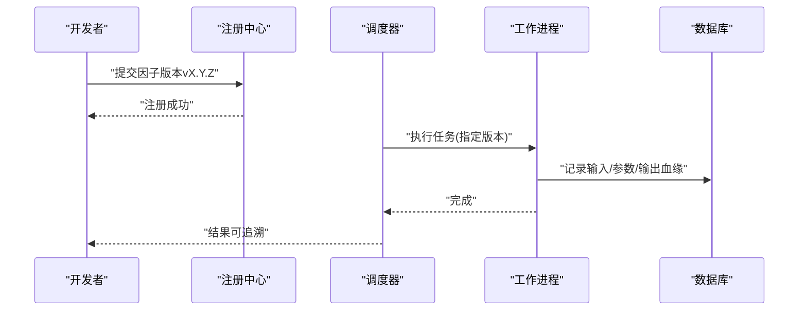

图表来源
- [packages/features/__init__.py](file://packages/features/__init__.py)
- [packages/fundamentals/__init__.py](file://packages/fundamentals/__init__.py)
- [sql/migrations/env.py](file://sql/migrations/env.py)

章节来源
- [packages/features/__init__.py](file://packages/features/__init__.py)
- [packages/fundamentals/__init__.py](file://packages/fundamentals/__init__.py)
- [sql/migrations/env.py](file://sql/migrations/env.py)

## 因子有效性检验与回测集成
- 有效性检验：
  - IC/IR、分层收益、单调性、换手率、衰减期等指标。
  - 面板回归与稳健性检验。
- 回测集成：
  - 因子信号→组合权重→模拟交易→绩效归因。
  - 支持多周期、多风格、多基准对比。
- 研究与生产衔接：
  - 研究脚本一键注册与评估。
  - 生产环境自动纳入评估流水线。

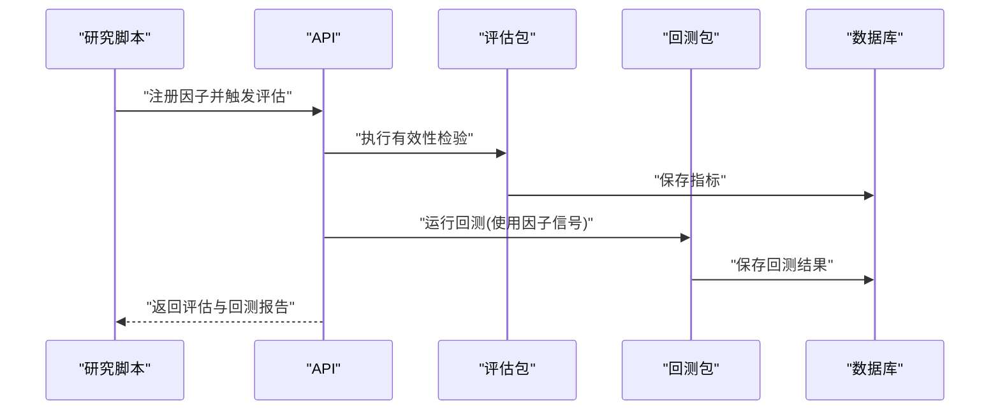

图表来源
- [scripts/register_and_evaluate.py](file://scripts/register_and_evaluate.py)
- [scripts/run_research_baseline.py](file://scripts/run_research_baseline.py)
- [packages/evaluation/__init__.py](file://packages/evaluation/__init__.py)
- [packages/backtest/__init__.py](file://packages/backtest/__init__.py)
- [apps/api/routers/forecast.py](file://apps/api/routers/forecast.py)

章节来源
- [scripts/register_and_evaluate.py](file://scripts/register_and_evaluate.py)
- [scripts/run_research_baseline.py](file://scripts/run_research_baseline.py)
- [packages/evaluation/__init__.py](file://packages/evaluation/__init__.py)
- [packages/backtest/__init__.py](file://packages/backtest/__init__.py)
- [apps/api/routers/forecast.py](file://apps/api/routers/forecast.py)

## 自定义因子开发指南与最佳实践
- 开发步骤：
  - 定义因子契约：名称、版本、输入输出、参数、依赖。
  - 实现计算逻辑：向量化优先，注意边界条件与异常处理。
  - 编写单元测试：覆盖典型场景与极端情况。
  - 注册与测试：在本地注册并通过评估脚本验证。
  - 上线与灰度：小流量验证后逐步放量。
- 最佳实践：
  - 幂等与可重现：固定随机种子、确定性算法。
  - 数据质量：缺失值、异常值、复权处理一致。
  - 性能：避免全量扫描，利用增量与缓存。
  - 可观测：埋点指标与日志，便于定位问题。
  - 版本兼容：保持向后兼容，必要时引入迁移。

章节来源
- [packages/features/__init__.py](file://packages/features/__init__.py)
- [packages/fundamentals/__init__.py](file://packages/fundamentals/__init__.py)
- [scripts/register_and_evaluate.py](file://scripts/register_and_evaluate.py)

## 故障排查指南
- 常见问题：
  - 任务失败：检查依赖是否就绪、数据源连通性、权限与配额。
  - 结果不一致：核对因子版本、参数哈希、数据版本与时间对齐。
  - 性能瓶颈：观察CPU/内存占用、I/O等待、缓存命中率。
- 定位手段：
  - 查看可观测性指标与日志。
  - 使用血缘追踪定位上游变更。
  - 回放任务与断点续算。

章节来源
- [packages/observability/__init__.py](file://packages/observability/__init__.py)
- [apps/worker/tasks.py](file://apps/worker/tasks.py)
- [apps/scheduler/executor.py](file://apps/scheduler/executor.py)

## 结论
本因子计算引擎以清晰的包化架构与统一注册机制为核心，支撑技术指标、基本面因子与机器学习特征的灵活组合与高效计算。通过缓存与增量计算、并行调度与可观测性、版本管理与血缘追踪，系统在可扩展性、稳定性与可维护性方面具备良好基础。配合评估与回测集成，可实现从研究到生产的闭环。建议持续完善数据质量治理、性能压测与自动化回归，进一步提升因子管线在生产环境的可靠性与效率。