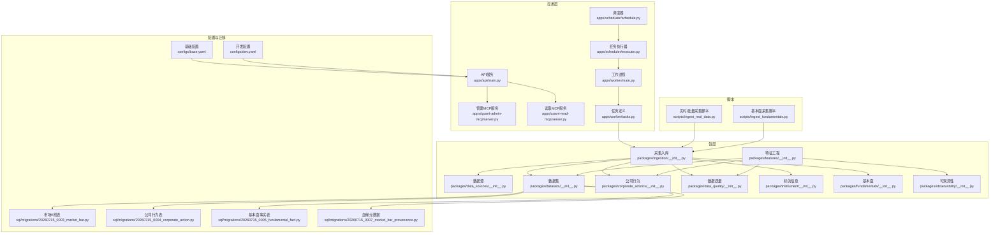
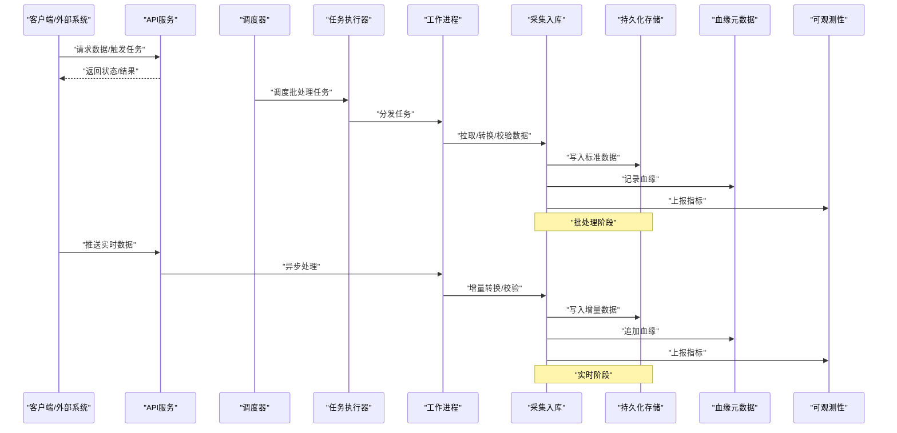
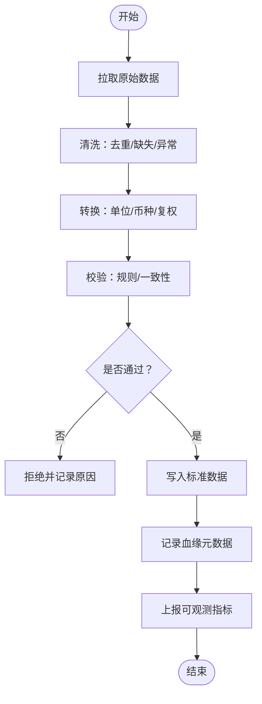
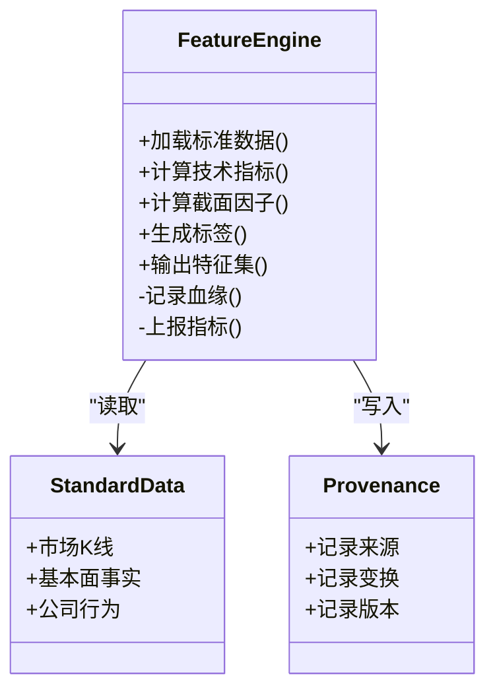
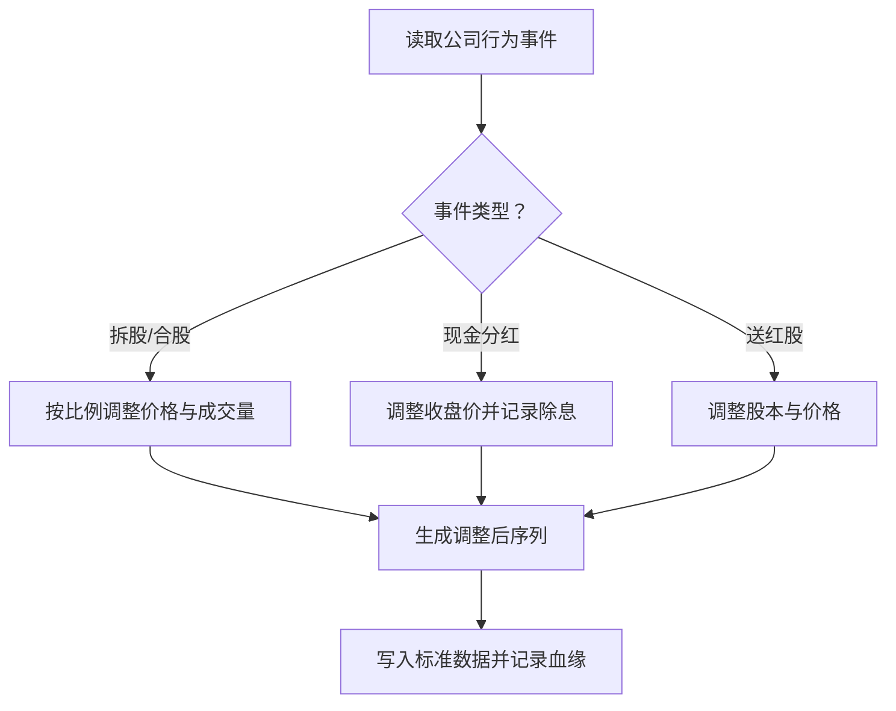
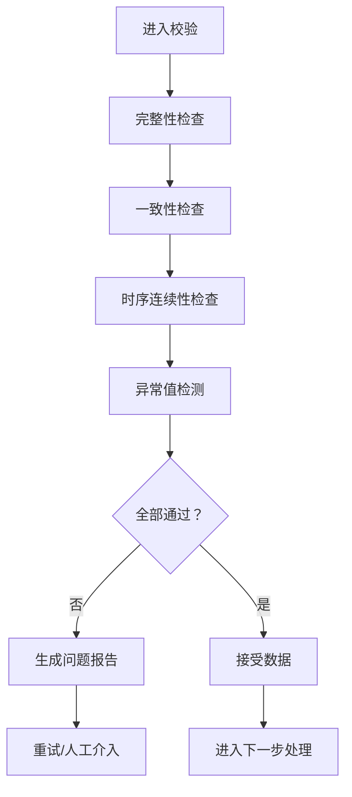
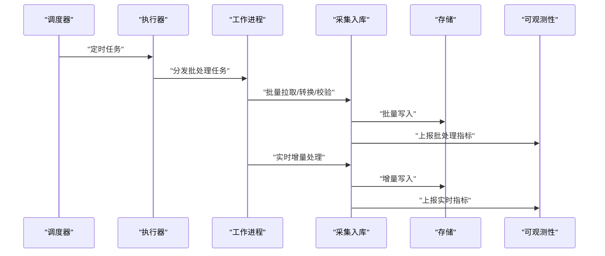
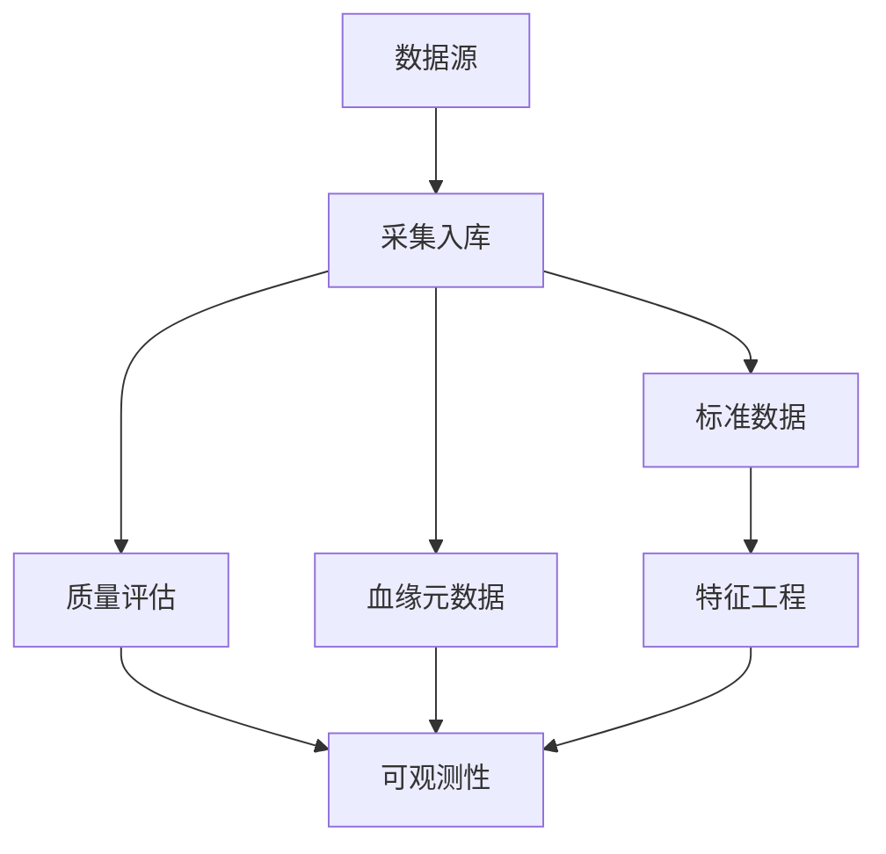
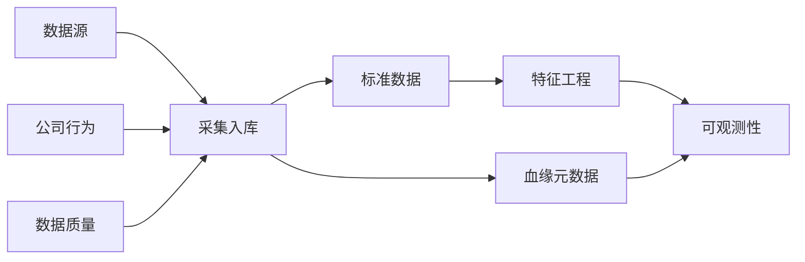

# 数据处理管道

<cite>
**本文引用的文件**   
- [apps/api/main.py](file://apps/api/main.py)
- [apps/quant-admin-mcp/server.py](file://apps/quant-admin-mcp/server.py)
- [apps/quant-read-mcp/server.py](file://apps/quant-read-mcp/server.py)
- [apps/scheduler/executor.py](file://apps/scheduler/executor.py)
- [apps/scheduler/schedule.py](file://apps/scheduler/schedule.py)
- [apps/worker/main.py](file://apps/worker/main.py)
- [apps/worker/tasks.py](file://apps/worker/tasks.py)
- [packages/data_sources/__init__.py](file://packages/data_sources/__init__.py)
- [packages/datasets/__init__.py](file://packages/datasets/__init__.py)
- [packages/features/__init__.py](file://packages/features/__init__.py)
- [packages/corporate_actions/__init__.py](file://packages/corporate_actions/__init__.py)
- [packages/data_quality/__init__.py](file://packages/data_quality/__init__.py)
- [packages/ingestion/__init__.py](file://packages/ingestion/__init__.py)
- [packages/instrument/__init__.py](file://packages/instrument/__init__.py)
- [packages/fundamentals/__init__.py](file://packages/fundamentals/__init__.py)
- [packages/observability/__init__.py](file://packages/observability/__init__.py)
- [configs/base.yaml](file://configs/base.yaml)
- [configs/dev.yaml](file://configs/dev.yaml)
- [sql/migrations/20260715_0003_market_bar.py](file://sql/migrations/20260715_0003_market_bar.py)
- [sql/migrations/20260715_0004_corporate_action.py](file://sql/migrations/20260715_0004_corporate_action.py)
- [sql/migrations/20260715_0005_fundamental_fact.py](file://sql/migrations/20260715_0005_fundamental_fact.py)
- [sql/migrations/20260715_0007_market_bar_provenance.py](file://sql/migrations/20260715_0007_market_bar_provenance.py)
- [scripts/ingest_real_data.py](file://scripts/ingest_real_data.py)
- [scripts/ingest_fundamentals.py](file://scripts/ingest_fundamentals.py)
</cite>

## 目录
1. [简介](#简介)
2. [项目结构](#项目结构)
3. [核心组件](#核心组件)
4. [架构总览](#架构总览)
5. [详细组件分析](#详细组件分析)
6. [依赖关系分析](#依赖关系分析)
7. [性能考虑](#性能考虑)
8. [故障排查指南](#故障排查指南)
9. [结论](#结论)
10. [附录](#附录)

## 简介
本文件面向量化交易MCP系统的数据处理管道，覆盖数据清洗、转换与标准化流程；因子计算引擎与特征工程管道；公司行为（拆股、分红等）处理逻辑；数据验证规则与异常值检测；批处理与实时处理的混合架构；配置与扩展方法；数据血缘追踪与质量监控方案；以及性能调优与内存管理策略。文档以仓库现有实现为依据，提供可追溯的源码定位与可视化图示，帮助读者快速理解并扩展数据处理能力。

## 项目结构
数据处理相关代码主要分布在以下模块：
- 应用层：API服务、MCP工具、调度器与任务执行器、工作进程
- 包层：数据源接入、数据集装配、特征工程、公司行为、数据质量、采集入库、标的与基本面、可观测性
- 配置：基础与开发环境配置
- 数据库迁移：市场K线、公司行为、基本面事实、血缘元数据等表结构
- 脚本：批量采集与入库脚本

图表来源
- [apps/api/main.py](file://apps/api/main.py)
- [apps/quant-admin-mcp/server.py](file://apps/quant-admin-mcp/server.py)
- [apps/quant-read-mcp/server.py](file://apps/quant-read-mcp/server.py)
- [apps/scheduler/schedule.py](file://apps/scheduler/schedule.py)
- [apps/scheduler/executor.py](file://apps/scheduler/executor.py)
- [apps/worker/main.py](file://apps/worker/main.py)
- [apps/worker/tasks.py](file://apps/worker/tasks.py)
- [packages/data_sources/__init__.py](file://packages/data_sources/__init__.py)
- [packages/datasets/__init__.py](file://packages/datasets/__init__.py)
- [packages/features/__init__.py](file://packages/features/__init__.py)
- [packages/corporate_actions/__init__.py](file://packages/corporate_actions/__init__.py)
- [packages/data_quality/__init__.py](file://packages/data_quality/__init__.py)
- [packages/ingestion/__init__.py](file://packages/ingestion/__init__.py)
- [packages/instrument/__init__.py](file://packages/instrument/__init__.py)
- [packages/fundamentals/__init__.py](file://packages/fundamentals/__init__.py)
- [packages/observability/__init__.py](file://packages/observability/__init__.py)
- [configs/base.yaml](file://configs/base.yaml)
- [configs/dev.yaml](file://configs/dev.yaml)
- [sql/migrations/20260715_0003_market_bar.py](file://sql/migrations/20260715_0003_market_bar.py)
- [sql/migrations/20260715_0004_corporate_action.py](file://sql/migrations/20260715_0004_corporate_action.py)
- [sql/migrations/20260715_0005_fundamental_fact.py](file://sql/migrations/20260715_0005_fundamental_fact.py)
- [sql/migrations/20260715_0007_market_bar_provenance.py](file://sql/migrations/20260715_0007_market_bar_provenage.py)
- [scripts/ingest_real_data.py](file://scripts/ingest_real_data.py)
- [scripts/ingest_fundamentals.py](file://scripts/ingest_fundamentals.py)

章节来源
- [apps/api/main.py](file://apps/api/main.py)
- [apps/quant-admin-mcp/server.py](file://apps/quant-admin-mcp/server.py)
- [apps/quant-read-mcp/server.py](file://apps/quant-read-mcp/server.py)
- [apps/scheduler/schedule.py](file://apps/scheduler/schedule.py)
- [apps/scheduler/executor.py](file://apps/scheduler/executor.py)
- [apps/worker/main.py](file://apps/worker/main.py)
- [apps/worker/tasks.py](file://apps/worker/tasks.py)
- [packages/data_sources/__init__.py](file://packages/data_sources/__init__.py)
- [packages/datasets/__init__.py](file://packages/datasets/__init__.py)
- [packages/features/__init__.py](file://packages/features/__init__.py)
- [packages/corporate_actions/__init__.py](file://packages/corporate_actions/__init__.py)
- [packages/data_quality/__init__.py](file://packages/data_quality/__init__.py)
- [packages/ingestion/__init__.py](file://packages/ingestion/__init__.py)
- [packages/instrument/__init__.py](file://packages/instrument/__init__.py)
- [packages/fundamentals/__init__.py](file://packages/fundamentals/__init__.py)
- [packages/observability/__init__.py](file://packages/observability/__init__.py)
- [configs/base.yaml](file://configs/base.yaml)
- [configs/dev.yaml](file://configs/dev.yaml)
- [sql/migrations/20260715_0003_market_bar.py](file://sql/migrations/20260715_0003_market_bar.py)
- [sql/migrations/20260715_0004_corporate_action.py](file://sql/migrations/20260715_0004_corporate_action.py)
- [sql/migrations/20260715_0005_fundamental_fact.py](file://sql/migrations/20260715_0005_fundamental_fact.py)
- [sql/migrations/20260715_0007_market_bar_provenance.py](file://sql/migrations/20260715_0007_market_bar_provenance.py)
- [scripts/ingest_real_data.py](file://scripts/ingest_real_data.py)
- [scripts/ingest_fundamentals.py](file://scripts/ingest_fundamentals.py)

## 核心组件
- 数据源适配层：统一接入多源行情与基本面数据，负责拉取、去重、时间对齐与初步校验。
- 采集入库管线：将原始数据转换为标准格式，写入持久化存储，并记录血缘元数据。
- 公司行为处理：对拆股、合股、分红、停复牌等行为进行前复权/后复权调整与事件标记。
- 数据质量与验证：完整性、一致性、时序连续性、异常值检测与告警。
- 特征工程与因子引擎：基于标准数据集计算技术指标、截面因子、基本面因子，输出模型可用特征。
- 调度与工作进程：定时触发批处理任务，支持流式增量更新。
- 可观测性：指标、日志、链路追踪与审计事件，支撑数据血缘与质量监控。

章节来源
- [packages/data_sources/__init__.py](file://packages/data_sources/__init__.py)
- [packages/ingestion/__init__.py](file://packages/ingestion/__init__.py)
- [packages/corporate_actions/__init__.py](file://packages/corporate_actions/__init__.py)
- [packages/data_quality/__init__.py](file://packages/data_quality/__init__.py)
- [packages/features/__init__.py](file://packages/features/__init__.py)
- [packages/observability/__init__.py](file://packages/observability/__init__.py)
- [apps/scheduler/schedule.py](file://apps/scheduler/schedule.py)
- [apps/scheduler/executor.py](file://apps/scheduler/executor.py)
- [apps/worker/main.py](file://apps/worker/main.py)
- [apps/worker/tasks.py](file://apps/worker/tasks.py)

## 架构总览
数据处理管道采用“批流一体”的混合架构：
- 批处理：通过调度器按周期或事件触发，完成历史数据补全、公司行为重算、特征重算与质量巡检。
- 实时处理：工作进程监听消息队列或流通道，增量接收新数据，经轻量校验与转换后落库，并更新血缘与指标。
- 统一存储：市场K线、公司行为、基本面事实与血缘元数据分别落库，保证可回溯与可审计。
- 可观测性：在关键节点埋点，输出延迟、吞吐、错误率与数据质量指标。

图表来源
- [apps/api/main.py](file://apps/api/main.py)
- [apps/scheduler/schedule.py](file://apps/scheduler/schedule.py)
- [apps/scheduler/executor.py](file://apps/scheduler/executor.py)
- [apps/worker/main.py](file://apps/worker/main.py)
- [apps/worker/tasks.py](file://apps/worker/tasks.py)
- [packages/ingestion/__init__.py](file://packages/ingestion/__init__.py)
- [packages/observability/__init__.py](file://packages/observability/__init__.py)
- [sql/migrations/20260715_0007_market_bar_provenance.py](file://sql/migrations/20260715_0007_market_bar_provenance.py)

## 详细组件分析

### 数据清洗、转换与标准化流程
- 清洗：去重、缺失填充、异常剔除、时间戳规范化、时区统一、停牌/涨跌停标记。
- 转换：单位换算、币种折算、复权处理、字段映射到标准Schema。
- 标准化：统一命名、类型约束、主键/外键规范、分区键设计（如日期、品种）。
- 校验：必填字段、范围检查、时序单调性、跨表一致性。
- 落库：原子事务写入，失败回滚；成功则追加血缘记录。

章节来源
- [packages/data_sources/__init__.py](file://packages/data_sources/__init__.py)
- [packages/ingestion/__init__.py](file://packages/ingestion/__init__.py)
- [packages/data_quality/__init__.py](file://packages/data_quality/__init__.py)
- [sql/migrations/20260715_0003_market_bar.py](file://sql/migrations/20260715_0003_market_bar.py)
- [sql/migrations/20260715_0007_market_bar_provenance.py](file://sql/migrations/20260715_0007_market_bar_provenance.py)

### 因子计算引擎与特征工程管道
- 输入：标准市场K线、基本面事实、公司行为事件。
- 计算：技术指标（动量、波动率、流动性）、截面因子（估值、质量、成长）、宏观与行业因子。
- 窗口与频率：支持滚动窗口、前瞻期对齐、样本外隔离。
- 输出：特征表与标签表，附带版本与血缘。
- 扩展：插件化因子注册、并行计算、缓存与增量更新。

图表来源
- [packages/features/__init__.py](file://packages/features/__init__.py)
- [packages/datasets/__init__.py](file://packages/datasets/__init__.py)
- [packages/corporate_actions/__init__.py](file://packages/corporate_actions/__init__.py)
- [packages/observability/__init__.py](file://packages/observability/__init__.py)
- [sql/migrations/20260715_0005_fundamental_fact.py](file://sql/migrations/20260715_0005_fundamental_fact.py)

章节来源
- [packages/features/__init__.py](file://packages/features/__init__.py)
- [packages/datasets/__init__.py](file://packages/datasets/__init__.py)
- [packages/corporate_actions/__init__.py](file://packages/corporate_actions/__init__.py)
- [packages/observability/__init__.py](file://packages/observability/__init__.py)
- [sql/migrations/20260715_0005_fundamental_fact.py](file://sql/migrations/20260715_0005_fundamental_fact.py)

### 公司行为处理逻辑（拆股、合股、分红等）
- 事件识别：从公司行为表读取事件类型、生效日、比例/金额。
- 价格调整：根据事件类型选择前复权或后复权路径，修正开盘/最高/最低/收盘/成交量。
- 一致性保障：确保调整后序列连续、无跳空异常；与基本面事件对齐。
- 可回溯：每次调整记录血缘与版本，支持重放与对比。

图表来源
- [packages/corporate_actions/__init__.py](file://packages/corporate_actions/__init__.py)
- [sql/migrations/20260715_0004_corporate_action.py](file://sql/migrations/20260715_0004_corporate_action.py)
- [sql/migrations/20260715_0003_market_bar.py](file://sql/migrations/20260715_0003_market_bar.py)
- [sql/migrations/20260715_0007_market_bar_provenance.py](file://sql/migrations/20260715_0007_market_bar_provenance.py)

章节来源
- [packages/corporate_actions/__init__.py](file://packages/corporate_actions/__init__.py)
- [sql/migrations/20260715_0004_corporate_action.py](file://sql/migrations/20260715_0004_corporate_action.py)
- [sql/migrations/20260715_0003_market_bar.py](file://sql/migrations/20260715_0003_market_bar.py)
- [sql/migrations/20260715_0007_market_bar_provenance.py](file://sql/migrations/20260715_0007_market_bar_provenance.py)

### 数据验证规则与异常值检测机制
- 完整性：关键字段非空、时间戳有效、标的存在。
- 一致性：价格区间合理、成交量非负、复权前后一致。
- 时序性：单调递增时间、缺失窗口检测、断点修复策略。
- 异常值：分位数截尾、Z-Score/MAD、极值熔断、跨源比对。
- 报告：质量评分、问题清单、自动告警与重试。

章节来源
- [packages/data_quality/__init__.py](file://packages/data_quality/__init__.py)
- [packages/observability/__init__.py](file://packages/observability/__init__.py)

### 批处理与实时处理的混合架构
- 批处理：由调度器触发，周期性运行数据补全、公司行为重算、特征重算与质量巡检。
- 实时处理：工作进程消费增量数据，轻量校验与转换后落库，并更新血缘与指标。
- 幂等与去重：基于主键与时间窗口的幂等写入，避免重复计算。
- 容错：任务重试、死信队列、失败告警与补偿任务。

图表来源
- [apps/scheduler/schedule.py](file://apps/scheduler/schedule.py)
- [apps/scheduler/executor.py](file://apps/scheduler/executor.py)
- [apps/worker/main.py](file://apps/worker/main.py)
- [apps/worker/tasks.py](file://apps/worker/tasks.py)
- [packages/ingestion/__init__.py](file://packages/ingestion/__init__.py)
- [packages/observability/__init__.py](file://packages/observability/__init__.py)

章节来源
- [apps/scheduler/schedule.py](file://apps/scheduler/schedule.py)
- [apps/scheduler/executor.py](file://apps/scheduler/executor.py)
- [apps/worker/main.py](file://apps/worker/main.py)
- [apps/worker/tasks.py](file://apps/worker/tasks.py)
- [packages/ingestion/__init__.py](file://packages/ingestion/__init__.py)
- [packages/observability/__init__.py](file://packages/observability/__init__.py)

### 配置与扩展方法
- 配置项：数据源连接、批处理周期、实时通道、校验阈值、复权策略、特征开关、存储参数。
- 环境切换：基础配置与开发配置分离，便于本地调试与生产部署。
- 扩展点：新增数据源适配器、新增因子/特征、新增校验规则、新增存储后端。
- 脚本入口：批量采集与基本面入库脚本作为独立入口，便于CI/CD集成。

章节来源
- [configs/base.yaml](file://configs/base.yaml)
- [configs/dev.yaml](file://configs/dev.yaml)
- [scripts/ingest_real_data.py](file://scripts/ingest_real_data.py)
- [scripts/ingest_fundamentals.py](file://scripts/ingest_fundamentals.py)
- [packages/data_sources/__init__.py](file://packages/data_sources/__init__.py)
- [packages/features/__init__.py](file://packages/features/__init__.py)
- [packages/data_quality/__init__.py](file://packages/data_quality/__init__.py)

### 数据血缘追踪与质量监控方案
- 血缘：记录数据来源、变换步骤、版本与时间戳，支持溯源与影响分析。
- 质量：定义质量维度（完整性、准确性、一致性、时效性），输出评分与问题清单。
- 监控：指标上报（延迟、吞吐、错误率、质量评分），告警与看板展示。
- 审计：关键操作留痕，满足合规与回溯需求。

图表来源
- [packages/ingestion/__init__.py](file://packages/ingestion/__init__.py)
- [packages/data_quality/__init__.py](file://packages/data_quality/__init__.py)
- [packages/observability/__init__.py](file://packages/observability/__init__.py)
- [sql/migrations/20260715_0007_market_bar_provenance.py](file://sql/migrations/20260715_0007_market_bar_provenance.py)

章节来源
- [packages/ingestion/__init__.py](file://packages/ingestion/__init__.py)
- [packages/data_quality/__init__.py](file://packages/data_quality/__init__.py)
- [packages/observability/__init__.py](file://packages/observability/__init__.py)
- [sql/migrations/20260715_0007_market_bar_provenance.py](file://sql/migrations/20260715_0007_market_bar_provenance.py)

## 依赖关系分析
- 组件耦合：采集入库依赖数据源、公司行为、数据质量与存储；特征工程依赖标准数据与公司行为；调度与工作进程解耦，通过任务接口通信。
- 外部依赖：数据库（市场K线、公司行为、基本面事实、血缘元数据）、消息/流通道（可选）、可观测性后端。
- 循环依赖：通过分层与接口抽象避免直接循环引用。
- 扩展性：新增数据源或特征无需改动核心流水线，仅需注册与配置。

图表来源
- [packages/data_sources/__init__.py](file://packages/data_sources/__init__.py)
- [packages/corporate_actions/__init__.py](file://packages/corporate_actions/__init__.py)
- [packages/data_quality/__init__.py](file://packages/data_quality/__init__.py)
- [packages/ingestion/__init__.py](file://packages/ingestion/__init__.py)
- [packages/features/__init__.py](file://packages/features/__init__.py)
- [packages/observability/__init__.py](file://packages/observability/__init__.py)
- [sql/migrations/20260715_0003_market_bar.py](file://sql/migrations/20260715_0003_market_bar.py)
- [sql/migrations/20260715_0004_corporate_action.py](file://sql/migrations/20260715_0004_corporate_action.py)
- [sql/migrations/20260715_0007_market_bar_provenance.py](file://sql/migrations/20260715_0007_market_bar_provenance.py)

章节来源
- [packages/data_sources/__init__.py](file://packages/data_sources/__init__.py)
- [packages/corporate_actions/__init__.py](file://packages/corporate_actions/__init__.py)
- [packages/data_quality/__init__.py](file://packages/data_quality/__init__.py)
- [packages/ingestion/__init__.py](file://packages/ingestion/__init__.py)
- [packages/features/__init__.py](file://packages/features/__init__.py)
- [packages/observability/__init__.py](file://packages/observability/__init__.py)
- [sql/migrations/20260715_0003_market_bar.py](file://sql/migrations/20260715_0003_market_bar.py)
- [sql/migrations/20260715_0004_corporate_action.py](file://sql/migrations/20260715_0004_corporate_action.py)
- [sql/migrations/20260715_0007_market_bar_provenance.py](file://sql/migrations/20260715_0007_market_bar_provenance.py)

## 性能考虑
- 批处理优化：分区写入、批量事务、索引优化、并发拉取与合并、增量快照。
- 实时处理优化：低延迟通道、背压控制、缓冲与批提交、超时与重试策略。
- 内存管理：流式处理、分页读取、对象池、垃圾回收提示、大对象序列化优化。
- 计算加速：向量化计算、并行因子计算、缓存热点数据、惰性求值。
- 存储优化：列存/行存选型、冷热数据分层、压缩与归档、读写分离。

[本节为通用指导，不直接分析具体文件]

## 故障排查指南
- 常见问题：数据缺失、时间错位、复权不一致、异常值激增、任务失败、存储写放大。
- 定位方法：查看血缘元数据与审计事件、核对质量报告与指标、回放最近批次、对比跨源数据。
- 恢复策略：重试失败任务、补偿缺失窗口、重新计算受影响特征、回滚至稳定版本。
- 预防建议：完善校验规则、增强告警阈值、增加回归测试与金样例对比。

章节来源
- [packages/data_quality/__init__.py](file://packages/data_quality/__init__.py)
- [packages/observability/__init__.py](file://packages/observability/__init__.py)
- [sql/migrations/20260715_0007_market_bar_provenance.py](file://sql/migrations/20260715_0007_market_bar_provenance.py)

## 结论
本数据处理管道以标准化为核心，结合公司行为处理、严格的质量校验与完备的血缘追踪，构建了可扩展、可观测、高可靠的批流一体架构。通过插件化的数据源与特征工程，系统能够快速适应多市场、多资产类别的需求。配合性能调优与内存管理策略，可在大规模数据场景下保持稳定与高效。

[本节为总结，不直接分析具体文件]

## 附录
- 术语：标准数据、公司行为、复权、血缘、特征工程、批处理、实时处理。
- 参考：市场K线表、公司行为表、基本面事实表、血缘元数据表的迁移定义。

章节来源
- [sql/migrations/20260715_0003_market_bar.py](file://sql/migrations/20260715_0003_market_bar.py)
- [sql/migrations/20260715_0004_corporate_action.py](file://sql/migrations/20260715_0004_corporate_action.py)
- [sql/migrations/20260715_0005_fundamental_fact.py](file://sql/migrations/20260715_0005_fundamental_fact.py)
- [sql/migrations/20260715_0007_market_bar_provenance.py](file://sql/migrations/20260715_0007_market_bar_provenance.py)