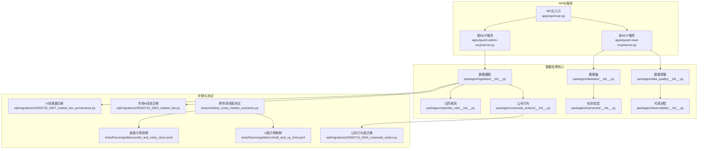
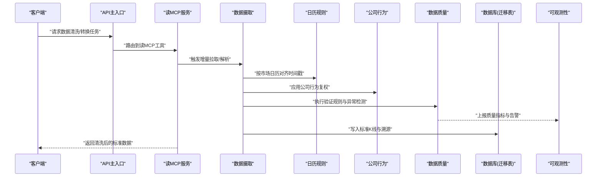
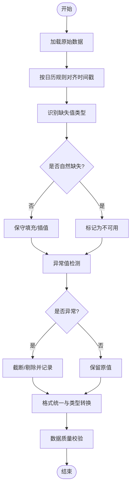
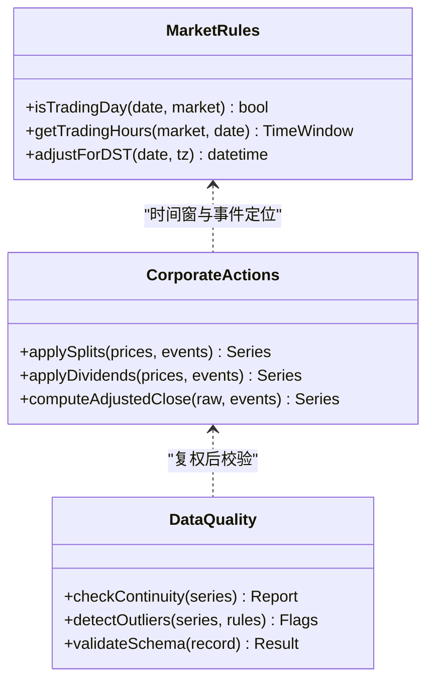
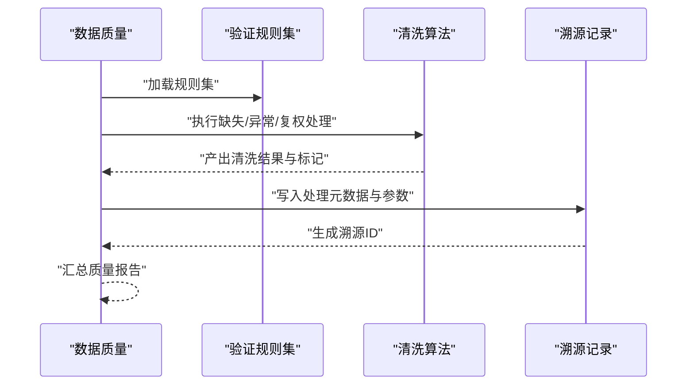
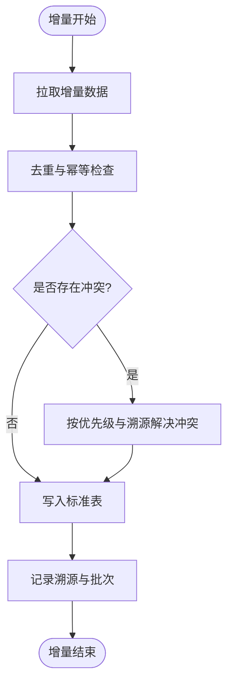
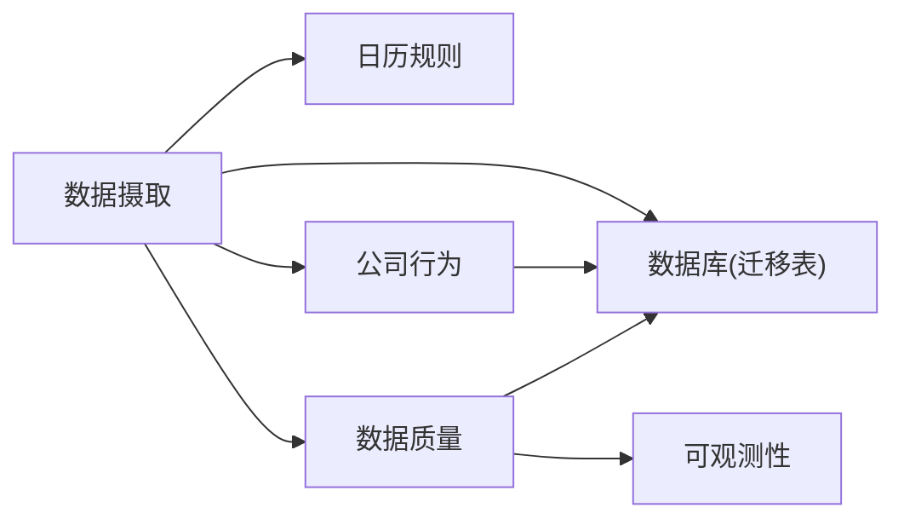

# 数据清洗与转换

<cite>
**本文引用的文件**   
- [apps/api/main.py](file://apps/api/main.py)
- [apps/quant-read-mcp/server.py](file://apps/quant-read-mcp/server.py)
- [apps/quant-admin-mcp/server.py](file://apps/quant-admin-mcp/server.py)
- [packages/data_quality/__init__.py](file://packages/data_quality/__init__.py)
- [packages/datasets/__init__.py](file://packages/datasets/__init__.py)
- [packages/ingestion/__init__.py](file://packages/ingestion/__init__.py)
- [packages/instrument/__init__.py](file://packages/instrument/__init__.py)
- [packages/corporate_actions/__init__.py](file://packages/corporate_actions/__init__.py)
- [packages/calendar_rule/__init__.py](file://packages/calendar_rule/__init__.py)
- [packages/observability/__init__.py](file://packages/observability/__init__.py)
- [sql/migrations/20260715_0003_market_bar.py](file://sql/migrations/20260715_0003_market_bar.py)
- [sql/migrations/20260715_0004_corporate_action.py](file://sql/migrations/20260715_0004_corporate_action.py)
- [sql/migrations/20260715_0007_market_bar_provenance.py](file://sql/migrations/20260715_0007_market_bar_provenance.py)
- [tests/unit/test_cross_market_scenarios.py](file://tests/unit/test_cross_market_scenarios.py)
- [tests/fixtures/golden/cn/halt_and_up_limit.jsonl](file://tests/fixtures/golden/cn/halt_and_up_limit.jsonl)
- [tests/fixtures/golden/us/dst_and_early_close.jsonl](file://tests/fixtures/golden/us/dst_and_early_close.jsonl)
</cite>

## 目录
1. [简介](#简介)
2. [项目结构](#项目结构)
3. [核心组件](#核心组件)
4. [架构总览](#架构总览)
5. [详细组件分析](#详细组件分析)
6. [依赖关系分析](#依赖关系分析)
7. [性能考虑](#性能考虑)
8. [故障排查指南](#故障排查指南)
9. [结论](#结论)
10. [附录](#附录)

## 简介
本文件面向量化交易MCP系统的数据清洗与转换模块，聚焦以下目标：
- 解释数据标准化流程：时间戳对齐、缺失值处理、异常值检测、数据格式统一。
- 说明跨市场特殊处理逻辑：A股停牌、涨跌停、美股盘前盘后、夏令时与提前收盘等。
- 记录数据验证规则与清洗算法的实现要点。
- 描述增量更新机制与冲突解决策略。
- 提供数据质量监控指标与告警配置方法。
- 给出性能优化技巧与内存管理策略。

## 项目结构
仓库采用多应用+多包的分层组织方式。与数据清洗与转换相关的代码主要分布在如下位置：
- API与服务入口：用于暴露数据读取、状态查询与调度能力。
- MCP服务：提供工具化接口，便于外部系统调用清洗与转换能力。
- 数据质量与数据集：封装校验、度量与标准数据集。
- 数据摄取与公司行为：负责原始数据接入与公司行为调整。
- 日历规则：提供各市场交易日历与节假日、早收、夏令时等规则。
- 可观测性：提供指标采集与日志追踪。
- 数据库迁移：定义市场K线、公司行为、溯源等表结构。

图表来源
- [apps/api/main.py](file://apps/api/main.py)
- [apps/quant-read-mcp/server.py](file://apps/quant-read-mcp/server.py)
- [apps/quant-admin-mcp/server.py](file://apps/quant-admin-mcp/server.py)
- [packages/data_quality/__init__.py](file://packages/data_quality/__init__.py)
- [packages/datasets/__init__.py](file://packages/datasets/__init__.py)
- [packages/ingestion/__init__.py](file://packages/ingestion/__init__.py)
- [packages/corporate_actions/__init__.py](file://packages/corporate_actions/__init__.py)
- [packages/calendar_rule/__init__.py](file://packages/calendar_rule/__init__.py)
- [packages/observability/__init__.py](file://packages/observability/__init__.py)
- [packages/instrument/__init__.py](file://packages/instrument/__init__.py)
- [sql/migrations/20260715_0003_market_bar.py](file://sql/migrations/20260715_0003_market_bar.py)
- [sql/migrations/20260715_0004_corporate_action.py](file://sql/migrations/20260715_0004_corporate_action.py)
- [sql/migrations/20260715_0007_market_bar_provenance.py](file://sql/migrations/20260715_0007_market_bar_provenance.py)
- [tests/unit/test_cross_market_scenarios.py](file://tests/unit/test_cross_market_scenarios.py)
- [tests/fixtures/golden/cn/halt_and_up_limit.jsonl](file://tests/fixtures/golden/cn/halt_and_up_limit.jsonl)
- [tests/fixtures/golden/us/dst_and_early_close.jsonl](file://tests/fixtures/golden/us/dst_and_early_close.jsonl)

章节来源
- [apps/api/main.py](file://apps/api/main.py)
- [apps/quant-read-mcp/server.py](file://apps/quant-read-mcp/server.py)
- [apps/quant-admin-mcp/server.py](file://apps/quant-admin-mcp/server.py)
- [packages/data_quality/__init__.py](file://packages/data_quality/__init__.py)
- [packages/datasets/__init__.py](file://packages/datasets/__init__.py)
- [packages/ingestion/__init__.py](file://packages/ingestion/__init__.py)
- [packages/corporate_actions/__init__.py](file://packages/corporate_actions/__init__.py)
- [packages/calendar_rule/__init__.py](file://packages/calendar_rule/__init__.py)
- [packages/observability/__init__.py](file://packages/observability/__init__.py)
- [packages/instrument/__init__.py](file://packages/instrument/__init__.py)
- [sql/migrations/20260715_0003_market_bar.py](file://sql/migrations/20260715_0003_market_bar.py)
- [sql/migrations/20260715_0004_corporate_action.py](file://sql/migrations/20260715_0004_corporate_action.py)
- [sql/migrations/20260715_0007_market_bar_provenance.py](file://sql/migrations/20260715_0007_market_bar_provenance.py)
- [tests/unit/test_cross_market_scenarios.py](file://tests/unit/test_cross_market_scenarios.py)
- [tests/fixtures/golden/cn/halt_and_up_limit.jsonl](file://tests/fixtures/golden/cn/halt_and_up_limit.jsonl)
- [tests/fixtures/golden/us/dst_and_early_close.jsonl](file://tests/fixtures/golden/us/dst_and_early_close.jsonl)

## 核心组件
- 数据质量（Data Quality）
  - 职责：定义并执行数据验证规则、统计质量指标、输出告警信号。
  - 关键能力：字段完整性检查、范围与一致性校验、时序连续性检查、跨源一致性比对。
- 数据集（Datasets）
  - 职责：提供标准数据集与基准用例，支撑清洗与转换的回归测试与验收。
  - 关键能力：加载黄金用例、构造边界条件、对比期望输出。
- 数据摄取（Ingestion）
  - 职责：对接外部数据源，完成拉取、解析、初步校验与入库。
  - 关键能力：增量拉取、去重、幂等写入、溯源标记。
- 公司行为（Corporate Actions）
  - 职责：处理除权除息、拆合股、分红等事件对价格序列的影响。
  - 关键能力：事件时间定位、复权计算、前后向一致性校验。
- 日历规则（Calendar Rule）
  - 职责：维护各市场交易日历、节假日、早收、夏令时切换等。
  - 关键能力：交易日判定、时间窗口裁剪、跨时区对齐。
- 可观测性（Observability）
  - 职责：采集清洗与转换过程中的指标与日志，支持监控与告警。
  - 关键能力：计数、直方图、延迟、错误率、数据新鲜度。
- 标的信息（Instrument）
  - 职责：维护标的基础信息与属性，辅助清洗与转换时的上下文判断。
  - 关键能力：标的ID规范、上市退市状态、交易时段、币种与合约乘数。

章节来源
- [packages/data_quality/__init__.py](file://packages/data_quality/__init__.py)
- [packages/datasets/__init__.py](file://packages/datasets/__init__.py)
- [packages/ingestion/__init__.py](file://packages/ingestion/__init__.py)
- [packages/corporate_actions/__init__.py](file://packages/corporate_actions/__init__.py)
- [packages/calendar_rule/__init__.py](file://packages/calendar_rule/__init__.py)
- [packages/observability/__init__.py](file://packages/observability/__init__.py)
- [packages/instrument/__init__.py](file://packages/instrument/__init__.py)

## 架构总览
数据清洗与转换的整体流程从API/MCP入口进入，经数据摄取与日历规则驱动，结合公司行为与数据质量规则进行标准化与校验，最终落库并输出可观测指标。

图表来源
- [apps/api/main.py](file://apps/api/main.py)
- [apps/quant-read-mcp/server.py](file://apps/quant-read-mcp/server.py)
- [packages/ingestion/__init__.py](file://packages/ingestion/__init__.py)
- [packages/calendar_rule/__init__.py](file://packages/calendar_rule/__init__.py)
- [packages/corporate_actions/__init__.py](file://packages/corporate_actions/__init__.py)
- [packages/data_quality/__init__.py](file://packages/data_quality/__init__.py)
- [packages/observability/__init__.py](file://packages/observability/__init__.py)
- [sql/migrations/20260715_0003_market_bar.py](file://sql/migrations/20260715_0003_market_bar.py)
- [sql/migrations/20260715_0007_market_bar_provenance.py](file://sql/migrations/20260715_0007_market_bar_provenance.py)

## 详细组件分析

### 数据标准化流程
- 时间戳对齐
  - 基于日历规则将不同市场的本地时间转换为统一UTC或业务时区。
  - 处理夏令时切换、提前收盘、周末与非交易日，确保时间轴连续且无重复。
- 缺失值处理
  - 识别非交易导致的自然缺失与异常缺失。
  - 对自然缺失不进行插值；对异常缺失采用保守策略（如前值填充或标记为不可用）。
- 异常值检测
  - 基于价格跳变阈值、成交量异常、涨跌停限制等进行检测。
  - 结合公司行为事件区分真实跳价与需复权的价格变化。
- 数据格式统一
  - 统一字段命名、数据类型与时区表示。
  - 统一标的ID格式与编码，确保跨源一致。

章节来源
- [packages/calendar_rule/__init__.py](file://packages/calendar_rule/__init__.py)
- [packages/data_quality/__init__.py](file://packages/data_quality/__init__.py)
- [packages/ingestion/__init__.py](file://packages/ingestion/__init__.py)

### 跨市场特殊处理逻辑
- A股场景
  - 停牌：在停牌期间不产生有效交易，时间轴上应保留空位或标记不可用，避免误插值。
  - 涨跌停：价格触及涨跌停时需结合规则进行异常标记，防止被误判为异常值。
- 美股场景
  - 盘前盘后：扩展交易时段需明确标注时段标签，避免与常规时段混淆。
  - 夏令时与提前收盘：依据日历规则进行时间对齐与窗口裁剪。
- 黄金用例与测试
  - 使用固定用例覆盖上述场景，确保清洗与转换结果稳定可复现。

图表来源
- [packages/calendar_rule/__init__.py](file://packages/calendar_rule/__init__.py)
- [packages/corporate_actions/__init__.py](file://packages/corporate_actions/__init__.py)
- [packages/data_quality/__init__.py](file://packages/data_quality/__init__.py)
- [tests/unit/test_cross_market_scenarios.py](file://tests/unit/test_cross_market_scenarios.py)
- [tests/fixtures/golden/cn/halt_and_up_limit.jsonl](file://tests/fixtures/golden/cn/halt_and_up_limit.jsonl)
- [tests/fixtures/golden/us/dst_and_early_close.jsonl](file://tests/fixtures/golden/us/dst_and_early_close.jsonl)

章节来源
- [tests/unit/test_cross_market_scenarios.py](file://tests/unit/test_cross_market_scenarios.py)
- [tests/fixtures/golden/cn/halt_and_up_limit.jsonl](file://tests/fixtures/golden/cn/halt_and_up_limit.jsonl)
- [tests/fixtures/golden/us/dst_and_early_close.jsonl](file://tests/fixtures/golden/us/dst_and_early_close.jsonl)
- [packages/calendar_rule/__init__.py](file://packages/calendar_rule/__init__.py)
- [packages/corporate_actions/__init__.py](file://packages/corporate_actions/__init__.py)
- [packages/data_quality/__init__.py](file://packages/data_quality/__init__.py)

### 数据验证规则与清洗算法实现细节
- 验证规则
  - 必填字段与类型约束：确保每条记录具备必要字段且类型正确。
  - 时序约束：时间戳单调递增、无重复、符合交易日历。
  - 数值约束：价格非负、成交量非负、涨跌幅合理范围。
  - 一致性约束：开盘≤最高≤收盘≥最低；复权前后关系合理。
- 清洗算法
  - 缺失值：区分自然缺失与异常缺失，前者保留空位，后者采用保守填充。
  - 异常值：基于阈值与分布检测，结合公司行为事件进行二次确认。
  - 复权：根据拆合股与分红事件计算调整后价格，保证回测一致性。
- 溯源与审计
  - 记录数据来源、版本、处理步骤与参数，便于问题回溯。

图表来源
- [packages/data_quality/__init__.py](file://packages/data_quality/__init__.py)
- [sql/migrations/20260715_0007_market_bar_provenance.py](file://sql/migrations/20260715_0007_market_bar_provenance.py)

章节来源
- [packages/data_quality/__init__.py](file://packages/data_quality/__init__.py)
- [sql/migrations/20260715_0007_market_bar_provenance.py](file://sql/migrations/20260715_0007_market_bar_provenance.py)

### 增量数据更新机制与冲突解决策略
- 增量更新
  - 基于时间窗口与上游变更事件进行增量拉取，减少全量成本。
  - 使用幂等键与去重策略，确保多次运行结果一致。
- 冲突解决
  - 同时间点多条记录：以权威源优先级、时间戳精度与溯源可信度决定取舍。
  - 公司行为事件冲突：以生效时间与公告来源为准，必要时人工复核。
- 回滚与补偿
  - 通过溯源ID与批次号支持局部回滚与补偿写入。

章节来源
- [packages/ingestion/__init__.py](file://packages/ingestion/__init__.py)
- [sql/migrations/20260715_0003_market_bar.py](file://sql/migrations/20260715_0003_market_bar.py)
- [sql/migrations/20260715_0007_market_bar_provenance.py](file://sql/migrations/20260715_0007_market_bar_provenance.py)

### 数据质量监控指标与告警配置
- 指标类别
  - 完整性：缺失比例、必填字段覆盖率。
  - 准确性：异常值比例、复权一致性比率。
  - 时效性：数据新鲜度、延迟分布。
  - 可用性：交易日历覆盖率、时间轴连续性。
- 告警策略
  - 阈值告警：当缺失或异常比例超过阈值时触发。
  - 趋势告警：连续多个周期指标恶化时触发。
  - 事件告警：公司行为事件集中出现时提示复核。
- 可视化与集成
  - 通过可观测性模块导出指标，对接监控系统与告警通道。

章节来源
- [packages/observability/__init__.py](file://packages/observability/__init__.py)
- [packages/data_quality/__init__.py](file://packages/data_quality/__init__.py)

### 性能优化与内存管理策略
- 流式处理
  - 分块读取与处理，降低峰值内存占用。
- 并行与批处理
  - 按标的或时间窗口并行处理，提升吞吐。
- 索引与存储
  - 在时间戳与标的ID上建立索引，加速查询与合并。
- 缓存与复用
  - 缓存日历规则与公司行为事件，减少重复计算。
- 资源控制
  - 设置并发上限与超时，避免资源耗尽。

章节来源
- [packages/ingestion/__init__.py](file://packages/ingestion/__init__.py)
- [packages/calendar_rule/__init__.py](file://packages/calendar_rule/__init__.py)
- [packages/corporate_actions/__init__.py](file://packages/corporate_actions/__init__.py)

## 依赖关系分析
- 组件耦合
  - 数据摄取依赖日历规则与公司行为，数据质量贯穿全流程。
  - 可观测性作为横切关注点，采集各环节指标。
- 外部依赖
  - 数据库迁移定义标准表结构与溯源表，保障数据持久化与可追溯。
- 潜在循环依赖
  - 通过分层与接口隔离避免循环依赖，保持高内聚低耦合。

图表来源
- [packages/ingestion/__init__.py](file://packages/ingestion/__init__.py)
- [packages/calendar_rule/__init__.py](file://packages/calendar_rule/__init__.py)
- [packages/corporate_actions/__init__.py](file://packages/corporate_actions/__init__.py)
- [packages/data_quality/__init__.py](file://packages/data_quality/__init__.py)
- [packages/observability/__init__.py](file://packages/observability/__init__.py)
- [sql/migrations/20260715_0003_market_bar.py](file://sql/migrations/20260715_0003_market_bar.py)
- [sql/migrations/20260715_0004_corporate_action.py](file://sql/migrations/20260715_0004_corporate_action.py)
- [sql/migrations/20260715_0007_market_bar_provenance.py](file://sql/migrations/20260715_0007_market_bar_provenance.py)

章节来源
- [packages/ingestion/__init__.py](file://packages/ingestion/__init__.py)
- [packages/calendar_rule/__init__.py](file://packages/calendar_rule/__init__.py)
- [packages/corporate_actions/__init__.py](file://packages/corporate_actions/__init__.py)
- [packages/data_quality/__init__.py](file://packages/data_quality/__init__.py)
- [packages/observability/__init__.py](file://packages/observability/__init__.py)
- [sql/migrations/20260715_0003_market_bar.py](file://sql/migrations/20260715_0003_market_bar.py)
- [sql/migrations/20260715_0004_corporate_action.py](file://sql/migrations/20260715_0004_corporate_action.py)
- [sql/migrations/20260715_0007_market_bar_provenance.py](file://sql/migrations/20260715_0007_market_bar_provenance.py)

## 性能考虑
- 建议采用流式与批处理结合的方式，平衡延迟与吞吐。
- 对热点标的与高频事件进行缓存，减少重复计算。
- 利用数据库索引与分区策略，优化查询与写入性能。
- 监控资源使用，动态调整并发与批大小，避免OOM与CPU抖动。

[本节为通用指导，无需具体文件引用]

## 故障排查指南
- 常见问题
  - 时间戳错位：检查日历规则与时区配置，确认夏令时切换处理。
  - 缺失值过多：核对上游数据源与拉取窗口，区分自然缺失与异常缺失。
  - 异常值误报：结合公司行为事件与涨跌停规则进行二次校验。
  - 增量冲突：查看溯源记录与批次号，确认权威源优先级与幂等键。
- 定位手段
  - 通过可观测性指标快速定位异常环节。
  - 使用黄金用例与测试脚本复现场景，缩小问题范围。

章节来源
- [packages/observability/__init__.py](file://packages/observability/__init__.py)
- [packages/data_quality/__init__.py](file://packages/data_quality/__init__.py)
- [tests/unit/test_cross_market_scenarios.py](file://tests/unit/test_cross_market_scenarios.py)

## 结论
本模块围绕数据标准化与跨市场特殊处理，构建了完整的清洗与转换流水线。通过日历规则、公司行为与数据质量规则的协同，实现了稳健的时间对齐、缺失与异常处理以及格式统一。增量更新与溯源机制保障了数据的可维护性与可追溯性。配合可观测性指标与告警策略，可在生产环境中持续监控数据质量与系统健康。

[本节为总结性内容，无需具体文件引用]

## 附录
- 相关迁移表
  - 市场K线表：定义标准K线数据结构与索引。
  - 公司行为表：记录拆合股、分红等事件。
  - K线溯源表：记录数据来源、版本与处理步骤。
- 参考用例
  - A股停牌与涨跌停用例。
  - 美股夏令时与提前收盘用例。

章节来源
- [sql/migrations/20260715_0003_market_bar.py](file://sql/migrations/20260715_0003_market_bar.py)
- [sql/migrations/20260715_0004_corporate_action.py](file://sql/migrations/20260715_0004_corporate_action.py)
- [sql/migrations/20260715_0007_market_bar_provenance.py](file://sql/migrations/20260715_0007_market_bar_provenance.py)
- [tests/fixtures/golden/cn/halt_and_up_limit.jsonl](file://tests/fixtures/golden/cn/halt_and_up_limit.jsonl)
- [tests/fixtures/golden/us/dst_and_early_close.jsonl](file://tests/fixtures/golden/us/dst_and_early_close.jsonl)