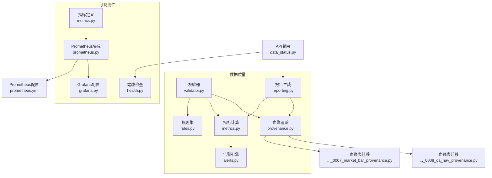
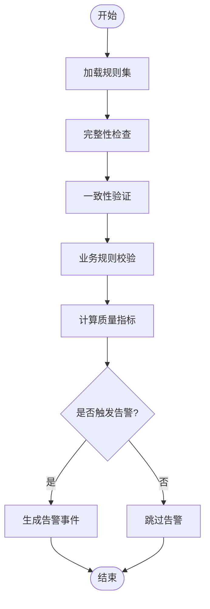
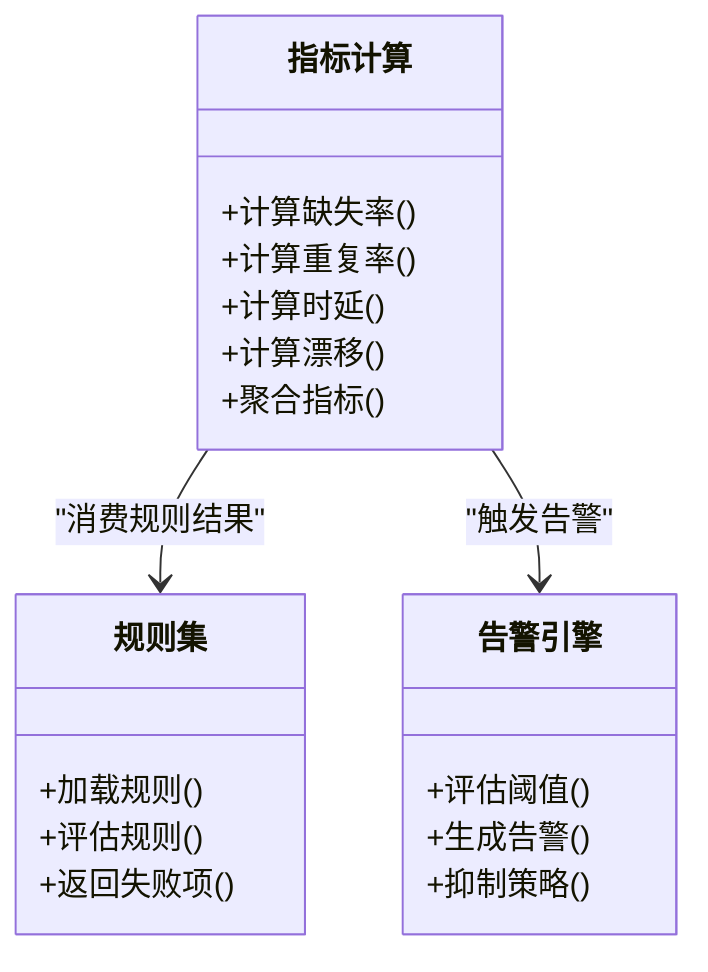
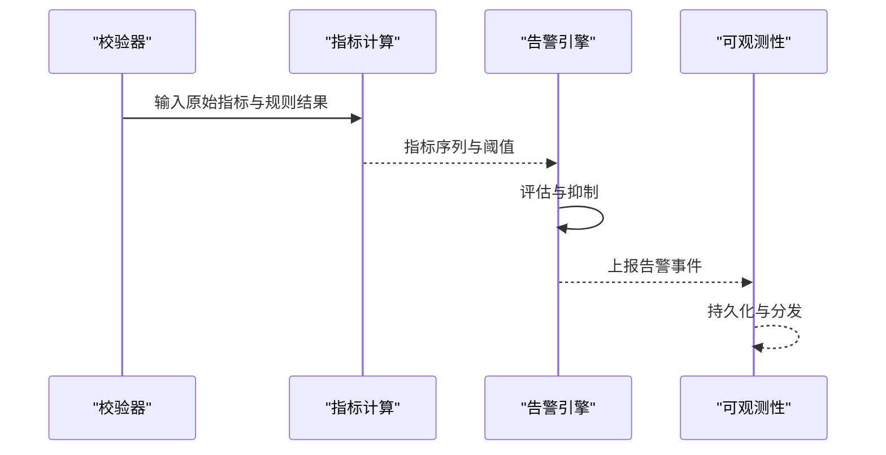
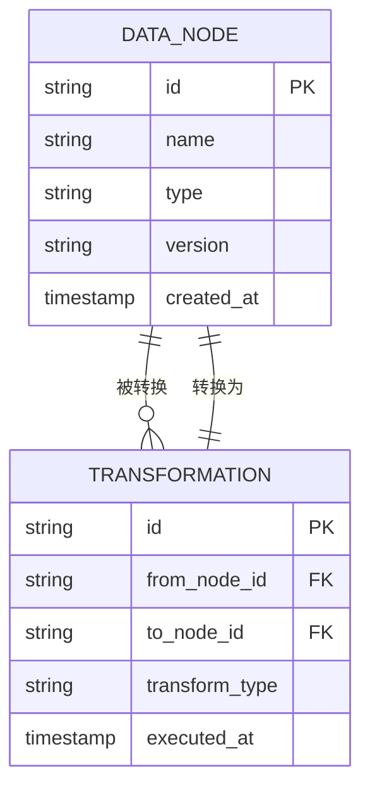
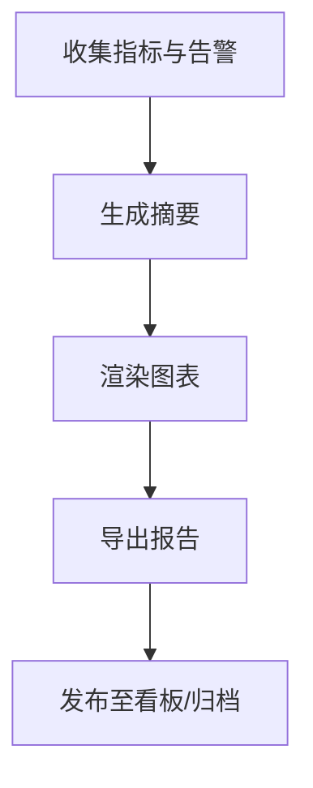
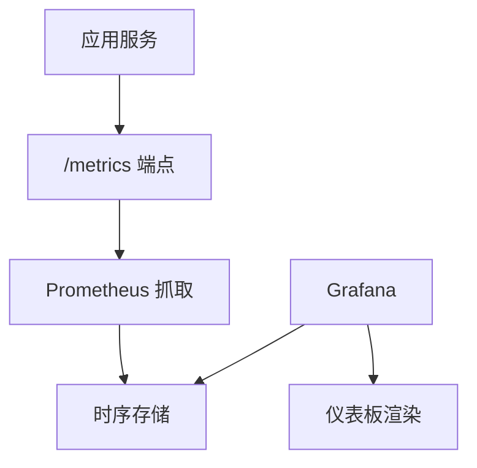
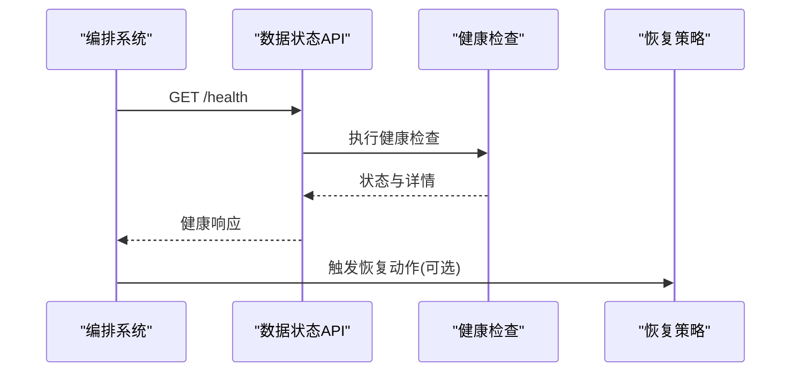
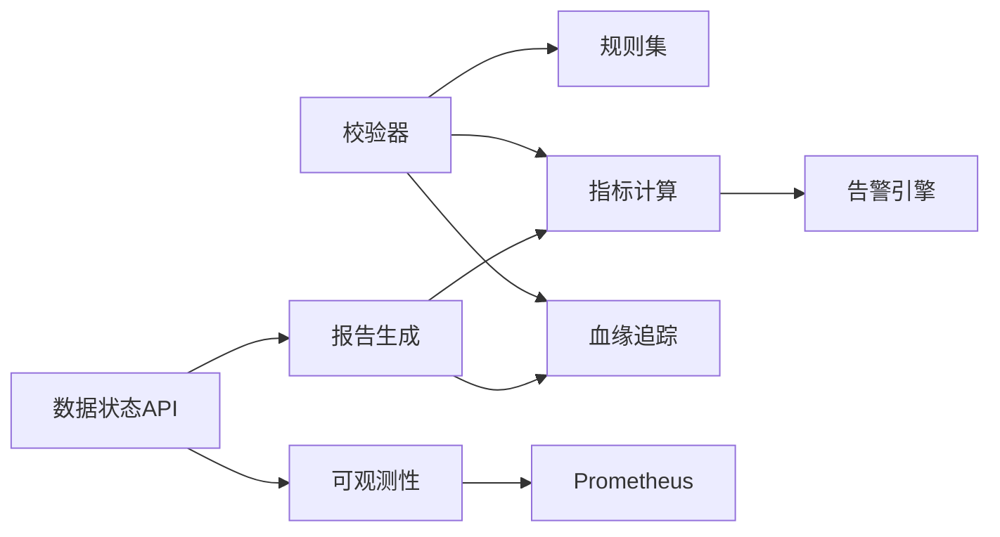

# 数据验证与监控

<cite>
**本文引用的文件**   
- [data_quality/__init__.py](file://packages/data_quality/__init__.py)
- [data_quality/validator.py](file://packages/data_quality/validator.py)
- [data_quality/rules.py](file://packages/data_quality/rules.py)
- [data_quality/metrics.py](file://packages/data_quality/metrics.py)
- [data_quality/alerts.py](file://packages/data_quality/alerts.py)
- [data_quality/provenance.py](file://packages/data_quality/provenance.py)
- [data_quality/reporting.py](file://packages/data_quality/reporting.py)
- [observability/metrics.py](file://packages/observability/metrics.py)
- [observability/prometheus.py](file://packages/observability/prometheus.py)
- [observability/grafana.py](file://packages/observability/grafana.py)
- [observability/health.py](file://packages/observability/health.py)
- [api/routers/data_status.py](file://apps/api/routers/data_status.py)
- [deploy/prometheus.yml](file://deploy/prometheus.yml)
- [sql/migrations/20260715_0007_market_bar_provenance.py](file://sql/migrations/20260715_0007_market_bar_provenance.py)
- [sql/migrations/20260715_0008_ca_nav_provenance.py](file://sql/migrations/20260715_0008_ca_nav_provenance.py)
</cite>

## 目录
1. [简介](#简介)
2. [项目结构](#项目结构)
3. [核心组件](#核心组件)
4. [架构总览](#架构总览)
5. [详细组件分析](#详细组件分析)
6. [依赖关系分析](#依赖关系分析)
7. [性能考量](#性能考量)
8. [故障排查指南](#故障排查指南)
9. [结论](#结论)
10. [附录](#附录)

## 简介
本文件面向量化交易MCP系统的数据验证与监控模块，系统性阐述以下能力：
- 数据完整性检查、一致性验证与业务规则校验的实现机制
- 数据质量指标的采集与计算方法
- 异常检测与告警触发逻辑
- 数据血缘追踪与变更影响分析
- 数据质量报告生成与可视化展示
- 监控指标Prometheus集成与Grafana仪表板配置
- 数据管道健康检查与故障恢复机制

## 项目结构
数据验证与监控相关代码主要分布在两个包中：
- packages/data_quality：负责数据质量规则、校验器、指标计算、告警、血缘与报告
- packages/observability：负责可观测性（指标、Prometheus、Grafana、健康检查）
- apps/api/routers/data_status.py：对外暴露数据状态查询接口
- deploy/prometheus.yml：Prometheus抓取配置
- sql/migrations/*provenance.py：血缘元数据表结构迁移



图表来源
- [data_quality/validator.py](file://packages/data_quality/validator.py)
- [data_quality/rules.py](file://packages/data_quality/rules.py)
- [data_quality/metrics.py](file://packages/data_quality/metrics.py)
- [data_quality/alerts.py](file://packages/data_quality/alerts.py)
- [data_quality/provenance.py](file://packages/data_quality/provenance.py)
- [data_quality/reporting.py](file://packages/data_quality/reporting.py)
- [observability/metrics.py](file://packages/observability/metrics.py)
- [observability/prometheus.py](file://packages/observability/prometheus.py)
- [observability/grafana.py](file://packages/observability/grafana.py)
- [observability/health.py](file://packages/observability/health.py)
- [api/routers/data_status.py](file://apps/api/routers/data_status.py)
- [deploy/prometheus.yml](file://deploy/prometheus.yml)
- [sql/migrations/20260715_0007_market_bar_provenance.py](file://sql/migrations/20260715_0007_market_bar_provenance.py)
- [sql/migrations/20260715_0008_ca_nav_provenance.py](file://sql/migrations/20260715_0008_ca_nav_provenance.py)

章节来源
- [data_quality/validator.py](file://packages/data_quality/validator.py)
- [data_quality/rules.py](file://packages/data_quality/rules.py)
- [data_quality/metrics.py](file://packages/data_quality/metrics.py)
- [data_quality/alerts.py](file://packages/data_quality/alerts.py)
- [data_quality/provenance.py](file://packages/data_quality/provenance.py)
- [data_quality/reporting.py](file://packages/data_quality/reporting.py)
- [observability/metrics.py](file://packages/observability/metrics.py)
- [observability/prometheus.py](file://packages/observability/prometheus.py)
- [observability/grafana.py](file://packages/observability/grafana.py)
- [observability/health.py](file://packages/observability/health.py)
- [api/routers/data_status.py](file://apps/api/routers/data_status.py)
- [deploy/prometheus.yml](file://deploy/prometheus.yml)
- [sql/migrations/20260715_0007_market_bar_provenance.py](file://sql/migrations/20260715_0007_market_bar_provenance.py)
- [sql/migrations/20260715_0008_ca_nav_provenance.py](file://sql/migrations/20260715_0008_ca_nav_provenance.py)

## 核心组件
- 校验器（Validator）：编排完整性、一致性与业务规则校验流程，产出校验结果与中间指标。
- 规则集（Rules）：集中管理各类规则定义与阈值，支持按数据集/时间窗口/标的维度选择。
- 指标计算（Metrics）：实现缺失率、重复率、时延、分布漂移等质量指标的计算与聚合。
- 告警引擎（Alerts）：基于指标越界或规则失败触发告警，支持分级与抑制策略。
- 血缘追踪（Provenance）：记录数据从源到下游的流转路径与版本信息，支撑影响分析。
- 报告生成（Reporting）：汇总指标与告警，输出结构化报告并支持可视化导出。
- 可观测性（Observability）：定义指标、对接Prometheus、提供Grafana面板与系统健康检查。

章节来源
- [data_quality/validator.py](file://packages/data_quality/validator.py)
- [data_quality/rules.py](file://packages/data_quality/rules.py)
- [data_quality/metrics.py](file://packages/data_quality/metrics.py)
- [data_quality/alerts.py](file://packages/data_quality/alerts.py)
- [data_quality/provenance.py](file://packages/data_quality/provenance.py)
- [data_quality/reporting.py](file://packages/data_quality/reporting.py)
- [observability/metrics.py](file://packages/observability/metrics.py)
- [observability/prometheus.py](file://packages/observability/prometheus.py)
- [observability/grafana.py](file://packages/observability/grafana.py)
- [observability/health.py](file://packages/observability/health.py)

## 架构总览
数据验证与监控在“采集—校验—度量—告警—报告—可视化”链路中协同工作，并通过API暴露数据状态与健康信息。

```mermaid
sequenceDiagram
participant Pipe as "数据管道"
participant Val as "校验器"
participant Rul as "规则集"
participant Met as "指标计算"
participant Alt as "告警引擎"
participant Prov as "血缘追踪"
participant Rep as "报告生成"
participant Obs as "可观测性"
participant API as "数据状态API"
participant Prom as "Prometheus"
participant Graf as "Grafana"
Pipe->>Val : 提交待校验数据批次
Val->>Rul : 加载并执行规则
Val->>Met : 计算质量指标
Met-->>Alt : 指标与规则结果
Alt-->>Obs : 上报指标/事件
Val->>Prov : 写入血缘元数据
Val->>Rep : 生成质量报告
API->>Obs : 读取健康与指标
API->>Rep : 获取报告摘要
Obs->>Prom : 持久化指标
Graf->>Prom : 拉取指标渲染面板
```

图表来源
- [data_quality/validator.py](file://packages/data_quality/validator.py)
- [data_quality/rules.py](file://packages/data_quality/rules.py)
- [data_quality/metrics.py](file://packages/data_quality/metrics.py)
- [data_quality/alerts.py](file://packages/data_quality/alerts.py)
- [data_quality/provenance.py](file://packages/data_quality/provenance.py)
- [data_quality/reporting.py](file://packages/data_quality/reporting.py)
- [observability/metrics.py](file://packages/observability/metrics.py)
- [observability/prometheus.py](file://packages/observability/prometheus.py)
- [observability/grafana.py](file://packages/observability/grafana.py)
- [api/routers/data_status.py](file://apps/api/routers/data_status.py)
- [deploy/prometheus.yml](file://deploy/prometheus.yml)

## 详细组件分析

### 数据完整性检查、一致性验证与业务规则校验
- 完整性检查：覆盖必填字段、时间戳连续性、主键唯一性、分区/分片完整性等。
- 一致性验证：跨源对齐、口径一致性、数值范围与单位统一、关联外键一致性。
- 业务规则校验：涨跌停、停牌、除权除息、基金申赎截止等市场与资产特有规则。



图表来源
- [data_quality/validator.py](file://packages/data_quality/validator.py)
- [data_quality/rules.py](file://packages/data_quality/rules.py)
- [data_quality/metrics.py](file://packages/data_quality/metrics.py)
- [data_quality/alerts.py](file://packages/data_quality/alerts.py)

章节来源
- [data_quality/validator.py](file://packages/data_quality/validator.py)
- [data_quality/rules.py](file://packages/data_quality/rules.py)
- [data_quality/metrics.py](file://packages/data_quality/metrics.py)
- [data_quality/alerts.py](file://packages/data_quality/alerts.py)

### 数据质量指标收集与计算
- 指标类别：
  - 完整性：缺失率、空值比例、主键冲突数
  - 时效性：入仓延迟、处理耗时、端到端时延
  - 准确性：范围越界、符号错误、单位不一致
  - 一致性：跨源差异、关联缺失、外键不匹配
  - 稳定性：分布漂移、统计量波动
- 计算方式：按批次/时间窗口/标的维度聚合，支持滑动窗口与同比环比对比。
- 存储与上报：指标经可观测性层写入Prometheus，同时保留历史快照用于报告。



图表来源
- [data_quality/metrics.py](file://packages/data_quality/metrics.py)
- [data_quality/rules.py](file://packages/data_quality/rules.py)
- [data_quality/alerts.py](file://packages/data_quality/alerts.py)

章节来源
- [data_quality/metrics.py](file://packages/data_quality/metrics.py)
- [data_quality/rules.py](file://packages/data_quality/rules.py)
- [data_quality/alerts.py](file://packages/data_quality/alerts.py)

### 异常检测与告警触发逻辑
- 异常检测：基于规则失败、指标越界、统计异常（如突变点）进行识别。
- 告警策略：分级（提示/警告/严重）、抑制（同因合并、冷却期）、升级（长时间未恢复）。
- 通知通道：通过可观测性层将告警事件标准化，便于接入邮件、IM或工单系统。



图表来源
- [data_quality/validator.py](file://packages/data_quality/validator.py)
- [data_quality/metrics.py](file://packages/data_quality/metrics.py)
- [data_quality/alerts.py](file://packages/data_quality/alerts.py)
- [observability/metrics.py](file://packages/observability/metrics.py)

章节来源
- [data_quality/alerts.py](file://packages/data_quality/alerts.py)
- [observability/metrics.py](file://packages/observability/metrics.py)

### 数据血缘追踪与变更影响分析
- 血缘记录：记录数据源、转换步骤、目标表/主题、版本哈希、时间戳与责任人。
- 影响分析：基于血缘图向上游追溯与向下游传播，评估变更对下游模型/报表的影响范围。
- 存储：通过数据库迁移创建血缘元数据表，确保可审计与可回溯。



图表来源
- [data_quality/provenance.py](file://packages/data_quality/provenance.py)
- [sql/migrations/20260715_0007_market_bar_provenance.py](file://sql/migrations/20260715_0007_market_bar_provenance.py)
- [sql/migrations/20260715_0008_ca_nav_provenance.py](file://sql/migrations/20260715_0008_ca_nav_provenance.py)

章节来源
- [data_quality/provenance.py](file://packages/data_quality/provenance.py)
- [sql/migrations/20260715_0007_market_bar_provenance.py](file://sql/migrations/20260715_0007_market_bar_provenance.py)
- [sql/migrations/20260715_0008_ca_nav_provenance.py](file://sql/migrations/20260715_0008_ca_nav_provenance.py)

### 数据质量报告生成与可视化展示
- 报告内容：指标摘要、规则通过率、告警清单、血缘快照、趋势对比。
- 输出格式：结构化JSON与可视化图表（PNG/PDF），支持定时推送与按需下载。
- 可视化：结合Grafana面板与内部报告视图，提供多维筛选与钻取。



图表来源
- [data_quality/reporting.py](file://packages/data_quality/reporting.py)
- [observability/grafana.py](file://packages/observability/grafana.py)

章节来源
- [data_quality/reporting.py](file://packages/data_quality/reporting.py)
- [observability/grafana.py](file://packages/observability/grafana.py)

### 监控指标Prometheus集成与Grafana仪表板配置
- 指标定义：在可观测性层定义指标名称、标签与类型。
- Prometheus集成：服务以HTTP暴露指标端点，Prometheus按配置文件抓取。
- Grafana面板：导入预置面板，绑定Prometheus数据源，配置刷新频率与过滤条件。



图表来源
- [observability/metrics.py](file://packages/observability/metrics.py)
- [observability/prometheus.py](file://packages/observability/prometheus.py)
- [observability/grafana.py](file://packages/observability/grafana.py)
- [deploy/prometheus.yml](file://deploy/prometheus.yml)

章节来源
- [observability/metrics.py](file://packages/observability/metrics.py)
- [observability/prometheus.py](file://packages/observability/prometheus.py)
- [observability/grafana.py](file://packages/observability/grafana.py)
- [deploy/prometheus.yml](file://deploy/prometheus.yml)

### 数据管道健康检查与故障恢复机制
- 健康检查：进程存活、依赖可达（数据库、消息队列、外部API）、关键指标阈值。
- 故障恢复：自动重试、退避策略、熔断降级、补偿任务与人工干预入口。
- 状态暴露：通过API提供健康与就绪探针，供调度与编排系统使用。



图表来源
- [api/routers/data_status.py](file://apps/api/routers/data_status.py)
- [observability/health.py](file://packages/observability/health.py)

章节来源
- [api/routers/data_status.py](file://apps/api/routers/data_status.py)
- [observability/health.py](file://packages/observability/health.py)

## 依赖关系分析
- 内聚与耦合：
  - 校验器强依赖规则集与指标计算；告警引擎依赖指标与规则结果；血缘与报告为横向支撑。
  - 可观测性层独立于业务逻辑，仅通过标准指标接口交互。
- 外部依赖：
  - Prometheus抓取配置由部署配置驱动；数据库迁移提供血缘元数据存储。
- 潜在循环依赖：
  - 建议避免报告模块反向依赖校验器，改为只读消费指标与血缘快照。



图表来源
- [data_quality/validator.py](file://packages/data_quality/validator.py)
- [data_quality/rules.py](file://packages/data_quality/rules.py)
- [data_quality/metrics.py](file://packages/data_quality/metrics.py)
- [data_quality/alerts.py](file://packages/data_quality/alerts.py)
- [data_quality/provenance.py](file://packages/data_quality/provenance.py)
- [data_quality/reporting.py](file://packages/data_quality/reporting.py)
- [observability/metrics.py](file://packages/observability/metrics.py)
- [observability/prometheus.py](file://packages/observability/prometheus.py)
- [api/routers/data_status.py](file://apps/api/routers/data_status.py)

章节来源
- [data_quality/validator.py](file://packages/data_quality/validator.py)
- [data_quality/rules.py](file://packages/data_quality/rules.py)
- [data_quality/metrics.py](file://packages/data_quality/metrics.py)
- [data_quality/alerts.py](file://packages/data_quality/alerts.py)
- [data_quality/provenance.py](file://packages/data_quality/provenance.py)
- [data_quality/reporting.py](file://packages/data_quality/reporting.py)
- [observability/metrics.py](file://packages/observability/metrics.py)
- [observability/prometheus.py](file://packages/observability/prometheus.py)
- [api/routers/data_status.py](file://apps/api/routers/data_status.py)

## 性能考量
- 批处理与流式并行：对大规模数据采用分片并行校验与指标聚合，降低端到端时延。
- 指标采样与降采样：高频指标在Prometheus侧进行降采样，减少存储与查询压力。
- 规则惰性加载：按需加载规则集，避免冷启动开销。
- 血缘写入异步化：血缘元数据写入采用异步批写，避免阻塞主流程。

[本节为通用指导，无需特定文件引用]

## 故障排查指南
- 常见问题定位：
  - 指标缺失：检查Prometheus抓取配置与端点可达性
  - 告警风暴：审查抑制策略与冷却期设置
  - 血缘不完整：核对迁移脚本与写入时机
  - 健康检查失败：查看依赖服务状态与资源占用
- 诊断工具：
  - 通过数据状态API获取健康与指标摘要
  - 在Grafana中检索异常时段的面板与日志关联
  - 使用血缘查询定位问题数据节点与上游来源

章节来源
- [api/routers/data_status.py](file://apps/api/routers/data_status.py)
- [observability/health.py](file://packages/observability/health.py)
- [deploy/prometheus.yml](file://deploy/prometheus.yml)

## 结论
数据验证与监控模块通过“规则+指标+告警+血缘+报告+可观测性”的闭环设计，保障数据质量与系统可观测性。借助Prometheus与Grafana，可实现持续监控与快速排障；通过血缘追踪与影响分析，提升变更可控性与可审计性。建议在后续迭代中完善报告自动化与告警治理策略，进一步提升运维效率与数据可信度。

[本节为总结性内容，无需特定文件引用]

## 附录
- 术语说明：
  - 完整性：数据是否存在必要信息与连续时间序列
  - 一致性：多源或多阶段数据的口径与关联关系一致
  - 业务规则：领域特定的约束与逻辑（如涨跌停、停牌、除权除息）
  - 血缘：数据从源到目标的流转路径与版本信息
  - 健康检查：系统或服务可用性的探测与判定

[本节为概念性内容，无需特定文件引用]